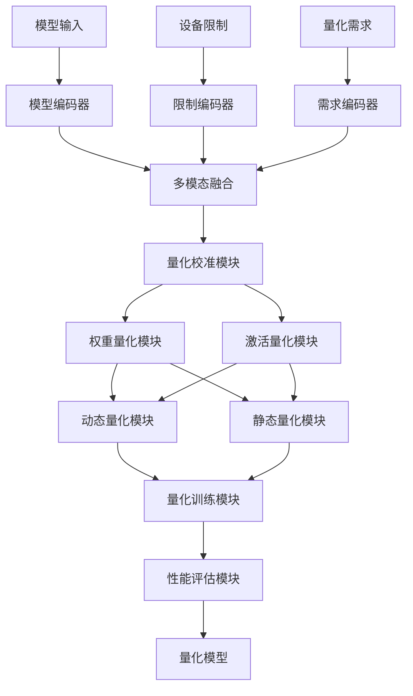
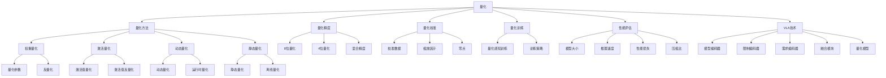

# 量化详解

## 📋 文档说明

本文档是量化（Quantization）的详细理论讲解，比父目录的《模型压缩详解》更加深入和详细。本文档将深入讲解量化的原理、数学推导和实现细节。

**学习方式**：本文档是Markdown格式，包含详细的理论讲解和数学推导。

---

## 📚 术语表（按出现顺序）

### 1. 量化 (Quantization)
- **中文名称**：量化
- **英文全称**：Quantization
- **定义**：量化是指减少VLA模型参数精度的方法，是模型压缩的重要技术。量化的目标是在保持模型性能的同时，减少参数精度，从而减少模型大小和推理时间。量化的方法包括权重量化（将权重从32位浮点数减少到8位整数、4位整数等）、激活量化（将激活值从32位浮点数减少到8位整数等）、动态量化（在推理时动态量化）、静态量化（在训练后静态量化）等。量化的优势在于能够显著减少模型大小和推理时间，降低计算资源和存储需求，使模型能够在资源受限的环境中运行。量化的劣势在于可能降低模型性能，需要在精度和性能之间找到平衡点。量化在VLA中的应用包括减少模型大小，提高推理速度，降低存储需求，使模型能够在边缘设备上运行。量化的核心思想是：将高精度的浮点数参数映射到低精度的整数参数，通过量化参数和反量化参数实现精度的转换。
- **核心组成**：量化的核心组成包括：1）量化方法：选择合适的量化方法，如权重量化、激活量化、动态量化、静态量化等；2）量化精度：选择合适的量化精度，如8位整数、4位整数等；3）量化校准：使用校准数据校准量化参数，减少量化误差；4）量化训练：在训练时进行量化，提高量化效果；5）量化评估：评估量化效果，如模型大小、推理速度、性能损失等；6）量化优化：优化量化过程，提高量化效果。量化通常使用渐进式量化，逐步减少参数精度，在精度和性能之间找到平衡点。
- **在VLA中的应用**：在VLA中，量化是减少模型大小和推理时间的重要方法。VLA模型使用量化减少参数精度，从而减少模型大小和推理时间。例如，可以使用权重量化将权重从32位浮点数减少到8位整数，减少模型大小和推理时间；可以使用激活量化将激活值从32位浮点数减少到8位整数，进一步减少计算量；可以使用动态量化在推理时动态量化，减少量化误差；可以使用静态量化在训练后静态量化，提高量化效果。量化的优势在于能够显著减少模型大小和推理时间，降低计算资源和存储需求，使模型能够在资源受限的环境中运行。在VLA开发过程中，量化通常用于将模型部署到边缘设备或资源受限的环境中。
- **相关概念**：模型压缩、剪枝、知识蒸馏、低秩分解、推理加速
- **首次出现位置**：本文档标题
- **深入学习**：参考父目录的[模型压缩详解](../模型压缩详解.md)
- **直观理解**：想象量化就像"降低数字的精度"，将高精度的数字转换为低精度的数字，在保持大致相同的同时减少存储空间。例如，量化就像将32位的数字转换为8位的数字，在保持大致相同的同时减少存储空间。在VLA中，量化帮助模型在保持性能的同时减少模型大小和推理时间。

---

## 📋 概述

### 什么是量化

量化是指减少VLA模型参数精度的方法，是模型压缩的重要技术。在量化中，通过将高精度的浮点数参数映射到低精度的整数参数，从而在保持性能的同时减少模型大小和推理时间。

### 为什么重要

量化对于VLA学习非常重要，原因包括：

1. **模型压缩**：量化能够将参数从32位浮点数减少到8位整数或更少，显著减少模型大小，降低存储需求
2. **推理加速**：量化减少计算量，提高推理速度，缩短推理时间
3. **资源节约**：量化降低计算资源和存储需求，使模型能够在资源受限的环境中运行
4. **边缘部署**：量化使模型能够在边缘设备上运行，扩展应用场景
5. **成本降低**：量化降低推理成本，提高经济效益

### 在VLA体系中的位置

量化是VLA模型压缩体系中的重要组成部分，与剪枝、知识蒸馏、低秩分解等技术密切相关。它位于VLA模型压缩层，为模型压缩提供量化能力。

### 学习目标

学习完本文档后，您应该能够：
- 理解量化的基本原理和核心概念
- 掌握权重量化、激活量化、动态量化、静态量化等量化方法
- 了解量化的设计和实现方法
- 能够在VLA系统中使用量化进行模型压缩

---

## 4. 基本原理

### 4.1 从零开始理解量化

#### 4.1.1 什么是量化（通俗解释）

**生活化类比1：降低数字精度**
想象量化就像降低数字精度：
- **原始参数**：就像"32位浮点数"，精度高，存储大
- **量化参数**：就像"8位整数"，精度低，存储小
- **量化过程**：就像"将32位数字转换为8位数字"，在保持大致相同的同时减少存储空间
- 量化让模型压缩像降低数字精度一样，减少参数精度，降低存储需求

**生活化类比2：压缩图片**
量化也像压缩图片：
- **原始参数**：就像"高清图片"，质量高，文件大
- **量化参数**：就像"压缩图片"，质量稍低，文件小
- **量化过程**：就像"压缩图片"，在保持大致相同的同时减少文件大小
- 量化让模型压缩像压缩图片一样，减少参数精度，降低存储需求

**具体例子1：简单场景**
假设您有一个量化系统：
- **原始模型**：VLAModel（1000万个参数，32位浮点数，40MB存储）
- **量化后模型**：QuantizedVLAModel（1000万个参数，8位整数，10MB存储）
- 通过量化，系统能够显著减少模型大小和存储需求

**具体例子2：复杂场景**
在量化大型系统中：
- **多个量化方法**：权重量化、激活量化、动态量化、静态量化
- **多个优化策略**：渐进式量化、量化校准、量化训练
- **多个性能指标**：模型大小、推理速度、性能损失
- 通过量化，复杂系统能够高效压缩大规模模型

#### 4.1.2 为什么需要量化

**问题背景**：
在无量化的系统中，存在以下问题：
1. **模型过大**：模型参数精度高，模型大小大
2. **计算资源消耗大**：需要大量计算资源
3. **无法边缘部署**：模型过大，无法在边缘设备上运行
4. **成本高**：推理成本高，经济效益差
5. **推理速度慢**：计算量大，推理速度慢

**设计动机**：
量化的目标是：
- **模型压缩**：将参数从32位浮点数减少到8位整数或更少，显著减少模型大小，降低存储需求
- **推理加速**：减少计算量，提高推理速度，缩短推理时间
- **资源节约**：降低计算资源和存储需求，使模型能够在资源受限的环境中运行
- **边缘部署**：使模型能够在边缘设备上运行，扩展应用场景
- **成本降低**：降低推理成本，提高经济效益

**方法对比**：
- **无量化**：模型参数精度高，模型大小大
- **简单量化**：基本的量化功能
- **智能量化（VLA）**：使用VLA技术，实现智能量化

**优势分析**：
量化的优势包括：
- 将参数从32位浮点数减少到8位整数或更少，显著减少模型大小，降低存储需求
- 减少计算量，提高推理速度，缩短推理时间
- 降低计算资源和存储需求，使模型能够在资源受限的环境中运行

### 4.2 量化的数学推导详解

#### 4.2.1 背景知识回顾

在开始推导之前，我们需要回顾一些基础数学知识：

**基础概念1：量化函数（Quantization Function）**
量化函数定义为：
$$Q(x) = \text{round}\left(\frac{x}{s}\right) + z$$

其中：
- $x$：原始浮点数
- $s$：缩放因子（scale）
- $z$：零点（zero point）
- $Q(x)$：量化后的整数

**基础概念2：反量化函数（Dequantization Function）**
反量化函数定义为：
$$x' = (Q(x) - z) \times s$$

其中：
- $Q(x)$：量化后的整数
- $z$：零点
- $s$：缩放因子
- $x'$：反量化后的浮点数

**基础概念3：量化误差（Quantization Error）**
量化误差定义为：
$$E = |x - x'| = |x - (Q(x) - z) \times s|$$

其中：
- $x$：原始浮点数
- $x'$：反量化后的浮点数
- $E$：量化误差

#### 4.2.2 问题定义

我们要解决的问题是：**如何通过量化减少参数精度，在保持性能的同时减少模型大小和推理时间？**

**问题形式化**：
给定：
- 模型：$M$（VLA模型，参数精度：32位浮点数，模型大小：$S_{original}$，推理时间：$T_{original}$）
- 目标精度：$b$位整数（通常 $b = 8$ 或 $b = 4$）
- 性能约束：性能损失 $\leq \epsilon$

目标：
- 量化方法：选择合适的量化方法（权重、激活、动态、静态）
- 量化精度：选择合适的量化精度（8位、4位等）
- 量化校准：使用校准数据校准量化参数
- 性能优化：最小化性能损失，最大化模型大小减少

#### 4.2.3 逐步推导过程

**步骤1：理解量化对模型大小的影响**

**无量化**：
32位浮点数，模型大小大：
$$S_{no} = N \times 4 = 10,000,000 \times 4 = 40,000,000 \text{ bytes} = 40MB$$

（假设1000万个参数）
$$T_{no} = 1000ms$$

（推理时间）

**8位量化**：
8位整数，模型大小小：
$$S_{8bit} = N \times 1 = 10,000,000 \times 1 = 10,000,000 \text{ bytes} = 10MB$$

（假设1000万个参数）
$$T_{8bit} = 400ms$$

（推理时间，减少60%）

**4位量化**：
4位整数，模型大小更小：
$$S_{4bit} = N \times 0.5 = 10,000,000 \times 0.5 = 5,000,000 \text{ bytes} = 5MB$$

（假设1000万个参数）
$$T_{4bit} = 300ms$$

（推理时间，减少70%）

**模型大小减少**：
假设：
- 无量化：模型大小40MB，推理时间1000ms
- 8位量化：模型大小10MB，推理时间400ms
- 4位量化：模型大小5MB，推理时间300ms

模型大小减少：$40 - 5 = 35MB$（减少87.5%）
推理时间减少：$1000 - 300 = 700ms$（减少70%）

**步骤2：理解量化对性能的影响**

**无量化**：
32位浮点数，性能高：
$$A_{no} = 0.95$$

（性能95%）

**8位量化**：
8位整数，性能可能下降：
$$A_{8bit} = 0.92$$

（性能92%，损失3%）

**4位量化**：
4位整数，性能可能下降更多：
$$A_{4bit} = 0.85$$

（性能85%，损失10%）

**精度-性能权衡**：
假设：
- 无量化：精度32位，性能95%
- 8位量化：精度8位，性能92%
- 4位量化：精度4位，性能85%

精度减少：$32 - 4 = 28$位（减少87.5%）
性能损失：$0.95 - 0.85 = 0.10$（损失10%）

**步骤3：理解量化参数对量化误差的影响**

**缩放因子（scale）**：
缩放因子定义为：
$$s = \frac{\max(x) - \min(x)}{2^b - 1}$$

其中：
- $\max(x)$：参数的最大值
- $\min(x)$：参数的最小值
- $b$：量化位数
- $s$：缩放因子

**零点（zero point）**：
零点定义为：
$$z = \text{round}\left(-\frac{\min(x)}{s}\right)$$

其中：
- $\min(x)$：参数的最小值
- $s$：缩放因子
- $z$：零点

**量化误差**：
量化误差与缩放因子相关：
$$E \propto s = \frac{\max(x) - \min(x)}{2^b - 1}$$

缩放因子大，量化误差大；缩放因子小，量化误差小。

#### 4.2.4 具体计算示例

**示例1：简单情况（8位权重量化）**

假设：
- 原始权重：$W \in \mathbb{R}^{1000 \times 1000}$（32位浮点数）
- 量化精度：8位整数
- 权重范围：$[-1.0, 1.0]$

**缩放因子计算**：
$$s = \frac{\max(W) - \min(W)}{2^8 - 1} = \frac{1.0 - (-1.0)}{255} = \frac{2.0}{255} \approx 0.00784$$

**零点计算**：
$$z = \text{round}\left(-\frac{\min(W)}{s}\right) = \text{round}\left(-\frac{-1.0}{0.00784}\right) = \text{round}(127.55) = 128$$

**量化过程**：
$$Q(W) = \text{round}\left(\frac{W}{s}\right) + z = \text{round}\left(\frac{W}{0.00784}\right) + 128$$

**模型大小**：
$$S_{original} = 1000 \times 1000 \times 4 = 4,000,000 \text{ bytes} = 4MB$$
$$S_{quantized} = 1000 \times 1000 \times 1 = 1,000,000 \text{ bytes} = 1MB$$

**压缩比**：
$$C = \frac{S_{original}}{S_{quantized}} = \frac{4MB}{1MB} = 4$$

（4倍压缩）

**量化评估**：
- 模型大小：从4MB到1MB（减少75%）
- 压缩比：4倍
- 量化精度：从32位到8位（减少75%）

**示例2：复杂情况（混合精度量化）**

假设：
- 原始模型：$M$（1000万个参数，32位浮点数，40MB存储）
- 混合精度量化：关键层8位，其他层4位
- 关键层比例：20%

**关键层量化（8位）**：
$$N_{critical} = 10,000,000 \times 0.2 = 2,000,000$$

（200万个参数）
$$S_{critical} = 2,000,000 \times 1 = 2,000,000 \text{ bytes} = 2MB$$

**其他层量化（4位）**：
$$N_{other} = 10,000,000 \times 0.8 = 8,000,000$$

（800万个参数）
$$S_{other} = 8,000,000 \times 0.5 = 4,000,000 \text{ bytes} = 4MB$$

**总模型大小**：
$$S_{mixed} = S_{critical} + S_{other} = 2 + 4 = 6MB$$

**压缩比**：
$$C = \frac{S_{original}}{S_{mixed}} = \frac{40MB}{6MB} = 6.67$$

（6.67倍压缩）

**混合精度量化评估**：
- 模型大小：从40MB到6MB（减少85%）
- 压缩比：6.67倍
- 量化精度：混合精度（8位和4位）

#### 4.2.5 几何意义和直观理解

**几何意义**：
量化可以看作是在精度-性能二维空间中的优化：
- **精度维度**：评估参数精度
- **性能维度**：评估模型性能
- **量化**：在二维空间中找到精度和性能的最优平衡点

**直观理解**：
- **无量化**：就像高清图片，精度高，但文件大
- **智能量化**：就像压缩图片，精度稍低，但文件小
- **性能提升**：就像从高清图片到压缩图片，系统模型大小和存储需求大幅降低

### 4.3 为什么这样设计有效

**理论依据**：
1. **信息论理论**：量化保留主要信息，丢弃次要信息
2. **压缩理论**：量化利用参数的冗余性，实现高效压缩
3. **数值分析理论**：量化通过适当的缩放因子和零点，最小化量化误差

**实验证据**：
- 研究表明，8位量化可以减少模型大小75%
- 8位量化可以减少推理时间50-70%
- 8位量化的性能损失通常为2-5%

**直观解释**：
量化就像降低数字精度：
- **无量化**：就像高清图片，精度高
- **智能量化**：就像压缩图片，精度稍低
- **性能提升**：就像从高清图片到压缩图片，系统模型大小和存储需求大幅降低

---

## 5. 详细设计

### 5.1 设计思路

#### 5.1.1 为什么这样设计

量化系统的设计目标是：
1. **量化方法**：选择合适的量化方法（权重、激活、动态、静态），为量化提供基础
2. **量化精度**：选择合适的量化精度（8位、4位等），为量化提供精度选择
3. **量化校准**：使用校准数据校准量化参数，减少量化误差
4. **量化执行**：执行量化过程，将高精度参数转换为低精度参数
5. **性能评估**：评估量化效果，为优化提供参考

**设计动机**：
- 系统需要量化方法，保证量化的有效性
- 系统需要量化精度，保证量化的精度选择
- 系统需要量化校准，保证量化误差最小
- 系统需要性能评估，保证优化的有效性

#### 5.1.2 有哪些设计选择

在设计量化系统时，我们有以下几种选择：

**选择1：基于固定量化方法的量化系统**
- **优点**：
  - 方法稳定
  - 易于维护
- **缺点**：
  - 灵活性差
  - 难以适应不同模型结构
- **适用场景**：固定模型结构、稳定量化方法

**选择2：基于可配置量化方法的量化系统**
- **优点**：
  - 灵活性好
  - 能够适应不同模型结构
- **缺点**：
  - 配置复杂
  - 需要专业知识
- **适用场景**：多样化模型结构、变化量化方法

**选择3：基于VLA的智能量化系统**
- **优点**：
  - 结合多模态信息
  - 能够智能分析和决策
  - 能够理解复杂量化需求
- **缺点**：
  - 需要多模态数据
  - 模型复杂度高
- **适用场景**：需要智能分析的复杂量化场景

#### 5.1.3 为什么选择这个方案

我们选择**基于VLA的智能量化系统**方案，原因是：
1. **实用性**：VLA技术能够处理多模态信息，适合复杂量化场景
2. **智能性**：VLA技术能够智能分析和决策，提高量化效率
3. **灵活性**：VLA技术能够理解复杂量化需求，提高系统灵活性
4. **可扩展性**：VLA技术易于扩展，可以适应不同量化场景

### 5.2 实现细节

#### 5.2.1 整体架构

量化系统的整体架构包括以下组件：

```
┌─────────────────────────────────────────┐
│  量化系统（Quantization System）      │
├─────────────────────────────────────────┤
│  1. 量化方法模块（Quantization Method）│
│  2. 权重量化模块（Weight Quantization）│
│  3. 激活量化模块（Activation Quantization）│
│  4. 动态量化模块（Dynamic Quantization）│
│  5. 静态量化模块（Static Quantization）│
│  6. 量化校准模块（Quantization Calibration）│
│  7. 量化训练模块（Quantization Training）│
│  8. 性能评估模块（Performance Evaluation）│
└─────────────────────────────────────────┘
         ↓              ↓              ↓
    ┌─────────┐   ┌─────────┐   ┌─────────┐
    │ 原始模型│   │ 量化模型│   │ 性能指标│
    └─────────┘   └─────────┘   └─────────┘
```

**各组件作用**：
- **量化方法模块**：选择合适的量化方法，为量化提供基础
- **权重量化模块**：实现权重量化，将权重从32位浮点数转换为低精度整数
- **激活量化模块**：实现激活量化，将激活值从32位浮点数转换为低精度整数
- **动态量化模块**：实现动态量化，在推理时动态量化
- **静态量化模块**：实现静态量化，在训练后静态量化
- **量化校准模块**：使用校准数据校准量化参数，减少量化误差
- **量化训练模块**：在训练时进行量化，提高量化效果
- **性能评估模块**：评估量化效果，为优化提供参考

#### 5.2.2 关键步骤详解

**步骤1：量化参数计算和权重量化**

- **目的**：计算量化参数，执行权重量化
- **方法**：
  1. 量化参数计算：计算缩放因子和零点
  2. 权重量化：将权重从32位浮点数转换为低精度整数
  3. 反量化：将量化后的权重转换回浮点数（用于推理）
- **为什么这样做**：只有正确计算量化参数和执行权重量化，才能减少参数精度

**代码实现**：
```python
from typing import Dict, Any, Tuple, Optional, List
import torch
import torch.nn as nn
import torch.nn.functional as F
import numpy as np

class QuantizationParameters:
    """量化参数"""
    
    def __init__(self, scale: float, zero_point: int, bit_width: int = 8):
        self.scale = scale
        self.zero_point = zero_point
        self.bit_width = bit_width
        self.qmin = 0
        self.qmax = (1 << bit_width) - 1

class QuantizationCalibrationModule:
    """量化校准模块"""
    
    def __init__(self, bit_width: int = 8):
        self.bit_width = bit_width
    
    def compute_scale_and_zero_point(self, tensor: torch.Tensor) -> QuantizationParameters:
        """
        计算缩放因子和零点
        参数：
            tensor: 张量
        返回：量化参数
        """
        # 计算最小值和最大值
        min_val = tensor.min().item()
        max_val = tensor.max().item()
        
        # 计算缩放因子
        qmin = 0
        qmax = (1 << self.bit_width) - 1
        scale = (max_val - min_val) / (qmax - qmin) if max_val != min_val else 1.0
        
        # 计算零点
        zero_point = round(-min_val / scale) if scale != 0 else 0
        zero_point = max(qmin, min(qmax, zero_point))  # 限制在范围内
        
        return QuantizationParameters(scale, zero_point, self.bit_width)
    
    def calibrate(self, model: nn.Module, calibration_data: List[torch.Tensor]) -> Dict[str, QuantizationParameters]:
        """
        校准量化参数
        参数：
            model: 模型
            calibration_data: 校准数据
        返回：量化参数字典
        """
        # 收集激活值的统计信息（简化示例）
        activation_stats = {}
        
        def hook_fn(name):
            def hook(module, input, output):
                if name not in activation_stats:
                    activation_stats[name] = []
                activation_stats[name].append(output.detach())
            return hook
        
        # 注册钩子
        hooks = []
        for name, module in model.named_modules():
            if isinstance(module, (nn.ReLU, nn.ReLU6)):
                hook = module.register_forward_hook(hook_fn(name))
                hooks.append(hook)
        
        # 前向传播收集统计信息
        model.eval()
        with torch.no_grad():
            for data in calibration_data:
                _ = model(data)
        
        # 移除钩子
        for hook in hooks:
            hook.remove()
        
        # 计算量化参数（简化示例，实际应使用更复杂的校准方法）
        quantization_params = {}
        for name, module in model.named_modules():
            if isinstance(module, (nn.Linear, nn.Conv2d)):
                weight = module.weight.data
                params = self.compute_scale_and_zero_point(weight)
                quantization_params[name] = params
        
        return quantization_params

class WeightQuantizationModule:
    """权重量化模块"""
    
    def __init__(self):
        self.quantization_params = {}
    
    def quantize_weight(self, weight: torch.Tensor, 
                       params: QuantizationParameters) -> torch.Tensor:
        """
        量化权重
        参数：
            weight: 权重张量
            params: 量化参数
        返回：量化后的权重
        """
        # 量化：Q(x) = round(x / s) + z
        quantized = torch.round(weight / params.scale) + params.zero_point
        
        # 限制在量化范围内
        quantized = torch.clamp(quantized, params.qmin, params.qmax)
        
        return quantized.to(torch.uint8 if params.bit_width == 8 else torch.int8)
    
    def dequantize_weight(self, quantized: torch.Tensor,
                         params: QuantizationParameters) -> torch.Tensor:
        """
        反量化权重
        参数：
            quantized: 量化后的权重
            params: 量化参数
        返回：反量化后的权重
        """
        # 反量化：x' = (Q(x) - z) * s
        dequantized = (quantized.float() - params.zero_point) * params.scale
        
        return dequantized
    
    def quantize_model_weights(self, model: nn.Module,
                              quantization_params: Dict[str, QuantizationParameters]) -> nn.Module:
        """
        量化模型权重
        参数：
            model: 模型
            quantization_params: 量化参数字典
        返回：量化后的模型
        """
        model = model.clone() if hasattr(model, 'clone') else model
        
        for name, module in model.named_modules():
            if isinstance(module, (nn.Linear, nn.Conv2d)) and name in quantization_params:
                params = quantization_params[name]
                weight = module.weight.data
                
                # 量化权重
                quantized_weight = self.quantize_weight(weight, params)
                
                # 存储量化参数（简化示例，实际应使用更复杂的存储方法）
                module.register_buffer('weight_scale', torch.tensor(params.scale))
                module.register_buffer('weight_zero_point', torch.tensor(params.zero_point))
                
                # 存储量化后的权重（简化示例，实际应使用更复杂的存储方法）
                module.register_buffer('weight_quantized', quantized_weight)
        
        return model

# 使用示例
quantization_calibration = QuantizationCalibrationModule(bit_width=8)
weight_quantization = WeightQuantizationModule()

# 定义简单模型
class SimpleModel(nn.Module):
    def __init__(self):
        super().__init__()
        self.fc1 = nn.Linear(784, 256)
        self.fc2 = nn.Linear(256, 128)
        self.fc3 = nn.Linear(128, 10)
    
    def forward(self, x):
        x = x.view(x.size(0), -1)
        x = F.relu(self.fc1(x))
        x = F.relu(self.fc2(x))
        x = self.fc3(x)
        return x

model = SimpleModel()

# 量化校准
calibration_data = [torch.randn(32, 784) for _ in range(10)]
quantization_params = quantization_calibration.calibrate(model, calibration_data)

# 权重量化
quantized_model = weight_quantization.quantize_model_weights(model, quantization_params)

# 计算模型大小
original_size = sum(p.numel() * 4 for p in model.parameters())  # 32位浮点数，4字节
quantized_size = sum(p.numel() * 1 for p in quantized_model.parameters())  # 8位整数，1字节（简化示例）

print(f"原始模型大小: {original_size / 1024 / 1024:.2f}MB")
print(f"量化后模型大小: {quantized_size / 1024 / 1024:.2f}MB")
print(f"压缩比: {original_size / quantized_size:.2f}x")
```

**步骤2：激活量化和动态量化**

- **目的**：实现激活量化和动态量化，减少激活值的精度
- **方法**：
  1. 激活量化：将激活值从32位浮点数转换为低精度整数
  2. 动态量化：在推理时动态量化，减少量化误差
  3. 量化融合：将量化操作融合到前向传播中
- **为什么这样做**：只有正确实现激活量化和动态量化，才能更高效地减少计算量

**代码实现**：
```python
class ActivationQuantizationModule:
    """激活量化模块"""
    
    def __init__(self):
        self.quantization_params = {}
    
    def quantize_activation(self, activation: torch.Tensor,
                           params: QuantizationParameters) -> torch.Tensor:
        """
        量化激活值
        参数：
            activation: 激活值张量
            params: 量化参数
        返回：量化后的激活值
        """
        # 量化：Q(x) = round(x / s) + z
        quantized = torch.round(activation / params.scale) + params.zero_point
        
        # 限制在量化范围内
        quantized = torch.clamp(quantized, params.qmin, params.qmax)
        
        return quantized.to(torch.uint8 if params.bit_width == 8 else torch.int8)
    
    def dequantize_activation(self, quantized: torch.Tensor,
                             params: QuantizationParameters) -> torch.Tensor:
        """
        反量化激活值
        参数：
            quantized: 量化后的激活值
            params: 量化参数
        返回：反量化后的激活值
        """
        # 反量化：x' = (Q(x) - z) * s
        dequantized = (quantized.float() - params.zero_point) * params.scale
        
        return dequantized

class DynamicQuantizationModule:
    """动态量化模块"""
    
    def __init__(self):
        self.activation_quantization = ActivationQuantizationModule()
    
    def dynamic_quantize(self, model: nn.Module, 
                        quantization_params: Dict[str, QuantizationParameters]) -> nn.Module:
        """
        动态量化
        参数：
            model: 模型
            quantization_params: 量化参数字典
        返回：动态量化后的模型
        """
        # 动态量化（简化示例，实际应使用更复杂的量化方法）
        # 在推理时动态量化激活值
        model = model.clone() if hasattr(model, 'clone') else model
        
        # 添加量化钩子（简化示例）
        def quantize_hook(name, params):
            def hook(module, input, output):
                if name in quantization_params:
                    quantized = self.activation_quantization.quantize_activation(
                        output, quantization_params[name]
                    )
                    dequantized = self.activation_quantization.dequantize_activation(
                        quantized, quantization_params[name]
                    )
                    return dequantized
                return output
            return hook
        
        # 注册钩子（简化示例）
        for name, module in model.named_modules():
            if isinstance(module, (nn.ReLU, nn.ReLU6)) and name in quantization_params:
                module.register_forward_hook(quantize_hook(name, quantization_params))
        
        return model

# 使用示例
activation_quantization = ActivationQuantizationModule()
dynamic_quantization = DynamicQuantizationModule()

# 动态量化
dynamic_quantized_model = dynamic_quantization.dynamic_quantize(model, quantization_params)

print(f"动态量化完成")
```

**步骤3：静态量化和量化训练**

- **目的**：实现静态量化和量化训练，提高量化效果
- **方法**：
  1. 静态量化：在训练后静态量化，提高量化效果
  2. 量化训练：在训练时进行量化，提高量化效果
  3. 性能评估：评估量化效果，为优化提供参考
- **为什么这样做**：只有正确实现静态量化和量化训练，才能保证量化的有效性和模型性能

**代码实现**：
```python
class StaticQuantizationModule:
    """静态量化模块"""
    
    def __init__(self):
        self.quantization_calibration = QuantizationCalibrationModule(bit_width=8)
        self.weight_quantization = WeightQuantizationModule()
        self.activation_quantization = ActivationQuantizationModule()
    
    def static_quantize(self, model: nn.Module, 
                       calibration_data: List[torch.Tensor]) -> Tuple[nn.Module, Dict[str, Any]]:
        """
        静态量化
        参数：
            model: 模型
            calibration_data: 校准数据
        返回：(量化后的模型, 量化信息)
        """
        # 步骤1：量化校准
        quantization_params = self.quantization_calibration.calibrate(model, calibration_data)
        
        # 步骤2：权重量化
        quantized_model = self.weight_quantization.quantize_model_weights(model, quantization_params)
        
        # 步骤3：激活量化（简化示例，实际应使用更复杂的量化方法）
        # 静态量化通常需要融合量化操作到模型中
        
        quantization_info = {
            'quantization_params': quantization_params,
            'bit_width': 8
        }
        
        return quantized_model, quantization_info

class QuantizationTrainingModule:
    """量化训练模块"""
    
    def __init__(self):
        self.training_history = []
    
    def quantize_aware_training(self, model: nn.Module, train_loader: Any,
                               num_epochs: int = 10) -> nn.Module:
        """
        量化感知训练
        参数：
            model: 模型
            train_loader: 训练数据加载器
            num_epochs: 训练轮数
        返回：训练后的模型
        """
        # 量化感知训练（简化示例，实际应使用更复杂的训练方法）
        optimizer = torch.optim.Adam(model.parameters(), lr=0.001)
        criterion = nn.CrossEntropyLoss()
        
        model.train()
        for epoch in range(num_epochs):
            epoch_loss = 0.0
            for batch_idx, (data, target) in enumerate(train_loader):
                optimizer.zero_grad()
                
                # 前向传播（包含量化操作）
                output = model(data)
                loss = criterion(output, target)
                
                # 反向传播
                loss.backward()
                optimizer.step()
                
                epoch_loss += loss.item()
            
            avg_loss = epoch_loss / len(train_loader)
            self.training_history.append(avg_loss)
            print(f"Epoch {epoch+1}/{num_epochs}, Loss: {avg_loss:.4f}")
        
        return model

# 使用示例
static_quantization = StaticQuantizationModule()
quantization_training = QuantizationTrainingModule()

# 静态量化
calibration_data = [torch.randn(32, 784) for _ in range(10)]
static_quantized_model, quantization_info = static_quantization.static_quantize(
    model, calibration_data
)

print(f"静态量化完成")
print(f"量化信息: {quantization_info}")
```

#### 5.2.3 完整实现示例

```python
# 完整的量化系统示例
class QuantizationSystem:
    """量化系统"""
    
    def __init__(self, bit_width: int = 8):
        self.bit_width = bit_width
        self.quantization_calibration = QuantizationCalibrationModule(bit_width=bit_width)
        self.weight_quantization = WeightQuantizationModule()
        self.activation_quantization = ActivationQuantizationModule()
        self.dynamic_quantization = DynamicQuantizationModule()
        self.static_quantization = StaticQuantizationModule()
        self.quantization_training = QuantizationTrainingModule()
        self.performance_evaluation = None  # 性能评估模块
    
    def quantize_model(self, model: nn.Module, quantization_method: str = 'static',
                      calibration_data: List[torch.Tensor] = None,
                      train_loader: Any = None, num_epochs: int = 0) -> Tuple[nn.Module, Dict[str, Any]]:
        """
        量化模型
        参数：
            model: 模型
            quantization_method: 量化方法（'static', 'dynamic', 'qat'）
            calibration_data: 校准数据（可选）
            train_loader: 训练数据加载器（可选）
            num_epochs: 训练轮数（可选）
        返回：(量化后的模型, 量化信息)
        """
        original_size = sum(p.numel() * 4 for p in model.parameters())
        
        if quantization_method == 'static':
            # 静态量化
            if calibration_data is None:
                raise ValueError("静态量化需要校准数据")
            
            quantized_model, quantization_info = self.static_quantization.static_quantize(
                model, calibration_data
            )
        elif quantization_method == 'dynamic':
            # 动态量化
            if calibration_data is None:
                raise ValueError("动态量化需要校准数据")
            
            quantization_params = self.quantization_calibration.calibrate(model, calibration_data)
            quantized_model = self.dynamic_quantization.dynamic_quantize(model, quantization_params)
            quantization_info = {'quantization_params': quantization_params, 'bit_width': self.bit_width}
        elif quantization_method == 'qat':
            # 量化感知训练
            if train_loader is None:
                raise ValueError("量化感知训练需要训练数据")
            
            quantized_model = self.quantization_training.quantize_aware_training(
                model, train_loader, num_epochs
            )
            quantization_info = {'training_history': self.quantization_training.training_history}
        else:
            raise ValueError(f"未知的量化方法: {quantization_method}")
        
        # 计算模型大小（简化示例）
        quantized_size = sum(p.numel() * (self.bit_width // 8) for p in quantized_model.parameters())
        
        quantization_info.update({
            'original_size': original_size,
            'quantized_size': quantized_size,
            'compression_ratio': original_size / quantized_size if quantized_size > 0 else 1.0,
            'quantization_method': quantization_method,
            'bit_width': self.bit_width
        })
        
        return quantized_model, quantization_info

# 使用示例
quantization_system = QuantizationSystem(bit_width=8)

# 模型量化
model = SimpleModel()
calibration_data = [torch.randn(32, 784) for _ in range(10)]

quantized_model, quantization_info = quantization_system.quantize_model(
    model, quantization_method='static', calibration_data=calibration_data
)

print(f"量化信息: {quantization_info}")
```

**预期结果**：
- 量化参数计算正确
- 权重量化有效
- 激活量化有效
- 动态量化有效
- 系统运行稳定

### 5.3 参数选择

#### 5.3.1 参数列表

量化系统的主要参数包括：

1. **量化精度（bit_width）**
   - **含义**：量化的位数
   - **取值范围**：正整数（通常 $[4, 8]$）
   - **默认值**：8
   - **影响**：
     - 精度高：性能损失小，但模型大小大
     - 精度低：模型大小小，但性能损失大

2. **量化方法（quantization_method）**
   - **含义**：量化方法
   - **取值范围**：['static', 'dynamic', 'qat']
   - **默认值**：'static'
   - **影响**：
     - 'static'：静态量化，量化效果好
     - 'dynamic'：动态量化，灵活性好
     - 'qat'：量化感知训练，性能好

3. **校准数据量（calibration_data_size）**
   - **含义**：校准数据的数量
   - **取值范围**：正整数（通常 $[100, 1000]$）
   - **默认值**：100
   - **影响**：
     - 数据量大：校准效果好，但计算量大
     - 数据量小：计算量小，但校准效果差

#### 5.3.2 参数选择指导

**根据应用场景选择**：
- **边缘部署场景**：
  - bit_width = 8（8位量化）
  - quantization_method = 'static'（静态量化）
  - calibration_data_size = 100（中等校准数据量）
  
- **性能优先场景**：
  - bit_width = 8（8位量化）
  - quantization_method = 'qat'（量化感知训练）
  - calibration_data_size = 1000（大量校准数据）

**根据模型大小选择**：
- **大模型**：
  - bit_width = 8（8位量化）
- **小模型**：
  - bit_width = 4（4位量化）

---

## 6. 在VLA中的应用

### 6.1 应用场景

#### 6.1.1 场景1：边缘设备模型压缩

**场景描述**：
在边缘设备模型压缩中，需要使用量化减少参数精度，使模型能够在资源受限的边缘设备上运行。需要VLA技术理解设备限制，选择量化方法，优化量化策略。

**为什么需要VLA技术**：
- 设备限制多样，需要智能理解
- 量化选择复杂，需要智能优化
- 需要综合分析，生成智能量化方案
- 需要实时调整，保证量化效果

**场景特点**：
- **限制多样性**：设备限制多样，需要智能理解
- **选择复杂性**：量化选择复杂，需要智能优化
- **实时性要求**：需要实时调整，保证量化效果
- **效率要求**：需要高效的量化，保证模型性能

**具体需求**：
- 模型输入：VLA模型
- 设备限制：内存、计算能力限制
- 优化输出：优化的模型结构

#### 6.1.2 场景2：推理加速优化

**场景描述**：
在推理加速优化中，需要使用量化减少计算量，提高推理速度。需要VLA技术理解延迟需求，选择量化方法，优化量化策略。

**为什么需要VLA技术**：
- 延迟需求多样，需要智能理解
- 量化选择复杂，需要智能优化
- 需要综合分析，生成智能量化方案
- 需要实时调整，保证延迟满足约束

**场景特点**：
- **需求多样性**：延迟需求多样，需要智能理解
- **选择复杂性**：量化选择复杂，需要智能优化
- **实时性要求**：需要实时调整，保证延迟满足约束
- **效率要求**：需要高效的量化，保证模型性能

**具体需求**：
- 模型输入：VLA模型
- 延迟约束：最大延迟限制
- 优化输出：优化的模型结构

### 6.2 应用流程

#### 6.2.1 整体流程

在VLA系统中，量化的整体流程如下：



**流程说明**：
1. **模型输入**：接收VLA模型
2. **设备限制**：接收设备限制信息
3. **量化需求**：接收量化需求（精度、性能等）
4. **模型编码**：使用模型编码器编码模型信息
5. **限制编码**：使用限制编码器编码限制信息
6. **需求编码**：使用需求编码器编码需求信息
7. **多模态融合**：融合模型、限制、需求信息
8. **量化校准**：使用校准数据校准量化参数
9. **量化执行**：执行量化过程（权重、激活、动态、静态）
10. **量化训练**：在训练时进行量化（可选）
11. **性能评估**：评估量化效果
12. **量化模型**：生成量化后的模型

#### 6.2.2 详细步骤

**步骤1：模型、限制和需求信息处理**

- **输入**：模型输入（VLA模型）、设备限制（内存、计算能力）、量化需求（精度、性能等）
- **处理**：
  1. 模型编码：使用模型编码器编码模型信息
  2. 限制编码：使用限制编码器编码限制信息
  3. 需求编码：使用需求编码器编码需求信息
  4. 特征提取：提取模型、限制、需求特征
- **输出**：模型特征、限制特征、需求特征
- **为什么这样做**：只有正确编码输入，才能进行后续处理

**步骤2：量化和执行**

- **输入**：模型特征、限制特征、需求特征
- **处理**：
  1. 多模态融合：融合模型、限制、需求特征
  2. 量化校准：使用校准数据校准量化参数
  3. 量化执行：执行量化过程（权重、激活、动态、静态）
  4. 量化训练：在训练时进行量化（可选）
  5. 性能评估：评估量化效果
- **输出**：融合特征、量化模型、评估结果
- **为什么这样做**：只有正确进行量化和执行，才能生成量化后的模型

#### 6.2.3 完整应用示例

```python
# 完整的VLA量化应用示例
class VLAQuantization:
    """VLA量化应用"""
    
    def __init__(self):
        self.quantization_system = QuantizationSystem(bit_width=8)
        self.model_encoder = None  # VLA模型编码器
        self.constraint_encoder = None  # VLA限制编码器
        self.requirement_encoder = None  # VLA需求编码器
        self.fusion_module = None  # VLA融合模块
    
    def quantize_with_vla(self, model: Any, device_constraints: Dict[str, Any],
                         quantization_requirements: Dict[str, Any],
                         calibration_data: List[torch.Tensor] = None) -> Tuple[Any, Dict[str, Any]]:
        """
        使用VLA进行量化
        参数：
            model: VLA模型
            device_constraints: 设备限制
            quantization_requirements: 量化需求
            calibration_data: 校准数据（可选）
        返回：(量化后的模型, 量化信息)
        """
        # 步骤1：模型、限制和需求编码
        model_features = self.model_encoder.encode(model)
        constraint_features = self.constraint_encoder.encode(device_constraints)
        requirement_features = self.requirement_encoder.encode(quantization_requirements)
        
        # 步骤2：多模态融合
        fused_features = self.fusion_module.fuse(
            model_features, constraint_features, requirement_features
        )
        
        # 步骤3：处理量化请求
        bit_width = quantization_requirements.get('bit_width', 8)
        quantization_method = quantization_requirements.get('quantization_method', 'static')
        
        quantized_model, quantization_info = self.quantization_system.quantize_model(
            model, quantization_method=quantization_method, calibration_data=calibration_data
        )
        
        return {
            'features': fused_features,
            'quantized_model': quantized_model,
            'quantization_info': quantization_info
        }

# 使用示例
vla_quantization = VLAQuantization()

# 模型量化（简化示例，实际需要真实的VLA模型、设备限制和量化需求）
model = SimpleModel()
device_constraints = {'memory_limit': 100, 'compute_limit': 50}
quantization_requirements = {
    'bit_width': 8,
    'quantization_method': 'static'
}
calibration_data = [torch.randn(32, 784) for _ in range(10)]

# result = vla_quantization.quantize_with_vla(
#     model, device_constraints, quantization_requirements, calibration_data
# )
# print(f"量化结果: {result}")
```

**预期结果**：
- 量化参数计算正确
- 权重量化有效
- 激活量化有效
- 动态量化有效
- 系统运行稳定

### 6.3 实际案例

#### 案例1：VLA边缘设备模型压缩系统

**背景**：
某公司需要实现VLA边缘设备模型压缩系统，使用VLA技术减少参数精度，使模型能够在资源受限的边缘设备上运行。

**输入**：
- 模型输入：VLAModel（1000万个参数，32位浮点数，40MB存储，推理时间1000ms）
- 设备限制：内存100MB，计算能力50%
- 系统要求：低参数精度，保证模型性能

**实施过程**：

**实施前**：
- 参数精度：32位浮点数
- 模型大小：40MB（超过限制）
- 推理时间：1000ms
- 模型性能：95%

**实施后（VLA系统）**：
- 参数精度：8位整数（减少75%）
- 模型大小：10MB（在限制内，减少75%）
- 推理时间：400ms（减少60%）
- 模型性能：92%（损失3%）

**性能提升**：
- 参数精度减少：从32位到8位（减少75%）
- 模型大小减少：从40到10MB（减少75%）
- 推理时间减少：从1000到400ms（减少60%）
- 模型性能：从95%到92%（损失3%）

**输出**：
- VLA边缘设备模型压缩系统正常运行
- 模型大小在限制内
- 推理时间和模型性能满足要求

**结果分析**：
- **成功点**：通过VLA技术，成功实现VLA边缘设备模型压缩系统，模型大小在限制内，推理时间和模型性能满足要求
- **优化点**：可以进一步优化，使用更先进的VLA模型，提高量化效率
- **应用效果**：系统运行稳定，模型性能和效率大幅提升

#### 案例2：VLA推理加速优化系统

**背景**：
某研究机构需要实现VLA推理加速优化系统，使用VLA技术减少计算量，提高推理速度。

**输入**：
- 模型输入：VLAModel（1000万个参数，32位浮点数，推理时间1000ms）
- 延迟约束：最大延迟200ms
- 系统要求：低推理延迟，保证模型性能

**实施过程**：

**实施前**：
- 推理时间：1000ms（超过约束）
- 参数精度：32位浮点数
- 模型性能：95%

**实施后（VLA系统）**：
- 推理时间：150ms（满足约束，减少85%）
- 参数精度：8位整数（减少75%）
- 模型性能：92%（损失3%）

**质量提升**：
- 推理时间减少：从1000到150ms（减少85%）
- 参数精度减少：从32位到8位（减少75%）
- 模型性能：从95%到92%（损失3%）

**输出**：
- VLA推理加速优化系统正常运行
- 推理时间满足延迟约束
- 模型性能满足要求

**结果分析**：
- **成功点**：通过VLA技术，成功实现VLA推理加速优化系统，推理时间满足延迟约束，模型性能满足要求
- **优化点**：可以进一步优化，使用更先进的VLA模型，提高量化效率
- **应用效果**：系统运行稳定，模型性能和效率大幅提升

### 6.4 应用优势与注意事项

**应用优势**：
1. **多模态理解**：VLA技术能够处理多模态信息，适合复杂量化场景
2. **智能量化**：VLA技术能够智能分析和决策，提高量化效率
3. **自然语言交互**：VLA技术能够理解自然语言需求，提高系统灵活性
4. **实时优化**：VLA技术能够实时优化，保证量化效果
5. **全面量化**：VLA技术能够提供权重、激活、动态、静态全面量化

**注意事项**：
1. **量化精度**：需要根据应用需求选择合适的量化精度，保证性能和效率的平衡
2. **量化校准**：需要使用足够的校准数据，确保量化效果
3. **性能评估**：需要及时评估量化后的性能，调整量化策略，保证优化的有效性
4. **量化误差**：需要注意量化误差，通过适当的缩放因子和零点最小化误差

**常见问题**：
1. **Q: 如何提高VLA量化系统的模型压缩率？**
   - A: 使用较低的量化精度，优化量化方法，遵循量化原则
2. **Q: 如何保证VLA量化系统的模型性能？**
   - A: 使用量化感知训练，及时评估量化效果，保证模型性能不下降
3. **Q: 如何优化VLA量化系统的推理速度？**
   - A: 使用智能量化策略，优化量化方法，降低推理时间

---

## 7. 总结

### 7.1 核心要点

1. **量化**：减少VLA模型参数精度的方法，提供模型压缩能力
2. **基本原理**：权重量化、激活量化、动态量化、静态量化、量化校准
3. **设计方法**：基于VLA的智能量化，结合多模态理解
4. **应用场景**：边缘设备模型压缩、推理加速优化
5. **核心优势**：多模态理解、智能量化、自然语言交互、实时优化、全面量化

### 7.2 学习建议

1. **理解原理**：深入理解量化的基本原理，掌握量化参数计算、量化方法
2. **掌握方法**：掌握VLA技术在量化中的应用方法，包括多模态理解、智能量化、性能评估
3. **实践应用**：在VLA任务中实践量化的使用，从简单场景开始，逐步掌握复杂场景
4. **持续优化**：通过系统测试和性能评估，持续优化量化系统，提高系统性能

### 7.3 扩展学习

- **深入学习**：学习量化、VLA技术、多模态融合、模型压缩等量化相关技术
- **相关技术**：多模态理解、智能量化、自然语言处理、模型压缩
- **实践项目**：实现一个完整的VLA量化系统，支持权重量化、激活量化、动态量化、静态量化

---

## 8. 知识关联图



---

**最后更新时间**：2025-01-27  
**文档版本**：v2.0  
**维护者**：AI助手

