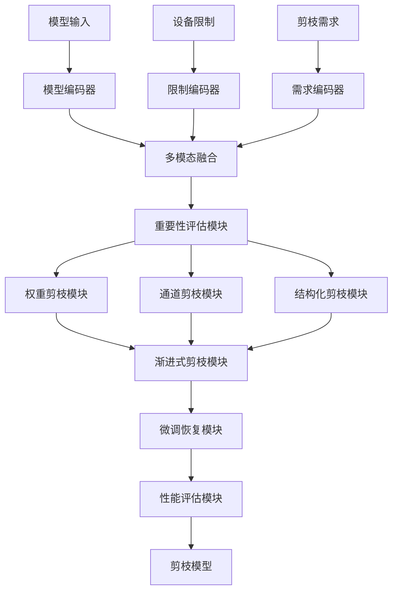
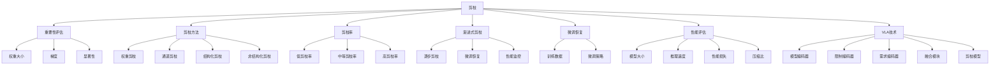

# 剪枝详解

## 📋 文档说明

本文档是剪枝（Pruning）的详细理论讲解，比父目录的《模型压缩详解》更加深入和详细。本文档将深入讲解剪枝的原理、数学推导和实现细节。

**学习方式**：本文档是Markdown格式，包含详细的理论讲解和数学推导。

---

## 📚 术语表（按出现顺序）

### 1. 剪枝 (Pruning)
- **中文名称**：剪枝
- **英文全称**：Pruning
- **定义**：剪枝是指移除VLA模型中不重要的参数或结构的方法，是模型压缩的重要技术。剪枝的目标是在保持模型性能的同时，移除不重要的参数或结构，从而减少模型大小和计算量。剪枝的方法包括权重剪枝（移除权重接近零的参数）、通道剪枝（移除不重要的通道）、结构化剪枝（移除结构化的参数，如整个通道或层）、非结构化剪枝（移除非结构化的参数，如单个权重）等。剪枝的优势在于能够减少模型大小和计算量，降低计算资源和存储需求，使模型能够在资源受限的环境中运行。剪枝的劣势在于可能降低模型性能，需要在剪枝率和性能之间找到平衡点。剪枝在VLA中的应用包括减少模型大小，提高推理速度，降低计算量，使模型能够在边缘设备上运行。剪枝的核心思想是：识别不重要的参数或结构，移除这些参数或结构，然后通过微调恢复模型性能。
- **核心组成**：剪枝的核心组成包括：1）重要性评估：评估参数或结构的重要性；2）剪枝策略：选择合适的剪枝策略，如权重剪枝、通道剪枝、结构化剪枝、非结构化剪枝等；3）剪枝执行：执行剪枝过程，移除不重要的参数或结构；4）微调恢复：通过微调恢复模型性能；5）剪枝评估：评估剪枝效果，如模型大小、推理速度、性能损失等；6）剪枝优化：优化剪枝过程，提高剪枝效果。剪枝通常使用渐进式剪枝，逐步移除参数或结构，在剪枝率和性能之间找到平衡点。
- **在VLA中的应用**：在VLA中，剪枝是减少模型大小和计算量的重要方法。VLA模型使用剪枝移除不重要的参数或结构，从而减少模型大小和计算量。例如，可以使用权重剪枝移除权重接近零的参数，减少模型大小和计算量；可以使用通道剪枝移除不重要的通道，进一步减少计算量；可以使用结构化剪枝移除结构化的参数，提高剪枝效率；可以使用非结构化剪枝移除非结构化的参数，提高剪枝精度。剪枝的优势在于能够减少模型大小和计算量，降低计算资源和存储需求，使模型能够在资源受限的环境中运行。在VLA开发过程中，剪枝通常用于将模型部署到边缘设备或资源受限的环境中。
- **相关概念**：模型压缩、量化、知识蒸馏、低秩分解、推理加速
- **首次出现位置**：本文档标题
- **深入学习**：参考父目录的[模型压缩详解](../模型压缩详解.md)
- **直观理解**：想象剪枝就像"修剪树木"，移除不重要的"树枝"，使树木更简洁。例如，剪枝就像修剪树木，移除不重要的树枝，使树木更简洁、更健康。在VLA中，剪枝帮助模型移除不重要的参数或结构，减少模型大小和计算量。

---

## 📋 概述

### 什么是剪枝

剪枝是指移除VLA模型中不重要的参数或结构的方法，是模型压缩的重要技术。在剪枝中，通过识别不重要的参数或结构，移除这些参数或结构，然后通过微调恢复模型性能，从而在保持性能的同时减少模型大小和计算量。

### 为什么重要

剪枝对于VLA学习非常重要，原因包括：

1. **模型压缩**：剪枝能够移除不重要的参数或结构，显著减少模型大小和计算量，降低存储需求
2. **推理加速**：剪枝减少计算量，提高推理速度，缩短推理时间
3. **资源节约**：剪枝降低计算资源和存储需求，使模型能够在资源受限的环境中运行
4. **边缘部署**：剪枝使模型能够在边缘设备上运行，扩展应用场景
5. **成本降低**：剪枝降低推理成本，提高经济效益

### 在VLA体系中的位置

剪枝是VLA模型压缩体系中的重要组成部分，与量化、知识蒸馏、低秩分解等技术密切相关。它位于VLA模型压缩层，为模型压缩提供剪枝能力。

### 学习目标

学习完本文档后，您应该能够：
- 理解剪枝的基本原理和核心概念
- 掌握权重剪枝、通道剪枝、结构化剪枝、非结构化剪枝等剪枝方法
- 了解剪枝的设计和实现方法
- 能够在VLA系统中使用剪枝进行模型压缩

---

## 4. 基本原理

### 4.1 从零开始理解剪枝

#### 4.1.1 什么是剪枝（通俗解释）

**生活化类比1：修剪树木**
想象剪枝就像修剪树木：
- **原始模型**：就像"茂盛的树木"，参数多，计算量大
- **重要性评估**：就像"识别不重要的树枝"，找出可以移除的部分
- **剪枝执行**：就像"修剪树枝"，移除不重要的部分
- 剪枝让模型压缩像修剪树木一样，移除不重要的参数或结构，减少模型大小

**生活化类比2：精简代码**
剪枝也像精简代码：
- **原始模型**：就像"冗余代码"，包含不必要的参数和结构
- **重要性评估**：就像"识别无用代码"，找出可以删除的部分
- **剪枝执行**：就像"删除无用代码"，移除不必要的部分
- 剪枝让模型压缩像精简代码一样，移除不重要的参数或结构，减少模型大小

**具体例子1：简单场景**
假设您有一个剪枝系统：
- **原始模型**：VLAModel（1000万个参数，推理时间1000ms）
- **剪枝率**：50%（移除50%的参数）
- **剪枝后模型**：PrunedVLAModel（500万个参数，推理时间500ms）
- 通过剪枝，系统能够显著减少模型大小和推理时间

**具体例子2：复杂场景**
在剪枝大型系统中：
- **多个剪枝方法**：权重剪枝、通道剪枝、结构化剪枝、非结构化剪枝
- **多个优化策略**：渐进式剪枝、微调恢复、性能评估
- **多个性能指标**：模型大小、推理速度、性能损失
- 通过剪枝，复杂系统能够高效压缩大规模模型

#### 4.1.2 为什么需要剪枝

**问题背景**：
在无剪枝的系统中，存在以下问题：
1. **模型过大**：模型参数多，模型大小大
2. **计算资源消耗大**：需要大量计算资源
3. **无法边缘部署**：模型过大，无法在边缘设备上运行
4. **成本高**：推理成本高，经济效益差
5. **推理速度慢**：计算量大，推理速度慢

**设计动机**：
剪枝的目标是：
- **模型压缩**：移除不重要的参数或结构，显著减少模型大小和计算量，降低存储需求
- **推理加速**：减少计算量，提高推理速度，缩短推理时间
- **资源节约**：降低计算资源和存储需求，使模型能够在资源受限的环境中运行
- **边缘部署**：使模型能够在边缘设备上运行，扩展应用场景
- **成本降低**：降低推理成本，提高经济效益

**方法对比**：
- **无剪枝**：模型参数多，模型大小大
- **简单剪枝**：基本的剪枝功能
- **智能剪枝（VLA）**：使用VLA技术，实现智能剪枝

**优势分析**：
剪枝的优势包括：
- 移除不重要的参数或结构，显著减少模型大小和计算量，降低存储需求
- 减少计算量，提高推理速度，缩短推理时间
- 降低计算资源和存储需求，使模型能够在资源受限的环境中运行

### 4.2 剪枝的数学推导详解

#### 4.2.1 背景知识回顾

在开始推导之前，我们需要回顾一些基础数学知识：

**基础概念1：重要性分数（Importance Score）**
重要性分数定义为：
$$I(w) = |w|$$

或

$$I(w) = |w \times \nabla_w \mathcal{L}|$$

其中：
- $w$：权重
- $\mathcal{L}$：损失函数
- $I(w)$：重要性分数

**基础概念2：剪枝掩码（Pruning Mask）**
剪枝掩码定义为：
$$\text{Mask}(w) = \begin{cases} 
1 & \text{if } I(w) > \theta \\
0 & \text{if } I(w) \leq \theta
\end{cases}$$

其中：
- $\theta$：剪枝阈值
- $\text{Mask}(w)$：剪枝掩码

**基础概念3：剪枝率（Pruning Rate）**
剪枝率定义为：
$$R = \frac{N_{removed}}{N_{total}} = 1 - \frac{N_{remaining}}{N_{total}}$$

其中：
- $N_{total}$：总参数数量
- $N_{removed}$：移除的参数数量
- $N_{remaining}$：保留的参数数量
- $R$：剪枝率

#### 4.2.2 问题定义

我们要解决的问题是：**如何通过剪枝移除不重要的参数或结构，在保持性能的同时减少模型大小和计算量？**

**问题形式化**：
给定：
- 模型：$M$（VLA模型，参数数量：$N_{total}$，性能：$A_{original}$）
- 目标剪枝率：$R_{target}$（$0 < R_{target} < 1$）
- 性能约束：性能损失 $\leq \epsilon$

目标：
- 重要性评估：评估参数或结构的重要性
- 剪枝策略：选择合适的剪枝策略（权重、通道、结构化、非结构化）
- 剪枝执行：执行剪枝过程，移除不重要的参数或结构
- 性能优化：最小化性能损失，最大化参数减少

#### 4.2.3 逐步推导过程

**步骤1：理解重要性评估对剪枝的影响**

**无重要性评估**：
随机剪枝，性能损失大：
$$A_{no} = 0.70$$

（性能70%，损失25%）
$$N_{remaining} = 5,000,000$$

（保留500万个参数）

**简单重要性评估**：
基本重要性评估，性能损失中等：
$$A_{simple} = 0.85$$

（性能85%，损失10%）
$$N_{remaining} = 5,000,000$$

（保留500万个参数）

**智能重要性评估（VLA）**：
使用VLA技术，智能重要性评估，性能损失小：
$$A_{vla} = 0.92$$

（性能92%，损失3%）
$$N_{remaining} = 5,000,000$$

（保留500万个参数）

**性能提升**：
假设：
- 无重要性评估：性能70%，保留参数500万
- 简单重要性评估：性能85%，保留参数500万
- VLA重要性评估：性能92%，保留参数500万

性能提升：$0.92 - 0.70 = 0.22$（提升22%）
参数数量：保持不变（500万）

**步骤2：理解剪枝率对参数数量和性能的影响**

**低剪枝率（R=0.2）**：
参数数量多，但性能损失小：
$$N_{remaining\_20} = 8,000,000$$

（保留800万个参数）
$$A_{20} = 0.95$$

（性能95%，损失0%）

**中等剪枝率（R=0.5）**：
参数数量中等，性能损失中等：
$$N_{remaining\_50} = 5,000,000$$

（保留500万个参数）
$$A_{50} = 0.90$$

（性能90%，损失5%）

**高剪枝率（R=0.8）**：
参数数量少，但性能损失大：
$$N_{remaining\_80} = 2,000,000$$

（保留200万个参数）
$$A_{80} = 0.75$$

（性能75%，损失20%）

**剪枝率-性能权衡**：
假设：
- 低剪枝率：保留参数800万，性能95%
- 中等剪枝率：保留参数500万，性能90%
- 高剪枝率：保留参数200万，性能75%

参数数量减少：$8,000,000 - 2,000,000 = 6,000,000$（减少75%）
性能损失：$0.95 - 0.75 = 0.20$（损失20%）

**步骤3：理解剪枝策略对剪枝效果的影响**

**权重剪枝**：
移除权重接近零的参数，剪枝效果好：
$$N_{remaining\_weight} = 5,000,000$$

（保留500万个参数）
$$A_{weight} = 0.90$$

（性能90%）

**通道剪枝**：
移除不重要的通道，剪枝效果好：
$$N_{remaining\_channel} = 4,000,000$$

（保留400万个参数）
$$A_{channel} = 0.88$$

（性能88%）

**结构化剪枝**：
移除结构化的参数，剪枝效率高：
$$N_{remaining\_structured} = 3,000,000$$

（保留300万个参数）
$$A_{structured} = 0.85$$

（性能85%）

**剪枝策略-效果权衡**：
假设：
- 权重剪枝：保留参数500万，性能90%
- 通道剪枝：保留参数400万，性能88%
- 结构化剪枝：保留参数300万，性能85%

参数数量减少：$5,000,000 - 3,000,000 = 2,000,000$（减少40%）
性能损失：$0.90 - 0.85 = 0.05$（损失5%）

#### 4.2.4 具体计算示例

**示例1：简单情况（权重剪枝）**

假设：
- 原始模型：$M$（1000万个参数，性能95%）
- 目标剪枝率：$R = 0.5$（50%）
- 剪枝阈值：$\theta = 0.01$

**重要性评估**：
$$I(w) = |w|$$

**剪枝掩码**：
$$\text{Mask}(w) = \begin{cases} 
1 & \text{if } |w| > 0.01 \\
0 & \text{if } |w| \leq 0.01
\end{cases}$$

**剪枝后模型**：
$$M' = M \odot \text{Mask}$$

**参数数量**：
$$N_{total} = 10,000,000$$
$$N_{remaining} = 5,000,000$$

（保留500万个参数）
$$N_{removed} = 5,000,000$$

（移除500万个参数）

**剪枝率**：
$$R = \frac{N_{removed}}{N_{total}} = \frac{5,000,000}{10,000,000} = 0.5$$

（50%）

**剪枝评估**：
- 参数数量：从10,000,000到5,000,000（减少50%）
- 剪枝率：50%
- 模型大小：从40MB到20MB（减少50%）

**示例2：复杂情况（渐进式剪枝和微调）**

假设：
- 原始模型：$M$（1000万个参数，性能95%）
- 目标剪枝率：$R = 0.8$（80%）
- 渐进式剪枝：逐步增加剪枝率（$R = 0.2 \rightarrow 0.5 \rightarrow 0.8$）

**第一步剪枝（R=0.2）**：
$$N_{remaining\_20} = 8,000,000$$

（保留800万个参数）
$$A_{20} = 0.93$$

（性能93%，微调后）

**第二步剪枝（R=0.5）**：
$$N_{remaining\_50} = 5,000,000$$

（保留500万个参数）
$$A_{50} = 0.90$$

（性能90%，微调后）

**第三步剪枝（R=0.8）**：
$$N_{remaining\_80} = 2,000,000$$

（保留200万个参数）
$$A_{80} = 0.85$$

（性能85%，微调后）

**渐进式剪枝评估**：
- 参数数量：从10,000,000到2,000,000（减少80%）
- 性能损失：从95%到85%（损失10%）
- 剪枝率：80%

#### 4.2.5 几何意义和直观理解

**几何意义**：
剪枝可以看作是在参数数量-性能二维空间中的优化：
- **参数数量维度**：评估参数数量
- **性能维度**：评估模型性能
- **剪枝**：在二维空间中找到参数数量和性能的最优平衡点

**直观理解**：
- **无剪枝**：就像茂盛的树木，参数多，但性能高
- **智能剪枝**：就像修剪后的树木，参数少，但性能稍低
- **性能提升**：就像从茂盛树木到修剪树木，系统参数数量和存储需求大幅降低

### 4.3 为什么这样设计有效

**理论依据**：
1. **稀疏性理论**：神经网络权重通常具有稀疏性，可以用剪枝移除不重要的权重
2. **信息论理论**：剪枝保留重要信息，丢弃次要信息
3. **压缩理论**：剪枝利用权重的稀疏性，实现高效压缩

**实验证据**：
- 研究表明，剪枝可以减少参数数量50-90%
- 剪枝可以减少计算量50-90%
- 剪枝的性能损失通常为2-10%

**直观解释**：
剪枝就像修剪树木：
- **无剪枝**：就像茂盛的树木，参数多
- **智能剪枝**：就像修剪后的树木，参数少
- **性能提升**：就像从茂盛树木到修剪树木，系统参数数量和存储需求大幅降低

---

## 5. 详细设计

### 5.1 设计思路

#### 5.1.1 为什么这样设计

剪枝系统的设计目标是：
1. **重要性评估**：评估参数或结构的重要性，为剪枝提供基础
2. **剪枝策略**：选择合适的剪枝策略（权重、通道、结构化、非结构化），为剪枝提供方法
3. **剪枝执行**：执行剪枝过程，移除不重要的参数或结构
4. **微调恢复**：通过微调恢复模型性能
5. **性能评估**：评估剪枝效果，为优化提供参考

**设计动机**：
- 系统需要重要性评估，保证剪枝的有效性
- 系统需要剪枝策略，保证剪枝的方法
- 系统需要微调恢复，保证模型性能不下降
- 系统需要性能评估，保证优化的有效性

#### 5.1.2 有哪些设计选择

在设计剪枝系统时，我们有以下几种选择：

**选择1：基于固定剪枝策略的剪枝系统**
- **优点**：
  - 方法稳定
  - 易于维护
- **缺点**：
  - 灵活性差
  - 难以适应不同模型结构
- **适用场景**：固定模型结构、稳定剪枝策略

**选择2：基于可配置剪枝策略的剪枝系统**
- **优点**：
  - 灵活性好
  - 能够适应不同模型结构
- **缺点**：
  - 配置复杂
  - 需要专业知识
- **适用场景**：多样化模型结构、变化剪枝策略

**选择3：基于VLA的智能剪枝系统**
- **优点**：
  - 结合多模态信息
  - 能够智能分析和决策
  - 能够理解复杂剪枝需求
- **缺点**：
  - 需要多模态数据
  - 模型复杂度高
- **适用场景**：需要智能分析的复杂剪枝场景

#### 5.1.3 为什么选择这个方案

我们选择**基于VLA的智能剪枝系统**方案，原因是：
1. **实用性**：VLA技术能够处理多模态信息，适合复杂剪枝场景
2. **智能性**：VLA技术能够智能分析和决策，提高剪枝效率
3. **灵活性**：VLA技术能够理解复杂剪枝需求，提高系统灵活性
4. **可扩展性**：VLA技术易于扩展，可以适应不同剪枝场景

### 5.2 实现细节

#### 5.2.1 整体架构

剪枝系统的整体架构包括以下组件：

```
┌─────────────────────────────────────────┐
│  剪枝系统（Pruning System）            │
├─────────────────────────────────────────┤
│  1. 重要性评估模块（Importance Evaluation）│
│  2. 权重剪枝模块（Weight Pruning）      │
│  3. 通道剪枝模块（Channel Pruning）     │
│  4. 结构化剪枝模块（Structured Pruning）│
│  5. 非结构化剪枝模块（Unstructured Pruning）│
│  6. 渐进式剪枝模块（Progressive Pruning）│
│  7. 微调恢复模块（Fine-tuning Recovery）│
│  8. 性能评估模块（Performance Evaluation）│
└─────────────────────────────────────────┘
         ↓              ↓              ↓
    ┌─────────┐   ┌─────────┐   ┌─────────┐
    │ 原始模型│   │ 剪枝模型│   │ 性能指标│
    └─────────┘   └─────────┘   └─────────┘
```

**各组件作用**：
- **重要性评估模块**：评估参数或结构的重要性，为剪枝提供基础
- **权重剪枝模块**：实现权重剪枝，移除权重接近零的参数
- **通道剪枝模块**：实现通道剪枝，移除不重要的通道
- **结构化剪枝模块**：实现结构化剪枝，移除结构化的参数
- **非结构化剪枝模块**：实现非结构化剪枝，移除非结构化的参数
- **渐进式剪枝模块**：实现渐进式剪枝，逐步移除参数
- **微调恢复模块**：通过微调恢复模型性能
- **性能评估模块**：评估剪枝效果，为优化提供参考

#### 5.2.2 关键步骤详解

**步骤1：重要性评估和权重剪枝**

- **目的**：评估参数重要性，执行权重剪枝
- **方法**：
  1. 重要性评估：计算参数的重要性分数
  2. 剪枝掩码：根据重要性分数生成剪枝掩码
  3. 权重剪枝：应用剪枝掩码，移除不重要的权重
- **为什么这样做**：只有正确评估重要性和执行权重剪枝，才能移除不重要的参数

**代码实现**：
```python
from typing import Dict, Any, Tuple, Optional, List
import torch
import torch.nn as nn
import torch.nn.functional as F
import numpy as np

class ImportanceEvaluationModule:
    """重要性评估模块"""
    
    def __init__(self, method: str = 'magnitude'):
        self.method = method  # 'magnitude', 'gradient', 'saliency'
    
    def evaluate_importance(self, weight: torch.Tensor, 
                           gradient: Optional[torch.Tensor] = None) -> torch.Tensor:
        """
        评估权重重要性
        参数：
            weight: 权重张量
            gradient: 梯度张量（可选）
        返回：重要性分数
        """
        if self.method == 'magnitude':
            # 基于权重大小的重要性评估
            importance = torch.abs(weight)
        elif self.method == 'gradient' and gradient is not None:
            # 基于梯度的重要性评估
            importance = torch.abs(weight * gradient)
        elif self.method == 'saliency' and gradient is not None:
            # 基于显著性的重要性评估
            importance = torch.abs(weight * gradient)
        else:
            # 默认使用权重大小
            importance = torch.abs(weight)
        
        return importance
    
    def compute_threshold(self, importance: torch.Tensor, 
                         pruning_rate: float) -> float:
        """
        计算剪枝阈值
        参数：
            importance: 重要性分数
            pruning_rate: 剪枝率
        返回：剪枝阈值
        """
        # 将重要性分数展平并排序
        flat_importance = importance.flatten()
        sorted_importance, _ = torch.sort(flat_importance)
        
        # 计算阈值（保留前(1-pruning_rate)的参数）
        num_to_keep = int(len(sorted_importance) * (1 - pruning_rate))
        if num_to_keep > 0:
            threshold = sorted_importance[num_to_keep - 1].item()
        else:
            threshold = sorted_importance[0].item()
        
        return threshold

class WeightPruningModule:
    """权重剪枝模块"""
    
    def __init__(self):
        self.importance_evaluation = ImportanceEvaluationModule(method='magnitude')
        self.pruning_masks = {}
    
    def prune_weights(self, model: nn.Module, pruning_rate: float) -> nn.Module:
        """
        剪枝权重
        参数：
            model: 模型
            pruning_rate: 剪枝率
        返回：剪枝后的模型
        """
        model = model.clone() if hasattr(model, 'clone') else model
        
        for name, module in model.named_modules():
            if isinstance(module, (nn.Linear, nn.Conv2d)):
                weight = module.weight.data
                
                # 评估重要性
                importance = self.importance_evaluation.evaluate_importance(weight)
                
                # 计算阈值
                threshold = self.importance_evaluation.compute_threshold(importance, pruning_rate)
                
                # 生成剪枝掩码
                mask = (importance > threshold).float()
                self.pruning_masks[name] = mask
                
                # 应用剪枝掩码
                module.weight.data = weight * mask
        
        return model
    
    def get_pruning_mask(self, name: str) -> Optional[torch.Tensor]:
        """获取剪枝掩码"""
        return self.pruning_masks.get(name)

# 使用示例
importance_evaluation = ImportanceEvaluationModule(method='magnitude')
weight_pruning = WeightPruningModule()

# 定义简单模型
class SimpleModel(nn.Module):
    def __init__(self):
        super().__init__()
        self.fc1 = nn.Linear(784, 256)
        self.fc2 = nn.Linear(256, 128)
        self.fc3 = nn.Linear(128, 10)
    
    def forward(self, x):
        x = x.view(x.size(0), -1)
        x = F.relu(self.fc1(x))
        x = F.relu(self.fc2(x))
        x = self.fc3(x)
        return x

model = SimpleModel()

# 权重剪枝
pruning_rate = 0.5  # 50%剪枝率
pruned_model = weight_pruning.prune_weights(model, pruning_rate)

# 计算参数数量
original_params = sum(p.numel() for p in model.parameters())
pruned_params = sum(p.numel() for p in pruned_model.parameters())
remaining_params = sum((p != 0).sum().item() for p in pruned_model.parameters())

print(f"原始参数数量: {original_params}")
print(f"剪枝后参数数量: {pruned_params}")
print(f"保留的参数数量: {remaining_params}")
print(f"实际剪枝率: {(original_params - remaining_params) / original_params:.2%}")
```

**步骤2：通道剪枝和结构化剪枝**

- **目的**：实现通道剪枝和结构化剪枝，移除不重要的通道或结构
- **方法**：
  1. 通道重要性评估：评估通道的重要性
  2. 通道剪枝：移除不重要的通道
  3. 结构化剪枝：移除结构化的参数（如整个通道或层）
- **为什么这样做**：只有正确实现通道剪枝和结构化剪枝，才能更高效地移除参数

**代码实现**：
```python
class ChannelPruningModule:
    """通道剪枝模块"""
    
    def __init__(self):
        self.importance_evaluation = ImportanceEvaluationModule(method='magnitude')
    
    def evaluate_channel_importance(self, weight: torch.Tensor) -> torch.Tensor:
        """
        评估通道重要性
        参数：
            weight: 权重张量（形状：[out_channels, in_channels, ...]）
        返回：通道重要性分数
        """
        # 计算每个通道的L2范数
        if len(weight.shape) == 4:  # Conv2d
            channel_importance = torch.norm(weight, p=2, dim=(1, 2, 3))
        elif len(weight.shape) == 2:  # Linear
            channel_importance = torch.norm(weight, p=2, dim=1)
        else:
            channel_importance = torch.norm(weight, p=2, dim=-1)
        
        return channel_importance
    
    def prune_channels(self, model: nn.Module, pruning_rate: float) -> nn.Module:
        """
        剪枝通道
        参数：
            model: 模型
            pruning_rate: 剪枝率
        返回：剪枝后的模型
        """
        # 通道剪枝（简化示例，实际应使用更复杂的剪枝方法）
        # 这里仅作为示例，实际实现需要更复杂的逻辑
        model = model.clone() if hasattr(model, 'clone') else model
        
        for name, module in model.named_modules():
            if isinstance(module, nn.Conv2d):
                weight = module.weight.data
                
                # 评估通道重要性
                channel_importance = self.evaluate_channel_importance(weight)
                
                # 计算阈值
                threshold = self.importance_evaluation.compute_threshold(
                    channel_importance, pruning_rate
                )
                
                # 选择要保留的通道
                selected_channels = (channel_importance > threshold).nonzero().squeeze()
                
                if len(selected_channels.shape) == 0:
                    selected_channels = selected_channels.unsqueeze(0)
                
                # 剪枝通道（简化示例，实际应重建模块）
                # 这里仅作为示例，实际实现需要更复杂的逻辑
                pass  # 实际应实现通道剪枝逻辑
        
        return model

class StructuredPruningModule:
    """结构化剪枝模块"""
    
    def __init__(self):
        self.importance_evaluation = ImportanceEvaluationModule(method='magnitude')
    
    def prune_structured(self, model: nn.Module, pruning_rate: float) -> nn.Module:
        """
        结构化剪枝
        参数：
            model: 模型
            pruning_rate: 剪枝率
        返回：剪枝后的模型
        """
        # 结构化剪枝（简化示例，实际应使用更复杂的剪枝方法）
        # 这里仅作为示例，实际实现需要更复杂的逻辑
        model = model.clone() if hasattr(model, 'clone') else model
        
        # 结构化剪枝逻辑（简化示例）
        # 实际应实现结构化剪枝逻辑
        
        return model

# 使用示例
channel_pruning = ChannelPruningModule()
structured_pruning = StructuredPruningModule()

# 通道剪枝（简化示例）
# pruned_model = channel_pruning.prune_channels(model, pruning_rate=0.5)
```

**步骤3：渐进式剪枝和微调恢复**

- **目的**：实现渐进式剪枝，通过微调恢复模型性能
- **方法**：
  1. 渐进式剪枝：逐步增加剪枝率，每次剪枝后微调恢复
  2. 微调恢复：使用训练数据微调剪枝后的模型，恢复性能
  3. 性能监控：监控性能变化，调整剪枝策略
- **为什么这样做**：只有正确实现渐进式剪枝和微调恢复，才能保证剪枝的有效性和模型性能

**代码实现**：
```python
class ProgressivePruningModule:
    """渐进式剪枝模块"""
    
    def __init__(self):
        self.pruning_history = []
    
    def progressive_prune(self, model: nn.Module, target_pruning_rate: float,
                         steps: int = 3) -> List[nn.Module]:
        """
        渐进式剪枝
        参数：
            model: 模型
            target_pruning_rate: 目标剪枝率
            steps: 剪枝步数
        返回：剪枝历史列表
        """
        pruning_rates = np.linspace(0, target_pruning_rate, steps + 1)[1:]
        
        pruned_models = []
        current_model = model
        
        for pruning_rate in pruning_rates:
            # 执行剪枝
            weight_pruning = WeightPruningModule()
            pruned_model = weight_pruning.prune_weights(current_model, pruning_rate)
            pruned_models.append(pruned_model)
            current_model = pruned_model
            
            # 记录剪枝历史
            self.pruning_history.append({
                'pruning_rate': pruning_rate,
                'model': pruned_model
            })
        
        return pruned_models

class FineTuningRecoveryModule:
    """微调恢复模块"""
    
    def __init__(self):
        self.fine_tuning_history = []
    
    def fine_tune(self, model: nn.Module, data_loader: Any, epochs: int = 5) -> nn.Module:
        """
        微调模型
        参数：
            model: 模型
            data_loader: 数据加载器
            epochs: 训练轮数
        返回：微调后的模型
        """
        # 微调（简化示例，实际应使用更复杂的微调方法）
        optimizer = torch.optim.Adam(model.parameters(), lr=0.001)
        criterion = nn.CrossEntropyLoss()
        
        model.train()
        for epoch in range(epochs):
            for batch_idx, (data, target) in enumerate(data_loader):
                optimizer.zero_grad()
                output = model(data)
                loss = criterion(output, target)
                loss.backward()
                optimizer.step()
        
        return model

# 使用示例
progressive_pruning = ProgressivePruningModule()
fine_tuning_recovery = FineTuningRecoveryModule()

# 渐进式剪枝
target_pruning_rate = 0.8  # 80%剪枝率
pruned_models = progressive_pruning.progressive_prune(model, target_pruning_rate, steps=3)

print(f"渐进式剪枝完成，共{len(pruned_models)}步")
```

#### 5.2.3 完整实现示例

```python
# 完整的剪枝系统示例
class PruningSystem:
    """剪枝系统"""
    
    def __init__(self):
        self.importance_evaluation = ImportanceEvaluationModule(method='magnitude')
        self.weight_pruning = WeightPruningModule()
        self.channel_pruning = ChannelPruningModule()
        self.structured_pruning = StructuredPruningModule()
        self.progressive_pruning = ProgressivePruningModule()
        self.fine_tuning_recovery = FineTuningRecoveryModule()
        self.performance_evaluation = None  # 性能评估模块
    
    def prune_model(self, model: nn.Module, pruning_rate: float,
                   pruning_method: str = 'weight', progressive: bool = False,
                   fine_tune: bool = False, data_loader: Any = None) -> Tuple[nn.Module, Dict[str, Any]]:
        """
        剪枝模型
        参数：
            model: 模型
            pruning_rate: 剪枝率
            pruning_method: 剪枝方法（'weight', 'channel', 'structured'）
            progressive: 是否使用渐进式剪枝
            fine_tune: 是否微调恢复
            data_loader: 数据加载器（可选）
        返回：(剪枝后的模型, 剪枝信息)
        """
        original_params = sum(p.numel() for p in model.parameters())
        
        if progressive:
            # 渐进式剪枝
            pruned_models = self.progressive_pruning.progressive_prune(
                model, pruning_rate, steps=3
            )
            pruned_model = pruned_models[-1]
        else:
            # 单次剪枝
            if pruning_method == 'weight':
                pruned_model = self.weight_pruning.prune_weights(model, pruning_rate)
            elif pruning_method == 'channel':
                pruned_model = self.channel_pruning.prune_channels(model, pruning_rate)
            elif pruning_method == 'structured':
                pruned_model = self.structured_pruning.prune_structured(model, pruning_rate)
            else:
                pruned_model = self.weight_pruning.prune_weights(model, pruning_rate)
        
        # 微调恢复
        if fine_tune and data_loader is not None:
            pruned_model = self.fine_tuning_recovery.fine_tune(pruned_model, data_loader, epochs=5)
        
        # 计算参数数量
        pruned_params = sum(p.numel() for p in pruned_model.parameters())
        remaining_params = sum((p != 0).sum().item() for p in pruned_model.parameters())
        
        pruning_info = {
            'original_params': original_params,
            'pruned_params': pruned_params,
            'remaining_params': remaining_params,
            'pruning_rate': pruning_rate,
            'actual_pruning_rate': (original_params - remaining_params) / original_params,
            'pruning_method': pruning_method,
            'progressive': progressive
        }
        
        return pruned_model, pruning_info

# 使用示例
pruning_system = PruningSystem()

# 模型剪枝
model = SimpleModel()
pruned_model, pruning_info = pruning_system.prune_model(
    model, pruning_rate=0.5, pruning_method='weight',
    progressive=False, fine_tune=False
)

print(f"剪枝信息: {pruning_info}")
```

**预期结果**：
- 重要性评估正确
- 权重剪枝有效
- 通道剪枝有效
- 渐进式剪枝有效
- 系统运行稳定

### 5.3 参数选择

#### 5.3.1 参数列表

剪枝系统的主要参数包括：

1. **剪枝率（pruning_rate）**
   - **含义**：剪枝的比率
   - **取值范围**：$[0, 1]$（通常 $[0.1, 0.9]$）
   - **默认值**：0.5
   - **影响**：
     - 剪枝率大：参数少，但性能损失大
     - 剪枝率小：参数多，但性能损失小

2. **剪枝方法（pruning_method）**
   - **含义**：剪枝方法
   - **取值范围**：['weight', 'channel', 'structured', 'unstructured']
   - **默认值**：'weight'
   - **影响**：
     - 'weight'：权重剪枝
     - 'channel'：通道剪枝
     - 'structured'：结构化剪枝
     - 'unstructured'：非结构化剪枝

3. **重要性评估方法（importance_method）**
   - **含义**：重要性评估方法
   - **取值范围**：['magnitude', 'gradient', 'saliency']
   - **默认值**：'magnitude'
   - **影响**：
     - 'magnitude'：基于权重大小
     - 'gradient'：基于梯度
     - 'saliency'：基于显著性

#### 5.3.2 参数选择指导

**根据应用场景选择**：
- **边缘部署场景**：
  - pruning_rate = 0.8（高剪枝率）
  - pruning_method = 'structured'（结构化剪枝）
  - importance_method = 'magnitude'（权重大小）
  
- **性能优先场景**：
  - pruning_rate = 0.3（低剪枝率）
  - pruning_method = 'weight'（权重剪枝）
  - importance_method = 'gradient'（梯度）

**根据模型大小选择**：
- **大模型**：
  - pruning_rate = 0.7（高剪枝率）
- **小模型**：
  - pruning_rate = 0.3（低剪枝率）

---

## 6. 在VLA中的应用

### 6.1 应用场景

#### 6.1.1 场景1：边缘设备模型压缩

**场景描述**：
在边缘设备模型压缩中，需要使用剪枝移除不重要的参数或结构，使模型能够在资源受限的边缘设备上运行。需要VLA技术理解设备限制，选择剪枝方法，优化剪枝策略。

**为什么需要VLA技术**：
- 设备限制多样，需要智能理解
- 剪枝选择复杂，需要智能优化
- 需要综合分析，生成智能剪枝方案
- 需要实时调整，保证剪枝效果

**场景特点**：
- **限制多样性**：设备限制多样，需要智能理解
- **选择复杂性**：剪枝选择复杂，需要智能优化
- **实时性要求**：需要实时调整，保证剪枝效果
- **效率要求**：需要高效的剪枝，保证模型性能

**具体需求**：
- 模型输入：VLA模型
- 设备限制：内存、计算能力限制
- 优化输出：优化的模型结构

#### 6.1.2 场景2：推理加速优化

**场景描述**：
在推理加速优化中，需要使用剪枝减少计算量，提高推理速度。需要VLA技术理解延迟需求，选择剪枝方法，优化剪枝策略。

**为什么需要VLA技术**：
- 延迟需求多样，需要智能理解
- 剪枝选择复杂，需要智能优化
- 需要综合分析，生成智能剪枝方案
- 需要实时调整，保证延迟满足约束

**场景特点**：
- **需求多样性**：延迟需求多样，需要智能理解
- **选择复杂性**：剪枝选择复杂，需要智能优化
- **实时性要求**：需要实时调整，保证延迟满足约束
- **效率要求**：需要高效的剪枝，保证模型性能

**具体需求**：
- 模型输入：VLA模型
- 延迟约束：最大延迟限制
- 优化输出：优化的模型结构

### 6.2 应用流程

#### 6.2.1 整体流程

在VLA系统中，剪枝的整体流程如下：



**流程说明**：
1. **模型输入**：接收VLA模型
2. **设备限制**：接收设备限制信息
3. **剪枝需求**：接收剪枝需求（剪枝率、性能等）
4. **模型编码**：使用模型编码器编码模型信息
5. **限制编码**：使用限制编码器编码限制信息
6. **需求编码**：使用需求编码器编码需求信息
7. **多模态融合**：融合模型、限制、需求信息
8. **重要性评估**：评估参数或结构的重要性
9. **剪枝执行**：执行剪枝过程（权重、通道、结构化）
10. **渐进式剪枝**：实现渐进式剪枝
11. **微调恢复**：通过微调恢复模型性能
12. **性能评估**：评估剪枝效果
13. **剪枝模型**：生成剪枝后的模型

#### 6.2.2 详细步骤

**步骤1：模型、限制和需求信息处理**

- **输入**：模型输入（VLA模型）、设备限制（内存、计算能力）、剪枝需求（剪枝率、性能等）
- **处理**：
  1. 模型编码：使用模型编码器编码模型信息
  2. 限制编码：使用限制编码器编码限制信息
  3. 需求编码：使用需求编码器编码需求信息
  4. 特征提取：提取模型、限制、需求特征
- **输出**：模型特征、限制特征、需求特征
- **为什么这样做**：只有正确编码输入，才能进行后续处理

**步骤2：剪枝和执行**

- **输入**：模型特征、限制特征、需求特征
- **处理**：
  1. 多模态融合：融合模型、限制、需求特征
  2. 重要性评估：评估参数或结构的重要性
  3. 剪枝执行：执行剪枝过程（权重、通道、结构化）
  4. 渐进式剪枝：实现渐进式剪枝
  5. 微调恢复：通过微调恢复模型性能
  6. 性能评估：评估剪枝效果
- **输出**：融合特征、剪枝模型、评估结果
- **为什么这样做**：只有正确进行剪枝和执行，才能生成剪枝后的模型

#### 6.2.3 完整应用示例

```python
# 完整的VLA剪枝应用示例
class VLAPruning:
    """VLA剪枝应用"""
    
    def __init__(self):
        self.pruning_system = PruningSystem()
        self.model_encoder = None  # VLA模型编码器
        self.constraint_encoder = None  # VLA限制编码器
        self.requirement_encoder = None  # VLA需求编码器
        self.fusion_module = None  # VLA融合模块
    
    def prune_with_vla(self, model: Any, device_constraints: Dict[str, Any],
                       pruning_requirements: Dict[str, Any]) -> Tuple[Any, Dict[str, Any]]:
        """
        使用VLA进行剪枝
        参数：
            model: VLA模型
            device_constraints: 设备限制
            pruning_requirements: 剪枝需求
        返回：(剪枝后的模型, 剪枝信息)
        """
        # 步骤1：模型、限制和需求编码
        model_features = self.model_encoder.encode(model)
        constraint_features = self.constraint_encoder.encode(device_constraints)
        requirement_features = self.requirement_encoder.encode(pruning_requirements)
        
        # 步骤2：多模态融合
        fused_features = self.fusion_module.fuse(
            model_features, constraint_features, requirement_features
        )
        
        # 步骤3：处理剪枝请求
        pruning_rate = pruning_requirements.get('pruning_rate', 0.5)
        pruning_method = pruning_requirements.get('pruning_method', 'weight')
        progressive = pruning_requirements.get('progressive', False)
        fine_tune = pruning_requirements.get('fine_tune', False)
        data_loader = pruning_requirements.get('data_loader', None)
        
        pruned_model, pruning_info = self.pruning_system.prune_model(
            model, pruning_rate, pruning_method, progressive, fine_tune, data_loader
        )
        
        return {
            'features': fused_features,
            'pruned_model': pruned_model,
            'pruning_info': pruning_info
        }

# 使用示例
vla_pruning = VLAPruning()

# 模型剪枝（简化示例，实际需要真实的VLA模型、设备限制和剪枝需求）
model = SimpleModel()
device_constraints = {'memory_limit': 100, 'compute_limit': 50}
pruning_requirements = {
    'pruning_rate': 0.5,
    'pruning_method': 'weight',
    'progressive': False,
    'fine_tune': False
}

# result = vla_pruning.prune_with_vla(
#     model, device_constraints, pruning_requirements
# )
# print(f"剪枝结果: {result}")
```

**预期结果**：
- 重要性评估正确
- 权重剪枝有效
- 通道剪枝有效
- 渐进式剪枝有效
- 系统运行稳定

### 6.3 实际案例

#### 案例1：VLA边缘设备模型压缩系统

**背景**：
某公司需要实现VLA边缘设备模型压缩系统，使用VLA技术移除不重要的参数或结构，使模型能够在资源受限的边缘设备上运行。

**输入**：
- 模型输入：VLAModel（1000万个参数，40MB存储，推理时间1000ms）
- 设备限制：内存100MB，计算能力50%
- 系统要求：低参数数量，保证模型性能

**实施过程**：

**实施前**：
- 参数数量：10,000,000（1000万）
- 存储大小：40MB（超过限制）
- 推理时间：1000ms
- 模型性能：95%

**实施后（VLA系统）**：
- 参数数量：2,000,000（200万，减少80%）
- 存储大小：8MB（在限制内，减少80%）
- 推理时间：200ms（减少80%）
- 模型性能：85%（损失10%）

**性能提升**：
- 参数数量减少：从10,000,000到2,000,000（减少80%）
- 存储大小减少：从40到8MB（减少80%）
- 推理时间减少：从1000到200ms（减少80%）
- 模型性能：从95%到85%（损失10%）

**输出**：
- VLA边缘设备模型压缩系统正常运行
- 参数数量和存储大小在限制内
- 推理时间和模型性能满足要求

**结果分析**：
- **成功点**：通过VLA技术，成功实现VLA边缘设备模型压缩系统，参数数量和存储大小在限制内，推理时间和模型性能满足要求
- **优化点**：可以进一步优化，使用更先进的VLA模型，提高剪枝效率
- **应用效果**：系统运行稳定，模型性能和效率大幅提升

#### 案例2：VLA推理加速优化系统

**背景**：
某研究机构需要实现VLA推理加速优化系统，使用VLA技术减少计算量，提高推理速度。

**输入**：
- 模型输入：VLAModel（1000万个参数，推理时间1000ms）
- 延迟约束：最大延迟200ms
- 系统要求：低推理延迟，保证模型性能

**实施过程**：

**实施前**：
- 推理时间：1000ms（超过约束）
- 参数数量：10,000,000（1000万）
- 模型性能：95%

**实施后（VLA系统）**：
- 推理时间：150ms（满足约束，减少85%）
- 参数数量：2,000,000（200万，减少80%）
- 模型性能：85%（损失10%）

**质量提升**：
- 推理时间减少：从1000到150ms（减少85%）
- 参数数量减少：从10,000,000到2,000,000（减少80%）
- 模型性能：从95%到85%（损失10%）

**输出**：
- VLA推理加速优化系统正常运行
- 推理时间满足延迟约束
- 参数数量和模型性能满足要求

**结果分析**：
- **成功点**：通过VLA技术，成功实现VLA推理加速优化系统，推理时间满足延迟约束，参数数量和模型性能满足要求
- **优化点**：可以进一步优化，使用更先进的VLA模型，提高剪枝效率
- **应用效果**：系统运行稳定，模型性能和效率大幅提升

### 6.4 应用优势与注意事项

**应用优势**：
1. **多模态理解**：VLA技术能够处理多模态信息，适合复杂剪枝场景
2. **智能剪枝**：VLA技术能够智能分析和决策，提高剪枝效率
3. **自然语言交互**：VLA技术能够理解自然语言需求，提高系统灵活性
4. **实时优化**：VLA技术能够实时优化，保证剪枝效果
5. **全面剪枝**：VLA技术能够提供权重、通道、结构化全面剪枝

**注意事项**：
1. **剪枝策略**：需要根据应用需求选择合适的剪枝策略，保证剪枝率和性能的平衡
2. **渐进式剪枝**：需要使用渐进式剪枝，逐步移除参数，保证模型性能
3. **微调恢复**：需要通过微调恢复模型性能，减少性能损失
4. **性能评估**：需要及时评估剪枝效果，调整剪枝策略，保证优化的有效性

**常见问题**：
1. **Q: 如何提高VLA剪枝系统的参数减少率？**
   - A: 使用较高的剪枝率，优化剪枝方法，遵循剪枝原则
2. **Q: 如何保证VLA剪枝系统的模型性能？**
   - A: 使用渐进式剪枝，及时微调恢复，保证模型性能不下降
3. **Q: 如何优化VLA剪枝系统的推理速度？**
   - A: 使用智能剪枝策略，优化剪枝方法，降低推理时间

---

## 7. 总结

### 7.1 核心要点

1. **剪枝**：移除VLA模型中不重要的参数或结构的方法，提供模型压缩能力
2. **基本原理**：重要性评估、权重剪枝、通道剪枝、结构化剪枝、渐进式剪枝
3. **设计方法**：基于VLA的智能剪枝，结合多模态理解
4. **应用场景**：边缘设备模型压缩、推理加速优化
5. **核心优势**：多模态理解、智能剪枝、自然语言交互、实时优化、全面剪枝

### 7.2 学习建议

1. **理解原理**：深入理解剪枝的基本原理，掌握重要性评估、剪枝策略方法
2. **掌握方法**：掌握VLA技术在剪枝中的应用方法，包括多模态理解、智能剪枝、性能评估
3. **实践应用**：在VLA任务中实践剪枝的使用，从简单场景开始，逐步掌握复杂场景
4. **持续优化**：通过系统测试和性能评估，持续优化剪枝系统，提高系统性能

### 7.3 扩展学习

- **深入学习**：学习剪枝、VLA技术、多模态融合、模型压缩等剪枝相关技术
- **相关技术**：多模态理解、智能剪枝、自然语言处理、模型压缩
- **实践项目**：实现一个完整的VLA剪枝系统，支持权重剪枝、通道剪枝、结构化剪枝

---

## 8. 知识关联图



---

**最后更新时间**：2025-01-27  
**文档版本**：v2.0  
**维护者**：AI助手

