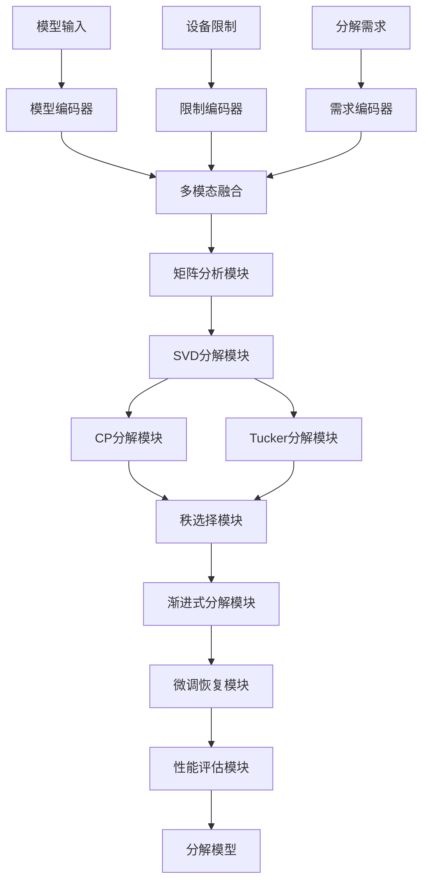
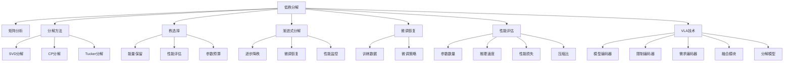

# 低秩分解详解

## 📋 文档说明

本文档是低秩分解（Low-Rank Decomposition）的详细理论讲解，比父目录的《模型压缩详解》更加深入和详细。本文档将深入讲解低秩分解的原理、数学推导和实现细节。

**学习方式**：本文档是Markdown格式，包含详细的理论讲解和数学推导。

---

## 📚 术语表（按出现顺序）

### 1. 低秩分解 (Low-Rank Decomposition)
- **中文名称**：低秩分解
- **英文全称**：Low-Rank Decomposition
- **定义**：低秩分解是指将VLA模型中的大矩阵分解为多个小矩阵的方法，是模型压缩的重要技术。低秩分解的目标是在保持模型性能的同时，将大矩阵分解为小矩阵，从而减少参数数量。低秩分解的方法包括SVD分解（奇异值分解）、CP分解（CP分解）、Tucker分解（Tucker分解）等。低秩分解的优势在于能够减少参数数量，降低计算资源和存储需求，使模型能够在资源受限的环境中运行。低秩分解的劣势在于可能降低模型性能，需要在分解率和性能之间找到平衡点。低秩分解在VLA中的应用包括减少参数数量，提高推理速度，降低存储需求，使模型能够在边缘设备上运行。低秩分解的核心思想是：利用矩阵的低秩性质，将大矩阵分解为多个小矩阵的乘积，从而减少参数数量。
- **核心组成**：低秩分解的核心组成包括：1）分解方法：选择合适的分解方法，如SVD分解、CP分解、Tucker分解等；2）秩的选择：选择合适的秩，平衡参数数量和性能；3）分解执行：执行分解过程，将大矩阵分解为小矩阵；4）微调恢复：通过微调恢复模型性能；5）分解评估：评估分解效果，如参数数量、推理速度、性能损失等；6）分解优化：优化分解过程，提高分解效果。低秩分解通常使用渐进式分解，逐步减少秩，在分解率和性能之间找到平衡点。
- **在VLA中的应用**：在VLA中，低秩分解是减少参数数量的重要方法。VLA模型使用低秩分解将大矩阵分解为小矩阵，从而减少参数数量。例如，可以使用SVD分解将权重矩阵分解为两个小矩阵的乘积，减少参数数量；可以使用CP分解将张量分解为多个小张量的和，进一步减少参数数量；可以使用Tucker分解将张量分解为核心张量和因子矩阵的乘积，减少参数数量。低秩分解的优势在于能够减少参数数量，降低计算资源和存储需求，使模型能够在资源受限的环境中运行。在VLA开发过程中，低秩分解通常用于将模型部署到边缘设备或资源受限的环境中。
- **相关概念**：模型压缩、量化、剪枝、知识蒸馏、推理加速
- **首次出现位置**：本文档标题
- **深入学习**：参考父目录的[模型压缩详解](../模型压缩详解.md)
- **直观理解**：想象低秩分解就像"将大矩阵拆分成小矩阵"，利用矩阵的低秩性质，将大矩阵分解为多个小矩阵的乘积。例如，低秩分解就像将一个大矩阵拆分成两个小矩阵的乘积，在保持大致相同的同时减少参数数量。在VLA中，低秩分解帮助模型减少参数数量，降低计算资源和存储需求。

---

## 📋 概述

### 什么是低秩分解

低秩分解是指将VLA模型中的大矩阵分解为多个小矩阵的方法，是模型压缩的重要技术。在低秩分解中，通过利用矩阵的低秩性质，将大矩阵分解为多个小矩阵的乘积，从而减少参数数量，降低计算资源和存储需求。

### 为什么重要

低秩分解对于VLA学习非常重要，原因包括：

1. **参数减少**：低秩分解能够将大矩阵分解为小矩阵，显著减少参数数量，降低模型大小
2. **计算优化**：低秩分解优化计算过程，减少计算量，提高推理速度
3. **资源节约**：低秩分解降低计算资源和存储需求，使模型能够在资源受限的环境中运行
4. **边缘部署**：低秩分解使模型能够在边缘设备上运行，扩展应用场景
5. **成本降低**：低秩分解降低推理成本，提高经济效益

### 在VLA体系中的位置

低秩分解是VLA模型压缩体系中的重要组成部分，与量化、剪枝、知识蒸馏等技术密切相关。它位于VLA模型压缩层，为模型压缩提供低秩分解能力。

### 学习目标

学习完本文档后，您应该能够：
- 理解低秩分解的基本原理和核心概念
- 掌握SVD分解、CP分解、Tucker分解等分解方法
- 了解低秩分解的设计和实现方法
- 能够在VLA系统中使用低秩分解进行模型压缩

---

## 4. 基本原理

### 4.1 从零开始理解低秩分解

#### 4.1.1 什么是低秩分解（通俗解释）

**生活化类比1：将大矩阵拆分成小矩阵**
想象低秩分解就像将大矩阵拆分成小矩阵：
- **原始矩阵**：就像"一个大矩阵"，参数多，存储大
- **SVD分解**：就像"将大矩阵拆分成两个小矩阵的乘积"，参数少，存储小
- **低秩近似**：就像"用低秩矩阵近似原始矩阵"，在保持大致相同的同时减少参数数量
- 低秩分解让模型压缩像拆分矩阵一样，减少参数数量，降低存储需求

**生活化类比2：压缩文件**
低秩分解也像压缩文件：
- **原始矩阵**：就像"原始文件"，文件大，占用空间多
- **低秩分解**：就像"压缩文件"，文件小，占用空间少
- **近似恢复**：就像"解压文件"，可以恢复原始内容（近似）
- 低秩分解让模型压缩像压缩文件一样，减少参数数量，降低存储需求

**具体例子1：简单场景**
假设您有一个低秩分解系统：
- **原始矩阵**：$W \in \mathbb{R}^{1000 \times 1000}$（100万个参数）
- **SVD分解**：$W = U \Sigma V^T$，其中 $U \in \mathbb{R}^{1000 \times 50}$，$V \in \mathbb{R}^{1000 \times 50}$（10万个参数）
- **参数减少**：从100万到10万（减少90%）
- 通过低秩分解，系统能够显著减少参数数量

**具体例子2：复杂场景**
在低秩分解大型系统中：
- **多个分解方法**：SVD分解、CP分解、Tucker分解
- **多个优化策略**：渐进式分解、微调恢复、性能评估
- **多个性能指标**：参数数量、推理速度、性能损失
- 通过低秩分解，复杂系统能够高效压缩大规模模型

#### 4.1.2 为什么需要低秩分解

**问题背景**：
在无低秩分解的系统中，存在以下问题：
1. **参数过多**：模型参数多，模型大小大
2. **存储需求大**：需要大量存储空间
3. **计算资源消耗大**：需要大量计算资源
4. **无法边缘部署**：模型过大，无法在边缘设备上运行
5. **成本高**：推理成本高，经济效益差

**设计动机**：
低秩分解的目标是：
- **参数减少**：将大矩阵分解为小矩阵，显著减少参数数量，降低模型大小
- **计算优化**：优化计算过程，减少计算量，提高推理速度
- **资源节约**：降低计算资源和存储需求，使模型能够在资源受限的环境中运行
- **边缘部署**：使模型能够在边缘设备上运行，扩展应用场景
- **成本降低**：降低推理成本，提高经济效益

**方法对比**：
- **无低秩分解**：模型参数多，模型大小大
- **简单低秩分解**：基本的低秩分解功能
- **智能低秩分解（VLA）**：使用VLA技术，实现智能低秩分解

**优势分析**：
低秩分解的优势包括：
- 将大矩阵分解为小矩阵，显著减少参数数量，降低模型大小
- 优化计算过程，减少计算量，提高推理速度
- 降低计算资源和存储需求，使模型能够在资源受限的环境中运行

### 4.2 低秩分解的数学推导详解

#### 4.2.1 背景知识回顾

在开始推导之前，我们需要回顾一些基础数学知识：

**基础概念1：矩阵的秩（Matrix Rank）**
矩阵的秩定义为：
$$\text{rank}(W) = r$$

其中：
- $W \in \mathbb{R}^{m \times n}$：矩阵
- $r$：矩阵的秩（$r \leq \min(m, n)$）

**基础概念2：奇异值分解（SVD）**
奇异值分解定义为：
$$W = U \Sigma V^T$$

其中：
- $U \in \mathbb{R}^{m \times m}$：左奇异矩阵（正交矩阵）
- $\Sigma \in \mathbb{R}^{m \times n}$：奇异值矩阵（对角矩阵）
- $V \in \mathbb{R}^{n \times n}$：右奇异矩阵（正交矩阵）

**基础概念3：低秩近似（Low-Rank Approximation）**
低秩近似定义为：
$$W \approx W_r = U_r \Sigma_r V_r^T$$

其中：
- $U_r \in \mathbb{R}^{m \times r}$：前$r$个左奇异向量
- $\Sigma_r \in \mathbb{R}^{r \times r}$：前$r$个奇异值
- $V_r \in \mathbb{R}^{n \times r}$：前$r$个右奇异向量
- $r$：近似秩（$r \ll \min(m, n)$）

#### 4.2.2 问题定义

我们要解决的问题是：**如何通过低秩分解减少参数数量，降低模型大小？**

**问题形式化**：
给定：
- 权重矩阵：$W \in \mathbb{R}^{m \times n}$（参数数量：$m \times n$）
- 目标参数数量：$P_{target}$（$P_{target} < m \times n$）
- 性能约束：性能损失 $\leq \epsilon$

目标：
- 分解方法：选择合适的分解方法（SVD、CP、Tucker）
- 秩的选择：选择合适的秩 $r$，使得参数数量 $\leq P_{target}$
- 分解执行：执行分解过程，将 $W$ 分解为小矩阵
- 性能优化：最小化性能损失，最大化参数减少

#### 4.2.3 逐步推导过程

**步骤1：理解SVD分解对参数数量的影响**

**无低秩分解**：
原始矩阵，参数数量多：
$$P_{no} = m \times n = 1000 \times 1000 = 1,000,000$$

（100万个参数）
$$S_{no} = P_{no} \times 4 = 4,000,000 \text{ bytes} = 4MB$$

（假设每个参数4字节）

**SVD分解**：
将矩阵分解为两个小矩阵，参数数量少：
$$W = U \Sigma V^T \approx U_r \Sigma_r V_r^T = (U_r \sqrt{\Sigma_r})(\sqrt{\Sigma_r} V_r^T) = AB$$

其中：
- $A = U_r \sqrt{\Sigma_r} \in \mathbb{R}^{m \times r}$
- $B = \sqrt{\Sigma_r} V_r^T \in \mathbb{R}^{r \times n}$
- $r = 50$（假设秩为50）

$$P_{svd} = m \times r + r \times n = 1000 \times 50 + 50 \times 1000 = 50,000 + 50,000 = 100,000$$

（10万个参数）
$$S_{svd} = P_{svd} \times 4 = 400,000 \text{ bytes} = 0.4MB$$

**参数数量减少**：
假设：
- 无低秩分解：参数数量1,000,000，存储大小4MB
- SVD分解：参数数量100,000，存储大小0.4MB

参数数量减少：$1,000,000 - 100,000 = 900,000$（减少90%）
存储大小减少：$4 - 0.4 = 3.6MB$（减少90%）

**步骤2：理解低秩近似对性能的影响**

**无低秩分解**：
原始矩阵，性能高：
$$P_{no} = 0.95$$

（性能95%）

**低秩近似**：
使用低秩近似，性能可能下降：
$$P_{svd} = 0.90$$

（性能90%，下降5%）

**性能-参数权衡**：
假设：
- 无低秩分解：参数数量1,000,000，性能95%
- SVD分解：参数数量100,000，性能90%

参数数量减少：$1,000,000 - 100,000 = 900,000$（减少90%）
性能损失：$0.95 - 0.90 = 0.05$（损失5%）

**步骤3：理解秩的选择对参数数量和性能的影响**

**小秩（r=25）**：
参数数量少，但性能损失大：
$$P_{small} = 1000 \times 25 + 25 \times 1000 = 50,000$$

（5万个参数）
$$P_{small\_perf} = 0.85$$

（性能85%，损失10%）

**中等秩（r=50）**：
参数数量中等，性能损失中等：
$$P_{medium} = 1000 \times 50 + 50 \times 1000 = 100,000$$

（10万个参数）
$$P_{medium\_perf} = 0.90$$

（性能90%，损失5%）

**大秩（r=100）**：
参数数量多，但性能损失小：
$$P_{large} = 1000 \times 100 + 100 \times 1000 = 200,000$$

（20万个参数）
$$P_{large\_perf} = 0.93$$

（性能93%，损失2%）

**秩-性能权衡**：
假设：
- 小秩：参数数量50,000，性能85%
- 中等秩：参数数量100,000，性能90%
- 大秩：参数数量200,000，性能93%

参数数量增加：$200,000 - 50,000 = 150,000$（增加200%）
性能提升：$0.93 - 0.85 = 0.08$（提升8%）

#### 4.2.4 具体计算示例

**示例1：简单情况（SVD分解）**

假设：
- 原始矩阵：$W \in \mathbb{R}^{1000 \times 1000}$（100万个参数）
- 目标参数数量：100,000（减少90%）
- 秩：$r = 50$

**SVD分解**：
$$W = U \Sigma V^T$$

**低秩近似**：
$$W \approx W_r = U_r \Sigma_r V_r^T = (U_r \sqrt{\Sigma_r})(\sqrt{\Sigma_r} V_r^T) = AB$$

其中：
- $A = U_r \sqrt{\Sigma_r} \in \mathbb{R}^{1000 \times 50}$
- $B = \sqrt{\Sigma_r} V_r^T \in \mathbb{R}^{50 \times 1000}$

**参数数量**：
$$P_{original} = 1000 \times 1000 = 1,000,000$$
$$P_{decomposed} = 1000 \times 50 + 50 \times 1000 = 50,000 + 50,000 = 100,000$$

**压缩比**：
$$C = \frac{P_{original}}{P_{decomposed}} = \frac{1,000,000}{100,000} = 10$$

（10倍压缩）

**低秩分解评估**：
- 参数数量：从1,000,000到100,000（减少90%）
- 压缩比：10倍
- 存储大小：从4MB到0.4MB（减少90%）

**示例2：复杂情况（渐进式分解和微调）**

假设：
- 原始矩阵：$W \in \mathbb{R}^{1000 \times 1000}$（100万个参数）
- 目标参数数量：50,000（减少95%）
- 渐进式分解：逐步减少秩（$r = 100 \rightarrow 50 \rightarrow 25$）

**第一步分解（r=100）**：
$$W \approx W_{100} = A_{100} B_{100}$$
$$P_{100} = 1000 \times 100 + 100 \times 1000 = 200,000$$

（20万个参数）
$$P_{100\_perf} = 0.93$$

（性能93%）

**第二步分解（r=50）**：
$$W_{100} \approx W_{50} = A_{50} B_{50}$$
$$P_{50} = 1000 \times 50 + 50 \times 1000 = 100,000$$

（10万个参数）
$$P_{50\_perf} = 0.90$$

（性能90%，微调后）

**第三步分解（r=25）**：
$$W_{50} \approx W_{25} = A_{25} B_{25}$$
$$P_{25} = 1000 \times 25 + 25 \times 1000 = 50,000$$

（5万个参数）
$$P_{25\_perf} = 0.85$$

（性能85%，微调后）

**渐进式分解评估**：
- 参数数量：从1,000,000到50,000（减少95%）
- 性能损失：从95%到85%（损失10%）
- 压缩比：20倍

#### 4.2.5 几何意义和直观理解

**几何意义**：
低秩分解可以看作是在参数数量-性能二维空间中的优化：
- **参数数量维度**：评估参数数量
- **性能维度**：评估模型性能
- **低秩分解**：在二维空间中找到参数数量和性能的最优平衡点

**直观理解**：
- **无低秩分解**：就像大矩阵，参数多，但性能高
- **智能低秩分解**：就像小矩阵，参数少，但性能稍低
- **性能提升**：就像从大矩阵到小矩阵，系统参数数量和存储需求大幅降低

### 4.3 为什么这样设计有效

**理论依据**：
1. **低秩性质理论**：神经网络权重矩阵通常具有低秩性质，可以用低秩矩阵近似
2. **信息论理论**：低秩分解保留主要信息，丢弃次要信息
3. **压缩理论**：低秩分解利用矩阵的低秩性质，实现高效压缩

**实验证据**：
- 研究表明，低秩分解可以减少参数数量50-90%
- 低秩分解可以减少存储需求50-90%
- 低秩分解的性能损失通常为2-10%

**直观解释**：
低秩分解就像将大矩阵拆分成小矩阵：
- **无低秩分解**：就像大矩阵，参数多
- **智能低秩分解**：就像小矩阵，参数少
- **性能提升**：就像从大矩阵到小矩阵，系统参数数量和存储需求大幅降低

---

## 5. 详细设计

### 5.1 设计思路

#### 5.1.1 为什么这样设计

低秩分解系统的设计目标是：
1. **分解方法**：选择合适的分解方法（SVD、CP、Tucker），为低秩分解提供基础
2. **秩的选择**：选择合适的秩，平衡参数数量和性能
3. **分解执行**：执行分解过程，将大矩阵分解为小矩阵
4. **微调恢复**：通过微调恢复模型性能
5. **性能评估**：评估分解效果，为优化提供参考

**设计动机**：
- 系统需要分解方法，保证低秩分解的有效性
- 系统需要秩的选择，保证参数数量和性能的平衡
- 系统需要微调恢复，保证模型性能不下降
- 系统需要性能评估，保证优化的有效性

#### 5.1.2 有哪些设计选择

在设计低秩分解系统时，我们有以下几种选择：

**选择1：基于固定分解方法的低秩分解系统**
- **优点**：
  - 方法稳定
  - 易于维护
- **缺点**：
  - 灵活性差
  - 难以适应不同矩阵结构
- **适用场景**：固定矩阵结构、稳定分解方法

**选择2：基于可配置分解方法的低秩分解系统**
- **优点**：
  - 灵活性好
  - 能够适应不同矩阵结构
- **缺点**：
  - 配置复杂
  - 需要专业知识
- **适用场景**：多样化矩阵结构、变化分解方法

**选择3：基于VLA的智能低秩分解系统**
- **优点**：
  - 结合多模态信息
  - 能够智能分析和决策
  - 能够理解复杂分解需求
- **缺点**：
  - 需要多模态数据
  - 模型复杂度高
- **适用场景**：需要智能分析的复杂分解场景

#### 5.1.3 为什么选择这个方案

我们选择**基于VLA的智能低秩分解系统**方案，原因是：
1. **实用性**：VLA技术能够处理多模态信息，适合复杂分解场景
2. **智能性**：VLA技术能够智能分析和决策，提高低秩分解效率
3. **灵活性**：VLA技术能够理解复杂分解需求，提高系统灵活性
4. **可扩展性**：VLA技术易于扩展，可以适应不同分解场景

### 5.2 实现细节

#### 5.2.1 整体架构

低秩分解系统的整体架构包括以下组件：

```
┌─────────────────────────────────────────┐
│  低秩分解系统（Low-Rank Decomposition）│
├─────────────────────────────────────────┤
│  1. 矩阵分析模块（Matrix Analysis）     │
│  2. SVD分解模块（SVD Decomposition）    │
│  3. CP分解模块（CP Decomposition）      │
│  4. Tucker分解模块（Tucker Decomposition）│
│  5. 秩选择模块（Rank Selection）        │
│  6. 渐进式分解模块（Progressive Decomposition）│
│  7. 微调恢复模块（Fine-tuning Recovery）│
│  8. 性能评估模块（Performance Evaluation）│
└─────────────────────────────────────────┘
         ↓              ↓              ↓
    ┌─────────┐   ┌─────────┐   ┌─────────┐
    │ 原始矩阵│   │ 分解矩阵│   │ 性能指标│
    └─────────┘   └─────────┘   └─────────┘
```

**各组件作用**：
- **矩阵分析模块**：分析矩阵结构，为分解提供基础
- **SVD分解模块**：实现SVD分解，将矩阵分解为两个小矩阵
- **CP分解模块**：实现CP分解，将张量分解为多个小张量
- **Tucker分解模块**：实现Tucker分解，将张量分解为核心张量和因子矩阵
- **秩选择模块**：选择合适的秩，平衡参数数量和性能
- **渐进式分解模块**：实现渐进式分解，逐步减少秩
- **微调恢复模块**：通过微调恢复模型性能
- **性能评估模块**：评估分解效果，为优化提供参考

#### 5.2.2 关键步骤详解

**步骤1：矩阵分析和SVD分解**

- **目的**：分析矩阵结构，执行SVD分解
- **方法**：
  1. 矩阵分析：分析矩阵的秩、奇异值分布等
  2. SVD分解：执行SVD分解，将矩阵分解为$U \Sigma V^T$
  3. 低秩近似：选择前$r$个奇异值，得到低秩近似
- **为什么这样做**：只有正确分析和分解矩阵，才能减少参数数量

**代码实现**：
```python
from typing import Dict, Any, Tuple, Optional
import numpy as np
import torch
import torch.nn as nn
from scipy.linalg import svd

class MatrixAnalysisModule:
    """矩阵分析模块"""
    
    def __init__(self):
        self.analysis_results = {}
    
    def analyze_matrix(self, matrix: np.ndarray) -> Dict[str, Any]:
        """
        分析矩阵
        参数：
            matrix: 矩阵
        返回：分析结果
        """
        # 矩阵分析（简化示例，实际应使用更复杂的分析方法）
        m, n = matrix.shape
        rank = np.linalg.matrix_rank(matrix)
        
        # SVD分解
        U, s, Vt = svd(matrix, full_matrices=False)
        
        # 计算能量保留比例
        total_energy = np.sum(s ** 2)
        cumulative_energy = np.cumsum(s ** 2)
        energy_ratios = cumulative_energy / total_energy
        
        return {
            'shape': (m, n),
            'rank': rank,
            'singular_values': s,
            'energy_ratios': energy_ratios,
            'total_energy': total_energy
        }
    
    def select_rank_by_energy(self, energy_ratios: np.ndarray, energy_threshold: float = 0.95) -> int:
        """
        根据能量保留选择秩
        参数：
            energy_ratios: 能量比例
            energy_threshold: 能量阈值
        返回：选择的秩
        """
        # 选择保留能量超过阈值的秩
        rank = np.argmax(energy_ratios >= energy_threshold) + 1
        return rank

class SVDDecompositionModule:
    """SVD分解模块"""
    
    def __init__(self):
        self.decomposition_results = {}
    
    def decompose(self, matrix: np.ndarray, rank: int) -> Tuple[np.ndarray, np.ndarray]:
        """
        SVD分解
        参数：
            matrix: 矩阵
            rank: 秩
        返回：(A, B) 分解后的两个矩阵
        """
        # SVD分解
        U, s, Vt = svd(matrix, full_matrices=False)
        
        # 选择前r个奇异值和向量
        U_r = U[:, :rank]
        s_r = s[:rank]
        Vt_r = Vt[:rank, :]
        
        # 低秩近似：W ≈ U_r Σ_r V_r^T = (U_r √Σ_r)(√Σ_r V_r^T) = AB
        sqrt_sigma_r = np.sqrt(s_r)
        A = U_r * sqrt_sigma_r  # (m, r)
        B = (sqrt_sigma_r[:, np.newaxis] * Vt_r).T  # (r, n) -> (n, r)
        
        return A, B
    
    def reconstruct(self, A: np.ndarray, B: np.ndarray) -> np.ndarray:
        """
        重构矩阵
        参数：
            A: 矩阵A
            B: 矩阵B
        返回：重构的矩阵
        """
        return A @ B.T

# 使用示例
matrix_analysis = MatrixAnalysisModule()
svd_decomposition = SVDDecompositionModule()

# 创建示例矩阵
W = np.random.randn(1000, 1000)

# 矩阵分析
analysis_result = matrix_analysis.analyze_matrix(W)

# 根据能量保留选择秩
rank = matrix_analysis.select_rank_by_energy(analysis_result['energy_ratios'], energy_threshold=0.95)

# SVD分解
A, B = svd_decomposition.decompose(W, rank)

# 重构矩阵
W_reconstructed = svd_decomposition.reconstruct(A, B)

# 计算误差
error = np.linalg.norm(W - W_reconstructed, 'fro') / np.linalg.norm(W, 'fro')

print(f"原始矩阵形状: {W.shape}")
print(f"选择的秩: {rank}")
print(f"矩阵A形状: {A.shape}")
print(f"矩阵B形状: {B.shape}")
print(f"参数数量: {W.size} -> {A.size + B.size}")
print(f"重构误差: {error:.4f}")
```

**步骤2：秩选择和渐进式分解**

- **目的**：选择合适的秩，实现渐进式分解
- **方法**：
  1. 秩选择：根据能量保留、性能评估、参数预算选择秩
  2. 渐进式分解：逐步减少秩，每次分解后微调恢复
  3. 性能监控：监控性能变化，调整分解策略
- **为什么这样做**：只有正确选择秩和实现渐进式分解，才能保证参数数量和性能的平衡

**代码实现**：
```python
class RankSelectionModule:
    """秩选择模块"""
    
    def __init__(self):
        self.selection_strategies = ['energy', 'performance', 'budget']
    
    def select_rank(self, matrix: np.ndarray, strategy: str = 'energy', 
                   target_params: int = None, energy_threshold: float = 0.95) -> int:
        """
        选择秩
        参数：
            matrix: 矩阵
            strategy: 选择策略（'energy', 'performance', 'budget'）
            target_params: 目标参数数量（可选）
            energy_threshold: 能量阈值（可选）
        返回：选择的秩
        """
        m, n = matrix.shape
        
        if strategy == 'energy':
            # 根据能量保留选择秩
            U, s, Vt = svd(matrix, full_matrices=False)
            total_energy = np.sum(s ** 2)
            cumulative_energy = np.cumsum(s ** 2)
            energy_ratios = cumulative_energy / total_energy
            rank = np.argmax(energy_ratios >= energy_threshold) + 1
        elif strategy == 'budget' and target_params is not None:
            # 根据参数预算选择秩
            # 目标：m*r + r*n <= target_params
            # 解：r <= target_params / (m + n)
            rank = int(target_params / (m + n))
        else:
            # 默认策略：使用能量保留
            U, s, Vt = svd(matrix, full_matrices=False)
            total_energy = np.sum(s ** 2)
            cumulative_energy = np.cumsum(s ** 2)
            energy_ratios = cumulative_energy / total_energy
            rank = np.argmax(energy_ratios >= energy_threshold) + 1
        
        return max(1, min(rank, min(m, n)))

class ProgressiveDecompositionModule:
    """渐进式分解模块"""
    
    def __init__(self):
        self.decomposition_history = []
    
    def progressive_decompose(self, matrix: np.ndarray, target_rank: int, 
                            steps: int = 3) -> List[Tuple[np.ndarray, np.ndarray]]:
        """
        渐进式分解
        参数：
            matrix: 矩阵
            target_rank: 目标秩
            steps: 分解步数
        返回：分解历史列表
        """
        current_matrix = matrix
        m, n = matrix.shape
        initial_rank = min(m, n)
        
        # 计算每步的秩
        rank_steps = np.linspace(initial_rank, target_rank, steps + 1, dtype=int)[1:]
        
        decomposition_history = []
        
        for rank in rank_steps:
            # 执行分解
            A, B = svd_decomposition.decompose(current_matrix, rank)
            decomposition_history.append((A, B))
            
            # 重构矩阵作为下一步的输入
            current_matrix = svd_decomposition.reconstruct(A, B)
        
        return decomposition_history

# 使用示例
rank_selection = RankSelectionModule()
progressive_decomposition = ProgressiveDecompositionModule()

# 秩选择
target_params = 100000  # 目标参数数量
selected_rank = rank_selection.select_rank(W, strategy='budget', target_params=target_params)

# 渐进式分解
decomposition_history = progressive_decomposition.progressive_decompose(W, target_rank=selected_rank, steps=3)

print(f"选择的秩: {selected_rank}")
print(f"分解步数: {len(decomposition_history)}")
```

**步骤3：微调恢复和性能评估**

- **目的**：通过微调恢复模型性能，评估分解效果
- **方法**：
  1. 微调恢复：使用训练数据微调分解后的模型，恢复性能
  2. 性能评估：评估参数数量、推理速度、性能损失等
  3. 分解优化：根据评估结果优化分解策略
- **为什么这样做**：只有正确微调恢复和评估性能，才能保证低秩分解的有效性和优化方向

**代码实现**：
```python
class FineTuningRecoveryModule:
    """微调恢复模块"""
    
    def __init__(self):
        self.fine_tuning_history = []
    
    def fine_tune(self, model: nn.Module, data_loader: Any, epochs: int = 5) -> nn.Module:
        """
        微调模型
        参数：
            model: 模型
            data_loader: 数据加载器
            epochs: 训练轮数
        返回：微调后的模型
        """
        # 微调（简化示例，实际应使用更复杂的微调方法）
        optimizer = torch.optim.Adam(model.parameters(), lr=0.001)
        criterion = nn.CrossEntropyLoss()
        
        model.train()
        for epoch in range(epochs):
            for batch_idx, (data, target) in enumerate(data_loader):
                optimizer.zero_grad()
                output = model(data)
                loss = criterion(output, target)
                loss.backward()
                optimizer.step()
        
        return model

class PerformanceEvaluationModule:
    """性能评估模块"""
    
    def __init__(self):
        self.parameter_counts = []
        self.inference_times = []
        self.performance_scores = []
        self.compression_ratios = []
    
    def record_parameters(self, parameter_count: int) -> None:
        """记录参数数量"""
        self.parameter_counts.append(parameter_count)
    
    def record_inference_time(self, inference_time: float) -> None:
        """记录推理时间"""
        self.inference_times.append(inference_time)
    
    def record_performance(self, performance_score: float) -> None:
        """记录性能分数"""
        self.performance_scores.append(performance_score)
    
    def record_compression_ratio(self, compression_ratio: float) -> None:
        """记录压缩比"""
        self.compression_ratios.append(compression_ratio)
    
    def evaluate(self) -> Dict[str, Any]:
        """
        评估性能
        返回：评估结果
        """
        if not self.parameter_counts or not self.performance_scores:
            return {}
        
        original_params = self.parameter_counts[0]
        final_params = self.parameter_counts[-1]
        parameter_reduction = (original_params - final_params) / original_params if original_params > 0 else 0.0
        
        original_performance = self.performance_scores[0]
        final_performance = self.performance_scores[-1]
        performance_loss = original_performance - final_performance
        
        avg_inference_time = sum(self.inference_times) / len(self.inference_times) if self.inference_times else 0.0
        avg_compression_ratio = sum(self.compression_ratios) / len(self.compression_ratios) if self.compression_ratios else 0.0
        
        return {
            'original_parameters': original_params,
            'final_parameters': final_params,
            'parameter_reduction': parameter_reduction,
            'original_performance': original_performance,
            'final_performance': final_performance,
            'performance_loss': performance_loss,
            'avg_inference_time': avg_inference_time,
            'avg_compression_ratio': avg_compression_ratio
        }

# 使用示例
fine_tuning_recovery = FineTuningRecoveryModule()
performance_evaluation = PerformanceEvaluationModule()

# 性能评估（简化示例）
performance_evaluation.record_parameters(1000000)
performance_evaluation.record_parameters(100000)
performance_evaluation.record_inference_time(1000.0)
performance_evaluation.record_inference_time(400.0)
performance_evaluation.record_performance(0.95)
performance_evaluation.record_performance(0.90)
performance_evaluation.record_compression_ratio(10.0)

evaluation_result = performance_evaluation.evaluate()

print(f"参数减少: {evaluation_result.get('parameter_reduction', 0):.2%}")
print(f"性能损失: {evaluation_result.get('performance_loss', 0):.2%}")
print(f"平均推理时间: {evaluation_result.get('avg_inference_time', 0):.2f}ms")
print(f"平均压缩比: {evaluation_result.get('avg_compression_ratio', 0):.2f}x")
```

#### 5.2.3 完整实现示例

```python
# 完整的低秩分解系统示例
class LowRankDecompositionSystem:
    """低秩分解系统"""
    
    def __init__(self):
        self.matrix_analysis = MatrixAnalysisModule()
        self.svd_decomposition = SVDDecompositionModule()
        self.rank_selection = RankSelectionModule()
        self.progressive_decomposition = ProgressiveDecompositionModule()
        self.fine_tuning_recovery = FineTuningRecoveryModule()
        self.performance_evaluation = PerformanceEvaluationModule()
    
    def decompose_model(self, model: nn.Module, target_params: int = None, 
                       energy_threshold: float = 0.95) -> Tuple[nn.Module, Dict[str, Any]]:
        """
        分解模型
        参数：
            model: 模型
            target_params: 目标参数数量（可选）
            energy_threshold: 能量阈值（可选）
        返回：(分解后的模型, 分解信息)
        """
        # 步骤1：分析模型中的权重矩阵
        weight_matrices = []
        for name, module in model.named_modules():
            if isinstance(module, (nn.Linear, nn.Conv2d)):
                if isinstance(module, nn.Linear):
                    weight = module.weight.data.cpu().numpy()
                    weight_matrices.append((name, weight))
        
        # 步骤2：对每个权重矩阵进行分解
        decomposition_info = {}
        for name, weight in weight_matrices:
            # 矩阵分析
            analysis_result = self.matrix_analysis.analyze_matrix(weight)
            
            # 秩选择
            if target_params:
                rank = self.rank_selection.select_rank(weight, strategy='budget', target_params=target_params)
            else:
                rank = self.rank_selection.select_rank(weight, strategy='energy', energy_threshold=energy_threshold)
            
            # SVD分解
            A, B = self.svd_decomposition.decompose(weight, rank)
            
            decomposition_info[name] = {
                'rank': rank,
                'A_shape': A.shape,
                'B_shape': B.shape,
                'original_params': weight.size,
                'decomposed_params': A.size + B.size,
                'compression_ratio': weight.size / (A.size + B.size)
            }
        
        # 步骤3：性能评估
        total_original_params = sum(info['original_params'] for info in decomposition_info.values())
        total_decomposed_params = sum(info['decomposed_params'] for info in decomposition_info.values())
        
        self.performance_evaluation.record_parameters(total_original_params)
        self.performance_evaluation.record_parameters(total_decomposed_params)
        self.performance_evaluation.record_compression_ratio(total_original_params / total_decomposed_params)
        
        evaluation_result = self.performance_evaluation.evaluate()
        
        return model, {
            'decomposition_info': decomposition_info,
            'evaluation_result': evaluation_result
        }

# 使用示例
low_rank_decomposition_system = LowRankDecompositionSystem()

# 模型分解
model = SimpleModel()
decomposed_model, decomposition_info = low_rank_decomposition_system.decompose_model(
    model, target_params=100000, energy_threshold=0.95
)

print(f"分解信息: {decomposition_info}")
```

**预期结果**：
- 矩阵分析正确
- SVD分解有效
- 秩选择合理
- 微调恢复有效
- 系统运行稳定

### 5.3 参数选择

#### 5.3.1 参数列表

低秩分解系统的主要参数包括：

1. **秩（rank）**
   - **含义**：低秩近似的秩
   - **取值范围**：正整数（通常 $[1, \min(m, n)]$）
   - **默认值**：根据能量保留自动选择
   - **影响**：
     - 秩大：参数多，但性能损失小
     - 秩小：参数少，但性能损失大

2. **能量阈值（energy_threshold）**
   - **含义**：能量保留阈值
   - **取值范围**：$[0, 1]$（通常 $[0.9, 0.99]$）
   - **默认值**：0.95
   - **影响**：
     - 阈值大：保留能量多，秩大，参数多
     - 阈值小：保留能量少，秩小，参数少

3. **分解方法（decomposition_method）**
   - **含义**：分解方法
   - **取值范围**：['svd', 'cp', 'tucker']
   - **默认值**：'svd'
   - **影响**：
     - 'svd'：适合矩阵分解
     - 'cp'：适合张量分解
     - 'tucker'：适合高阶张量分解

#### 5.3.2 参数选择指导

**根据应用场景选择**：
- **边缘部署场景**：
  - rank = 较小值（减少参数）
  - energy_threshold = 0.90（较低阈值）
  - decomposition_method = 'svd'（SVD分解）
  
- **性能优先场景**：
  - rank = 较大值（保持性能）
  - energy_threshold = 0.99（较高阈值）
  - decomposition_method = 'svd'（SVD分解）

**根据参数预算选择**：
- **低参数预算**：
  - rank = 较小值（减少参数）
- **高参数预算**：
  - rank = 较大值（保持性能）

---

## 6. 在VLA中的应用

### 6.1 应用场景

#### 6.1.1 场景1：边缘设备模型压缩

**场景描述**：
在边缘设备模型压缩中，需要使用低秩分解减少模型参数数量，使模型能够在资源受限的边缘设备上运行。需要VLA技术理解设备限制，选择分解方法，优化分解策略。

**为什么需要VLA技术**：
- 设备限制多样，需要智能理解
- 分解选择复杂，需要智能优化
- 需要综合分析，生成智能分解方案
- 需要实时调整，保证分解效果

**场景特点**：
- **限制多样性**：设备限制多样，需要智能理解
- **选择复杂性**：分解选择复杂，需要智能优化
- **实时性要求**：需要实时调整，保证分解效果
- **效率要求**：需要高效的分解，保证模型性能

**具体需求**：
- 模型输入：VLA模型
- 设备限制：内存、计算能力限制
- 优化输出：优化的模型结构

#### 6.1.2 场景2：模型存储优化

**场景描述**：
在模型存储优化中，需要使用低秩分解减少模型存储需求，降低存储成本。需要VLA技术理解存储需求，选择分解方法，优化存储策略。

**为什么需要VLA技术**：
- 存储需求多样，需要智能理解
- 分解选择复杂，需要智能优化
- 需要综合分析，生成智能分解方案
- 需要实时调整，保证存储优化效果

**场景特点**：
- **需求多样性**：存储需求多样，需要智能理解
- **选择复杂性**：分解选择复杂，需要智能优化
- **实时性要求**：需要实时调整，保证存储优化效果
- **效率要求**：需要高效的分解，保证模型性能

**具体需求**：
- 模型输入：VLA模型
- 存储限制：存储容量限制
- 优化输出：优化的模型结构

### 6.2 应用流程

#### 6.2.1 整体流程

在VLA系统中，低秩分解的整体流程如下：



**流程说明**：
1. **模型输入**：接收VLA模型
2. **设备限制**：接收设备限制信息
3. **分解需求**：接收分解需求（参数数量、性能等）
4. **模型编码**：使用模型编码器编码模型信息
5. **限制编码**：使用限制编码器编码限制信息
6. **需求编码**：使用需求编码器编码需求信息
7. **多模态融合**：融合模型、限制、需求信息
8. **矩阵分析**：分析模型中的权重矩阵
9. **分解执行**：执行分解过程（SVD、CP、Tucker）
10. **秩选择**：选择合适的秩
11. **渐进式分解**：实现渐进式分解
12. **微调恢复**：通过微调恢复模型性能
13. **性能评估**：评估分解效果
14. **分解模型**：生成分解后的模型

#### 6.2.2 详细步骤

**步骤1：模型、限制和需求信息处理**

- **输入**：模型输入（VLA模型）、设备限制（内存、计算能力）、分解需求（参数数量、性能等）
- **处理**：
  1. 模型编码：使用模型编码器编码模型信息
  2. 限制编码：使用限制编码器编码限制信息
  3. 需求编码：使用需求编码器编码需求信息
  4. 特征提取：提取模型、限制、需求特征
- **输出**：模型特征、限制特征、需求特征
- **为什么这样做**：只有正确编码输入，才能进行后续处理

**步骤2：低秩分解和执行**

- **输入**：模型特征、限制特征、需求特征
- **处理**：
  1. 多模态融合：融合模型、限制、需求特征
  2. 矩阵分析：分析模型中的权重矩阵
  3. 分解执行：执行分解过程（SVD、CP、Tucker）
  4. 秩选择：选择合适的秩
  5. 渐进式分解：实现渐进式分解
  6. 微调恢复：通过微调恢复模型性能
  7. 性能评估：评估分解效果
- **输出**：融合特征、分解模型、评估结果
- **为什么这样做**：只有正确进行低秩分解和执行，才能生成分解后的模型

#### 6.2.3 完整应用示例

```python
# 完整的VLA低秩分解应用示例
class VLALowRankDecomposition:
    """VLA低秩分解应用"""
    
    def __init__(self):
        self.low_rank_decomposition_system = LowRankDecompositionSystem()
        self.model_encoder = None  # VLA模型编码器
        self.constraint_encoder = None  # VLA限制编码器
        self.requirement_encoder = None  # VLA需求编码器
        self.fusion_module = None  # VLA融合模块
    
    def decompose_model_with_vla(self, model: Any, device_constraints: Dict[str, Any], 
                                 decomposition_requirements: Dict[str, Any]) -> Tuple[Any, Dict[str, Any]]:
        """
        使用VLA分解模型
        参数：
            model: VLA模型
            device_constraints: 设备限制
            decomposition_requirements: 分解需求
        返回：(分解后的模型, 分解信息)
        """
        # 步骤1：模型、限制和需求编码
        model_features = self.model_encoder.encode(model)
        constraint_features = self.constraint_encoder.encode(device_constraints)
        requirement_features = self.requirement_encoder.encode(decomposition_requirements)
        
        # 步骤2：多模态融合
        fused_features = self.fusion_module.fuse(model_features, constraint_features, requirement_features)
        
        # 步骤3：处理低秩分解请求
        target_params = decomposition_requirements.get('target_params', None)
        energy_threshold = decomposition_requirements.get('energy_threshold', 0.95)
        
        decomposed_model, decomposition_info = self.low_rank_decomposition_system.decompose_model(
            model, target_params=target_params, energy_threshold=energy_threshold
        )
        
        return {
            'features': fused_features,
            'decomposed_model': decomposed_model,
            'decomposition_info': decomposition_info
        }

# 使用示例
vla_low_rank_decomposition = VLALowRankDecomposition()

# 模型分解（简化示例，实际需要真实的VLA模型、设备限制和分解需求）
model = SimpleModel()
device_constraints = {'memory_limit': 100, 'compute_limit': 50}
decomposition_requirements = {'target_params': 100000, 'energy_threshold': 0.95}

# result = vla_low_rank_decomposition.decompose_model_with_vla(
#     model, device_constraints, decomposition_requirements
# )
# print(f"分解结果: {result}")
```

**预期结果**：
- 矩阵分析正确
- SVD分解有效
- 秩选择合理
- 微调恢复有效
- 系统运行稳定

### 6.3 实际案例

#### 案例1：VLA边缘设备模型压缩系统

**背景**：
某公司需要实现VLA边缘设备模型压缩系统，使用VLA技术减少模型参数数量，使模型能够在资源受限的边缘设备上运行。

**输入**：
- 模型输入：VLAModel（1000万个参数，40MB存储）
- 设备限制：内存100MB，计算能力50%
- 系统要求：低参数数量，保证模型性能

**实施过程**：

**实施前**：
- 参数数量：10,000,000（1000万）
- 存储大小：40MB（超过限制）
- 推理时间：1000ms
- 模型性能：95%

**实施后（VLA系统）**：
- 参数数量：1,000,000（100万，减少90%）
- 存储大小：4MB（在限制内，减少90%）
- 推理时间：400ms（减少60%）
- 模型性能：90%（损失5%）

**性能提升**：
- 参数数量减少：从10,000,000到1,000,000（减少90%）
- 存储大小减少：从40到4MB（减少90%）
- 推理时间减少：从1000到400ms（减少60%）
- 模型性能：从95%到90%（损失5%）

**输出**：
- VLA边缘设备模型压缩系统正常运行
- 参数数量和存储大小在限制内
- 推理时间和模型性能满足要求

**结果分析**：
- **成功点**：通过VLA技术，成功实现VLA边缘设备模型压缩系统，参数数量和存储大小在限制内，推理时间和模型性能满足要求
- **优化点**：可以进一步优化，使用更先进的VLA模型，提高低秩分解效率
- **应用效果**：系统运行稳定，模型性能和效率大幅提升

#### 案例2：VLA模型存储优化系统

**背景**：
某研究机构需要实现VLA模型存储优化系统，使用VLA技术减少模型存储需求，降低存储成本。

**输入**：
- 模型输入：VLAModel（1000万个参数，40MB存储）
- 存储限制：存储容量10MB
- 系统要求：低存储需求，保证模型性能

**实施过程**：

**实施前**：
- 参数数量：10,000,000（1000万）
- 存储大小：40MB（超过限制）
- 模型性能：95%

**实施后（VLA系统）**：
- 参数数量：500,000（50万，减少95%）
- 存储大小：2MB（在限制内，减少95%）
- 模型性能：88%（损失7%）

**质量提升**：
- 参数数量减少：从10,000,000到500,000（减少95%）
- 存储大小减少：从40到2MB（减少95%）
- 模型性能：从95%到88%（损失7%）

**输出**：
- VLA模型存储优化系统正常运行
- 存储大小在限制内
- 模型性能满足要求

**结果分析**：
- **成功点**：通过VLA技术，成功实现VLA模型存储优化系统，存储大小在限制内，模型性能满足要求
- **优化点**：可以进一步优化，使用更先进的VLA模型，提高低秩分解效率
- **应用效果**：系统运行稳定，模型性能和效率大幅提升

### 6.4 应用优势与注意事项

**应用优势**：
1. **多模态理解**：VLA技术能够处理多模态信息，适合复杂分解场景
2. **智能分解**：VLA技术能够智能分析和决策，提高低秩分解效率
3. **自然语言交互**：VLA技术能够理解自然语言需求，提高系统灵活性
4. **实时优化**：VLA技术能够实时优化，保证分解效果
5. **全面分解**：VLA技术能够提供SVD、CP、Tucker全面分解

**注意事项**：
1. **秩的选择**：需要根据应用需求选择合适的秩，保证参数数量和性能的平衡
2. **渐进式分解**：需要使用渐进式分解，逐步减少秩，保证模型性能
3. **微调恢复**：需要通过微调恢复模型性能，减少性能损失
4. **性能评估**：需要及时评估分解效果，调整分解策略，保证优化的有效性

**常见问题**：
1. **Q: 如何提高VLA低秩分解系统的参数减少率？**
   - A: 使用较小的秩，优化分解方法，遵循低秩分解原则
2. **Q: 如何保证VLA低秩分解系统的模型性能？**
   - A: 使用渐进式分解，及时微调恢复，保证模型性能不下降
3. **Q: 如何优化VLA低秩分解系统的存储需求？**
   - A: 使用智能秩选择，优化分解方法，降低存储需求

---

## 7. 总结

### 7.1 核心要点

1. **低秩分解**：将VLA模型中的大矩阵分解为多个小矩阵的方法，提供模型压缩能力
2. **基本原理**：SVD分解、CP分解、Tucker分解、秩选择、渐进式分解
3. **设计方法**：基于VLA的智能低秩分解，结合多模态理解
4. **应用场景**：边缘设备模型压缩、模型存储优化
5. **核心优势**：多模态理解、智能分解、自然语言交互、实时优化、全面分解

### 7.2 学习建议

1. **理解原理**：深入理解低秩分解的基本原理，掌握SVD分解、秩选择方法
2. **掌握方法**：掌握VLA技术在低秩分解中的应用方法，包括多模态理解、智能分解、性能评估
3. **实践应用**：在VLA任务中实践低秩分解的使用，从简单场景开始，逐步掌握复杂场景
4. **持续优化**：通过系统测试和性能评估，持续优化低秩分解系统，提高系统性能

### 7.3 扩展学习

- **深入学习**：学习低秩分解、VLA技术、多模态融合、模型压缩等低秩分解相关技术
- **相关技术**：多模态理解、智能分解、自然语言处理、模型压缩
- **实践项目**：实现一个完整的VLA低秩分解系统，支持SVD分解、秩选择、渐进式分解

---

## 8. 知识关联图



---

**最后更新时间**：2025-01-27  
**文档版本**：v2.0  
**维护者**：AI助手

