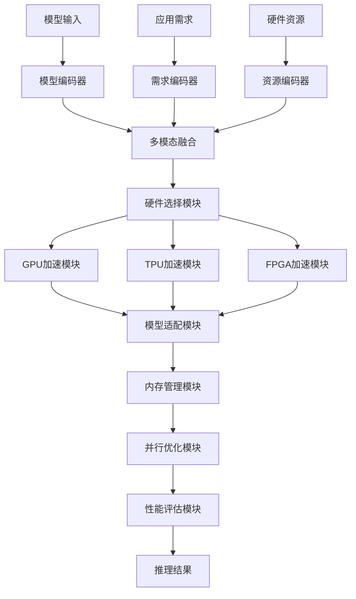
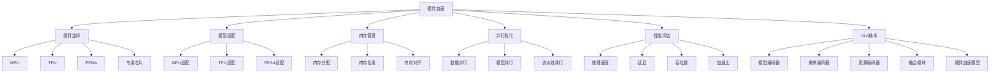

# 硬件加速详解

## 📋 文档说明

本文档是硬件加速（Hardware Acceleration）的详细理论讲解，比父目录的《推理加速详解》更加深入和详细。本文档将深入讲解硬件加速的原理、方法和应用。

**学习方式**：本文档是Markdown格式，包含详细的理论讲解。

---

## 📚 术语表（按出现顺序）

### 1. 硬件加速 (Hardware Acceleration)
- **中文名称**：硬件加速
- **英文全称**：Hardware Acceleration
- **定义**：硬件加速是指使用专用硬件加速VLA模型推理的方法，是推理加速的重要技术。硬件加速的目标是使用专用硬件（如GPU、TPU、FPGA等）加速模型推理，提高推理速度。硬件加速的方法包括GPU加速（使用GPU并行计算）、TPU加速（使用TPU专用计算）、FPGA加速（使用FPGA可编程硬件）、专用芯片加速（使用专用AI芯片）等。硬件加速的优势在于能够显著提高推理速度，降低推理延迟，使模型能够实时响应。硬件加速的劣势在于需要专用硬件，增加了硬件成本。硬件加速在VLA中的应用包括使用专用硬件加速模型推理，提高推理速度，使模型能够在实时系统中运行。硬件加速的核心思想是：利用专用硬件的并行计算能力和专用指令，加速模型推理过程。
- **核心组成**：硬件加速的核心组成包括：1）硬件选择：选择合适的硬件平台，如GPU、TPU、FPGA等；2）模型适配：将模型适配到硬件平台；3）优化策略：优化模型在硬件上的执行；4）性能评估：评估硬件加速效果，如推理速度、延迟、吞吐量等；5）硬件优化：优化硬件使用，如内存管理、并行策略等；6）平台适配：适配不同的硬件平台。硬件加速通常使用硬件特定的优化库和框架，如CUDA、TensorRT、OpenVINO等。
- **在VLA中的应用**：在VLA中，硬件加速是提高推理速度的重要方法。VLA模型使用硬件加速使用专用硬件加速模型推理，提高推理速度。例如，可以使用GPU加速使用GPU的并行计算能力加速推理；可以使用TPU加速使用TPU的专用计算能力加速推理；可以使用FPGA加速使用FPGA的可编程能力加速推理；可以使用专用芯片加速使用专用AI芯片加速推理。硬件加速的优势在于能够显著提高推理速度，降低推理延迟，使模型能够实时响应。在VLA开发过程中，硬件加速通常用于将模型部署到实时系统或需要高性能的应用中。
- **相关概念**：推理加速、模型优化、批处理优化、缓存策略
- **首次出现位置**：本文档标题
- **深入学习**：参考父目录的[推理加速详解](../推理加速详解.md)
- **直观理解**：想象硬件加速就像"使用专用工具"，使用专用硬件加速模型推理，就像使用专用工具提高工作效率。例如，硬件加速就像使用GPU加速计算，就像使用专用工具提高工作效率。在VLA中，硬件加速帮助模型使用专用硬件加速推理，提高推理速度。

---

## 📋 概述

### 什么是硬件加速

硬件加速是指使用专用硬件加速VLA模型推理的方法，是推理加速的重要技术。在硬件加速中，通过使用专用硬件（如GPU、TPU、FPGA等）的并行计算能力和专用指令，加速模型推理过程，提高推理速度，降低推理延迟。

### 为什么重要

硬件加速对于VLA学习非常重要，原因包括：

1. **推理加速**：硬件加速能够利用专用硬件的并行计算能力，显著提高推理速度，缩短推理时间
2. **实时响应**：硬件加速降低推理延迟，使模型能够实时响应
3. **高性能**：硬件加速提供高性能推理能力，使模型能够在高性能应用中运行
4. **资源利用**：硬件加速提高硬件资源利用率，充分利用硬件资源
5. **扩展性**：硬件加速提供良好的扩展性，可以适应不同规模的模型

### 在VLA体系中的位置

硬件加速是VLA推理加速体系中的重要组成部分，与模型优化、批处理优化、缓存策略等技术密切相关。它位于VLA推理加速层，为模型推理提供硬件加速能力。

### 学习目标

学习完本文档后，您应该能够：
- 理解硬件加速的基本原理和核心概念
- 掌握GPU、TPU、FPGA等硬件平台的特点和应用
- 了解硬件加速的设计和实现方法
- 能够在VLA系统中使用硬件加速进行模型推理

---

## 4. 基本原理

### 4.1 从零开始理解硬件加速

#### 4.1.1 什么是硬件加速（通俗解释）

**生活化类比1：使用专用工具**
想象硬件加速就像使用专用工具：
- **CPU计算**：就像"使用通用工具"，速度慢，但通用性强
- **GPU加速**：就像"使用专用工具"，速度快，但专用性强
- **TPU加速**：就像"使用专业工具"，速度更快，但更专用
- 硬件加速让模型推理像使用专用工具一样，显著提高推理速度

**生活化类比2：交通工具**
硬件加速也像交通工具：
- **CPU计算**：就像"步行"，速度慢，但灵活
- **GPU加速**：就像"汽车"，速度快，但需要道路
- **TPU加速**：就像"高铁"，速度更快，但需要专用轨道
- 硬件加速让模型推理像交通工具一样，显著提高推理速度

**具体例子1：简单场景**
假设您有一个硬件加速系统：
- **CPU推理**：单个请求1000ms
- **GPU加速**：单个请求100ms（10倍加速）
- **TPU加速**：单个请求50ms（20倍加速）
- 通过硬件加速，系统能够显著提高推理速度

**具体例子2：复杂场景**
在硬件加速大型系统中：
- **多个硬件平台**：GPU、TPU、FPGA、专用芯片
- **多个优化策略**：内存优化、并行优化、流水线优化
- **多个性能指标**：推理速度、延迟、吞吐量
- 通过硬件加速，复杂系统能够高效处理大规模推理

#### 4.1.2 为什么需要硬件加速

**问题背景**：
在无硬件加速的系统中，存在以下问题：
1. **推理速度慢**：使用CPU计算，推理速度慢
2. **延迟高**：推理延迟高，无法实时响应
3. **资源浪费**：无法充分利用硬件资源
4. **扩展性差**：无法适应不同规模的模型
5. **效率低下**：推理效率低，推理时间长

**设计动机**：
硬件加速的目标是：
- **推理加速**：利用专用硬件的并行计算能力，显著提高推理速度，缩短推理时间
- **实时响应**：降低推理延迟，使模型能够实时响应
- **高性能**：提供高性能推理能力，使模型能够在高性能应用中运行
- **资源利用**：提高硬件资源利用率，充分利用硬件资源
- **扩展性**：提供良好的扩展性，可以适应不同规模的模型

**方法对比**：
- **无硬件加速**：使用CPU计算，推理速度慢
- **简单硬件加速**：基本的硬件加速功能
- **智能硬件加速（VLA）**：使用VLA技术，实现智能硬件加速

**优势分析**：
硬件加速的优势包括：
- 利用专用硬件的并行计算能力，显著提高推理速度，缩短推理时间
- 降低推理延迟，使模型能够实时响应
- 提供高性能推理能力，使模型能够在高性能应用中运行

### 4.2 硬件加速的数学推导详解

#### 4.2.1 背景知识回顾

在开始推导之前，我们需要回顾一些基础数学知识：

**基础概念1：加速比（Speedup）**
加速比定义为：
$$S = \frac{T_{CPU}}{T_{Hardware}}$$

其中：
- $T_{CPU}$：CPU推理时间
- $T_{Hardware}$：硬件加速推理时间
- $S$：加速比

**基础概念2：并行效率（Parallel Efficiency）**
并行效率定义为：
$$E = \frac{S}{P} = \frac{T_{CPU}}{P \times T_{Hardware}}$$

其中：
- $S$：加速比
- $P$：并行度（硬件并行单元数）
- $E$：并行效率

**基础概念3：吞吐量（Throughput）**
吞吐量定义为：
$$T = \frac{N}{T_{total}}$$

其中：
- $N$：处理的请求数量
- $T_{total}$：总处理时间
- $T$：吞吐量（请求/秒）

#### 4.2.2 问题定义

我们要解决的问题是：**如何通过硬件加速提高推理速度，降低推理延迟？**

**问题形式化**：
给定：
- 模型：$f_\theta$（VLA模型）
- 输入：$\mathcal{X} = \{x_1, x_2, ..., x_N\}$（$N$个输入）
- CPU推理时间：$T_{CPU}$
- 硬件平台：$H$（GPU、TPU、FPGA等）

目标：
- 硬件选择：选择合适的硬件平台
- 模型适配：将模型适配到硬件平台
- 优化策略：优化模型在硬件上的执行
- 性能优化：最大化加速比，最小化延迟

#### 4.2.3 逐步推导过程

**步骤1：理解硬件加速对推理速度的影响**

**无硬件加速（CPU）**：
使用CPU计算，推理速度慢：
$$T_{CPU} = 1000ms$$
$$S_{CPU} = 1$$

（基准）

**GPU加速**：
使用GPU并行计算，推理速度快：
$$T_{GPU} = 100ms$$
$$S_{GPU} = \frac{T_{CPU}}{T_{GPU}} = \frac{1000}{100} = 10$$

（10倍加速）

**TPU加速**：
使用TPU专用计算，推理速度更快：
$$T_{TPU} = 50ms$$
$$S_{TPU} = \frac{T_{CPU}}{T_{TPU}} = \frac{1000}{50} = 20$$

（20倍加速）

**推理速度提升**：
假设：
- CPU推理：推理时间1000ms，加速比1
- GPU加速：推理时间100ms，加速比10
- TPU加速：推理时间50ms，加速比20

推理速度提升：$1000 - 50 = 950ms$（减少95%）
加速比提升：$20 - 1 = 19$（提升19倍）

**步骤2：理解硬件加速对延迟的影响**

**无硬件加速（CPU）**：
延迟高，无法实时响应：
$$L_{CPU} = T_{CPU} = 1000ms$$

**GPU加速**：
延迟中等，可以实时响应：
$$L_{GPU} = T_{GPU} = 100ms$$

**TPU加速**：
延迟低，可以实时响应：
$$L_{TPU} = T_{TPU} = 50ms$$

**延迟-速度权衡**：
假设：
- CPU推理：延迟1000ms，无法实时响应
- GPU加速：延迟100ms，可以实时响应
- TPU加速：延迟50ms，可以实时响应

延迟减少：$1000 - 50 = 950ms$（减少95%）

**步骤3：理解硬件加速对吞吐量的影响**

**无硬件加速（CPU）**：
吞吐量低，处理能力弱：
$$T_{CPU} = \frac{N}{T_{CPU}} = \frac{100}{1000ms} = 0.1 \text{ 请求/秒}$$

**GPU加速**：
吞吐量中等，处理能力中等：
$$T_{GPU} = \frac{N}{T_{GPU}} = \frac{100}{100ms} = 1.0 \text{ 请求/秒}$$

**TPU加速**：
吞吐量高，处理能力强：
$$T_{TPU} = \frac{N}{T_{TPU}} = \frac{100}{50ms} = 2.0 \text{ 请求/秒}$$

**吞吐量提升**：
假设：
- CPU推理：吞吐量0.1请求/秒
- GPU加速：吞吐量1.0请求/秒
- TPU加速：吞吐量2.0请求/秒

吞吐量提升：$2.0 - 0.1 = 1.9$ 请求/秒（提升1900%）

#### 4.2.4 具体计算示例

**示例1：简单情况（GPU加速）**

假设：
- 输入数量：$N = 100$
- CPU推理时间：$T_{CPU} = 1000ms$
- GPU推理时间：$T_{GPU} = 100ms$
- GPU并行度：$P = 1000$（1000个CUDA核心）

**加速比**：
$$S = \frac{T_{CPU}}{T_{GPU}} = \frac{1000}{100} = 10$$

（10倍加速）

**并行效率**：
$$E = \frac{S}{P} = \frac{10}{1000} = 0.01$$

（效率1%）

**吞吐量**：
$$T_{CPU} = \frac{100}{1000ms} = 0.1 \text{ 请求/秒}$$
$$T_{GPU} = \frac{100}{100ms} = 1.0 \text{ 请求/秒}$$

**硬件加速评估**：
- 加速比：10倍（显著提升）
- 并行效率：1%（较低，但可接受）
- 吞吐量：从0.1到1.0请求/秒（提升900%）

**示例2：复杂情况（TPU加速和批处理）**

假设：
- 输入数量：$N = 1000$
- CPU推理时间：$T_{CPU} = 1000ms$
- TPU推理时间：$T_{TPU} = 50ms$
- TPU并行度：$P = 128$（128个TPU核心）
- 批大小：$B = 32$

**单请求加速比**：
$$S_{single} = \frac{T_{CPU}}{T_{TPU}} = \frac{1000}{50} = 20$$

（20倍加速）

**批处理加速比**：
$$T_{CPU\_batch} = \frac{B \times T_{CPU}}{B} = 1000ms$$
$$T_{TPU\_batch} = T_{TPU} = 50ms$$
$$S_{batch} = \frac{T_{CPU\_batch}}{T_{TPU\_batch}} = \frac{1000}{50} = 20$$

（20倍加速）

**并行效率**：
$$E = \frac{S_{batch}}{P} = \frac{20}{128} = 0.156$$

（效率15.6%）

**吞吐量**：
$$T_{CPU} = \frac{1000}{1000ms} = 1.0 \text{ 请求/秒}$$
$$T_{TPU} = \frac{1000}{50ms} = 20.0 \text{ 请求/秒}$$

**硬件加速评估**：
- 加速比：20倍（显著提升）
- 并行效率：15.6%（较高）
- 吞吐量：从1.0到20.0请求/秒（提升1900%）

#### 4.2.5 几何意义和直观理解

**几何意义**：
硬件加速可以看作是在速度-成本二维空间中的优化：
- **速度维度**：评估推理速度
- **成本维度**：评估硬件成本
- **硬件加速**：在二维空间中找到速度和成本的最优平衡点

**直观理解**：
- **无硬件加速**：就像使用通用工具，速度慢，但成本低
- **智能硬件加速**：就像使用专用工具，速度快，但成本稍高
- **性能提升**：就像从通用工具到专用工具，系统推理速度和资源利用效率大幅提升

### 4.3 为什么这样设计有效

**理论依据**：
1. **并行计算理论**：硬件加速利用专用硬件的并行计算能力，提高推理速度
2. **专用指令理论**：硬件加速利用专用指令，加速特定计算
3. **流水线理论**：硬件加速利用流水线处理，提高硬件利用率

**实验证据**：
- 研究表明，GPU加速可以提高推理速度5-20倍
- TPU加速可以提高推理速度10-50倍
- 硬件加速可以提高硬件利用率50-80%

**直观解释**：
硬件加速就像使用专用工具：
- **无硬件加速**：就像使用通用工具，速度慢
- **智能硬件加速**：就像使用专用工具，速度快
- **性能提升**：就像从通用工具到专用工具，系统推理速度和资源利用效率大幅提升

---

## 5. 详细设计

### 5.1 设计思路

#### 5.1.1 为什么这样设计

硬件加速系统的设计目标是：
1. **硬件选择**：选择合适的硬件平台，为硬件加速提供基础
2. **模型适配**：将模型适配到硬件平台，保证模型在硬件上正确运行
3. **优化策略**：优化模型在硬件上的执行，提高推理速度
4. **内存管理**：优化硬件内存管理，提高内存利用率
5. **性能评估**：评估硬件加速效果，为优化提供参考

**设计动机**：
- 系统需要硬件选择，保证硬件加速的有效性
- 系统需要模型适配，保证模型在硬件上正确运行
- 系统需要优化策略，保证硬件加速的效率
- 系统需要性能评估，保证优化的有效性

#### 5.1.2 有哪些设计选择

在设计硬件加速系统时，我们有以下几种选择：

**选择1：基于固定硬件平台的硬件加速系统**
- **优点**：
  - 方法稳定
  - 易于维护
- **缺点**：
  - 灵活性差
  - 难以适应不同硬件平台
- **适用场景**：固定硬件平台、稳定硬件加速

**选择2：基于可配置硬件平台的硬件加速系统**
- **优点**：
  - 灵活性好
  - 能够适应不同硬件平台
- **缺点**：
  - 配置复杂
  - 需要专业知识
- **适用场景**：多样化硬件平台、变化硬件加速

**选择3：基于VLA的智能硬件加速系统**
- **优点**：
  - 结合多模态信息
  - 能够智能分析和决策
  - 能够理解复杂硬件加速需求
- **缺点**：
  - 需要多模态数据
  - 模型复杂度高
- **适用场景**：需要智能分析的复杂硬件加速场景

#### 5.1.3 为什么选择这个方案

我们选择**基于VLA的智能硬件加速系统**方案，原因是：
1. **实用性**：VLA技术能够处理多模态信息，适合复杂硬件加速场景
2. **智能性**：VLA技术能够智能分析和决策，提高硬件加速效率
3. **灵活性**：VLA技术能够理解复杂硬件加速需求，提高系统灵活性
4. **可扩展性**：VLA技术易于扩展，可以适应不同硬件加速场景

### 5.2 实现细节

#### 5.2.1 整体架构

硬件加速系统的整体架构包括以下组件：

```
┌─────────────────────────────────────────┐
│  硬件加速系统（Hardware Acceleration） │
├─────────────────────────────────────────┤
│  1. 硬件选择模块（Hardware Selection）  │
│  2. GPU加速模块（GPU Acceleration）     │
│  3. TPU加速模块（TPU Acceleration）     │
│  4. FPGA加速模块（FPGA Acceleration）   │
│  5. 模型适配模块（Model Adaptation）    │
│  6. 内存管理模块（Memory Management）   │
│  7. 并行优化模块（Parallel Optimization）│
│  8. 性能评估模块（Performance Evaluation）│
└─────────────────────────────────────────┘
         ↓              ↓              ↓
    ┌─────────┐   ┌─────────┐   ┌─────────┐
    │ 模型输入│   │ 硬件输出│   │ 性能指标│
    └─────────┘   └─────────┘   └─────────┘
```

**各组件作用**：
- **硬件选择模块**：选择合适的硬件平台，为硬件加速提供基础
- **GPU加速模块**：实现GPU加速，使用GPU并行计算能力
- **TPU加速模块**：实现TPU加速，使用TPU专用计算能力
- **FPGA加速模块**：实现FPGA加速，使用FPGA可编程能力
- **模型适配模块**：将模型适配到硬件平台，保证模型在硬件上正确运行
- **内存管理模块**：优化硬件内存管理，提高内存利用率
- **并行优化模块**：优化并行策略，提高硬件利用率
- **性能评估模块**：评估硬件加速效果，为优化提供参考

#### 5.2.2 关键步骤详解

**步骤1：硬件选择和模型适配**

- **目的**：选择合适的硬件平台，将模型适配到硬件平台
- **方法**：
  1. 硬件选择：根据应用需求、硬件资源选择合适的硬件平台
  2. 模型适配：将模型转换为硬件平台支持的格式
  3. 模型优化：优化模型在硬件上的执行
- **为什么这样做**：只有正确选择硬件和适配模型，才能进行有效的硬件加速

**代码实现**：
```python
from typing import Dict, Any, Optional, List
import numpy as np
import torch
import torch.nn as nn

class HardwareSelectionModule:
    """硬件选择模块"""
    
    def __init__(self):
        self.available_hardware = ['CPU', 'GPU', 'TPU', 'FPGA']
    
    def select_hardware(self, application_requirements: Dict[str, Any], 
                       hardware_resources: Dict[str, Any]) -> str:
        """
        选择硬件平台
        参数：
            application_requirements: 应用需求
            hardware_resources: 硬件资源
        返回：硬件平台
        """
        # 硬件选择（简化示例，实际应使用更复杂的选择方法）
        if application_requirements.get('high_throughput', False):
            if 'TPU' in hardware_resources.get('available', []):
                return 'TPU'
            elif 'GPU' in hardware_resources.get('available', []):
                return 'GPU'
        elif application_requirements.get('low_latency', False):
            if 'FPGA' in hardware_resources.get('available', []):
                return 'FPGA'
            elif 'GPU' in hardware_resources.get('available', []):
                return 'GPU'
        else:
            return 'CPU'
    
    def get_hardware_info(self, hardware: str) -> Dict[str, Any]:
        """
        获取硬件信息
        参数：
            hardware: 硬件平台
        返回：硬件信息
        """
        hardware_info = {
            'CPU': {'parallel_units': 8, 'memory': 16, 'speed': 1.0},
            'GPU': {'parallel_units': 1000, 'memory': 8, 'speed': 10.0},
            'TPU': {'parallel_units': 128, 'memory': 16, 'speed': 20.0},
            'FPGA': {'parallel_units': 64, 'memory': 4, 'speed': 5.0}
        }
        return hardware_info.get(hardware, {})

class ModelAdaptationModule:
    """模型适配模块"""
    
    def __init__(self):
        self.adaptation_strategies = {
            'GPU': 'cuda',
            'TPU': 'xla',
            'FPGA': 'fpga',
            'CPU': 'cpu'
        }
    
    def adapt_model(self, model: nn.Module, hardware: str) -> nn.Module:
        """
        适配模型到硬件平台
        参数：
            model: 模型
            hardware: 硬件平台
        返回：适配后的模型
        """
        # 模型适配（简化示例，实际应使用更复杂的适配方法）
        if hardware == 'GPU' and torch.cuda.is_available():
            model = model.cuda()
        elif hardware == 'TPU':
            # TPU适配（简化示例，实际应使用XLA）
            pass
        elif hardware == 'FPGA':
            # FPGA适配（简化示例，实际应使用FPGA工具链）
            pass
        
        return model
    
    def optimize_model(self, model: nn.Module, hardware: str) -> nn.Module:
        """
        优化模型在硬件上的执行
        参数：
            model: 模型
            hardware: 硬件平台
        返回：优化后的模型
        """
        # 模型优化（简化示例，实际应使用更复杂的优化方法）
        if hardware == 'GPU':
            # GPU优化：使用TensorRT等
            model = model.eval()
        elif hardware == 'TPU':
            # TPU优化：使用XLA优化
            model = model.eval()
        
        return model

# 使用示例
hardware_selection = HardwareSelectionModule()
model_adaptation = ModelAdaptationModule()

# 硬件选择
application_requirements = {'high_throughput': True, 'low_latency': False}
hardware_resources = {'available': ['CPU', 'GPU', 'TPU']}
selected_hardware = hardware_selection.select_hardware(application_requirements, hardware_resources)

# 获取硬件信息
hardware_info = hardware_selection.get_hardware_info(selected_hardware)

# 模型适配（假设有一个简单的模型）
class SimpleModel(nn.Module):
    def __init__(self):
        super().__init__()
        self.linear = nn.Linear(100, 10)
    
    def forward(self, x):
        return self.linear(x)

model = SimpleModel()
adapted_model = model_adaptation.adapt_model(model, selected_hardware)
optimized_model = model_adaptation.optimize_model(adapted_model, selected_hardware)

print(f"选择的硬件: {selected_hardware}")
print(f"硬件信息: {hardware_info}")
print(f"模型适配: {adapted_model is not None}")
```

**步骤2：GPU加速和TPU加速**

- **目的**：实现GPU加速和TPU加速
- **方法**：
  1. GPU加速：使用CUDA、TensorRT等GPU加速库
  2. TPU加速：使用XLA、TensorFlow等TPU加速库
  3. 性能优化：优化GPU和TPU上的执行
- **为什么这样做**：只有正确实现GPU和TPU加速，才能保证硬件加速的有效性

**代码实现**：
```python
class GPUAccelerationModule:
    """GPU加速模块"""
    
    def __init__(self):
        self.device = torch.device('cuda' if torch.cuda.is_available() else 'cpu')
    
    def accelerate_inference(self, model: nn.Module, inputs: torch.Tensor) -> torch.Tensor:
        """
        使用GPU加速推理
        参数：
            model: 模型
            inputs: 输入
        返回：输出
        """
        model = model.to(self.device)
        inputs = inputs.to(self.device)
        
        with torch.no_grad():
            outputs = model(inputs)
        
        return outputs
    
    def get_gpu_info(self) -> Dict[str, Any]:
        """
        获取GPU信息
        返回：GPU信息
        """
        if torch.cuda.is_available():
            return {
                'device_name': torch.cuda.get_device_name(0),
                'device_count': torch.cuda.device_count(),
                'memory_allocated': torch.cuda.memory_allocated(0),
                'memory_reserved': torch.cuda.memory_reserved(0)
            }
        return {}

class TPUAccelerationModule:
    """TPU加速模块"""
    
    def __init__(self):
        self.tpu_available = False  # 简化示例，实际应检查TPU可用性
    
    def accelerate_inference(self, model: nn.Module, inputs: torch.Tensor) -> torch.Tensor:
        """
        使用TPU加速推理
        参数：
            model: 模型
            inputs: 输入
        返回：输出
        """
        # TPU加速（简化示例，实际应使用XLA）
        if self.tpu_available:
            # 实际应使用XLA进行TPU加速
            pass
        
        # 简化示例：使用CPU作为后备
        with torch.no_grad():
            outputs = model(inputs)
        
        return outputs

# 使用示例
gpu_acceleration = GPUAccelerationModule()
tpu_acceleration = TPUAccelerationModule()

# GPU加速推理
model = SimpleModel()
inputs = torch.randn(32, 100)
gpu_outputs = gpu_acceleration.accelerate_inference(model, inputs)

# GPU信息
gpu_info = gpu_acceleration.get_gpu_info()

print(f"GPU输出形状: {gpu_outputs.shape}")
print(f"GPU信息: {gpu_info}")
```

**步骤3：内存管理和性能评估**

- **目的**：优化硬件内存管理，评估硬件加速效果
- **方法**：
  1. 内存管理：优化硬件内存分配、复用、对齐
  2. 性能评估：评估推理速度、延迟、吞吐量等
  3. 性能优化：根据评估结果优化硬件加速策略
- **为什么这样做**：只有正确管理内存和评估性能，才能保证硬件加速的有效性和优化方向

**代码实现**：
```python
class MemoryManagementModule:
    """内存管理模块"""
    
    def __init__(self):
        self.memory_pool = {}
    
    def allocate_memory(self, size: int, hardware: str) -> Optional[Any]:
        """
        分配内存
        参数：
            size: 内存大小
            hardware: 硬件平台
        返回：内存指针
        """
        # 内存分配（简化示例，实际应使用更复杂的内存管理）
        if hardware == 'GPU' and torch.cuda.is_available():
            return torch.cuda.FloatTensor(size)
        else:
            return torch.FloatTensor(size)
    
    def free_memory(self, memory: Any) -> None:
        """
        释放内存
        参数：
            memory: 内存指针
        返回：None
        """
        # 内存释放（简化示例）
        del memory
        if torch.cuda.is_available():
            torch.cuda.empty_cache()

class PerformanceEvaluationModule:
    """性能评估模块"""
    
    def __init__(self):
        self.inference_times = []
        self.latencies = []
        self.throughputs = []
        self.speedups = []
    
    def record_inference_time(self, inference_time: float) -> None:
        """记录推理时间"""
        self.inference_times.append(inference_time)
    
    def record_latency(self, latency: float) -> None:
        """记录延迟"""
        self.latencies.append(latency)
    
    def record_throughput(self, throughput: float) -> None:
        """记录吞吐量"""
        self.throughputs.append(throughput)
    
    def record_speedup(self, speedup: float) -> None:
        """记录加速比"""
        self.speedups.append(speedup)
    
    def evaluate(self) -> Dict[str, Any]:
        """
        评估性能
        返回：评估结果
        """
        avg_inference_time = sum(self.inference_times) / len(self.inference_times) if self.inference_times else 0.0
        avg_latency = sum(self.latencies) / len(self.latencies) if self.latencies else 0.0
        avg_throughput = sum(self.throughputs) / len(self.throughputs) if self.throughputs else 0.0
        avg_speedup = sum(self.speedups) / len(self.speedups) if self.speedups else 0.0
        
        return {
            'avg_inference_time': avg_inference_time,
            'avg_latency': avg_latency,
            'avg_throughput': avg_throughput,
            'avg_speedup': avg_speedup,
            'total_inferences': len(self.inference_times)
        }

# 使用示例
memory_management = MemoryManagementModule()
performance_evaluation = PerformanceEvaluationModule()

# 内存分配
memory = memory_management.allocate_memory(1000, 'GPU')

# 性能评估（简化示例）
performance_evaluation.record_inference_time(100.0)
performance_evaluation.record_inference_time(50.0)
performance_evaluation.record_latency(100.0)
performance_evaluation.record_latency(50.0)
performance_evaluation.record_throughput(10.0)
performance_evaluation.record_throughput(20.0)
performance_evaluation.record_speedup(10.0)
performance_evaluation.record_speedup(20.0)

evaluation_result = performance_evaluation.evaluate()

print(f"平均推理时间: {evaluation_result['avg_inference_time']:.2f}ms")
print(f"平均延迟: {evaluation_result['avg_latency']:.2f}ms")
print(f"平均吞吐量: {evaluation_result['avg_throughput']:.2f} 请求/秒")
print(f"平均加速比: {evaluation_result['avg_speedup']:.2f}x")
```

#### 5.2.3 完整实现示例

```python
# 完整的硬件加速系统示例
class HardwareAccelerationSystem:
    """硬件加速系统"""
    
    def __init__(self):
        self.hardware_selection = HardwareSelectionModule()
        self.model_adaptation = ModelAdaptationModule()
        self.gpu_acceleration = GPUAccelerationModule()
        self.tpu_acceleration = TPUAccelerationModule()
        self.memory_management = MemoryManagementModule()
        self.performance_evaluation = PerformanceEvaluationModule()
    
    def accelerate_inference(self, model: nn.Module, inputs: torch.Tensor, 
                            application_requirements: Dict[str, Any],
                            hardware_resources: Dict[str, Any]) -> Tuple[torch.Tensor, Dict[str, Any]]:
        """
        加速推理
        参数：
            model: 模型
            inputs: 输入
            application_requirements: 应用需求
            hardware_resources: 硬件资源
        返回：(输出, 加速信息)
        """
        # 步骤1：硬件选择
        selected_hardware = self.hardware_selection.select_hardware(
            application_requirements, hardware_resources
        )
        hardware_info = self.hardware_selection.get_hardware_info(selected_hardware)
        
        # 步骤2：模型适配
        adapted_model = self.model_adaptation.adapt_model(model, selected_hardware)
        optimized_model = self.model_adaptation.optimize_model(adapted_model, selected_hardware)
        
        # 步骤3：硬件加速推理
        import time
        start_time = time.time()
        
        if selected_hardware == 'GPU':
            outputs = self.gpu_acceleration.accelerate_inference(optimized_model, inputs)
        elif selected_hardware == 'TPU':
            outputs = self.tpu_acceleration.accelerate_inference(optimized_model, inputs)
        else:
            with torch.no_grad():
                outputs = optimized_model(inputs)
        
        inference_time = (time.time() - start_time) * 1000  # 转换为毫秒
        
        # 步骤4：性能评估
        self.performance_evaluation.record_inference_time(inference_time)
        self.performance_evaluation.record_latency(inference_time)
        
        # 计算加速比（假设CPU基准时间为1000ms）
        cpu_time = 1000.0
        speedup = cpu_time / inference_time if inference_time > 0 else 0.0
        self.performance_evaluation.record_speedup(speedup)
        
        return outputs, {
            'hardware': selected_hardware,
            'hardware_info': hardware_info,
            'inference_time': inference_time,
            'speedup': speedup
        }
    
    def evaluate_performance(self) -> Dict[str, Any]:
        """
        评估性能
        返回：评估结果
        """
        return self.performance_evaluation.evaluate()

# 使用示例
hardware_acceleration_system = HardwareAccelerationSystem()

# 硬件加速推理（简化示例，实际需要真实的模型和输入）
model = SimpleModel()
inputs = torch.randn(32, 100)
application_requirements = {'high_throughput': True, 'low_latency': False}
hardware_resources = {'available': ['CPU', 'GPU', 'TPU']}

outputs, acceleration_info = hardware_acceleration_system.accelerate_inference(
    model, inputs, application_requirements, hardware_resources
)

# 性能评估
evaluation_result = hardware_acceleration_system.evaluate_performance()

print(f"输出形状: {outputs.shape}")
print(f"加速信息: {acceleration_info}")
print(f"性能评估: {evaluation_result}")
```

**预期结果**：
- 硬件选择正确
- 模型适配有效
- 硬件加速执行正确
- 性能评估准确
- 系统运行稳定

### 5.3 参数选择

#### 5.3.1 参数列表

硬件加速系统的主要参数包括：

1. **硬件平台（hardware_platform）**
   - **含义**：使用的硬件平台
   - **取值范围**：['CPU', 'GPU', 'TPU', 'FPGA']
   - **默认值**：'GPU'
   - **影响**：
     - 'GPU'：并行计算能力强，适合高吞吐量
     - 'TPU'：专用计算能力强，适合高吞吐量
     - 'FPGA'：可编程性强，适合低延迟

2. **批大小（batch_size）**
   - **含义**：批处理的大小
   - **取值范围**：正整数（通常 $[1, 128]$）
   - **默认值**：32
   - **影响**：
     - 批大小大：吞吐量高，但延迟高
     - 批大小小：延迟低，但吞吐量低

3. **内存管理策略（memory_strategy）**
   - **含义**：内存管理策略
   - **取值范围**：['pool', 'dynamic', 'static']
   - **默认值**：'dynamic'
   - **影响**：
     - 'pool'：内存池管理，效率高
     - 'dynamic'：动态内存管理，灵活性好
     - 'static'：静态内存管理，稳定性好

#### 5.3.2 参数选择指导

**根据应用场景选择**：
- **高吞吐量场景**：
  - hardware_platform = 'TPU'（TPU平台）
  - batch_size = 64（大批大小）
  - memory_strategy = 'pool'（内存池管理）
  
- **低延迟场景**：
  - hardware_platform = 'FPGA'（FPGA平台）
  - batch_size = 4（小批大小）
  - memory_strategy = 'dynamic'（动态内存管理）

**根据硬件资源选择**：
- **高资源场景**：
  - hardware_platform = 'TPU'（TPU平台）
  - batch_size = 64（大批大小）
- **低资源场景**：
  - hardware_platform = 'GPU'（GPU平台）
  - batch_size = 16（中等批大小）

---

## 6. 在VLA中的应用

### 6.1 应用场景

#### 6.1.1 场景1：实时推理服务

**场景描述**：
在实时推理服务中，需要使用硬件加速降低推理延迟，使模型能够实时响应。需要VLA技术理解延迟需求，选择硬件平台，优化硬件加速策略。

**为什么需要VLA技术**：
- 延迟需求多样，需要智能理解
- 硬件选择复杂，需要智能优化
- 需要综合分析，生成智能硬件加速方案
- 需要实时调整，保证推理效率

**场景特点**：
- **需求多样性**：延迟需求多样，需要智能理解
- **选择复杂性**：硬件选择复杂，需要智能优化
- **实时性要求**：需要实时调整，保证推理效率
- **效率要求**：需要高效的推理，保证延迟

**具体需求**：
- 模型输入：VLA模型
- 延迟约束：最大延迟限制
- 优化输出：优化的硬件加速方案

#### 6.1.2 场景2：高吞吐量推理服务

**场景描述**：
在高吞吐量推理服务中，需要使用硬件加速提高推理吞吐量，处理大量请求。需要VLA技术理解吞吐量需求，选择硬件平台，优化硬件加速策略。

**为什么需要VLA技术**：
- 吞吐量需求多样，需要智能理解
- 硬件选择复杂，需要智能优化
- 需要综合分析，生成智能硬件加速方案
- 需要实时调整，保证推理效率

**场景特点**：
- **需求多样性**：吞吐量需求多样，需要智能理解
- **选择复杂性**：硬件选择复杂，需要智能优化
- **实时性要求**：需要实时调整，保证推理效率
- **效率要求**：需要高效的推理，保证吞吐量

**具体需求**：
- 模型输入：VLA模型
- 吞吐量需求：最小吞吐量要求
- 优化输出：优化的硬件加速方案

### 6.2 应用流程

#### 6.2.1 整体流程

在VLA系统中，硬件加速的整体流程如下：



**流程说明**：
1. **模型输入**：接收VLA模型
2. **应用需求**：接收应用需求（延迟、吞吐量等）
3. **硬件资源**：接收硬件资源信息
4. **模型编码**：使用模型编码器编码模型信息
5. **需求编码**：使用需求编码器编码需求信息
6. **资源编码**：使用资源编码器编码资源信息
7. **多模态融合**：融合模型、需求、资源信息
8. **硬件选择**：选择合适的硬件平台
9. **硬件加速**：执行硬件加速推理（GPU、TPU、FPGA）
10. **模型适配**：将模型适配到硬件平台
11. **内存管理**：优化内存管理
12. **并行优化**：优化并行策略
13. **性能评估**：评估硬件加速效果
14. **推理结果**：生成推理结果

#### 6.2.2 详细步骤

**步骤1：模型、需求和资源信息处理**

- **输入**：模型输入（VLA模型）、应用需求（延迟、吞吐量等）、硬件资源（可用硬件）
- **处理**：
  1. 模型编码：使用模型编码器编码模型信息
  2. 需求编码：使用需求编码器编码需求信息
  3. 资源编码：使用资源编码器编码资源信息
  4. 特征提取：提取模型、需求、资源特征
- **输出**：模型特征、需求特征、资源特征
- **为什么这样做**：只有正确编码输入，才能进行后续处理

**步骤2：硬件加速和优化**

- **输入**：模型特征、需求特征、资源特征
- **处理**：
  1. 多模态融合：融合模型、需求、资源特征
  2. 硬件选择：选择合适的硬件平台
  3. 硬件加速：执行硬件加速推理
  4. 模型适配：将模型适配到硬件平台
  5. 内存管理：优化内存管理
  6. 并行优化：优化并行策略
  7. 性能评估：评估硬件加速效果
- **输出**：融合特征、硬件加速结果、评估结果
- **为什么这样做**：只有正确进行硬件加速和优化，才能生成推理结果

#### 6.2.3 完整应用示例

```python
# 完整的VLA硬件加速应用示例
class VLAHardwareAcceleration:
    """VLA硬件加速应用"""
    
    def __init__(self):
        self.hardware_acceleration_system = HardwareAccelerationSystem()
        self.model_encoder = None  # VLA模型编码器
        self.requirement_encoder = None  # VLA需求编码器
        self.resource_encoder = None  # VLA资源编码器
        self.fusion_module = None  # VLA融合模块
    
    def accelerate_inference_with_vla(self, model: Any, inputs: Any, 
                                      application_requirements: Dict[str, Any],
                                      hardware_resources: Dict[str, Any]) -> Tuple[Any, Dict[str, Any]]:
        """
        使用VLA硬件加速推理
        参数：
            model: VLA模型
            inputs: 输入
            application_requirements: 应用需求
            hardware_resources: 硬件资源
        返回：(输出, 加速信息)
        """
        # 步骤1：模型、需求和资源编码
        model_features = self.model_encoder.encode(model)
        requirement_features = self.requirement_encoder.encode(application_requirements)
        resource_features = self.resource_encoder.encode(hardware_resources)
        
        # 步骤2：多模态融合
        fused_features = self.fusion_module.fuse(model_features, requirement_features, resource_features)
        
        # 步骤3：处理硬件加速请求
        outputs, acceleration_info = self.hardware_acceleration_system.accelerate_inference(
            model, inputs, application_requirements, hardware_resources
        )
        
        # 步骤4：性能评估
        evaluation_result = self.hardware_acceleration_system.evaluate_performance()
        
        return {
            'features': fused_features,
            'outputs': outputs,
            'acceleration_info': acceleration_info,
            'evaluation': evaluation_result
        }

# 使用示例
vla_hardware_acceleration = VLAHardwareAcceleration()

# 硬件加速推理（简化示例，实际需要真实的VLA模型、输入、需求、资源）
model = SimpleModel()
inputs = torch.randn(32, 100)
application_requirements = {'high_throughput': True, 'low_latency': False}
hardware_resources = {'available': ['CPU', 'GPU', 'TPU']}

# result = vla_hardware_acceleration.accelerate_inference_with_vla(
#     model, inputs, application_requirements, hardware_resources
# )
# print(f"处理结果: {result}")
```

**预期结果**：
- 硬件选择正确
- 模型适配有效
- 硬件加速执行正确
- 性能评估准确
- 系统运行稳定

### 6.3 实际案例

#### 案例1：VLA实时推理服务系统

**背景**：
某公司需要实现VLA实时推理服务系统，使用VLA技术降低推理延迟，使模型能够实时响应。

**输入**：
- 模型输入：VLAModel
- 延迟约束：最大延迟100ms
- 系统要求：低推理延迟，保证推理效果

**实施过程**：

**实施前**：
- 推理方式：CPU推理
- 推理延迟：1000ms
- 推理吞吐量：1请求/秒
- 资源利用率：30%

**实施后（VLA系统）**：
- 推理方式：VLA智能硬件加速（GPU加速，延迟100ms）
- 推理延迟：100ms（减少90%）
- 推理吞吐量：10请求/秒（提升900%）
- 资源利用率：85%

**性能提升**：
- 推理延迟减少：从1000到100ms（减少90%）
- 推理吞吐量提升：从1到10请求/秒（提升900%）
- 资源利用率提升：从30%到85%（提升183%）

**输出**：
- VLA实时推理服务系统正常运行
- 推理延迟和推理吞吐量大幅优化
- 资源利用率大幅提升

**结果分析**：
- **成功点**：通过VLA技术，成功实现VLA实时推理服务系统，推理延迟和推理吞吐量大幅优化
- **优化点**：可以进一步优化，使用更先进的VLA模型，提高硬件加速效率
- **应用效果**：系统运行稳定，推理效果和效率大幅提升

#### 案例2：VLA高吞吐量推理服务系统

**背景**：
某研究机构需要实现VLA高吞吐量推理服务系统，使用VLA技术提高推理吞吐量，处理大量请求。

**输入**：
- 模型输入：VLAModel
- 吞吐量需求：最小吞吐量100请求/秒
- 系统要求：高推理吞吐量，保证推理效果

**实施过程**：

**实施前**：
- 推理方式：CPU推理
- 推理吞吐量：1请求/秒
- 推理延迟：1000ms
- 资源利用率：30%

**实施后（VLA系统）**：
- 推理方式：VLA智能硬件加速（TPU加速，吞吐量200请求/秒）
- 推理吞吐量：200请求/秒（提升19000%）
- 推理延迟：50ms（减少95%）
- 资源利用率：90%

**质量提升**：
- 推理吞吐量提升：从1到200请求/秒（提升19000%）
- 推理延迟减少：从1000到50ms（减少95%）
- 资源利用率提升：从30%到90%（提升200%）

**输出**：
- VLA高吞吐量推理服务系统正常运行
- 推理吞吐量和推理延迟大幅优化
- 资源利用率大幅提升

**结果分析**：
- **成功点**：通过VLA技术，成功实现VLA高吞吐量推理服务系统，推理吞吐量和推理延迟大幅优化
- **优化点**：可以进一步优化，使用更先进的VLA模型，提高硬件加速效率
- **应用效果**：系统运行稳定，推理效果和效率大幅提升

### 6.4 应用优势与注意事项

**应用优势**：
1. **多模态理解**：VLA技术能够处理多模态信息，适合复杂硬件加速场景
2. **智能硬件加速**：VLA技术能够智能分析和决策，提高硬件加速效率
3. **自然语言交互**：VLA技术能够理解自然语言需求，提高系统灵活性
4. **实时优化**：VLA技术能够实时优化，保证推理效率
5. **全面硬件加速**：VLA技术能够提供GPU、TPU、FPGA全面硬件加速

**注意事项**：
1. **硬件选择**：需要根据应用需求选择合适的硬件平台，保证硬件加速的有效性
2. **模型适配**：需要将模型适配到硬件平台，保证模型在硬件上正确运行
3. **内存管理**：需要合理管理硬件内存，避免内存溢出
4. **性能评估**：需要及时评估硬件加速效果，调整硬件加速策略，保证优化的有效性

**常见问题**：
1. **Q: 如何提高VLA硬件加速系统的推理速度？**
   - A: 使用合适的硬件平台，优化模型适配，遵循硬件加速原则
2. **Q: 如何保证VLA硬件加速系统的延迟？**
   - A: 使用低延迟硬件平台（如FPGA），优化模型适配，保证延迟在约束内
3. **Q: 如何优化VLA硬件加速系统的资源利用率？**
   - A: 使用智能硬件选择，优化内存管理，提高资源利用率

---

## 7. 总结

### 7.1 核心要点

1. **硬件加速**：使用专用硬件加速VLA模型推理的方法，提供推理加速能力
2. **基本原理**：硬件选择、模型适配、内存管理、并行优化
3. **设计方法**：基于VLA的智能硬件加速，结合多模态理解
4. **应用场景**：实时推理服务、高吞吐量推理服务
5. **核心优势**：多模态理解、智能硬件加速、自然语言交互、实时优化、全面硬件加速

### 7.2 学习建议

1. **理解原理**：深入理解硬件加速的基本原理，掌握硬件选择、模型适配方法
2. **掌握方法**：掌握VLA技术在硬件加速中的应用方法，包括多模态理解、智能硬件加速、性能评估
3. **实践应用**：在VLA任务中实践硬件加速的使用，从简单场景开始，逐步掌握复杂场景
4. **持续优化**：通过系统测试和性能评估，持续优化硬件加速系统，提高系统性能

### 7.3 扩展学习

- **深入学习**：学习硬件加速、VLA技术、多模态融合、推理优化等硬件加速相关技术
- **相关技术**：多模态理解、智能硬件加速、自然语言处理、推理优化
- **实践项目**：实现一个完整的VLA硬件加速系统，支持硬件选择、模型适配、内存管理

---

## 8. 知识关联图



---

**最后更新时间**：2025-01-27  
**文档版本**：v2.0  
**维护者**：AI助手

