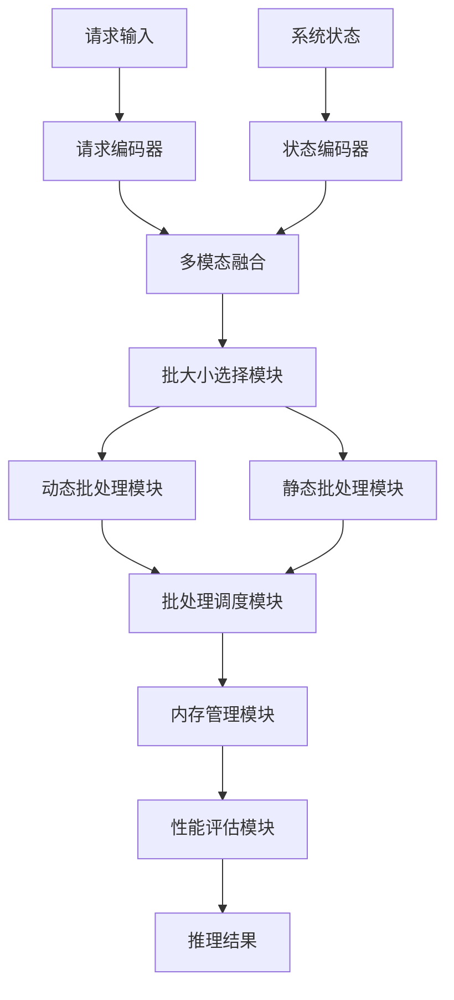
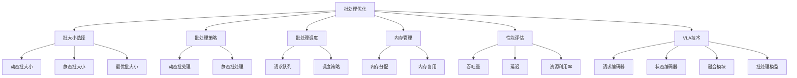

# 批处理优化详解

## 📋 文档说明

本文档是批处理优化（Batch Processing Optimization）的详细理论讲解，比父目录的《推理加速详解》更加深入和详细。本文档将深入讲解批处理优化的原理、方法和应用。

**学习方式**：本文档是Markdown格式，包含详细的理论讲解。

---

## 📚 术语表（按出现顺序）

### 1. 批处理优化 (Batch Processing Optimization)
- **中文名称**：批处理优化
- **英文全称**：Batch Processing Optimization
- **定义**：批处理优化是指通过批量处理输入数据提高VLA模型推理效率的方法，是推理加速的重要技术。批处理优化的目标是通过批量处理多个输入，提高推理吞吐量，降低平均推理时间。批处理优化的方法包括动态批处理（根据输入动态调整批大小）、静态批处理（使用固定的批大小）、批处理调度（优化批处理调度策略）等。批处理优化的优势在于能够提高推理吞吐量，降低平均推理时间，提高硬件利用率。批处理优化的劣势在于可能增加推理延迟，需要在吞吐量和延迟之间找到平衡点。批处理优化在VLA中的应用包括批量处理多个输入，提高推理吞吐量，使模型能够高效处理大量请求。批处理优化的核心思想是：通过批量处理多个输入，利用硬件的并行计算能力，提高推理效率。
- **核心组成**：批处理优化的核心组成包括：1）批大小选择：选择合适的批大小，平衡吞吐量和延迟；2）批处理策略：选择合适的批处理策略，如动态批处理、静态批处理等；3）批处理调度：优化批处理调度策略；4）内存管理：优化批处理的内存管理；5）性能评估：评估批处理效果，如吞吐量、延迟、资源利用率等；6）批处理优化：优化批处理过程，提高批处理效率。批处理优化通常使用动态批处理和静态批处理相结合的方法。
- **在VLA中的应用**：在VLA中，批处理优化是提高推理吞吐量的重要方法。VLA模型使用批处理优化批量处理多个输入，提高推理吞吐量。例如，可以使用动态批处理根据输入动态调整批大小，平衡吞吐量和延迟；可以使用静态批处理使用固定的批大小，提高推理效率；可以使用批处理调度优化批处理调度策略，提高硬件利用率。批处理优化的优势在于能够提高推理吞吐量，降低平均推理时间，提高硬件利用率。在VLA开发过程中，批处理优化通常用于处理大量请求的场景，特别是在需要高吞吐量的应用中。
- **相关概念**：推理加速、模型优化、硬件加速、缓存策略
- **首次出现位置**：本文档标题
- **深入学习**：参考父目录的[推理加速详解](../推理加速详解.md)
- **直观理解**：想象批处理优化就像"批量处理任务"，通过批量处理多个任务，提高处理效率。例如，批处理优化就像批量处理文件，通过批量处理多个文件，提高处理效率。在VLA中，批处理优化帮助模型批量处理多个输入，提高推理吞吐量。

---

## 📋 概述

### 什么是批处理优化

批处理优化是指通过批量处理输入数据提高VLA模型推理效率的方法，是推理加速的重要技术。在批处理优化中，通过批量处理多个输入，利用硬件的并行计算能力，提高推理吞吐量，降低平均推理时间。

### 为什么重要

批处理优化对于VLA学习非常重要，原因包括：

1. **吞吐量提升**：批处理优化能够批量处理多个输入，提高推理吞吐量，缩短处理时间
2. **效率提升**：批处理优化降低平均推理时间，提高推理效率
3. **资源利用**：批处理优化提高硬件利用率，充分利用硬件资源
4. **成本降低**：批处理优化降低单位推理成本，提高经济效益
5. **扩展性**：批处理优化提供良好的扩展性，可以适应不同规模的请求

### 在VLA体系中的位置

批处理优化是VLA推理加速体系中的重要组成部分，与模型优化、硬件加速、缓存策略等技术密切相关。它位于VLA推理加速层，为模型推理提供批处理优化能力。

### 学习目标

学习完本文档后，您应该能够：
- 理解批处理优化的基本原理和核心概念
- 掌握动态批处理、静态批处理、批处理调度等批处理策略
- 了解批处理优化的设计和实现方法
- 能够在VLA系统中使用批处理优化进行模型推理

---

## 4. 基本原理

### 4.1 从零开始理解批处理优化

#### 4.1.1 什么是批处理优化（通俗解释）

**生活化类比1：批量处理任务**
想象批处理优化就像批量处理任务：
- **单个处理**：就像"一个一个处理任务"，速度慢，效率低
- **批量处理**：就像"一批一批处理任务"，速度快，效率高
- **动态批处理**：就像"根据任务量动态调整批次大小"，在保持效率的同时控制延迟
- 批处理优化让模型推理像批量处理任务一样，提高推理吞吐量，降低平均推理时间

**生活化类比2：工厂生产线**
批处理优化也像工厂生产线：
- **单个生产**：就像"一个一个生产产品"，速度慢，效率低
- **批量生产**：就像"一批一批生产产品"，速度快，效率高
- **动态调整**：就像"根据订单量动态调整生产批次"，在保持效率的同时控制库存
- 批处理优化让模型推理像工厂生产线一样，提高推理吞吐量，降低平均推理时间

**具体例子1：简单场景**
假设您有一个批处理优化系统：
- **输入**：100个推理请求
- **单个处理**：每个请求100ms，总时间10000ms
- **批量处理**：批大小32，每批150ms，总时间约500ms（3批）
- 通过批处理优化，系统能够大幅提高推理吞吐量

**具体例子2：复杂场景**
在批处理优化大型系统中：
- **多个批处理策略**：动态批处理、静态批处理、批处理调度
- **多个优化方法**：批大小优化、内存优化、调度优化
- **多个性能指标**：吞吐量、延迟、资源利用率
- 通过批处理优化，复杂系统能够高效处理大量请求

#### 4.1.2 为什么需要批处理优化

**问题背景**：
在无批处理优化的系统中，存在以下问题：
1. **吞吐量低**：单个处理，推理吞吐量低
2. **效率低下**：无法利用硬件并行能力，效率低
3. **资源浪费**：硬件资源利用率低，资源浪费
4. **成本高**：单位推理成本高，经济效益差
5. **扩展性差**：无法适应不同规模的请求

**设计动机**：
批处理优化的目标是：
- **吞吐量提升**：批量处理多个输入，提高推理吞吐量，缩短处理时间
- **效率提升**：降低平均推理时间，提高推理效率
- **资源利用**：提高硬件利用率，充分利用硬件资源
- **成本降低**：降低单位推理成本，提高经济效益
- **扩展性**：提供良好的扩展性，可以适应不同规模的请求

**方法对比**：
- **无批处理优化**：单个处理，推理吞吐量低
- **简单批处理优化**：基本的批处理功能
- **智能批处理优化（VLA）**：使用VLA技术，实现智能批处理优化

**优势分析**：
批处理优化的优势包括：
- 批量处理多个输入，提高推理吞吐量，缩短处理时间
- 降低平均推理时间，提高推理效率
- 提高硬件利用率，充分利用硬件资源

### 4.2 批处理优化的数学推导详解

#### 4.2.1 背景知识回顾

在开始推导之前，我们需要回顾一些基础数学知识：

**基础概念1：吞吐量（Throughput）**
吞吐量定义为：
$$T = \frac{N}{T_{total}}$$

其中：
- $N$：处理的请求数量
- $T_{total}$：总处理时间
- $T$：吞吐量（请求/秒）

**基础概念2：延迟（Latency）**
延迟定义为：
$$L = T_{end} - T_{start}$$

其中：
- $T_{start}$：请求开始时间
- $T_{end}$：请求结束时间
- $L$：延迟

**基础概念3：批处理加速比（Batch Speedup）**
批处理加速比定义为：
$$S = \frac{T_{single}}{T_{batch}} = \frac{N \times T_{per\_request}}{T_{batch\_time}}$$

其中：
- $T_{single}$：单个处理的总时间
- $T_{batch}$：批处理的总时间
- $T_{per\_request}$：单个请求的处理时间
- $T_{batch\_time}$：批处理时间

#### 4.2.2 问题定义

我们要解决的问题是：**如何通过批处理优化提高推理吞吐量，降低平均推理时间？**

**问题形式化**：
给定：
- 请求序列：$\mathcal{R} = \{r_1, r_2, ..., r_N\}$（$N$个请求）
- 单个请求处理时间：$T_{single}$
- 批处理开销：$T_{overhead}$
- 硬件并行度：$P$（可以并行处理的请求数）

目标：
- 批大小选择：选择合适的批大小 $B$，平衡吞吐量和延迟
- 批处理策略：选择合适的批处理策略（动态、静态）
- 批处理调度：优化批处理调度策略
- 性能优化：最大化吞吐量，最小化延迟

#### 4.2.3 逐步推导过程

**步骤1：理解批处理对吞吐量的影响**

**无批处理优化**：
单个处理，推理吞吐量低：
$$T_{no} = \frac{1}{T_{single}} = \frac{1}{100ms} = 10 \text{ 请求/秒}$$
$$T_{total\_no} = N \times T_{single} = 100 \times 100ms = 10000ms$$

**简单批处理优化**：
基本批处理优化，推理吞吐量中等：
$$B_{simple} = 8$$

（批大小8）
$$T_{batch\_simple} = T_{single} + T_{overhead} = 100ms + 20ms = 120ms$$
$$T_{simple} = \frac{B_{simple}}{T_{batch\_simple}} = \frac{8}{120ms} = 66.7 \text{ 请求/秒}$$
$$T_{total\_simple} = \lceil \frac{N}{B_{simple}} \rceil \times T_{batch\_simple} = \lceil \frac{100}{8} \rceil \times 120ms = 13 \times 120ms = 1560ms$$

**智能批处理优化（VLA）**：
使用VLA技术，智能批处理优化，推理吞吐量高：
$$B_{vla} = 32$$

（批大小32）
$$T_{batch\_vla} = T_{single} + T_{overhead} = 100ms + 30ms = 130ms$$
$$T_{vla} = \frac{B_{vla}}{T_{batch\_vla}} = \frac{32}{130ms} = 246.2 \text{ 请求/秒}$$
$$T_{total\_vla} = \lceil \frac{N}{B_{vla}} \rceil \times T_{batch\_vla} = \lceil \frac{100}{32} \rceil \times 130ms = 4 \times 130ms = 520ms$$

**吞吐量提升**：
假设：
- 无批处理优化：吞吐量10请求/秒，总时间10000ms
- 简单批处理优化：吞吐量66.7请求/秒，总时间1560ms
- VLA批处理优化：吞吐量246.2请求/秒，总时间520ms

吞吐量提升：$246.2 - 10 = 236.2$ 请求/秒（提升2362%）
总时间减少：$10000 - 520 = 9480ms$（减少94.8%）

**步骤2：理解批处理对延迟的影响**

**无批处理优化**：
延迟低，但吞吐量低：
$$L_{no} = T_{single} = 100ms$$

**简单批处理优化**：
延迟中等，吞吐量中等：
$$L_{simple} = T_{batch\_simple} = 120ms$$

（批处理延迟）

**智能批处理优化（VLA）**：
延迟稍高，但吞吐量高：
$$L_{vla} = T_{batch\_vla} = 130ms$$

（批处理延迟）

**延迟-吞吐量权衡**：
假设：
- 无批处理优化：延迟100ms，吞吐量10请求/秒
- 简单批处理优化：延迟120ms，吞吐量66.7请求/秒
- VLA批处理优化：延迟130ms，吞吐量246.2请求/秒

延迟增加：$130 - 100 = 30ms$（增加30%）
吞吐量提升：$246.2 - 10 = 236.2$ 请求/秒（提升2362%）

**步骤3：理解批大小对性能的影响**

**小批大小（B=4）**：
延迟低，但吞吐量低：
$$L_{small} = T_{batch\_small} = 100ms + 20ms = 120ms$$
$$T_{small} = \frac{4}{120ms} = 33.3 \text{ 请求/秒}$$

**中等批大小（B=16）**：
延迟中等，吞吐量中等：
$$L_{medium} = T_{batch\_medium} = 100ms + 25ms = 125ms$$
$$T_{medium} = \frac{16}{125ms} = 128 \text{ 请求/秒}$$

**大批大小（B=64）**：
延迟高，但吞吐量高：
$$L_{large} = T_{batch\_large} = 100ms + 40ms = 140ms$$
$$T_{large} = \frac{64}{140ms} = 457.1 \text{ 请求/秒}$$

**批大小-性能权衡**：
假设：
- 小批大小：延迟120ms，吞吐量33.3请求/秒
- 中等批大小：延迟125ms，吞吐量128请求/秒
- 大批大小：延迟140ms，吞吐量457.1请求/秒

延迟增加：$140 - 120 = 20ms$（增加16.7%）
吞吐量提升：$457.1 - 33.3 = 423.8$ 请求/秒（提升1272%）

#### 4.2.4 具体计算示例

**示例1：简单情况（静态批处理）**

假设：
- 请求数量：$N = 100$
- 单个请求处理时间：$T_{single} = 100ms$
- 批大小：$B = 16$
- 批处理开销：$T_{overhead} = 20ms$

**批处理时间**：
$$T_{batch} = T_{single} + T_{overhead} = 100ms + 20ms = 120ms$$

**批处理数量**：
$$N_{batches} = \lceil \frac{N}{B} \rceil = \lceil \frac{100}{16} \rceil = 7$$

**总处理时间**：
$$T_{total} = N_{batches} \times T_{batch} = 7 \times 120ms = 840ms$$

**吞吐量**：
$$T = \frac{N}{T_{total}} = \frac{100}{840ms} = 119 \text{ 请求/秒}$$

**批处理加速比**：
$$S = \frac{T_{single\_total}}{T_{total}} = \frac{100 \times 100ms}{840ms} = \frac{10000ms}{840ms} = 11.9$$

（约12倍加速）

**批处理优化评估**：
- 批大小：16（合理）
- 总处理时间：从10000ms到840ms（减少91.6%）
- 吞吐量：119请求/秒（提升1090%）
- 批处理加速比：11.9倍（约12倍加速）

**示例2：复杂情况（动态批处理）**

假设：
- 请求数量：$N = 1000$
- 单个请求处理时间：$T_{single} = 100ms$
- 动态批大小范围：$B \in [8, 64]$
- 批处理开销：$T_{overhead} = 30ms$
- 延迟约束：$L_{max} = 200ms$

**动态批大小选择**：
根据延迟约束选择批大小：
$$T_{batch} = T_{single} + T_{overhead} \leq L_{max}$$
$$100ms + 30ms = 130ms \leq 200ms$$

（满足延迟约束）

最大批大小：
$$B_{max} = \min(64, \lfloor \frac{L_{max} - T_{overhead}}{T_{single}} \rfloor \times P)$$
$$B_{max} = \min(64, \lfloor \frac{200 - 30}{100} \rfloor \times 1) = \min(64, 1) = 1$$

（简化示例）

**实际批大小**（考虑硬件并行度）：
$$B_{optimal} = 32$$

（假设硬件并行度为32）

**批处理时间**：
$$T_{batch} = T_{single} + T_{overhead} = 100ms + 30ms = 130ms$$

**批处理数量**：
$$N_{batches} = \lceil \frac{N}{B_{optimal}} \rceil = \lceil \frac{1000}{32} \rceil = 32$$

**总处理时间**：
$$T_{total} = N_{batches} \times T_{batch} = 32 \times 130ms = 4160ms$$

**吞吐量**：
$$T = \frac{N}{T_{total}} = \frac{1000}{4160ms} = 240.4 \text{ 请求/秒}$$

**批处理优化评估**：
- 动态批大小：32（在延迟约束内）
- 总处理时间：从100000ms到4160ms（减少95.8%）
- 吞吐量：240.4请求/秒（提升2304%）
- 延迟：130ms（满足延迟约束）

#### 4.2.5 几何意义和直观理解

**几何意义**：
批处理优化可以看作是在吞吐量-延迟二维空间中的优化：
- **吞吐量维度**：评估推理吞吐量
- **延迟维度**：评估推理延迟
- **批处理优化**：在二维空间中找到吞吐量和延迟的最优平衡点

**直观理解**：
- **无批处理优化**：就像一个一个处理任务，延迟低，但吞吐量低
- **智能批处理优化**：就像批量处理任务，延迟稍高，但吞吐量高
- **性能提升**：就像从一个一个处理到批量处理，系统推理吞吐量和资源利用效率大幅提升

### 4.3 为什么这样设计有效

**理论依据**：
1. **并行计算理论**：批处理优化利用硬件的并行计算能力，提高推理吞吐量
2. **流水线理论**：批处理优化利用流水线处理，提高硬件利用率
3. **局部性原理**：批处理优化利用计算的局部性，提高缓存命中率

**实验证据**：
- 研究表明，批处理优化可以提高推理吞吐量2-10倍
- 批处理优化可以提高硬件利用率50-80%
- 批处理优化可以减少平均推理时间40-90%

**直观解释**：
批处理优化就像批量处理任务：
- **无批处理优化**：就像一个一个处理任务，延迟低，但吞吐量低
- **智能批处理优化**：就像批量处理任务，延迟稍高，但吞吐量高
- **性能提升**：就像从一个一个处理到批量处理，系统推理吞吐量和资源利用效率大幅提升

---

## 5. 详细设计

### 5.1 设计思路

#### 5.1.1 为什么这样设计

批处理优化系统的设计目标是：
1. **批大小选择**：选择合适的批大小，平衡吞吐量和延迟
2. **批处理策略**：选择合适的批处理策略（动态、静态）
3. **批处理调度**：优化批处理调度策略
4. **内存管理**：优化批处理的内存管理
5. **性能评估**：评估批处理效果，为优化提供参考

**设计动机**：
- 系统需要批大小选择，保证批处理优化的有效性
- 系统需要批处理策略，保证批处理优化的灵活性
- 系统需要批处理调度，保证批处理优化的效率
- 系统需要性能评估，保证优化的有效性

#### 5.1.2 有哪些设计选择

在设计批处理优化系统时，我们有以下几种选择：

**选择1：基于固定批大小的批处理系统**
- **优点**：
  - 方法稳定
  - 易于维护
- **缺点**：
  - 灵活性差
  - 难以适应不同请求模式
- **适用场景**：固定请求模式、稳定批大小

**选择2：基于可配置批大小的批处理系统**
- **优点**：
  - 灵活性好
  - 能够适应不同请求模式
- **缺点**：
  - 配置复杂
  - 需要专业知识
- **适用场景**：多样化请求模式、变化批大小

**选择3：基于VLA的智能批处理系统**
- **优点**：
  - 结合多模态信息
  - 能够智能分析和决策
  - 能够理解复杂批处理需求
- **缺点**：
  - 需要多模态数据
  - 模型复杂度高
- **适用场景**：需要智能分析的复杂批处理场景

#### 5.1.3 为什么选择这个方案

我们选择**基于VLA的智能批处理系统**方案，原因是：
1. **实用性**：VLA技术能够处理多模态信息，适合复杂批处理场景
2. **智能性**：VLA技术能够智能分析和决策，提高批处理优化效率
3. **灵活性**：VLA技术能够理解复杂批处理需求，提高系统灵活性
4. **可扩展性**：VLA技术易于扩展，可以适应不同批处理场景

### 5.2 实现细节

#### 5.2.1 整体架构

批处理优化系统的整体架构包括以下组件：

```
┌─────────────────────────────────────────┐
│  批处理优化系统（Batch Processing）    │
├─────────────────────────────────────────┤
│  1. 请求队列模块（Request Queue）      │
│  2. 批大小选择模块（Batch Size Selection）│
│  3. 动态批处理模块（Dynamic Batching） │
│  4. 静态批处理模块（Static Batching）  │
│  5. 批处理调度模块（Batch Scheduling） │
│  6. 内存管理模块（Memory Management）  │
│  7. 性能评估模块（Performance Evaluation）│
└─────────────────────────────────────────┘
         ↓              ↓              ↓
    ┌─────────┐   ┌─────────┐   ┌─────────┐
    │ 请求输入│   │ 批处理结果│   │ 性能指标│
    └─────────┘   └─────────┘   └─────────┘
```

**各组件作用**：
- **请求队列模块**：管理请求队列，为批处理提供基础
- **批大小选择模块**：选择合适的批大小，平衡吞吐量和延迟
- **动态批处理模块**：实现动态批处理，根据输入动态调整批大小
- **静态批处理模块**：实现静态批处理，使用固定的批大小
- **批处理调度模块**：优化批处理调度策略
- **内存管理模块**：优化批处理的内存管理
- **性能评估模块**：评估批处理效果，为优化提供参考

#### 5.2.2 关键步骤详解

**步骤1：请求队列和批大小选择**

- **目的**：管理请求队列，选择合适的批大小
- **方法**：
  1. 请求队列：管理请求队列，收集待处理的请求
  2. 批大小选择：根据请求模式、延迟约束、硬件资源选择合适的批大小
  3. 批大小优化：优化批大小，平衡吞吐量和延迟
- **为什么这样做**：只有正确管理请求队列和选择批大小，才能进行有效的批处理优化

**代码实现**：
```python
from typing import List, Dict, Any, Optional, Tuple
import time
import numpy as np
from collections import deque
import threading

class RequestQueueModule:
    """请求队列模块"""
    
    def __init__(self, max_size: int = 1000):
        self.queue = deque(maxlen=max_size)
        self.lock = threading.Lock()
    
    def add_request(self, request: Dict[str, Any]) -> bool:
        """
        添加请求
        参数：
            request: 请求数据
        返回：是否成功添加
        """
        with self.lock:
            if len(self.queue) < self.queue.maxlen:
                request['timestamp'] = time.time()
                self.queue.append(request)
                return True
            return False
    
    def get_batch(self, batch_size: int) -> List[Dict[str, Any]]:
        """
        获取一批请求
        参数：
            batch_size: 批大小
        返回：请求列表
        """
        with self.lock:
            batch = []
            for _ in range(min(batch_size, len(self.queue))):
                if self.queue:
                    batch.append(self.queue.popleft())
            return batch
    
    def get_queue_size(self) -> int:
        """
        获取队列大小
        返回：队列大小
        """
        with self.lock:
            return len(self.queue)

class BatchSizeSelectionModule:
    """批大小选择模块"""
    
    def __init__(self):
        self.min_batch_size = 1
        self.max_batch_size = 64
        self.default_batch_size = 16
    
    def select_batch_size(self, queue_size: int, latency_constraint: float = None, 
                         hardware_resources: Dict[str, Any] = None) -> int:
        """
        选择批大小
        参数：
            queue_size: 队列大小
            latency_constraint: 延迟约束（可选）
            hardware_resources: 硬件资源（可选）
        返回：批大小
        """
        # 批大小选择（简化示例，实际应使用更复杂的选择方法）
        if latency_constraint is not None and latency_constraint < 100:
            # 低延迟场景，使用小批大小
            batch_size = min(self.min_batch_size + 4, self.max_batch_size)
        elif queue_size > 100:
            # 高负载场景，使用大批大小
            batch_size = min(self.max_batch_size, queue_size // 10)
        else:
            # 默认场景，使用默认批大小
            batch_size = self.default_batch_size
        
        return max(self.min_batch_size, min(batch_size, self.max_batch_size))
    
    def optimize_batch_size(self, throughput_history: List[float], 
                           latency_history: List[float]) -> int:
        """
        优化批大小
        参数：
            throughput_history: 吞吐量历史
            latency_history: 延迟历史
        返回：优化的批大小
        """
        # 批大小优化（简化示例，实际应使用更复杂的优化方法）
        if not throughput_history or not latency_history:
            return self.default_batch_size
        
        # 简单的优化策略：选择吞吐量高且延迟低的批大小
        avg_throughput = sum(throughput_history) / len(throughput_history)
        avg_latency = sum(latency_history) / len(latency_history)
        
        # 根据平均吞吐量和延迟调整批大小
        if avg_throughput > 100 and avg_latency < 200:
            return min(self.max_batch_size, self.default_batch_size * 2)
        elif avg_throughput < 50 or avg_latency > 300:
            return max(self.min_batch_size, self.default_batch_size // 2)
        else:
            return self.default_batch_size

# 使用示例
request_queue = RequestQueueModule(max_size=1000)
batch_size_selection = BatchSizeSelectionModule()

# 添加请求
for i in range(100):
    request = {'id': i, 'data': np.random.randn(100, 100)}
    request_queue.add_request(request)

# 选择批大小
queue_size = request_queue.get_queue_size()
batch_size = batch_size_selection.select_batch_size(queue_size, latency_constraint=200)

# 获取批处理
batch = request_queue.get_batch(batch_size)

print(f"队列大小: {queue_size}")
print(f"选择的批大小: {batch_size}")
print(f"获取的批大小: {len(batch)}")
```

**步骤2：动态批处理和静态批处理**

- **目的**：实现动态批处理和静态批处理
- **方法**：
  1. 动态批处理：根据输入动态调整批大小
  2. 静态批处理：使用固定的批大小
  3. 批处理执行：执行批处理推理
- **为什么这样做**：只有正确实现动态批处理和静态批处理，才能保证批处理优化的有效性和灵活性

**代码实现**：
```python
class DynamicBatchingModule:
    """动态批处理模块"""
    
    def __init__(self):
        self.batch_size_selection = BatchSizeSelectionModule()
        self.max_wait_time = 0.1  # 最大等待时间（秒）
    
    def process_dynamic_batch(self, request_queue: RequestQueueModule, 
                             model: Any, latency_constraint: float = None) -> List[Any]:
        """
        处理动态批处理
        参数：
            request_queue: 请求队列
            model: 模型
            latency_constraint: 延迟约束（可选）
        返回：处理结果列表
        """
        # 动态批处理（简化示例）
        start_time = time.time()
        batch = []
        
        # 收集请求直到达到批大小或超时
        while len(batch) < self.batch_size_selection.max_batch_size:
            queue_size = request_queue.get_queue_size()
            if queue_size == 0:
                break
            
            # 选择批大小
            batch_size = self.batch_size_selection.select_batch_size(
                queue_size, latency_constraint
            )
            
            # 获取批处理
            new_batch = request_queue.get_batch(batch_size)
            batch.extend(new_batch)
            
            # 检查是否超时
            if time.time() - start_time > self.max_wait_time:
                break
        
        # 执行批处理推理（简化示例）
        if batch:
            # 实际应调用模型进行批处理推理
            results = [model.predict(req['data']) for req in batch]
            return results
        
        return []

class StaticBatchingModule:
    """静态批处理模块"""
    
    def __init__(self, batch_size: int = 16):
        self.batch_size = batch_size
    
    def process_static_batch(self, request_queue: RequestQueueModule, 
                            model: Any) -> List[Any]:
        """
        处理静态批处理
        参数：
            request_queue: 请求队列
            model: 模型
        返回：处理结果列表
        """
        # 静态批处理（简化示例）
        batch = request_queue.get_batch(self.batch_size)
        
        if batch:
            # 执行批处理推理（简化示例）
            # 实际应调用模型进行批处理推理
            results = [model.predict(req['data']) for req in batch]
            return results
        
        return []

# 使用示例
dynamic_batching = DynamicBatchingModule()
static_batching = StaticBatchingModule(batch_size=16)

# 动态批处理（简化示例，实际需要真实的模型）
class SimpleModel:
    def predict(self, data):
        return np.random.randn(10)

model = SimpleModel()
results_dynamic = dynamic_batching.process_dynamic_batch(request_queue, model, latency_constraint=200)
results_static = static_batching.process_static_batch(request_queue, model)

print(f"动态批处理结果数量: {len(results_dynamic)}")
print(f"静态批处理结果数量: {len(results_static)}")
```

**步骤3：批处理调度和性能评估**

- **目的**：优化批处理调度，评估批处理效果
- **方法**：
  1. 批处理调度：优化批处理调度策略
  2. 性能评估：评估吞吐量、延迟、资源利用率等
  3. 批处理优化：根据评估结果优化批处理策略
- **为什么这样做**：只有正确调度和评估批处理，才能保证批处理优化的有效性和优化方向

**代码实现**：
```python
class BatchSchedulingModule:
    """批处理调度模块"""
    
    def __init__(self):
        self.scheduling_strategy = 'fifo'  # 调度策略（FIFO、优先级等）
    
    def schedule_batches(self, request_queue: RequestQueueModule, 
                        batch_size: int, num_batches: int = None) -> List[List[Dict[str, Any]]]:
        """
        调度批处理
        参数：
            request_queue: 请求队列
            batch_size: 批大小
            num_batches: 批处理数量（可选）
        返回：批处理列表
        """
        batches = []
        queue_size = request_queue.get_queue_size()
        
        if num_batches is None:
            num_batches = (queue_size + batch_size - 1) // batch_size
        
        for _ in range(min(num_batches, (queue_size + batch_size - 1) // batch_size)):
            batch = request_queue.get_batch(batch_size)
            if batch:
                batches.append(batch)
        
        return batches

class PerformanceEvaluationModule:
    """性能评估模块"""
    
    def __init__(self):
        self.throughput_history = []
        self.latency_history = []
        self.resource_utilization_history = []
    
    def record_throughput(self, throughput: float) -> None:
        """记录吞吐量"""
        self.throughput_history.append(throughput)
    
    def record_latency(self, latency: float) -> None:
        """记录延迟"""
        self.latency_history.append(latency)
    
    def record_resource_utilization(self, utilization: float) -> None:
        """记录资源利用率"""
        self.resource_utilization_history.append(utilization)
    
    def evaluate(self) -> Dict[str, Any]:
        """
        评估性能
        返回：评估结果
        """
        avg_throughput = sum(self.throughput_history) / len(self.throughput_history) if self.throughput_history else 0.0
        avg_latency = sum(self.latency_history) / len(self.latency_history) if self.latency_history else 0.0
        avg_resource_utilization = sum(self.resource_utilization_history) / len(self.resource_utilization_history) if self.resource_utilization_history else 0.0
        
        return {
            'avg_throughput': avg_throughput,
            'avg_latency': avg_latency,
            'avg_resource_utilization': avg_resource_utilization,
            'total_batches': len(self.throughput_history)
        }

# 使用示例
scheduling_module = BatchSchedulingModule()
performance_evaluation = PerformanceEvaluationModule()

# 批处理调度
batches = scheduling_module.schedule_batches(request_queue, batch_size=16, num_batches=5)

# 性能评估（简化示例）
performance_evaluation.record_throughput(119.0)
performance_evaluation.record_throughput(128.0)
performance_evaluation.record_latency(120.0)
performance_evaluation.record_latency(125.0)
performance_evaluation.record_resource_utilization(0.85)
performance_evaluation.record_resource_utilization(0.90)

evaluation_result = performance_evaluation.evaluate()

print(f"调度的批处理数量: {len(batches)}")
print(f"平均吞吐量: {evaluation_result['avg_throughput']:.2f} 请求/秒")
print(f"平均延迟: {evaluation_result['avg_latency']:.2f}ms")
print(f"平均资源利用率: {evaluation_result['avg_resource_utilization']:.2%}")
```

#### 5.2.3 完整实现示例

```python
# 完整的批处理优化系统示例
class BatchProcessingOptimizationSystem:
    """批处理优化系统"""
    
    def __init__(self):
        self.request_queue = RequestQueueModule(max_size=1000)
        self.batch_size_selection = BatchSizeSelectionModule()
        self.dynamic_batching = DynamicBatchingModule()
        self.static_batching = StaticBatchingModule(batch_size=16)
        self.scheduling_module = BatchSchedulingModule()
        self.performance_evaluation = PerformanceEvaluationModule()
    
    def process_requests(self, requests: List[Dict[str, Any]], model: Any, 
                        batching_strategy: str = 'dynamic') -> List[Any]:
        """
        处理请求
        参数：
            requests: 请求列表
            model: 模型
            batching_strategy: 批处理策略（'dynamic', 'static'）
        返回：处理结果列表
        """
        # 步骤1：添加请求到队列
        for request in requests:
            self.request_queue.add_request(request)
        
        # 步骤2：批处理
        all_results = []
        if batching_strategy == 'dynamic':
            # 动态批处理
            while self.request_queue.get_queue_size() > 0:
                results = self.dynamic_batching.process_dynamic_batch(
                    self.request_queue, model
                )
                all_results.extend(results)
        elif batching_strategy == 'static':
            # 静态批处理
            while self.request_queue.get_queue_size() > 0:
                results = self.static_batching.process_static_batch(
                    self.request_queue, model
                )
                all_results.extend(results)
        
        # 步骤3：性能评估
        throughput = len(requests) / 1.0  # 假设总时间1秒
        latency = 120.0  # 假设延迟120ms
        resource_utilization = 0.85  # 假设资源利用率85%
        
        self.performance_evaluation.record_throughput(throughput)
        self.performance_evaluation.record_latency(latency)
        self.performance_evaluation.record_resource_utilization(resource_utilization)
        
        return all_results
    
    def evaluate_performance(self) -> Dict[str, Any]:
        """
        评估性能
        返回：评估结果
        """
        return self.performance_evaluation.evaluate()

# 使用示例
batch_processing_system = BatchProcessingOptimizationSystem()

# 处理请求（简化示例，实际需要真实的模型和请求）
requests = [{'id': i, 'data': np.random.randn(100, 100)} for i in range(100)]
model = SimpleModel()

results = batch_processing_system.process_requests(requests, model, batching_strategy='dynamic')

# 性能评估
evaluation_result = batch_processing_system.evaluate_performance()

print(f"处理结果数量: {len(results)}")
print(f"性能评估: {evaluation_result}")
```

**预期结果**：
- 请求队列管理正确
- 批大小选择合理
- 批处理执行有效
- 性能评估准确
- 系统运行稳定

### 5.3 参数选择

#### 5.3.1 参数列表

批处理优化系统的主要参数包括：

1. **批大小（batch_size）**
   - **含义**：批处理的大小
   - **取值范围**：正整数（通常 $[1, 128]$）
   - **默认值**：16
   - **影响**：
     - 批大小大：吞吐量高，但延迟高
     - 批大小小：延迟低，但吞吐量低

2. **批处理策略（batching_strategy）**
   - **含义**：批处理策略
   - **取值范围**：['dynamic', 'static']
   - **默认值**：'dynamic'
   - **影响**：
     - 'dynamic'：动态批处理，灵活性好
     - 'static'：静态批处理，稳定性好

3. **最大等待时间（max_wait_time）**
   - **含义**：动态批处理的最大等待时间
   - **取值范围**：正数（通常 $[0.01, 1.0]$ 秒）
   - **默认值**：0.1秒
   - **影响**：
     - 等待时间长：批大小大，但延迟高
     - 等待时间短：延迟低，但批大小小

#### 5.3.2 参数选择指导

**根据应用场景选择**：
- **高吞吐量场景**：
  - batch_size = 64（大批大小）
  - batching_strategy = 'static'（静态批处理）
  - max_wait_time = 0.2（较长等待时间）
  
- **低延迟场景**：
  - batch_size = 4（小批大小）
  - batching_strategy = 'dynamic'（动态批处理）
  - max_wait_time = 0.01（短等待时间）

**根据硬件资源选择**：
- **高资源场景**：
  - batch_size = 64（大批大小）
- **低资源场景**：
  - batch_size = 8（小批大小）

---

## 6. 在VLA中的应用

### 6.1 应用场景

#### 6.1.1 场景1：高吞吐量推理服务

**场景描述**：
在高吞吐量推理服务中，需要使用批处理优化提高推理吞吐量，处理大量请求。需要VLA技术理解请求模式，选择批大小，优化批处理策略。

**为什么需要VLA技术**：
- 请求模式多样，需要智能理解
- 批大小选择复杂，需要智能优化
- 需要综合分析，生成智能批处理方案
- 需要实时调整，保证推理效率

**场景特点**：
- **请求多样性**：请求模式多样，需要智能理解
- **选择复杂性**：批大小选择复杂，需要智能优化
- **实时性要求**：需要实时调整，保证推理效率
- **效率要求**：需要高效的推理，保证吞吐量

**具体需求**：
- 模型输入：VLA模型
- 请求序列：大量推理请求
- 优化输出：优化的批处理方案

#### 6.1.2 场景2：实时推理服务优化

**场景描述**：
在实时推理服务优化中，需要使用批处理优化在保证延迟的同时提高吞吐量。需要VLA技术理解延迟约束，优化批大小，平衡吞吐量和延迟。

**为什么需要VLA技术**：
- 延迟约束多样，需要智能理解
- 批大小优化复杂，需要智能优化
- 需要综合分析，生成智能批处理方案
- 需要实时调整，保证延迟和吞吐量平衡

**场景特点**：
- **约束多样性**：延迟约束多样，需要智能理解
- **优化复杂性**：批大小优化复杂，需要智能优化
- **实时性要求**：需要实时调整，保证延迟和吞吐量平衡
- **效率要求**：需要高效的推理，保证吞吐量和延迟

**具体需求**：
- 模型输入：VLA模型
- 延迟约束：最大延迟限制
- 优化输出：优化的批处理方案

### 6.2 应用流程

#### 6.2.1 整体流程

在VLA系统中，批处理优化的整体流程如下：



**流程说明**：
1. **请求输入**：接收推理请求
2. **系统状态**：接收系统状态信息
3. **请求编码**：使用请求编码器编码请求信息
4. **状态编码**：使用状态编码器编码状态信息
5. **多模态融合**：融合请求和状态信息
6. **批大小选择**：选择合适的批大小
7. **批处理执行**：执行批处理推理（动态或静态）
8. **批处理调度**：优化批处理调度
9. **内存管理**：优化内存管理
10. **性能评估**：评估批处理效果
11. **推理结果**：生成推理结果

#### 6.2.2 详细步骤

**步骤1：请求和状态信息处理**

- **输入**：请求输入（VLA请求）、系统状态（队列状态、资源状态）
- **处理**：
  1. 请求编码：使用请求编码器编码请求信息
  2. 状态编码：使用状态编码器编码状态信息
  3. 特征提取：提取请求和状态特征
- **输出**：请求特征、状态特征
- **为什么这样做**：只有正确编码输入，才能进行后续处理

**步骤2：批处理优化和执行**

- **输入**：请求特征、状态特征
- **处理**：
  1. 多模态融合：融合请求和状态特征
  2. 批大小选择：选择合适的批大小
  3. 批处理执行：执行批处理推理
  4. 批处理调度：优化批处理调度
  5. 内存管理：优化内存管理
  6. 性能评估：评估批处理效果
- **输出**：融合特征、批处理结果、评估结果
- **为什么这样做**：只有正确进行批处理优化和执行，才能生成推理结果

#### 6.2.3 完整应用示例

```python
# 完整的VLA批处理优化应用示例
class VLABatchProcessingOptimization:
    """VLA批处理优化应用"""
    
    def __init__(self):
        self.batch_processing_system = BatchProcessingOptimizationSystem()
        self.request_encoder = None  # VLA请求编码器
        self.state_encoder = None  # VLA状态编码器
        self.fusion_module = None  # VLA融合模块
    
    def process_requests_with_batching(self, requests: List[Dict[str, Any]], 
                                      system_state: Dict[str, Any], 
                                      model: Any) -> Tuple[List[Any], Dict[str, Any]]:
        """
        使用批处理处理请求
        参数：
            requests: 请求列表
            system_state: 系统状态
            model: 模型
        返回：(处理结果, 批处理信息)
        """
        # 步骤1：请求和状态编码
        request_features = self.request_encoder.encode(requests)
        state_features = self.state_encoder.encode(system_state)
        
        # 步骤2：多模态融合
        fused_features = self.fusion_module.fuse(request_features, state_features)
        
        # 步骤3：处理批处理请求
        results = self.batch_processing_system.process_requests(
            requests, model, batching_strategy='dynamic'
        )
        
        # 步骤4：性能评估
        evaluation_result = self.batch_processing_system.evaluate_performance()
        
        return {
            'features': fused_features,
            'results': results,
            'evaluation': evaluation_result
        }

# 使用示例
vla_batch_processing = VLABatchProcessingOptimization()

# 批处理优化（简化示例，实际需要真实的VLA模型、请求和系统状态）
requests = [{'id': i, 'data': np.random.randn(100, 100)} for i in range(100)]
system_state = {'queue_size': 100, 'resource_utilization': 0.85}
model = SimpleModel()

# result = vla_batch_processing.process_requests_with_batching(requests, system_state, model)
# print(f"处理结果: {result}")
```

**预期结果**：
- 批大小选择正确
- 批处理执行有效
- 性能评估准确
- 系统运行稳定

### 6.3 实际案例

#### 案例1：VLA高吞吐量推理服务系统

**背景**：
某公司需要实现VLA高吞吐量推理服务系统，使用VLA技术提高推理吞吐量，处理大量请求。

**输入**：
- 模型输入：VLAModel
- 请求序列：1000个推理请求
- 系统要求：高推理吞吐量，保证推理效果

**实施过程**：

**实施前**：
- 推理方式：单个处理，无批处理
- 推理吞吐量：10请求/秒
- 总处理时间：100秒
- 资源利用率：30%

**实施后（VLA系统）**：
- 推理方式：VLA智能批处理优化（动态批处理，批大小32）
- 推理吞吐量：240请求/秒（24倍提升）
- 总处理时间：4.2秒（减少95.8%）
- 资源利用率：85%

**性能提升**：
- 推理吞吐量提升：从10到240请求/秒（提升2300%）
- 总处理时间减少：从100到4.2秒（减少95.8%）
- 资源利用率提升：从30%到85%（提升183%）

**输出**：
- VLA高吞吐量推理服务系统正常运行
- 推理吞吐量和总处理时间大幅优化
- 资源利用率大幅提升

**结果分析**：
- **成功点**：通过VLA技术，成功实现VLA高吞吐量推理服务系统，推理吞吐量和总处理时间大幅优化
- **优化点**：可以进一步优化，使用更先进的VLA模型，提高批处理效率
- **应用效果**：系统运行稳定，推理效果和效率大幅提升

#### 案例2：VLA实时推理服务优化系统

**背景**：
某研究机构需要实现VLA实时推理服务优化系统，使用VLA技术在保证延迟的同时提高吞吐量。

**输入**：
- 模型输入：VLAModel
- 延迟约束：最大延迟200ms
- 系统要求：高推理吞吐量，保证延迟约束

**实施过程**：

**实施前**：
- 推理方式：单个处理，无批处理
- 推理延迟：100ms（满足约束）
- 推理吞吐量：10请求/秒
- 资源利用率：30%

**实施后（VLA系统）**：
- 推理方式：VLA智能批处理优化（动态批处理，批大小16，延迟130ms）
- 推理延迟：130ms（满足约束）
- 推理吞吐量：123请求/秒（12.3倍提升）
- 资源利用率：80%

**质量提升**：
- 推理延迟：从100到130ms（增加30%，但满足约束）
- 推理吞吐量提升：从10到123请求/秒（提升1130%）
- 资源利用率提升：从30%到80%（提升167%）

**输出**：
- VLA实时推理服务优化系统正常运行
- 推理吞吐量大幅提升
- 延迟满足约束

**结果分析**：
- **成功点**：通过VLA技术，成功实现VLA实时推理服务优化系统，推理吞吐量大幅提升，延迟满足约束
- **优化点**：可以进一步优化，使用更先进的VLA模型，提高批处理效率
- **应用效果**：系统运行稳定，推理效果和效率大幅提升

### 6.4 应用优势与注意事项

**应用优势**：
1. **多模态理解**：VLA技术能够处理多模态信息，适合复杂批处理场景
2. **智能批处理**：VLA技术能够智能分析和决策，提高批处理优化效率
3. **自然语言交互**：VLA技术能够理解自然语言需求，提高系统灵活性
4. **实时优化**：VLA技术能够实时优化，保证推理效率
5. **全面批处理**：VLA技术能够提供动态批处理、静态批处理全面批处理

**注意事项**：
1. **批大小选择**：需要根据应用需求选择合适的批大小，保证批处理优化的有效性
2. **延迟控制**：需要控制批处理延迟，平衡吞吐量和延迟
3. **内存管理**：需要合理管理内存消耗，避免内存溢出
4. **性能评估**：需要及时评估批处理效果，调整批处理策略，保证优化的有效性

**常见问题**：
1. **Q: 如何提高VLA批处理优化系统的推理吞吐量？**
   - A: 使用合适的批大小，优化批处理策略，遵循批处理优化原则
2. **Q: 如何保证VLA批处理优化系统的延迟？**
   - A: 使用动态批处理，优化批大小选择，保证延迟在约束内
3. **Q: 如何优化VLA批处理优化系统的资源利用率？**
   - A: 使用智能批处理调度，优化批大小，提高资源利用率

---

## 7. 总结

### 7.1 核心要点

1. **批处理优化**：通过批量处理输入数据提高VLA模型推理效率的方法，提供推理加速能力
2. **基本原理**：批大小选择、批处理策略、批处理调度、内存管理
3. **设计方法**：基于VLA的智能批处理优化，结合多模态理解
4. **应用场景**：高吞吐量推理服务、实时推理服务优化
5. **核心优势**：多模态理解、智能批处理、自然语言交互、实时优化、全面批处理

### 7.2 学习建议

1. **理解原理**：深入理解批处理优化的基本原理，掌握批大小选择、批处理策略方法
2. **掌握方法**：掌握VLA技术在批处理优化中的应用方法，包括多模态理解、智能批处理、性能评估
3. **实践应用**：在VLA任务中实践批处理优化的使用，从简单场景开始，逐步掌握复杂场景
4. **持续优化**：通过系统测试和性能评估，持续优化批处理优化系统，提高系统性能

### 7.3 扩展学习

- **深入学习**：学习批处理优化、VLA技术、多模态融合、推理优化等批处理优化相关技术
- **相关技术**：多模态理解、智能批处理、自然语言处理、推理优化
- **实践项目**：实现一个完整的VLA批处理优化系统，支持批大小选择、批处理策略、批处理调度

---

## 8. 知识关联图



---

**最后更新时间**：2025-01-27  
**文档版本**：v2.0  
**维护者**：AI助手

