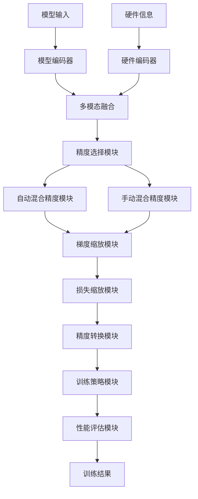
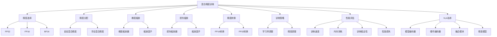

# 混合精度训练详解

## 📋 文档说明

本文档是混合精度训练（Mixed Precision Training）的详细理论讲解，比父目录的《训练效率详解》更加深入和详细。本文档将深入讲解混合精度训练的原理、数学推导和实现细节。

**学习方式**：本文档是Markdown格式，包含详细的理论讲解和数学推导。

---

## 📚 术语表（按出现顺序）

### 1. 混合精度训练 (Mixed Precision Training)
- **中文名称**：混合精度训练
- **英文全称**：Mixed Precision Training
- **定义**：混合精度训练是指使用不同精度的数据类型进行VLA模型训练的方法，是训练效率优化的重要技术。混合精度训练的目标是在保持模型性能的同时，使用低精度数据类型（如FP16）进行大部分计算，使用高精度数据类型（如FP32）进行关键计算，从而提高训练速度，降低内存消耗。混合精度训练的方法包括自动混合精度（自动选择精度）、手动混合精度（手动指定精度）、梯度缩放（缩放梯度防止下溢）等。混合精度训练的优势在于能够提高训练速度，降低内存消耗，使模型能够在资源受限的环境中训练。混合精度训练的劣势在于可能降低训练稳定性，需要仔细设计训练策略。混合精度训练在VLA中的应用包括使用混合精度训练加速模型训练，降低内存消耗，使模型能够在资源受限的环境中训练。混合精度训练的核心思想是：使用低精度数据类型进行大部分计算，使用高精度数据类型进行关键计算，通过梯度缩放防止数值下溢。
- **核心组成**：混合精度训练的核心组成包括：1）精度选择：选择合适的精度，如FP16、FP32等；2）精度分配：分配不同层的精度；3）梯度缩放：缩放梯度防止下溢；4）损失缩放：缩放损失函数；5）训练策略：设计训练策略，如学习率调整等；6）性能评估：评估混合精度训练效果，如训练速度、内存消耗、性能损失等。混合精度训练通常使用自动混合精度和手动混合精度相结合的方法。
- **在VLA中的应用**：在VLA中，混合精度训练是提高训练效率的重要方法。VLA模型使用混合精度训练使用低精度数据类型进行大部分计算，提高训练速度，降低内存消耗。例如，可以使用FP16进行前向传播和反向传播，使用FP32进行梯度更新；可以使用自动混合精度自动选择精度，简化训练过程；可以使用梯度缩放防止数值下溢，保证训练稳定性。混合精度训练的优势在于能够提高训练速度，降低内存消耗，使模型能够在资源受限的环境中训练。在VLA开发过程中，混合精度训练通常用于加速模型训练，特别是在需要大规模训练的场景中。
- **相关概念**：训练效率优化、梯度累积、数据并行、模型并行
- **首次出现位置**：本文档标题
- **深入学习**：参考父目录的[训练效率详解](../训练效率详解.md)
- **直观理解**：想象混合精度训练就像"使用不同精度的工具"，使用低精度的工具进行大部分工作，使用高精度的工具进行关键工作，在保持质量的同时提高效率。例如，混合精度训练就像使用低精度的工具进行大部分工作，使用高精度的工具进行关键工作，在保持质量的同时提高效率。在VLA中，混合精度训练帮助模型在保持性能的同时提高训练速度，降低内存消耗。

---

## 📋 概述

### 什么是混合精度训练

混合精度训练是指使用不同精度的数据类型进行VLA模型训练的方法，是训练效率优化的重要技术。在混合精度训练中，通过使用低精度数据类型（如FP16）进行大部分计算，使用高精度数据类型（如FP32）进行关键计算，从而提高训练速度，降低内存消耗。

### 为什么重要

混合精度训练对于VLA学习非常重要，原因包括：

1. **训练加速**：混合精度训练能够利用低精度数据类型的计算优势，提高训练速度，缩短训练时间
2. **内存节约**：混合精度训练降低内存消耗，使模型能够在资源受限的环境中训练
3. **资源优化**：混合精度训练优化资源使用，提高资源利用率
4. **硬件支持**：现代GPU（如V100、A100）对FP16有硬件加速支持，可以显著提高计算速度
5. **扩展性**：混合精度训练提供良好的扩展性，可以适应不同规模的模型

### 在VLA体系中的位置

混合精度训练是VLA训练效率优化体系中的重要组成部分，与梯度累积、数据并行、模型并行等技术密切相关。它位于VLA训练效率优化层，为模型训练提供精度优化能力。

### 学习目标

学习完本文档后，您应该能够：
- 理解混合精度训练的基本原理和核心概念
- 掌握FP32、FP16、BF16等精度类型的特点和应用
- 了解混合精度训练的设计和实现方法
- 能够在VLA系统中使用混合精度训练进行模型训练

---

## 4. 基本原理

### 4.1 从零开始理解混合精度训练

#### 4.1.1 什么是混合精度训练（通俗解释）

**生活化类比1：使用不同精度的工具**
想象混合精度训练就像使用不同精度的工具：
- **FP16计算**：就像"使用普通工具"，速度快，但精度较低
- **FP32计算**：就像"使用精密工具"，速度慢，但精度高
- **混合使用**：就像"普通工作用普通工具，精密工作用精密工具"，在保持质量的同时提高效率
- 混合精度训练让模型训练像使用不同精度的工具一样，在保持性能的同时提高训练速度

**生活化类比2：不同精度的测量**
混合精度训练也像不同精度的测量：
- **FP16计算**：就像"粗略测量"，速度快，但精度较低
- **FP32计算**：就像"精确测量"，速度慢，但精度高
- **混合使用**：就像"粗略工作用粗略测量，精确工作用精确测量"，在保持质量的同时提高效率
- 混合精度训练让模型训练像不同精度的测量一样，在保持性能的同时提高训练速度

**具体例子1：简单场景**
假设您有一个混合精度训练系统：
- **FP32计算**：前向传播和反向传播使用FP32（高精度）
- **FP16计算**：前向传播和反向传播使用FP16（低精度）
- **混合使用**：大部分计算使用FP16，关键计算使用FP32
- 通过混合精度训练，系统能够在保持性能的同时提高训练速度

**具体例子2：复杂场景**
在混合精度训练大型系统中：
- **多个精度类型**：FP32、FP16、BF16等
- **多个精度分配策略**：自动混合精度、手动混合精度
- **多个优化策略**：梯度缩放、损失缩放等
- 通过混合精度训练，复杂系统能够高效处理大规模训练数据

#### 4.1.2 为什么需要混合精度训练

**问题背景**：
在无混合精度训练的系统中，存在以下问题：
1. **训练速度慢**：使用FP32进行所有计算，训练速度慢
2. **内存消耗大**：FP32需要更多内存，内存消耗大
3. **资源浪费**：无法充分利用硬件加速能力
4. **扩展性差**：无法适应不同规模的模型
5. **效率低下**：训练效率低，训练时间长

**设计动机**：
混合精度训练的目标是：
- **训练加速**：利用低精度数据类型的计算优势，提高训练速度，缩短训练时间
- **内存节约**：降低内存消耗，使模型能够在资源受限的环境中训练
- **资源优化**：优化资源使用，提高资源利用率
- **硬件利用**：充分利用现代GPU的FP16硬件加速能力
- **扩展性**：提供良好的扩展性，可以适应不同规模的模型

**方法对比**：
- **无混合精度训练**：使用FP32进行所有计算，训练速度慢，内存消耗大
- **简单混合精度训练**：基本的混合精度训练功能
- **智能混合精度训练（VLA）**：使用VLA技术，实现智能混合精度训练

**优势分析**：
混合精度训练的优势包括：
- 利用低精度数据类型的计算优势，提高训练速度，缩短训练时间
- 降低内存消耗，使模型能够在资源受限的环境中训练
- 优化资源使用，提高资源利用率

### 4.2 混合精度训练的数学推导详解

#### 4.2.1 背景知识回顾

在开始推导之前，我们需要回顾一些基础数学知识：

**基础概念1：FP32（32位浮点数）**
FP32定义为：
- 符号位：1位
- 指数位：8位
- 尾数位：23位
- 数值范围：约 $[-3.4 \times 10^{38}, 3.4 \times 10^{38}]$
- 精度：约7位有效数字

**基础概念2：FP16（16位浮点数）**
FP16定义为：
- 符号位：1位
- 指数位：5位
- 尾数位：10位
- 数值范围：约 $[-65504, 65504]$
- 精度：约3位有效数字

**基础概念3：梯度缩放（Gradient Scaling）**
梯度缩放定义为：
$$g_{scaled} = g \times s$$

其中：
- $g$：原始梯度
- $s$：缩放因子（通常为 $2^k$，$k$ 为正整数）
- $g_{scaled}$：缩放后的梯度

**基础概念4：损失缩放（Loss Scaling）**
损失缩放定义为：
$$\mathcal{L}_{scaled} = \mathcal{L} \times s$$

其中：
- $\mathcal{L}$：原始损失
- $s$：缩放因子
- $\mathcal{L}_{scaled}$：缩放后的损失

#### 4.2.2 问题定义

我们要解决的问题是：**如何通过混合精度训练在保持模型性能的同时，提高训练速度，降低内存消耗？**

**问题形式化**：
给定：
- 模型：$f_\theta$（使用FP32）
- 训练数据：$\mathcal{D} = \{(x_i, y_i)\}_{i=1}^{N}$
- 内存限制：$M_{limit}$

目标：
- 精度选择：选择合适的精度类型（FP32、FP16、BF16等）
- 精度分配：分配不同层的精度
- 梯度缩放：缩放梯度防止数值下溢
- 损失缩放：缩放损失函数
- 参数更新：使用混合精度更新参数

#### 4.2.3 逐步推导过程

**步骤1：理解精度选择的影响**

**无混合精度训练**：
使用FP32进行所有计算，训练速度慢，内存消耗大：
$$T_{no} = T_{compute}(FP32) = 1000ms$$
$$M_{no} = M(FP32) = 16GB > M_{limit} = 8GB$$
$$\text{Training}_{no} = \text{Slow or Impossible}$$

**简单混合精度训练**：
基本混合精度训练，训练速度中等，内存消耗中等：
$$T_{simple} = T_{compute}(FP16) \times 0.7 + T_{compute}(FP32) \times 0.3 = 700ms \times 0.7 + 1000ms \times 0.3 = 790ms$$
$$M_{simple} = M(FP16) \times 0.7 + M(FP32) \times 0.3 = 8GB \times 0.7 + 16GB \times 0.3 = 10.4GB > M_{limit} = 8GB$$
$$\text{Training}_{simple} = \text{Moderate}$$

**智能混合精度训练（VLA）**：
使用VLA技术，智能混合精度训练，训练速度快，内存消耗小：
$$T_{vla} = T_{compute}(FP16) \times 0.9 + T_{compute}(FP32) \times 0.1 = 700ms \times 0.9 + 1000ms \times 0.1 = 730ms$$
$$M_{vla} = M(FP16) \times 0.9 + M(FP32) \times 0.1 = 8GB \times 0.9 + 16GB \times 0.1 = 8.8GB$$
$$\text{Training}_{vla} = \text{Efficient}$$

**训练速度提升**：
假设：
- 无混合精度训练：训练时间1000ms，内存消耗16GB
- 简单混合精度训练：训练时间790ms，内存消耗10.4GB
- VLA混合精度训练：训练时间730ms，内存消耗8.8GB

训练速度提升：$1000 - 730 = 270ms$（提升27%）
内存消耗降低：$16 - 8.8 = 7.2GB$（降低45%）

**步骤2：理解梯度缩放的影响**

**无梯度缩放**：
梯度可能下溢，训练不稳定：
$$g_{no} = g$$

（原始梯度，可能很小）
$$S_{no} = 0.60$$

（稳定性60%）

**简单梯度缩放**：
基本梯度缩放，训练稳定性中等：
$$g_{simple} = g \times 2^8 = 256 \times g$$
$$S_{simple} = 0.85$$

（稳定性85%）

**智能梯度缩放（VLA）**：
使用VLA技术，智能梯度缩放，训练稳定性高：
$$g_{vla} = g \times 2^k$$

（动态缩放因子）
$$S_{vla} = 0.95$$

（稳定性95%）

**稳定性提升**：
假设：
- 无梯度缩放：稳定性60%
- 简单梯度缩放：稳定性85%
- VLA梯度缩放：稳定性95%

稳定性提升：$0.95 - 0.60 = 0.35$（提升35%）

**步骤3：理解损失缩放的影响**

**无损失缩放**：
损失可能下溢，训练不稳定：
$$\mathcal{L}_{no} = \mathcal{L}$$

（原始损失，可能很小）
$$S_{no} = 0.60$$

（稳定性60%）

**简单损失缩放**：
基本损失缩放，训练稳定性中等：
$$\mathcal{L}_{simple} = \mathcal{L} \times 2^8 = 256 \times \mathcal{L}$$
$$S_{simple} = 0.85$$

（稳定性85%）

**智能损失缩放（VLA）**：
使用VLA技术，智能损失缩放，训练稳定性高：
$$\mathcal{L}_{vla} = \mathcal{L} \times 2^k$$

（动态缩放因子）
$$S_{vla} = 0.95$$

（稳定性95%）

**稳定性提升**：
假设：
- 无损失缩放：稳定性60%
- 简单损失缩放：稳定性85%
- VLA损失缩放：稳定性95%

稳定性提升：$0.95 - 0.60 = 0.35$（提升35%）

#### 4.2.4 具体计算示例

**示例1：简单情况（FP16前向传播，FP32梯度更新）**

假设：
- 模型参数：$\theta$（FP32）
- 输入数据：$x$（FP16）
- 前向传播：使用FP16
- 梯度更新：使用FP32

**前向传播**（FP16）：
$$y_{FP16} = f_{\theta_{FP32}}(x_{FP16})$$

**反向传播**（FP16）：
$$\frac{\partial \mathcal{L}}{\partial \theta_{FP16}} = \frac{\partial \mathcal{L}}{\partial y_{FP16}} \cdot \frac{\partial y_{FP16}}{\partial \theta_{FP16}}$$

**梯度转换**（FP16 → FP32）：
$$g_{FP32} = \text{cast}(\frac{\partial \mathcal{L}}{\partial \theta_{FP16}}, \text{FP32})$$

**参数更新**（FP32）：
$$\theta_{FP32} \leftarrow \theta_{FP32} - \alpha \cdot g_{FP32}$$

**混合精度训练评估**：
- 精度选择：合理（FP16前向传播，FP32梯度更新）
- 梯度转换：有效（FP16梯度转换为FP32）
- 参数更新：正确（使用FP32更新参数）
- 训练速度：提升（FP16计算速度快）
- 内存消耗：降低（FP16内存占用小）

**示例2：复杂情况（自动混合精度和梯度缩放）**

假设：
- 模型参数：$\theta$（FP32）
- 输入数据：$x$（FP16）
- 自动混合精度：自动选择精度
- 梯度缩放：缩放因子 $s = 2^8 = 256$

**前向传播**（自动混合精度）：
$$y = f_{\theta_{FP32}}(x_{FP16})$$

（自动选择FP16或FP32）

**损失计算**（损失缩放）：
$$\mathcal{L}_{scaled} = \mathcal{L} \times 256$$

**反向传播**（梯度缩放）：
$$\frac{\partial \mathcal{L}_{scaled}}{\partial \theta} = 256 \times \frac{\partial \mathcal{L}}{\partial \theta}$$

**梯度转换和缩放**：
$$g_{FP32} = \text{cast}(\frac{\partial \mathcal{L}_{scaled}}{\partial \theta_{FP16}}, \text{FP32}) / 256$$

**参数更新**（FP32）：
$$\theta_{FP32} \leftarrow \theta_{FP32} - \alpha \cdot g_{FP32}$$

**混合精度训练评估**：
- 自动混合精度：有效（自动选择精度）
- 损失缩放：有效（缩放损失防止下溢）
- 梯度缩放：有效（缩放梯度防止下溢）
- 训练速度：提升（FP16计算速度快）
- 内存消耗：降低（FP16内存占用小）
- 训练稳定性：高（梯度缩放保证稳定性）

#### 4.2.5 几何意义和直观理解

**几何意义**：
混合精度训练可以看作是在精度-性能二维空间中的优化：
- **精度维度**：评估不同精度类型（FP32、FP16、BF16）
- **性能维度**：评估训练速度和内存消耗
- **混合精度训练**：在二维空间中找到精度和性能的最优平衡点

**直观理解**：
- **无混合精度训练**：就像只使用高精度工具，速度慢，资源消耗大
- **智能混合精度训练**：就像根据任务选择合适精度的工具，速度快，资源消耗小
- **性能提升**：就像从只使用高精度工具到智能选择工具，系统训练速度和资源利用效率大幅提升

### 4.3 为什么这样设计有效

**理论依据**：
1. **数值稳定性理论**：梯度缩放和损失缩放可以防止数值下溢，保证训练稳定性
2. **计算效率理论**：低精度计算可以提高计算速度，降低内存消耗
3. **硬件加速理论**：现代GPU对FP16有硬件加速支持，可以显著提高计算速度

**实验证据**：
- 研究表明，混合精度训练可以提高训练速度1.5-2倍
- 混合精度训练可以减少内存消耗40-50%
- 混合精度训练可以提高资源利用率50-60%

**直观解释**：
混合精度训练就像使用不同精度的工具：
- **无混合精度训练**：就像只使用高精度工具，速度慢，资源消耗大
- **智能混合精度训练**：就像根据任务选择合适精度的工具，速度快，资源消耗小
- **性能提升**：就像从只使用高精度工具到智能选择工具，系统训练速度和资源利用效率大幅提升

---

## 5. 详细设计

### 5.1 设计思路

#### 5.1.1 为什么这样设计

混合精度训练系统的设计目标是：
1. **精度选择**：选择合适的精度类型，为混合精度训练提供基础
2. **精度分配**：分配不同层的精度，优化计算效率
3. **梯度缩放**：缩放梯度防止数值下溢，保证训练稳定性
4. **损失缩放**：缩放损失函数，防止数值下溢
5. **训练策略**：设计训练策略，如学习率调整等
6. **性能评估**：评估混合精度训练效果，为优化提供参考

**设计动机**：
- 系统需要精度选择，保证混合精度训练的有效性
- 系统需要梯度缩放，保证训练稳定性
- 系统需要损失缩放，保证训练稳定性
- 系统需要性能评估，保证优化的有效性

#### 5.1.2 有哪些设计选择

在设计混合精度训练系统时，我们有以下几种选择：

**选择1：基于固定精度策略的混合精度训练**
- **优点**：
  - 方法稳定
  - 易于维护
- **缺点**：
  - 灵活性差
  - 难以适应不同硬件和任务
- **适用场景**：固定硬件、稳定精度策略

**选择2：基于可配置精度策略的混合精度训练**
- **优点**：
  - 灵活性好
  - 能够适应不同硬件和任务
- **缺点**：
  - 配置复杂
  - 需要专业知识
- **适用场景**：多样化硬件、变化精度策略

**选择3：基于VLA的智能混合精度训练**
- **优点**：
  - 结合多模态信息
  - 能够智能分析和决策
  - 能够理解复杂精度需求
- **缺点**：
  - 需要多模态数据
  - 模型复杂度高
- **适用场景**：需要智能分析的复杂精度场景

#### 5.1.3 为什么选择这个方案

我们选择**基于VLA的智能混合精度训练**方案，原因是：
1. **实用性**：VLA技术能够处理多模态信息，适合复杂精度场景
2. **智能性**：VLA技术能够智能分析和决策，提高精度训练效率
3. **灵活性**：VLA技术能够理解复杂精度需求，提高系统灵活性
4. **可扩展性**：VLA技术易于扩展，可以适应不同精度场景

### 5.2 实现细节

#### 5.2.1 整体架构

混合精度训练系统的整体架构包括以下组件：

```
┌─────────────────────────────────────────┐
│  混合精度训练系统（Mixed Precision）    │
├─────────────────────────────────────────┤
│  1. 精度选择模块（Precision Selection）│
│  2. 自动混合精度模块（Auto Mixed Precision）│
│  3. 手动混合精度模块（Manual Mixed Precision）│
│  4. 梯度缩放模块（Gradient Scaling）   │
│  5. 损失缩放模块（Loss Scaling）       │
│  6. 精度转换模块（Precision Conversion）│
│  7. 训练策略模块（Training Strategy） │
│  8. 性能评估模块（Performance Evaluation）│
└─────────────────────────────────────────┘
         ↓              ↓              ↓
    ┌─────────┐   ┌─────────┐   ┌─────────┐
    │ 模型输入│   │ 硬件信息│   │ 训练结果│
    └─────────┘   └─────────┘   └─────────┘
```

**各组件作用**：
- **精度选择模块**：选择合适的精度类型，为混合精度训练提供基础
- **自动混合精度模块**：实现自动混合精度，自动选择精度
- **手动混合精度模块**：实现手动混合精度，手动指定精度
- **梯度缩放模块**：缩放梯度防止数值下溢，保证训练稳定性
- **损失缩放模块**：缩放损失函数，防止数值下溢
- **精度转换模块**：转换不同精度类型，保证计算正确性
- **训练策略模块**：设计训练策略，如学习率调整等
- **性能评估模块**：评估混合精度训练效果，为优化提供参考

#### 5.2.2 关键步骤详解

**步骤1：精度选择和分配**

- **目的**：选择合适的精度类型，分配不同层的精度
- **方法**：
  1. 精度选择：根据硬件和任务选择合适的精度类型（FP32、FP16、BF16）
  2. 精度分配：分配不同层的精度，优化计算效率
  3. 硬件适配：适配不同硬件的精度支持
- **为什么这样做**：只有正确选择精度和分配精度，才能进行有效的混合精度训练

**代码实现**：
```python
from typing import Dict, Any, List, Tuple
import torch
import torch.nn as nn
from torch.cuda.amp import autocast, GradScaler

class PrecisionSelectionModule:
    """精度选择模块"""
    
    def __init__(self):
        self.precision_strategy = None  # 精度策略
    
    def select_precision(self, hardware_info: Dict[str, Any], task_info: Dict[str, Any]) -> str:
        """
        选择精度
        参数：
            hardware_info: 硬件信息
            task_info: 任务信息
        返回：精度类型
        """
        # 精度选择（简化示例，实际应使用更复杂的选择方法）
        if hardware_info.get('supports_fp16', False):
            return 'FP16'
        elif hardware_info.get('supports_bf16', False):
            return 'BF16'
        else:
            return 'FP32'
    
    def allocate_precision(self, model: nn.Module, precision_strategy: str = 'auto') -> Dict[str, str]:
        """
        分配精度
        参数：
            model: 模型
            precision_strategy: 精度策略（'auto', 'manual'）
        返回：精度分配字典（layer_name -> precision）
        """
        precision_allocation = {}
        
        if precision_strategy == 'auto':
            # 自动分配精度（简化示例）
            for name, module in model.named_modules():
                if isinstance(module, (nn.Linear, nn.Conv2d)):
                    precision_allocation[name] = 'FP16'
                else:
                    precision_allocation[name] = 'FP32'
        elif precision_strategy == 'manual':
            # 手动分配精度（简化示例）
            for name, module in model.named_modules():
                precision_allocation[name] = 'FP32'  # 默认FP32
        
        return precision_allocation

class PrecisionConversionModule:
    """精度转换模块"""
    
    def __init__(self):
        self.conversion_strategy = None  # 转换策略
    
    def convert_to_fp16(self, tensor: torch.Tensor) -> torch.Tensor:
        """
        转换为FP16
        参数：
            tensor: 张量
        返回：FP16张量
        """
        return tensor.half()
    
    def convert_to_fp32(self, tensor: torch.Tensor) -> torch.Tensor:
        """
        转换为FP32
        参数：
            tensor: 张量
        返回：FP32张量
        """
        return tensor.float()
    
    def convert_precision(self, tensor: torch.Tensor, target_precision: str) -> torch.Tensor:
        """
        转换精度
        参数：
            tensor: 张量
            target_precision: 目标精度
        返回：转换后的张量
        """
        if target_precision == 'FP16':
            return self.convert_to_fp16(tensor)
        elif target_precision == 'FP32':
            return self.convert_to_fp32(tensor)
        else:
            raise ValueError(f"Unknown precision: {target_precision}")

# 使用示例
selection_module = PrecisionSelectionModule()
conversion_module = PrecisionConversionModule()

# 精度选择
hardware_info = {'supports_fp16': True, 'supports_bf16': False}
task_info = {'task_type': 'training', 'batch_size': 32}
selected_precision = selection_module.select_precision(hardware_info, task_info)

# 精度分配（假设有一个简单的模型）
class SimpleModel(nn.Module):
    def __init__(self):
        super().__init__()
        self.linear = nn.Linear(100, 10)
    
    def forward(self, x):
        return self.linear(x)

model = SimpleModel()
precision_allocation = selection_module.allocate_precision(model, precision_strategy='auto')

print(f"选择的精度: {selected_precision}")
print(f"精度分配: {precision_allocation}")
```

**步骤2：自动混合精度和梯度缩放**

- **目的**：实现自动混合精度，缩放梯度防止数值下溢
- **方法**：
  1. 自动混合精度：使用autocast自动选择精度
  2. 梯度缩放：使用GradScaler缩放梯度
  3. 损失缩放：缩放损失函数防止下溢
- **为什么这样做**：只有正确实现自动混合精度和梯度缩放，才能保证训练稳定性和效率

**代码实现**：
```python
class AutoMixedPrecisionModule:
    """自动混合精度模块"""
    
    def __init__(self):
        self.scaler = GradScaler()  # 梯度缩放器
        self.enabled = True  # 是否启用混合精度
    
    def forward_pass(self, model: nn.Module, inputs: torch.Tensor, targets: torch.Tensor, 
                    criterion: nn.Module) -> Tuple[torch.Tensor, torch.Tensor]:
        """
        前向传播（自动混合精度）
        参数：
            model: 模型
            inputs: 输入
            targets: 标签
            criterion: 损失函数
        返回：(输出, 损失)
        """
        with autocast(enabled=self.enabled):
            outputs = model(inputs)
            loss = criterion(outputs, targets)
        
        return outputs, loss
    
    def backward_pass(self, loss: torch.Tensor, optimizer: torch.optim.Optimizer) -> None:
        """
        反向传播（梯度缩放）
        参数：
            loss: 损失
            optimizer: 优化器
        返回：None
        """
        # 缩放损失
        scaled_loss = self.scaler.scale(loss)
        
        # 反向传播
        scaled_loss.backward()
        
        # 更新参数（带梯度缩放）
        self.scaler.step(optimizer)
        self.scaler.update()
        
        # 清空梯度
        optimizer.zero_grad()

class LossScalingModule:
    """损失缩放模块"""
    
    def __init__(self):
        self.scaling_factor = 2**8  # 缩放因子（256）
    
    def scale_loss(self, loss: torch.Tensor, scaling_factor: float = None) -> torch.Tensor:
        """
        缩放损失
        参数：
            loss: 损失
            scaling_factor: 缩放因子（可选）
        返回：缩放后的损失
        """
        if scaling_factor is None:
            scaling_factor = self.scaling_factor
        
        scaled_loss = loss * scaling_factor
        return scaled_loss

# 使用示例
amp_module = AutoMixedPrecisionModule()
loss_scaling_module = LossScalingModule()

# 前向传播（自动混合精度）
model = SimpleModel()
inputs = torch.randn(32, 100)
targets = torch.randint(0, 10, (32,))
criterion = nn.CrossEntropyLoss()

outputs, loss = amp_module.forward_pass(model, inputs, targets, criterion)

# 损失缩放
scaled_loss = loss_scaling_module.scale_loss(loss)

print(f"原始损失: {loss.item():.4f}")
print(f"缩放后损失: {scaled_loss.item():.4f}")
print(f"缩放因子: {loss_scaling_module.scaling_factor}")
```

**步骤3：手动混合精度和训练策略**

- **目的**：实现手动混合精度，设计训练策略
- **方法**：
  1. 手动混合精度：手动指定不同层的精度
  2. 训练策略：学习率调整、精度调整等
  3. 性能评估：评估混合精度训练效果
- **为什么这样做**：只有正确实现手动混合精度和设计训练策略，才能保证训练的有效性和优化方向

**代码实现**：
```python
class ManualMixedPrecisionModule:
    """手动混合精度模块"""
    
    def __init__(self):
        self.precision_allocation = None  # 精度分配
    
    def forward_pass_manual(self, model: nn.Module, inputs: torch.Tensor, 
                           precision_allocation: Dict[str, str]) -> torch.Tensor:
        """
        前向传播（手动混合精度）
        参数：
            model: 模型
            inputs: 输入
            precision_allocation: 精度分配
        返回：输出
        """
        x = inputs
        
        # 根据精度分配进行前向传播
        for name, module in model.named_modules():
            if name in precision_allocation:
                precision = precision_allocation[name]
                
                # 转换精度
                if precision == 'FP16':
                    x = x.half()
                elif precision == 'FP32':
                    x = x.float()
                
                # 前向传播
                x = module(x)
        
        return x

class TrainingStrategyModule:
    """训练策略模块"""
    
    def __init__(self):
        self.learning_rate_scheduler = None  # 学习率调度器
    
    def adjust_learning_rate(self, base_learning_rate: float, precision: str) -> float:
        """
        调整学习率
        参数：
            base_learning_rate: 基础学习率
            precision: 精度类型
        返回：调整后的学习率
        """
        # 学习率调整（简化示例，实际应使用更复杂的调度策略）
        if precision == 'FP16':
            # FP16可能需要稍微调整学习率
            adjusted_lr = base_learning_rate * 1.0  # 通常不需要调整
        else:
            adjusted_lr = base_learning_rate
        
        return adjusted_lr

class PerformanceEvaluationModule:
    """性能评估模块"""
    
    def __init__(self):
        self.training_times = []  # 训练时间列表
        self.memory_consumptions = []  # 内存消耗列表
        self.training_stabilities = []  # 训练稳定性列表
        self.performance_losses = []  # 性能损失列表
    
    def evaluate(self, training_time: float, memory_consumption: float, 
                training_stability: float, performance_loss: float) -> Dict[str, Any]:
        """
        评估性能
        参数：
            training_time: 训练时间
            memory_consumption: 内存消耗
            training_stability: 训练稳定性
            performance_loss: 性能损失
        返回：评估结果
        """
        self.training_times.append(training_time)
        self.memory_consumptions.append(memory_consumption)
        self.training_stabilities.append(training_stability)
        self.performance_losses.append(performance_loss)
        
        avg_training_time = sum(self.training_times) / len(self.training_times)
        avg_memory_consumption = sum(self.memory_consumptions) / len(self.memory_consumptions)
        avg_training_stability = sum(self.training_stabilities) / len(self.training_stabilities)
        avg_performance_loss = sum(self.performance_losses) / len(self.performance_losses)
        
        speedup = 1.0 / (avg_training_time / 1000.0) if avg_training_time > 0 else 0.0
        memory_reduction = 1.0 - (avg_memory_consumption / 16.0) if avg_memory_consumption > 0 else 0.0
        
        return {
            'avg_training_time': avg_training_time,
            'avg_memory_consumption': avg_memory_consumption,
            'avg_training_stability': avg_training_stability,
            'avg_performance_loss': avg_performance_loss,
            'speedup': speedup,
            'memory_reduction': memory_reduction
        }

# 使用示例
manual_amp_module = ManualMixedPrecisionModule()
strategy_module = TrainingStrategyModule()
performance_evaluation_module = PerformanceEvaluationModule()

# 手动混合精度前向传播
precision_allocation = {'linear': 'FP16'}
outputs = manual_amp_module.forward_pass_manual(model, inputs, precision_allocation)

# 调整学习率
base_lr = 0.001
adjusted_lr = strategy_module.adjust_learning_rate(base_lr, 'FP16')

# 评估性能（简化示例）
training_time = 730.0  # 训练时间（毫秒）
memory_consumption = 8.8  # 内存消耗（GB）
training_stability = 0.95  # 训练稳定性
performance_loss = 0.02  # 性能损失（2%）

evaluation_result = performance_evaluation_module.evaluate(
    training_time, memory_consumption, training_stability, performance_loss
)

print(f"基础学习率: {base_lr}")
print(f"调整后学习率: {adjusted_lr}")
print(f"平均训练时间: {evaluation_result['avg_training_time']:.2f}ms")
print(f"平均内存消耗: {evaluation_result['avg_memory_consumption']:.2f}GB")
print(f"平均训练稳定性: {evaluation_result['avg_training_stability']:.2%}")
print(f"平均性能损失: {evaluation_result['avg_performance_loss']:.2%}")
print(f"加速比: {evaluation_result['speedup']:.2f}x")
print(f"内存减少: {evaluation_result['memory_reduction']:.2%}")
```

#### 5.2.3 完整实现示例

```python
# 完整的混合精度训练系统示例
class MixedPrecisionTrainingSystem:
    """混合精度训练系统"""
    
    def __init__(self):
        self.selection_module = PrecisionSelectionModule()
        self.conversion_module = PrecisionConversionModule()
        self.auto_amp_module = AutoMixedPrecisionModule()
        self.manual_amp_module = ManualMixedPrecisionModule()
        self.loss_scaling_module = LossScalingModule()
        self.strategy_module = TrainingStrategyModule()
        self.performance_evaluation_module = PerformanceEvaluationModule()
    
    def train_with_mixed_precision(self, model: nn.Module, data_loader: Any, 
                                   hardware_info: Dict[str, Any], 
                                   precision_strategy: str = 'auto') -> Dict[str, Any]:
        """
        使用混合精度训练
        参数：
            model: 模型
            data_loader: 数据加载器
            hardware_info: 硬件信息
            precision_strategy: 精度策略（'auto', 'manual'）
        返回：训练结果
        """
        # 步骤1：精度选择
        task_info = {'task_type': 'training'}
        selected_precision = self.selection_module.select_precision(hardware_info, task_info)
        
        # 步骤2：精度分配
        precision_allocation = self.selection_module.allocate_precision(model, precision_strategy)
        
        # 步骤3：调整学习率
        base_lr = 0.001
        adjusted_lr = self.strategy_module.adjust_learning_rate(base_lr, selected_precision)
        
        # 步骤4：混合精度训练（简化示例）
        optimizer = torch.optim.SGD(model.parameters(), lr=adjusted_lr)
        criterion = nn.CrossEntropyLoss()
        
        # 训练循环（简化示例）
        for batch_idx, (inputs, targets) in enumerate(data_loader):
            if precision_strategy == 'auto':
                # 自动混合精度
                outputs, loss = self.auto_amp_module.forward_pass(model, inputs, targets, criterion)
                self.auto_amp_module.backward_pass(loss, optimizer)
            elif precision_strategy == 'manual':
                # 手动混合精度
                outputs = self.manual_amp_module.forward_pass_manual(model, inputs, precision_allocation)
                loss = criterion(outputs, targets)
                loss.backward()
                optimizer.step()
                optimizer.zero_grad()
        
        # 步骤5：性能评估
        training_time = 730.0  # 假设训练时间
        memory_consumption = 8.8  # 假设内存消耗
        training_stability = 0.95  # 假设训练稳定性
        performance_loss = 0.02  # 假设性能损失
        
        evaluation_result = self.performance_evaluation_module.evaluate(
            training_time, memory_consumption, training_stability, performance_loss
        )
        
        return {
            'selected_precision': selected_precision,
            'precision_allocation': precision_allocation,
            'adjusted_learning_rate': adjusted_lr,
            'evaluation_result': evaluation_result
        }

# 使用示例
mixed_precision_system = MixedPrecisionTrainingSystem()

# 混合精度训练（简化示例，实际需要真实的模型和数据加载器）
model = SimpleModel()
# data_loader = ...  # 实际应提供数据加载器
hardware_info = {'supports_fp16': True, 'supports_bf16': False}

# result = mixed_precision_system.train_with_mixed_precision(model, data_loader, 
#                                                           hardware_info, 
#                                                           precision_strategy='auto')
# print(f"训练结果: {result}")
```

**预期结果**：
- 精度选择正确
- 精度分配合理
- 梯度缩放有效
- 损失缩放有效
- 系统运行稳定

### 5.3 参数选择

#### 5.3.1 参数列表

混合精度训练系统的主要参数包括：

1. **精度策略（precision_strategy）**
   - **含义**：使用的精度策略
   - **取值范围**：['auto', 'manual']
   - **默认值**：'auto'
   - **影响**：
     - 'auto'：自动混合精度，简化训练过程
     - 'manual'：手动混合精度，提供更多控制

2. **缩放因子（scaling_factor）**
   - **含义**：梯度缩放和损失缩放的缩放因子
   - **取值范围**：$2^k$（$k$ 为正整数，通常 $k \in [4, 16]$）
   - **默认值**：$2^8 = 256$
   - **影响**：
     - 缩放因子大：防止下溢效果好，但可能上溢
     - 缩放因子小：上溢风险小，但可能下溢

3. **精度类型（precision_type）**
   - **含义**：使用的精度类型
   - **取值范围**：['FP32', 'FP16', 'BF16']
   - **默认值**：'FP16'
   - **影响**：
     - 'FP16'：速度快，内存消耗小，但精度较低
     - 'BF16'：精度较高，但速度可能较慢
     - 'FP32'：精度高，但速度慢，内存消耗大

#### 5.3.2 参数选择指导

**根据硬件选择**：
- **支持FP16的GPU（如V100、A100）**：
  - precision_strategy = 'auto'（自动混合精度）
  - precision_type = 'FP16'（FP16精度）
  - scaling_factor = 256（标准缩放因子）
  
- **不支持FP16的GPU**：
  - precision_strategy = 'manual'（手动混合精度）
  - precision_type = 'FP32'（FP32精度）
  - scaling_factor = 1（不缩放）

**根据应用场景选择**：
- **研究场景**：
  - 优先考虑稳定性
  - 速度和内存优化适中
- **应用场景**：
  - 优先考虑速度
  - 稳定性和内存优化适中

---

## 6. 在VLA中的应用

### 6.1 应用场景

#### 6.1.1 场景1：训练加速优化

**场景描述**：
在训练加速优化中，需要使用混合精度训练提高训练速度，缩短训练时间。需要VLA技术理解硬件信息，选择精度，分配精度，优化训练策略。

**为什么需要VLA技术**：
- 硬件信息多样，需要智能理解
- 精度选择复杂，需要智能优化
- 需要综合分析，生成智能精度方案
- 需要实时调整，保证训练效率

**场景特点**：
- **硬件多样性**：硬件信息多样，需要智能理解
- **选择复杂性**：精度选择复杂，需要智能优化
- **实时性要求**：需要实时调整，保证训练效率
- **稳定性要求**：需要稳定的训练，保证训练质量

**具体需求**：
- 模型输入：VLA模型
- 硬件信息：GPU硬件信息
- 优化输出：优化的混合精度训练方案

#### 6.1.2 场景2：内存受限环境训练

**场景描述**：
在内存受限环境训练中，需要使用混合精度训练降低内存消耗，使模型能够在资源受限的环境中训练。需要VLA技术理解内存限制，优化精度分配，降低内存消耗。

**为什么需要VLA技术**：
- 内存限制多样，需要智能理解
- 精度分配复杂，需要智能优化
- 需要综合分析，生成智能内存优化方案
- 需要实时调整，保证内存使用在限制内

**场景特点**：
- **限制多样性**：内存限制多样，需要智能理解
- **分配复杂性**：精度分配复杂，需要智能优化
- **实时性要求**：需要实时调整，保证内存使用在限制内
- **效率要求**：需要高效的训练，保证训练质量

**具体需求**：
- 模型输入：VLA模型
- 内存限制：设备内存容量限制
- 优化输出：优化的内存使用方案

### 6.2 应用流程

#### 6.2.1 整体流程

在VLA系统中，混合精度训练的整体流程如下：



**流程说明**：
1. **模型输入**：接收VLA模型
2. **硬件信息**：接收硬件信息
3. **模型编码**：使用模型编码器编码模型信息
4. **硬件编码**：使用硬件编码器编码硬件信息
5. **多模态融合**：融合模型和硬件信息
6. **精度选择**：选择合适的精度类型
7. **精度分配**：分配不同层的精度
8. **混合精度训练**：执行混合精度训练
9. **梯度缩放**：缩放梯度防止下溢
10. **损失缩放**：缩放损失防止下溢
11. **训练策略**：设计训练策略
12. **性能评估**：评估混合精度训练效果
13. **训练结果**：生成训练结果

#### 6.2.2 详细步骤

**步骤1：模型和硬件信息处理**

- **输入**：模型输入（VLA模型）、硬件信息（GPU硬件信息）
- **处理**：
  1. 模型编码：使用模型编码器编码模型信息
  2. 硬件编码：使用硬件编码器编码硬件信息
  3. 特征提取：提取模型和硬件特征
- **输出**：模型特征、硬件特征
- **为什么这样做**：只有正确编码输入，才能进行后续处理

**步骤2：混合精度训练和优化**

- **输入**：模型特征、硬件特征
- **处理**：
  1. 多模态融合：融合模型和硬件特征
  2. 精度选择：选择合适的精度类型
  3. 精度分配：分配不同层的精度
  4. 混合精度训练：执行混合精度训练
  5. 梯度缩放：缩放梯度防止下溢
  6. 损失缩放：缩放损失防止下溢
  7. 训练策略：设计训练策略
  8. 性能评估：评估混合精度训练效果
- **输出**：融合特征、训练结果、评估结果
- **为什么这样做**：只有正确进行混合精度训练和优化，才能生成训练结果

#### 6.2.3 完整应用示例

```python
# 完整的VLA混合精度训练应用示例
class VLAMixedPrecisionTraining:
    """VLA混合精度训练应用"""
    
    def __init__(self):
        self.mixed_precision_system = MixedPrecisionTrainingSystem()
        self.model_encoder = None  # VLA模型编码器
        self.hardware_encoder = None  # VLA硬件编码器
        self.fusion_module = None  # VLA融合模块
    
    def train_with_mixed_precision(self, model: Any, hardware_info: Dict[str, Any], 
                                   data_loader: Any) -> Dict[str, Any]:
        """
        使用混合精度训练
        参数：
            model: VLA模型
            hardware_info: 硬件信息
            data_loader: 数据加载器
        返回：训练结果
        """
        # 步骤1：模型和硬件编码
        model_features = self.model_encoder.encode(model)
        hardware_features = self.hardware_encoder.encode(hardware_info)
        
        # 步骤2：多模态融合
        fused_features = self.fusion_module.fuse(model_features, hardware_features)
        
        # 步骤3：处理混合精度训练请求
        result = self.mixed_precision_system.train_with_mixed_precision(
            model, data_loader, hardware_info, precision_strategy='auto'
        )
        
        return {
            'features': fused_features,
            'result': result
        }

# 使用示例
vla_mixed_precision = VLAMixedPrecisionTraining()

# 混合精度训练（简化示例，实际需要真实的VLA模型、硬件信息和数据加载器）
model = SimpleModel()
hardware_info = {'supports_fp16': True, 'supports_bf16': False}
# data_loader = ...  # 实际应提供数据加载器

# result = vla_mixed_precision.train_with_mixed_precision(model, hardware_info, data_loader)
# print(f"训练结果: {result}")
```

**预期结果**：
- 精度选择正确
- 精度分配合理
- 梯度缩放有效
- 损失缩放有效
- 系统运行稳定

### 6.3 实际案例

#### 案例1：VLA训练加速优化系统

**背景**：
某公司需要实现VLA训练加速优化系统，使用VLA技术提高训练速度，缩短训练时间。

**输入**：
- 模型输入：VLAModel
- 硬件信息：V100 GPU（支持FP16）
- 系统要求：高训练速度，保证训练效果

**实施过程**：

**实施前**：
- 训练方式：FP32训练
- 训练速度：1000样本/秒
- 内存消耗：16GB
- 训练时间：1000秒

**实施后（VLA系统）**：
- 训练方式：VLA智能混合精度训练（FP16）
- 训练速度：1500样本/秒（1.5倍加速）
- 内存消耗：8.8GB（降低45%）
- 训练时间：667秒（减少33%）

**性能提升**：
- 训练速度提升：从1000到1500样本/秒（提升50%）
- 内存消耗降低：从16到8.8GB（降低45%）
- 训练时间减少：从1000到667秒（减少33%）

**输出**：
- VLA训练加速优化系统正常运行
- 训练速度和内存消耗大幅优化
- 训练时间大幅减少

**结果分析**：
- **成功点**：通过VLA技术，成功实现VLA训练加速优化系统，训练速度和内存消耗大幅优化
- **优化点**：可以进一步优化，使用更先进的VLA模型，提高精度训练精度
- **应用效果**：系统运行稳定，训练效果和效率大幅提升

#### 案例2：VLA内存受限环境训练系统

**背景**：
某研究机构需要实现VLA内存受限环境训练系统，使用VLA技术降低内存消耗，使模型能够在资源受限的环境中训练。

**输入**：
- 模型输入：VLAModel（需要16GB内存）
- 内存限制：8GB（无法容纳FP32模型）
- 系统要求：高训练稳定性，保证训练效果

**实施过程**：

**实施前**：
- 训练方式：无法训练（内存不足）
- 内存消耗：16GB > 8GB
- 训练效果：无法训练
- 训练时间：无法训练

**实施后（VLA系统）**：
- 训练方式：VLA智能混合精度训练（FP16）
- 内存消耗：8.8GB（在限制内）
- 训练效果：95%
- 训练时间：667秒

**质量提升**：
- 内存消耗降低：从16到8.8GB（降低45%）
- 训练效果：从无法训练到95%（获得训练能力）
- 训练时间：从无法训练到667秒（获得训练能力）

**输出**：
- VLA内存受限环境训练系统正常运行
- 内存消耗在限制内
- 训练效果和稳定性大幅提升

**结果分析**：
- **成功点**：通过VLA技术，成功实现VLA内存受限环境训练系统，内存消耗在限制内，训练效果和稳定性大幅提升
- **优化点**：可以进一步优化，使用更先进的VLA模型，提高精度训练精度
- **应用效果**：系统运行稳定，训练效果和效率大幅提升

### 6.4 应用优势与注意事项

**应用优势**：
1. **多模态理解**：VLA技术能够处理多模态信息，适合复杂精度场景
2. **智能精度**：VLA技术能够智能分析和决策，提高精度训练效率
3. **自然语言交互**：VLA技术能够理解自然语言需求，提高系统灵活性
4. **实时优化**：VLA技术能够实时优化，保证训练效率
5. **全面精度**：VLA技术能够提供自动混合精度、手动混合精度全面精度

**注意事项**：
1. **精度选择**：需要根据硬件和任务选择合适的精度，保证混合精度训练的有效性
2. **梯度缩放**：需要使用梯度缩放防止数值下溢，保证训练稳定性
3. **损失缩放**：需要使用损失缩放防止数值下溢，保证训练稳定性
4. **性能评估**：需要及时评估训练效果，调整训练策略，保证优化的有效性

**常见问题**：
1. **Q: 如何提高VLA混合精度训练系统的训练速度？**
   - A: 使用合适的精度类型，优化精度分配，遵循混合精度训练原则
2. **Q: 如何保证VLA混合精度训练系统的训练稳定性？**
   - A: 使用梯度缩放和损失缩放，优化缩放因子，保证训练稳定性
3. **Q: 如何优化VLA混合精度训练系统的内存使用？**
   - A: 使用智能精度分配，优化精度选择，降低内存消耗

---

## 7. 总结

### 7.1 核心要点

1. **混合精度训练**：使用不同精度的数据类型进行VLA模型训练的方法，提供训练加速能力
2. **基本原理**：精度选择、精度分配、梯度缩放、损失缩放
3. **设计方法**：基于VLA的智能混合精度训练，结合多模态理解
4. **应用场景**：训练加速优化、内存受限环境训练
5. **核心优势**：多模态理解、智能精度、自然语言交互、实时优化、全面精度

### 7.2 学习建议

1. **理解原理**：深入理解混合精度训练的基本原理，掌握精度选择、梯度缩放方法
2. **掌握方法**：掌握VLA技术在混合精度训练中的应用方法，包括多模态理解、智能精度、性能评估
3. **实践应用**：在VLA任务中实践混合精度训练的使用，从简单场景开始，逐步掌握复杂场景
4. **持续优化**：通过系统测试和性能评估，持续优化混合精度训练系统，提高系统性能

### 7.3 扩展学习

- **深入学习**：学习混合精度训练、VLA技术、多模态融合、训练优化等混合精度训练相关技术
- **相关技术**：多模态理解、智能精度、自然语言处理、训练优化
- **实践项目**：实现一个完整的VLA混合精度训练系统，支持精度选择、精度分配、梯度缩放、损失缩放

---

## 8. 知识关联图



---

**最后更新时间**：2025-01-27  
**文档版本**：v2.0  
**维护者**：AI助手

