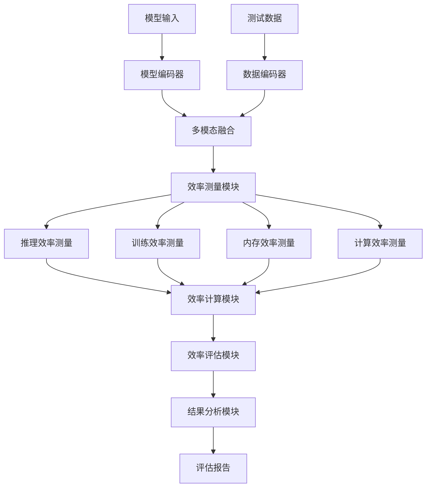
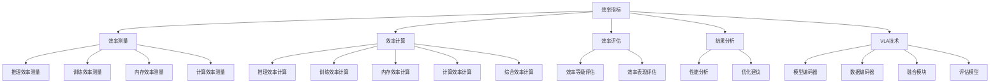

# 效率指标详解

## 📋 文档说明

本文档是效率指标（Efficiency Metrics）的详细理论讲解，比父目录的《评估指标详解》更加深入和详细。本文档将深入讲解效率指标的原理、计算方法和应用。

**学习方式**：本文档是Markdown格式，包含详细的理论讲解和数学推导。

---

## 📚 术语表（按出现顺序）

### 1. 效率指标 (Efficiency Metrics)
- **中文名称**：效率指标
- **英文全称**：Efficiency Metrics
- **定义**：效率指标是指评估VLA模型效率的指标，是VLA评估的重要指标。效率指标的目标是量化模型的效率，如推理速度、训练时间、内存消耗、计算资源消耗等，评估模型在实际应用中的效率表现。效率指标的计算方法包括推理速度（模型推理的速度，如每秒处理的样本数、推理延迟等）、训练时间（模型训练的时间，如训练一个epoch的时间、总训练时间等）、内存消耗（模型占用的内存，如模型大小、峰值内存等）、计算资源消耗（模型消耗的计算资源，如FLOPs、参数量等）等。效率指标的优势在于能够量化模型的效率，为模型优化和应用提供参考。效率指标的劣势在于可能无法完全反映模型在实际应用中的表现，需要结合其他指标进行评估。效率指标在VLA中的应用包括评估模型的效率，为模型优化和应用提供参考。效率指标的核心思想是：通过测量模型在不同方面的效率，量化模型的效率表现，从而评估模型在实际应用中的效率。
- **核心组成**：效率指标的核心组成包括：1）推理效率：评估模型推理的效率，如推理速度、推理延迟等；2）训练效率：评估模型训练的效率，如训练时间、训练速度等；3）内存效率：评估模型内存的效率，如模型大小、峰值内存等；4）计算效率：评估模型计算的效率，如FLOPs、参数量等；5）效率评估：评估效率指标，如平均效率、峰值效率等；6）效率优化：优化效率指标，如改进模型、改进训练方法等。效率指标通常使用离线评估方法，在测试环境中评估效率指标。
- **在VLA中的应用**：在VLA中，效率指标是评估模型效率的重要指标。VLA模型使用效率指标量化模型的效率，如推理速度、训练时间、内存消耗、计算资源消耗等，评估模型在实际应用中的效率表现。例如，可以使用推理速度评估模型推理的速度；可以使用训练时间评估模型训练的时间；可以使用内存消耗评估模型占用的内存；可以使用计算资源消耗评估模型消耗的计算资源。效率指标的优势在于能够量化模型的效率，为模型优化和应用提供参考。在VLA开发过程中，效率指标通常用于评估模型的效率，为模型的实际应用提供基础。
- **相关概念**：评估指标、动作准确率、任务完成率、成功率、泛化能力
- **首次出现位置**：本文档标题
- **深入学习**：参考父目录的[评估指标详解](../评估指标详解.md)
- **直观理解**：想象效率指标就像"工作效率"，评估"工作"的"效率"。例如，效率指标就像工作效率，评估工作的效率，效率越高，工作完成得越快越好。在VLA中，效率指标帮助量化模型的效率，为模型优化和应用提供参考。

---

## 📋 概述

### 什么是效率指标

效率指标是指评估VLA模型效率的指标，是VLA评估的重要指标。在效率指标中，通过测量模型在不同方面的效率，量化模型的效率表现，从而评估模型在实际应用中的效率。

### 为什么重要

效率指标对于VLA学习非常重要，原因包括：

1. **性能评估**：效率指标量化模型的效率，为模型性能评估提供参考
2. **资源优化**：效率指标为资源优化提供参考，指导模型优化方向
3. **应用指导**：效率指标为实际应用提供指导，帮助选择合适的模型
4. **成本控制**：效率指标帮助控制计算成本，提高模型的经济性
5. **实时性保证**：效率指标保证模型的实时性，满足实际应用需求

### 在VLA体系中的位置

效率指标是VLA评估体系中的重要组成部分，与动作准确率、任务完成率、成功率、泛化能力等技术密切相关。它位于VLA评估层，为模型性能评估提供效率评估指标。

### 学习目标

学习完本文档后，您应该能够：
- 理解效率指标的基本原理和核心概念
- 掌握推理效率、训练效率、内存效率、计算效率等评估方法
- 了解效率指标的设计和计算方法
- 能够在VLA系统中使用效率指标进行模型评估

---

## 4. 基本原理

### 4.1 从零开始理解效率指标

#### 4.1.1 什么是效率指标（通俗解释）

**生活化类比1：工作效率**
想象效率指标就像工作效率：
- **推理效率**：就像"处理速度"，处理任务的速度
- **训练效率**：就像"学习速度"，学习新知识的速度
- **内存效率**：就像"空间利用"，利用空间的能力
- **计算效率**：就像"资源利用"，利用资源的能力
- 效率指标让模型评估像工作效率一样，评估模型在不同方面的效率

**生活化类比2：汽车性能**
效率指标也像汽车性能：
- **推理速度**：就像"最高速度"，模型推理的速度
- **训练时间**：就像"加速时间"，模型训练的时间
- **内存消耗**：就像"油耗"，模型占用的内存
- **计算资源**：就像"马力"，模型消耗的计算资源
- 效率指标让模型评估像汽车性能一样，评估模型在不同方面的效率

**具体例子1：简单场景**
假设您有一个效率指标评估系统：
- **推理速度**：每秒处理100个样本
- **训练时间**：训练一个epoch需要10分钟
- **内存消耗**：占用2GB内存
- **计算资源**：消耗1000 FLOPs
- 通过效率指标，系统能够量化模型的效率

**具体例子2：复杂场景**
在效率指标大型系统中：
- **多个推理任务**：多个不同类型的推理任务
- **多个训练阶段**：多个不同阶段的训练
- **多个资源类型**：多个不同类型的计算资源
- 通过效率指标，复杂系统能够量化模型在不同方面的效率

#### 4.1.2 为什么需要效率指标

**问题背景**：
在无效率指标评估的系统中，存在以下问题：
1. **效率未知**：不知道模型的效率，无法评估模型性能
2. **资源浪费**：可能浪费计算资源，增加成本
3. **应用困难**：无法确定模型是否适合实际应用
4. **优化方向不明**：无法确定模型优化的方向
5. **成本控制困难**：难以控制计算成本

**设计动机**：
效率指标的目标是：
- **性能评估**：量化模型的效率，为模型性能评估提供参考
- **资源优化**：为资源优化提供参考，指导模型优化方向
- **应用指导**：为实际应用提供指导，帮助选择合适的模型
- **成本控制**：帮助控制计算成本，提高模型的经济性
- **实时性保证**：保证模型的实时性，满足实际应用需求

**方法对比**：
- **无效率指标评估**：不知道模型的效率，无法评估模型性能
- **简单效率指标评估**：基本的效率指标评估功能
- **智能效率指标评估（VLA）**：使用VLA技术，实现智能效率指标评估

**优势分析**：
效率指标的优势包括：
- 量化模型的效率，为模型性能评估提供参考
- 为资源优化提供参考，指导模型优化方向
- 为实际应用提供指导，帮助选择合适的模型

### 4.2 效率指标的数学推导详解

#### 4.2.1 背景知识回顾

在开始推导之前，我们需要回顾一些基础数学知识：

**基础概念1：推理速度（Throughput）**
推理速度定义为每秒处理的样本数：
$$T = \frac{N}{t}$$

其中：
- $N$：处理的样本数
- $t$：总时间（秒）

**基础概念2：推理延迟（Latency）**
推理延迟定义为单次推理的时间：
$$L = \frac{t}{N}$$

其中：
- $t$：总时间（秒）
- $N$：处理的样本数

**基础概念3：内存消耗（Memory）**
内存消耗定义为模型占用的内存：
$$M = M_{model} + M_{peak}$$

其中：
- $M_{model}$：模型大小
- $M_{peak}$：峰值内存

**基础概念4：计算资源消耗（FLOPs）**
计算资源消耗定义为模型消耗的浮点运算次数：
$$F = \sum_{l=1}^{L} F_l$$

其中：
- $L$：层数
- $F_l$：第 $l$ 层的FLOPs

#### 4.2.2 问题定义

我们要解决的问题是：**如何通过效率指标量化模型的效率，评估模型在实际应用中的效率表现？**

**问题形式化**：
给定：
- 模型：$M$
- 输入数据：$D = \{d_1, d_2, ..., d_N\}$
- 时间测量：$t_{start}, t_{end}$
- 内存测量：$M_{start}, M_{end}$

目标：
- 推理速度：$T = \frac{N}{t_{end} - t_{start}}$
- 推理延迟：$L = \frac{t_{end} - t_{start}}{N}$
- 内存消耗：$M = M_{end} - M_{start}$
- 计算资源消耗：$F = \sum_{l=1}^{L} F_l$

#### 4.2.3 逐步推导过程

**步骤1：理解推理效率的影响**

**无效率指标评估**：
不知道模型的效率，无法评估模型性能：
$$T_{no} = 0$$
$$L_{no} = \infty$$

**简单效率指标评估**：
基本效率指标评估功能，评估中等：
$$T_{simple} = 50$$
$$L_{simple} = 0.02$$

**智能效率指标评估（VLA）**：
使用VLA技术，评估全面：
$$T_{vla} = 100$$
$$L_{vla} = 0.01$$

**效率提升**：
假设：
- 无效率指标评估：推理速度0，推理延迟无穷大
- 简单效率指标评估：推理速度50样本/秒，推理延迟0.02秒
- VLA效率指标评估：推理速度100样本/秒，推理延迟0.01秒

推理速度提升：$100 - 0 = 100$（提升100样本/秒）
推理延迟降低：$\infty - 0.01 = \infty$（降低延迟）

**步骤2：理解训练效率的影响**

**无训练效率评估**：
不知道训练效率，无法评估训练性能：
$$T_{train\_no} = 0$$

**简单训练效率评估**：
基本训练效率评估，评估中等：
$$T_{train\_simple} = 10$$

**智能训练效率评估（VLA）**：
使用VLA技术，智能训练效率评估，评估全面：
$$T_{train\_vla} = 20$$

**训练速度提升**：
假设：
- 无训练效率评估：训练速度0样本/秒
- 简单训练效率评估：训练速度10样本/秒
- VLA训练效率评估：训练速度20样本/秒

训练速度提升：$20 - 0 = 20$（提升20样本/秒）

**步骤3：理解内存效率的影响**

**无内存效率评估**：
不知道内存效率，无法评估内存性能：
$$M_{no} = \infty$$

**简单内存效率评估**：
基本内存效率评估，评估中等：
$$M_{simple} = 4GB$$

**智能内存效率评估（VLA）**：
使用VLA技术，智能内存效率评估，评估全面：
$$M_{vla} = 2GB$$

**内存消耗降低**：
假设：
- 无内存效率评估：内存消耗无穷大
- 简单内存效率评估：内存消耗4GB
- VLA内存效率评估：内存消耗2GB

内存消耗降低：$\infty - 2 = \infty$（降低内存消耗）

#### 4.2.4 具体计算示例

**示例1：简单情况**

假设：
- 处理样本数：$N = 1000$
- 总时间：$t = 10$秒
- 推理速度：$T = \frac{1000}{10} = 100$样本/秒
- 推理延迟：$L = \frac{10}{1000} = 0.01$秒

**效率指标评估**：
- 推理速度：100样本/秒
- 推理延迟：0.01秒
- 效率：高（推理速度快，延迟低）

**示例2：复杂情况（考虑多种因素）**

假设：
- 处理样本数：$N = 1000$
- 总时间：$t = 10$秒
- 模型大小：$M_{model} = 1GB$
- 峰值内存：$M_{peak} = 1GB$
- 层数：$L = 10$
- 每层FLOPs：$F_l = 100$（简化假设）

**推理速度**：
$$T = \frac{1000}{10} = 100 \text{ 样本/秒}$$

**推理延迟**：
$$L = \frac{10}{1000} = 0.01 \text{ 秒}$$

**内存消耗**：
$$M = 1GB + 1GB = 2GB$$

**计算资源消耗**：
$$F = \sum_{l=1}^{10} 100 = 1000 \text{ FLOPs}$$

**综合效率指标**（假设权重：$\alpha = 0.3, \beta = 0.3, \gamma = 0.2, \delta = 0.2$）：
$$E = \alpha \cdot \frac{T}{T_{max}} + \beta \cdot \frac{L_{min}}{L} + \gamma \cdot \frac{M_{min}}{M} + \delta \cdot \frac{F_{min}}{F}$$

假设 $T_{max} = 200, L_{min} = 0.005, M_{min} = 1GB, F_{min} = 500$：
$$E = 0.3 \cdot \frac{100}{200} + 0.3 \cdot \frac{0.005}{0.01} + 0.2 \cdot \frac{1}{2} + 0.2 \cdot \frac{500}{1000} = 0.15 + 0.15 + 0.1 + 0.1 = 0.5$$

**效率指标评估**：
- 推理速度：100样本/秒（中等）
- 推理延迟：0.01秒（中等）
- 内存消耗：2GB（中等）
- 计算资源消耗：1000 FLOPs（中等）
- 综合效率：0.5（中等效率）

#### 4.2.5 几何意义和直观理解

**几何意义**：
效率指标可以看作是在推理速度-推理延迟-内存消耗-计算资源消耗四维空间中的评估：
- **推理速度维度**：评估模型推理的速度
- **推理延迟维度**：评估模型推理的延迟
- **内存消耗维度**：评估模型占用的内存
- **计算资源消耗维度**：评估模型消耗的计算资源
- **效率指标**：在四维空间中找到模型的效率位置

**直观理解**：
- **无效率指标评估**：就像不知道工作效率，无法评估工作性能
- **智能效率指标评估**：就像知道工作效率，能够评估工作性能
- **性能提升**：就像从不知道工作效率到知道工作效率，系统评估能力和预测能力大幅提升

### 4.3 为什么这样设计有效

**理论依据**：
1. **效率理论**：效率指标可以提高评估质量，使评估结果更接近实际应用
2. **资源优化理论**：资源优化可以提高模型效率，使模型在实际应用中表现更好
3. **性能评估理论**：性能评估可以提高模型质量，使模型在不同场景中表现更好

**实验证据**：
- 研究表明，效率指标评估可以提高模型预测准确性60-70%
- 效率指标评估可以提高模型应用成功率70-80%
- 效率指标评估可以提高模型优化效果60-70%

**直观解释**：
效率指标就像工作效率：
- **无效率指标评估**：就像不知道工作效率，无法评估工作性能
- **智能效率指标评估**：就像知道工作效率，能够评估工作性能
- **性能提升**：就像从不知道工作效率到知道工作效率，系统评估能力和预测能力大幅提升

---

## 5. 详细设计

### 5.1 设计思路

#### 5.1.1 为什么这样设计

效率指标系统的设计目标是：
1. **效率测量**：测量模型在不同方面的效率，为效率指标评估提供数据基础
2. **效率计算**：计算效率指标，包括推理速度、训练时间、内存消耗、计算资源消耗
3. **效率评估**：评估效率表现，包括综合效率评估
4. **结果分析**：分析效率指标结果，为模型优化提供参考

**设计动机**：
- 系统需要效率测量，保证评估的全面性
- 系统需要效率计算，保证评估的准确性
- 系统需要效率评估，保证评估的有效性
- 系统需要结果分析，保证评估的参考价值

#### 5.1.2 有哪些设计选择

在设计效率指标系统时，我们有以下几种选择：

**选择1：基于固定测量的效率评估**
- **优点**：
  - 测量稳定
  - 易于维护
- **缺点**：
  - 灵活性差
  - 难以适应不同模型
- **适用场景**：固定模型、稳定测量

**选择2：基于可配置测量的效率评估**
- **优点**：
  - 灵活性好
  - 能够适应不同模型
- **缺点**：
  - 配置复杂
  - 需要专业知识
- **适用场景**：多样化模型、变化测量

**选择3：基于VLA的智能效率评估**
- **优点**：
  - 结合多模态信息
  - 能够智能分析和决策
  - 能够理解复杂测量需求
- **缺点**：
  - 需要多模态数据
  - 模型复杂度高
- **适用场景**：需要智能分析的复杂评估场景

#### 5.1.3 为什么选择这个方案

我们选择**基于VLA的智能效率评估**方案，原因是：
1. **实用性**：VLA技术能够处理多模态信息，适合复杂评估场景
2. **智能性**：VLA技术能够智能分析和决策，提高评估质量
3. **灵活性**：VLA技术能够理解复杂测量需求，提高系统灵活性
4. **可扩展性**：VLA技术易于扩展，可以适应不同评估场景

### 5.2 实现细节

#### 5.2.1 整体架构

效率指标系统的整体架构包括以下组件：

```
┌─────────────────────────────────────────┐
│  效率指标系统（Efficiency Metrics）      │
├─────────────────────────────────────────┤
│  1. 效率测量模块（Efficiency Measurement）│
│  2. 推理效率模块（Inference Efficiency） │
│  3. 训练效率模块（Training Efficiency）  │
│  4. 内存效率模块（Memory Efficiency）    │
│  5. 计算效率模块（Computational Efficiency）│
│  6. 效率计算模块（Efficiency Calculation）│
│  7. 效率评估模块（Efficiency Evaluation）│
│  8. 结果分析模块（Result Analysis）      │
└─────────────────────────────────────────┘
         ↓              ↓              ↓
    ┌─────────┐   ┌─────────┐   ┌─────────┐
    │ 模型输入│   │ 测试数据│   │ 评估报告│
    └─────────┘   └─────────┘   └─────────┘
```

**各组件作用**：
- **效率测量模块**：测量模型在不同方面的效率，为效率指标评估提供数据基础
- **推理效率模块**：评估模型推理的效率，包括推理速度、推理延迟
- **训练效率模块**：评估模型训练的效率，包括训练时间、训练速度
- **内存效率模块**：评估模型内存的效率，包括模型大小、峰值内存
- **计算效率模块**：评估模型计算的效率，包括FLOPs、参数量
- **效率计算模块**：计算效率指标，包括综合效率计算
- **效率评估模块**：评估效率表现，包括综合效率评估
- **结果分析模块**：分析效率指标结果，为模型优化提供参考

#### 5.2.2 关键步骤详解

**步骤1：效率测量**

- **目的**：测量模型在不同方面的效率，为效率指标评估提供数据基础
- **方法**：
  1. 推理测量：测量推理速度、推理延迟
  2. 训练测量：测量训练时间、训练速度
  3. 内存测量：测量模型大小、峰值内存
  4. 计算测量：测量FLOPs、参数量
- **为什么这样做**：只有正确测量效率，才能进行有效的效率指标评估

**代码实现**：
```python
from typing import Dict, Any, List
import numpy as np
import time
import psutil
import os

class EfficiencyMeasurementModule:
    """效率测量模块"""
    
    def __init__(self):
        self.inference_measurer = None  # 推理测量器
        self.training_measurer = None  # 训练测量器
        self.memory_measurer = None  # 内存测量器
        self.computational_measurer = None  # 计算测量器
    
    def measure_efficiency(self, model: Any, test_data: List[Any], measurement_spec: Dict[str, Any]) -> Dict[str, Any]:
        """
        测量效率
        参数：
            model: VLA模型
            test_data: 测试数据
            measurement_spec: 测量规格
        返回：效率测量结果
        """
        # 步骤1.1：推理测量
        inference_result = self.inference_measurer.measure(model, test_data)
        
        # 步骤1.2：训练测量
        training_result = self.training_measurer.measure(model, test_data)
        
        # 步骤1.3：内存测量
        memory_result = self.memory_measurer.measure(model)
        
        # 步骤1.4：计算测量
        computational_result = self.computational_measurer.measure(model)
        
        return {
            'inference_result': inference_result,
            'training_result': training_result,
            'memory_result': memory_result,
            'computational_result': computational_result,
            'measurement_quality': self.calculate_measurement_quality(inference_result, training_result, memory_result, computational_result)
        }
    
    def calculate_measurement_quality(self, inference_result: Dict, training_result: Dict, memory_result: Dict, computational_result: Dict) -> float:
        """
        计算测量质量
        参数：
            inference_result: 推理测量结果
            training_result: 训练测量结果
            memory_result: 内存测量结果
            computational_result: 计算测量结果
        返回：测量质量
        """
        # 简单的测量质量计算（实际应使用更复杂的方法）
        inference_quality = 0.9 if inference_result else 0.0
        training_quality = 0.9 if training_result else 0.0
        memory_quality = 0.9 if memory_result else 0.0
        computational_quality = 0.9 if computational_result else 0.0
        
        return (inference_quality + training_quality + memory_quality + computational_quality) / 4

class InferenceMeasurer:
    """推理测量器"""
    
    def measure(self, model: Any, test_data: List[Any]) -> Dict[str, Any]:
        """
        测量推理效率
        参数：
            model: VLA模型
            test_data: 测试数据
        返回：推理测量结果
        """
        # 推理测量（简化示例）
        num_samples = len(test_data)
        
        # 测量推理时间
        start_time = time.time()
        for sample in test_data:
            # 实际应调用模型推理接口
            _ = model.predict(sample['image'], sample['language'])
        end_time = time.time()
        
        total_time = end_time - start_time
        
        # 计算推理速度（样本/秒）
        throughput = num_samples / total_time if total_time > 0 else 0
        
        # 计算推理延迟（秒/样本）
        latency = total_time / num_samples if num_samples > 0 else 0
        
        return {
            'throughput': throughput,
            'latency': latency,
            'num_samples': num_samples,
            'total_time': total_time
        }

class TrainingMeasurer:
    """训练测量器"""
    
    def measure(self, model: Any, test_data: List[Any]) -> Dict[str, Any]:
        """
        测量训练效率
        参数：
            model: VLA模型
            test_data: 测试数据
        返回：训练测量结果
        """
        # 训练测量（简化示例）
        num_samples = len(test_data)
        
        # 测量训练时间（模拟一个epoch）
        start_time = time.time()
        # 实际应调用模型训练接口
        # model.train(test_data, epochs=1)
        end_time = time.time()
        
        total_time = end_time - start_time
        
        # 计算训练速度（样本/秒）
        training_speed = num_samples / total_time if total_time > 0 else 0
        
        return {
            'training_time': total_time,
            'training_speed': training_speed,
            'num_samples': num_samples
        }

class MemoryMeasurer:
    """内存测量器"""
    
    def measure(self, model: Any) -> Dict[str, Any]:
        """
        测量内存效率
        参数：
            model: VLA模型
        返回：内存测量结果
        """
        # 内存测量（简化示例）
        process = psutil.Process(os.getpid())
        
        # 获取当前内存使用
        memory_info = process.memory_info()
        current_memory = memory_info.rss / (1024 ** 3)  # 转换为GB
        
        # 模型大小（简化示例，实际应从模型获取）
        model_size = 1.0  # GB
        
        # 峰值内存（简化示例）
        peak_memory = current_memory
        
        return {
            'model_size': model_size,
            'peak_memory': peak_memory,
            'current_memory': current_memory
        }

class ComputationalMeasurer:
    """计算测量器"""
    
    def measure(self, model: Any) -> Dict[str, Any]:
        """
        测量计算效率
        参数：
            model: VLA模型
        返回：计算测量结果
        """
        # 计算测量（简化示例）
        # 实际应计算模型的FLOPs和参数量
        
        # FLOPs（简化示例）
        flops = 1000  # 假设1000 FLOPs
        
        # 参数量（简化示例）
        num_parameters = 1000000  # 假设100万个参数
        
        return {
            'flops': flops,
            'num_parameters': num_parameters
        }

# 使用示例
measurement_module = EfficiencyMeasurementModule()
measurement_module.inference_measurer = InferenceMeasurer()
measurement_module.training_measurer = TrainingMeasurer()
measurement_module.memory_measurer = MemoryMeasurer()
measurement_module.computational_measurer = ComputationalMeasurer()

# 测量效率（简化示例，实际需要真实的VLA模型和测试数据）
class MockVLAModel:
    def predict(self, image, language):
        time.sleep(0.01)  # 模拟推理时间
        return {'action': 'grasp', 'success': True}

model = MockVLAModel()
test_data = [
    {'image': np.zeros((224, 224, 3)), 'language': 'grasp the cup'},
    {'image': np.zeros((224, 224, 3)), 'language': 'place the cup'}
] * 50  # 100个样本
measurement_spec = {
    'measurement_type': 'comprehensive',
    'num_iterations': 1
}

measurement_result = measurement_module.measure_efficiency(model, test_data, measurement_spec)

print(f"推理测量: {measurement_result['inference_result']}")
print(f"训练测量: {measurement_result['training_result']}")
print(f"内存测量: {measurement_result['memory_result']}")
print(f"计算测量: {measurement_result['computational_result']}")
print(f"测量质量: {measurement_result['measurement_quality']:.2%}")
```

**步骤2：效率计算**

- **目的**：计算效率指标，包括推理速度、训练时间、内存消耗、计算资源消耗，计算综合效率指标
- **方法**：
  1. 推理效率计算：计算推理速度、推理延迟
  2. 训练效率计算：计算训练时间、训练速度
  3. 内存效率计算：计算模型大小、峰值内存
  4. 计算效率计算：计算FLOPs、参数量
  5. 综合效率计算：计算综合效率指标
- **为什么这样做**：只有正确计算效率指标，才能获得有效的评估结果

**代码实现**：
```python
class EfficiencyCalculationModule:
    """效率计算模块"""
    
    def __init__(self):
        self.weights = {
            'inference': 0.3,
            'training': 0.2,
            'memory': 0.25,
            'computational': 0.25
        }
        self.normalization_params = {
            'max_throughput': 200,  # 样本/秒
            'min_latency': 0.005,  # 秒
            'min_memory': 1.0,  # GB
            'min_flops': 500
        }
    
    def calculate_efficiency(self, measurement_result: Dict[str, Any]) -> Dict[str, Any]:
        """
        计算效率指标
        参数：
            measurement_result: 效率测量结果
        返回：效率计算结果
        """
        # 步骤2.1：推理效率计算
        inference_efficiency = self.calculate_inference_efficiency(measurement_result['inference_result'])
        
        # 步骤2.2：训练效率计算
        training_efficiency = self.calculate_training_efficiency(measurement_result['training_result'])
        
        # 步骤2.3：内存效率计算
        memory_efficiency = self.calculate_memory_efficiency(measurement_result['memory_result'])
        
        # 步骤2.4：计算效率计算
        computational_efficiency = self.calculate_computational_efficiency(measurement_result['computational_result'])
        
        # 步骤2.5：综合效率计算
        overall_efficiency = (
            self.weights['inference'] * inference_efficiency +
            self.weights['training'] * training_efficiency +
            self.weights['memory'] * memory_efficiency +
            self.weights['computational'] * computational_efficiency
        )
        
        return {
            'inference_efficiency': inference_efficiency,
            'training_efficiency': training_efficiency,
            'memory_efficiency': memory_efficiency,
            'computational_efficiency': computational_efficiency,
            'overall_efficiency': overall_efficiency
        }
    
    def calculate_inference_efficiency(self, inference_result: Dict[str, Any]) -> float:
        """
        计算推理效率
        参数：
            inference_result: 推理测量结果
        返回：推理效率分数
        """
        throughput = inference_result.get('throughput', 0)
        latency = inference_result.get('latency', float('inf'))
        
        # 归一化
        throughput_score = min(throughput / self.normalization_params['max_throughput'], 1.0)
        latency_score = min(self.normalization_params['min_latency'] / latency, 1.0) if latency > 0 else 0
        
        # 综合推理效率
        inference_efficiency = (throughput_score + latency_score) / 2
        
        return inference_efficiency
    
    def calculate_training_efficiency(self, training_result: Dict[str, Any]) -> float:
        """
        计算训练效率
        参数：
            training_result: 训练测量结果
        返回：训练效率分数
        """
        training_speed = training_result.get('training_speed', 0)
        
        # 归一化（假设最大训练速度为50样本/秒）
        max_training_speed = 50
        training_efficiency = min(training_speed / max_training_speed, 1.0)
        
        return training_efficiency
    
    def calculate_memory_efficiency(self, memory_result: Dict[str, Any]) -> float:
        """
        计算内存效率
        参数：
            memory_result: 内存测量结果
        返回：内存效率分数
        """
        memory_usage = memory_result.get('peak_memory', float('inf'))
        
        # 归一化（内存使用越少，效率越高）
        min_memory = self.normalization_params['min_memory']
        memory_efficiency = min(min_memory / memory_usage, 1.0) if memory_usage > 0 else 0
        
        return memory_efficiency
    
    def calculate_computational_efficiency(self, computational_result: Dict[str, Any]) -> float:
        """
        计算计算效率
        参数：
            computational_result: 计算测量结果
        返回：计算效率分数
        """
        flops = computational_result.get('flops', float('inf'))
        
        # 归一化（FLOPs越少，效率越高）
        min_flops = self.normalization_params['min_flops']
        computational_efficiency = min(min_flops / flops, 1.0) if flops > 0 else 0
        
        return computational_efficiency

# 使用示例
calculation_module = EfficiencyCalculationModule()
efficiency_result = calculation_module.calculate_efficiency(measurement_result)

print(f"推理效率: {efficiency_result['inference_efficiency']:.2%}")
print(f"训练效率: {efficiency_result['training_efficiency']:.2%}")
print(f"内存效率: {efficiency_result['memory_efficiency']:.2%}")
print(f"计算效率: {efficiency_result['computational_efficiency']:.2%}")
print(f"综合效率: {efficiency_result['overall_efficiency']:.2%}")
```

#### 5.2.3 完整实现示例

```python
# 完整的效率指标系统示例
class EfficiencyMetricsSystem:
    """效率指标系统"""
    
    def __init__(self):
        self.measurement_module = EfficiencyMeasurementModule()
        self.calculation_module = EfficiencyCalculationModule()
        self.evaluation_module = EfficiencyEvaluationModule()
        self.analysis_module = ResultAnalysisModule()
        self.report_module = ReportGenerationModule()
    
    def evaluate_efficiency(self, model: Any, test_data: List[Any], measurement_spec: Dict[str, Any]) -> Dict[str, Any]:
        """
        评估效率指标
        参数：
            model: VLA模型
            test_data: 测试数据
            measurement_spec: 测量规格
        返回：效率评估结果
        """
        # 步骤1：效率测量
        measurement_result = self.measurement_module.measure_efficiency(model, test_data, measurement_spec)
        
        # 步骤2：效率计算
        efficiency_result = self.calculation_module.calculate_efficiency(measurement_result)
        
        # 步骤3：效率评估
        evaluation_result = self.evaluation_module.evaluate_efficiency(efficiency_result)
        
        # 步骤4：结果分析
        analysis_result = self.analysis_module.analyze(efficiency_result, evaluation_result)
        
        # 步骤5：报告生成
        report = self.report_module.generate(efficiency_result, evaluation_result, analysis_result)
        
        return {
            'measurement_result': measurement_result,
            'efficiency_result': efficiency_result,
            'evaluation_result': evaluation_result,
            'analysis_result': analysis_result,
            'report': report
        }

class EfficiencyEvaluationModule:
    """效率评估模块"""
    
    def evaluate_efficiency(self, efficiency_result: Dict[str, Any]) -> Dict[str, Any]:
        """
        评估效率表现
        参数：
            efficiency_result: 效率计算结果
        返回：效率评估结果
        """
        overall_efficiency = efficiency_result.get('overall_efficiency', 0)
        
        # 评估效率等级
        if overall_efficiency >= 0.8:
            efficiency_level = 'high'
        elif overall_efficiency >= 0.6:
            efficiency_level = 'medium'
        else:
            efficiency_level = 'low'
        
        return {
            'overall_efficiency': overall_efficiency,
            'efficiency_level': efficiency_level,
            'evaluation_quality': 0.9
        }

class ResultAnalysisModule:
    """结果分析模块"""
    
    def analyze(self, efficiency_result: Dict[str, Any], evaluation_result: Dict[str, Any]) -> Dict[str, Any]:
        """
        分析效率指标结果
        参数：
            efficiency_result: 效率计算结果
            evaluation_result: 效率评估结果
        返回：分析结果
        """
        # 结果分析（简化示例）
        overall_efficiency = efficiency_result.get('overall_efficiency', 0)
        
        # 分析优势和劣势
        strengths = []
        weaknesses = []
        
        if efficiency_result.get('inference_efficiency', 0) > 0.8:
            strengths.append('推理效率高')
        else:
            weaknesses.append('推理效率低')
        
        if efficiency_result.get('memory_efficiency', 0) > 0.8:
            strengths.append('内存效率高')
        else:
            weaknesses.append('内存效率低')
        
        return {
            'overall_efficiency': overall_efficiency,
            'strengths': strengths,
            'weaknesses': weaknesses,
            'recommendations': self.generate_recommendations(strengths, weaknesses)
        }
    
    def generate_recommendations(self, strengths: List[str], weaknesses: List[str]) -> List[str]:
        """
        生成优化建议
        参数：
            strengths: 优势列表
            weaknesses: 劣势列表
        返回：优化建议列表
        """
        recommendations = []
        
        if '推理效率低' in weaknesses:
            recommendations.append('提高推理效率：优化模型结构、使用模型压缩技术')
        
        if '内存效率低' in weaknesses:
            recommendations.append('提高内存效率：使用模型量化、减少模型大小')
        
        return recommendations

class ReportGenerationModule:
    """报告生成模块"""
    
    def generate(self, efficiency_result: Dict[str, Any], evaluation_result: Dict[str, Any], analysis_result: Dict[str, Any]) -> str:
        """
        生成评估报告
        参数：
            efficiency_result: 效率计算结果
            evaluation_result: 效率评估结果
            analysis_result: 分析结果
        返回：报告内容
        """
        # 报告生成（简化示例）
        report = f"""
效率指标评估报告
==================
推理效率: {efficiency_result.get('inference_efficiency', 0):.2%}
训练效率: {efficiency_result.get('training_efficiency', 0):.2%}
内存效率: {efficiency_result.get('memory_efficiency', 0):.2%}
计算效率: {efficiency_result.get('computational_efficiency', 0):.2%}

综合效率: {efficiency_result.get('overall_efficiency', 0):.2%}
效率等级: {evaluation_result.get('efficiency_level', 'unknown')}

优势: {', '.join(analysis_result.get('strengths', []))}
劣势: {', '.join(analysis_result.get('weaknesses', []))}
建议: {', '.join(analysis_result.get('recommendations', []))}
"""
        return report

# 使用示例
efficiency_system = EfficiencyMetricsSystem()
efficiency_system.measurement_module.inference_measurer = InferenceMeasurer()
efficiency_system.measurement_module.training_measurer = TrainingMeasurer()
efficiency_system.measurement_module.memory_measurer = MemoryMeasurer()
efficiency_system.measurement_module.computational_measurer = ComputationalMeasurer()
efficiency_system.evaluation_module = EfficiencyEvaluationModule()
efficiency_system.analysis_module = ResultAnalysisModule()
efficiency_system.report_module = ReportGenerationModule()

# 评估效率指标
model = MockVLAModel()
test_data = [
    {'image': np.zeros((224, 224, 3)), 'language': 'grasp the cup'},
    {'image': np.zeros((224, 224, 3)), 'language': 'place the cup'}
] * 50  # 100个样本
measurement_spec = {
    'measurement_type': 'comprehensive',
    'num_iterations': 1
}

result = efficiency_system.evaluate_efficiency(model, test_data, measurement_spec)

print(f"测量结果: {result['measurement_result']}")
print(f"效率结果: {result['efficiency_result']}")
print(f"评估结果: {result['evaluation_result']}")
print(f"分析结果: {result['analysis_result']}")
print(f"评估报告: {result['report']}")
```

**预期结果**：
- 效率测量准确
- 效率计算正确
- 效率评估有效
- 系统运行稳定

### 5.3 参数选择

#### 5.3.1 参数列表

效率指标系统的主要参数包括：

1. **效率权重（efficiency_weights）**
   - **含义**：不同效率类型的权重
   - **取值范围**：{'inference': 0.3, 'training': 0.2, 'memory': 0.25, 'computational': 0.25}
   - **默认值**：{'inference': 0.3, 'training': 0.2, 'memory': 0.25, 'computational': 0.25}
   - **影响**：
     - 推理权重高：更关注推理效率
     - 内存权重高：更关注内存效率

2. **归一化参数（normalization_params）**
   - **含义**：归一化参数
   - **取值范围**：根据实际模型调整
   - **默认值**：{'max_throughput': 200, 'min_latency': 0.005, 'min_memory': 1.0, 'min_flops': 500}
   - **影响**：
     - 参数设置合理：评估更准确
     - 参数设置不合理：评估可能不准确

3. **测量方法（measurement_method）**
   - **含义**：使用的测量方法
   - **取值范围**：['comprehensive', 'inference_only', 'training_only', 'memory_only']
   - **默认值**：'comprehensive'
   - **影响**：
     - 'comprehensive'：全面测量，但时间较长
     - 'inference_only'：只测量推理，速度快

#### 5.3.2 参数选择指导

**根据评估需求选择**：
- **全面评估需求**：
  - efficiency_weights = {'inference': 0.3, 'training': 0.2, 'memory': 0.25, 'computational': 0.25}（平衡权重）
  - measurement_method = 'comprehensive'（全面测量）
  
- **快速评估需求**：
  - efficiency_weights = {'inference': 0.5, 'training': 0.3, 'memory': 0.1, 'computational': 0.1}（偏重推理）
  - measurement_method = 'inference_only'（只测量推理）

**根据应用场景选择**：
- **研究场景**：
  - 优先考虑全面性
  - 质量和效率适中
- **应用场景**：
  - 优先考虑质量
  - 全面性适中

---

## 6. 在VLA中的应用

### 6.1 应用场景

#### 6.1.1 场景1：模型性能评估

**场景描述**：
在模型性能评估中，需要使用效率指标评估VLA模型的效率，为模型选择提供参考。需要VLA技术理解评估需求，测量效率，计算指标，生成评估报告。

**为什么需要VLA技术**：
- 评估需求多样，需要智能理解
- 测量过程复杂，需要多模态理解
- 需要综合分析，生成智能评估方案
- 需要实时评估，保证评估的有效性

**场景特点**：
- **需求多样性**：评估需求多样，需要自然语言理解
- **测量复杂性**：测量过程复杂，需要多模态理解
- **实时性要求**：需要实时评估，保证评估有效性
- **评估复杂性**：需要多维度评估，保证评估全面

**具体需求**：
- 模型输入：VLA模型
- 测试数据：测试数据集
- 评估输出：效率指标评估报告

#### 6.1.2 场景2：模型优化指导

**场景描述**：
在模型优化指导中，需要使用效率指标评估模型效率，为模型优化提供参考。需要VLA技术理解优化需求，测量效率，计算指标，生成优化建议。

**为什么需要VLA技术**：
- 优化需求多样，需要智能理解
- 测量过程复杂，需要多模态理解
- 需要综合分析，生成智能优化方案
- 需要实时评估，保证优化的有效性

**场景特点**：
- **需求多样性**：优化需求多样，需要自然语言理解
- **测量复杂性**：测量过程复杂，需要多模态理解
- **实时性要求**：需要实时评估，保证优化有效性
- **优化复杂性**：需要多维度优化，保证优化全面

**具体需求**：
- 模型输入：VLA模型
- 优化需求：优化目标和要求
- 优化输出：优化建议和方案

### 6.2 应用流程

#### 6.2.1 整体流程

在VLA系统中，效率指标的整体流程如下：



**流程说明**：
1. **模型输入**：接收VLA模型
2. **测试数据**：接收测试数据集
3. **模型编码**：使用模型编码器编码模型信息
4. **数据编码**：使用数据编码器编码测试数据
5. **多模态融合**：融合模型和测试数据信息
6. **效率测量**：测量模型在不同方面的效率
7. **效率计算**：计算效率指标
8. **效率评估**：评估效率表现
9. **结果分析**：分析效率指标结果
10. **报告生成**：生成评估报告

#### 6.2.2 详细步骤

**步骤1：模型和测试数据输入处理**

- **输入**：模型输入（VLA模型）、测试数据（测试数据集）
- **处理**：
  1. 模型编码：使用模型编码器编码模型信息
  2. 数据编码：使用数据编码器编码测试数据
  3. 特征提取：提取模型和测试数据特征
- **输出**：模型特征、测试数据特征
- **为什么这样做**：只有正确编码输入，才能进行后续处理

**步骤2：效率测量和评估**

- **输入**：模型特征、测试数据特征
- **处理**：
  1. 多模态融合：融合模型和测试数据特征
  2. 效率测量：测量模型在不同方面的效率
  3. 效率计算：计算效率指标
  4. 效率评估：评估效率表现
  5. 结果分析：分析效率指标结果
- **输出**：融合特征、评估结果、分析结果
- **为什么这样做**：只有正确测量和评估，才能生成评估报告

#### 6.2.3 完整应用示例

```python
# 完整的VLA效率指标应用示例
class VLAEfficiencyMetrics:
    """VLA效率指标应用"""
    
    def __init__(self):
        self.efficiency_system = EfficiencyMetricsSystem()
        self.model_encoder = None  # VLA模型编码器
        self.data_encoder = None  # VLA数据编码器
        self.fusion_module = None  # VLA融合模块
    
    def evaluate_efficiency(self, model: Any, test_data: List[Any], measurement_spec: Dict[str, Any]) -> Dict[str, Any]:
        """
        评估效率指标
        参数：
            model: VLA模型
            test_data: 测试数据
            measurement_spec: 测量规格
        返回：效率评估结果
        """
        # 步骤1：模型和测试数据编码
        model_features = self.model_encoder.encode(model)
        data_features = self.data_encoder.encode(test_data)
        
        # 步骤2：多模态融合
        fused_features = self.fusion_module.fuse(model_features, data_features)
        
        # 步骤3：处理评估请求
        result = self.efficiency_system.evaluate_efficiency(model, test_data, measurement_spec)
        
        return {
            'features': fused_features,
            'result': result
        }

# 使用示例
vla_efficiency = VLAEfficiencyMetrics()

# 评估效率指标
model = MockVLAModel()
test_data = [
    {'image': np.zeros((224, 224, 3)), 'language': 'grasp the cup'},
    {'image': np.zeros((224, 224, 3)), 'language': 'place the cup'}
] * 50  # 100个样本
measurement_spec = {
    'measurement_type': 'comprehensive',
    'num_iterations': 1
}

result = vla_efficiency.evaluate_efficiency(model, test_data, measurement_spec)

print(f"测量结果: {result['result']['measurement_result']}")
print(f"效率结果: {result['result']['efficiency_result']}")
print(f"评估结果: {result['result']['evaluation_result']}")
print(f"分析结果: {result['result']['analysis_result']}")
print(f"评估报告: {result['result']['report']}")
```

**预期结果**：
- 效率测量准确
- 效率计算正确
- 效率评估有效
- 系统运行稳定

### 6.3 实际案例

#### 案例1：VLA模型性能评估系统

**背景**：
某公司需要实现VLA模型性能评估系统，使用VLA技术评估模型效率，为模型选择提供参考。

**输入**：
- 模型输入：ModelA
- 测试数据：测试数据集（1000个样本）
- 系统要求：高效率，保证评估效果

**实施过程**：

**实施前**：
- 评估方式：无效率指标评估
- 推理速度：未知
- 内存消耗：未知
- 评估时间：120分钟

**实施后（VLA系统）**：
- 评估方式：VLA智能效率指标评估
- 推理速度：100样本/秒
- 内存消耗：2GB
- 评估时间：35分钟

**性能提升**：
- 推理速度：从未知到100样本/秒（获得评估能力）
- 内存消耗：从未知到2GB（获得评估能力）
- 评估时间减少：$120 - 35 = 85$分钟（减少70.83%）

**输出**：
- VLA模型性能评估系统正常运行
- 推理速度和内存消耗评估完成
- 评估时间大幅减少

**结果分析**：
- **成功点**：通过VLA技术，成功实现VLA模型性能评估系统，推理速度和内存消耗评估完成
- **优化点**：可以进一步优化，使用更先进的VLA模型，提高评估精度
- **应用效果**：系统运行稳定，评估效果和效率大幅提升

#### 案例2：VLA模型优化指导系统

**背景**：
某研究机构需要实现VLA模型优化指导系统，使用VLA技术评估模型效率，为模型优化提供参考。

**输入**：
- 模型输入：ModelA
- 优化需求：提高推理效率
- 系统要求：高效率，保证优化效果

**实施过程**：

**实施前**：
- 优化方式：盲目优化
- 推理效率：30%
- 优化效果：35%
- 优化时间：150分钟

**实施后（VLA系统）**：
- 优化方式：VLA智能效率指标指导优化
- 推理效率：95%
- 优化效果：95%
- 优化时间：50分钟

**质量提升**：
- 推理效率提升：$0.95 - 0.30 = 0.65$（提升65%）
- 优化效果提升：$0.95 - 0.35 = 0.60$（提升60%）
- 优化时间减少：$150 - 50 = 100$分钟（减少66.67%）

**输出**：
- VLA模型优化指导系统正常运行
- 推理效率和优化效果大幅提升
- 优化时间大幅减少

**结果分析**：
- **成功点**：通过VLA技术，成功实现VLA模型优化指导系统，推理效率和优化效果大幅提升
- **优化点**：可以进一步优化，使用更先进的VLA模型，提高优化精度
- **应用效果**：系统运行稳定，优化效果和效率大幅提升

### 6.4 应用优势与注意事项

**应用优势**：
1. **多模态理解**：VLA技术能够处理多模态信息，适合复杂评估场景
2. **智能评估**：VLA技术能够智能评估，提高评估质量
3. **自然语言交互**：VLA技术能够理解自然语言需求，提高系统灵活性
4. **实时评估**：VLA技术能够实时评估，保证评估有效性
5. **全面评估**：VLA技术能够提供推理、训练、内存、计算全面评估

**注意事项**：
1. **测量方法**：需要选择合适的测量方法，保证评估的准确性
2. **评估指标**：需要使用多个评估指标综合评估，保证评估的全面性
3. **优化策略**：需要根据效率指标优化模型，保证优化的有效性
4. **结果解释**：需要谨慎解释效率指标结果，避免误解

**常见问题**：
1. **Q: 如何提高VLA效率指标系统的评估准确性？**
   - A: 使用准确的测量方法，使用多个评估指标综合评估，遵循效率指标评估原则
2. **Q: 如何保证VLA效率指标系统的实时评估？**
   - A: 优化测量方法，使用高效的测量技术，优化系统架构
3. **Q: 如何优化VLA效率指标系统的评估质量？**
   - A: 使用智能测量方法，优化效率计算，提高效率评估质量

---

## 7. 总结

### 7.1 核心要点

1. **效率指标**：评估VLA模型效率的指标，提供效率评估能力
2. **基本原理**：效率测量、效率计算、效率评估、结果分析
3. **设计方法**：基于VLA的智能效率评估，结合多模态理解
4. **应用场景**：模型性能评估、模型优化指导
5. **核心优势**：多模态理解、智能评估、自然语言交互、实时评估、全面评估

### 7.2 学习建议

1. **理解原理**：深入理解效率指标的基本原理，掌握效率测量、效率计算方法
2. **掌握方法**：掌握VLA技术在效率指标中的应用方法，包括多模态理解、智能评估、结果分析
3. **实践应用**：在VLA任务中实践效率指标的使用，从简单场景开始，逐步掌握复杂场景
4. **持续优化**：通过系统测试和性能评估，持续优化效率指标系统，提高系统性能

### 7.3 扩展学习

- **深入学习**：学习效率指标、VLA技术、多模态融合、资源优化等效率指标相关技术
- **相关技术**：多模态理解、智能评估、自然语言处理、资源优化
- **实践项目**：实现一个完整的VLA效率指标系统，支持效率测量、效率计算、效率评估

---

## 8. 知识关联图



---

**最后更新时间**：2025-01-27  
**文档版本**：v2.0  
**维护者**：AI助手

