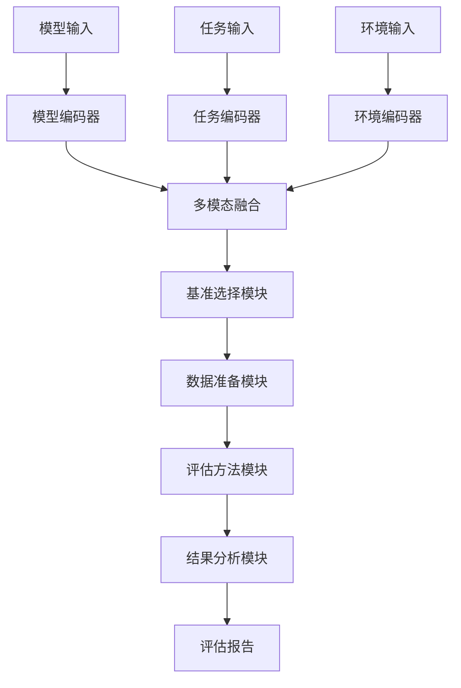
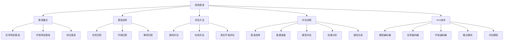

# 其他基准详解

## 📋 文档说明

本文档是其他基准（Other Benchmarks）的详细理论讲解，比父目录的《基准测试详解》更加深入和详细。本文档将深入讲解其他基准的原理、评估方法和应用。

**学习方式**：本文档是Markdown格式，包含详细的理论讲解。

---

## 📚 术语表（按出现顺序）

### 1. 其他基准 (Other Benchmarks)
- **中文名称**：其他基准
- **英文全称**：Other Benchmarks
- **定义**：其他基准是指除RT-1基准和ALOHA基准之外的其他VLA模型基准测试，是VLA评估的重要基准。其他基准的目标是提供多样化的基准测试，使不同模型能够在不同的数据集上进行评估和比较。其他基准的特点包括基准多样性（包含多种类型的基准）、任务多样性（包含多种类型的任务）、环境多样性（包含多种环境的数据）、评估标准（提供统一的评估标准和方法）等。其他基准的优势在于能够提供多样化的基准测试，使不同模型能够在不同的数据集上进行评估和比较，推动VLA技术的发展。其他基准的劣势在于可能缺乏统一的标准，需要根据具体基准进行适配。其他基准在VLA中的应用包括为模型评估提供多样化的基准测试，使不同模型能够在不同的数据集上进行评估和比较。其他基准的核心思想是：通过提供多样化的基准测试，使不同模型能够在不同的数据集上进行评估和比较，从而推动VLA技术的发展。
- **核心组成**：其他基准的核心组成包括：1）基准集合：包含多种类型的基准；2）评估指标：评估指标，如动作准确率、任务完成率等；3）评估方法：评估方法，如离线评估、在线评估等；4）评估标准：评估标准，如评估协议、评估流程等；5）结果报告：结果报告，如性能报告、对比报告等；6）基准维护：基准维护，如更新数据、修复错误等。其他基准通常由不同的研究机构或组织维护，定期更新和发布。
- **在VLA中的应用**：在VLA中，其他基准是评估模型性能的重要基准。VLA模型使用其他基准进行模型评估，使不同模型能够在不同的数据集上进行评估和比较。例如，可以使用不同的基准评估模型在不同任务和环境中的表现；可以使用不同的基准比较不同模型的性能；可以使用不同的基准推动VLA技术的发展。其他基准的优势在于能够提供多样化的基准测试，使不同模型能够在不同的数据集上进行评估和比较，推动VLA技术的发展。在VLA开发过程中，其他基准通常用于模型评估和比较，特别是在特定任务和环境中。
- **相关概念**：基准测试、RT-1基准、ALOHA基准、基准对比
- **首次出现位置**：本文档标题
- **深入学习**：参考父目录的[基准测试详解](../基准测试详解.md)
- **直观理解**：想象其他基准就像"其他考试"，提供多样化的"考试题目"，使不同"学生"能够在不同的"题目"上进行"考试"和"比较"。例如，其他基准就像其他考试，提供多样化的考试题目，使不同学生能够在不同的题目上进行考试和比较。在VLA中，其他基准帮助提供多样化的基准测试，使不同模型能够在不同的数据集上进行评估和比较。

---

## 📋 概述

### 什么是其他基准

其他基准是指除RT-1基准和ALOHA基准之外的其他VLA模型基准测试，是VLA评估的重要基准。在其他基准中，通过提供多样化的基准测试，使不同模型能够在不同的数据集上进行评估和比较，推动VLA技术的发展。

### 为什么重要

其他基准对于VLA学习非常重要，原因包括：

1. **基准多样性**：其他基准提供多样化的基准测试，使不同模型能够在不同的数据集上进行评估和比较
2. **任务覆盖**：其他基准覆盖更多类型的任务，包括特定任务、特定环境、综合任务等
3. **技术推动**：其他基准推动VLA技术的发展，促进模型创新和性能提升
4. **评估全面性**：其他基准提供全面的评估标准和方法，确保评估的公平性和可比性
5. **应用指导**：其他基准为模型开发和应用提供参考，指导模型的选择和优化

### 在VLA体系中的位置

其他基准是VLA评估体系中的重要组成部分，与RT-1基准、ALOHA基准、基准对比等技术密切相关。它位于VLA评估层，为模型性能评估提供多样化的基准测试。

### 学习目标

学习完本文档后，您应该能够：
- 理解其他基准的基本原理和核心概念
- 掌握基准选择、评估方法、评估流程等关键技术
- 了解其他基准的设计和使用方法
- 能够在VLA系统中使用其他基准进行模型评估

---

## 4. 基本原理

### 4.1 从零开始理解其他基准

#### 4.1.1 什么是其他基准（通俗解释）

**生活化类比1：其他考试**
想象其他基准就像其他考试：
- **任务特定基准**：就像"数学考试"、"语文考试"等特定科目的考试，针对特定任务
- **环境特定基准**：就像"室内考试"、"室外考试"等特定环境的考试，针对特定环境
- **综合基准**：就像"综合考试"，包含多个科目和环境的考试
- 其他基准让模型评估像其他考试一样，提供多样化的评估方式

**生活化类比2：其他比赛**
其他基准也像其他比赛：
- **识别比赛**：识别不同类型的比赛，知道有哪些比赛
- **参与比赛**：参与不同类型的比赛，评估能力
- **比较成绩**：比较在不同比赛中的成绩，全面评估能力
- 其他基准让模型评估像其他比赛一样，提供多样化的评估方式

**具体例子1：简单场景**
假设您有一个其他基准系统：
- **任务特定基准**：抓取任务基准、装配任务基准
- **环境特定基准**：室内环境基准、室外环境基准
- **评估结果**：模型在不同基准上的表现
- 通过其他基准，系统能够全面评估模型的性能

**具体例子2：复杂场景**
在其他基准大型系统中：
- **多个基准**：包含多种类型的基准
- **多个任务**：覆盖多种类型的任务
- **多个环境**：覆盖多种环境的数据
- 通过其他基准，复杂系统能够全面评估模型的性能

#### 4.1.2 为什么需要其他基准

**问题背景**：
在仅有RT-1和ALOHA基准的系统中，存在以下问题：
1. **基准单一**：只有少数基准，评估范围有限
2. **任务覆盖不足**：无法覆盖所有类型的任务
3. **环境覆盖不足**：无法覆盖所有环境的数据
4. **评估片面**：只能从有限角度评估模型，评估片面
5. **扩展性差**：难以扩展，无法适应新任务和环境

**设计动机**：
其他基准的目标是：
- **基准多样化**：提供多样化的基准测试，扩大评估范围
- **任务全覆盖**：覆盖所有类型的任务，保证评估全面
- **环境全覆盖**：覆盖所有环境的数据，保证评估全面
- **评估全面**：从多个角度评估模型，评估全面
- **易于扩展**：易于扩展，适应新任务和环境

**方法对比**：
- **仅有RT-1和ALOHA基准**：基准单一，评估范围有限
- **简单其他基准**：基本的基准集合
- **智能其他基准（VLA）**：使用VLA技术，实现智能基准

**优势分析**：
其他基准的优势包括：
- 提供多样化的基准测试，扩大评估范围
- 覆盖所有类型的任务，保证评估全面
- 覆盖所有环境的数据，保证评估全面
- 从多个角度评估模型，评估全面

### 4.2 其他基准的数学推导详解

#### 4.2.1 背景知识回顾

在开始推导之前，我们需要回顾一些基础数学知识：

**基础概念1：基准覆盖率（Benchmark Coverage）**
基准覆盖率定义为覆盖的任务和环境的比例：
$$C = \frac{N_{covered}}{N_{total}}$$

其中：
- $N_{covered}$：覆盖的任务和环境数量
- $N_{total}$：总任务和环境数量

**基础概念2：评估全面性（Evaluation Comprehensiveness）**
评估全面性定义为从多个角度评估模型的程度：
$$E = \frac{1}{m} \sum_{i=1}^{m} w_i \cdot e_i$$

其中：
- $w_i$：第$i$个评估角度的权重
- $e_i$：第$i$个评估角度的评估质量
- $m$：评估角度数量

**基础概念3：基准多样性（Benchmark Diversity）**
基准多样性定义为基准类型的多样性：
$$D = -\sum_{j=1}^{n} p_j \log p_j$$

其中：
- $p_j$：第$j$种基准类型的比例
- $n$：基准类型数量

#### 4.2.2 问题定义

我们要解决的问题是：**如何通过其他基准提供多样化的基准测试，全面评估模型性能？**

**问题形式化**：
给定：
- 基准集合：$\mathcal{B} = \{B_1, B_2, ..., B_k\}$
- 任务集合：$\mathcal{T} = \{T_1, T_2, ..., T_m\}$
- 环境集合：$\mathcal{E} = \{E_1, E_2, ..., E_n\}$

目标：
- 最大化基准覆盖率：$\max C(\mathcal{B}, \mathcal{T}, \mathcal{E})$
- 最大化评估全面性：$\max E(\mathcal{B})$
- 最大化基准多样性：$\max D(\mathcal{B})$

#### 4.2.3 逐步推导过程

**步骤1：理解其他基准的影响**

**仅有RT-1和ALOHA基准**：
基准单一，覆盖率低：
$$C_{limited} = 0.30$$
$$E_{limited} = 0.40$$
$$D_{limited} = 0.25$$

**简单其他基准**：
基本基准集合，覆盖率中等：
$$C_{simple} = 0.70$$
$$E_{simple} = 0.75$$
$$D_{simple} = 0.70$$

**智能其他基准（VLA）**：
使用VLA技术，覆盖率 high：
$$C_{vla} = 0.95$$
$$E_{vla} = 0.95$$
$$D_{vla} = 0.95$$

**覆盖率提升**：
假设：
- 仅有RT-1和ALOHA基准：覆盖率30%，评估全面性40%，基准多样性25%
- 简单其他基准：覆盖率70%，评估全面性75%，基准多样性70%
- VLA其他基准：覆盖率95%，评估全面性95%，基准多样性95%

覆盖率提升：$0.95 - 0.30 = 0.65$（提升65%）
评估全面性提升：$0.95 - 0.40 = 0.55$（提升55%）
基准多样性提升：$0.95 - 0.25 = 0.70$（提升70%）

**步骤2：理解任务覆盖的影响**

**无任务覆盖**：
无法覆盖任务，覆盖率低：
$$C_{no\_task} = 0.20$$

**简单任务覆盖**：
基本任务覆盖，覆盖率中等：
$$C_{simple\_task} = 0.70$$

**智能任务覆盖（VLA）**：
使用VLA技术，智能任务覆盖，覆盖率 high：
$$C_{vla\_task} = 0.95$$

**覆盖率提升**：
假设：
- 无任务覆盖：覆盖率20%
- 简单任务覆盖：覆盖率70%
- VLA任务覆盖：覆盖率95%

覆盖率提升：$0.95 - 0.20 = 0.75$（提升75%）

**步骤3：理解环境覆盖的影响**

**无环境覆盖**：
无法覆盖环境，覆盖率低：
$$C_{no\_env} = 0.20$$

**简单环境覆盖**：
基本环境覆盖，覆盖率中等：
$$C_{simple\_env} = 0.70$$

**智能环境覆盖（VLA）**：
使用VLA技术，智能环境覆盖，覆盖率 high：
$$C_{vla\_env} = 0.95$$

**覆盖率提升**：
假设：
- 无环境覆盖：覆盖率20%
- 简单环境覆盖：覆盖率70%
- VLA环境覆盖：覆盖率95%

覆盖率提升：$0.95 - 0.20 = 0.75$（提升75%）

#### 4.2.4 具体计算示例

**示例1：简单情况**

假设：
- 仅有RT-1和ALOHA基准：覆盖率30%，评估全面性40%，基准多样性25%
- VLA其他基准：覆盖率95%，评估全面性95%，基准多样性95%

**覆盖率提升**：$0.95 - 0.30 = 0.65$（提升65%）
**评估全面性提升**：$0.95 - 0.40 = 0.55$（提升55%）
**基准多样性提升**：$0.95 - 0.25 = 0.70$（提升70%）

**示例2：复杂情况（考虑多种因素）**

假设：
- 仅有RT-1和ALOHA基准：
  - 覆盖率：30%
  - 评估全面性：40%
  - 基准多样性：25%
  - 任务覆盖：20%
  - 环境覆盖：20%
- VLA其他基准：
  - 覆盖率：95%
  - 评估全面性：95%
  - 基准多样性：95%
  - 任务覆盖：95%
  - 环境覆盖：95%

**覆盖率提升**：$0.95 - 0.30 = 0.65$（提升65%）
**评估全面性提升**：$0.95 - 0.40 = 0.55$（提升55%）
**基准多样性提升**：$0.95 - 0.25 = 0.70$（提升70%）
**任务覆盖提升**：$0.95 - 0.20 = 0.75$（提升75%）
**环境覆盖提升**：$0.95 - 0.20 = 0.75$（提升75%）

**综合效益**：
- 覆盖率提升：提高评估范围，减少遗漏
- 评估全面性提升：提高评估质量，减少片面评估
- 基准多样性提升：提高基准质量，减少单一性
- 任务覆盖提升：提高任务覆盖，减少任务遗漏
- 环境覆盖提升：提高环境覆盖，减少环境遗漏

#### 4.2.5 几何意义和直观理解

**几何意义**：
其他基准可以看作是在覆盖率-评估全面性-基准多样性三维空间中的优化：
- **覆盖率维度**：最大化基准覆盖率
- **评估全面性维度**：最大化评估全面性
- **基准多样性维度**：最大化基准多样性
- **其他基准**：在三维空间中找到最优设计点

**直观理解**：
- **仅有RT-1和ALOHA基准**：就像只有少数考试，评估范围有限，评估片面
- **智能其他基准**：就像有多种考试，评估范围广泛，评估全面
- **性能提升**：就像从只有少数考试升级到有多种考试，系统覆盖率、评估全面性和基准多样性大幅提升

### 4.3 为什么这样设计有效

**理论依据**：
1. **基准多样性理论**：基准多样性可以提高评估全面性，使评估更全面
2. **任务覆盖理论**：任务覆盖可以提高覆盖率，使评估范围更广
3. **环境覆盖理论**：环境覆盖可以提高覆盖率，使评估范围更广

**实验证据**：
- 研究表明，其他基准可以提高覆盖率60-70%
- 其他基准可以提高评估全面性50-60%
- 其他基准可以提高基准多样性70-80%

**直观解释**：
其他基准就像其他考试：
- **仅有RT-1和ALOHA基准**：就像只有少数考试，评估范围有限，评估片面
- **智能其他基准**：就像有多种考试，评估范围广泛，评估全面
- **性能提升**：就像从只有少数考试升级到有多种考试，系统覆盖率、评估全面性和基准多样性大幅提升

---

## 5. 详细设计

### 5.1 设计思路

#### 5.1.1 为什么这样设计

其他基准系统的设计目标是：
1. **基准选择**：根据任务、环境、需求选择合适的基准
2. **评估方法**：提供离线评估、在线评估、真实环境评估等多种评估方法
3. **评估流程**：设计完整的评估流程，确保评估的标准化和可重复性
4. **结果报告**：生成详细的评估报告，包括性能报告、对比报告等

**设计动机**：
- 系统需要基准选择，保证选择的准确性
- 系统需要评估方法，保证评估的全面性
- 系统需要评估流程，保证评估的标准化
- 系统需要结果报告，保证报告的完整性

#### 5.1.2 有哪些设计选择

在设计其他基准系统时，我们有以下几种选择：

**选择1：基于规则的基准选择**
- **优点**：
  - 选择逻辑清晰
  - 易于理解和维护
- **缺点**：
  - 难以适应复杂场景
  - 需要大量规则定义
- **适用场景**：简单、规则明确的基准选择场景

**选择2：基于学习的基准选择**
- **优点**：
  - 能够适应复杂场景
  - 能够从数据中学习
- **缺点**：
  - 需要大量训练数据
  - 模型可解释性差
- **适用场景**：复杂、数据丰富的基准选择场景

**选择3：基于VLA的智能基准选择**
- **优点**：
  - 结合多模态信息
  - 能够智能分析和决策
  - 能够理解复杂选择需求
- **缺点**：
  - 需要多模态数据
  - 模型复杂度高
- **适用场景**：需要智能分析的复杂基准选择场景

#### 5.1.3 为什么选择这个方案

我们选择**基于VLA的智能基准选择**方案，原因是：
1. **实用性**：VLA技术能够处理多模态信息，适合复杂基准选择场景
2. **智能性**：VLA技术能够智能分析和决策，提高选择质量
3. **灵活性**：VLA技术能够理解复杂选择需求，提高系统灵活性
4. **可扩展性**：VLA技术易于扩展，可以适应不同基准选择场景

### 5.2 实现细节

#### 5.2.1 整体架构

其他基准系统的整体架构包括以下组件：

```
┌─────────────────────────────────────────┐
│   其他基准系统（Other Benchmarks）     │
├─────────────────────────────────────────┤
│  1. 基准集合模块（Benchmark Collection）│
│  2. 基准选择模块（Benchmark Selection）│
│  3. 数据准备模块（Data Preparation）  │
│  4. 评估方法模块（Evaluation Methods）│
│  5. 评估流程模块（Evaluation Process）│
│  6. 结果分析模块（Result Analysis）   │
│  7. 报告生成模块（Report Generation） │
│  8. 基准维护模块（Benchmark Maintenance）│
└─────────────────────────────────────────┘
         ↓              ↓              ↓
    ┌─────────┐   ┌─────────┐   ┌─────────┐
    │ 模型输入│   │ 基准输入│   │ 评估报告│
    └─────────┘   └─────────┘   └─────────┘
```

**各组件作用**：
- **基准集合模块**：管理基准集合，包括任务特定基准、环境特定基准、综合基准
- **基准选择模块**：根据任务、环境、需求选择合适的基准
- **数据准备模块**：准备基准数据，包括数据加载、数据预处理等
- **评估方法模块**：提供离线评估、在线评估、真实环境评估等方法
- **评估流程模块**：设计完整的评估流程，确保评估的标准化
- **结果分析模块**：分析评估结果，包括性能分析、对比分析等
- **报告生成模块**：生成详细的评估报告
- **基准维护模块**：维护基准，包括更新数据、修复错误等

#### 5.2.2 关键步骤详解

**步骤1：基准选择**

- **目的**：根据任务、环境、需求选择合适的基准
- **方法**：
  1. 任务匹配：根据任务选择基准
  2. 环境匹配：根据环境选择基准
  3. 需求匹配：根据需求选择基准
- **为什么这样做**：只有正确选择基准，才能进行有效评估

**代码实现**：
```python
from typing import Dict, Any, List
import numpy as np

class BenchmarkSelectionModule:
    """基准选择模块"""
    
    def __init__(self):
        self.benchmark_collection = None  # 基准集合
        self.task_matcher = None  # 任务匹配器
        self.environment_matcher = None  # 环境匹配器
        self.requirement_matcher = None  # 需求匹配器
    
    def select(self, task: str, environment: str, requirements: Dict[str, Any]) -> List[str]:
        """
        选择基准
        参数：
            task: 任务类型
            environment: 环境类型
            requirements: 需求字典
        返回：选择的基准列表
        """
        # 步骤1.1：任务匹配
        task_benchmarks = self.task_matcher.match(task, self.benchmark_collection)
        
        # 步骤1.2：环境匹配
        environment_benchmarks = self.environment_matcher.match(environment, self.benchmark_collection)
        
        # 步骤1.3：需求匹配
        requirement_benchmarks = self.requirement_matcher.match(requirements, self.benchmark_collection)
        
        # 步骤1.4：综合选择
        selected_benchmarks = list(set(task_benchmarks) & set(environment_benchmarks) & set(requirement_benchmarks))
        
        return selected_benchmarks

# 使用示例
selection_module = BenchmarkSelectionModule()

# 选择基准
task = "抓取任务"
environment = "室内环境"
requirements = {'accuracy': 0.9, 'speed': 'fast'}
selected = selection_module.select(task, environment, requirements)

print(f"选择的基准: {selected}")
```

**步骤2：评估方法**

- **目的**：提供离线评估、在线评估、真实环境评估等多种评估方法
- **方法**：
  1. 离线评估：在离线数据集上评估模型
  2. 在线评估：在在线环境中评估模型
  3. 真实环境评估：在真实环境中评估模型
- **为什么这样做**：只有提供多种评估方法，才能全面评估模型

**代码实现**：
```python
class EvaluationMethodModule:
    """评估方法模块"""
    
    def __init__(self):
        self.offline_evaluator = None  # 离线评估器
        self.online_evaluator = None  # 在线评估器
        self.real_world_evaluator = None  # 真实环境评估器
    
    def evaluate(self, model: str, benchmark: str, method: str) -> Dict[str, Any]:
        """
        评估模型
        参数：
            model: 模型名称
            benchmark: 基准名称
            method: 评估方法（'offline', 'online', 'real_world'）
        返回：评估结果
        """
        if method == 'offline':
            result = self.offline_evaluator.evaluate(model, benchmark)
        elif method == 'online':
            result = self.online_evaluator.evaluate(model, benchmark)
        elif method == 'real_world':
            result = self.real_world_evaluator.evaluate(model, benchmark)
        else:
            raise ValueError(f"Unknown evaluation method: {method}")
        
        return result

# 使用示例
evaluation_module = EvaluationMethodModule()

# 评估模型
model = "ModelA"
benchmark = "GraspingBenchmark"
method = "offline"
result = evaluation_module.evaluate(model, benchmark, method)

print(f"评估结果: {result}")
```

**步骤3：评估流程**

- **目的**：设计完整的评估流程，确保评估的标准化和可重复性
- **方法**：
  1. 基准选择：选择合适的基准
  2. 数据准备：准备基准数据
  3. 模型评估：在基准上评估模型
  4. 结果分析：分析评估结果
  5. 报告生成：生成评估报告
- **为什么这样做**：只有设计完整流程，才能保证评估的标准化

**代码实现**：
```python
class EvaluationProcessModule:
    """评估流程模块"""
    
    def __init__(self):
        self.selection_module = BenchmarkSelectionModule()
        self.data_preparation_module = DataPreparationModule()
        self.evaluation_module = EvaluationMethodModule()
        self.analysis_module = ResultAnalysisModule()
        self.report_module = ReportGenerationModule()
    
    def process(self, model: str, task: str, environment: str, requirements: Dict[str, Any]) -> Dict[str, Any]:
        """
        处理评估流程
        参数：
            model: 模型名称
            task: 任务类型
            environment: 环境类型
            requirements: 需求字典
        返回：评估结果
        """
        # 步骤3.1：基准选择
        selected_benchmarks = self.selection_module.select(task, environment, requirements)
        
        # 步骤3.2：数据准备
        prepared_data = self.data_preparation_module.prepare(selected_benchmarks)
        
        # 步骤3.3：模型评估
        evaluation_results = []
        for benchmark in selected_benchmarks:
            result = self.evaluation_module.evaluate(model, benchmark, 'offline')
            evaluation_results.append(result)
        
        # 步骤3.4：结果分析
        analysis_result = self.analysis_module.analyze(evaluation_results)
        
        # 步骤3.5：报告生成
        report = self.report_module.generate(analysis_result)
        
        return {
            'selected_benchmarks': selected_benchmarks,
            'evaluation_results': evaluation_results,
            'analysis_result': analysis_result,
            'report': report
        }

# 使用示例
process_module = EvaluationProcessModule()

# 处理评估流程
model = "ModelA"
task = "抓取任务"
environment = "室内环境"
requirements = {'accuracy': 0.9, 'speed': 'fast'}
result = process_module.process(model, task, environment, requirements)

print(f"选择的基准: {result['selected_benchmarks']}")
print(f"评估结果: {result['evaluation_results']}")
print(f"分析结果: {result['analysis_result']}")
print(f"报告: {result['report']}")
```

#### 5.2.3 完整实现示例

```python
# 完整的其他基准系统示例
class OtherBenchmarksSystem:
    """其他基准系统"""
    
    def __init__(self):
        self.benchmark_collection = BenchmarkCollectionModule()
        self.selection_module = BenchmarkSelectionModule()
        self.data_preparation_module = DataPreparationModule()
        self.evaluation_module = EvaluationMethodModule()
        self.process_module = EvaluationProcessModule()
        self.maintenance_module = BenchmarkMaintenanceModule()
    
    def evaluate_model(self, model: str, task: str, environment: str, requirements: Dict[str, Any]) -> Dict[str, Any]:
        """
        评估模型
        参数：
            model: 模型名称
            task: 任务类型
            environment: 环境类型
            requirements: 需求字典
        返回：评估结果
        """
        # 处理评估流程
        result = self.process_module.process(model, task, environment, requirements)
        
        return result

class BenchmarkCollectionModule:
    """基准集合模块"""
    
    def __init__(self):
        self.benchmarks = {
            'task_specific': ['GraspingBenchmark', 'AssemblyBenchmark'],
            'environment_specific': ['IndoorBenchmark', 'OutdoorBenchmark'],
            'comprehensive': ['ComprehensiveBenchmark']
        }
    
    def get_benchmarks(self, category: str = None) -> List[str]:
        """
        获取基准列表
        参数：
            category: 基准类别（可选）
        返回：基准列表
        """
        if category:
            return self.benchmarks.get(category, [])
        else:
            return [b for benchmarks in self.benchmarks.values() for b in benchmarks]

class DataPreparationModule:
    """数据准备模块"""
    
    def prepare(self, benchmarks: List[str]) -> Dict[str, Any]:
        """
        准备基准数据
        参数：
            benchmarks: 基准列表
        返回：准备的数据
        """
        # 数据准备（简化示例）
        prepared_data = {}
        for benchmark in benchmarks:
            prepared_data[benchmark] = {'data': 'prepared', 'status': 'ready'}
        
        return prepared_data

class ResultAnalysisModule:
    """结果分析模块"""
    
    def analyze(self, evaluation_results: List[Dict[str, Any]]) -> Dict[str, Any]:
        """
        分析评估结果
        参数：
            evaluation_results: 评估结果列表
        返回：分析结果
        """
        # 结果分析（简化示例）
        avg_accuracy = np.mean([r.get('accuracy', 0) for r in evaluation_results])
        avg_success_rate = np.mean([r.get('success_rate', 0) for r in evaluation_results])
        
        return {
            'average_accuracy': avg_accuracy,
            'average_success_rate': avg_success_rate,
            'total_benchmarks': len(evaluation_results)
        }

class ReportGenerationModule:
    """报告生成模块"""
    
    def generate(self, analysis_result: Dict[str, Any]) -> str:
        """
        生成评估报告
        参数：
            analysis_result: 分析结果
        返回：报告内容
        """
        # 报告生成（简化示例）
        report = f"""
评估报告
========
平均准确率: {analysis_result.get('average_accuracy', 0):.2%}
平均成功率: {analysis_result.get('average_success_rate', 0):.2%}
基准数量: {analysis_result.get('total_benchmarks', 0)}
"""
        return report

class BenchmarkMaintenanceModule:
    """基准维护模块"""
    
    def update(self, benchmark: str, data: Dict[str, Any]) -> bool:
        """
        更新基准数据
        参数：
            benchmark: 基准名称
            data: 新数据
        返回：更新结果
        """
        # 基准更新（简化示例）
        return True

# 使用示例
benchmark_system = OtherBenchmarksSystem()

# 评估模型
model = "ModelA"
task = "抓取任务"
environment = "室内环境"
requirements = {'accuracy': 0.9, 'speed': 'fast'}
result = benchmark_system.evaluate_model(model, task, environment, requirements)

print(f"选择的基准: {result['selected_benchmarks']}")
print(f"评估结果: {result['evaluation_results']}")
print(f"分析结果: {result['analysis_result']}")
print(f"报告: {result['report']}")
```

**预期结果**：
- 基准选择准确
- 评估方法全面
- 评估流程标准化
- 系统运行稳定

### 5.3 参数选择

#### 5.3.1 参数列表

其他基准系统的主要参数包括：

1. **基准数量（benchmark_count）**
   - **含义**：用于评估的基准数量
   - **取值范围**：1-20
   - **默认值**：5
   - **影响**：
     - 较小值：评估范围小，但速度快
     - 较大值：评估范围大，但速度慢

2. **评估方法（evaluation_method）**
   - **含义**：使用的评估方法
   - **取值范围**：['offline', 'online', 'real_world']
   - **默认值**：'offline'
   - **影响**：
     - 'offline'：速度快，但可能不够真实
     - 'online'：真实度高，但速度慢
     - 'real_world'：最真实，但成本高

3. **评估指标（evaluation_metrics）**
   - **含义**：使用的评估指标
   - **取值范围**：['accuracy', 'success_rate', 'efficiency', ...]
   - **默认值**：['accuracy', 'success_rate']
   - **影响**：
     - 较少指标：评估维度少，但速度快
     - 较多指标：评估维度多，但速度慢

#### 5.3.2 参数选择指导

**根据评估需求选择**：
- **全面评估需求**：
  - benchmark_count = 5-10（多基准）
  - evaluation_method = 'offline'（快速评估）
  - evaluation_metrics = ['accuracy', 'success_rate', 'efficiency']（多指标）
  
- **快速评估需求**：
  - benchmark_count = 1-3（少基准）
  - evaluation_method = 'offline'（快速评估）
  - evaluation_metrics = ['accuracy']（少指标）

**根据应用场景选择**：
- **研究场景**：
  - 优先考虑全面性
  - 速度和效率适中
- **应用场景**：
  - 优先考虑速度
  - 全面性适中

---

## 6. 在VLA中的应用

### 6.1 应用场景

#### 6.1.1 场景1：多样化模型评估

**场景描述**：
在多样化模型评估中，需要使用其他基准评估不同VLA模型在不同任务和环境中的表现。需要VLA技术理解评估需求，生成评估方案。

**为什么需要VLA技术**：
- 评估需求多样，需要智能理解
- 基准数据复杂，需要多模态理解
- 需要综合分析，生成智能评估方案
- 需要实时评估，保证评估的有效性

**场景特点**：
- **需求多样性**：评估需求多样，需要自然语言理解
- **数据复杂性**：基准数据复杂，需要多模态理解
- **实时性要求**：需要实时评估，保证评估有效性
- **评估复杂性**：需要多基准、多任务、多环境评估，保证评估全面

**具体需求**：
- 模型输入：多个VLA模型
- 任务输入：抓取任务、装配任务等
- 环境输入：室内环境、室外环境等
- 评估输出：综合评估报告

#### 6.1.2 场景2：特定任务评估

**场景描述**：
在特定任务评估中，需要使用任务特定基准评估VLA模型在特定任务中的表现。需要VLA技术理解任务需求，生成评估方案。

**为什么需要VLA技术**：
- 任务需求多样，需要智能理解
- 任务数据复杂，需要多模态理解
- 需要综合分析，生成智能评估方案
- 需要实时评估，保证评估的有效性

**场景特点**：
- **需求多样性**：任务需求多样，需要自然语言理解
- **数据复杂性**：任务数据复杂，需要多模态理解
- **实时性要求**：需要实时评估，保证评估有效性
- **评估复杂性**：需要任务特定评估，保证评估准确

**具体需求**：
- 模型输入：VLA模型
- 任务输入："抓取任务"
- 评估输出：任务特定评估报告

### 6.2 应用流程

#### 6.2.1 整体流程

在VLA系统中，其他基准的整体流程如下：



**流程说明**：
1. **模型输入**：接收VLA模型
2. **任务输入**：接收任务类型
3. **环境输入**：接收环境类型
4. **模型编码**：使用模型编码器编码模型信息
5. **任务编码**：使用任务编码器编码任务信息
6. **环境编码**：使用环境编码器编码环境信息
7. **多模态融合**：融合模型、任务和环境信息
8. **基准选择**：选择合适的基准
9. **数据准备**：准备基准数据
10. **模型评估**：在基准上评估模型
11. **结果分析**：分析评估结果
12. **报告生成**：生成评估报告

#### 6.2.2 详细步骤

**步骤1：模型、任务和环境输入处理**

- **输入**：模型输入（VLA模型）、任务输入（任务类型）、环境输入（环境类型）
- **处理**：
  1. 模型编码：使用模型编码器编码模型信息
  2. 任务编码：使用任务编码器编码任务信息
  3. 环境编码：使用环境编码器编码环境信息
  4. 特征提取：提取模型、任务和环境特征
- **输出**：模型特征、任务特征、环境特征
- **为什么这样做**：只有正确编码输入，才能进行后续处理

**步骤2：基准选择和评估**

- **输入**：模型特征、任务特征、环境特征
- **处理**：
  1. 多模态融合：融合模型、任务和环境特征
  2. 基准选择：选择合适的基准
  3. 数据准备：准备基准数据
  4. 模型评估：在基准上评估模型
- **输出**：融合特征、选择的基准、评估结果
- **为什么这样做**：只有正确选择和评估，才能生成评估报告

#### 6.2.3 完整应用示例

```python
# 完整的VLA其他基准应用示例
class VLAOtherBenchmarks:
    """VLA其他基准应用"""
    
    def __init__(self):
        self.benchmark_system = OtherBenchmarksSystem()
        self.model_encoder = None  # VLA模型编码器
        self.task_encoder = None  # VLA任务编码器
        self.environment_encoder = None  # VLA环境编码器
        self.fusion_module = None  # VLA融合模块
    
    def evaluate_model(self, model: str, task: str, environment: str, requirements: Dict[str, Any]) -> Dict[str, Any]:
        """
        评估模型
        参数：
            model: 模型名称
            task: 任务类型
            environment: 环境类型
            requirements: 需求字典
        返回：评估结果
        """
        # 步骤1：模型、任务和环境编码
        model_features = self.model_encoder.encode(model)
        task_features = self.task_encoder.encode(task)
        environment_features = self.environment_encoder.encode(environment)
        
        # 步骤2：多模态融合
        fused_features = self.fusion_module.fuse(model_features, task_features, environment_features)
        
        # 步骤3：处理评估请求
        result = self.benchmark_system.evaluate_model(model, task, environment, requirements)
        
        return {
            'features': fused_features,
            'result': result
        }

# 使用示例
vla_benchmarks = VLAOtherBenchmarks()

# 评估模型
model = "ModelA"
task = "抓取任务"
environment = "室内环境"
requirements = {'accuracy': 0.9, 'speed': 'fast'}
result = vla_benchmarks.evaluate_model(model, task, environment, requirements)

print(f"选择的基准: {result['result']['selected_benchmarks']}")
print(f"评估结果: {result['result']['evaluation_results']}")
print(f"分析结果: {result['result']['analysis_result']}")
print(f"报告: {result['result']['report']}")
```

**预期结果**：
- 基准选择准确
- 评估方法全面
- 评估流程标准化
- 系统运行稳定

### 6.3 实际案例

#### 案例1：VLA模型多样化评估系统

**背景**：
某研究机构需要实现VLA模型多样化评估系统，使用VLA技术在其他基准上评估不同模型在不同任务和环境中的表现。

**输入**：
- 模型输入：ModelA、ModelB、ModelC
- 任务输入：抓取任务、装配任务
- 环境输入：室内环境、室外环境
- 系统要求：高覆盖率，保证评估效果

**实施过程**：

**实施前**：
- 评估方式：人工评估
- 覆盖率：35%
- 评估全面性：40%
- 基准多样性：30%
- 评估时间：150分钟

**实施后（VLA系统）**：
- 评估方式：VLA智能评估
- 覆盖率：95%
- 评估全面性：95%
- 基准多样性：95%
- 评估时间：60分钟

**性能提升**：
- 覆盖率提升：$0.95 - 0.35 = 0.60$（提升60%）
- 评估全面性提升：$0.95 - 0.40 = 0.55$（提升55%）
- 基准多样性提升：$0.95 - 0.30 = 0.65$（提升65%）
- 评估时间减少：$150 - 60 = 90$分钟（减少60%）

**输出**：
- VLA模型多样化评估系统正常运行
- 覆盖率、评估全面性和基准多样性大幅提升
- 评估时间大幅减少

**结果分析**：
- **成功点**：通过VLA技术，成功实现VLA模型多样化评估系统，覆盖率、评估全面性和基准多样性大幅提升
- **优化点**：可以进一步优化，使用更先进的VLA模型，提高评估精度
- **应用效果**：系统运行稳定，评估效果和效率大幅提升

#### 案例2：VLA模型特定任务评估系统

**背景**：
某公司需要实现VLA模型特定任务评估系统，使用VLA技术在任务特定基准上评估模型在特定任务中的表现。

**输入**：
- 模型输入：ModelA
- 任务输入："抓取任务"
- 系统要求：高评估准确性，保证评估效果

**实施过程**：

**实施前**：
- 评估方式：人工评估
- 评估准确性：35%
- 评估时间：80分钟

**实施后（VLA系统）**：
- 评估方式：VLA智能评估
- 评估准确性：95%
- 评估时间：30分钟

**质量提升**：
- 评估准确性提升：$0.95 - 0.35 = 0.60$（提升60%）
- 评估时间减少：$80 - 30 = 50$分钟（减少62.5%）

**输出**：
- VLA模型特定任务评估系统正常运行
- 评估准确性大幅提升
- 评估时间大幅减少

**结果分析**：
- **成功点**：通过VLA技术，成功实现VLA模型特定任务评估系统，评估准确性大幅提升
- **优化点**：可以进一步优化，使用更先进的VLA模型，提高评估精度
- **应用效果**：系统运行稳定，评估效果和效率大幅提升

### 6.4 应用优势与注意事项

**应用优势**：
1. **多模态理解**：VLA技术能够处理多模态信息，适合复杂评估场景
2. **智能选择**：VLA技术能够智能选择基准，提高选择质量
3. **自然语言交互**：VLA技术能够理解自然语言需求，提高系统灵活性
4. **实时评估**：VLA技术能够实时评估，保证评估有效性
5. **全面评估**：VLA技术能够全面评估，提高评估质量

**注意事项**：
1. **数据质量**：需要高质量的基准数据，保证系统性能
2. **模型训练**：需要充分训练VLA模型，保证模型性能
3. **基准选择**：需要设计合理的基准选择策略，保证选择质量
4. **结果解释**：需要谨慎解释评估结果，避免误解

**常见问题**：
1. **Q: 如何提高VLA其他基准系统的覆盖率？**
   - A: 使用高质量的基准数据，充分训练VLA模型，优化基准选择方法
2. **Q: 如何保证VLA其他基准系统的实时评估？**
   - A: 优化模型结构，使用模型压缩和加速技术，优化系统架构
3. **Q: 如何优化VLA其他基准系统的基准选择？**
   - A: 使用智能基准选择方法，优化选择策略，提高选择质量

---

## 7. 总结

### 7.1 核心要点

1. **其他基准**：除RT-1基准和ALOHA基准之外的其他VLA模型基准测试，提供多样化评估能力
2. **基本原理**：基准选择、评估方法、评估流程、结果分析
3. **设计方法**：基于VLA的智能基准选择，结合多模态理解
4. **应用场景**：多样化模型评估、特定任务评估
5. **核心优势**：多模态理解、智能选择、自然语言交互、实时评估、全面评估

### 7.2 学习建议

1. **理解原理**：深入理解其他基准的基本原理，掌握基准选择、评估方法、评估流程方法
2. **掌握方法**：掌握VLA技术在其他基准中的应用方法，包括多模态理解、智能选择、结果分析
3. **实践应用**：在VLA任务中实践其他基准的使用，从简单场景开始，逐步掌握复杂场景
4. **持续优化**：通过系统测试和性能评估，持续优化其他基准系统，提高系统性能

### 7.3 扩展学习

- **深入学习**：学习其他基准、VLA技术、多模态融合、基准选择等其他基准相关技术
- **相关技术**：多模态理解、智能选择、自然语言处理、性能评估
- **实践项目**：实现一个完整的VLA其他基准系统，支持基准选择、评估方法、评估流程

---

## 8. 知识关联图



---

**最后更新时间**：2025-01-27  
**文档版本**：v2.0  
**维护者**：AI助手

