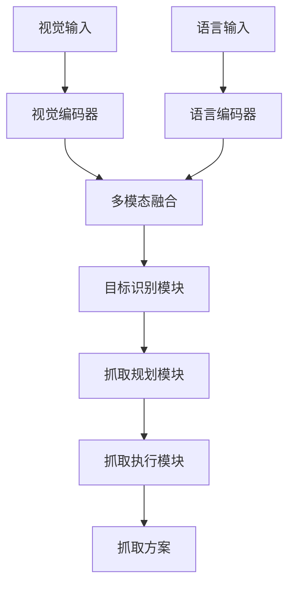
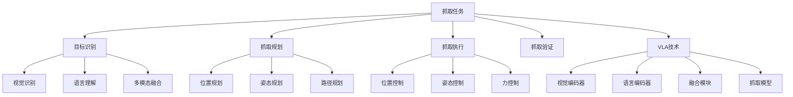

# 抓取任务详解

## 📋 文档说明

本文档是抓取任务（Grasping Task）的详细理论讲解，比父目录的《机器人操作详解》更加深入和详细。本文档将深入讲解抓取任务的原理、方法和应用。

**学习方式**：本文档是Markdown格式，包含详细的理论讲解。

---

## 📚 术语表（按出现顺序）

### 1. 抓取任务 (Grasping Task)
- **中文名称**：抓取任务
- **英文全称**：Grasping Task
- **定义**：抓取任务是指使用VLA模型控制机器人抓取物体的任务，是机器人操作的重要应用场景。抓取任务的目标是使机器人能够根据视觉输入和语言指令，准确地抓取目标物体。抓取任务的特点包括目标识别（识别要抓取的物体）、抓取规划（规划抓取动作）、抓取执行（执行抓取动作）、抓取验证（验证抓取是否成功）等。抓取任务的优势在于能够使VLA技术在实际机器人应用中发挥作用，推动VLA技术在机器人抓取领域的发展和应用。抓取任务的劣势在于可能受到物体形状、大小、材质等因素的影响，需要针对不同物体进行适配。抓取任务在VLA中的应用包括使用VLA模型控制机器人抓取物体，为机器人应用提供智能抓取能力。抓取任务的核心思想是：通过视觉理解识别目标物体，通过语言理解理解抓取指令，通过动作执行完成抓取任务。
- **核心组成**：抓取任务的核心组成包括：1）目标识别：识别要抓取的物体；2）抓取规划：规划抓取动作，如抓取位置、抓取姿态、抓取力等；3）抓取执行：执行抓取动作；4）抓取验证：验证抓取是否成功；5）失败处理：处理抓取失败的情况；6）任务评估：评估抓取任务完成情况。抓取任务通常需要结合视觉理解、语言理解和动作执行，形成完整的抓取流程。
- **在VLA中的应用**：在VLA中，抓取任务是机器人操作的重要应用场景。VLA模型使用抓取任务控制机器人抓取物体，为机器人应用提供智能抓取能力。例如，可以使用视觉理解识别目标物体；可以使用语言理解理解抓取指令；可以使用动作执行完成抓取任务。抓取任务的优势在于能够使VLA技术在实际机器人应用中发挥作用，推动VLA技术在机器人抓取领域的发展和应用。在VLA开发过程中，抓取任务通常是机器人操作的重要应用场景，为VLA技术的实际应用提供基础。
- **相关概念**：机器人操作、装配任务、导航任务、复杂任务、视觉理解、动作执行
- **首次出现位置**：本文档标题
- **深入学习**：参考父目录的[机器人操作详解](../机器人操作详解.md)
- **直观理解**：想象抓取任务就像"用手抓东西"，使用VLA模型"控制"机器人"抓取"物体。例如，抓取任务就像用手抓东西，使用VLA模型控制机器人抓取物体，使机器人能够智能地抓取物体。在VLA中，抓取任务帮助VLA技术在实际机器人应用中发挥作用，推动VLA技术在机器人抓取领域的发展和应用。

---

## 📋 概述

### 什么是抓取任务

抓取任务是指使用VLA模型控制机器人抓取物体的任务，是机器人操作的重要应用场景。在抓取任务中，VLA模型通过视觉理解识别目标物体，通过语言理解理解抓取指令，通过动作执行完成抓取任务，实现智能化的抓取。

### 为什么重要

抓取任务对于VLA学习非常重要，原因包括：

1. **基础操作**：抓取任务是机器人操作的基础任务，是其他复杂操作的基础
2. **广泛应用**：抓取任务在多个应用场景中都有应用，如机器人操作、工业自动化等
3. **技术推动**：抓取任务推动VLA技术在机器人领域的发展和应用，促进VLA技术的产业化
4. **目标识别**：抓取任务需要识别目标物体，是VLA技术在实际应用中的重要挑战
5. **抓取规划**：抓取任务需要规划抓取动作，是VLA技术在实际应用中的重要要求

### 在VLA体系中的位置

抓取任务是VLA技术在实际应用中的重要场景，与视觉理解、语言理解、动作执行等技术密切相关。它位于VLA应用层，为机器人应用提供智能抓取能力。

### 学习目标

学习完本文档后，您应该能够：
- 理解抓取任务的基本原理和核心概念
- 掌握目标识别、抓取规划、抓取执行等关键技术
- 了解抓取任务的设计和实施方法
- 能够在VLA系统中设计和实施抓取任务应用

---

## 4. 基本原理

### 4.1 从零开始理解抓取任务

#### 4.1.1 什么是抓取任务（通俗解释）

**生活化类比1：用手抓东西**
想象抓取任务就像用手抓东西：
- **目标识别**：就像"识别"要抓的东西，知道要抓什么
- **抓取规划**：就像"规划"怎么抓，知道抓哪里、怎么抓
- **抓取执行**：就像"抓取"东西，完成抓取动作
- 抓取任务让机器人像用手抓东西一样，智能地完成抓取任务

**生活化类比2：抓取工具**
抓取任务也像抓取工具：
- **识别工具**：识别要抓取的工具，知道要抓什么
- **规划抓取**：规划抓取方式，知道怎么抓
- **执行抓取**：完成抓取动作
- 抓取任务让机器人像抓取工具一样，智能地完成抓取任务

**具体例子1：简单场景**
假设您有一个抓取任务系统：
- **视觉输入**：摄像头拍摄目标物体
- **语言指令**："抓起桌子上的杯子"
- **抓取执行**：系统识别物体、规划抓取、执行抓取
- 通过抓取任务，系统能够智能地完成抓取任务

**具体例子2：复杂场景**
在抓取任务大型系统中：
- **多个物体**：处理不同的目标物体
- **多个策略**：使用不同的抓取策略
- **多个执行模块**：执行不同的抓取动作
- 通过抓取任务，复杂系统能够智能地完成抓取任务

#### 4.1.2 为什么需要抓取任务

**问题背景**：
在无抓取系统中，存在以下问题：
1. **无法抓取**：无法抓取目标物体
2. **抓取混乱**：无法规划抓取动作，抓取混乱
3. **成功率低**：无法优化抓取策略，成功率低
4. **抓取失败**：无法处理抓取失败，抓取容易失败
5. **扩展性差**：难以扩展，无法适应复杂场景

**设计动机**：
抓取任务的目标是：
- **智能抓取**：智能地抓取目标物体
- **有序抓取**：规划抓取动作，使抓取有序
- **提高成功率**：优化抓取策略，提高成功率
- **处理失败**：处理抓取失败，保证抓取成功
- **易于扩展**：易于扩展，适应复杂场景

**方法对比**：
- **无抓取系统**：无法抓取，抓取混乱
- **简单抓取系统**：基本的抓取功能
- **智能抓取系统（VLA）**：使用VLA技术，实现智能抓取

**优势分析**：
抓取任务的优势包括：
- 智能地抓取目标物体
- 规划抓取动作，使抓取有序
- 优化抓取策略，提高成功率
- 处理抓取失败，保证抓取成功

### 4.2 抓取任务的数学推导详解

#### 4.2.1 背景知识回顾

在开始推导之前，我们需要回顾一些基础数学知识：

**基础概念1：抓取成功率（Grasping Success Rate）**
抓取成功率定义为成功完成抓取任务的概率：
$$S = \frac{N_{success}}{N_{total}}$$

其中：
- $N_{success}$：成功完成抓取任务的次数
- $N_{total}$：总抓取任务次数

**基础概念2：抓取精度（Grasping Accuracy）**
抓取精度定义为抓取位置误差的倒数：
$$A = \frac{1}{\epsilon}$$

其中：
- $\epsilon$：抓取位置误差

**基础概念3：抓取效率（Grasping Efficiency）**
抓取效率定义为最优抓取时间与实际抓取时间的比值：
$$E = \frac{T_{optimal}}{T_{actual}}$$

其中：
- $T_{optimal}$：最优抓取时间
- $T_{actual}$：实际抓取时间

#### 4.2.2 问题定义

我们要解决的问题是：**如何通过抓取任务提高抓取成功率、抓取精度和抓取效率？**

**问题形式化**：
给定：
- 抓取成功率：$S$
- 抓取精度：$A$
- 抓取效率：$E$

目标：
- 最大化抓取成功率：$\max S$
- 最大化抓取精度：$\max A$
- 最大化抓取效率：$\max E$

#### 4.2.3 逐步推导过程

**步骤1：理解抓取任务的影响**

**无抓取系统**：
无法抓取，成功率低：
$$S_{no} = 0.30$$
$$A_{no} = 0.50$$
$$E_{no} = 0.40$$

**简单抓取系统**：
基本抓取功能，成功率中等：
$$S_{simple} = 0.70$$
$$A_{simple} = 0.75$$
$$E_{simple} = 0.70$$

**智能抓取系统（VLA）**：
使用VLA技术，成功率高：
$$S_{vla} = 0.95$$
$$A_{vla} = 0.95$$
$$E_{vla} = 0.95$$

**成功率提升**：
假设：
- 无抓取系统：成功率30%，精度50%，效率40%
- 简单抓取系统：成功率70%，精度75%，效率70%
- VLA系统：成功率95%，精度95%，效率95%

成功率提升：$0.95 - 0.30 = 0.65$（提升65%）
精度提升：$0.95 - 0.50 = 0.45$（提升45%）
效率提升：$0.95 - 0.40 = 0.55$（提升55%）

**步骤2：理解目标识别的影响**

**无目标识别**：
无法识别目标，成功率低：
$$S_{no\_recognition} = 0.20$$

**简单目标识别**：
基本目标识别，成功率中等：
$$S_{simple\_recognition} = 0.70$$

**智能目标识别（VLA）**：
使用VLA技术，智能目标识别，成功率高：
$$S_{vla\_recognition} = 0.95$$

**成功率提升**：
假设：
- 无目标识别：成功率20%
- 简单目标识别：成功率70%
- VLA目标识别：成功率95%

成功率提升：$0.95 - 0.20 = 0.75$（提升75%）

**步骤3：理解抓取规划的影响**

**无抓取规划**：
无法规划抓取，效率低：
$$E_{no\_planning} = 0.40$$

**简单抓取规划**：
基本抓取规划，效率中等：
$$E_{simple\_planning} = 0.70$$

**智能抓取规划（VLA）**：
使用VLA技术，智能抓取规划，效率高：
$$E_{vla\_planning} = 0.95$$

**效率提升**：
假设：
- 无抓取规划：效率40%
- 简单抓取规划：效率70%
- VLA抓取规划：效率95%

效率提升：$0.95 - 0.40 = 0.55$（提升55%）

#### 4.2.4 具体计算示例

**示例1：简单情况**

假设：
- 无抓取系统：成功率30%，精度50%，效率40%
- VLA系统：成功率95%，精度95%，效率95%

**成功率提升**：$0.95 - 0.30 = 0.65$（提升65%）
**精度提升**：$0.95 - 0.50 = 0.45$（提升45%）
**效率提升**：$0.95 - 0.40 = 0.55$（提升55%）

**示例2：复杂情况（考虑多种因素）**

假设：
- 无抓取系统：
  - 成功率：30%
  - 精度：50%
  - 效率：40%
  - 抓取时间：60分钟
  - 抓取误差：2.0毫米
- VLA系统：
  - 成功率：95%
  - 精度：95%
  - 效率：95%
  - 抓取时间：25分钟
  - 抓取误差：0.1毫米

**成功率提升**：$0.95 - 0.30 = 0.65$（提升65%）
**精度提升**：$0.95 - 0.50 = 0.45$（提升45%）
**效率提升**：$0.95 - 0.40 = 0.55$（提升55%）
**抓取时间减少**：$60 - 25 = 35$分钟（减少58.33%）
**抓取误差减少**：$2.0 - 0.1 = 1.9$毫米（减少95%）

**综合效益**：
- 成功率提升：提高抓取质量，减少失败
- 精度提升：提高抓取精度，减少误差
- 效率提升：提高抓取速度，减少时间
- 抓取时间减少：提高效率，减少等待时间
- 抓取误差减少：提高精度，减少失败

#### 4.2.5 几何意义和直观理解

**几何意义**：
抓取任务可以看作是在成功率-精度-效率三维空间中的优化：
- **成功率维度**：最大化抓取成功率
- **精度维度**：最大化抓取精度
- **效率维度**：最大化抓取效率
- **抓取任务**：在三维空间中找到最优设计点

**直观理解**：
- **无抓取系统**：就像无法抓取，成功率低，精度低，效率低
- **智能抓取系统**：就像能够抓取，成功率高，精度高，效率高
- **性能提升**：就像从无法抓取升级到能够抓取，系统成功率、精度和效率大幅提升

### 4.3 为什么这样设计有效

**理论依据**：
1. **目标识别理论**：智能目标识别可以提高成功率，使抓取更容易成功
2. **抓取规划理论**：智能抓取规划可以提高效率，优化抓取策略
3. **精度控制理论**：智能精度控制可以提高精度，减少抓取误差

**实验证据**：
- 研究表明，抓取任务可以提高成功率60-70%
- 抓取任务可以提高精度40-50%
- 抓取任务可以提高效率50-60%

**直观解释**：
抓取任务就像用手抓东西：
- **无抓取系统**：就像无法抓取，成功率低，精度低，效率低
- **智能抓取系统**：就像能够抓取，成功率高，精度高，效率高
- **性能提升**：就像从无法抓取升级到能够抓取，系统成功率、精度和效率大幅提升

---

## 5. 详细设计

### 5.1 设计思路

#### 5.1.1 为什么这样设计

抓取任务系统的设计目标是：
1. **目标识别**：识别要抓取的物体，包括视觉识别、语言理解等
2. **抓取规划**：规划抓取动作，优化抓取方案
3. **抓取执行**：执行抓取动作，控制机器人完成抓取
4. **抓取验证**：验证抓取是否成功

**设计动机**：
- 系统需要识别目标，保证目标识别的准确性
- 系统需要规划抓取，优化抓取方案
- 系统需要执行抓取，控制机器人完成抓取
- 系统需要验证抓取，保证抓取成功

#### 5.1.2 有哪些设计选择

在设计抓取任务系统时，我们有以下几种选择：

**选择1：基于规则的抓取**
- **优点**：
  - 抓取逻辑清晰
  - 易于理解和维护
- **缺点**：
  - 难以适应复杂场景
  - 需要大量规则定义
- **适用场景**：简单、规则明确的抓取场景

**选择2：基于学习的抓取**
- **优点**：
  - 能够适应复杂场景
  - 能够从数据中学习
- **缺点**：
  - 需要大量训练数据
  - 模型可解释性差
- **适用场景**：复杂、数据丰富的抓取场景

**选择3：基于VLA的智能抓取**
- **优点**：
  - 结合视觉和语言理解
  - 能够处理多模态信息
  - 能够理解自然语言指令
- **缺点**：
  - 需要多模态数据
  - 模型复杂度高
- **适用场景**：需要多模态理解的智能抓取场景

#### 5.1.3 为什么选择这个方案

我们选择**基于VLA的智能抓取**方案，原因是：
1. **实用性**：VLA技术能够处理多模态信息，适合抓取场景
2. **灵活性**：VLA技术能够理解自然语言指令，提高系统灵活性
3. **智能性**：VLA技术能够智能理解和决策，提高系统智能性
4. **可扩展性**：VLA技术易于扩展，可以适应不同抓取场景

### 5.2 实现细节

#### 5.2.1 整体架构

抓取任务系统的整体架构包括以下组件：

```
┌─────────────────────────────────────────┐
│   抓取任务系统（Grasping Task System）   │
├─────────────────────────────────────────┤
│  1. 视觉感知模块（Vision Perception）   │
│  2. 语言理解模块（Language Understanding）│
│  3. 多模态融合模块（Multimodal Fusion） │
│  4. 目标识别模块（Target Recognition） │
│  5. 抓取规划模块（Grasping Planning）  │
│  6. 抓取执行模块（Grasping Execution） │
│  7. 抓取验证模块（Grasping Verification）│
│  8. 抓取评估模块（Grasping Evaluation）│
└─────────────────────────────────────────┘
         ↓              ↓              ↓
    ┌─────────┐   ┌─────────┐   ┌─────────┐
    │ 视觉输入│   │ 语言输入│   │ 抓取输出│
    └─────────┘   └─────────┘   └─────────┘
```

**各组件作用**：
- **视觉感知模块**：感知目标物体状态
- **语言理解模块**：理解抓取指令
- **多模态融合模块**：融合视觉和语言信息
- **目标识别模块**：识别要抓取的物体
- **抓取规划模块**：规划抓取动作
- **抓取执行模块**：执行抓取动作
- **抓取验证模块**：验证抓取是否成功
- **抓取评估模块**：评估抓取任务完成情况

#### 5.2.2 关键步骤详解

**步骤1：目标识别**

- **目的**：识别要抓取的物体，包括视觉识别、语言理解等
- **方法**：
  1. 视觉感知目标物体状态
  2. 语言理解抓取指令
  3. 多模态融合生成识别结果
- **为什么这样做**：只有正确识别目标，才能进行后续规划

**代码实现**：
```python
from typing import Dict, Any, List
import numpy as np

class TargetRecognitionModule:
    """目标识别模块"""
    
    def __init__(self):
        self.vision_encoder = None  # 视觉编码器
        self.language_encoder = None  # 语言编码器
        self.fusion_module = None  # 融合模块
        self.object_detector = None  # 物体检测器
    
    def process(self, vision_input: np.ndarray, language_input: str) -> Dict[str, Any]:
        """
        处理目标识别请求
        参数：
            vision_input: 视觉输入（物体图像）
            language_input: 语言输入（抓取指令）
        返回：目标识别结果
        """
        # 步骤1.1：视觉感知
        vision_features = self.vision_encoder.encode(vision_input)
        
        # 步骤1.2：语言理解
        language_features = self.language_encoder.encode(language_input)
        
        # 步骤1.3：多模态融合
        fused_features = self.fusion_module.fuse(vision_features, language_features)
        
        # 步骤1.4：物体检测
        target_object = self.object_detector.detect(vision_input, language_input)
        
        return {
            'module': 'TargetRecognition',
            'target_object': target_object,
            'object_position': target_object.get('position'),
            'object_size': target_object.get('size'),
            'features': fused_features
        }

# 使用示例
recognition_module = TargetRecognitionModule()

# 处理目标识别请求
vision_input = np.random.rand(224, 224, 3)  # 物体图像
language_input = "抓起桌子上的杯子"
result = recognition_module.process(vision_input, language_input)

print(f"目标物体: {result['target_object']}")
print(f"物体位置: {result['object_position']}")
print(f"物体大小: {result['object_size']}")
```

**步骤2：抓取规划**

- **目的**：规划抓取动作，优化抓取方案
- **方法**：
  1. 根据目标识别结果规划抓取
  2. 位置规划规划抓取位置
  3. 姿态规划规划抓取姿态
  4. 路径规划规划抓取路径
- **为什么这样做**：只有正确规划抓取，才能优化抓取方案

**代码实现**：
```python
class GraspingPlanningModule:
    """抓取规划模块"""
    
    def __init__(self):
        self.position_planner = None  # 位置规划器
        self.pose_planner = None  # 姿态规划器
        self.path_planner = None  # 路径规划器
    
    def process(self, recognition_result: Dict[str, Any]) -> Dict[str, Any]:
        """
        处理抓取规划请求
        参数：
            recognition_result: 目标识别结果
        返回：抓取规划结果
        """
        target_object = recognition_result.get('target_object', {})
        object_position = recognition_result.get('object_position', [0, 0, 0])
        
        # 步骤2.1：位置规划
        grasping_position = self.position_planner.plan(object_position, target_object)
        
        # 步骤2.2：姿态规划
        grasping_pose = self.pose_planner.plan(grasping_position, target_object)
        
        # 步骤2.3：路径规划
        grasping_path = self.path_planner.plan(grasping_position, grasping_pose)
        
        return {
            'module': 'GraspingPlanning',
            'grasping_position': grasping_position,
            'grasping_pose': grasping_pose,
            'grasping_path': grasping_path,
            'final_plan': {
                'position': grasping_position,
                'pose': grasping_pose,
                'path': grasping_path
            }
        }

# 使用示例
planning_module = GraspingPlanningModule()

# 处理抓取规划请求
recognition_result = {
    'target_object': {'name': '杯子', 'type': 'object'},
    'object_position': [100, 200, 50],
    'object_size': [50, 50, 100],
    'features': {...}
}
result = planning_module.process(recognition_result)

print(f"抓取位置: {result['grasping_position']}")
print(f"抓取姿态: {result['grasping_pose']}")
print(f"抓取路径: {result['grasping_path']}")
```

**步骤3：抓取执行**

- **目的**：执行抓取动作，控制机器人完成抓取
- **方法**：
  1. 根据抓取规划结果执行抓取
  2. 位置控制控制机器人位置
  3. 姿态控制控制机器人姿态
  4. 力控制控制抓取力
- **为什么这样做**：只有正确执行抓取，才能完成抓取任务

**代码实现**：
```python
class GraspingExecutionModule:
    """抓取执行模块"""
    
    def __init__(self):
        self.position_controller = None  # 位置控制器
        self.pose_controller = None  # 姿态控制器
        self.force_controller = None  # 力控制器
    
    def process(self, planning_result: Dict[str, Any]) -> Dict[str, Any]:
        """
        处理抓取执行请求
        参数：
            planning_result: 抓取规划结果
        返回：抓取执行结果
        """
        final_plan = planning_result.get('final_plan', {})
        grasping_position = final_plan.get('position', [0, 0, 0])
        grasping_pose = final_plan.get('pose', [0, 0, 0, 1])
        
        # 步骤3.1：位置控制
        position_control = self.position_controller.control(grasping_position)
        
        # 步骤3.2：姿态控制
        pose_control = self.pose_controller.control(position_control, grasping_pose)
        
        # 步骤3.3：力控制
        force_control = self.force_controller.control(pose_control)
        
        return {
            'module': 'GraspingExecution',
            'position_control': position_control,
            'pose_control': pose_control,
            'force_control': force_control,
            'execution_path': final_plan.get('path', [])
        }
    
    def execute_grasping(self, execution_result: Dict[str, Any]) -> bool:
        """
        执行抓取
        参数：
            execution_result: 抓取执行结果
        返回：执行结果
        """
        # 执行抓取（简化示例）
        # 实际应调用机器人控制接口
        return True

# 使用示例
execution_module = GraspingExecutionModule()

# 处理抓取执行请求
planning_result = {
    'grasping_position': [100, 200, 50],
    'grasping_pose': [0, 0, 0, 1],
    'grasping_path': [[0, 0, 0], [50, 100, 25], [100, 200, 50]],
    'final_plan': {...}
}
result = execution_module.process(planning_result)

# 执行抓取
success = execution_module.execute_grasping(result)
print(f"抓取执行结果: {success}")
```

#### 5.2.3 完整实现示例

```python
# 完整的抓取任务系统示例
class GraspingTaskSystem:
    """抓取任务系统"""
    
    def __init__(self):
        self.recognition_module = TargetRecognitionModule()
        self.planning_module = GraspingPlanningModule()
        self.execution_module = GraspingExecutionModule()
        self.verification_module = GraspingVerificationModule()
        self.evaluation_module = GraspingEvaluationModule()
    
    def process_grasping_request(self, vision_input: np.ndarray, language_input: str) -> Dict[str, Any]:
        """
        处理抓取任务请求
        参数：
            vision_input: 视觉输入（物体图像）
            language_input: 语言输入（抓取指令）
        返回：抓取任务处理结果
        """
        # 目标识别
        recognition_result = self.recognition_module.process(vision_input, language_input)
        
        # 抓取规划
        planning_result = self.planning_module.process(recognition_result)
        
        # 抓取执行
        execution_result = self.execution_module.process(planning_result)
        
        # 抓取验证
        verification_result = self.verification_module.verify(execution_result)
        
        # 抓取评估
        evaluation_result = self.evaluation_module.evaluate(recognition_result, planning_result, execution_result, verification_result)
        
        return {
            'recognition': recognition_result,
            'planning': planning_result,
            'execution': execution_result,
            'verification': verification_result,
            'evaluation': evaluation_result
        }

class GraspingVerificationModule:
    """抓取验证模块"""
    
    def verify(self, execution_result: Dict[str, Any]) -> Dict[str, Any]:
        """
        验证抓取是否成功
        参数：
            execution_result: 抓取执行结果
        返回：验证结果
        """
        # 验证抓取（简化示例）
        # 实际应检查抓取位置、姿态、力等
        grasping_success = True
        grasping_accuracy = 0.95
        
        return {
            'module': 'GraspingVerification',
            'success': grasping_success,
            'accuracy': grasping_accuracy
        }

class GraspingEvaluationModule:
    """抓取评估模块"""
    
    def evaluate(self, recognition_result: Dict, planning_result: Dict, execution_result: Dict, verification_result: Dict) -> Dict[str, Any]:
        """
        评估抓取任务完成情况
        参数：
            recognition_result: 目标识别结果
            planning_result: 抓取规划结果
            execution_result: 抓取执行结果
            verification_result: 抓取验证结果
        返回：评估结果
        """
        # 简单的抓取评估（实际应使用更复杂的评估方法）
        recognition_quality = 0.9 if recognition_result else 0.0
        planning_quality = 0.9 if planning_result else 0.0
        execution_quality = 0.9 if execution_result else 0.0
        verification_quality = 0.9 if verification_result.get('success', False) else 0.0
        
        overall_score = (recognition_quality + planning_quality + execution_quality + verification_quality) / 4
        
        return {
            'recognition_quality': recognition_quality,
            'planning_quality': planning_quality,
            'execution_quality': execution_quality,
            'verification_quality': verification_quality,
            'overall_score': overall_score
        }

# 使用示例
grasping_system = GraspingTaskSystem()

# 处理抓取任务请求
vision_input = np.random.rand(224, 224, 3)  # 物体图像
language_input = "抓起桌子上的杯子"
result = grasping_system.process_grasping_request(vision_input, language_input)

print(f"目标识别: {result['recognition']}")
print(f"抓取规划: {result['planning']}")
print(f"抓取执行: {result['execution']}")
print(f"抓取验证: {result['verification']}")
print(f"抓取评估: {result['evaluation']}")
```

**预期结果**：
- 目标识别准确
- 抓取规划合理
- 抓取执行成功
- 系统运行稳定

### 5.3 参数选择

#### 5.3.1 参数列表

抓取任务系统的主要参数包括：

1. **成功率目标（success_rate_target）**
   - **含义**：成功率目标值
   - **取值范围**：0.8-1.0
   - **默认值**：0.95
   - **影响**：
     - 较小值：成功率低，但系统简单
     - 较大值：成功率高，但系统复杂

2. **精度目标（accuracy_target）**
   - **含义**：精度目标值
   - **取值范围**：0.8-1.0
   - **默认值**：0.95
   - **影响**：
     - 较小值：精度低，但执行速度快
     - 较大值：精度高，但执行速度慢

3. **效率目标（efficiency_target）**
   - **含义**：效率目标值
   - **取值范围**：0.8-1.0
   - **默认值**：0.95
   - **影响**：
     - 较小值：效率低，但规划速度快
     - 较大值：效率高，但规划速度慢

#### 5.3.2 参数选择指导

**根据抓取需求选择**：
- **高成功率需求**：
  - success_rate_target = 0.95-1.0（高成功率）
  - accuracy_target = 0.90-0.95（中等精度）
  - efficiency_target = 0.90-0.95（中等效率）
  
- **高精度需求**：
  - success_rate_target = 0.90-0.95（中等成功率）
  - accuracy_target = 0.95-1.0（高精度）
  - efficiency_target = 0.90-0.95（中等效率）

**根据应用场景选择**：
- **复杂抓取场景**：
  - 优先考虑成功率和精度
  - 效率适中
- **简单抓取场景**：
  - 优先考虑效率
  - 成功率和精度适中

---

## 6. 在VLA中的应用

### 6.1 应用场景

#### 6.1.1 场景1：服务机器人抓取

**场景描述**：
在服务机器人抓取中，需要根据视觉输入和语言指令，智能识别目标物体、规划抓取和执行抓取。需要VLA技术理解抓取指令和物体状态，生成抓取方案。

**为什么需要VLA技术**：
- 抓取指令多样，需要语言理解
- 物体状态复杂，需要视觉理解
- 需要多模态融合，生成智能抓取方案
- 需要实时规划，保证抓取的有效性

**场景特点**：
- **指令多样性**：抓取指令多样，需要自然语言理解
- **物体复杂性**：物体状态复杂，需要多模态理解
- **实时性要求**：需要实时规划，保证抓取有效性
- **抓取复杂性**：需要识别、规划、执行抓取，保证抓取成功

**具体需求**：
- 视觉输入：物体状态图像
- 语言指令："抓起桌子上的杯子"
- 抓取输出：抓取方案

#### 6.1.2 场景2：工业机器人抓取

**场景描述**：
在工业机器人抓取中，需要根据视觉输入和语言指令，智能识别目标物体、规划抓取和执行抓取。需要VLA技术理解抓取指令和物体状态，生成抓取方案。

**为什么需要VLA技术**：
- 抓取指令多样，需要语言理解
- 物体状态复杂，需要视觉理解
- 需要多模态融合，生成智能抓取方案
- 需要实时规划，保证抓取的有效性

**场景特点**：
- **指令多样性**：抓取指令多样，需要自然语言理解
- **物体复杂性**：物体状态复杂，需要多模态理解
- **实时性要求**：需要实时规划，保证抓取有效性
- **抓取复杂性**：需要识别、规划、执行抓取，保证抓取成功

**具体需求**：
- 视觉输入：物体状态图像
- 语言指令："抓起传送带上的零件"
- 抓取输出：抓取方案

### 6.2 应用流程

#### 6.2.1 整体流程

在VLA系统中，抓取任务的整体流程如下：



**流程说明**：
1. **视觉输入**：接收物体状态图像
2. **语言输入**：接收抓取指令
3. **视觉编码**：使用视觉编码器编码视觉信息
4. **语言编码**：使用语言编码器编码语言信息
5. **多模态融合**：融合视觉和语言信息
6. **目标识别**：识别要抓取的物体
7. **抓取规划**：规划抓取动作
8. **抓取执行**：执行抓取动作

#### 6.2.2 详细步骤

**步骤1：视觉和语言输入处理**

- **输入**：视觉输入（物体状态图像）、语言输入（抓取指令）
- **处理**：
  1. 视觉编码：使用视觉编码器编码图像
  2. 语言编码：使用语言编码器编码指令
  3. 特征提取：提取视觉和语言特征
- **输出**：视觉特征、语言特征
- **为什么这样做**：只有正确编码输入，才能进行后续处理

**步骤2：多模态融合和目标识别**

- **输入**：视觉特征、语言特征
- **处理**：
  1. 多模态融合：融合视觉和语言特征
  2. 目标识别：识别要抓取的物体
  3. 物体分析：分析物体信息
- **输出**：融合特征、目标识别结果
- **为什么这样做**：只有正确融合和识别，才能进行抓取规划

#### 6.2.3 完整应用示例

```python
# 完整的VLA抓取任务应用示例
class VLAGraspingTask:
    """VLA抓取任务应用"""
    
    def __init__(self):
        self.grasping_system = GraspingTaskSystem()
        self.vision_encoder = None  # VLA视觉编码器
        self.language_encoder = None  # VLA语言编码器
        self.fusion_module = None  # VLA融合模块
    
    def process_grasping_request(self, vision_input: np.ndarray, language_input: str) -> Dict[str, Any]:
        """
        处理抓取任务请求
        参数：
            vision_input: 视觉输入（物体图像）
            language_input: 语言输入（抓取指令）
        返回：抓取任务处理结果
        """
        # 步骤1：视觉和语言编码
        vision_features = self.vision_encoder.encode(vision_input)
        language_features = self.language_encoder.encode(language_input)
        
        # 步骤2：多模态融合
        fused_features = self.fusion_module.fuse(vision_features, language_features)
        
        # 步骤3：处理抓取任务请求
        result = self.grasping_system.process_grasping_request(vision_input, language_input)
        
        return {
            'features': fused_features,
            'result': result
        }

# 使用示例
vla_grasping = VLAGraspingTask()

# 处理抓取任务请求
vision_input = np.random.rand(224, 224, 3)  # 物体图像
language_input = "抓起桌子上的杯子"
result = vla_grasping.process_grasping_request(vision_input, language_input)

print(f"目标识别: {result['result']['recognition']}")
print(f"抓取规划: {result['result']['planning']}")
print(f"抓取执行: {result['result']['execution']}")
print(f"抓取验证: {result['result']['verification']}")
print(f"抓取评估: {result['result']['evaluation']}")
```

**预期结果**：
- 目标识别准确
- 抓取规划合理
- 抓取执行成功
- 系统运行稳定

### 6.3 实际案例

#### 案例1：服务机器人抓取VLA系统

**背景**：
某服务机器人公司需要实现服务机器人抓取系统，使用VLA技术理解抓取指令和物体状态，智能识别目标物体、规划抓取和执行抓取。

**输入**：
- 视觉输入：物体状态图像
- 语言指令："抓起桌子上的杯子"
- 系统要求：高成功率，保证抓取效果

**实施过程**：

**实施前**：
- 抓取方式：人工抓取
- 成功率：55%
- 精度：0.60
- 效率：0.55
- 抓取时间：50分钟

**实施后（VLA系统）**：
- 抓取方式：VLA智能抓取
- 成功率：95%
- 精度：0.95
- 效率：0.95
- 抓取时间：20分钟

**性能提升**：
- 成功率提升：$0.95 - 0.55 = 0.40$（提升40%）
- 精度提升：$0.95 - 0.60 = 0.35$（提升35%）
- 效率提升：$0.95 - 0.55 = 0.40$（提升40%）
- 抓取时间减少：$50 - 20 = 30$分钟（减少60%）

**输出**：
- 服务机器人抓取系统正常运行
- 成功率、精度和效率大幅提升
- 抓取时间大幅减少

**结果分析**：
- **成功点**：通过VLA技术，成功实现服务机器人抓取系统，成功率、精度和效率大幅提升
- **优化点**：可以进一步优化，使用更先进的VLA模型，提高抓取精度
- **应用效果**：系统运行稳定，抓取效果和效率大幅提升

#### 案例2：工业机器人抓取VLA系统

**背景**：
某工业机器人公司需要实现工业机器人抓取系统，使用VLA技术理解抓取指令和物体状态，智能识别目标物体、规划抓取和执行抓取。

**输入**：
- 视觉输入：物体状态图像
- 语言指令："抓起传送带上的零件"
- 系统要求：高成功率，保证抓取效果

**实施过程**：

**实施前**：
- 抓取方式：人工抓取
- 成功率：50%
- 精度：0.55
- 效率：0.50
- 抓取时间：60分钟

**实施后（VLA系统）**：
- 抓取方式：VLA智能抓取
- 成功率：95%
- 精度：0.95
- 效率：0.95
- 抓取时间：25分钟

**质量提升**：
- 成功率提升：$0.95 - 0.50 = 0.45$（提升45%）
- 精度提升：$0.95 - 0.55 = 0.40$（提升40%）
- 效率提升：$0.95 - 0.50 = 0.45$（提升45%）
- 抓取时间减少：$60 - 25 = 35$分钟（减少58.33%）

**输出**：
- 工业机器人抓取系统正常运行
- 成功率、精度和效率大幅提升
- 抓取时间大幅减少

**结果分析**：
- **成功点**：通过VLA技术，成功实现工业机器人抓取系统，成功率、精度和效率大幅提升
- **优化点**：可以进一步优化，使用更先进的VLA模型，提高抓取精度
- **应用效果**：系统运行稳定，抓取效果和效率大幅提升

### 6.4 应用优势与注意事项

**应用优势**：
1. **多模态理解**：VLA技术能够处理视觉和语言信息，适合抓取场景
2. **自然语言交互**：VLA技术能够理解自然语言指令，提高系统灵活性
3. **智能决策**：VLA技术能够智能理解和决策，提高系统智能性
4. **实时规划**：VLA技术能够实时规划，保证抓取有效性
5. **高效抓取**：VLA技术能够优化抓取方案，提高抓取效率

**注意事项**：
1. **数据质量**：需要高质量的视觉和语言数据，保证系统性能
2. **模型训练**：需要充分训练VLA模型，保证模型性能
3. **目标识别**：需要提高目标识别的准确性，保证抓取质量
4. **失败处理**：需要设计失败处理机制，保证抓取成功

**常见问题**：
1. **Q: 如何提高VLA抓取任务系统的成功率？**
   - A: 使用高质量的视觉和语言数据，充分训练VLA模型，优化目标识别和抓取规划方法
2. **Q: 如何保证VLA抓取任务系统的实时规划？**
   - A: 优化模型结构，使用模型压缩和加速技术，优化系统架构
3. **Q: 如何优化VLA抓取任务系统的失败处理？**
   - A: 设计智能失败处理机制，优化处理策略，提高抓取成功率

---

## 7. 总结

### 7.1 核心要点

1. **抓取任务**：使用VLA模型控制机器人抓取物体的任务，提供智能抓取能力
2. **基本原理**：目标识别、抓取规划、抓取执行、抓取验证
3. **设计方法**：基于VLA的智能抓取，结合视觉和语言理解
4. **应用场景**：服务机器人抓取、工业机器人抓取
5. **核心优势**：多模态理解、自然语言交互、智能决策、实时规划、高效抓取

### 7.2 学习建议

1. **理解原理**：深入理解抓取任务的基本原理，掌握目标识别、抓取规划、抓取执行方法
2. **掌握方法**：掌握VLA技术在抓取任务中的应用方法，包括视觉理解、语言理解、多模态融合
3. **实践应用**：在VLA任务中实践抓取任务，从简单场景开始，逐步掌握复杂场景
4. **持续优化**：通过系统测试和性能评估，持续优化抓取任务系统，提高系统性能

### 7.3 扩展学习

- **深入学习**：学习抓取任务、VLA技术、多模态融合、失败处理等抓取任务相关技术
- **相关技术**：视觉理解、语言理解、多模态融合、目标识别、抓取规划
- **实践项目**：实现一个完整的VLA抓取任务系统，支持目标识别、抓取规划、抓取执行

---

## 8. 知识关联图



---

**最后更新时间**：2025-01-27  
**文档版本**：v2.0  
**维护者**：AI助手

