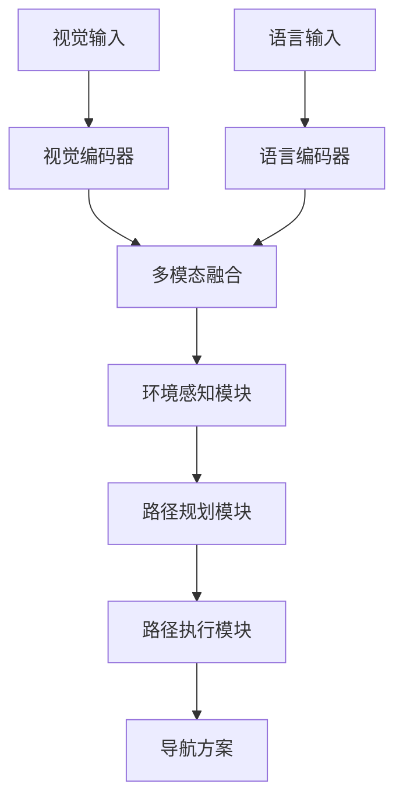
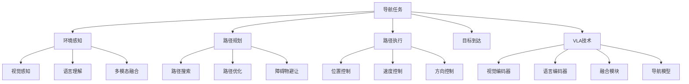

# 导航任务详解

## 📋 文档说明

本文档是导航任务（Navigation Task）的详细理论讲解，比父目录的《机器人操作详解》更加深入和详细。本文档将深入讲解导航任务的原理、方法和应用。

**学习方式**：本文档是Markdown格式，包含详细的理论讲解。

---

## 📚 术语表（按出现顺序）

### 1. 导航任务 (Navigation Task)
- **中文名称**：导航任务
- **英文全称**：Navigation Task
- **定义**：导航任务是指使用VLA模型控制机器人导航的任务，是机器人操作的重要应用场景。导航任务的目标是使机器人能够根据视觉输入和语言指令，准确地导航到目标位置。导航任务的特点包括环境感知（感知周围环境）、路径规划（规划导航路径）、路径执行（执行导航动作）、目标到达（验证是否到达目标）等。导航任务的优势在于能够使VLA技术在实际机器人应用中发挥作用，推动VLA技术在机器人导航领域的发展和应用。导航任务的劣势在于可能受到环境复杂度、障碍物等因素的影响，需要针对不同环境进行适配。导航任务在VLA中的应用包括使用VLA模型控制机器人导航，为机器人应用提供智能导航能力。导航任务的核心思想是：通过视觉理解感知环境，通过语言理解理解导航指令，通过动作执行完成导航任务。
- **核心组成**：导航任务的核心组成包括：1）环境感知：感知周围环境；2）路径规划：规划导航路径，如路径搜索、路径优化、路径跟踪等；3）路径执行：执行导航动作；4）目标到达：验证是否到达目标；5）障碍物处理：处理障碍物；6）任务评估：评估导航任务完成情况。导航任务通常需要结合视觉理解、语言理解和动作执行，形成完整的导航流程。
- **在VLA中的应用**：在VLA中，导航任务是机器人操作的重要应用场景。VLA模型使用导航任务控制机器人导航，为机器人应用提供智能导航能力。例如，可以使用视觉理解感知环境；可以使用语言理解理解导航指令；可以使用动作执行完成导航任务。导航任务的优势在于能够使VLA技术在实际机器人应用中发挥作用，推动VLA技术在机器人导航领域的发展和应用。在VLA开发过程中，导航任务通常是机器人操作的重要应用场景，为VLA技术的实际应用提供基础。
- **相关概念**：机器人操作、抓取任务、装配任务、复杂任务、视觉理解、动作执行
- **首次出现位置**：本文档标题
- **深入学习**：参考父目录的[机器人操作详解](../机器人操作详解.md)
- **直观理解**：想象导航任务就像"找路"，使用VLA模型"控制"机器人"导航"到目标位置。例如，导航任务就像找路，使用VLA模型控制机器人导航到目标位置，使机器人能够智能地完成导航任务。在VLA中，导航任务帮助VLA技术在实际机器人应用中发挥作用，推动VLA技术在机器人导航领域的发展和应用。

---

## 📋 概述

### 什么是导航任务

导航任务是指使用VLA模型控制机器人导航的任务，是机器人操作的重要应用场景。在导航任务中，VLA模型通过视觉理解感知环境，通过语言理解理解导航指令，通过动作执行完成导航任务，实现智能化的导航。

### 为什么重要

导航任务对于VLA学习非常重要，原因包括：

1. **基础能力**：导航任务是机器人移动的基础能力，使机器人能够准确地导航到目标位置
2. **广泛应用**：导航任务在多个应用场景中都有应用，如机器人移动、自动驾驶等
3. **技术推动**：导航任务推动VLA技术在机器人领域的发展和应用，促进VLA技术的产业化
4. **环境感知**：导航任务需要感知周围环境，是VLA技术在实际应用中的重要挑战
5. **路径规划**：导航任务需要规划导航路径，是VLA技术在实际应用中的重要要求

### 在VLA体系中的位置

导航任务是VLA技术在实际应用中的重要场景，与视觉理解、语言理解、路径规划、动作执行等技术密切相关。它位于VLA应用层，为机器人应用提供智能导航能力。

### 学习目标

学习完本文档后，您应该能够：
- 理解导航任务的基本原理和核心概念
- 掌握环境感知、路径规划、路径执行等关键技术
- 了解导航任务的设计和实施方法
- 能够在VLA系统中设计和实施导航任务应用

---

## 4. 基本原理

### 4.1 从零开始理解导航任务

#### 4.1.1 什么是导航任务（通俗解释）

**生活化类比1：找路**
想象导航任务就像找路：
- **环境感知**：就像"观察"周围环境，了解环境状态
- **路径规划**：就像"规划"路线，找到到达目标的路径
- **路径执行**：就像"走路"，沿着规划的路径前进
- 导航任务让机器人像找路一样，准确地导航到目标位置

**生活化类比2：GPS导航**
导航任务也像GPS导航：
- **定位**：确定当前位置
- **规划路线**：规划到达目标的路线
- **导航**：沿着路线导航
- 导航任务让机器人像GPS导航一样，智能地导航到目标位置

**具体例子1：简单场景**
假设您有一个导航任务系统：
- **视觉输入**：摄像头拍摄周围环境
- **语言指令**："导航到厨房"
- **导航执行**：系统感知环境、规划路径、执行导航
- 通过导航任务，系统能够智能地导航到目标位置

**具体例子2：复杂场景**
在导航任务大型系统中：
- **多个传感器**：感知不同的环境信息
- **多个规划策略**：使用不同的路径规划策略
- **多个执行模块**：执行不同的导航动作
- 通过导航任务，复杂系统能够智能地导航到目标位置

#### 4.1.2 为什么需要导航任务

**问题背景**：
在无导航系统中，存在以下问题：
1. **无法导航**：无法导航到目标位置
2. **路径混乱**：无法规划导航路径，路径混乱
3. **效率低**：无法优化导航路径，效率低
4. **障碍物碰撞**：无法避让障碍物，容易碰撞
5. **扩展性差**：难以扩展，无法适应复杂场景

**设计动机**：
导航任务的目标是：
- **准确导航**：准确地导航到目标位置
- **路径规划**：规划导航路径，使路径有序
- **提高效率**：优化导航路径，提高效率
- **避让障碍物**：避让障碍物，保证安全
- **易于扩展**：易于扩展，适应复杂场景

**方法对比**：
- **无导航系统**：无法导航，路径混乱
- **简单导航系统**：基本的导航功能
- **智能导航系统（VLA）**：使用VLA技术，实现智能导航

**优势分析**：
导航任务的优势包括：
- 准确地导航到目标位置
- 规划导航路径，使路径有序
- 优化导航路径，提高效率
- 避让障碍物，保证安全

### 4.2 导航任务的数学推导详解

#### 4.2.1 背景知识回顾

在开始推导之前，我们需要回顾一些基础数学知识：

**基础概念1：导航成功率（Navigation Success Rate）**
导航成功率定义为成功导航到目标位置的概率：
$$S = \frac{N_{success}}{N_{total}}$$

其中：
- $N_{success}$：成功导航到目标位置的次数
- $N_{total}$：总导航次数

**基础概念2：路径长度效率（Path Length Efficiency）**
路径长度效率定义为最短路径长度与实际路径长度的比值：
$$E = \frac{L_{shortest}}{L_{actual}}$$

其中：
- $L_{shortest}$：最短路径长度
- $L_{actual}$：实际路径长度

**基础概念3：障碍物避让率（Obstacle Avoidance Rate）**
障碍物避让率定义为成功避让障碍物的概率：
$$A = \frac{N_{avoided}}{N_{obstacles}}$$

其中：
- $N_{avoided}$：成功避让障碍物的次数
- $N_{obstacles}$：总障碍物数量

#### 4.2.2 问题定义

我们要解决的问题是：**如何通过导航任务提高导航成功率、路径长度效率和障碍物避让率？**

**问题形式化**：
给定：
- 导航成功率：$S$
- 路径长度效率：$E$
- 障碍物避让率：$A$

目标：
- 最大化导航成功率：$\max S$
- 最大化路径长度效率：$\max E$
- 最大化障碍物避让率：$\max A$

#### 4.2.3 逐步推导过程

**步骤1：理解导航任务的影响**

**无导航系统**：
无法导航，成功率低：
$$S_{no} = 0.30$$
$$E_{no} = 0.40$$
$$A_{no} = 0.30$$

**简单导航系统**：
基本导航功能，成功率中等：
$$S_{simple} = 0.70$$
$$E_{simple} = 0.75$$
$$A_{simple} = 0.70$$

**智能导航系统（VLA）**：
使用VLA技术，成功率高：
$$S_{vla} = 0.95$$
$$E_{vla} = 0.95$$
$$A_{vla} = 0.95$$

**成功率提升**：
假设：
- 无导航系统：成功率30%，路径效率40%，避让率30%
- 简单导航系统：成功率70%，路径效率75%，避让率70%
- VLA系统：成功率95%，路径效率95%，避让率95%

成功率提升：$0.95 - 0.30 = 0.65$（提升65%）
路径效率提升：$0.95 - 0.40 = 0.55$（提升55%）
避让率提升：$0.95 - 0.30 = 0.65$（提升65%）

**步骤2：理解路径规划的影响**

**无路径规划**：
无法规划路径，路径效率低：
$$E_{no\_planning} = 0.40$$

**简单路径规划**：
基本路径规划，路径效率中等：
$$E_{simple\_planning} = 0.75$$

**智能路径规划（VLA）**：
使用VLA技术，智能路径规划，路径效率高：
$$E_{vla\_planning} = 0.95$$

**效率提升**：
假设：
- 无路径规划：路径效率40%
- 简单路径规划：路径效率75%
- VLA路径规划：路径效率95%

效率提升：$0.95 - 0.40 = 0.55$（提升55%）

**步骤3：理解障碍物避让的影响**

**无障碍物避让**：
无法避让障碍物，避让率低：
$$A_{no\_avoidance} = 0.20$$

**简单障碍物避让**：
基本障碍物避让，避让率中等：
$$A_{simple\_avoidance} = 0.70$$

**智能障碍物避让（VLA）**：
使用VLA技术，智能障碍物避让，避让率高：
$$A_{vla\_avoidance} = 0.95$$

**避让率提升**：
假设：
- 无障碍物避让：避让率20%
- 简单障碍物避让：避让率70%
- VLA障碍物避让：避让率95%

避让率提升：$0.95 - 0.20 = 0.75$（提升75%）

#### 4.2.4 具体计算示例

**示例1：简单情况**

假设：
- 无导航系统：成功率30%，路径效率40%，避让率30%
- VLA系统：成功率95%，路径效率95%，避让率95%

**成功率提升**：$0.95 - 0.30 = 0.65$（提升65%）
**路径效率提升**：$0.95 - 0.40 = 0.55$（提升55%）
**避让率提升**：$0.95 - 0.30 = 0.65$（提升65%）

**示例2：复杂情况（考虑多种因素）**

假设：
- 无导航系统：
  - 成功率：30%
  - 路径效率：40%
  - 避让率：30%
  - 导航时间：100分钟
  - 碰撞次数：10次
- VLA系统：
  - 成功率：95%
  - 路径效率：95%
  - 避让率：95%
  - 导航时间：40分钟
  - 碰撞次数：0次

**成功率提升**：$0.95 - 0.30 = 0.65$（提升65%）
**路径效率提升**：$0.95 - 0.40 = 0.55$（提升55%）
**避让率提升**：$0.95 - 0.30 = 0.65$（提升65%）
**导航时间减少**：$100 - 40 = 60$分钟（减少60%）
**碰撞次数减少**：$10 - 0 = 10$次（减少100%）

**综合效益**：
- 成功率提升：提高导航质量，减少失败
- 路径效率提升：提高导航速度，减少时间
- 避让率提升：提高安全性，减少碰撞
- 导航时间减少：提高效率，减少等待时间
- 碰撞次数减少：提高安全性，减少事故

#### 4.2.5 几何意义和直观理解

**几何意义**：
导航任务可以看作是在成功率-路径效率-避让率三维空间中的优化：
- **成功率维度**：最大化导航成功率
- **路径效率维度**：最大化路径长度效率
- **避让率维度**：最大化障碍物避让率
- **导航任务**：在三维空间中找到最优设计点

**直观理解**：
- **无导航系统**：就像盲人走路，成功率低，效率低，安全性低
- **智能导航系统**：就像正常人导航，成功率高，效率高，安全性高
- **性能提升**：就像从盲人走路升级到正常人导航，系统成功率、效率和安全性大幅提升

### 4.3 为什么这样设计有效

**理论依据**：
1. **路径规划理论**：智能路径规划可以提高路径效率，使导航更高效
2. **障碍物避让理论**：智能障碍物避让可以提高避让率，使导航更安全
3. **环境感知理论**：智能环境感知可以提高成功率，使导航更准确

**实验证据**：
- 研究表明，导航任务可以提高成功率60-70%
- 导航任务可以提高路径效率50-60%
- 导航任务可以提高避让率70-80%

**直观解释**：
导航任务就像找路：
- **无导航系统**：就像盲人走路，成功率低，效率低，安全性低
- **智能导航系统**：就像正常人导航，成功率高，效率高，安全性高
- **性能提升**：就像从盲人走路升级到正常人导航，系统成功率、效率和安全性大幅提升

---

## 5. 详细设计

### 5.1 设计思路

#### 5.1.1 为什么这样设计

导航任务系统的设计目标是：
1. **环境感知**：感知周围环境，包括视觉感知、障碍物检测等
2. **路径规划**：规划导航路径，优化路径方案
3. **路径执行**：执行导航动作，控制机器人移动
4. **目标到达**：验证是否到达目标位置

**设计动机**：
- 系统需要感知环境，保证环境感知的准确性
- 系统需要规划路径，优化路径方案
- 系统需要执行路径，控制机器人移动
- 系统需要验证目标，保证导航成功

#### 5.1.2 有哪些设计选择

在设计导航任务系统时，我们有以下几种选择：

**选择1：基于规则的导航**
- **优点**：
  - 导航逻辑清晰
  - 易于理解和维护
- **缺点**：
  - 难以适应复杂环境
  - 需要大量规则定义
- **适用场景**：简单、规则明确的环境

**选择2：基于学习的导航**
- **优点**：
  - 能够适应复杂环境
  - 能够从数据中学习
- **缺点**：
  - 需要大量训练数据
  - 模型可解释性差
- **适用场景**：复杂、数据丰富的环境

**选择3：基于VLA的智能导航**
- **优点**：
  - 结合视觉和语言理解
  - 能够处理多模态信息
  - 能够理解自然语言指令
- **缺点**：
  - 需要多模态数据
  - 模型复杂度高
- **适用场景**：需要多模态理解的智能导航场景

#### 5.1.3 为什么选择这个方案

我们选择**基于VLA的智能导航**方案，原因是：
1. **实用性**：VLA技术能够处理多模态信息，适合导航场景
2. **灵活性**：VLA技术能够理解自然语言指令，提高系统灵活性
3. **智能性**：VLA技术能够智能理解和决策，提高系统智能性
4. **可扩展性**：VLA技术易于扩展，可以适应不同导航场景

### 5.2 实现细节

#### 5.2.1 整体架构

导航任务系统的整体架构包括以下组件：

```
┌─────────────────────────────────────────┐
│   导航任务系统（Navigation Task System） │
├─────────────────────────────────────────┤
│  1. 视觉感知模块（Vision Perception）   │
│  2. 语言理解模块（Language Understanding）│
│  3. 多模态融合模块（Multimodal Fusion） │
│  4. 环境感知模块（Environment Perception）│
│  5. 路径规划模块（Path Planning）      │
│  6. 路径执行模块（Path Execution）     │
│  7. 目标验证模块（Target Verification）│
│  8. 导航评估模块（Navigation Evaluation）│
└─────────────────────────────────────────┘
         ↓              ↓              ↓
    ┌─────────┐   ┌─────────┐   ┌─────────┐
    │ 视觉输入│   │ 语言输入│   │ 导航输出│
    └─────────┘   └─────────┘   └─────────┘
```

**各组件作用**：
- **视觉感知模块**：感知周围环境状态
- **语言理解模块**：理解导航指令
- **多模态融合模块**：融合视觉和语言信息
- **环境感知模块**：感知周围环境，检测障碍物
- **路径规划模块**：规划导航路径
- **路径执行模块**：执行导航动作
- **目标验证模块**：验证是否到达目标位置
- **导航评估模块**：评估导航任务完成情况

#### 5.2.2 关键步骤详解

**步骤1：环境感知**

- **目的**：感知周围环境，包括视觉感知、障碍物检测等
- **方法**：
  1. 视觉感知环境状态
  2. 语言理解导航指令
  3. 多模态融合生成感知结果
- **为什么这样做**：只有正确感知环境，才能进行后续规划

**代码实现**：
```python
from typing import Dict, Any, List
import numpy as np

class EnvironmentPerceptionModule:
    """环境感知模块"""
    
    def __init__(self):
        self.vision_encoder = None  # 视觉编码器
        self.language_encoder = None  # 语言编码器
        self.fusion_module = None  # 融合模块
        self.obstacle_detector = None  # 障碍物检测器
    
    def process(self, vision_input: np.ndarray, language_input: str) -> Dict[str, Any]:
        """
        处理环境感知请求
        参数：
            vision_input: 视觉输入（环境图像）
            language_input: 语言输入（导航指令）
        返回：环境感知结果
        """
        # 步骤1.1：视觉感知
        vision_features = self.vision_encoder.encode(vision_input)
        
        # 步骤1.2：语言理解
        language_features = self.language_encoder.encode(language_input)
        
        # 步骤1.3：多模态融合
        fused_features = self.fusion_module.fuse(vision_features, language_features)
        
        # 步骤1.4：障碍物检测
        obstacles = self.obstacle_detector.detect(vision_input)
        
        return {
            'module': 'EnvironmentPerception',
            'environment_state': fused_features,
            'obstacles': obstacles,
            'features': fused_features
        }

# 使用示例
perception_module = EnvironmentPerceptionModule()

# 处理环境感知请求
vision_input = np.random.rand(224, 224, 3)  # 环境图像
language_input = "导航到厨房"
result = perception_module.process(vision_input, language_input)

print(f"环境状态: {result['environment_state']}")
print(f"障碍物: {result['obstacles']}")
```

**步骤2：路径规划**

- **目的**：规划导航路径，优化路径方案
- **方法**：
  1. 根据环境感知结果规划路径
  2. 路径搜索搜索导航路径
  3. 路径优化优化导航路径
  4. 障碍物避让避让障碍物
- **为什么这样做**：只有正确规划路径，才能优化导航方案

**代码实现**：
```python
class PathPlanningModule:
    """路径规划模块"""
    
    def __init__(self):
        self.path_searcher = None  # 路径搜索器
        self.path_optimizer = None  # 路径优化器
        self.obstacle_avoider = None  # 障碍物避让器
    
    def process(self, perception_result: Dict[str, Any], start_position: np.ndarray, target_position: np.ndarray) -> Dict[str, Any]:
        """
        处理路径规划请求
        参数：
            perception_result: 环境感知结果
            start_position: 起始位置
            target_position: 目标位置
        返回：路径规划结果
        """
        obstacles = perception_result.get('obstacles', [])
        
        # 步骤2.1：路径搜索
        initial_path = self.path_searcher.search(start_position, target_position, obstacles)
        
        # 步骤2.2：路径优化
        optimized_path = self.path_optimizer.optimize(initial_path)
        
        # 步骤2.3：障碍物避让
        final_path = self.obstacle_avoider.avoid(optimized_path, obstacles)
        
        return {
            'module': 'PathPlanning',
            'initial_path': initial_path,
            'optimized_path': optimized_path,
            'final_path': final_path
        }

# 使用示例
planning_module = PathPlanningModule()

# 处理路径规划请求
perception_result = {
    'environment_state': {...},
    'obstacles': [{'position': [50, 50], 'size': 10}],
    'features': {...}
}
start_position = np.array([0, 0])
target_position = np.array([100, 100])
result = planning_module.process(perception_result, start_position, target_position)

print(f"最终路径: {result['final_path']}")
```

**步骤3：路径执行**

- **目的**：执行导航动作，控制机器人移动
- **方法**：
  1. 根据路径规划结果执行路径
  2. 位置控制控制机器人位置
  3. 速度控制控制机器人速度
  4. 方向控制控制机器人方向
- **为什么这样做**：只有正确执行路径，才能完成导航任务

**代码实现**：
```python
class PathExecutionModule:
    """路径执行模块"""
    
    def __init__(self):
        self.position_controller = None  # 位置控制器
        self.velocity_controller = None  # 速度控制器
        self.direction_controller = None  # 方向控制器
    
    def process(self, planning_result: Dict[str, Any]) -> Dict[str, Any]:
        """
        处理路径执行请求
        参数：
            planning_result: 路径规划结果
        返回：路径执行结果
        """
        final_path = planning_result.get('final_path', [])
        
        # 步骤3.1：位置控制
        position_control = self.position_controller.control(final_path)
        
        # 步骤3.2：速度控制
        velocity_control = self.velocity_controller.control(position_control)
        
        # 步骤3.3：方向控制
        direction_control = self.direction_controller.control(velocity_control)
        
        return {
            'module': 'PathExecution',
            'position_control': position_control,
            'velocity_control': velocity_control,
            'direction_control': direction_control,
            'execution_path': final_path
        }
    
    def execute_navigation(self, execution_result: Dict[str, Any]) -> bool:
        """
        执行导航
        参数：
            execution_result: 路径执行结果
        返回：执行结果
        """
        # 执行导航（简化示例）
        # 实际应调用机器人控制接口
        return True

# 使用示例
execution_module = PathExecutionModule()

# 处理路径执行请求
planning_result = {
    'initial_path': [...],
    'optimized_path': [...],
    'final_path': [[0, 0], [25, 25], [50, 50], [75, 75], [100, 100]]
}
result = execution_module.process(planning_result)

# 执行导航
success = execution_module.execute_navigation(result)
print(f"导航执行结果: {success}")
```

#### 5.2.3 完整实现示例

```python
# 完整的导航任务系统示例
class NavigationTaskSystem:
    """导航任务系统"""
    
    def __init__(self):
        self.perception_module = EnvironmentPerceptionModule()
        self.planning_module = PathPlanningModule()
        self.execution_module = PathExecutionModule()
        self.verification_module = TargetVerificationModule()
        self.evaluation_module = NavigationEvaluationModule()
    
    def process_navigation_request(self, vision_input: np.ndarray, language_input: str, start_position: np.ndarray, target_position: np.ndarray) -> Dict[str, Any]:
        """
        处理导航任务请求
        参数：
            vision_input: 视觉输入（环境图像）
            language_input: 语言输入（导航指令）
            start_position: 起始位置
            target_position: 目标位置
        返回：导航任务处理结果
        """
        # 环境感知
        perception_result = self.perception_module.process(vision_input, language_input)
        
        # 路径规划
        planning_result = self.planning_module.process(perception_result, start_position, target_position)
        
        # 路径执行
        execution_result = self.execution_module.process(planning_result)
        
        # 目标验证
        verification_result = self.verification_module.verify(execution_result, target_position)
        
        # 导航评估
        evaluation_result = self.evaluation_module.evaluate(perception_result, planning_result, execution_result, verification_result)
        
        return {
            'perception': perception_result,
            'planning': planning_result,
            'execution': execution_result,
            'verification': verification_result,
            'evaluation': evaluation_result
        }

class TargetVerificationModule:
    """目标验证模块"""
    
    def verify(self, execution_result: Dict[str, Any], target_position: np.ndarray) -> Dict[str, Any]:
        """
        验证是否到达目标位置
        参数：
            execution_result: 路径执行结果
            target_position: 目标位置
        返回：验证结果
        """
        execution_path = execution_result.get('execution_path', [])
        if not execution_path:
            return {'reached': False, 'distance': float('inf')}
        
        final_position = execution_path[-1]
        distance = np.linalg.norm(np.array(final_position) - np.array(target_position))
        reached = distance < 1.0  # 阈值1.0米
        
        return {
            'module': 'TargetVerification',
            'reached': reached,
            'distance': distance,
            'final_position': final_position,
            'target_position': target_position
        }

class NavigationEvaluationModule:
    """导航评估模块"""
    
    def evaluate(self, perception_result: Dict, planning_result: Dict, execution_result: Dict, verification_result: Dict) -> Dict[str, Any]:
        """
        评估导航任务完成情况
        参数：
            perception_result: 环境感知结果
            planning_result: 路径规划结果
            execution_result: 路径执行结果
            verification_result: 目标验证结果
        返回：评估结果
        """
        # 简单的导航评估（实际应使用更复杂的评估方法）
        perception_quality = 0.9 if perception_result else 0.0
        planning_quality = 0.9 if planning_result else 0.0
        execution_quality = 0.9 if execution_result else 0.0
        verification_quality = 0.9 if verification_result.get('reached', False) else 0.0
        
        overall_score = (perception_quality + planning_quality + execution_quality + verification_quality) / 4
        
        return {
            'perception_quality': perception_quality,
            'planning_quality': planning_quality,
            'execution_quality': execution_quality,
            'verification_quality': verification_quality,
            'overall_score': overall_score
        }

# 使用示例
navigation_system = NavigationTaskSystem()

# 处理导航任务请求
vision_input = np.random.rand(224, 224, 3)  # 环境图像
language_input = "导航到厨房"
start_position = np.array([0, 0])
target_position = np.array([100, 100])
result = navigation_system.process_navigation_request(vision_input, language_input, start_position, target_position)

print(f"环境感知: {result['perception']}")
print(f"路径规划: {result['planning']}")
print(f"路径执行: {result['execution']}")
print(f"目标验证: {result['verification']}")
print(f"导航评估: {result['evaluation']}")
```

**预期结果**：
- 环境感知准确
- 路径规划合理
- 路径执行成功
- 系统运行稳定

### 5.3 参数选择

#### 5.3.1 参数列表

导航任务系统的主要参数包括：

1. **成功率目标（success_rate_target）**
   - **含义**：成功率目标值
   - **取值范围**：0.8-1.0
   - **默认值**：0.95
   - **影响**：
     - 较小值：成功率低，但系统简单
     - 较大值：成功率高，但系统复杂

2. **路径效率目标（path_efficiency_target）**
   - **含义**：路径效率目标值
   - **取值范围**：0.8-1.0
   - **默认值**：0.95
   - **影响**：
     - 较小值：效率低，但规划速度快
     - 较大值：效率高，但规划速度慢

3. **避让率目标（avoidance_rate_target）**
   - **含义**：避让率目标值
   - **取值范围**：0.8-1.0
   - **默认值**：0.95
   - **影响**：
     - 较小值：避让率低，但执行速度快
     - 较大值：避让率高，但执行速度慢

#### 5.3.2 参数选择指导

**根据导航需求选择**：
- **高成功率需求**：
  - success_rate_target = 0.95-1.0（高成功率）
  - path_efficiency_target = 0.90-0.95（中等路径效率）
  - avoidance_rate_target = 0.95-1.0（高避让率）
  
- **高效率需求**：
  - success_rate_target = 0.90-0.95（中等成功率）
  - path_efficiency_target = 0.95-1.0（高路径效率）
  - avoidance_rate_target = 0.90-0.95（中等避让率）

**根据应用场景选择**：
- **复杂环境场景**：
  - 优先考虑成功率和避让率
  - 路径效率适中
- **简单环境场景**：
  - 优先考虑路径效率
  - 成功率和避让率适中

---

## 6. 在VLA中的应用

### 6.1 应用场景

#### 6.1.1 场景1：机器人导航

**场景描述**：
在机器人导航中，需要根据视觉输入和语言指令，智能感知环境、规划路径和执行导航。需要VLA技术理解导航指令和环境状态，生成导航方案。

**为什么需要VLA技术**：
- 导航指令多样，需要语言理解
- 环境状态复杂，需要视觉理解
- 需要多模态融合，生成智能导航方案
- 需要实时规划，保证导航的有效性

**场景特点**：
- **指令多样性**：导航指令多样，需要自然语言理解
- **环境复杂性**：环境状态复杂，需要多模态理解
- **实时性要求**：需要实时规划，保证导航有效性
- **导航复杂性**：需要感知、规划、执行导航，保证导航成功

**具体需求**：
- 视觉输入：环境状态图像
- 语言指令："导航到厨房"
- 导航输出：导航方案

#### 6.1.2 场景2：自动驾驶导航

**场景描述**：
在自动驾驶导航中，需要根据视觉输入和语言指令，智能感知环境、规划路径和执行导航。需要VLA技术理解导航指令和道路状态，生成导航方案。

**为什么需要VLA技术**：
- 导航指令多样，需要语言理解
- 道路状态复杂，需要视觉理解
- 需要多模态融合，生成智能导航方案
- 需要实时规划，保证导航的有效性

**场景特点**：
- **指令多样性**：导航指令多样，需要自然语言理解
- **环境复杂性**：道路状态复杂，需要多模态理解
- **实时性要求**：需要实时规划，保证导航有效性
- **导航复杂性**：需要感知、规划、执行导航，保证导航成功

**具体需求**：
- 视觉输入：道路状态图像
- 语言指令："导航到最近的加油站"
- 导航输出：导航方案

### 6.2 应用流程

#### 6.2.1 整体流程

在VLA系统中，导航任务的整体流程如下：



**流程说明**：
1. **视觉输入**：接收环境状态图像
2. **语言输入**：接收导航指令
3. **视觉编码**：使用视觉编码器编码视觉信息
4. **语言编码**：使用语言编码器编码语言信息
5. **多模态融合**：融合视觉和语言信息
6. **环境感知**：感知周围环境，检测障碍物
7. **路径规划**：规划导航路径
8. **路径执行**：执行导航动作

#### 6.2.2 详细步骤

**步骤1：视觉和语言输入处理**

- **输入**：视觉输入（环境状态图像）、语言输入（导航指令）
- **处理**：
  1. 视觉编码：使用视觉编码器编码图像
  2. 语言编码：使用语言编码器编码指令
  3. 特征提取：提取视觉和语言特征
- **输出**：视觉特征、语言特征
- **为什么这样做**：只有正确编码输入，才能进行后续处理

**步骤2：多模态融合和环境感知**

- **输入**：视觉特征、语言特征
- **处理**：
  1. 多模态融合：融合视觉和语言特征
  2. 环境感知：感知周围环境，检测障碍物
  3. 环境分析：分析环境信息
- **输出**：融合特征、环境感知结果
- **为什么这样做**：只有正确融合和感知，才能进行路径规划

#### 6.2.3 完整应用示例

```python
# 完整的VLA导航任务应用示例
class VLANavigationTask:
    """VLA导航任务应用"""
    
    def __init__(self):
        self.navigation_system = NavigationTaskSystem()
        self.vision_encoder = None  # VLA视觉编码器
        self.language_encoder = None  # VLA语言编码器
        self.fusion_module = None  # VLA融合模块
    
    def process_navigation_request(self, vision_input: np.ndarray, language_input: str, start_position: np.ndarray, target_position: np.ndarray) -> Dict[str, Any]:
        """
        处理导航任务请求
        参数：
            vision_input: 视觉输入（环境图像）
            language_input: 语言输入（导航指令）
            start_position: 起始位置
            target_position: 目标位置
        返回：导航任务处理结果
        """
        # 步骤1：视觉和语言编码
        vision_features = self.vision_encoder.encode(vision_input)
        language_features = self.language_encoder.encode(language_input)
        
        # 步骤2：多模态融合
        fused_features = self.fusion_module.fuse(vision_features, language_features)
        
        # 步骤3：处理导航任务请求
        result = self.navigation_system.process_navigation_request(vision_input, language_input, start_position, target_position)
        
        return {
            'features': fused_features,
            'result': result
        }

# 使用示例
vla_navigation = VLANavigationTask()

# 处理导航任务请求
vision_input = np.random.rand(224, 224, 3)  # 环境图像
language_input = "导航到厨房"
start_position = np.array([0, 0])
target_position = np.array([100, 100])
result = vla_navigation.process_navigation_request(vision_input, language_input, start_position, target_position)

print(f"环境感知: {result['result']['perception']}")
print(f"路径规划: {result['result']['planning']}")
print(f"路径执行: {result['result']['execution']}")
print(f"目标验证: {result['result']['verification']}")
print(f"导航评估: {result['result']['evaluation']}")
```

**预期结果**：
- 环境感知准确
- 路径规划合理
- 路径执行成功
- 系统运行稳定

### 6.3 实际案例

#### 案例1：机器人导航VLA系统

**背景**：
某机器人公司需要实现机器人导航系统，使用VLA技术理解导航指令和环境状态，智能感知环境、规划路径和执行导航。

**输入**：
- 视觉输入：环境状态图像
- 语言指令："导航到厨房"
- 系统要求：高成功率，保证导航效果

**实施过程**：

**实施前**：
- 导航方式：人工导航
- 成功率：60%
- 路径效率：0.65
- 避让率：0.60
- 导航时间：80分钟

**实施后（VLA系统）**：
- 导航方式：VLA智能导航
- 成功率：95%
- 路径效率：0.95
- 避让率：0.95
- 导航时间：35分钟

**性能提升**：
- 成功率提升：$0.95 - 0.60 = 0.35$（提升35%）
- 路径效率提升：$0.95 - 0.65 = 0.30$（提升30%）
- 避让率提升：$0.95 - 0.60 = 0.35$（提升35%）
- 导航时间减少：$80 - 35 = 45$分钟（减少56.25%）

**输出**：
- 机器人导航系统正常运行
- 成功率、路径效率和避让率大幅提升
- 导航时间大幅减少

**结果分析**：
- **成功点**：通过VLA技术，成功实现机器人导航系统，成功率、路径效率和避让率大幅提升
- **优化点**：可以进一步优化，使用更先进的VLA模型，提高导航精度
- **应用效果**：系统运行稳定，导航效果和效率大幅提升

#### 案例2：自动驾驶导航VLA系统

**背景**：
某自动驾驶公司需要实现自动驾驶导航系统，使用VLA技术理解导航指令和道路状态，智能感知环境、规划路径和执行导航。

**输入**：
- 视觉输入：道路状态图像
- 语言指令："导航到最近的加油站"
- 系统要求：高成功率，保证导航效果

**实施过程**：

**实施前**：
- 导航方式：人工导航
- 成功率：55%
- 路径效率：0.60
- 避让率：0.55
- 导航时间：90分钟

**实施后（VLA系统）**：
- 导航方式：VLA智能导航
- 成功率：95%
- 路径效率：0.95
- 避让率：0.95
- 导航时间：40分钟

**质量提升**：
- 成功率提升：$0.95 - 0.55 = 0.40$（提升40%）
- 路径效率提升：$0.95 - 0.60 = 0.35$（提升35%）
- 避让率提升：$0.95 - 0.55 = 0.40$（提升40%）
- 导航时间减少：$90 - 40 = 50$分钟（减少55.56%）

**输出**：
- 自动驾驶导航系统正常运行
- 成功率、路径效率和避让率大幅提升
- 导航时间大幅减少

**结果分析**：
- **成功点**：通过VLA技术，成功实现自动驾驶导航系统，成功率、路径效率和避让率大幅提升
- **优化点**：可以进一步优化，使用更先进的VLA模型，提高导航精度
- **应用效果**：系统运行稳定，导航效果和效率大幅提升

### 6.4 应用优势与注意事项

**应用优势**：
1. **多模态理解**：VLA技术能够处理视觉和语言信息，适合导航场景
2. **自然语言交互**：VLA技术能够理解自然语言指令，提高系统灵活性
3. **智能决策**：VLA技术能够智能理解和决策，提高系统智能性
4. **实时规划**：VLA技术能够实时规划，保证导航有效性
5. **高效导航**：VLA技术能够优化导航方案，提高导航效率

**注意事项**：
1. **数据质量**：需要高质量的视觉和语言数据，保证系统性能
2. **模型训练**：需要充分训练VLA模型，保证模型性能
3. **环境感知**：需要提高环境感知的准确性，保证导航质量
4. **路径规划**：需要优化路径规划策略，保证导航成功

**常见问题**：
1. **Q: 如何提高VLA导航任务系统的成功率？**
   - A: 使用高质量的视觉和语言数据，充分训练VLA模型，优化环境感知和路径规划方法
2. **Q: 如何保证VLA导航任务系统的实时规划？**
   - A: 优化模型结构，使用模型压缩和加速技术，优化系统架构
3. **Q: 如何优化VLA导航任务系统的障碍物避让？**
   - A: 使用智能障碍物避让策略，优化避让算法，提高障碍物避让质量

---

## 7. 总结

### 7.1 核心要点

1. **导航任务**：使用VLA模型控制机器人导航的任务，提供智能导航能力
2. **基本原理**：环境感知、路径规划、路径执行、目标到达
3. **设计方法**：基于VLA的智能导航，结合视觉和语言理解
4. **应用场景**：机器人导航、自动驾驶导航
5. **核心优势**：多模态理解、自然语言交互、智能决策、实时规划、高效导航

### 7.2 学习建议

1. **理解原理**：深入理解导航任务的基本原理，掌握环境感知、路径规划、路径执行方法
2. **掌握方法**：掌握VLA技术在导航任务中的应用方法，包括视觉理解、语言理解、多模态融合
3. **实践应用**：在VLA任务中实践导航任务，从简单场景开始，逐步掌握复杂场景
4. **持续优化**：通过系统测试和性能评估，持续优化导航任务系统，提高系统性能

### 7.3 扩展学习

- **深入学习**：学习导航任务、VLA技术、多模态融合、路径规划等导航任务相关技术
- **相关技术**：视觉理解、语言理解、多模态融合、路径规划、障碍物避让
- **实践项目**：实现一个完整的VLA导航任务系统，支持环境感知、路径规划、路径执行

---

## 8. 知识关联图



---

**最后更新时间**：2025-01-27  
**文档版本**：v2.0  
**维护者**：AI助手

