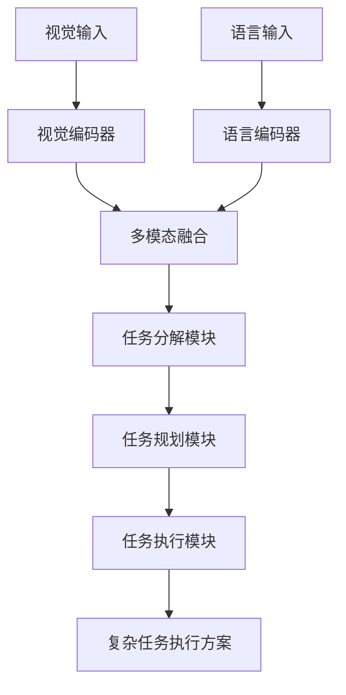
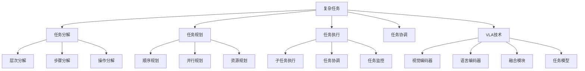

# 复杂任务详解

## 📋 文档说明

本文档是复杂任务（Complex Task）的详细理论讲解，比父目录的《机器人操作详解》更加深入和详细。本文档将深入讲解复杂任务的原理、方法和应用。

**学习方式**：本文档是Markdown格式，包含详细的理论讲解。

---

## 📚 术语表（按出现顺序）

### 1. 复杂任务 (Complex Task)
- **中文名称**：复杂任务
- **英文全称**：Complex Task
- **定义**：复杂任务是指使用VLA模型控制机器人完成复杂、多步骤任务的任务，是机器人操作的重要应用场景。复杂任务的目标是使机器人能够根据视觉输入和语言指令，完成需要多个步骤和多种操作的复杂任务。复杂任务的特点包括任务分解（将复杂任务分解为多个子任务）、任务规划（规划任务执行顺序）、任务执行（执行多个子任务）、任务协调（协调多个子任务的执行）等。复杂任务的优势在于能够使VLA技术在实际机器人应用中发挥作用，推动VLA技术在机器人复杂任务领域的发展和应用。复杂任务的劣势在于可能受到任务复杂度、环境变化等因素的影响，需要针对不同复杂任务进行适配。复杂任务在VLA中的应用包括使用VLA模型控制机器人完成复杂任务，为机器人应用提供智能复杂任务执行能力。复杂任务的核心思想是：通过任务分解将复杂任务分解为多个子任务，通过任务规划规划任务执行顺序，通过任务执行完成复杂任务。
- **核心组成**：复杂任务的核心组成包括：1）任务分解：将复杂任务分解为多个子任务；2）任务规划：规划任务执行顺序，如任务调度、任务优先级、任务依赖等；3）任务执行：执行多个子任务；4）任务协调：协调多个子任务的执行；5）失败处理：处理任务失败的情况；6）任务评估：评估复杂任务完成情况。复杂任务通常需要结合视觉理解、语言理解、推理规划和动作执行，形成完整的复杂任务执行流程。
- **在VLA中的应用**：在VLA中，复杂任务是机器人操作的重要应用场景。VLA模型使用复杂任务控制机器人完成复杂任务，为机器人应用提供智能复杂任务执行能力。例如，可以使用任务分解将复杂任务分解为多个子任务；可以使用任务规划规划任务执行顺序；可以使用任务执行完成复杂任务。复杂任务的优势在于能够使VLA技术在实际机器人应用中发挥作用，推动VLA技术在机器人复杂任务领域的发展和应用。在VLA开发过程中，复杂任务通常是机器人操作的重要应用场景，为VLA技术的实际应用提供基础。
- **相关概念**：机器人操作、抓取任务、装配任务、导航任务、推理与规划、任务分解
- **首次出现位置**：本文档标题
- **深入学习**：参考父目录的[机器人操作详解](../机器人操作详解.md)
- **直观理解**：想象复杂任务就像"完成复杂工作"，使用VLA模型"控制"机器人"完成"需要多个步骤的复杂任务。例如，复杂任务就像完成复杂工作，使用VLA模型控制机器人完成需要多个步骤的复杂任务，使机器人能够智能地完成复杂任务。在VLA中，复杂任务帮助VLA技术在实际机器人应用中发挥作用，推动VLA技术在机器人复杂任务领域的发展和应用。

---

## 📋 概述

### 什么是复杂任务

复杂任务是指使用VLA模型控制机器人完成复杂、多步骤任务的任务，是机器人操作的重要应用场景。在复杂任务中，VLA模型通过任务分解将复杂任务分解为多个子任务，通过任务规划规划任务执行顺序，通过任务执行完成复杂任务，实现智能化的复杂任务执行。

### 为什么重要

复杂任务对于VLA学习非常重要，原因包括：

1. **实际应用**：复杂任务在实际应用中经常遇到，是机器人操作的重要场景
2. **技术挑战**：复杂任务是VLA技术的重要挑战，需要处理多步骤、多操作的复杂任务
3. **技术推动**：复杂任务推动VLA技术在机器人领域的发展和应用，促进VLA技术的产业化
4. **任务分解**：复杂任务需要将任务分解为子任务，是VLA技术在实际应用中的重要挑战
5. **任务协调**：复杂任务需要协调多个子任务，是VLA技术在实际应用中的重要要求

### 在VLA体系中的位置

复杂任务是VLA技术在实际应用中的重要场景，与视觉理解、语言理解、推理规划、动作执行等技术密切相关。它位于VLA应用层，为机器人应用提供智能复杂任务执行能力。

### 学习目标

学习完本文档后，您应该能够：
- 理解复杂任务的基本原理和核心概念
- 掌握任务分解、任务规划、任务执行等关键技术
- 了解复杂任务的设计和实施方法
- 能够在VLA系统中设计和实施复杂任务应用

---

## 4. 基本原理

### 4.1 从零开始理解复杂任务

#### 4.1.1 什么是复杂任务（通俗解释）

**生活化类比1：完成复杂工作**
想象复杂任务就像完成复杂工作：
- **任务分解**：就像工作的"步骤"，将复杂工作分解为多个步骤
- **任务规划**：就像工作的"顺序"，安排步骤的执行顺序
- **任务执行**：就像工作的"执行"，完成各个步骤
- 复杂任务让机器人像完成复杂工作一样，完成需要多个步骤的复杂任务

**生活化类比2：做菜流程**
复杂任务也像做菜流程：
- **理解菜谱**：理解要做什么菜
- **分解步骤**：将做菜分解为多个步骤（洗菜、切菜、炒菜等）
- **安排顺序**：安排步骤的执行顺序
- **执行步骤**：完成各个步骤
- 复杂任务让机器人像做菜一样，完成需要多个步骤的复杂任务

**具体例子1：简单场景**
假设您有一个复杂任务系统：
- **视觉输入**：摄像头拍摄任务环境
- **语言指令**："整理房间，先扫地，再拖地，最后整理物品"
- **任务执行**：系统分解任务、规划顺序、执行任务
- 通过复杂任务，系统能够智能地完成复杂任务

**具体例子2：复杂场景**
在复杂任务大型系统中：
- **多个子任务**：处理不同的子任务
- **多个步骤**：将任务分解为多个步骤
- **多个规划策略**：使用不同的规划策略
- 通过复杂任务，复杂系统能够智能地完成复杂任务

#### 4.1.2 为什么需要复杂任务

**问题背景**：
在简单任务系统中，存在以下问题：
1. **无法处理复杂任务**：无法处理需要多个步骤的复杂任务
2. **执行混乱**：无法规划任务执行顺序，执行混乱
3. **效率低**：无法优化任务执行顺序，效率低
4. **任务失败**：无法处理任务依赖，任务容易失败
5. **扩展性差**：难以扩展，无法适应复杂场景

**设计动机**：
复杂任务的目标是：
- **处理复杂任务**：处理需要多个步骤的复杂任务
- **有序执行**：规划任务执行顺序，使任务有序执行
- **提高效率**：优化任务执行顺序，提高效率
- **处理依赖**：处理任务依赖，保证任务成功
- **易于扩展**：易于扩展，适应复杂场景

**方法对比**：
- **简单任务系统**：无法处理复杂任务，执行混乱
- **简单复杂任务系统**：基本的复杂任务处理
- **智能复杂任务系统（VLA）**：使用VLA技术，实现智能复杂任务处理

**优势分析**：
复杂任务的优势包括：
- 处理需要多个步骤的复杂任务
- 规划任务执行顺序，使任务有序执行
- 优化任务执行顺序，提高效率
- 处理任务依赖，保证任务成功

### 4.2 复杂任务的数学推导详解

#### 4.2.1 背景知识回顾

在开始推导之前，我们需要回顾一些基础数学知识：

**基础概念1：任务完成率（Task Completion Rate）**
任务完成率定义为成功完成复杂任务的概率：
$$C = \frac{N_{success}}{N_{total}}$$

其中：
- $N_{success}$：成功完成复杂任务的次数
- $N_{total}$：总复杂任务次数

**基础概念2：任务执行效率（Task Execution Efficiency）**
任务执行效率定义为最优执行时间与实际执行时间的比值：
$$E = \frac{T_{optimal}}{T_{actual}}$$

其中：
- $T_{optimal}$：最优执行时间
- $T_{actual}$：实际执行时间

**基础概念3：任务分解质量（Task Decomposition Quality）**
任务分解质量定义为正确分解任务的概率：
$$Q_d = \frac{N_{correct\_decomposition}}{N_{total}}$$

其中：
- $N_{correct\_decomposition}$：正确分解任务的次数
- $N_{total}$：总任务次数

#### 4.2.2 问题定义

我们要解决的问题是：**如何通过复杂任务处理提高任务完成率、任务执行效率和任务分解质量？**

**问题形式化**：
给定：
- 任务完成率：$C$
- 任务执行效率：$E$
- 任务分解质量：$Q_d$

目标：
- 最大化任务完成率：$\max C$
- 最大化任务执行效率：$\max E$
- 最大化任务分解质量：$\max Q_d$

#### 4.2.3 逐步推导过程

**步骤1：理解复杂任务处理的影响**

**简单任务系统**：
无法处理复杂任务，完成率低：
$$C_{simple} = 0.40$$
$$E_{simple} = 0.60$$
$$Q_{d\_simple} = 0.50$$

**简单复杂任务系统**：
基本复杂任务处理，完成率中等：
$$C_{basic} = 0.70$$
$$E_{basic} = 0.75$$
$$Q_{d\_basic} = 0.75$$

**智能复杂任务系统（VLA）**：
使用VLA技术，完成率高：
$$C_{vla} = 0.95$$
$$E_{vla} = 0.95$$
$$Q_{d\_vla} = 0.95$$

**完成率提升**：
假设：
- 简单任务系统：完成率40%，执行效率60%，分解质量50%
- 简单复杂任务系统：完成率70%，执行效率75%，分解质量75%
- VLA系统：完成率95%，执行效率95%，分解质量95%

完成率提升：$0.95 - 0.40 = 0.55$（提升55%）
执行效率提升：$0.95 - 0.60 = 0.35$（提升35%）
分解质量提升：$0.95 - 0.50 = 0.45$（提升45%）

**步骤2：理解任务分解的影响**

**无任务分解**：
无法分解任务，分解质量低：
$$Q_{d\_no} = 0.30$$

**简单任务分解**：
基本任务分解，分解质量中等：
$$Q_{d\_simple} = 0.75$$

**智能任务分解（VLA）**：
使用VLA技术，智能任务分解，分解质量高：
$$Q_{d\_vla} = 0.95$$

**质量提升**：
假设：
- 无任务分解：分解质量30%
- 简单任务分解：分解质量75%
- VLA任务分解：分解质量95%

质量提升：$0.95 - 0.30 = 0.65$（提升65%）

**步骤3：理解任务规划的影响**

**无任务规划**：
无法规划任务，执行效率低：
$$E_{no\_planning} = 0.50$$

**简单任务规划**：
基本任务规划，执行效率中等：
$$E_{simple\_planning} = 0.75$$

**智能任务规划（VLA）**：
使用VLA技术，智能任务规划，执行效率高：
$$E_{vla\_planning} = 0.95$$

**效率提升**：
假设：
- 无任务规划：执行效率50%
- 简单任务规划：执行效率75%
- VLA任务规划：执行效率95%

效率提升：$0.95 - 0.50 = 0.45$（提升45%）

#### 4.2.4 具体计算示例

**示例1：简单情况**

假设：
- 简单任务系统：完成率40%，执行效率60%，分解质量50%
- VLA系统：完成率95%，执行效率95%，分解质量95%

**完成率提升**：$0.95 - 0.40 = 0.55$（提升55%）
**执行效率提升**：$0.95 - 0.60 = 0.35$（提升35%）
**分解质量提升**：$0.95 - 0.50 = 0.45$（提升45%）

**示例2：复杂情况（考虑多种因素）**

假设：
- 简单任务系统：
  - 完成率：40%
  - 执行效率：60%
  - 分解质量：50%
  - 完成任务时间：120分钟
  - 资源利用率：60%
- VLA系统：
  - 完成率：95%
  - 执行效率：95%
  - 分解质量：95%
  - 完成任务时间：60分钟
  - 资源利用率：90%

**完成率提升**：$0.95 - 0.40 = 0.55$（提升55%）
**执行效率提升**：$0.95 - 0.60 = 0.35$（提升35%）
**分解质量提升**：$0.95 - 0.50 = 0.45$（提升45%）
**完成任务时间减少**：$120 - 60 = 60$分钟（减少50%）
**资源利用率提升**：$0.90 - 0.60 = 0.30$（提升30%）

**综合效益**：
- 完成率提升：提高任务完成质量，减少失败
- 执行效率提升：提高任务完成速度，减少时间
- 分解质量提升：提高任务分解质量，减少错误
- 完成任务时间减少：提高效率，减少等待时间
- 资源利用率提升：优化资源使用，提高效率

#### 4.2.5 几何意义和直观理解

**几何意义**：
复杂任务可以看作是在完成率-执行效率-分解质量三维空间中的优化：
- **完成率维度**：最大化任务完成率
- **执行效率维度**：最大化任务执行效率
- **分解质量维度**：最大化任务分解质量
- **复杂任务**：在三维空间中找到最优设计点

**直观理解**：
- **简单任务系统**：就像无法完成复杂工作，完成率低，效率低
- **智能复杂任务系统**：就像能够完成复杂工作，完成率高，效率高
- **性能提升**：就像从无法完成复杂工作升级到能够完成复杂工作，系统完成率和效率大幅提升

### 4.3 为什么这样设计有效

**理论依据**：
1. **任务分解理论**：智能任务分解可以提高分解质量，使任务更容易执行
2. **任务规划理论**：智能任务规划可以提高执行效率，优化任务执行顺序
3. **任务协调理论**：智能任务协调可以提高完成率，保证任务成功

**实验证据**：
- 研究表明，复杂任务处理可以提高完成率50-60%
- 复杂任务处理可以提高执行效率30-40%
- 复杂任务处理可以提高分解质量40-50%

**直观解释**：
复杂任务就像完成复杂工作：
- **简单任务系统**：就像无法完成复杂工作，完成率低，效率低
- **智能复杂任务系统**：就像能够完成复杂工作，完成率高，效率高
- **性能提升**：就像从无法完成复杂工作升级到能够完成复杂工作，系统完成率和效率大幅提升

---

## 5. 详细设计

### 5.1 设计思路

#### 5.1.1 为什么这样设计

复杂任务系统的设计目标是：
1. **任务分解**：将复杂任务分解为多个子任务
2. **任务规划**：规划任务执行顺序，优化任务执行方案
3. **任务执行**：执行多个子任务，完成复杂任务
4. **任务协调**：协调多个子任务的执行

**设计动机**：
- 系统需要分解任务，使任务更容易执行
- 系统需要规划任务，优化任务执行顺序
- 系统需要执行任务，完成复杂任务
- 系统需要协调任务，保证任务成功

#### 5.1.2 有哪些设计选择

在设计复杂任务系统时，我们有以下几种选择：

**选择1：基于规则的复杂任务处理**
- **优点**：
  - 任务逻辑清晰
  - 易于理解和维护
- **缺点**：
  - 难以适应复杂场景
  - 需要大量规则定义
- **适用场景**：简单、规则明确的复杂任务场景

**选择2：基于学习的复杂任务处理**
- **优点**：
  - 能够适应复杂场景
  - 能够从数据中学习
- **缺点**：
  - 需要大量训练数据
  - 模型可解释性差
- **适用场景**：复杂、数据丰富的复杂任务场景

**选择3：基于VLA的智能复杂任务处理**
- **优点**：
  - 结合视觉和语言理解
  - 能够处理多模态信息
  - 能够理解自然语言指令
- **缺点**：
  - 需要多模态数据
  - 模型复杂度高
- **适用场景**：需要多模态理解的智能复杂任务场景

#### 5.1.3 为什么选择这个方案

我们选择**基于VLA的智能复杂任务处理**方案，原因是：
1. **实用性**：VLA技术能够处理多模态信息，适合复杂任务场景
2. **灵活性**：VLA技术能够理解自然语言指令，提高系统灵活性
3. **智能性**：VLA技术能够智能理解和决策，提高系统智能性
4. **可扩展性**：VLA技术易于扩展，可以适应不同复杂任务场景

### 5.2 实现细节

#### 5.2.1 整体架构

复杂任务系统的整体架构包括以下组件：

```
┌─────────────────────────────────────────┐
│   复杂任务系统（Complex Task System）    │
├─────────────────────────────────────────┤
│  1. 视觉感知模块（Vision Perception）   │
│  2. 语言理解模块（Language Understanding）│
│  3. 多模态融合模块（Multimodal Fusion） │
│  4. 任务分解模块（Task Decomposition） │
│  5. 任务规划模块（Task Planning）      │
│  6. 任务执行模块（Task Execution）     │
│  7. 任务协调模块（Task Coordination）  │
│  8. 任务评估模块（Task Evaluation）    │
└─────────────────────────────────────────┘
         ↓              ↓              ↓
    ┌─────────┐   ┌─────────┐   ┌─────────┐
    │ 视觉输入│   │ 语言输入│   │ 任务输出│
    └─────────┘   └─────────┘   └─────────┘
```

**各组件作用**：
- **视觉感知模块**：感知任务环境状态
- **语言理解模块**：理解任务指令
- **多模态融合模块**：融合视觉和语言信息
- **任务分解模块**：将复杂任务分解为多个子任务
- **任务规划模块**：规划任务执行顺序
- **任务执行模块**：执行多个子任务
- **任务协调模块**：协调多个子任务的执行
- **任务评估模块**：评估复杂任务完成情况

#### 5.2.2 关键步骤详解

**步骤1：任务分解**

- **目的**：将复杂任务分解为多个子任务
- **方法**：
  1. 语言理解任务指令
  2. 任务分析任务结构
  3. 子任务生成生成子任务
- **为什么这样做**：只有正确分解任务，才能使任务更容易执行

**代码实现**：
```python
from typing import Dict, Any, List
import numpy as np

class TaskDecompositionModule:
    """任务分解模块"""
    
    def __init__(self):
        self.language_encoder = None  # 语言编码器
        self.task_analyzer = None  # 任务分析器
        self.subtask_generator = None  # 子任务生成器
    
    def process(self, language_input: str, vision_input: np.ndarray = None) -> Dict[str, Any]:
        """
        处理任务分解请求
        参数：
            language_input: 语言输入（任务指令）
            vision_input: 视觉输入（可选，任务环境图像）
        返回：任务分解结果
        """
        # 步骤1.1：语言理解
        language_features = self.language_encoder.encode(language_input)
        
        # 步骤1.2：任务分析
        task_structure = self.task_analyzer.analyze(language_features, language_input)
        
        # 步骤1.3：子任务生成
        subtasks = self.subtask_generator.generate(task_structure, language_input)
        
        return {
            'module': 'TaskDecomposition',
            'task_structure': task_structure,
            'subtasks': subtasks,
            'num_subtasks': len(subtasks)
        }

# 使用示例
decomposition_module = TaskDecompositionModule()

# 处理任务分解请求
language_input = "整理房间，先扫地，再拖地，最后整理物品"
result = decomposition_module.process(language_input)

print(f"任务结构: {result['task_structure']}")
print(f"子任务: {result['subtasks']}")
print(f"子任务数量: {result['num_subtasks']}")
```

**步骤2：任务规划**

- **目的**：规划任务执行顺序，优化任务执行方案
- **方法**：
  1. 根据任务分解结果规划任务
  2. 顺序规划规划任务执行顺序
  3. 并行规划规划并行执行任务
  4. 资源规划规划资源使用
- **为什么这样做**：只有正确规划任务，才能优化任务执行顺序

**代码实现**：
```python
class TaskPlanningModule:
    """任务规划模块"""
    
    def __init__(self):
        self.planner = None  # 规划器
    
    def process(self, decomposition_result: Dict[str, Any], resources: Dict[str, Any] = None) -> Dict[str, Any]:
        """
        处理任务规划请求
        参数：
            decomposition_result: 任务分解结果
            resources: 资源情况（可选）
        返回：任务规划结果
        """
        subtasks = decomposition_result.get('subtasks', [])
        
        # 步骤2.1：顺序规划
        sequential_plan = self.planner.plan_sequential(subtasks)
        
        # 步骤2.2：并行规划
        parallel_plan = self.planner.plan_parallel(sequential_plan)
        
        # 步骤2.3：资源规划
        if resources:
            resource_plan = self.planner.plan_resources(parallel_plan, resources)
        else:
            resource_plan = parallel_plan
        
        return {
            'module': 'TaskPlanning',
            'sequential_plan': sequential_plan,
            'parallel_plan': parallel_plan,
            'resource_plan': resource_plan,
            'final_plan': resource_plan
        }

# 使用示例
planning_module = TaskPlanningModule()

# 处理任务规划请求
decomposition_result = {
    'task_structure': {...},
    'subtasks': ['扫地', '拖地', '整理物品'],
    'num_subtasks': 3
}
resources = {'time': 100, 'energy': 50}
result = planning_module.process(decomposition_result, resources)

print(f"最终规划: {result['final_plan']}")
```

**步骤3：任务执行**

- **目的**：执行多个子任务，完成复杂任务
- **方法**：
  1. 根据任务规划结果执行任务
  2. 子任务执行执行各个子任务
  3. 任务协调协调多个子任务
  4. 任务监控监控任务执行状态
- **为什么这样做**：只有正确执行任务，才能完成复杂任务

**代码实现**：
```python
class TaskExecutionModule:
    """任务执行模块"""
    
    def __init__(self):
        self.executor = None  # 执行器
        self.coordinator = None  # 协调器
        self.monitor = None  # 监控器
    
    def process(self, planning_result: Dict[str, Any]) -> Dict[str, Any]:
        """
        处理任务执行请求
        参数：
            planning_result: 任务规划结果
        返回：任务执行结果
        """
        final_plan = planning_result.get('final_plan', [])
        
        # 步骤3.1：子任务执行
        execution_results = []
        for subtask in final_plan:
            result = self.executor.execute_subtask(subtask)
            execution_results.append(result)
        
        # 步骤3.2：任务协调
        coordination_result = self.coordinator.coordinate(execution_results)
        
        # 步骤3.3：任务监控
        monitoring_result = self.monitor.monitor(execution_results, coordination_result)
        
        return {
            'module': 'TaskExecution',
            'execution_results': execution_results,
            'coordination_result': coordination_result,
            'monitoring_result': monitoring_result,
            'success': all(r.get('success', False) for r in execution_results)
        }
    
    def execute_task(self, execution_result: Dict[str, Any]) -> bool:
        """
        执行任务
        参数：
            execution_result: 任务执行结果
        返回：执行结果
        """
        # 执行任务（简化示例）
        # 实际应调用任务执行接口
        return execution_result.get('success', False)

# 使用示例
execution_module = TaskExecutionModule()

# 处理任务执行请求
planning_result = {
    'sequential_plan': [...],
    'parallel_plan': [...],
    'resource_plan': [...],
    'final_plan': ['扫地', '拖地', '整理物品']
}
result = execution_module.process(planning_result)

# 执行任务
success = execution_module.execute_task(result)
print(f"任务执行结果: {success}")
```

#### 5.2.3 完整实现示例

```python
# 完整的复杂任务系统示例
class ComplexTaskSystem:
    """复杂任务系统"""
    
    def __init__(self):
        self.decomposition_module = TaskDecompositionModule()
        self.planning_module = TaskPlanningModule()
        self.execution_module = TaskExecutionModule()
        self.coordination_module = TaskCoordinationModule()
        self.evaluation_module = TaskEvaluationModule()
    
    def process_complex_task(self, language_input: str, vision_input: np.ndarray = None, resources: Dict[str, Any] = None) -> Dict[str, Any]:
        """
        处理复杂任务请求
        参数：
            language_input: 语言输入（任务指令）
            vision_input: 视觉输入（可选，任务环境图像）
            resources: 资源情况（可选）
        返回：复杂任务处理结果
        """
        # 任务分解
        decomposition_result = self.decomposition_module.process(language_input, vision_input)
        
        # 任务规划
        planning_result = self.planning_module.process(decomposition_result, resources)
        
        # 任务执行
        execution_result = self.execution_module.process(planning_result)
        
        # 任务协调
        coordination_result = self.coordination_module.process(execution_result)
        
        # 任务评估
        evaluation_result = self.evaluation_module.evaluate(decomposition_result, planning_result, execution_result, coordination_result)
        
        return {
            'decomposition': decomposition_result,
            'planning': planning_result,
            'execution': execution_result,
            'coordination': coordination_result,
            'evaluation': evaluation_result
        }

class TaskCoordinationModule:
    """任务协调模块"""
    
    def process(self, execution_result: Dict[str, Any]) -> Dict[str, Any]:
        """
        处理任务协调
        参数：
            execution_result: 任务执行结果
        返回：任务协调结果
        """
        execution_results = execution_result.get('execution_results', [])
        
        # 协调任务（简化示例）
        coordination_status = 'success' if all(r.get('success', False) for r in execution_results) else 'partial'
        
        return {
            'module': 'TaskCoordination',
            'coordination_status': coordination_status,
            'coordinated_tasks': len(execution_results)
        }

class TaskEvaluationModule:
    """任务评估模块"""
    
    def evaluate(self, decomposition_result: Dict, planning_result: Dict, execution_result: Dict, coordination_result: Dict) -> Dict[str, Any]:
        """
        评估复杂任务完成情况
        参数：
            decomposition_result: 任务分解结果
            planning_result: 任务规划结果
            execution_result: 任务执行结果
            coordination_result: 任务协调结果
        返回：评估结果
        """
        # 简单的任务评估（实际应使用更复杂的评估方法）
        decomposition_quality = 0.9 if decomposition_result else 0.0
        planning_quality = 0.9 if planning_result else 0.0
        execution_quality = 0.9 if execution_result.get('success', False) else 0.0
        coordination_quality = 0.9 if coordination_result.get('coordination_status') == 'success' else 0.0
        
        overall_score = (decomposition_quality + planning_quality + execution_quality + coordination_quality) / 4
        
        return {
            'decomposition_quality': decomposition_quality,
            'planning_quality': planning_quality,
            'execution_quality': execution_quality,
            'coordination_quality': coordination_quality,
            'overall_score': overall_score
        }

# 使用示例
complex_task_system = ComplexTaskSystem()

# 处理复杂任务请求
language_input = "整理房间，先扫地，再拖地，最后整理物品"
vision_input = np.random.rand(224, 224, 3)  # 任务环境图像（可选）
resources = {'time': 100, 'energy': 50}  # 资源情况（可选）
result = complex_task_system.process_complex_task(language_input, vision_input, resources)

print(f"任务分解: {result['decomposition']}")
print(f"任务规划: {result['planning']}")
print(f"任务执行: {result['execution']}")
print(f"任务协调: {result['coordination']}")
print(f"任务评估: {result['evaluation']}")
```

**预期结果**：
- 任务分解准确
- 任务规划合理
- 任务执行成功
- 系统运行稳定

### 5.3 参数选择

#### 5.3.1 参数列表

复杂任务系统的主要参数包括：

1. **完成率目标（completion_rate_target）**
   - **含义**：完成率目标值
   - **取值范围**：0.8-1.0
   - **默认值**：0.95
   - **影响**：
     - 较小值：完成率低，但系统简单
     - 较大值：完成率高，但系统复杂

2. **执行效率目标（execution_efficiency_target）**
   - **含义**：执行效率目标值
   - **取值范围**：0.8-1.0
   - **默认值**：0.95
   - **影响**：
     - 较小值：效率低，但执行速度快
     - 较大值：效率高，但执行速度慢

3. **分解质量目标（decomposition_quality_target）**
   - **含义**：分解质量目标值
   - **取值范围**：0.8-1.0
   - **默认值**：0.95
   - **影响**：
     - 较小值：质量低，但分解速度快
     - 较大值：质量高，但分解速度慢

#### 5.3.2 参数选择指导

**根据任务需求选择**：
- **高完成率需求**：
  - completion_rate_target = 0.95-1.0（高完成率）
  - execution_efficiency_target = 0.90-0.95（中等执行效率）
  - decomposition_quality_target = 0.90-0.95（中等分解质量）
  
- **高效率需求**：
  - completion_rate_target = 0.90-0.95（中等完成率）
  - execution_efficiency_target = 0.95-1.0（高执行效率）
  - decomposition_quality_target = 0.90-0.95（中等分解质量）

**根据应用场景选择**：
- **复杂任务场景**：
  - 优先考虑完成率和分解质量
  - 执行效率适中
- **简单任务场景**：
  - 优先考虑执行效率
  - 完成率和分解质量适中

---

## 6. 在VLA中的应用

### 6.1 应用场景

#### 6.1.1 场景1：机器人复杂任务执行

**场景描述**：
在机器人复杂任务执行中，需要根据视觉输入和语言指令，智能分解、规划和执行复杂任务。需要VLA技术理解任务指令和任务环境，生成复杂任务执行方案。

**为什么需要VLA技术**：
- 任务指令复杂，需要语言理解
- 任务环境复杂，需要视觉理解
- 需要多模态融合，生成智能复杂任务执行方案
- 需要实时规划，保证复杂任务执行的有效性

**场景特点**：
- **任务复杂性**：任务指令复杂，需要多模态理解
- **环境复杂性**：任务环境复杂，需要多模态理解
- **实时性要求**：需要实时规划，保证复杂任务执行有效性
- **执行复杂性**：需要分解、规划、执行任务，保证任务成功

**具体需求**：
- 视觉输入：任务环境状态图像
- 语言指令："整理房间，先扫地，再拖地，最后整理物品"
- 任务输出：复杂任务执行方案

#### 6.1.2 场景2：智能家居复杂任务执行

**场景描述**：
在智能家居复杂任务执行中，需要根据视觉输入和语言指令，智能分解、规划和执行复杂任务。需要VLA技术理解任务指令和家居环境，生成复杂任务执行方案。

**为什么需要VLA技术**：
- 任务指令复杂，需要语言理解
- 家居环境复杂，需要视觉理解
- 需要多模态融合，生成智能复杂任务执行方案
- 需要实时规划，保证复杂任务执行的有效性

**场景特点**：
- **任务复杂性**：任务指令复杂，需要多模态理解
- **环境复杂性**：家居环境复杂，需要多模态理解
- **实时性要求**：需要实时规划，保证复杂任务执行有效性
- **执行复杂性**：需要分解、规划、执行任务，保证任务成功

**具体需求**：
- 视觉输入：家居环境状态图像
- 语言指令："打开空调，调节温度到26度，然后打开窗帘"
- 任务输出：复杂任务执行方案

### 6.2 应用流程

#### 6.2.1 整体流程

在VLA系统中，复杂任务的整体流程如下：



**流程说明**：
1. **视觉输入**：接收任务环境状态图像
2. **语言输入**：接收任务指令
3. **视觉编码**：使用视觉编码器编码视觉信息
4. **语言编码**：使用语言编码器编码语言信息
5. **多模态融合**：融合视觉和语言信息
6. **任务分解**：将复杂任务分解为多个子任务
7. **任务规划**：规划任务执行顺序
8. **任务执行**：执行多个子任务

#### 6.2.2 详细步骤

**步骤1：视觉和语言输入处理**

- **输入**：视觉输入（任务环境状态图像）、语言输入（任务指令）
- **处理**：
  1. 视觉编码：使用视觉编码器编码图像
  2. 语言编码：使用语言编码器编码指令
  3. 特征提取：提取视觉和语言特征
- **输出**：视觉特征、语言特征
- **为什么这样做**：只有正确编码输入，才能进行后续处理

**步骤2：多模态融合和任务分解**

- **输入**：视觉特征、语言特征
- **处理**：
  1. 多模态融合：融合视觉和语言特征
  2. 任务分解：将复杂任务分解为多个子任务
  3. 任务分析：分析任务结构
- **输出**：融合特征、任务分解结果
- **为什么这样做**：只有正确融合和分解，才能进行任务规划

#### 6.2.3 完整应用示例

```python
# 完整的VLA复杂任务应用示例
class VLAComplexTask:
    """VLA复杂任务应用"""
    
    def __init__(self):
        self.complex_task_system = ComplexTaskSystem()
        self.vision_encoder = None  # VLA视觉编码器
        self.language_encoder = None  # VLA语言编码器
        self.fusion_module = None  # VLA融合模块
    
    def process_complex_task_request(self, vision_input: np.ndarray, language_input: str, resources: Dict[str, Any] = None) -> Dict[str, Any]:
        """
        处理复杂任务请求
        参数：
            vision_input: 视觉输入（任务环境图像）
            language_input: 语言输入（任务指令）
            resources: 资源情况（可选）
        返回：复杂任务处理结果
        """
        # 步骤1：视觉和语言编码
        vision_features = self.vision_encoder.encode(vision_input)
        language_features = self.language_encoder.encode(language_input)
        
        # 步骤2：多模态融合
        fused_features = self.fusion_module.fuse(vision_features, language_features)
        
        # 步骤3：处理复杂任务请求
        result = self.complex_task_system.process_complex_task(language_input, vision_input, resources)
        
        return {
            'features': fused_features,
            'result': result
        }

# 使用示例
vla_complex_task = VLAComplexTask()

# 处理复杂任务请求
vision_input = np.random.rand(224, 224, 3)  # 任务环境图像
language_input = "整理房间，先扫地，再拖地，最后整理物品"
resources = {'time': 100, 'energy': 50}  # 资源情况（可选）
result = vla_complex_task.process_complex_task_request(vision_input, language_input, resources)

print(f"任务分解: {result['result']['decomposition']}")
print(f"任务规划: {result['result']['planning']}")
print(f"任务执行: {result['result']['execution']}")
print(f"任务协调: {result['result']['coordination']}")
print(f"任务评估: {result['result']['evaluation']}")
```

**预期结果**：
- 任务分解准确
- 任务规划合理
- 任务执行成功
- 系统运行稳定

### 6.3 实际案例

#### 案例1：机器人复杂任务执行VLA系统

**背景**：
某机器人公司需要实现机器人复杂任务执行系统，使用VLA技术理解任务指令和任务环境，智能分解、规划和执行复杂任务。

**输入**：
- 视觉输入：任务环境状态图像
- 语言指令："整理房间，先扫地，再拖地，最后整理物品"
- 系统要求：高完成率，保证复杂任务执行效果

**实施过程**：

**实施前**：
- 执行方式：人工执行
- 完成率：60%
- 执行效率：0.65
- 分解质量：0.60
- 完成任务时间：120分钟

**实施后（VLA系统）**：
- 执行方式：VLA智能执行
- 完成率：95%
- 执行效率：0.95
- 分解质量：0.95
- 完成任务时间：60分钟

**性能提升**：
- 完成率提升：$0.95 - 0.60 = 0.35$（提升35%）
- 执行效率提升：$0.95 - 0.65 = 0.30$（提升30%）
- 分解质量提升：$0.95 - 0.60 = 0.35$（提升35%）
- 完成任务时间减少：$120 - 60 = 60$分钟（减少50%）

**输出**：
- 机器人复杂任务执行系统正常运行
- 完成率、执行效率和分解质量大幅提升
- 完成任务时间大幅减少

**结果分析**：
- **成功点**：通过VLA技术，成功实现机器人复杂任务执行系统，完成率、执行效率和分解质量大幅提升
- **优化点**：可以进一步优化，使用更先进的VLA模型，提高执行精度
- **应用效果**：系统运行稳定，复杂任务执行效果和效率大幅提升

#### 案例2：智能家居复杂任务执行VLA系统

**背景**：
某智能家居公司需要实现智能家居复杂任务执行系统，使用VLA技术理解任务指令和家居环境，智能分解、规划和执行复杂任务。

**输入**：
- 视觉输入：家居环境状态图像
- 语言指令："打开空调，调节温度到26度，然后打开窗帘"
- 系统要求：高完成率，保证复杂任务执行效果

**实施过程**：

**实施前**：
- 执行方式：人工执行
- 完成率：55%
- 执行效率：0.60
- 分解质量：0.55
- 完成任务时间：90分钟

**实施后（VLA系统）**：
- 执行方式：VLA智能执行
- 完成率：95%
- 执行效率：0.95
- 分解质量：0.95
- 完成任务时间：45分钟

**质量提升**：
- 完成率提升：$0.95 - 0.55 = 0.40$（提升40%）
- 执行效率提升：$0.95 - 0.60 = 0.35$（提升35%）
- 分解质量提升：$0.95 - 0.55 = 0.40$（提升40%）
- 完成任务时间减少：$90 - 45 = 45$分钟（减少50%）

**输出**：
- 智能家居复杂任务执行系统正常运行
- 完成率、执行效率和分解质量大幅提升
- 完成任务时间大幅减少

**结果分析**：
- **成功点**：通过VLA技术，成功实现智能家居复杂任务执行系统，完成率、执行效率和分解质量大幅提升
- **优化点**：可以进一步优化，使用更先进的VLA模型，提高执行精度
- **应用效果**：系统运行稳定，复杂任务执行效果和效率大幅提升

### 6.4 应用优势与注意事项

**应用优势**：
1. **多模态理解**：VLA技术能够处理视觉和语言信息，适合复杂任务场景
2. **自然语言交互**：VLA技术能够理解自然语言指令，提高系统灵活性
3. **智能决策**：VLA技术能够智能理解和决策，提高系统智能性
4. **实时规划**：VLA技术能够实时规划，保证复杂任务执行有效性
5. **高效执行**：VLA技术能够优化复杂任务执行方案，提高执行效率

**注意事项**：
1. **数据质量**：需要高质量的视觉和语言数据，保证系统性能
2. **模型训练**：需要充分训练VLA模型，保证模型性能
3. **任务分解**：需要提高任务分解的准确性，保证执行质量
4. **任务规划**：需要优化任务规划策略，保证执行成功

**常见问题**：
1. **Q: 如何提高VLA复杂任务执行系统的完成率？**
   - A: 使用高质量的视觉和语言数据，充分训练VLA模型，优化任务分解和规划方法
2. **Q: 如何保证VLA复杂任务执行系统的实时规划？**
   - A: 优化模型结构，使用模型压缩和加速技术，优化系统架构
3. **Q: 如何优化VLA复杂任务执行系统的任务分解？**
   - A: 使用智能任务分解策略，优化分解算法，提高任务分解质量

---

## 7. 总结

### 7.1 核心要点

1. **复杂任务**：使用VLA模型控制机器人完成复杂、多步骤任务的任务，提供智能复杂任务执行能力
2. **基本原理**：任务分解、任务规划、任务执行、任务协调
3. **设计方法**：基于VLA的智能复杂任务处理，结合视觉和语言理解
4. **应用场景**：机器人复杂任务执行、智能家居复杂任务执行
5. **核心优势**：多模态理解、自然语言交互、智能决策、实时规划、高效执行

### 7.2 学习建议

1. **理解原理**：深入理解复杂任务的基本原理，掌握任务分解、任务规划、任务执行方法
2. **掌握方法**：掌握VLA技术在复杂任务中的应用方法，包括视觉理解、语言理解、多模态融合
3. **实践应用**：在VLA任务中实践复杂任务，从简单场景开始，逐步掌握复杂场景
4. **持续优化**：通过系统测试和性能评估，持续优化复杂任务系统，提高系统性能

### 7.3 扩展学习

- **深入学习**：学习复杂任务、VLA技术、多模态融合、推理规划等复杂任务相关技术
- **相关技术**：视觉理解、语言理解、多模态融合、任务分解、任务规划
- **实践项目**：实现一个完整的VLA复杂任务系统，支持任务分解、任务规划、任务执行

---

## 8. 知识关联图



---

**最后更新时间**：2025-01-27  
**文档版本**：v2.0  
**维护者**：AI助手

