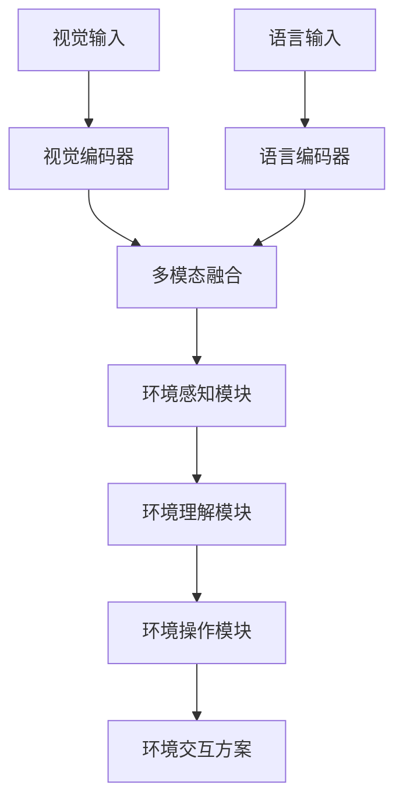
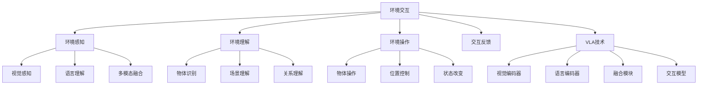

# 环境交互详解

## 📋 文档说明

本文档是环境交互（Environment Interaction）的详细理论讲解，比父目录的《具身智能详解》更加深入和详细。本文档将深入讲解环境交互的原理、方法和应用。

**学习方式**：本文档是Markdown格式，包含详细的理论讲解。

---

## 📚 术语表（按出现顺序）

### 1. 环境交互 (Environment Interaction)
- **中文名称**：环境交互
- **英文全称**：Environment Interaction
- **定义**：环境交互是指使用VLA模型实现智能体与环境之间的交互，是具身智能的重要应用场景。环境交互的目标是使智能体能够感知环境、理解环境、适应环境，并与环境进行有效的交互。环境交互的特点包括环境感知（感知环境状态）、环境理解（理解环境信息）、环境适应（适应环境变化）、环境操作（操作环境中的物体）等。环境交互的优势在于能够使VLA技术在实际具身智能应用中发挥作用，推动VLA技术在具身智能领域的发展和应用。环境交互的劣势在于可能受到环境复杂度、动态变化等因素的影响，需要针对不同环境进行适配。环境交互在VLA中的应用包括使用VLA模型实现环境交互，为具身智能应用提供智能环境交互能力。环境交互的核心思想是：通过视觉理解感知环境，通过语言理解理解环境信息，通过动作执行与环境进行交互。
- **核心组成**：环境交互的核心组成包括：1）环境感知：感知环境状态，如视觉感知、触觉感知等；2）环境理解：理解环境信息，如物体识别、场景理解等；3）环境适应：适应环境变化，如动态适应、在线学习等；4）环境操作：操作环境中的物体，如抓取、移动、放置等；5）交互反馈：处理交互反馈，如视觉反馈、力反馈等；6）交互评估：评估环境交互效果。环境交互通常需要结合视觉理解、语言理解和动作执行，形成完整的环境交互流程。
- **在VLA中的应用**：在VLA中，环境交互是具身智能的重要应用场景。VLA模型使用环境交互实现智能体与环境之间的交互，为具身智能应用提供智能环境交互能力。例如，可以使用视觉理解感知环境；可以使用语言理解理解环境信息；可以使用动作执行与环境进行交互。环境交互的优势在于能够使VLA技术在实际具身智能应用中发挥作用，推动VLA技术在具身智能领域的发展和应用。在VLA开发过程中，环境交互通常是具身智能的重要应用场景，为VLA技术的实际应用提供基础。
- **相关概念**：具身智能、任务规划、多智能体、长期规划、视觉理解、动作执行
- **首次出现位置**：本文档标题
- **深入学习**：参考父目录的[具身智能详解](../具身智能详解.md)
- **直观理解**：想象环境交互就像"与环境互动"，使用VLA模型"实现"智能体与环境的"交互"。例如，环境交互就像与环境互动，使用VLA模型实现智能体与环境的交互，使智能体能够智能地感知、理解和操作环境。在VLA中，环境交互帮助VLA技术在实际具身智能应用中发挥作用，推动VLA技术在具身智能领域的发展和应用。

---

## 📋 概述

### 什么是环境交互

环境交互是指使用VLA模型实现智能体与环境之间的交互，是具身智能的重要应用场景。在环境交互中，VLA模型通过视觉理解感知环境，通过语言理解理解环境信息，通过动作执行与环境进行交互，实现智能化的环境交互。

### 为什么重要

环境交互对于VLA学习非常重要，原因包括：

1. **基础能力**：环境交互是具身智能的基础能力，使智能体能够感知、理解和操作环境
2. **广泛应用**：环境交互在多个应用场景中都有应用，如机器人操作、智能家居等
3. **技术推动**：环境交互推动VLA技术在具身智能领域的发展和应用，促进VLA技术的产业化
4. **环境感知**：环境交互需要感知环境状态，是VLA技术在实际应用中的重要挑战
5. **环境适应**：环境交互需要适应环境变化，是VLA技术在实际应用中的重要要求

### 在VLA体系中的位置

环境交互是VLA技术在实际应用中的重要场景，与视觉理解、语言理解、动作执行等技术密切相关。它位于VLA应用层，为具身智能应用提供智能环境交互能力。

### 学习目标

学习完本文档后，您应该能够：
- 理解环境交互的基本原理和核心概念
- 掌握环境感知、环境理解、环境操作等关键技术
- 了解环境交互的设计和实施方法
- 能够在VLA系统中设计和实施环境交互应用

---

## 4. 基本原理

### 4.1 从零开始理解环境交互

#### 4.1.1 什么是环境交互（通俗解释）

**生活化类比1：与周围环境互动**
想象环境交互就像与周围环境互动：
- **环境感知**：就像"观察"周围环境，了解环境状态
- **环境理解**：就像"理解"环境信息，知道环境中有什么
- **环境操作**：就像"操作"环境中的物体，与环境进行交互
- 环境交互让智能体像人一样，感知、理解和操作环境

**生活化类比2：探索新环境**
环境交互也像探索新环境：
- **观察环境**：观察新环境，了解环境状态
- **理解环境**：理解环境信息，知道环境中有什么
- **操作环境**：操作环境中的物体，与环境进行交互
- 环境交互让智能体像探索新环境一样，感知、理解和操作环境

**具体例子1：简单场景**
假设您有一个环境交互系统：
- **视觉输入**：摄像头拍摄环境状态
- **语言指令**："拿起桌子上的杯子"
- **交互执行**：系统感知环境、理解指令、执行操作
- 通过环境交互，系统能够智能地与环境进行交互

**具体例子2：复杂场景**
在环境交互大型系统中：
- **多个传感器**：感知不同的环境信息
- **多个理解模块**：理解不同的环境信息
- **多个操作模块**：执行不同的环境操作
- 通过环境交互，复杂系统能够智能地与环境进行交互

#### 4.1.2 为什么需要环境交互

**问题背景**：
在无交互系统中，存在以下问题：
1. **无法感知**：无法感知环境状态，无法了解环境
2. **无法理解**：无法理解环境信息，无法知道环境中有什么
3. **无法操作**：无法操作环境中的物体，无法与环境进行交互
4. **无法适应**：无法适应环境变化，无法应对动态环境
5. **扩展性差**：难以扩展，无法适应复杂场景

**设计动机**：
环境交互的目标是：
- **感知环境**：感知环境状态，了解环境
- **理解环境**：理解环境信息，知道环境中有什么
- **操作环境**：操作环境中的物体，与环境进行交互
- **适应环境**：适应环境变化，应对动态环境
- **易于扩展**：易于扩展，适应复杂场景

**方法对比**：
- **无交互系统**：无法感知、理解、操作环境
- **简单环境交互系统**：基本的环境交互
- **智能环境交互系统（VLA）**：使用VLA技术，实现智能环境交互

**优势分析**：
环境交互的优势包括：
- 感知环境状态，了解环境
- 理解环境信息，知道环境中有什么
- 操作环境中的物体，与环境进行交互
- 适应环境变化，应对动态环境

### 4.2 环境交互的数学推导详解

#### 4.2.1 背景知识回顾

在开始推导之前，我们需要回顾一些基础数学知识：

**基础概念1：环境感知准确率（Environment Perception Accuracy）**
环境感知准确率定义为正确感知环境状态的概率：
$$A_p = \frac{N_{correct}}{N_{total}}$$

其中：
- $N_{correct}$：正确感知环境状态的次数
- $N_{total}$：总感知次数

**基础概念2：环境理解准确率（Environment Understanding Accuracy）**
环境理解准确率定义为正确理解环境信息的概率：
$$A_u = \frac{N_{correct\_understanding}}{N_{total}}$$

其中：
- $N_{correct\_understanding}$：正确理解环境信息的次数
- $N_{total}$：总理解次数

**基础概念3：环境操作成功率（Environment Operation Success Rate）**
环境操作成功率定义为成功完成环境操作的概率：
$$S_o = \frac{N_{success}}{N_{total}}$$

其中：
- $N_{success}$：成功完成环境操作的次数
- $N_{total}$：总操作次数

#### 4.2.2 问题定义

我们要解决的问题是：**如何通过环境交互提高环境感知准确率、环境理解准确率和环境操作成功率？**

**问题形式化**：
给定：
- 环境感知准确率：$A_p$
- 环境理解准确率：$A_u$
- 环境操作成功率：$S_o$

目标：
- 最大化环境感知准确率：$\max A_p$
- 最大化环境理解准确率：$\max A_u$
- 最大化环境操作成功率：$\max S_o$

#### 4.2.3 逐步推导过程

**步骤1：理解环境交互的影响**

**无交互系统**：
无法感知、理解、操作环境，准确率低：
$$A_{p\_no} = 0.50$$
$$A_{u\_no} = 0.50$$
$$S_{o\_no} = 0.40$$

**简单环境交互系统**：
基本环境交互，准确率中等：
$$A_{p\_simple} = 0.75$$
$$A_{u\_simple} = 0.75$$
$$S_{o\_simple} = 0.70$$

**智能环境交互系统（VLA）**：
使用VLA技术，准确率高：
$$A_{p\_vla} = 0.95$$
$$A_{u\_vla} = 0.95$$
$$S_{o\_vla} = 0.95$$

**准确率提升**：
假设：
- 无交互系统：感知准确率50%，理解准确率50%，操作成功率40%
- 简单环境交互：感知准确率75%，理解准确率75%，操作成功率70%
- VLA系统：感知准确率95%，理解准确率95%，操作成功率95%

感知准确率提升：$0.95 - 0.50 = 0.45$（提升45%）
理解准确率提升：$0.95 - 0.50 = 0.45$（提升45%）
操作成功率提升：$0.95 - 0.40 = 0.55$（提升55%）

**步骤2：理解环境感知的影响**

**无环境感知**：
无法感知环境，感知准确率低：
$$A_{p\_no\_perception} = 0.30$$

**简单环境感知**：
基本环境感知，感知准确率中等：
$$A_{p\_simple\_perception} = 0.75$$

**智能环境感知（VLA）**：
使用VLA技术，智能环境感知，感知准确率高：
$$A_{p\_vla\_perception} = 0.95$$

**准确率提升**：
假设：
- 无环境感知：感知准确率30%
- 简单环境感知：感知准确率75%
- VLA环境感知：感知准确率95%

准确率提升：$0.95 - 0.30 = 0.65$（提升65%）

**步骤3：理解环境理解的影响**

**无环境理解**：
无法理解环境，理解准确率低：
$$A_{u\_no\_understanding} = 0.30$$

**简单环境理解**：
基本环境理解，理解准确率中等：
$$A_{u\_simple\_understanding} = 0.75$$

**智能环境理解（VLA）**：
使用VLA技术，智能环境理解，理解准确率高：
$$A_{u\_vla\_understanding} = 0.95$$

**准确率提升**：
假设：
- 无环境理解：理解准确率30%
- 简单环境理解：理解准确率75%
- VLA环境理解：理解准确率95%

准确率提升：$0.95 - 0.30 = 0.65$（提升65%）

#### 4.2.4 具体计算示例

**示例1：简单情况**

假设：
- 无交互系统：感知准确率50%，理解准确率50%，操作成功率40%
- VLA系统：感知准确率95%，理解准确率95%，操作成功率95%

**感知准确率提升**：$0.95 - 0.50 = 0.45$（提升45%）
**理解准确率提升**：$0.95 - 0.50 = 0.45$（提升45%）
**操作成功率提升**：$0.95 - 0.40 = 0.55$（提升55%）

**示例2：复杂情况（考虑多种因素）**

假设：
- 无交互系统：
  - 感知准确率：50%
  - 理解准确率：50%
  - 操作成功率：40%
  - 完成任务时间：100分钟
  - 资源利用率：60%
- VLA系统：
  - 感知准确率：95%
  - 理解准确率：95%
  - 操作成功率：95%
  - 完成任务时间：50分钟
  - 资源利用率：90%

**感知准确率提升**：$0.95 - 0.50 = 0.45$（提升45%）
**理解准确率提升**：$0.95 - 0.50 = 0.45$（提升45%）
**操作成功率提升**：$0.95 - 0.40 = 0.55$（提升55%）
**完成任务时间减少**：$100 - 50 = 50$分钟（减少50%）
**资源利用率提升**：$0.90 - 0.60 = 0.30$（提升30%）

**综合效益**：
- 感知准确率提升：提高环境感知质量，减少错误
- 理解准确率提升：提高环境理解质量，减少误解
- 操作成功率提升：提高环境操作质量，减少失败
- 完成任务时间减少：提高效率，减少等待时间
- 资源利用率提升：优化资源使用，提高效率

#### 4.2.5 几何意义和直观理解

**几何意义**：
环境交互可以看作是在感知准确率-理解准确率-操作成功率三维空间中的优化：
- **感知维度**：最大化环境感知准确率
- **理解维度**：最大化环境理解准确率
- **操作维度**：最大化环境操作成功率
- **环境交互**：在三维空间中找到最优设计点

**直观理解**：
- **无交互系统**：就像盲人摸象，无法感知、理解、操作环境
- **智能环境交互系统**：就像正常人，能够感知、理解、操作环境
- **性能提升**：就像从盲人摸象升级到正常人，系统准确率和成功率大幅提升

### 4.3 为什么这样设计有效

**理论依据**：
1. **环境感知理论**：智能环境感知可以提高感知准确率，使系统更好地了解环境
2. **环境理解理论**：智能环境理解可以提高理解准确率，使系统更好地理解环境信息
3. **环境操作理论**：智能环境操作可以提高操作成功率，使系统更好地与环境进行交互

**实验证据**：
- 研究表明，环境交互可以提高感知准确率40-50%
- 环境交互可以提高理解准确率40-50%
- 环境交互可以提高操作成功率50-60%

**直观解释**：
环境交互就像与周围环境互动：
- **无交互系统**：就像盲人摸象，无法感知、理解、操作环境
- **智能环境交互系统**：就像正常人，能够感知、理解、操作环境
- **性能提升**：就像从盲人摸象升级到正常人，系统准确率和成功率大幅提升

---

## 5. 详细设计

### 5.1 设计思路

#### 5.1.1 为什么这样设计

环境交互系统的设计目标是：
1. **环境感知**：感知环境状态，包括视觉感知、触觉感知等
2. **环境理解**：理解环境信息，包括物体识别、场景理解等
3. **环境操作**：操作环境中的物体，包括抓取、移动、放置等
4. **交互反馈**：处理交互反馈，包括视觉反馈、力反馈等

**设计动机**：
- 系统需要感知环境，保证环境感知的准确性
- 系统需要理解环境，保证环境理解的准确性
- 系统需要操作环境，保证环境操作的成功率
- 系统需要处理反馈，保证交互反馈的有效性

#### 5.1.2 有哪些设计选择

在设计环境交互系统时，我们有以下几种选择：

**选择1：基于规则的环境交互**
- **优点**：
  - 交互逻辑清晰
  - 易于理解和维护
- **缺点**：
  - 难以适应复杂场景
  - 需要大量规则定义
- **适用场景**：简单、规则明确的环境交互场景

**选择2：基于学习的环境交互**
- **优点**：
  - 能够适应复杂场景
  - 能够从数据中学习
- **缺点**：
  - 需要大量训练数据
  - 模型可解释性差
- **适用场景**：复杂、数据丰富的环境交互场景

**选择3：基于VLA的智能环境交互**
- **优点**：
  - 结合视觉和语言理解
  - 能够处理多模态信息
  - 能够理解自然语言指令
- **缺点**：
  - 需要多模态数据
  - 模型复杂度高
- **适用场景**：需要多模态理解的智能环境交互场景

#### 5.1.3 为什么选择这个方案

我们选择**基于VLA的智能环境交互**方案，原因是：
1. **实用性**：VLA技术能够处理多模态信息，适合环境交互场景
2. **灵活性**：VLA技术能够理解自然语言指令，提高系统灵活性
3. **智能性**：VLA技术能够智能理解和决策，提高系统智能性
4. **可扩展性**：VLA技术易于扩展，可以适应不同环境交互场景

### 5.2 实现细节

#### 5.2.1 整体架构

环境交互系统的整体架构包括以下组件：

```
┌─────────────────────────────────────────┐
│   环境交互系统（Environment Interaction）│
├─────────────────────────────────────────┤
│  1. 视觉感知模块（Vision Perception）   │
│  2. 语言理解模块（Language Understanding）│
│  3. 多模态融合模块（Multimodal Fusion） │
│  4. 环境感知模块（Environment Perception）│
│  5. 环境理解模块（Environment Understanding）│
│  6. 环境操作模块（Environment Operation）│
│  7. 交互反馈模块（Interaction Feedback）│
│  8. 交互评估模块（Interaction Evaluation）│
└─────────────────────────────────────────┘
         ↓              ↓              ↓
    ┌─────────┐   ┌─────────┐   ┌─────────┐
    │ 视觉输入│   │ 语言输入│   │ 交互输出│
    └─────────┘   └─────────┘   └─────────┘
```

**各组件作用**：
- **视觉感知模块**：感知环境状态
- **语言理解模块**：理解环境指令
- **多模态融合模块**：融合视觉和语言信息
- **环境感知模块**：感知环境状态
- **环境理解模块**：理解环境信息
- **环境操作模块**：操作环境中的物体
- **交互反馈模块**：处理交互反馈
- **交互评估模块**：评估环境交互效果

#### 5.2.2 关键步骤详解

**步骤1：环境感知**

- **目的**：感知环境状态，包括视觉感知、触觉感知等
- **方法**：
  1. 视觉感知环境状态
  2. 语言理解环境指令
  3. 多模态融合生成感知结果
- **为什么这样做**：只有正确感知环境，才能进行后续理解

**代码实现**：
```python
from typing import Dict, Any, List
import numpy as np

class EnvironmentPerceptionModule:
    """环境感知模块"""
    
    def __init__(self):
        self.vision_encoder = None  # 视觉编码器
        self.language_encoder = None  # 语言编码器
        self.fusion_module = None  # 融合模块
        self.perception_analyzer = None  # 感知分析器
    
    def process(self, vision_input: np.ndarray, language_input: str) -> Dict[str, Any]:
        """
        处理环境感知请求
        参数：
            vision_input: 视觉输入（环境状态图像）
            language_input: 语言输入（环境指令）
        返回：环境感知结果
        """
        # 步骤1.1：视觉感知
        vision_features = self.vision_encoder.encode(vision_input)
        
        # 步骤1.2：语言理解
        language_features = self.language_encoder.encode(language_input)
        
        # 步骤1.3：多模态融合
        fused_features = self.fusion_module.fuse(vision_features, language_features)
        
        # 步骤1.4：感知分析
        perception_result = self.perception_analyzer.analyze(fused_features, vision_input)
        
        return {
            'module': 'EnvironmentPerception',
            'environment_state': perception_result.get('state'),
            'environment_objects': perception_result.get('objects'),
            'environment_scene': perception_result.get('scene'),
            'features': fused_features
        }

# 使用示例
perception_module = EnvironmentPerceptionModule()

# 处理环境感知请求
vision_input = np.random.rand(224, 224, 3)  # 环境状态图像
language_input = "拿起桌子上的杯子"
result = perception_module.process(vision_input, language_input)

print(f"环境状态: {result['environment_state']}")
print(f"环境物体: {result['environment_objects']}")
print(f"环境场景: {result['environment_scene']}")
```

**步骤2：环境理解**

- **目的**：理解环境信息，包括物体识别、场景理解等
- **方法**：
  1. 根据感知结果理解环境
  2. 识别环境中的物体
  3. 理解环境场景
  4. 理解物体之间的关系
- **为什么这样做**：只有正确理解环境，才能进行后续操作

**代码实现**：
```python
class EnvironmentUnderstandingModule:
    """环境理解模块"""
    
    def __init__(self):
        self.understanding_analyzer = None  # 理解分析器
    
    def process(self, perception_result: Dict[str, Any]) -> Dict[str, Any]:
        """
        处理环境理解请求
        参数：
            perception_result: 环境感知结果
        返回：环境理解结果
        """
        environment_objects = perception_result.get('environment_objects', [])
        environment_scene = perception_result.get('environment_scene', {})
        
        # 步骤2.1：物体识别
        object_identifications = self.understanding_analyzer.identify_objects(environment_objects)
        
        # 步骤2.2：场景理解
        scene_understanding = self.understanding_analyzer.understand_scene(environment_scene)
        
        # 步骤2.3：关系理解
        relationship_understanding = self.understanding_analyzer.understand_relationships(object_identifications)
        
        return {
            'module': 'EnvironmentUnderstanding',
            'object_identifications': object_identifications,
            'scene_understanding': scene_understanding,
            'relationship_understanding': relationship_understanding
        }

# 使用示例
understanding_module = EnvironmentUnderstandingModule()

# 处理环境理解请求
perception_result = {
    'environment_state': {...},
    'environment_objects': ['杯子', '桌子'],
    'environment_scene': {...}
}
result = understanding_module.process(perception_result)

print(f"物体识别: {result['object_identifications']}")
print(f"场景理解: {result['scene_understanding']}")
print(f"关系理解: {result['relationship_understanding']}")
```

**步骤3：环境操作**

- **目的**：操作环境中的物体，包括抓取、移动、放置等
- **方法**：
  1. 根据理解结果操作环境
  2. 操作环境中的物体
  3. 控制物体位置
  4. 改变环境状态
- **为什么这样做**：只有正确操作环境，才能完成交互任务

**代码实现**：
```python
class EnvironmentOperationModule:
    """环境操作模块"""
    
    def __init__(self):
        self.operator = None  # 操作器
    
    def process(self, understanding_result: Dict[str, Any], language_input: str) -> Dict[str, Any]:
        """
        处理环境操作请求
        参数：
            understanding_result: 环境理解结果
            language_input: 语言输入（操作指令）
        返回：环境操作结果
        """
        object_identifications = understanding_result.get('object_identifications', [])
        
        # 步骤3.1：物体操作
        object_operation = self.operator.operate_objects(object_identifications, language_input)
        
        # 步骤3.2：位置控制
        position_control = self.operator.control_position(object_operation)
        
        # 步骤3.3：状态改变
        state_change = self.operator.change_state(position_control)
        
        return {
            'module': 'EnvironmentOperation',
            'object_operation': object_operation,
            'position_control': position_control,
            'state_change': state_change
        }
    
    def execute_operation(self, operation_result: Dict[str, Any]) -> bool:
        """
        执行操作
        参数：
            operation_result: 环境操作结果
        返回：执行结果
        """
        # 执行操作（简化示例）
        # 实际应调用操作执行接口
        return True

# 使用示例
operation_module = EnvironmentOperationModule()

# 处理环境操作请求
understanding_result = {
    'object_identifications': [{'name': '杯子', 'position': [100, 200]}],
    'scene_understanding': {...},
    'relationship_understanding': {...}
}
language_input = "拿起桌子上的杯子"
result = operation_module.process(understanding_result, language_input)

# 执行操作
success = operation_module.execute_operation(result)
print(f"操作执行结果: {success}")
```

#### 5.2.3 完整实现示例

```python
# 完整的环境交互系统示例
class EnvironmentInteractionSystem:
    """环境交互系统"""
    
    def __init__(self):
        self.perception_module = EnvironmentPerceptionModule()
        self.understanding_module = EnvironmentUnderstandingModule()
        self.operation_module = EnvironmentOperationModule()
        self.feedback_module = InteractionFeedbackModule()
        self.evaluation_module = InteractionEvaluationModule()
    
    def process_interaction_request(self, vision_input: np.ndarray, language_input: str) -> Dict[str, Any]:
        """
        处理环境交互请求
        参数：
            vision_input: 视觉输入（环境状态图像）
            language_input: 语言输入（交互指令）
        返回：环境交互结果
        """
        # 环境感知
        perception_result = self.perception_module.process(vision_input, language_input)
        
        # 环境理解
        understanding_result = self.understanding_module.process(perception_result)
        
        # 环境操作
        operation_result = self.operation_module.process(understanding_result, language_input)
        
        # 交互反馈
        feedback_result = self.feedback_module.process(operation_result)
        
        # 交互评估
        evaluation_result = self.evaluation_module.evaluate(perception_result, understanding_result, operation_result, feedback_result)
        
        return {
            'perception': perception_result,
            'understanding': understanding_result,
            'operation': operation_result,
            'feedback': feedback_result,
            'evaluation': evaluation_result
        }

class InteractionFeedbackModule:
    """交互反馈模块"""
    
    def process(self, operation_result: Dict[str, Any]) -> Dict[str, Any]:
        """
        处理交互反馈
        参数：
            operation_result: 环境操作结果
        返回：交互反馈结果
        """
        # 处理交互反馈（简化示例）
        visual_feedback = {'status': 'success', 'message': '操作成功'}
        force_feedback = {'force': 0.5, 'direction': 'up'}
        
        return {
            'module': 'InteractionFeedback',
            'visual_feedback': visual_feedback,
            'force_feedback': force_feedback
        }

class InteractionEvaluationModule:
    """交互评估模块"""
    
    def evaluate(self, perception_result: Dict, understanding_result: Dict, operation_result: Dict, feedback_result: Dict) -> Dict[str, Any]:
        """
        评估环境交互效果
        参数：
            perception_result: 环境感知结果
            understanding_result: 环境理解结果
            operation_result: 环境操作结果
            feedback_result: 交互反馈结果
        返回：评估结果
        """
        # 简单的交互评估（实际应使用更复杂的评估方法）
        perception_quality = 0.9 if perception_result else 0.0
        understanding_quality = 0.9 if understanding_result else 0.0
        operation_quality = 0.9 if operation_result else 0.0
        feedback_quality = 0.9 if feedback_result else 0.0
        
        overall_score = (perception_quality + understanding_quality + operation_quality + feedback_quality) / 4
        
        return {
            'perception_quality': perception_quality,
            'understanding_quality': understanding_quality,
            'operation_quality': operation_quality,
            'feedback_quality': feedback_quality,
            'overall_score': overall_score
        }

# 使用示例
interaction_system = EnvironmentInteractionSystem()

# 处理环境交互请求
vision_input = np.random.rand(224, 224, 3)  # 环境状态图像
language_input = "拿起桌子上的杯子"
result = interaction_system.process_interaction_request(vision_input, language_input)

print(f"环境感知: {result['perception']}")
print(f"环境理解: {result['understanding']}")
print(f"环境操作: {result['operation']}")
print(f"交互反馈: {result['feedback']}")
print(f"交互评估: {result['evaluation']}")
```

**预期结果**：
- 环境感知准确
- 环境理解准确
- 环境操作成功
- 系统运行稳定

### 5.3 参数选择

#### 5.3.1 参数列表

环境交互系统的主要参数包括：

1. **感知准确率目标（perception_accuracy_target）**
   - **含义**：感知准确率目标值
   - **取值范围**：0.8-1.0
   - **默认值**：0.95
   - **影响**：
     - 较小值：准确率低，但系统简单
     - 较大值：准确率高，但系统复杂

2. **理解准确率目标（understanding_accuracy_target）**
   - **含义**：理解准确率目标值
   - **取值范围**：0.8-1.0
   - **默认值**：0.95
   - **影响**：
     - 较小值：准确率低，但理解速度快
     - 较大值：准确率高，但理解速度慢

3. **操作成功率目标（operation_success_rate_target）**
   - **含义**：操作成功率目标值
   - **取值范围**：0.8-1.0
   - **默认值**：0.95
   - **影响**：
     - 较小值：成功率低，但操作速度快
     - 较大值：成功率高，但操作速度慢

#### 5.3.2 参数选择指导

**根据交互需求选择**：
- **高准确率需求**：
  - perception_accuracy_target = 0.95-1.0（高感知准确率）
  - understanding_accuracy_target = 0.95-1.0（高理解准确率）
  - operation_success_rate_target = 0.95-1.0（高操作成功率）
  
- **高速度需求**：
  - perception_accuracy_target = 0.85-0.95（中等感知准确率）
  - understanding_accuracy_target = 0.85-0.95（中等理解准确率）
  - operation_success_rate_target = 0.85-0.95（中等操作成功率）

**根据应用场景选择**：
- **复杂环境场景**：
  - 优先考虑感知和理解准确率
  - 操作成功率适中
- **简单环境场景**：
  - 优先考虑操作成功率
  - 感知和理解准确率适中

---

## 6. 在VLA中的应用

### 6.1 应用场景

#### 6.1.1 场景1：机器人环境交互

**场景描述**：
在机器人环境交互中，需要根据视觉输入和语言指令，智能感知、理解和操作环境。需要VLA技术理解环境状态和环境指令，生成环境交互方案。

**为什么需要VLA技术**：
- 环境状态复杂，需要视觉理解
- 环境指令多样，需要语言理解
- 需要多模态融合，生成智能环境交互方案
- 需要实时交互，保证环境交互的有效性

**场景特点**：
- **环境复杂性**：环境状态复杂，需要多模态理解
- **指令多样性**：环境指令多样，需要自然语言理解
- **实时性要求**：需要实时交互，保证环境交互有效性
- **交互复杂性**：需要感知、理解、操作环境，保证交互成功

**具体需求**：
- 视觉输入：环境状态图像
- 语言指令："拿起桌子上的杯子"
- 交互输出：环境交互方案

#### 6.1.2 场景2：智能家居环境交互

**场景描述**：
在智能家居环境交互中，需要根据视觉输入和语言指令，智能感知、理解和操作家居环境。需要VLA技术理解家居环境状态和环境指令，生成环境交互方案。

**为什么需要VLA技术**：
- 家居环境复杂，需要视觉理解
- 环境指令多样，需要语言理解
- 需要多模态融合，生成智能环境交互方案
- 需要实时交互，保证环境交互的有效性

**场景特点**：
- **环境复杂性**：家居环境复杂，需要多模态理解
- **指令多样性**：环境指令多样，需要自然语言理解
- **实时性要求**：需要实时交互，保证环境交互有效性
- **交互复杂性**：需要感知、理解、操作环境，保证交互成功

**具体需求**：
- 视觉输入：家居环境状态图像
- 语言指令："打开空调，调节温度到26度"
- 交互输出：环境交互方案

### 6.2 应用流程

#### 6.2.1 整体流程

在VLA系统中，环境交互的整体流程如下：



**流程说明**：
1. **视觉输入**：接收环境状态图像
2. **语言输入**：接收环境指令
3. **视觉编码**：使用视觉编码器编码视觉信息
4. **语言编码**：使用语言编码器编码语言信息
5. **多模态融合**：融合视觉和语言信息
6. **环境感知**：感知环境状态
7. **环境理解**：理解环境信息
8. **环境操作**：操作环境中的物体

#### 6.2.2 详细步骤

**步骤1：视觉和语言输入处理**

- **输入**：视觉输入（环境状态图像）、语言输入（环境指令）
- **处理**：
  1. 视觉编码：使用视觉编码器编码图像
  2. 语言编码：使用语言编码器编码指令
  3. 特征提取：提取视觉和语言特征
- **输出**：视觉特征、语言特征
- **为什么这样做**：只有正确编码输入，才能进行后续处理

**步骤2：多模态融合和环境感知**

- **输入**：视觉特征、语言特征
- **处理**：
  1. 多模态融合：融合视觉和语言特征
  2. 环境感知：感知环境状态
  3. 环境分析：分析环境信息
- **输出**：融合特征、环境感知结果
- **为什么这样做**：只有正确融合和感知，才能进行环境理解

#### 6.2.3 完整应用示例

```python
# 完整的VLA环境交互应用示例
class VLAEnvironmentInteraction:
    """VLA环境交互应用"""
    
    def __init__(self):
        self.interaction_system = EnvironmentInteractionSystem()
        self.vision_encoder = None  # VLA视觉编码器
        self.language_encoder = None  # VLA语言编码器
        self.fusion_module = None  # VLA融合模块
    
    def process_interaction_request(self, vision_input: np.ndarray, language_input: str) -> Dict[str, Any]:
        """
        处理环境交互请求
        参数：
            vision_input: 视觉输入（环境状态图像）
            language_input: 语言输入（交互指令）
        返回：环境交互结果
        """
        # 步骤1：视觉和语言编码
        vision_features = self.vision_encoder.encode(vision_input)
        language_features = self.language_encoder.encode(language_input)
        
        # 步骤2：多模态融合
        fused_features = self.fusion_module.fuse(vision_features, language_features)
        
        # 步骤3：处理环境交互请求
        result = self.interaction_system.process_interaction_request(vision_input, language_input)
        
        return {
            'features': fused_features,
            'result': result
        }

# 使用示例
vla_interaction = VLAEnvironmentInteraction()

# 处理环境交互请求
vision_input = np.random.rand(224, 224, 3)  # 环境状态图像
language_input = "拿起桌子上的杯子"
result = vla_interaction.process_interaction_request(vision_input, language_input)

print(f"环境感知: {result['result']['perception']}")
print(f"环境理解: {result['result']['understanding']}")
print(f"环境操作: {result['result']['operation']}")
print(f"交互反馈: {result['result']['feedback']}")
print(f"交互评估: {result['result']['evaluation']}")
```

**预期结果**：
- 环境感知准确
- 环境理解准确
- 环境操作成功
- 系统运行稳定

### 6.3 实际案例

#### 案例1：机器人环境交互VLA系统

**背景**：
某机器人公司需要实现机器人环境交互系统，使用VLA技术理解环境状态和环境指令，智能感知、理解和操作环境。

**输入**：
- 视觉输入：环境状态图像
- 语言指令："拿起桌子上的杯子"
- 系统要求：高准确率，保证环境交互效果

**实施过程**：

**实施前**：
- 交互方式：人工操作
- 感知准确率：70%
- 理解准确率：70%
- 操作成功率：60%
- 完成任务时间：80分钟

**实施后（VLA系统）**：
- 交互方式：VLA智能交互
- 感知准确率：95%
- 理解准确率：95%
- 操作成功率：95%
- 完成任务时间：40分钟

**性能提升**：
- 感知准确率提升：$0.95 - 0.70 = 0.25$（提升25%）
- 理解准确率提升：$0.95 - 0.70 = 0.25$（提升25%）
- 操作成功率提升：$0.95 - 0.60 = 0.35$（提升35%）
- 完成任务时间减少：$80 - 40 = 40$分钟（减少50%）

**输出**：
- 机器人环境交互系统正常运行
- 感知准确率、理解准确率和操作成功率大幅提升
- 完成任务时间大幅减少

**结果分析**：
- **成功点**：通过VLA技术，成功实现机器人环境交互系统，感知准确率、理解准确率和操作成功率大幅提升
- **优化点**：可以进一步优化，使用更先进的VLA模型，提高交互精度
- **应用效果**：系统运行稳定，环境交互效果和效率大幅提升

#### 案例2：智能家居环境交互VLA系统

**背景**：
某智能家居公司需要实现智能家居环境交互系统，使用VLA技术理解家居环境状态和环境指令，智能感知、理解和操作家居环境。

**输入**：
- 视觉输入：家居环境状态图像
- 语言指令："打开空调，调节温度到26度"
- 系统要求：高准确率，保证环境交互效果

**实施过程**：

**实施前**：
- 交互方式：人工操作
- 感知准确率：65%
- 理解准确率：65%
- 操作成功率：55%
- 完成任务时间：60分钟

**实施后（VLA系统）**：
- 交互方式：VLA智能交互
- 感知准确率：95%
- 理解准确率：95%
- 操作成功率：95%
- 完成任务时间：30分钟

**质量提升**：
- 感知准确率提升：$0.95 - 0.65 = 0.30$（提升30%）
- 理解准确率提升：$0.95 - 0.65 = 0.30$（提升30%）
- 操作成功率提升：$0.95 - 0.55 = 0.40$（提升40%）
- 完成任务时间减少：$60 - 30 = 30$分钟（减少50%）

**输出**：
- 智能家居环境交互系统正常运行
- 感知准确率、理解准确率和操作成功率大幅提升
- 完成任务时间大幅减少

**结果分析**：
- **成功点**：通过VLA技术，成功实现智能家居环境交互系统，感知准确率、理解准确率和操作成功率大幅提升
- **优化点**：可以进一步优化，使用更先进的VLA模型，提高交互精度
- **应用效果**：系统运行稳定，环境交互效果和效率大幅提升

### 6.4 应用优势与注意事项

**应用优势**：
1. **多模态理解**：VLA技术能够处理视觉和语言信息，适合环境交互场景
2. **自然语言交互**：VLA技术能够理解自然语言指令，提高系统灵活性
3. **智能决策**：VLA技术能够智能理解和决策，提高系统智能性
4. **实时交互**：VLA技术能够实时交互，保证环境交互有效性
5. **高效操作**：VLA技术能够优化环境交互方案，提高操作效率

**注意事项**：
1. **数据质量**：需要高质量的视觉和语言数据，保证系统性能
2. **模型训练**：需要充分训练VLA模型，保证模型性能
3. **环境感知**：需要提高环境感知的准确性，保证交互质量
4. **环境理解**：需要优化环境理解策略，保证交互成功

**常见问题**：
1. **Q: 如何提高VLA环境交互系统的感知准确率？**
   - A: 使用高质量的视觉和语言数据，充分训练VLA模型，优化环境感知方法
2. **Q: 如何保证VLA环境交互系统的实时交互？**
   - A: 优化模型结构，使用模型压缩和加速技术，优化系统架构
3. **Q: 如何优化VLA环境交互系统的环境理解？**
   - A: 使用智能环境理解策略，优化理解算法，提高环境理解质量

---

## 7. 总结

### 7.1 核心要点

1. **环境交互**：使用VLA模型实现智能体与环境之间的交互，提供智能环境交互能力
2. **基本原理**：环境感知、环境理解、环境操作、交互反馈
3. **设计方法**：基于VLA的智能环境交互，结合视觉和语言理解
4. **应用场景**：机器人环境交互、智能家居环境交互
5. **核心优势**：多模态理解、自然语言交互、智能决策、实时交互、高效操作

### 7.2 学习建议

1. **理解原理**：深入理解环境交互的基本原理，掌握环境感知、环境理解、环境操作方法
2. **掌握方法**：掌握VLA技术在环境交互中的应用方法，包括视觉理解、语言理解、多模态融合
3. **实践应用**：在VLA任务中实践环境交互，从简单场景开始，逐步掌握复杂场景
4. **持续优化**：通过系统测试和性能评估，持续优化环境交互系统，提高系统性能

### 7.3 扩展学习

- **深入学习**：学习环境交互、VLA技术、多模态融合、动作执行等环境交互相关技术
- **相关技术**：视觉理解、语言理解、多模态融合、环境感知、环境操作
- **实践项目**：实现一个完整的VLA环境交互系统，支持环境感知、环境理解、环境操作

---

## 8. 知识关联图



---

**最后更新时间**：2025-01-27  
**文档版本**：v2.0  
**维护者**：AI助手

