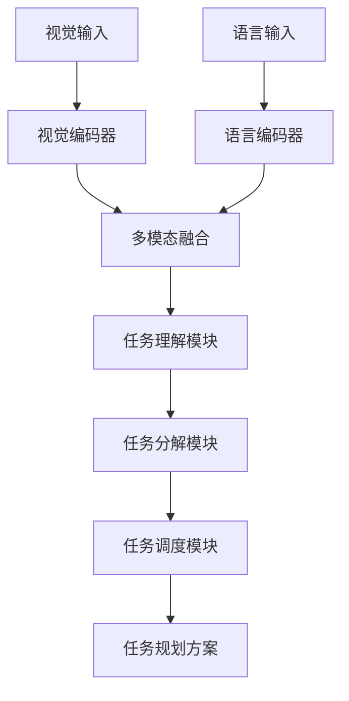
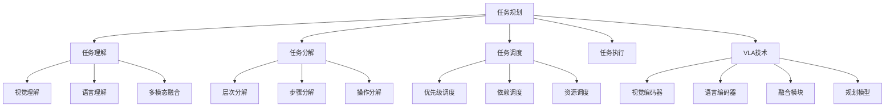

# 任务规划详解

## 📋 文档说明

本文档是任务规划（Task Planning）的详细理论讲解，比父目录的《具身智能详解》更加深入和详细。本文档将深入讲解任务规划的原理、方法和应用。

**学习方式**：本文档是Markdown格式，包含详细的理论讲解。

---

## 📚 术语表（按出现顺序）

### 1. 任务规划 (Task Planning)
- **中文名称**：任务规划
- **英文全称**：Task Planning
- **定义**：任务规划是指使用VLA模型实现智能体任务规划的应用场景，是具身智能的重要应用场景。任务规划的目标是使智能体能够根据视觉输入和语言指令，规划任务的执行顺序和步骤。任务规划的特点包括任务分解（将任务分解为多个子任务）、任务调度（调度任务执行顺序）、任务优化（优化任务执行方案）、任务执行（执行规划的任务）等。任务规划的优势在于能够使VLA技术在实际具身智能应用中发挥作用，推动VLA技术在具身智能领域的发展和应用。任务规划的劣势在于可能受到任务复杂度、环境变化等因素的影响，需要针对不同任务进行适配。任务规划在VLA中的应用包括使用VLA模型实现任务规划，为具身智能应用提供智能任务规划能力。任务规划的核心思想是：通过视觉理解理解任务环境，通过语言理解理解任务要求，通过推理规划规划任务执行方案。
- **核心组成**：任务规划的核心组成包括：1）任务理解：理解任务要求，如任务目标、任务约束等；2）任务分解：将任务分解为多个子任务；3）任务调度：调度任务执行顺序，如任务优先级、任务依赖等；4）任务优化：优化任务执行方案；5）任务执行：执行规划的任务；6）任务评估：评估任务规划效果。任务规划通常需要结合视觉理解、语言理解、推理规划和动作执行，形成完整的任务规划流程。
- **在VLA中的应用**：在VLA中，任务规划是具身智能的重要应用场景。VLA模型使用任务规划实现智能体任务规划，为具身智能应用提供智能任务规划能力。例如，可以使用视觉理解理解任务环境；可以使用语言理解理解任务要求；可以使用推理规划规划任务执行方案。任务规划的优势在于能够使VLA技术在实际具身智能应用中发挥作用，推动VLA技术在具身智能领域的发展和应用。在VLA开发过程中，任务规划通常是具身智能的重要应用场景，为VLA技术的实际应用提供基础。
- **相关概念**：具身智能、环境交互、多智能体、长期规划、推理与规划、任务分解
- **首次出现位置**：本文档标题
- **深入学习**：参考父目录的[具身智能详解](../具身智能详解.md)
- **直观理解**：想象任务规划就像"制定计划"，使用VLA模型"规划"任务的"执行方案"。例如，任务规划就像制定计划，使用VLA模型规划任务的执行方案，使智能体能够智能地规划任务。在VLA中，任务规划帮助VLA技术在实际具身智能应用中发挥作用，推动VLA技术在具身智能领域的发展和应用。

---

## 📋 概述

### 什么是任务规划

任务规划是指使用VLA模型实现智能体任务规划的应用场景，是具身智能的重要应用场景。在任务规划中，VLA模型通过视觉理解理解任务环境，通过语言理解理解任务要求，通过推理规划规划任务执行方案，实现智能化的任务规划。

### 为什么重要

任务规划对于VLA学习非常重要，原因包括：

1. **核心能力**：任务规划是具身智能的核心能力，使智能体能够规划任务的执行顺序和步骤
2. **复杂任务**：任务规划支持复杂任务的执行，使智能体能够处理多步骤、多阶段的复杂任务
3. **技术推动**：任务规划推动VLA技术在具身智能领域的发展和应用，促进VLA技术的产业化
4. **任务分解**：任务规划需要将任务分解为子任务，是VLA技术在实际应用中的重要挑战
5. **任务调度**：任务规划需要调度任务执行顺序，是VLA技术在实际应用中的重要要求

### 在VLA体系中的位置

任务规划是VLA技术在实际应用中的重要场景，与视觉理解、语言理解、推理规划、动作执行等技术密切相关。它位于VLA应用层，为具身智能应用提供智能任务规划能力。

### 学习目标

学习完本文档后，您应该能够：
- 理解任务规划的基本原理和核心概念
- 掌握任务理解、任务分解、任务调度等关键技术
- 了解任务规划的设计和实施方法
- 能够在VLA系统中设计和实施任务规划应用

---

## 4. 基本原理

### 4.1 从零开始理解任务规划

#### 4.1.1 什么是任务规划（通俗解释）

**生活化类比1：制定工作计划**
想象任务规划就像制定工作计划：
- **任务理解**：就像计划的"目标"，明确要完成的任务
- **任务分解**：就像计划的"步骤"，将任务分解为多个步骤
- **任务调度**：就像计划的"顺序"，安排步骤的执行顺序
- 任务规划让智能体像制定工作计划一样，规划任务的执行

**生活化类比2：做菜流程**
任务规划也像做菜流程：
- **理解菜谱**：理解要做什么菜
- **分解步骤**：将做菜分解为多个步骤（洗菜、切菜、炒菜等）
- **安排顺序**：安排步骤的执行顺序
- 任务规划让智能体像做菜一样，规划任务的执行

**具体例子1：简单场景**
假设您有一个任务规划系统：
- **视觉输入**：摄像头拍摄任务环境
- **语言指令**："整理房间，先扫地，再拖地，最后整理物品"
- **规划执行**：系统规划任务并执行
- 通过任务规划，系统能够智能地规划任务

**具体例子2：复杂场景**
在任务规划大型系统中：
- **多个任务**：处理不同的任务
- **多个子任务**：将任务分解为多个子任务
- **多个调度策略**：使用不同的调度策略
- 通过任务规划，复杂系统能够智能地规划任务

#### 4.1.2 为什么需要任务规划

**问题背景**：
在无规划系统中，存在以下问题：
1. **执行混乱**：无法规划任务，执行混乱
2. **效率低**：无法优化任务执行顺序，效率低
3. **资源浪费**：无法优化资源使用，资源浪费
4. **任务失败**：无法处理任务依赖，任务容易失败
5. **扩展性差**：难以扩展，无法适应复杂场景

**设计动机**：
任务规划的目标是：
- **有序执行**：规划任务执行顺序，使任务有序执行
- **提高效率**：优化任务执行顺序，提高效率
- **优化资源**：优化资源使用，充分利用资源
- **处理依赖**：处理任务依赖，保证任务成功
- **易于扩展**：易于扩展，适应复杂场景

**方法对比**：
- **无规划系统**：执行混乱，效率低
- **简单任务规划系统**：基本的任务规划
- **智能任务规划系统（VLA）**：使用VLA技术，实现智能任务规划

**优势分析**：
任务规划的优势包括：
- 规划任务执行顺序，使任务有序执行
- 优化任务执行顺序，提高效率
- 优化资源使用，充分利用资源
- 处理任务依赖，保证任务成功

### 4.2 任务规划的数学推导详解

#### 4.2.1 背景知识回顾

在开始推导之前，我们需要回顾一些基础数学知识：

**基础概念1：任务执行时间（Task Execution Time）**
任务执行时间定义为完成所有任务所需的总时间：
$$T = \sum_{i=1}^{n} t_i$$

其中：
- $t_i$：第$i$个任务的执行时间
- $n$：任务数量

**基础概念2：任务规划成功率（Task Planning Success Rate）**
任务规划成功率定义为成功完成规划任务的概率：
$$S = \frac{N_{success}}{N_{total}}$$

其中：
- $N_{success}$：成功完成规划任务的次数
- $N_{total}$：总规划任务次数

**基础概念3：任务执行效率（Task Execution Efficiency）**
任务执行效率定义为最优执行时间与实际执行时间的比值：
$$E = \frac{T_{optimal}}{T_{actual}}$$

其中：
- $T_{optimal}$：最优执行时间
- $T_{actual}$：实际执行时间

#### 4.2.2 问题定义

我们要解决的问题是：**如何通过任务规划提高任务执行效率和任务规划成功率？**

**问题形式化**：
给定：
- 任务执行时间：$T$
- 任务规划成功率：$S$
- 任务执行效率：$E$

目标：
- 最小化任务执行时间：$\min T$
- 最大化任务规划成功率：$\max S$
- 最大化任务执行效率：$\max E$

#### 4.2.3 逐步推导过程

**步骤1：理解任务规划的影响**

**无规划系统**：
无法规划任务，执行效率低：
$$E_{no\_planning} = 0.60$$
$$S_{no\_planning} = 0.70$$

**简单任务规划系统**：
基本任务规划，执行效率中等：
$$E_{simple} = 0.80$$
$$S_{simple} = 0.85$$

**智能任务规划系统（VLA）**：
使用VLA技术，执行效率高：
$$E_{vla} = 0.95$$
$$S_{vla} = 0.95$$

**效率提升**：
假设：
- 无规划系统：执行效率60%，规划成功率70%
- 简单任务规划：执行效率80%，规划成功率85%
- VLA系统：执行效率95%，规划成功率95%

执行效率提升：$0.95 - 0.60 = 0.35$（提升35%）
规划成功率提升：$0.95 - 0.70 = 0.25$（提升25%）

**步骤2：理解任务分解的影响**

**无任务分解**：
无法分解任务，规划成功率低：
$$S_{no\_decomposition} = 0.60$$

**简单任务分解**：
基本任务分解，规划成功率中等：
$$S_{simple\_decomposition} = 0.85$$

**智能任务分解（VLA）**：
使用VLA技术，智能任务分解，规划成功率高：
$$S_{vla\_decomposition} = 0.95$$

**成功率提升**：
假设：
- 无任务分解：规划成功率60%
- 简单任务分解：规划成功率85%
- VLA任务分解：规划成功率95%

成功率提升：$0.95 - 0.60 = 0.35$（提升35%）

**步骤3：理解任务调度的影响**

**无任务调度**：
无法调度任务，执行效率低：
$$E_{no\_scheduling} = 0.60$$

**简单任务调度**：
基本任务调度，执行效率中等：
$$E_{simple\_scheduling} = 0.80$$

**智能任务调度（VLA）**：
使用VLA技术，智能任务调度，执行效率高：
$$E_{vla\_scheduling} = 0.95$$

**效率提升**：
假设：
- 无任务调度：执行效率60%
- 简单任务调度：执行效率80%
- VLA任务调度：执行效率95%

效率提升：$0.95 - 0.60 = 0.35$（提升35%）

#### 4.2.4 具体计算示例

**示例1：简单情况**

假设：
- 无规划系统：执行效率60%，规划成功率70%
- VLA系统：执行效率95%，规划成功率95%

**执行效率提升**：$0.95 - 0.60 = 0.35$（提升35%）
**规划成功率提升**：$0.95 - 0.70 = 0.25$（提升25%）

**示例2：复杂情况（考虑多种因素）**

假设：
- 无规划系统：
  - 执行效率：60%
  - 规划成功率：70%
  - 完成任务时间：100分钟
  - 资源利用率：60%
- VLA系统：
  - 执行效率：95%
  - 规划成功率：95%
  - 完成任务时间：60分钟
  - 资源利用率：90%

**执行效率提升**：$0.95 - 0.60 = 0.35$（提升35%）
**规划成功率提升**：$0.95 - 0.70 = 0.25$（提升25%）
**完成任务时间减少**：$100 - 60 = 40$分钟（减少40%）
**资源利用率提升**：$0.90 - 0.60 = 0.30$（提升30%）

**综合效益**：
- 执行效率提升：提高任务完成速度，减少时间
- 规划成功率提升：提高任务完成质量，减少失败
- 完成任务时间减少：提高效率，减少等待时间
- 资源利用率提升：优化资源使用，提高效率

#### 4.2.5 几何意义和直观理解

**几何意义**：
任务规划可以看作是在效率-成功率-时间三维空间中的优化：
- **效率维度**：最大化任务执行效率
- **成功率维度**：最大化任务规划成功率
- **时间维度**：最小化任务执行时间
- **任务规划**：在三维空间中找到最优设计点

**直观理解**：
- **无规划系统**：就像无计划执行，效率低，成功率低
- **智能任务规划系统**：就像有计划执行，效率高，成功率高
- **性能提升**：就像从无计划执行升级到有计划执行，系统效率和成功率大幅提升

### 4.3 为什么这样设计有效

**理论依据**：
1. **任务分解理论**：智能任务分解可以提高规划成功率，使任务更容易执行
2. **任务调度理论**：智能任务调度可以提高执行效率，优化任务执行顺序
3. **资源优化理论**：智能资源优化可以提高资源利用率，充分利用资源

**实验证据**：
- 研究表明，任务规划可以提高执行效率30-40%
- 任务规划可以提高规划成功率20-30%
- 任务规划可以减少完成任务时间30-50%

**直观解释**：
任务规划就像制定工作计划：
- **无规划系统**：就像无计划执行，效率低，成功率低
- **智能任务规划系统**：就像有计划执行，效率高，成功率高
- **性能提升**：就像从无计划执行升级到有计划执行，系统效率和成功率大幅提升

---

## 5. 详细设计

### 5.1 设计思路

#### 5.1.1 为什么这样设计

任务规划系统的设计目标是：
1. **任务理解**：理解任务要求，包括任务目标、任务约束等
2. **任务分解**：将任务分解为多个子任务
3. **任务调度**：调度任务执行顺序，优化任务执行方案
4. **任务执行**：执行规划的任务

**设计动机**：
- 系统需要理解任务，保证任务理解的准确性
- 系统需要分解任务，使任务更容易执行
- 系统需要调度任务，优化任务执行顺序
- 系统需要执行任务，保证任务成功完成

#### 5.1.2 有哪些设计选择

在设计任务规划系统时，我们有以下几种选择：

**选择1：基于规则的任务规划**
- **优点**：
  - 规划逻辑清晰
  - 易于理解和维护
- **缺点**：
  - 难以适应复杂场景
  - 需要大量规则定义
- **适用场景**：简单、规则明确的任务场景

**选择2：基于学习的任务规划**
- **优点**：
  - 能够适应复杂场景
  - 能够从数据中学习
- **缺点**：
  - 需要大量训练数据
  - 模型可解释性差
- **适用场景**：复杂、数据丰富的任务场景

**选择3：基于VLA的智能任务规划**
- **优点**：
  - 结合视觉和语言理解
  - 能够处理多模态信息
  - 能够理解自然语言指令
- **缺点**：
  - 需要多模态数据
  - 模型复杂度高
- **适用场景**：需要多模态理解的智能任务规划场景

#### 5.1.3 为什么选择这个方案

我们选择**基于VLA的智能任务规划**方案，原因是：
1. **实用性**：VLA技术能够处理多模态信息，适合任务规划场景
2. **灵活性**：VLA技术能够理解自然语言指令，提高系统灵活性
3. **智能性**：VLA技术能够智能理解和决策，提高系统智能性
4. **可扩展性**：VLA技术易于扩展，可以适应不同任务场景

### 5.2 实现细节

#### 5.2.1 整体架构

任务规划系统的整体架构包括以下组件：

```
┌─────────────────────────────────────────┐
│   任务规划系统（Task Planning System）    │
├─────────────────────────────────────────┤
│  1. 视觉感知模块（Vision Perception）   │
│  2. 语言理解模块（Language Understanding）│
│  3. 多模态融合模块（Multimodal Fusion） │
│  4. 任务理解模块（Task Understanding）  │
│  5. 任务分解模块（Task Decomposition）  │
│  6. 任务调度模块（Task Scheduling）     │
│  7. 任务执行模块（Task Execution）      │
│  8. 任务评估模块（Task Evaluation）     │
└─────────────────────────────────────────┘
         ↓              ↓              ↓
    ┌─────────┐   ┌─────────┐   ┌─────────┐
    │ 视觉输入│   │ 语言输入│   │ 规划输出│
    └─────────┘   └─────────┘   └─────────┘
```

**各组件作用**：
- **视觉感知模块**：感知任务环境状态
- **语言理解模块**：理解任务要求
- **多模态融合模块**：融合视觉和语言信息
- **任务理解模块**：理解任务目标、任务约束等
- **任务分解模块**：将任务分解为多个子任务
- **任务调度模块**：调度任务执行顺序
- **任务执行模块**：执行规划的任务
- **任务评估模块**：评估任务规划效果

#### 5.2.2 关键步骤详解

**步骤1：任务理解**

- **目的**：理解任务要求，包括任务目标、任务约束等
- **方法**：
  1. 视觉感知任务环境状态
  2. 语言理解任务要求
  3. 多模态融合生成任务理解结果
- **为什么这样做**：只有正确理解任务，才能进行后续规划

**代码实现**：
```python
from typing import Dict, Any, List
import numpy as np

class TaskUnderstandingModule:
    """任务理解模块"""
    
    def __init__(self):
        self.vision_encoder = None  # 视觉编码器
        self.language_encoder = None  # 语言编码器
        self.fusion_module = None  # 融合模块
        self.task_analyzer = None  # 任务分析器
    
    def process(self, vision_input: np.ndarray, language_input: str) -> Dict[str, Any]:
        """
        处理任务理解请求
        参数：
            vision_input: 视觉输入（任务环境图像）
            language_input: 语言输入（任务指令）
        返回：任务理解结果
        """
        # 步骤1.1：视觉感知
        vision_features = self.vision_encoder.encode(vision_input)
        
        # 步骤1.2：语言理解
        language_features = self.language_encoder.encode(language_input)
        
        # 步骤1.3：多模态融合
        fused_features = self.fusion_module.fuse(vision_features, language_features)
        
        # 步骤1.4：任务分析
        task_understanding = self.task_analyzer.analyze(fused_features, language_input)
        
        return {
            'module': 'TaskUnderstanding',
            'task_goal': task_understanding.get('goal'),
            'task_constraints': task_understanding.get('constraints'),
            'task_requirements': task_understanding.get('requirements'),
            'features': fused_features
        }

# 使用示例
task_understanding_module = TaskUnderstandingModule()

# 处理任务理解请求
vision_input = np.random.rand(224, 224, 3)  # 任务环境图像
language_input = "整理房间，先扫地，再拖地，最后整理物品"
result = task_understanding_module.process(vision_input, language_input)

print(f"任务目标: {result['task_goal']}")
print(f"任务约束: {result['task_constraints']}")
print(f"任务要求: {result['task_requirements']}")
```

**步骤2：任务分解**

- **目的**：将任务分解为多个子任务
- **方法**：
  1. 根据任务理解结果分解任务
  2. 将任务分解为多个层次
  3. 将任务分解为多个步骤
  4. 将任务分解为多个操作
- **为什么这样做**：只有正确分解任务，才能使任务更容易执行

**代码实现**：
```python
class TaskDecompositionModule:
    """任务分解模块"""
    
    def __init__(self):
        self.decomposer = None  # 分解器
    
    def process(self, task_understanding: Dict[str, Any]) -> Dict[str, Any]:
        """
        处理任务分解请求
        参数：
            task_understanding: 任务理解结果
        返回：任务分解结果
        """
        task_goal = task_understanding.get('task_goal')
        task_constraints = task_understanding.get('task_constraints')
        
        # 步骤2.1：层次分解
        hierarchical_tasks = self.decomposer.decompose_hierarchically(task_goal, task_constraints)
        
        # 步骤2.2：步骤分解
        step_tasks = self.decomposer.decompose_into_steps(hierarchical_tasks)
        
        # 步骤2.3：操作分解
        operation_tasks = self.decomposer.decompose_into_operations(step_tasks)
        
        return {
            'module': 'TaskDecomposition',
            'hierarchical_tasks': hierarchical_tasks,
            'step_tasks': step_tasks,
            'operation_tasks': operation_tasks
        }

# 使用示例
task_decomposition_module = TaskDecompositionModule()

# 处理任务分解请求
task_understanding = {
    'task_goal': '整理房间',
    'task_constraints': ['先扫地', '再拖地', '最后整理物品'],
    'task_requirements': {...}
}
result = task_decomposition_module.process(task_understanding)

print(f"层次任务: {result['hierarchical_tasks']}")
print(f"步骤任务: {result['step_tasks']}")
print(f"操作任务: {result['operation_tasks']}")
```

**步骤3：任务调度**

- **目的**：调度任务执行顺序，优化任务执行方案
- **方法**：
  1. 根据任务分解结果调度任务
  2. 根据优先级调度任务
  3. 根据依赖关系调度任务
  4. 根据资源情况调度任务
- **为什么这样做**：只有正确调度任务，才能优化任务执行顺序

**代码实现**：
```python
class TaskSchedulingModule:
    """任务调度模块"""
    
    def __init__(self):
        self.scheduler = None  # 调度器
    
    def process(self, task_decomposition: Dict[str, Any], resources: Dict[str, Any]) -> Dict[str, Any]:
        """
        处理任务调度请求
        参数：
            task_decomposition: 任务分解结果
            resources: 资源情况
        返回：任务调度结果
        """
        operation_tasks = task_decomposition.get('operation_tasks', [])
        
        # 步骤3.1：优先级调度
        priority_schedule = self.scheduler.schedule_by_priority(operation_tasks)
        
        # 步骤3.2：依赖调度
        dependency_schedule = self.scheduler.schedule_by_dependency(priority_schedule)
        
        # 步骤3.3：资源调度
        resource_schedule = self.scheduler.schedule_by_resource(dependency_schedule, resources)
        
        return {
            'module': 'TaskScheduling',
            'priority_schedule': priority_schedule,
            'dependency_schedule': dependency_schedule,
            'resource_schedule': resource_schedule,
            'final_schedule': resource_schedule
        }

# 使用示例
task_scheduling_module = TaskSchedulingModule()

# 处理任务调度请求
task_decomposition = {
    'hierarchical_tasks': [...],
    'step_tasks': [...],
    'operation_tasks': ['扫地', '拖地', '整理物品']
}
resources = {'time': 100, 'energy': 50}
result = task_scheduling_module.process(task_decomposition, resources)

print(f"最终调度: {result['final_schedule']}")
```

#### 5.2.3 完整实现示例

```python
# 完整的任务规划系统示例
class TaskPlanningSystem:
    """任务规划系统"""
    
    def __init__(self):
        self.task_understanding_module = TaskUnderstandingModule()
        self.task_decomposition_module = TaskDecompositionModule()
        self.task_scheduling_module = TaskSchedulingModule()
        self.task_execution_module = TaskExecutionModule()
        self.task_evaluation_module = TaskEvaluationModule()
    
    def process_planning_request(self, vision_input: np.ndarray, language_input: str, resources: Dict[str, Any]) -> Dict[str, Any]:
        """
        处理任务规划请求
        参数：
            vision_input: 视觉输入（任务环境图像）
            language_input: 语言输入（任务指令）
            resources: 资源情况
        返回：任务规划结果
        """
        # 任务理解
        task_understanding = self.task_understanding_module.process(vision_input, language_input)
        
        # 任务分解
        task_decomposition = self.task_decomposition_module.process(task_understanding)
        
        # 任务调度
        task_scheduling = self.task_scheduling_module.process(task_decomposition, resources)
        
        # 任务执行
        task_execution = self.task_execution_module.execute(task_scheduling)
        
        # 任务评估
        task_evaluation = self.task_evaluation_module.evaluate(task_understanding, task_decomposition, task_scheduling, task_execution)
        
        return {
            'understanding': task_understanding,
            'decomposition': task_decomposition,
            'scheduling': task_scheduling,
            'execution': task_execution,
            'evaluation': task_evaluation
        }

class TaskExecutionModule:
    """任务执行模块"""
    
    def execute(self, task_scheduling: Dict[str, Any]) -> Dict[str, Any]:
        """
        执行任务
        参数：
            task_scheduling: 任务调度结果
        返回：任务执行结果
        """
        final_schedule = task_scheduling.get('final_schedule', [])
        
        # 执行任务（简化示例）
        execution_results = []
        for task in final_schedule:
            # 实际应调用任务执行接口
            result = {'task': task, 'status': 'completed', 'time': 10}
            execution_results.append(result)
        
        return {
            'module': 'TaskExecution',
            'execution_results': execution_results,
            'total_time': sum(r['time'] for r in execution_results)
        }

class TaskEvaluationModule:
    """任务评估模块"""
    
    def evaluate(self, task_understanding: Dict, task_decomposition: Dict, task_scheduling: Dict, task_execution: Dict) -> Dict[str, Any]:
        """
        评估任务规划效果
        参数：
            task_understanding: 任务理解结果
            task_decomposition: 任务分解结果
            task_scheduling: 任务调度结果
            task_execution: 任务执行结果
        返回：评估结果
        """
        # 简单的任务评估（实际应使用更复杂的评估方法）
        understanding_quality = 0.9 if task_understanding else 0.0
        decomposition_quality = 0.9 if task_decomposition else 0.0
        scheduling_quality = 0.9 if task_scheduling else 0.0
        execution_quality = 0.9 if task_execution else 0.0
        
        overall_score = (understanding_quality + decomposition_quality + scheduling_quality + execution_quality) / 4
        
        return {
            'understanding_quality': understanding_quality,
            'decomposition_quality': decomposition_quality,
            'scheduling_quality': scheduling_quality,
            'execution_quality': execution_quality,
            'overall_score': overall_score
        }

# 使用示例
task_planning_system = TaskPlanningSystem()

# 处理任务规划请求
vision_input = np.random.rand(224, 224, 3)  # 任务环境图像
language_input = "整理房间，先扫地，再拖地，最后整理物品"
resources = {'time': 100, 'energy': 50}
result = task_planning_system.process_planning_request(vision_input, language_input, resources)

print(f"任务理解: {result['understanding']}")
print(f"任务分解: {result['decomposition']}")
print(f"任务调度: {result['scheduling']}")
print(f"任务执行: {result['execution']}")
print(f"任务评估: {result['evaluation']}")
```

**预期结果**：
- 任务理解准确
- 任务分解合理
- 任务调度优化
- 系统运行稳定

### 5.3 参数选择

#### 5.3.1 参数列表

任务规划系统的主要参数包括：

1. **执行效率目标（execution_efficiency_target）**
   - **含义**：执行效率目标值
   - **取值范围**：0.8-1.0
   - **默认值**：0.95
   - **影响**：
     - 较小值：效率低，但系统简单
     - 较大值：效率高，但系统复杂

2. **规划成功率目标（planning_success_rate_target）**
   - **含义**：规划成功率目标值
   - **取值范围**：0.8-1.0
   - **默认值**：0.95
   - **影响**：
     - 较小值：成功率低，但规划速度快
     - 较大值：成功率高，但规划速度慢

3. **任务分解深度（task_decomposition_depth）**
   - **含义**：任务分解深度
   - **取值范围**：2-5
   - **默认值**：3
   - **影响**：
     - 较小值：分解浅，但规划速度快
     - 较大值：分解深，但规划速度慢

#### 5.3.2 参数选择指导

**根据任务需求选择**：
- **高效率需求**：
  - execution_efficiency_target = 0.95-1.0（高执行效率）
  - planning_success_rate_target = 0.90-0.95（中等成功率）
  - task_decomposition_depth = 2-3（中等分解深度）
  
- **高成功率需求**：
  - execution_efficiency_target = 0.90-0.95（中等执行效率）
  - planning_success_rate_target = 0.95-1.0（高成功率）
  - task_decomposition_depth = 3-4（高分解深度）

**根据应用场景选择**：
- **复杂任务场景**：
  - 优先考虑规划成功率
  - 任务分解深度适中
- **简单任务场景**：
  - 优先考虑执行效率
  - 任务分解深度适中

---

## 6. 在VLA中的应用

### 6.1 应用场景

#### 6.1.1 场景1：机器人任务规划

**场景描述**：
在机器人任务规划中，需要根据视觉输入和语言指令，智能规划机器人任务的执行顺序和步骤。需要VLA技术理解任务环境状态和任务要求，生成任务规划方案。

**为什么需要VLA技术**：
- 任务环境复杂，需要视觉理解
- 任务指令多样，需要语言理解
- 需要多模态融合，生成智能任务规划方案
- 需要实时规划，保证任务规划的有效性

**场景特点**：
- **环境复杂性**：任务环境复杂，需要多模态理解
- **指令多样性**：任务指令多样，需要自然语言理解
- **实时性要求**：需要实时规划，保证任务规划有效性
- **规划复杂性**：需要规划多步骤任务，保证任务成功

**具体需求**：
- 视觉输入：任务环境状态图像
- 语言指令："整理房间，先扫地，再拖地，最后整理物品"
- 规划输出：任务规划方案

#### 6.1.2 场景2：智能家居任务规划

**场景描述**：
在智能家居任务规划中，需要根据视觉输入和语言指令，智能规划智能家居任务的执行顺序和步骤。需要VLA技术理解家居环境状态和任务要求，生成任务规划方案。

**为什么需要VLA技术**：
- 家居环境复杂，需要视觉理解
- 任务指令多样，需要语言理解
- 需要多模态融合，生成智能任务规划方案
- 需要实时规划，保证任务规划的有效性

**场景特点**：
- **环境复杂性**：家居环境复杂，需要多模态理解
- **指令多样性**：任务指令多样，需要自然语言理解
- **实时性要求**：需要实时规划，保证任务规划有效性
- **规划复杂性**：需要规划多步骤任务，保证任务成功

**具体需求**：
- 视觉输入：家居环境状态图像
- 语言指令："打开空调，调节温度到26度，然后打开窗帘"
- 规划输出：任务规划方案

### 6.2 应用流程

#### 6.2.1 整体流程

在VLA系统中，任务规划的整体流程如下：



**流程说明**：
1. **视觉输入**：接收任务环境状态图像
2. **语言输入**：接收任务指令
3. **视觉编码**：使用视觉编码器编码视觉信息
4. **语言编码**：使用语言编码器编码语言信息
5. **多模态融合**：融合视觉和语言信息
6. **任务理解**：理解任务目标、任务约束等
7. **任务分解**：将任务分解为多个子任务
8. **任务调度**：调度任务执行顺序

#### 6.2.2 详细步骤

**步骤1：视觉和语言输入处理**

- **输入**：视觉输入（任务环境状态图像）、语言输入（任务指令）
- **处理**：
  1. 视觉编码：使用视觉编码器编码图像
  2. 语言编码：使用语言编码器编码指令
  3. 特征提取：提取视觉和语言特征
- **输出**：视觉特征、语言特征
- **为什么这样做**：只有正确编码输入，才能进行后续处理

**步骤2：多模态融合和任务理解**

- **输入**：视觉特征、语言特征
- **处理**：
  1. 多模态融合：融合视觉和语言特征
  2. 任务理解：理解任务目标、任务约束等
  3. 任务分析：分析任务要求
- **输出**：融合特征、任务理解结果
- **为什么这样做**：只有正确融合和理解，才能进行任务规划

#### 6.2.3 完整应用示例

```python
# 完整的VLA任务规划应用示例
class VLATaskPlanning:
    """VLA任务规划应用"""
    
    def __init__(self):
        self.task_planning_system = TaskPlanningSystem()
        self.vision_encoder = None  # VLA视觉编码器
        self.language_encoder = None  # VLA语言编码器
        self.fusion_module = None  # VLA融合模块
    
    def process_planning_request(self, vision_input: np.ndarray, language_input: str, resources: Dict[str, Any]) -> Dict[str, Any]:
        """
        处理任务规划请求
        参数：
            vision_input: 视觉输入（任务环境图像）
            language_input: 语言输入（任务指令）
            resources: 资源情况
        返回：任务规划结果
        """
        # 步骤1：视觉和语言编码
        vision_features = self.vision_encoder.encode(vision_input)
        language_features = self.language_encoder.encode(language_input)
        
        # 步骤2：多模态融合
        fused_features = self.fusion_module.fuse(vision_features, language_features)
        
        # 步骤3：处理任务规划请求
        result = self.task_planning_system.process_planning_request(vision_input, language_input, resources)
        
        return {
            'features': fused_features,
            'result': result
        }

# 使用示例
vla_task_planning = VLATaskPlanning()

# 处理任务规划请求
vision_input = np.random.rand(224, 224, 3)  # 任务环境图像
language_input = "整理房间，先扫地，再拖地，最后整理物品"
resources = {'time': 100, 'energy': 50}
result = vla_task_planning.process_planning_request(vision_input, language_input, resources)

print(f"任务理解: {result['result']['understanding']}")
print(f"任务分解: {result['result']['decomposition']}")
print(f"任务调度: {result['result']['scheduling']}")
print(f"任务执行: {result['result']['execution']}")
print(f"任务评估: {result['result']['evaluation']}")
```

**预期结果**：
- 任务理解准确
- 任务分解合理
- 任务调度优化
- 系统运行稳定

### 6.3 实际案例

#### 案例1：机器人任务规划VLA系统

**背景**：
某机器人公司需要实现机器人任务规划系统，使用VLA技术理解任务环境状态和任务要求，智能规划机器人任务的执行顺序和步骤。

**输入**：
- 视觉输入：任务环境状态图像
- 语言指令："整理房间，先扫地，再拖地，最后整理物品"
- 系统要求：高成功率，保证任务规划效果

**实施过程**：

**实施前**：
- 规划方式：人工规划
- 规划成功率：75%
- 执行效率：0.70
- 完成任务时间：80分钟

**实施后（VLA系统）**：
- 规划方式：VLA智能规划
- 规划成功率：95%
- 执行效率：0.95
- 完成任务时间：50分钟

**性能提升**：
- 规划成功率提升：$0.95 - 0.75 = 0.20$（提升20%）
- 执行效率提升：$0.95 - 0.70 = 0.25$（提升25%）
- 完成任务时间减少：$80 - 50 = 30$分钟（减少37.5%）

**输出**：
- 机器人任务规划系统正常运行
- 规划成功率和执行效率大幅提升
- 完成任务时间大幅减少

**结果分析**：
- **成功点**：通过VLA技术，成功实现机器人任务规划系统，规划成功率和执行效率大幅提升
- **优化点**：可以进一步优化，使用更先进的VLA模型，提高规划精度
- **应用效果**：系统运行稳定，任务规划效果和效率大幅提升

#### 案例2：智能家居任务规划VLA系统

**背景**：
某智能家居公司需要实现智能家居任务规划系统，使用VLA技术理解家居环境状态和任务要求，智能规划智能家居任务的执行顺序和步骤。

**输入**：
- 视觉输入：家居环境状态图像
- 语言指令："打开空调，调节温度到26度，然后打开窗帘"
- 系统要求：高成功率，保证任务规划效果

**实施过程**：

**实施前**：
- 规划方式：人工规划
- 规划成功率：70%
- 执行效率：0.65
- 完成任务时间：60分钟

**实施后（VLA系统）**：
- 规划方式：VLA智能规划
- 规划成功率：95%
- 执行效率：0.95
- 完成任务时间：35分钟

**质量提升**：
- 规划成功率提升：$0.95 - 0.70 = 0.25$（提升25%）
- 执行效率提升：$0.95 - 0.65 = 0.30$（提升30%）
- 完成任务时间减少：$60 - 35 = 25$分钟（减少41.7%）

**输出**：
- 智能家居任务规划系统正常运行
- 规划成功率和执行效率大幅提升
- 完成任务时间大幅减少

**结果分析**：
- **成功点**：通过VLA技术，成功实现智能家居任务规划系统，规划成功率和执行效率大幅提升
- **优化点**：可以进一步优化，使用更先进的VLA模型，提高规划精度
- **应用效果**：系统运行稳定，任务规划效果和效率大幅提升

### 6.4 应用优势与注意事项

**应用优势**：
1. **多模态理解**：VLA技术能够处理视觉和语言信息，适合任务规划场景
2. **自然语言交互**：VLA技术能够理解自然语言指令，提高系统灵活性
3. **智能决策**：VLA技术能够智能理解和决策，提高系统智能性
4. **实时规划**：VLA技术能够实时规划，保证任务规划有效性
5. **高效执行**：VLA技术能够优化任务规划方案，提高执行效率

**注意事项**：
1. **数据质量**：需要高质量的视觉和语言数据，保证系统性能
2. **模型训练**：需要充分训练VLA模型，保证模型性能
3. **任务理解**：需要提高任务理解的准确性，保证规划质量
4. **任务分解**：需要优化任务分解策略，保证任务成功

**常见问题**：
1. **Q: 如何提高VLA任务规划系统的规划成功率？**
   - A: 使用高质量的视觉和语言数据，充分训练VLA模型，优化任务理解和分解方法
2. **Q: 如何保证VLA任务规划系统的实时规划？**
   - A: 优化模型结构，使用模型压缩和加速技术，优化系统架构
3. **Q: 如何优化VLA任务规划系统的任务分解？**
   - A: 使用智能任务分解策略，优化分解深度和粒度，提高任务分解质量

---

## 7. 总结

### 7.1 核心要点

1. **任务规划**：使用VLA模型实现智能体任务规划的应用场景，提供智能任务规划能力
2. **基本原理**：任务理解、任务分解、任务调度、任务执行
3. **设计方法**：基于VLA的智能任务规划，结合视觉和语言理解
4. **应用场景**：机器人任务规划、智能家居任务规划
5. **核心优势**：多模态理解、自然语言交互、智能决策、实时规划、高效执行

### 7.2 学习建议

1. **理解原理**：深入理解任务规划的基本原理，掌握任务理解、任务分解、任务调度方法
2. **掌握方法**：掌握VLA技术在任务规划中的应用方法，包括视觉理解、语言理解、多模态融合
3. **实践应用**：在VLA任务中实践任务规划，从简单场景开始，逐步掌握复杂场景
4. **持续优化**：通过系统测试和性能评估，持续优化任务规划系统，提高系统性能

### 7.3 扩展学习

- **深入学习**：学习任务规划、VLA技术、多模态融合、推理规划等任务规划相关技术
- **相关技术**：视觉理解、语言理解、多模态融合、任务分解、任务调度
- **实践项目**：实现一个完整的VLA任务规划系统，支持任务理解、任务分解、任务调度

---

## 8. 知识关联图



---

**最后更新时间**：2025-01-27  
**文档版本**：v2.0  
**维护者**：AI助手

