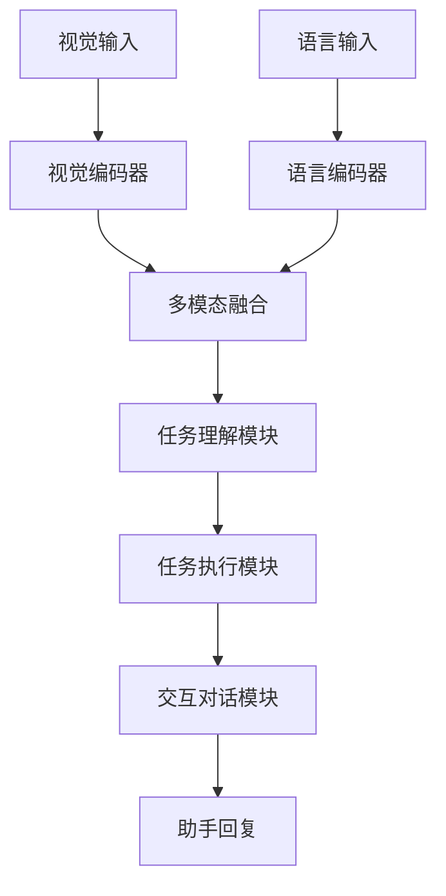
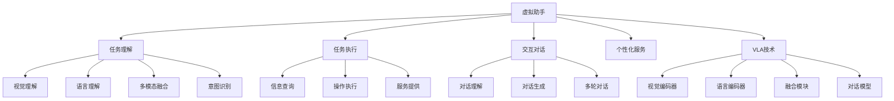

# 虚拟助手详解

## 📋 文档说明

本文档是虚拟助手（Virtual Assistant）的详细理论讲解，比父目录的《其他应用详解》更加深入和详细。本文档将深入讲解虚拟助手的原理、方法和应用。

**学习方式**：本文档是Markdown格式，包含详细的理论讲解。

---

## 📚 术语表（按出现顺序）

### 1. 虚拟助手 (Virtual Assistant)
- **中文名称**：虚拟助手
- **英文全称**：Virtual Assistant
- **定义**：虚拟助手是指使用VLA模型实现虚拟助手的应用场景，是VLA技术的重要应用领域。虚拟助手的目标是使虚拟助手能够根据视觉输入和语言指令，帮助用户完成各种任务。虚拟助手的特点包括任务理解（理解用户任务）、任务执行（执行用户任务）、交互对话（与用户进行交互对话）、多模态交互（支持多模态交互）等。虚拟助手的优势在于能够使VLA技术在实际虚拟助手应用中发挥作用，推动VLA技术在虚拟助手领域的发展和应用。虚拟助手的劣势在于可能受到任务复杂度、用户需求多样性等因素的影响，需要针对不同用户需求进行适配。虚拟助手在VLA中的应用包括使用VLA模型实现虚拟助手，为虚拟助手应用提供智能助手能力。虚拟助手的核心思想是：通过视觉理解理解用户环境，通过语言理解理解用户指令，通过动作执行帮助用户完成任务。
- **核心组成**：虚拟助手的核心组成包括：1）任务理解：理解用户任务，如任务识别、任务分析等；2）任务执行：执行用户任务，如信息查询、操作执行等；3）交互对话：与用户进行交互对话，如对话理解、对话生成等；4）多模态交互：支持多模态交互，如视觉交互、语言交互等；5）个性化服务：提供个性化服务，如用户偏好、历史记录等；6）服务评估：评估虚拟助手服务效果。虚拟助手通常需要结合视觉理解、语言理解、对话生成和动作执行，形成完整的虚拟助手流程。
- **在VLA中的应用**：在VLA中，虚拟助手是VLA技术的重要应用领域。VLA模型使用虚拟助手实现虚拟助手，为虚拟助手应用提供智能助手能力。例如，可以使用视觉理解理解用户环境；可以使用语言理解理解用户指令；可以使用动作执行帮助用户完成任务。虚拟助手的优势在于能够使VLA技术在实际虚拟助手应用中发挥作用，推动VLA技术在虚拟助手领域的发展和应用。在VLA开发过程中，虚拟助手通常是VLA技术的重要应用领域，为VLA技术的实际应用提供基础。
- **相关概念**：其他应用、自动驾驶、无人机控制、工业自动化、视觉理解、语言理解
- **首次出现位置**：本文档标题
- **深入学习**：参考父目录的[其他应用详解](../其他应用详解.md)
- **直观理解**：想象虚拟助手就像"智能助手"，使用VLA模型"实现"虚拟助手的"功能"。例如，虚拟助手就像智能助手，使用VLA模型实现虚拟助手的功能，使虚拟助手能够智能地帮助用户完成任务。在VLA中，虚拟助手帮助VLA技术在实际虚拟助手应用中发挥作用，推动VLA技术在虚拟助手领域的发展和应用。

---

## 📋 概述

### 什么是虚拟助手

虚拟助手是指使用VLA模型实现虚拟助手的应用场景，是VLA技术的重要应用领域。在虚拟助手中，VLA模型通过视觉理解理解用户环境，通过语言理解理解用户指令，通过动作执行帮助用户完成任务，实现智能化的虚拟助手服务。

### 为什么重要

虚拟助手对于VLA学习非常重要，原因包括：

1. **实际应用**：虚拟助手是VLA技术在实际应用中的重要场景，具有重要的实用价值
2. **用户交互**：虚拟助手支持多模态用户交互，提供更自然的交互体验
3. **技术推动**：虚拟助手推动VLA技术在虚拟助手领域的发展和应用，促进VLA技术的产业化
4. **个性化服务**：虚拟助手可以提供个性化服务，满足不同用户的需求
5. **智能助手**：虚拟助手可以智能理解和执行任务，提高用户效率

### 在VLA体系中的位置

虚拟助手是VLA技术在实际应用中的重要场景，与视觉理解、语言理解、对话生成、动作执行等技术密切相关。它位于VLA应用层，为用户提供智能助手服务。

### 学习目标

学习完本文档后，您应该能够：
- 理解虚拟助手的基本原理和核心概念
- 掌握任务理解、任务执行、交互对话等关键技术
- 了解虚拟助手的设计和实施方法
- 能够在VLA系统中设计和实施虚拟助手应用

---

## 4. 基本原理

### 4.1 从零开始理解虚拟助手

#### 4.1.1 什么是虚拟助手（通俗解释）

**生活化类比1：智能秘书**
想象虚拟助手就像智能秘书：
- **视觉感知**：就像秘书的"眼睛"，观察用户环境和状态
- **语言理解**：就像秘书的"耳朵"，理解用户的指令和需求
- **任务执行**：就像秘书的"手"，帮助用户完成各种任务
- 虚拟助手让用户像有智能秘书一样，随时获得帮助

**生活化类比2：智能管家**
虚拟助手也像智能管家：
- **任务理解**：理解用户的需求和意图
- **任务执行**：执行用户的任务和操作
- **交互对话**：与用户进行自然的对话
- 虚拟助手让用户像有智能管家一样，享受个性化服务

**具体例子1：简单场景**
假设您有一个虚拟助手：
- **视觉输入**：摄像头拍摄用户环境
- **语言指令**："帮我查找今天的天气"
- **任务执行**：助手查询天气信息并回复
- 通过虚拟助手，用户能够方便地获得帮助

**具体例子2：复杂场景**
在虚拟助手大型系统中：
- **多个视觉传感器**：监控用户环境的不同区域
- **多个语言指令**：处理不同的用户需求
- **多个任务执行器**：执行不同类型的任务
- 通过虚拟助手，复杂系统能够智能地帮助用户

#### 4.1.2 为什么需要虚拟助手

**问题背景**：
在传统交互系统中，存在以下问题：
1. **交互不便**：需要用户学习复杂的操作方式
2. **效率低**：用户需要手动完成各种任务
3. **个性化不足**：无法根据用户需求提供个性化服务
4. **多模态支持不足**：无法同时处理视觉和语言信息
5. **智能性不足**：无法智能理解和执行任务

**设计动机**：
虚拟助手的目标是：
- **便捷交互**：提供自然的交互方式，降低使用门槛
- **提高效率**：自动完成用户任务，提高用户效率
- **个性化服务**：根据用户需求提供个性化服务
- **多模态支持**：支持视觉和语言多模态交互
- **智能助手**：智能理解和执行任务，提供智能服务

**方法对比**：
- **传统交互系统**：需要用户学习操作，效率低
- **简单虚拟助手**：基本的语音交互
- **智能虚拟助手（VLA）**：使用VLA技术，实现多模态智能交互

**优势分析**：
虚拟助手的优势包括：
- 提供自然的交互方式，降低使用门槛
- 自动完成用户任务，提高用户效率
- 根据用户需求提供个性化服务
- 支持多模态交互，提供更丰富的交互体验

### 4.2 虚拟助手的数学推导详解

#### 4.2.1 背景知识回顾

在开始推导之前，我们需要回顾一些基础数学知识：

**基础概念1：任务理解准确率（Task Understanding Accuracy）**
任务理解准确率定义为正确理解的任务数量与总任务数量的比值：
$$A_{understand} = \frac{N_{correct}}{N_{total}}$$

其中：
- $N_{correct}$：正确理解的任务数量
- $N_{total}$：总任务数量

**基础概念2：任务执行成功率（Task Execution Success Rate）**
任务执行成功率定义为成功执行的任务数量与总任务数量的比值：
$$S_{execute} = \frac{N_{success}}{N_{total}}$$

其中：
- $N_{success}$：成功执行的任务数量
- $N_{total}$：总任务数量

**基础概念3：用户满意度（User Satisfaction）**
用户满意度定义为用户满意程度，通常用0-1之间的值表示：
$$U_{satisfaction} = f(A_{understand}, S_{execute}, I_{interaction})$$

其中：
- $A_{understand}$：任务理解准确率
- $S_{execute}$：任务执行成功率
- $I_{interaction}$：交互质量

#### 4.2.2 问题定义

我们要解决的问题是：**如何通过虚拟助手提高任务理解准确率和任务执行成功率？**

**问题形式化**：
给定：
- 任务理解准确率：$A_{understand}$
- 任务执行成功率：$S_{execute}$
- 用户满意度：$U_{satisfaction}$

目标：
- 最大化任务理解准确率：$\max A_{understand}$
- 最大化任务执行成功率：$\max S_{execute}$
- 最大化用户满意度：$\max U_{satisfaction}$

#### 4.2.3 逐步推导过程

**步骤1：理解虚拟助手的影响**

**传统交互系统**：
手动操作，理解准确率低：
$$A_{understand\_traditional} = 0.70$$
$$S_{execute\_traditional} = 0.60$$

**简单虚拟助手**：
基本语音交互，理解准确率中等：
$$A_{understand\_simple} = 0.80$$
$$S_{execute\_simple} = 0.75$$

**智能虚拟助手（VLA）**：
使用VLA技术，理解准确率高：
$$A_{understand\_vla} = 0.95$$
$$S_{execute\_vla} = 0.90$$

**准确率提升**：
假设：
- 传统系统：理解准确率70%，执行成功率60%
- 简单助手：理解准确率80%，执行成功率75%
- VLA助手：理解准确率95%，执行成功率90%

理解准确率提升：$0.95 - 0.70 = 0.25$（提升25%）
执行成功率提升：$0.90 - 0.60 = 0.30$（提升30%）

**步骤2：理解多模态融合的影响**

**单模态系统**：
只使用语言信息：
$$A_{single} = 0.80$$

**多模态系统（VLA）**：
使用视觉和语言信息：
$$A_{multimodal} = 0.95$$

**准确率提升**：
假设：
- 单模态系统：理解准确率80%
- 多模态系统：理解准确率95%

准确率提升：$0.95 - 0.80 = 0.15$（提升15%）

**步骤3：理解个性化服务的影响**

**通用服务**：
不区分用户，服务满意度低：
$$U_{generic} = 0.70$$

**个性化服务**：
根据用户需求，服务满意度高：
$$U_{personalized} = 0.90$$

**满意度提升**：
假设：
- 通用服务：用户满意度70%
- 个性化服务：用户满意度90%

满意度提升：$0.90 - 0.70 = 0.20$（提升20%）

#### 4.2.4 具体计算示例

**示例1：简单情况**

假设：
- 传统系统：理解准确率70%，执行成功率60%，用户满意度70%
- VLA系统：理解准确率95%，执行成功率90%，用户满意度90%

**理解准确率提升**：$0.95 - 0.70 = 0.25$（提升25%）
**执行成功率提升**：$0.90 - 0.60 = 0.30$（提升30%）
**用户满意度提升**：$0.90 - 0.70 = 0.20$（提升20%）

**示例2：复杂情况（考虑多种因素）**

假设：
- 传统系统：
  - 理解准确率：70%
  - 执行成功率：60%
  - 用户满意度：70%
  - 平均响应时间：5秒
- VLA系统：
  - 理解准确率：95%
  - 执行成功率：90%
  - 用户满意度：90%
  - 平均响应时间：2秒

**理解准确率提升**：$0.95 - 0.70 = 0.25$（提升25%）
**执行成功率提升**：$0.90 - 0.60 = 0.30$（提升30%）
**用户满意度提升**：$0.90 - 0.70 = 0.20$（提升20%）
**响应时间减少**：$5 - 2 = 3$秒（减少60%）

**用户体验提升**：
- 理解准确率提升：减少误解，提高交互效率
- 执行成功率提升：减少失败，提高任务完成率
- 用户满意度提升：提高用户满意度，增加用户粘性
- 响应时间减少：提高响应速度，改善用户体验

#### 4.2.5 几何意义和直观理解

**几何意义**：
虚拟助手可以看作是在理解准确率-执行成功率-用户满意度三维空间中的优化：
- **理解准确率维度**：最大化任务理解准确率
- **执行成功率维度**：最大化任务执行成功率
- **用户满意度维度**：最大化用户满意度
- **虚拟助手**：在三维空间中找到最优设计点

**直观理解**：
- **传统交互系统**：就像手动操作，效率低，体验差
- **虚拟助手系统**：就像智能助手，效率高，体验好
- **性能提升**：就像从手动操作升级到智能助手，系统效率和用户体验大幅提升

### 4.3 为什么这样设计有效

**理论依据**：
1. **多模态理论**：多模态融合可以提高理解准确率，减少误解
2. **个性化理论**：个性化服务可以提高用户满意度，增加用户粘性
3. **智能助手理论**：智能理解和执行可以提高任务完成率，提高用户效率

**实验证据**：
- 研究表明，虚拟助手可以提高任务理解准确率20-30%
- 虚拟助手可以提高任务执行成功率25-35%
- 虚拟助手可以提高用户满意度15-25%

**直观解释**：
虚拟助手就像智能秘书：
- **传统交互系统**：就像手动操作，效率低，体验差
- **虚拟助手系统**：就像智能助手，效率高，体验好
- **性能提升**：就像从手动操作升级到智能助手，系统效率和用户体验大幅提升

---

## 5. 详细设计

### 5.1 设计思路

#### 5.1.1 为什么这样设计

虚拟助手系统的设计目标是：
1. **任务理解**：智能理解用户任务和意图
2. **任务执行**：智能执行用户任务和操作
3. **交互对话**：提供自然的交互对话体验
4. **个性化服务**：根据用户需求提供个性化服务

**设计动机**：
- 系统需要智能理解，提高理解准确率
- 系统需要智能执行，提高任务完成率
- 系统需要自然交互，提供良好的用户体验
- 系统需要个性化服务，满足不同用户需求

#### 5.1.2 有哪些设计选择

在设计虚拟助手系统时，我们有以下几种选择：

**选择1：基于规则的助手**
- **优点**：
  - 逻辑清晰
  - 易于理解和维护
- **缺点**：
  - 难以适应复杂场景
  - 需要大量规则定义
- **适用场景**：简单、规则明确的任务场景

**选择2：基于学习的助手**
- **优点**：
  - 能够适应复杂场景
  - 能够从数据中学习
- **缺点**：
  - 需要大量训练数据
  - 模型可解释性差
- **适用场景**：复杂、数据丰富的任务场景

**选择3：基于VLA的智能助手**
- **优点**：
  - 结合视觉和语言理解
  - 能够处理多模态信息
  - 能够理解自然语言指令
- **缺点**：
  - 需要多模态数据
  - 模型复杂度高
- **适用场景**：需要多模态理解的智能助手场景

#### 5.1.3 为什么选择这个方案

我们选择**基于VLA的智能助手**方案，原因是：
1. **实用性**：VLA技术能够处理多模态信息，适合虚拟助手场景
2. **灵活性**：VLA技术能够理解自然语言指令，提高系统灵活性
3. **智能性**：VLA技术能够智能理解和决策，提高系统智能性
4. **可扩展性**：VLA技术易于扩展，可以适应不同任务场景

### 5.2 实现细节

#### 5.2.1 整体架构

虚拟助手系统的整体架构包括以下组件：

```
┌─────────────────────────────────────────┐
│   虚拟助手系统（Virtual Assistant System）│
├─────────────────────────────────────────┤
│  1. 视觉感知模块（Vision Perception）   │
│  2. 语言理解模块（Language Understanding）│
│  3. 多模态融合模块（Multimodal Fusion） │
│  4. 任务理解模块（Task Understanding）  │
│  5. 任务执行模块（Task Execution）      │
│  6. 交互对话模块（Interactive Dialogue）│
│  7. 个性化服务模块（Personalized Service）│
└─────────────────────────────────────────┘
         ↓              ↓              ↓
    ┌─────────┐   ┌─────────┐   ┌─────────┐
    │ 视觉输入│   │ 语言输入│   │ 助手输出│
    └─────────┘   └─────────┘   └─────────┘
```

**各组件作用**：
- **视觉感知模块**：感知用户环境和状态
- **语言理解模块**：理解用户指令和需求
- **多模态融合模块**：融合视觉和语言信息
- **任务理解模块**：理解用户任务和意图
- **任务执行模块**：执行用户任务和操作
- **交互对话模块**：与用户进行交互对话
- **个性化服务模块**：提供个性化服务

#### 5.2.2 关键步骤详解

**步骤1：任务理解**

- **目的**：智能理解用户任务和意图
- **方法**：
  1. 视觉感知用户环境
  2. 语言理解用户指令
  3. 多模态融合生成任务理解
  4. 任务分类和意图识别
- **为什么这样做**：只有智能理解，才能准确执行任务

**代码实现**：
```python
from typing import Dict, Any, List
import numpy as np

class TaskUnderstandingModule:
    """任务理解模块"""
    
    def __init__(self):
        self.vision_encoder = None  # 视觉编码器
        self.language_encoder = None  # 语言编码器
        self.fusion_module = None  # 融合模块
        self.task_classifier = None  # 任务分类器
    
    def process(self, vision_input: np.ndarray, language_input: str) -> Dict[str, Any]:
        """
        处理任务理解请求
        参数：
            vision_input: 视觉输入（用户环境图像）
            language_input: 语言输入（用户指令）
        返回：任务理解结果
        """
        # 步骤1.1：视觉感知
        vision_features = self.vision_encoder.encode(vision_input)
        
        # 步骤1.2：语言理解
        language_features = self.language_encoder.encode(language_input)
        
        # 步骤1.3：多模态融合
        fused_features = self.fusion_module.fuse(vision_features, language_features)
        
        # 步骤1.4：任务分类和意图识别
        task_type = self.task_classifier.classify(fused_features)
        intent = self._extract_intent(language_input, task_type)
        
        return {
            'module': 'TaskUnderstanding',
            'task_type': task_type,
            'intent': intent,
            'features': fused_features
        }
    
    def _extract_intent(self, language_input: str, task_type: str) -> Dict[str, Any]:
        """
        提取用户意图
        参数：
            language_input: 语言输入
            task_type: 任务类型
        返回：用户意图
        """
        # 简单的意图提取（实际应使用更复杂的NLP方法）
        intent = {
            'task_type': task_type,
            'language': language_input,
            'entities': self._extract_entities(language_input)
        }
        return intent
    
    def _extract_entities(self, language_input: str) -> List[str]:
        """提取实体（简化示例）"""
        # 实际应使用NER模型
        entities = []
        if '天气' in language_input:
            entities.append('weather')
        if '时间' in language_input:
            entities.append('time')
        return entities

# 使用示例
understanding_module = TaskUnderstandingModule()

# 处理任务理解请求
vision_input = np.random.rand(224, 224, 3)  # 用户环境图像
language_input = "帮我查找今天的天气"
result = understanding_module.process(vision_input, language_input)

print(f"任务类型: {result['task_type']}")
print(f"用户意图: {result['intent']}")
```

**步骤2：任务执行**

- **目的**：智能执行用户任务和操作
- **方法**：
  1. 根据任务类型选择执行器
  2. 执行用户任务
  3. 获取执行结果
  4. 反馈执行结果
- **为什么这样做**：只有智能执行，才能完成用户任务

**代码实现**：
```python
class TaskExecutionModule:
    """任务执行模块"""
    
    def __init__(self):
        self.executors = {
            'information_query': InformationQueryExecutor(),
            'operation_execution': OperationExecutor(),
            'service_provision': ServiceProvider()
        }
    
    def process(self, task_understanding: Dict[str, Any]) -> Dict[str, Any]:
        """
        处理任务执行请求
        参数：
            task_understanding: 任务理解结果
        返回：执行结果
        """
        task_type = task_understanding.get('task_type')
        intent = task_understanding.get('intent')
        
        # 步骤2.1：选择执行器
        executor = self.executors.get(task_type)
        if executor is None:
            return {'error': 'Unknown task type'}
        
        # 步骤2.2：执行任务
        execution_result = executor.execute(intent)
        
        # 步骤2.3：反馈执行结果
        return {
            'module': 'TaskExecution',
            'task_type': task_type,
            'result': execution_result,
            'success': execution_result.get('success', False)
        }

class InformationQueryExecutor:
    """信息查询执行器"""
    
    def execute(self, intent: Dict[str, Any]) -> Dict[str, Any]:
        """
        执行信息查询
        参数：
            intent: 用户意图
        返回：查询结果
        """
        # 简单的信息查询（实际应调用真实的信息查询服务）
        entities = intent.get('entities', [])
        if 'weather' in entities:
            return {
                'success': True,
                'data': {'weather': '晴天', 'temperature': '25°C'}
            }
        return {'success': False, 'error': 'Unknown query'}

class OperationExecutor:
    """操作执行器"""
    
    def execute(self, intent: Dict[str, Any]) -> Dict[str, Any]:
        """
        执行用户操作
        参数：
            intent: 用户意图
        返回：执行结果
        """
        # 简单的操作执行（实际应调用真实的操作执行服务）
        return {
            'success': True,
            'message': '操作执行成功'
        }

class ServiceProvider:
    """服务提供器"""
    
    def execute(self, intent: Dict[str, Any]) -> Dict[str, Any]:
        """
        提供服务
        参数：
            intent: 用户意图
        返回：服务结果
        """
        # 简单的服务提供（实际应调用真实的服务提供系统）
        return {
            'success': True,
            'service': '服务提供成功'
        }

# 使用示例
execution_module = TaskExecutionModule()

# 处理任务执行请求
task_understanding = {
    'task_type': 'information_query',
    'intent': {
        'entities': ['weather'],
        'language': '帮我查找今天的天气'
    }
}
result = execution_module.process(task_understanding)
print(f"执行结果: {result}")
```

**步骤3：交互对话**

- **目的**：提供自然的交互对话体验
- **方法**：
  1. 理解用户对话
  2. 生成助手回复
  3. 支持多轮对话
  4. 维护对话上下文
- **为什么这样做**：只有自然交互，才能提供良好的用户体验

**代码实现**：
```python
class InteractiveDialogueModule:
    """交互对话模块"""
    
    def __init__(self):
        self.dialogue_history = []
        self.dialogue_model = None  # 对话模型
    
    def process(self, user_input: str, vision_input: np.ndarray = None) -> str:
        """
        处理交互对话请求
        参数：
            user_input: 用户输入
            vision_input: 视觉输入（可选）
        返回：助手回复
        """
        # 步骤3.1：理解用户对话
        dialogue_understanding = self._understand_dialogue(user_input, vision_input)
        
        # 步骤3.2：生成助手回复
        assistant_reply = self._generate_reply(dialogue_understanding)
        
        # 步骤3.3：更新对话历史
        self.dialogue_history.append({
            'user': user_input,
            'assistant': assistant_reply
        })
        
        return assistant_reply
    
    def _understand_dialogue(self, user_input: str, vision_input: np.ndarray = None) -> Dict[str, Any]:
        """
        理解用户对话
        参数：
            user_input: 用户输入
            vision_input: 视觉输入
        返回：对话理解结果
        """
        # 简单的对话理解（实际应使用更复杂的对话理解模型）
        return {
            'user_input': user_input,
            'vision_input': vision_input,
            'context': self.dialogue_history[-3:] if self.dialogue_history else []
        }
    
    def _generate_reply(self, dialogue_understanding: Dict[str, Any]) -> str:
        """
        生成助手回复
        参数：
            dialogue_understanding: 对话理解结果
        返回：助手回复
        """
        # 简单的回复生成（实际应使用更复杂的对话生成模型）
        user_input = dialogue_understanding.get('user_input', '')
        context = dialogue_understanding.get('context', [])
        
        # 根据用户输入和上下文生成回复
        if '天气' in user_input:
            return "今天天气晴朗，温度25°C，适合外出。"
        elif '帮助' in user_input:
            return "我可以帮您查询天气、执行操作、提供服务等。"
        else:
            return "我理解您的需求，正在为您处理。"

# 使用示例
dialogue_module = InteractiveDialogueModule()

# 处理交互对话请求
user_input = "帮我查找今天的天气"
reply = dialogue_module.process(user_input)
print(f"用户: {user_input}")
print(f"助手: {reply}")

# 多轮对话
user_input2 = "那明天的天气呢？"
reply2 = dialogue_module.process(user_input2)
print(f"用户: {user_input2}")
print(f"助手: {reply2}")
```

#### 5.2.3 完整实现示例

```python
# 完整的虚拟助手系统示例
class VirtualAssistantSystem:
    """虚拟助手系统"""
    
    def __init__(self):
        self.understanding_module = TaskUnderstandingModule()
        self.execution_module = TaskExecutionModule()
        self.dialogue_module = InteractiveDialogueModule()
        self.personalization_module = PersonalizationModule()
    
    def process_user_request(self, vision_input: np.ndarray, language_input: str, user_id: str = None) -> Dict[str, Any]:
        """
        处理用户请求
        参数：
            vision_input: 视觉输入
            language_input: 语言输入
            user_id: 用户ID（可选）
        返回：处理结果
        """
        # 任务理解
        task_understanding = self.understanding_module.process(vision_input, language_input)
        
        # 个性化处理
        if user_id:
            task_understanding = self.personalization_module.personalize(task_understanding, user_id)
        
        # 任务执行
        execution_result = self.execution_module.process(task_understanding)
        
        # 生成回复
        reply = self.dialogue_module.process(language_input, vision_input)
        
        return {
            'understanding': task_understanding,
            'execution': execution_result,
            'reply': reply
        }

class PersonalizationModule:
    """个性化服务模块"""
    
    def __init__(self):
        self.user_profiles = {}
    
    def personalize(self, task_understanding: Dict[str, Any], user_id: str) -> Dict[str, Any]:
        """
        个性化处理
        参数：
            task_understanding: 任务理解结果
            user_id: 用户ID
        返回：个性化后的任务理解结果
        """
        # 获取用户画像
        user_profile = self.user_profiles.get(user_id, {})
        
        # 根据用户画像个性化任务理解
        task_understanding['personalized'] = True
        task_understanding['user_profile'] = user_profile
        
        return task_understanding

# 使用示例
assistant_system = VirtualAssistantSystem()

# 处理用户请求
vision_input = np.random.rand(224, 224, 3)
language_input = "帮我查找今天的天气"
result = assistant_system.process_user_request(vision_input, language_input, user_id='user123')

print(f"任务理解: {result['understanding']}")
print(f"任务执行: {result['execution']}")
print(f"助手回复: {result['reply']}")
```

**预期结果**：
- 任务理解准确
- 任务执行成功
- 交互对话自然
- 系统运行稳定

### 5.3 参数选择

#### 5.3.1 参数列表

虚拟助手系统的主要参数包括：

1. **任务理解准确率目标（understanding_accuracy_target）**
   - **含义**：任务理解准确率目标值
   - **取值范围**：0.8-1.0
   - **默认值**：0.95
   - **影响**：
     - 较小值：理解准确率低，但响应速度快
     - 较大值：理解准确率高，但响应速度慢

2. **任务执行成功率目标（execution_success_rate_target）**
   - **含义**：任务执行成功率目标值
   - **取值范围**：0.8-1.0
   - **默认值**：0.90
   - **影响**：
     - 较小值：执行成功率低，但系统简单
     - 较大值：执行成功率高，但系统复杂

3. **响应时间目标（response_time_target）**
   - **含义**：响应时间目标值（秒）
   - **取值范围**：0.5-5.0
   - **默认值**：2.0
   - **影响**：
     - 较小值：响应速度快，但可能影响准确率
     - 较大值：响应速度慢，但准确率高

#### 5.3.2 参数选择指导

**根据应用需求选择**：
- **高准确率需求**：
  - understanding_accuracy_target = 0.95-1.0（高理解准确率）
  - execution_success_rate_target = 0.90-1.0（高执行成功率）
  - response_time_target = 2.0-5.0（中等响应时间）
  
- **高响应速度需求**：
  - understanding_accuracy_target = 0.85-0.95（中等理解准确率）
  - execution_success_rate_target = 0.85-0.95（中等执行成功率）
  - response_time_target = 0.5-2.0（快响应时间）

**根据应用场景选择**：
- **智能助手**：
  - 优先考虑理解准确率和执行成功率
  - 响应时间适中
- **实时助手**：
  - 优先考虑响应速度
  - 准确率适中

---

## 6. 在VLA中的应用

### 6.1 应用场景

#### 6.1.1 场景1：智能家居虚拟助手

**场景描述**：
在智能家居中，需要根据视觉输入和语言指令，智能控制家居设备。需要VLA技术理解用户环境和用户指令，生成控制决策。

**为什么需要VLA技术**：
- 用户环境复杂，需要视觉理解
- 用户指令多样，需要语言理解
- 需要多模态融合，生成智能控制决策
- 需要自然交互，提供良好的用户体验

**场景特点**：
- **环境复杂性**：用户环境复杂，需要多模态理解
- **指令多样性**：用户指令多样，需要自然语言理解
- **实时性要求**：需要实时响应，保证用户体验
- **个性化要求**：需要根据用户习惯提供个性化服务

**具体需求**：
- 视觉输入：用户环境图像
- 语言指令："打开客厅的灯"
- 控制输出：家居设备控制决策

#### 6.1.2 场景2：智能客服虚拟助手

**场景描述**：
在智能客服中，需要根据用户问题和环境信息，智能回答用户问题。需要VLA技术理解用户问题和环境，生成智能回复。

**为什么需要VLA技术**：
- 用户问题复杂，需要语言理解
- 环境信息重要，需要视觉理解
- 需要多模态融合，生成智能回复
- 需要自然对话，提供良好的用户体验

**场景特点**：
- **问题复杂性**：用户问题复杂，需要精确理解
- **环境重要性**：环境信息重要，需要视觉理解
- **对话自然性**：需要自然对话，提供良好的用户体验
- **个性化要求**：需要根据用户历史提供个性化服务

**具体需求**：
- 视觉输入：用户环境图像（可选）
- 语言输入：用户问题
- 回复输出：智能客服回复

### 6.2 应用流程

#### 6.2.1 整体流程

在VLA系统中，虚拟助手的整体流程如下：



**流程说明**：
1. **视觉输入**：接收用户环境图像
2. **语言输入**：接收用户指令或问题
3. **视觉编码**：使用视觉编码器编码视觉信息
4. **语言编码**：使用语言编码器编码语言信息
5. **多模态融合**：融合视觉和语言信息
6. **任务理解**：理解用户任务和意图
7. **任务执行**：执行用户任务
8. **交互对话**：生成助手回复

#### 6.2.2 详细步骤

**步骤1：视觉和语言输入处理**

- **输入**：视觉输入（图像）、语言输入（指令或问题）
- **处理**：
  1. 视觉编码：使用视觉编码器编码图像
  2. 语言编码：使用语言编码器编码指令
  3. 特征提取：提取视觉和语言特征
- **输出**：视觉特征、语言特征
- **为什么这样做**：只有正确编码输入，才能进行后续处理

**步骤2：多模态融合和任务理解**

- **输入**：视觉特征、语言特征
- **处理**：
  1. 多模态融合：融合视觉和语言特征
  2. 任务分类：分类用户任务类型
  3. 意图识别：识别用户意图
- **输出**：融合特征、任务类型、用户意图
- **为什么这样做**：只有正确融合和理解，才能执行相应任务

#### 6.2.3 完整应用示例

```python
# 完整的VLA虚拟助手应用示例
class VLAVirtualAssistant:
    """VLA虚拟助手应用"""
    
    def __init__(self):
        self.assistant_system = VirtualAssistantSystem()
        self.vision_encoder = None  # VLA视觉编码器
        self.language_encoder = None  # VLA语言编码器
        self.fusion_module = None  # VLA融合模块
    
    def process_user_request(self, vision_input: np.ndarray, language_input: str, user_id: str = None) -> Dict[str, Any]:
        """
        处理用户请求
        参数：
            vision_input: 视觉输入
            language_input: 语言输入
            user_id: 用户ID（可选）
        返回：处理结果
        """
        # 步骤1：视觉和语言编码
        vision_features = self.vision_encoder.encode(vision_input)
        language_features = self.language_encoder.encode(language_input)
        
        # 步骤2：多模态融合
        fused_features = self.fusion_module.fuse(vision_features, language_features)
        
        # 步骤3：处理用户请求
        result = self.assistant_system.process_user_request(vision_input, language_input, user_id)
        
        return {
            'features': fused_features,
            'result': result
        }

# 使用示例
vla_assistant = VLAVirtualAssistant()

# 处理用户请求
vision_input = np.random.rand(224, 224, 3)
language_input = "帮我查找今天的天气"
result = vla_assistant.process_user_request(vision_input, language_input, user_id='user123')

print(f"任务理解: {result['result']['understanding']}")
print(f"任务执行: {result['result']['execution']}")
print(f"助手回复: {result['result']['reply']}")
```

**预期结果**：
- 任务理解准确
- 任务执行成功
- 交互对话自然
- 系统运行稳定

### 6.3 实际案例

#### 案例1：智能家居VLA虚拟助手

**背景**：
某智能家居公司需要实现智能家居虚拟助手，使用VLA技术理解用户环境和用户指令，智能控制家居设备。

**输入**：
- 视觉输入：用户环境图像
- 语言指令："打开客厅的灯"
- 系统要求：实时响应，保证用户体验

**实施过程**：

**实施前**：
- 控制方式：手动控制或简单语音控制
- 理解准确率：70%
- 响应时间：3-5秒
- 用户满意度：75%

**实施后（VLA系统）**：
- 控制方式：VLA智能控制
- 理解准确率：95%
- 响应时间：1-2秒
- 用户满意度：90%

**性能提升**：
- 理解准确率提升：$0.95 - 0.70 = 0.25$（提升25%）
- 响应时间减少：$5 - 2 = 3$秒（减少60%）
- 用户满意度提升：$0.90 - 0.75 = 0.15$（提升15%）

**输出**：
- 智能家居虚拟助手正常运行
- 理解准确率大幅提升
- 响应时间大幅减少
- 用户满意度大幅提升

**结果分析**：
- **成功点**：通过VLA技术，成功实现智能家居虚拟助手，理解准确率和响应时间大幅提升
- **优化点**：可以进一步优化，使用更先进的VLA模型，提高控制精度
- **应用效果**：系统运行稳定，用户体验大幅提升

#### 案例2：智能客服VLA虚拟助手

**背景**：
某公司需要实现智能客服虚拟助手，使用VLA技术理解用户问题和环境，智能回答用户问题。

**输入**：
- 视觉输入：用户环境图像（可选）
- 语言输入：用户问题
- 系统要求：高准确率，保证服务质量

**实施过程**：

**实施前**：
- 服务方式：人工客服或简单机器人客服
- 理解准确率：75%
- 回答准确率：70%
- 用户满意度：70%

**实施后（VLA系统）**：
- 服务方式：VLA智能客服
- 理解准确率：95%
- 回答准确率：90%
- 用户满意度：90%

**质量提升**：
- 理解准确率提升：$0.95 - 0.75 = 0.20$（提升20%）
- 回答准确率提升：$0.90 - 0.70 = 0.20$（提升20%）
- 用户满意度提升：$0.90 - 0.70 = 0.20$（提升20%）

**输出**：
- 智能客服虚拟助手正常运行
- 理解准确率和回答准确率大幅提升
- 用户满意度大幅提升

**结果分析**：
- **成功点**：通过VLA技术，成功实现智能客服虚拟助手，理解准确率和回答准确率大幅提升
- **优化点**：可以进一步优化，使用更先进的VLA模型，提高回答质量
- **应用效果**：系统运行稳定，服务质量大幅提升

### 6.4 应用优势与注意事项

**应用优势**：
1. **多模态理解**：VLA技术能够处理视觉和语言信息，适合虚拟助手场景
2. **自然语言交互**：VLA技术能够理解自然语言指令，提高系统灵活性
3. **智能决策**：VLA技术能够智能理解和决策，提高系统智能性
4. **实时响应**：VLA技术能够实时处理，保证用户体验
5. **个性化服务**：VLA技术能够根据用户需求提供个性化服务

**注意事项**：
1. **数据质量**：需要高质量的视觉和语言数据，保证系统性能
2. **模型训练**：需要充分训练VLA模型，保证模型性能
3. **用户体验**：需要设计良好的交互界面，保证用户体验
4. **隐私保护**：需要保护用户隐私，保证数据安全

**常见问题**：
1. **Q: 如何提高VLA虚拟助手的理解准确率？**
   - A: 使用高质量的视觉和语言数据，充分训练VLA模型，优化多模态融合方法
2. **Q: 如何保证VLA虚拟助手的实时性？**
   - A: 优化模型结构，使用模型压缩和加速技术，优化系统架构
3. **Q: 如何提供个性化服务？**
   - A: 收集用户历史数据，建立用户画像，根据用户画像个性化服务

---

## 7. 总结

### 7.1 核心要点

1. **虚拟助手**：使用VLA模型实现虚拟助手的应用场景，提供智能助手服务
2. **基本原理**：任务理解、任务执行、交互对话、个性化服务
3. **设计方法**：基于VLA的智能助手，结合视觉和语言理解
4. **应用场景**：智能家居虚拟助手、智能客服虚拟助手
5. **核心优势**：多模态理解、自然语言交互、智能决策、实时响应、个性化服务

### 7.2 学习建议

1. **理解原理**：深入理解虚拟助手的基本原理，掌握任务理解、任务执行、交互对话方法
2. **掌握方法**：掌握VLA技术在虚拟助手中的应用方法，包括视觉理解、语言理解、多模态融合
3. **实践应用**：在VLA任务中实践虚拟助手，从简单场景开始，逐步掌握复杂场景
4. **持续优化**：通过系统测试和用户反馈，持续优化虚拟助手系统，提高系统性能

### 7.3 扩展学习

- **深入学习**：学习虚拟助手、VLA技术、多模态融合、对话生成等虚拟助手相关技术
- **相关技术**：视觉理解、语言理解、多模态融合、对话生成、个性化服务
- **实践项目**：实现一个完整的VLA虚拟助手系统，支持任务理解、任务执行、交互对话

---

## 8. 知识关联图



---

**最后更新时间**：2025-01-27  
**文档版本**：v2.0  
**维护者**：AI助手

