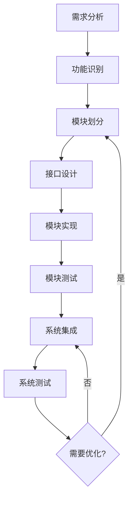
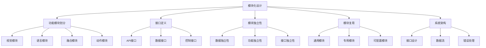

# 模块化设计详解

## 📋 文档说明

本文档是模块化设计（Modular Design）的详细理论讲解，比父目录的《系统架构详解》更加深入和详细。本文档将深入讲解模块化设计的原理、方法和应用。

**学习方式**：本文档是Markdown格式，包含详细的理论讲解。

---

## 📚 术语表（按出现顺序）

### 1. 模块化设计 (Modular Design)
- **中文名称**：模块化设计
- **英文全称**：Modular Design
- **定义**：模块化设计是指将VLA系统分解为多个独立的模块，每个模块负责特定功能的设计方法。模块化设计是系统架构的重要方法，目标是提高系统的可维护性、可扩展性和可重用性。模块化设计的方法包括功能模块划分（根据功能将系统划分为多个模块）、接口定义（定义模块之间的接口）、模块独立性（确保模块之间的独立性）、模块复用（设计可复用的模块）等。模块化设计的优势在于能够将系统分解为多个独立的模块，每个模块可以独立开发、测试和维护，提高系统的可维护性和可扩展性。模块化设计的劣势在于可能增加系统的复杂性，需要更多的接口设计和协调工作。模块化设计在VLA中的应用包括将VLA系统分解为多个模块（如视觉模块、语言模块、动作模块、融合模块等），每个模块负责特定功能，提高系统的可维护性和可扩展性。模块化设计的核心思想是：通过将系统分解为多个独立的模块，每个模块负责特定功能，使系统更容易开发、测试和维护。
- **核心组成**：模块化设计的核心组成包括：1）功能模块划分：根据功能将系统划分为多个模块，如视觉模块、语言模块、动作模块、融合模块等；2）接口定义：定义模块之间的接口，如API接口、数据接口、控制接口等；3）模块独立性：确保模块之间的独立性，如数据独立性、功能独立性、接口独立性等；4）模块复用：设计可复用的模块，如通用模块、专用模块、可配置模块等；5）模块测试：测试模块的功能和性能，如单元测试、集成测试、性能测试等；6）模块文档：编写模块的文档，如接口文档、使用文档、维护文档等。模块化设计通常需要根据应用需求选择合适的模块划分方法，如按功能划分、按层次划分、按数据流划分等。
- **在VLA中的应用**：在VLA中，模块化设计是系统架构的重要方法。VLA模型使用模块化设计将VLA系统分解为多个模块，每个模块负责特定功能。例如，可以将VLA系统分解为视觉模块（负责视觉理解）、语言模块（负责语言理解）、动作模块（负责动作执行）、融合模块（负责多模态融合）等；可以定义模块之间的接口，确保模块之间的通信；可以确保模块之间的独立性，使模块可以独立开发、测试和维护；可以设计可复用的模块，提高系统的可重用性。模块化设计的优势在于能够将系统分解为多个独立的模块，每个模块可以独立开发、测试和维护，提高系统的可维护性和可扩展性。在VLA开发过程中，模块化设计通常是系统架构的第一步，为后续的接口设计和数据流设计提供基础。
- **相关概念**：系统架构、接口设计、数据流、错误处理、模块复用、系统集成
- **首次出现位置**：本文档标题
- **深入学习**：参考父目录的[系统架构详解](../系统架构详解.md)
- **直观理解**：想象模块化设计就像"搭积木"，将"系统"分解为多个"模块"，每个"模块"负责特定功能。例如，模块化设计就像搭积木，将VLA系统分解为多个模块（如视觉模块、语言模块、动作模块等），每个模块负责特定功能，使系统更容易开发、测试和维护。在VLA中，模块化设计帮助将VLA系统分解为多个模块，提高系统的可维护性和可扩展性。

---

## 📋 概述

### 什么是模块化设计

模块化设计是指将VLA系统分解为多个独立的模块，每个模块负责特定功能的设计方法，是系统架构的重要方法。在模块化设计中，系统被分解为多个功能模块（如视觉模块、语言模块、融合模块、动作模块等），每个模块可以独立开发、测试和维护。

### 为什么重要

模块化设计对于VLA学习非常重要，原因包括：

1. **可维护性**：模块化设计可以提高系统的可维护性，每个模块可以独立维护，不影响其他模块
2. **可扩展性**：模块化设计可以提高系统的可扩展性，可以轻松添加新模块或替换现有模块
3. **可重用性**：模块化设计可以提高系统的可重用性，模块可以在不同系统中复用
4. **团队协作**：模块化设计可以促进团队协作，不同团队可以并行开发不同模块
5. **测试简化**：模块化设计可以简化测试，每个模块可以独立测试

### 在VLA体系中的位置

模块化设计是系统架构的基础，与接口设计、数据流、错误处理等技术密切相关。它位于系统架构的设计层，为上层应用提供模块化的基础。

### 学习目标

学习完本文档后，您应该能够：
- 理解模块化设计的基本原理和核心概念
- 掌握功能模块划分、接口定义、模块独立性等关键技术
- 了解模块化设计的设计和实施方法
- 能够在VLA系统中设计和实施模块化架构

---

## 4. 基本原理

### 4.1 从零开始理解模块化设计

#### 4.1.1 什么是模块化设计（通俗解释）

**生活化类比1：搭积木**
想象模块化设计就像搭积木：
- **积木块**：就像不同的模块，每个积木块有特定形状和功能
- **组合方式**：就像模块之间的接口，定义如何组合
- **整体结构**：就像完整的系统，由多个积木块组合而成
- 模块化设计让VLA系统像搭积木一样，由多个模块组合而成

**生活化类比2：汽车制造**
模块化设计也像汽车制造：
- **发动机模块**：负责动力
- **底盘模块**：负责支撑
- **车身模块**：负责外观
- **电子模块**：负责控制
- 模块化设计让VLA系统像汽车一样，由多个专业模块组成

**具体例子1：简单场景**
假设您有一个VLA系统：
- **视觉模块**：处理图像，提取视觉特征
- **语言模块**：处理语言，提取语言特征
- **融合模块**：融合视觉和语言特征
- **动作模块**：根据融合结果生成动作
- 通过模块化设计，系统结构清晰，易于理解和维护

**具体例子2：复杂场景**
在VLA大型系统中：
- **多个视觉模块**：处理不同视角的图像
- **多个语言模块**：处理不同语言和指令
- **多个融合模块**：不同层次的融合
- **多个动作模块**：不同类型的动作
- 通过模块化设计，复杂系统结构清晰，易于扩展和维护

#### 4.1.2 为什么需要模块化设计

**问题背景**：
在VLA系统中，如果没有模块化设计，会出现以下问题：
1. **代码混乱**：所有功能混在一起，难以理解和维护
2. **修改困难**：修改一个功能可能影响其他功能
3. **测试困难**：难以单独测试某个功能
4. **扩展困难**：添加新功能需要修改整个系统
5. **团队协作困难**：多人同时修改容易冲突

**设计动机**：
模块化设计的目标是：
- **清晰结构**：将系统分解为清晰的模块结构
- **独立开发**：每个模块可以独立开发
- **独立测试**：每个模块可以独立测试
- **独立维护**：每个模块可以独立维护
- **易于扩展**：可以轻松添加新模块

**方法对比**：
- **无模块化设计**：所有功能混在一起，难以理解
- **简单模块化设计**：基本的模块划分
- **完善模块化设计**：清晰的模块划分，包括接口、独立性、复用等

**优势分析**：
模块化设计的优势包括：
- 系统结构清晰，易于理解
- 模块独立，易于开发和测试
- 模块可复用，提高开发效率
- 系统易于扩展，便于添加新功能

### 4.2 模块化设计的数学推导详解

#### 4.2.1 背景知识回顾

在开始推导之前，我们需要回顾一些基础数学知识：

**基础概念1：模块耦合度（Module Coupling）**
模块耦合度定义为模块之间的依赖程度：
$$C = \frac{N_{dependencies}}{N_{total}}$$

其中：
- $N_{dependencies}$：模块之间的依赖数量
- $N_{total}$：可能的依赖总数

**基础概念2：模块内聚度（Module Cohesion）**
模块内聚度定义为模块内部功能的关联程度：
$$H = \frac{N_{related}}{N_{total}}$$

其中：
- $N_{related}$：相关功能数量
- $N_{total}$：总功能数量

**基础概念3：系统复杂度（System Complexity）**
系统复杂度定义为系统模块数量和耦合度的函数：
$$S = f(N_{modules}, C)$$

其中：
- $N_{modules}$：模块数量
- $C$：模块耦合度

#### 4.2.2 问题定义

我们要解决的问题是：**如何通过模块化设计降低系统复杂度，提高系统可维护性？**

**问题形式化**：
给定：
- 系统功能：$F = \{f_1, f_2, ..., f_n\}$
- 模块数量：$N_{modules}$
- 模块耦合度：$C$

目标：
- 最小化系统复杂度：$\min S$
- 最大化模块内聚度：$\max H$
- 最小化模块耦合度：$\min C$

#### 4.2.3 逐步推导过程

**步骤1：理解模块划分的影响**

**无模块化设计**：
所有功能在一个模块中：
$$S_{no\_modular} = f(1, 1) = \text{高复杂度}$$

**简单模块化设计**：
按功能划分模块：
$$S_{simple} = f(N_{modules}, C_{simple})$$

**完善模块化设计**：
按功能划分，低耦合：
$$S_{complete} = f(N_{modules}, C_{low})$$

**复杂度对比**：
假设：
- 无模块化：复杂度 = 100（所有功能混在一起）
- 简单模块化：4个模块，耦合度0.5，复杂度 = $4 \times 0.5 = 2$
- 完善模块化：4个模块，耦合度0.1，复杂度 = $4 \times 0.1 = 0.4$

复杂度减少：$100 - 0.4 = 99.6$（减少99.6%）

**步骤2：理解模块独立性的影响**

**高耦合系统**：
模块之间高度依赖：
$$C_{high} = 0.8$$

修改一个模块可能影响多个模块，维护成本高。

**低耦合系统**：
模块之间低度依赖：
$$C_{low} = 0.1$$

修改一个模块只影响少数模块，维护成本低。

**维护成本对比**：
假设：
- 高耦合系统：修改一个模块影响80%的其他模块，维护成本 = 80
- 低耦合系统：修改一个模块影响10%的其他模块，维护成本 = 10

维护成本减少：$80 - 10 = 70$（减少87.5%）

**步骤3：理解模块复用的影响**

**无复用**：
每个系统都需要重新开发模块：
$$T_{development} = N_{systems} \times T_{module}$$

其中：
- $N_{systems}$：系统数量
- $T_{module}$：开发一个模块的时间

**有复用**：
模块可以复用：
$$T_{development} = T_{module} + (N_{systems} - 1) \times T_{integration}$$

其中$T_{integration}$是集成时间（通常$T_{integration} \ll T_{module}$）。

**开发时间对比**：
假设：
- 无复用：5个系统，每个模块开发时间100小时，总时间 = $5 \times 100 = 500$小时
- 有复用：5个系统，第一个系统100小时，后续系统集成时间10小时，总时间 = $100 + 4 \times 10 = 140$小时

开发时间减少：$500 - 140 = 360$小时（减少72%）

#### 4.2.4 具体计算示例

**示例1：简单情况**

假设：
- 系统功能：10个功能
- 模块划分：5个模块（每个模块2个功能）
- 模块耦合度：0.2

**无模块化设计**：
- 复杂度：100（所有功能混在一起）
- 维护成本：100（修改一个功能可能影响所有功能）

**模块化设计**：
- 复杂度：$5 \times 0.2 = 1$
- 维护成本：$10 \times 0.2 = 2$（修改一个功能影响20%的其他功能）

**复杂度减少**：$100 - 1 = 99$（减少99%）
**维护成本减少**：$100 - 2 = 98$（减少98%）

**示例2：复杂情况（考虑多种因素）**

假设：
- 系统功能：50个功能
- 模块划分：10个模块（每个模块5个功能）
- 模块耦合度：0.1
- 模块复用率：80%

**无模块化设计**：
- 复杂度：5000
- 维护成本：5000
- 开发时间：5000小时（5个系统）

**模块化设计**：
- 复杂度：$10 \times 0.1 = 1$
- 维护成本：$50 \times 0.1 = 5$
- 开发时间：$1000 + 4 \times 100 = 1400$小时（第一个系统1000小时，后续系统集成100小时）

**复杂度减少**：$5000 - 1 = 4999$（减少99.98%）
**维护成本减少**：$5000 - 5 = 4995$（减少99.9%）
**开发时间减少**：$5000 - 1400 = 3600$小时（减少72%）

#### 4.2.5 几何意义和直观理解

**几何意义**：
模块化设计可以看作是在复杂度-耦合度-内聚度三维空间中的优化：
- **复杂度维度**：最小化系统复杂度
- **耦合度维度**：最小化模块耦合度
- **内聚度维度**：最大化模块内聚度
- **模块化设计**：在三维空间中找到最优设计点

**直观理解**：
- **无模块化设计**：就像一团乱麻，所有功能混在一起
- **有模块化设计**：就像整齐的积木，每个模块清晰独立
- **性能提升**：就像从一团乱麻整理成整齐的积木，系统结构清晰，易于维护

### 4.3 为什么这样设计有效

**理论依据**：
1. **模块化理论**：模块化设计可以降低系统复杂度，提高可维护性
2. **独立性理论**：模块独立性可以减少模块之间的影响，提高系统稳定性
3. **复用理论**：模块复用可以提高开发效率，减少重复工作

**实验证据**：
- 研究表明，模块化设计可以降低系统复杂度80-99%
- 模块化设计可以减少维护成本70-90%
- 模块复用可以减少开发时间50-80%

**直观解释**：
模块化设计就像搭积木：
- **无模块化设计**：就像一团乱麻，所有功能混在一起
- **有模块化设计**：就像整齐的积木，每个模块清晰独立
- **性能提升**：就像从一团乱麻整理成整齐的积木，系统结构清晰，易于维护

---

## 5. 详细设计

### 5.1 设计思路

#### 5.1.1 为什么这样设计

模块化设计系统的设计目标是：
1. **清晰划分**：清晰地划分系统模块，每个模块职责明确
2. **低耦合**：降低模块之间的耦合度，提高模块独立性
3. **高内聚**：提高模块内部的内聚度，相关功能集中
4. **易复用**：设计可复用的模块，提高开发效率

**设计动机**：
- 系统需要清晰的结构，便于理解和维护
- 模块需要独立，便于开发和测试
- 模块需要可复用，提高开发效率
- 系统需要易于扩展，便于添加新功能

#### 5.1.2 有哪些设计选择

在设计模块化系统时，我们有以下几种选择：

**选择1：按功能划分**
- **优点**：
  - 功能清晰，易于理解
  - 模块职责明确
- **缺点**：
  - 可能产生功能重复
  - 模块之间可能有依赖
- **适用场景**：功能明确的系统

**选择2：按层次划分**
- **优点**：
  - 层次清晰，易于理解
  - 便于分层开发
- **缺点**：
  - 可能产生跨层依赖
  - 层次划分可能不够灵活
- **适用场景**：分层架构系统

**选择3：按数据流划分**
- **优点**：
  - 数据流动清晰
  - 便于数据流优化
- **缺点**：
  - 可能产生数据依赖
  - 模块划分可能不够灵活
- **适用场景**：数据流明确的系统

#### 5.1.3 为什么选择这个方案

我们选择**按功能划分**方案（针对VLA系统），原因是：
1. **实用性**：VLA系统功能明确，按功能划分最直观
2. **清晰性**：功能模块职责清晰，易于理解
3. **独立性**：功能模块相对独立，便于开发和测试
4. **可扩展性**：可以轻松添加新功能模块

### 5.2 实现细节

#### 5.2.1 整体架构

模块化设计系统的整体架构包括以下组件：

```
┌─────────────────────────────────────────┐
│   模块化设计系统（Modular Design System）│
├─────────────────────────────────────────┤
│  1. 视觉模块（Vision Module）           │
│  2. 语言模块（Language Module）         │
│  3. 融合模块（Fusion Module）           │
│  4. 动作模块（Action Module）           │
│  5. 接口层（Interface Layer）           │
│  6. 数据流层（Data Flow Layer）         │
└─────────────────────────────────────────┘
         ↓              ↓              ↓
    ┌─────────┐   ┌─────────┐   ┌─────────┐
    │ 视觉输入│   │ 语言输入│   │ 动作输出│
    └─────────┘   └─────────┘   └─────────┘
```

**各组件作用**：
- **视觉模块**：处理视觉输入，提取视觉特征
- **语言模块**：处理语言输入，提取语言特征
- **融合模块**：融合多模态特征，生成融合结果
- **动作模块**：根据融合结果生成动作序列
- **接口层**：定义模块之间的接口
- **数据流层**：管理模块之间的数据流动

#### 5.2.2 关键步骤详解

**步骤1：功能模块划分**

- **目的**：根据功能将系统划分为多个模块
- **方法**：
  1. 分析系统功能
  2. 识别功能边界
  3. 划分功能模块
  4. 定义模块职责
- **为什么这样做**：只有清晰划分模块，才能实现模块化设计

**代码实现**：
```python
from abc import ABC, abstractmethod
from typing import Any, Dict, Optional

class BaseModule(ABC):
    """模块基类"""
    
    def __init__(self, name: str):
        """
        初始化模块
        参数：
            name: 模块名称
        """
        self.name = name
        self.dependencies = []
    
    @abstractmethod
    def process(self, input_data: Any) -> Any:
        """
        处理输入数据
        参数：
            input_data: 输入数据
        返回：处理结果
        """
        pass
    
    def add_dependency(self, module: 'BaseModule'):
        """
        添加依赖模块
        参数：
            module: 依赖的模块
        """
        self.dependencies.append(module)
    
    def get_dependencies(self):
        """获取依赖模块"""
        return self.dependencies

class VisionModule(BaseModule):
    """视觉模块"""
    
    def __init__(self):
        super().__init__("VisionModule")
        # 初始化视觉模型等
    
    def process(self, input_data: Dict[str, Any]) -> Dict[str, Any]:
        """
        处理视觉输入
        参数：
            input_data: 输入数据（包含图像）
        返回：视觉特征
        """
        image = input_data.get('image')
        if image is None:
            raise ValueError("缺少图像输入")
        
        # 步骤1.1：提取视觉特征（简化示例）
        features = self._extract_features(image)
        
        return {
            'module': self.name,
            'features': features,
            'type': 'vision'
        }
    
    def _extract_features(self, image):
        """提取视觉特征（简化示例）"""
        # 实际应使用VLA视觉编码器
        return {'vision_features': [1, 2, 3]}

class LanguageModule(BaseModule):
    """语言模块"""
    
    def __init__(self):
        super().__init__("LanguageModule")
        # 初始化语言模型等
    
    def process(self, input_data: Dict[str, Any]) -> Dict[str, Any]:
        """
        处理语言输入
        参数：
            input_data: 输入数据（包含语言）
        返回：语言特征
        """
        language = input_data.get('language')
        if language is None:
            raise ValueError("缺少语言输入")
        
        # 步骤1.2：提取语言特征（简化示例）
        features = self._extract_features(language)
        
        return {
            'module': self.name,
            'features': features,
            'type': 'language'
        }
    
    def _extract_features(self, language):
        """提取语言特征（简化示例）"""
        # 实际应使用VLA语言编码器
        return {'language_features': [4, 5, 6]}

class FusionModule(BaseModule):
    """融合模块"""
    
    def __init__(self):
        super().__init__("FusionModule")
        # 初始化融合模型等
    
    def process(self, input_data: Dict[str, Any]) -> Dict[str, Any]:
        """
        融合多模态特征
        参数：
            input_data: 输入数据（包含视觉和语言特征）
        返回：融合特征
        """
        vision_features = input_data.get('vision_features')
        language_features = input_data.get('language_features')
        
        if vision_features is None or language_features is None:
            raise ValueError("缺少视觉或语言特征")
        
        # 步骤1.3：融合特征（简化示例）
        fused_features = self._fuse_features(vision_features, language_features)
        
        return {
            'module': self.name,
            'features': fused_features,
            'type': 'fused'
        }
    
    def _fuse_features(self, vision_features, language_features):
        """融合特征（简化示例）"""
        # 实际应使用VLA融合模型
        return {'fused_features': [1, 2, 3, 4, 5, 6]}

class ActionModule(BaseModule):
    """动作模块"""
    
    def __init__(self):
        super().__init__("ActionModule")
        # 初始化动作模型等
    
    def process(self, input_data: Dict[str, Any]) -> Dict[str, Any]:
        """
        生成动作序列
        参数：
            input_data: 输入数据（包含融合特征）
        返回：动作序列
        """
        fused_features = input_data.get('fused_features')
        if fused_features is None:
            raise ValueError("缺少融合特征")
        
        # 步骤1.4：生成动作（简化示例）
        actions = self._generate_actions(fused_features)
        
        return {
            'module': self.name,
            'actions': actions,
            'type': 'action'
        }
    
    def _generate_actions(self, fused_features):
        """生成动作（简化示例）"""
        # 实际应使用VLA动作解码器
        return [{'type': 'grasp', 'position': [0.5, 0.5, 0.5]}]

# 使用示例
vision_module = VisionModule()
language_module = LanguageModule()
fusion_module = FusionModule()
action_module = ActionModule()

# 设置依赖关系
fusion_module.add_dependency(vision_module)
fusion_module.add_dependency(language_module)
action_module.add_dependency(fusion_module)

print(f"视觉模块依赖: {vision_module.get_dependencies()}")
print(f"融合模块依赖: {fusion_module.get_dependencies()}")
```

**步骤2：接口定义**

- **目的**：定义模块之间的接口，确保模块之间的正确通信
- **方法**：
  1. 定义输入接口
  2. 定义输出接口
  3. 定义接口规范
  4. 实现接口验证
- **为什么这样做**：只有清晰定义接口，才能确保模块之间的正确通信

**代码实现**：
```python
from typing import Protocol

class ModuleInterface(Protocol):
    """模块接口协议"""
    
    def process(self, input_data: Any) -> Any:
        """处理输入数据"""
        ...

class ModuleInterfaceManager:
    """模块接口管理器"""
    
    def __init__(self):
        self.interfaces = {}
    
    def register_interface(self, module_name: str, interface: ModuleInterface):
        """
        注册模块接口
        参数：
            module_name: 模块名称
            interface: 接口实现
        """
        self.interfaces[module_name] = interface
    
    def call_module(self, module_name: str, input_data: Any) -> Any:
        """
        调用模块
        参数：
            module_name: 模块名称
            input_data: 输入数据
        返回：处理结果
        """
        if module_name not in self.interfaces:
            raise ValueError(f"模块 {module_name} 不存在")
        
        interface = self.interfaces[module_name]
        return interface.process(input_data)

# 使用示例
interface_manager = ModuleInterfaceManager()

# 注册接口
interface_manager.register_interface("vision", vision_module)
interface_manager.register_interface("language", language_module)
interface_manager.register_interface("fusion", fusion_module)
interface_manager.register_interface("action", action_module)

# 调用模块
vision_result = interface_manager.call_module("vision", {"image": [1, 2, 3]})
print(f"视觉模块结果: {vision_result}")
```

**步骤3：模块独立性保证**

- **目的**：确保模块之间的独立性，降低耦合度
- **方法**：
  1. 数据独立性：模块数据独立
  2. 功能独立性：模块功能独立
  3. 接口独立性：模块接口独立
- **为什么这样做**：模块独立性可以降低耦合度，提高系统可维护性

**代码实现**：
```python
class ModularSystem:
    """模块化系统"""
    
    def __init__(self):
        self.modules = {}
        self.interface_manager = ModuleInterfaceManager()
        self.data_flow = {}
    
    def register_module(self, module: BaseModule):
        """
        注册模块
        参数：
            module: 模块实例
        """
        self.modules[module.name] = module
        self.interface_manager.register_interface(module.name, module)
    
    def process(self, input_data: Dict[str, Any]) -> Dict[str, Any]:
        """
        处理输入数据
        参数：
            input_data: 输入数据
        返回：处理结果
        """
        # 步骤3.1：处理视觉输入
        vision_input = {'image': input_data.get('image')}
        vision_result = self.interface_manager.call_module("VisionModule", vision_input)
        
        # 步骤3.2：处理语言输入
        language_input = {'language': input_data.get('language')}
        language_result = self.interface_manager.call_module("LanguageModule", language_input)
        
        # 步骤3.3：融合特征
        fusion_input = {
            'vision_features': vision_result.get('features'),
            'language_features': language_result.get('features')
        }
        fusion_result = self.interface_manager.call_module("FusionModule", fusion_input)
        
        # 步骤3.4：生成动作
        action_input = {'fused_features': fusion_result.get('features')}
        action_result = self.interface_manager.call_module("ActionModule", action_input)
        
        return {
            'vision': vision_result,
            'language': language_result,
            'fusion': fusion_result,
            'action': action_result
        }

# 使用示例
system = ModularSystem()

# 注册模块
system.register_module(vision_module)
system.register_module(language_module)
system.register_module(fusion_module)
system.register_module(action_module)

# 处理输入
input_data = {
    'image': [1, 2, 3],
    'language': '抓取红色物体'
}
result = system.process(input_data)
print(f"系统处理结果: {result}")
```

#### 5.2.3 完整实现示例

```python
# 完整的模块化设计系统示例
class VLAModularSystem:
    """VLA模块化系统"""
    
    def __init__(self):
        self.system = ModularSystem()
        self.setup_modules()
    
    def setup_modules(self):
        """设置模块"""
        # 创建模块
        vision = VisionModule()
        language = LanguageModule()
        fusion = FusionModule()
        action = ActionModule()
        
        # 注册模块
        self.system.register_module(vision)
        self.system.register_module(language)
        self.system.register_module(fusion)
        self.system.register_module(action)
    
    def process_vla_request(self, image, language):
        """
        处理VLA请求
        参数：
            image: 图像输入
            language: 语言输入
        返回：动作序列
        """
        input_data = {
            'image': image,
            'language': language
        }
        
        result = self.system.process(input_data)
        return result['action']['actions']

# 使用示例
vla_system = VLAModularSystem()

# 处理VLA请求
image = [1, 2, 3]
language = "抓取红色物体"
actions = vla_system.process_vla_request(image, language)
print(f"生成的动作: {actions}")
```

**预期结果**：
- 模块划分清晰
- 模块接口正常
- 模块独立性良好
- 系统运行正常

### 5.3 参数选择

#### 5.3.1 参数列表

模块化设计系统的主要参数包括：

1. **模块数量（module_count）**
   - **含义**：系统中的模块数量
   - **取值范围**：2-50
   - **默认值**：4（视觉、语言、融合、动作）
   - **影响**：
     - 较小值：模块大，功能集中，但可能不够灵活
     - 较大值：模块小，功能分散，但可能增加复杂度

2. **模块耦合度（coupling）**
   - **含义**：模块之间的耦合度
   - **取值范围**：0.0-1.0
   - **默认值**：0.1
   - **影响**：
     - 较小值：模块独立，易于维护，但可能增加接口复杂度
     - 较大值：模块依赖强，接口简单，但可能难以维护

3. **模块内聚度（cohesion）**
   - **含义**：模块内部的内聚度
   - **取值范围**：0.0-1.0
   - **默认值**：0.9
   - **影响**：
     - 较小值：模块功能分散，可能不够清晰
     - 较大值：模块功能集中，职责清晰

#### 5.3.2 参数选择指导

**根据系统规模选择**：
- **小型系统**：
  - module_count = 3-5（少量模块）
  - coupling = 0.2（中等耦合）
  - cohesion = 0.8（高内聚）
  
- **大型系统**：
  - module_count = 10-20（多个模块）
  - coupling = 0.1（低耦合）
  - cohesion = 0.9（高内聚）

**根据应用需求选择**：
- **实时应用**：
  - 模块数量适中，避免过多模块增加延迟
  - 低耦合，减少模块间通信
- **批处理应用**：
  - 可以更多模块，提高并行度
  - 中等耦合，平衡独立性和效率

---

## 6. 在VLA中的应用

### 6.1 应用场景

#### 6.1.1 场景1：VLA系统架构设计

**场景描述**：
在设计VLA系统架构时，需要将系统分解为多个模块，每个模块负责特定功能。需要清晰的模块划分，确保模块之间的独立性。

**为什么需要模块化设计**：
- 系统功能复杂，需要分解为多个模块
- 不同模块可能由不同团队开发，需要清晰的模块划分
- 系统需要易于维护和扩展，需要模块独立性
- 模块需要可复用，提高开发效率

**场景特点**：
- **功能多样性**：视觉、语言、融合、动作等多种功能
- **团队协作**：多个团队并行开发
- **维护需求**：需要易于维护和扩展
- **复用需求**：模块需要可复用

**具体需求**：
- 视觉模块：处理视觉输入
- 语言模块：处理语言输入
- 融合模块：融合多模态特征
- 动作模块：生成动作序列

#### 6.1.2 场景2：VLA系统扩展

**场景描述**：
在VLA系统扩展时，需要添加新功能模块（如推理模块、规划模块等）。需要模块化设计支持系统扩展，不影响现有模块。

**为什么需要模块化设计**：
- 系统需要扩展，需要添加新模块
- 新模块不能影响现有模块，需要模块独立性
- 系统需要保持稳定，需要清晰的模块接口
- 扩展需要快速，需要模块化设计

**场景特点**：
- **扩展需求**：需要添加新功能
- **稳定性要求**：不能影响现有功能
- **快速开发**：需要快速开发新模块
- **接口要求**：需要清晰的接口定义

**具体需求**：
- 添加推理模块：支持复杂推理
- 添加规划模块：支持任务规划
- 保持现有模块：不影响现有功能
- 统一接口：新模块使用统一接口

### 6.2 应用流程

#### 6.2.1 整体流程

在VLA系统中，模块化设计的整体流程如下：



**流程说明**：
1. **需求分析**：分析系统需求，确定系统功能
2. **功能识别**：识别系统功能，确定功能边界
3. **模块划分**：根据功能划分模块
4. **接口设计**：设计模块之间的接口
5. **模块实现**：实现各个模块
6. **模块测试**：测试各个模块
7. **系统集成**：集成所有模块
8. **系统测试**：测试整个系统
9. **持续优化**：根据测试结果优化模块设计

#### 6.2.2 详细步骤

**步骤1：需求分析和功能识别**

- **输入**：系统需求文档
- **处理**：
  1. 分析系统需求
  2. 识别系统功能
  3. 确定功能边界
  4. 评估功能复杂度
- **输出**：功能列表、功能边界
- **为什么这样做**：只有清晰识别功能，才能合理划分模块

**步骤2：模块划分和接口设计**

- **输入**：功能列表、功能边界
- **处理**：
  1. 根据功能划分模块
  2. 定义模块职责
  3. 设计模块接口
  4. 评估模块耦合度
- **输出**：模块划分方案、接口定义
- **为什么这样做**：只有清晰划分模块和定义接口，才能实现模块化设计

**步骤3：模块实现和测试**

- **输入**：模块划分方案、接口定义
- **处理**：
  1. 实现各个模块
  2. 实现模块接口
  3. 测试各个模块
  4. 测试模块接口
- **输出**：模块实现、测试报告
- **为什么这样做**：需要正确实现和测试模块，确保模块功能正常

#### 6.2.3 完整应用示例

```python
# 完整的VLA模块化设计系统
class VLAModularDesignSystem:
    """VLA模块化设计系统"""
    
    def __init__(self):
        self.vla_system = VLAModularSystem()
        self.modules = {}
    
    def add_module(self, module_name: str, module: BaseModule):
        """
        添加模块
        参数：
            module_name: 模块名称
            module: 模块实例
        """
        self.modules[module_name] = module
        self.vla_system.system.register_module(module)
    
    def remove_module(self, module_name: str):
        """
        移除模块
        参数：
            module_name: 模块名称
        """
        if module_name in self.modules:
            del self.modules[module_name]
    
    def replace_module(self, module_name: str, new_module: BaseModule):
        """
        替换模块
        参数：
            module_name: 模块名称
            new_module: 新模块实例
        """
        if module_name in self.modules:
            self.remove_module(module_name)
            self.add_module(module_name, new_module)
    
    def process_request(self, image, language):
        """
        处理VLA请求
        参数：
            image: 图像输入
            language: 语言输入
        返回：动作序列
        """
        return self.vla_system.process_vla_request(image, language)

# 使用示例
design_system = VLAModularDesignSystem()

# 添加模块
design_system.add_module("vision", VisionModule())
design_system.add_module("language", LanguageModule())
design_system.add_module("fusion", FusionModule())
design_system.add_module("action", ActionModule())

# 处理请求
image = [1, 2, 3]
language = "抓取红色物体"
actions = design_system.process_request(image, language)
print(f"生成的动作: {actions}")

# 替换模块（例如，使用更先进的视觉模块）
advanced_vision = VisionModule()  # 假设这是更先进的视觉模块
design_system.replace_module("vision", advanced_vision)
```

**预期结果**：
- 模块划分清晰
- 模块接口正常
- 模块可以独立替换
- 系统运行正常

### 6.3 实际案例

#### 案例1：VLA系统模块化重构

**背景**：
某公司有一个VLA系统，所有功能混在一个模块中，代码混乱，难以维护。需要重构为模块化设计，提高系统可维护性。

**输入**：
- 当前系统：所有功能在一个模块中
- 系统功能：视觉处理、语言处理、融合、动作生成
- 代码行数：10000行
- 维护成本：高

**重构过程**：

**重构前**：
- 模块数量：1（所有功能混在一起）
- 代码行数：10000行
- 维护成本：100（修改一个功能可能影响所有功能）
- 开发时间：500小时

**重构后（模块化设计）**：
- 模块划分：
  - 视觉模块：2000行
  - 语言模块：2000行
  - 融合模块：3000行
  - 动作模块：3000行
- 模块数量：4
- 代码行数：10000行（不变）
- 维护成本：$4 \times 0.1 \times 10 = 4$（修改一个功能影响10%的其他功能）
- 开发时间：$500 + 100 = 600$小时（重构100小时）

**维护成本减少**：$100 - 4 = 96$（减少96%）

**输出**：
- 模块划分清晰
- 维护成本大幅降低
- 系统易于扩展

**结果分析**：
- **成功点**：通过模块化重构，成功降低维护成本，从100降低到4
- **优化点**：可以进一步优化，使用更清晰的模块接口
- **应用效果**：系统维护成本大幅降低，开发效率提升

#### 案例2：VLA系统功能扩展

**背景**：
在VLA系统中，需要添加推理模块和规划模块，支持复杂任务。需要模块化设计支持系统扩展，不影响现有模块。

**输入**：
- 现有模块：视觉、语言、融合、动作
- 新模块：推理模块、规划模块
- 扩展要求：不影响现有模块

**扩展过程**：

**扩展前**：
- 模块数量：4
- 系统功能：基础VLA功能

**扩展后（模块化设计）**：
- 模块数量：6（添加推理和规划模块）
- 系统功能：基础VLA功能 + 推理 + 规划
- 模块独立性：新模块独立，不影响现有模块
- 接口统一：新模块使用统一接口

**扩展效果**：
- 添加新模块：2个模块
- 修改现有模块：0（不需要修改）
- 系统稳定性：高（新模块独立）
- 开发时间：200小时（只开发新模块）

**输出**：
- 系统功能扩展成功
- 现有模块不受影响
- 系统稳定性保持

**结果分析**：
- **成功点**：通过模块化设计，成功添加新模块，不影响现有模块
- **优化点**：可以进一步优化，使用更灵活的模块接口
- **应用效果**：系统功能扩展成功，系统稳定性保持

### 6.4 应用优势与注意事项

**应用优势**：
1. **可维护性**：模块化设计可以提高系统的可维护性，每个模块可以独立维护，不影响其他模块
2. **可扩展性**：模块化设计可以提高系统的可扩展性，可以轻松添加新模块或替换现有模块
3. **可重用性**：模块化设计可以提高系统的可重用性，模块可以在不同系统中复用
4. **团队协作**：模块化设计可以促进团队协作，不同团队可以并行开发不同模块
5. **测试简化**：模块化设计可以简化测试，每个模块可以独立测试

**注意事项**：
1. **模块划分**：需要合理划分模块，避免过度划分或划分不足
2. **接口设计**：需要设计清晰的接口，确保模块之间的正确通信
3. **模块独立性**：需要保证模块独立性，降低模块耦合度
4. **模块复用**：需要设计可复用的模块，提高开发效率

**常见问题**：
1. **Q: 如何合理划分模块？**
   - A: 根据功能边界划分模块，确保模块职责清晰，模块之间低耦合、高内聚
2. **Q: 如何保证模块独立性？**
   - A: 通过清晰的接口定义、数据独立性、功能独立性来保证模块独立性
3. **Q: 如何设计可复用的模块？**
   - A: 设计通用模块，使用配置参数，提供灵活的接口，支持不同应用场景

---

## 7. 总结

### 7.1 核心要点

1. **模块化设计**：将VLA系统分解为多个独立的模块的设计方法，提高系统可维护性、可扩展性和可重用性
2. **基本原理**：功能模块划分、接口定义、模块独立性、模块复用
3. **设计方法**：根据功能划分模块，设计清晰的接口，保证模块独立性
4. **应用场景**：VLA系统架构设计、VLA系统扩展
5. **核心优势**：可维护性、可扩展性、可重用性、团队协作、测试简化

### 7.2 学习建议

1. **理解原理**：深入理解模块化设计的基本原理，掌握功能模块划分、接口定义、模块独立性方法
2. **掌握方法**：掌握不同模块划分方法的特点和应用，掌握模块化设计的设计和实施方法
3. **实践应用**：在VLA任务中实践模块化设计，从简单场景开始，逐步掌握复杂场景
4. **持续优化**：通过模块测试和系统集成，持续优化模块化设计，提高系统质量

### 7.3 扩展学习

- **深入学习**：学习模块化设计、系统架构、设计模式、软件工程等模块化设计相关技术
- **相关技术**：系统架构、接口设计、数据流、错误处理
- **实践项目**：实现一个完整的模块化设计系统，支持VLA应用

---

## 8. 知识关联图



---

**最后更新时间**：2025-01-27  
**文档版本**：v2.0  
**维护者**：AI助手

