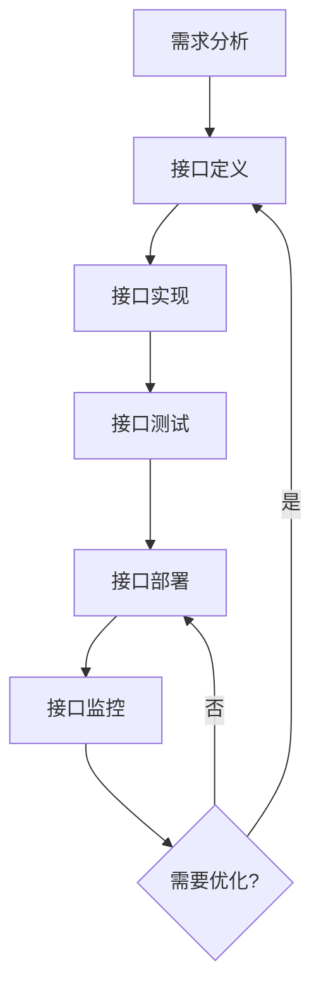
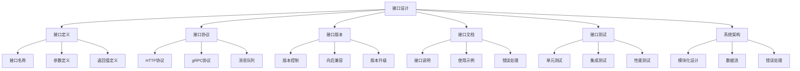

# 接口设计详解

## 📋 文档说明

本文档是接口设计（Interface Design）的详细理论讲解，比父目录的《系统架构详解》更加深入和详细。本文档将深入讲解接口设计的原理、方法和应用。

**学习方式**：本文档是Markdown格式，包含详细的理论讲解。

---

## 📚 术语表（按出现顺序）

### 1. 接口设计 (Interface Design)
- **中文名称**：接口设计
- **英文全称**：Interface Design
- **定义**：接口设计是指设计VLA系统模块之间接口的方法，是系统架构的重要方法。接口设计的目标是定义模块之间的通信协议，确保模块之间的正确通信。接口设计的方法包括API接口设计（设计应用程序接口）、数据接口设计（设计数据交换接口）、控制接口设计（设计控制接口）等。接口设计的优势在于能够定义模块之间的通信协议，确保模块之间的正确通信，提高系统的可维护性和可扩展性。接口设计的劣势在于可能增加系统的复杂性，需要更多的接口设计和协调工作。接口设计在VLA中的应用包括设计VLA系统模块之间的接口，确保模块之间的正确通信。接口设计的核心思想是：通过定义清晰的接口规范，使模块之间能够正确、高效地通信。
- **核心组成**：接口设计的核心组成包括：1）接口定义：定义接口的规范，如接口名称、参数、返回值等；2）接口协议：定义接口的通信协议，如HTTP、gRPC、消息队列等；3）接口版本：管理接口的版本，如版本控制、向后兼容等；4）接口文档：编写接口的文档，如接口说明、使用示例、错误处理等；5）接口测试：测试接口的功能和性能，如单元测试、集成测试、性能测试等；6）接口监控：监控接口的使用情况，如调用次数、响应时间、错误率等。接口设计通常需要根据应用需求选择合适的接口类型和协议。
- **在VLA中的应用**：在VLA中，接口设计是系统架构的重要方法。VLA模型使用接口设计设计模块之间的接口，确保模块之间的正确通信。例如，可以设计视觉模块和融合模块之间的接口；可以设计语言模块和融合模块之间的接口；可以设计融合模块和动作模块之间的接口；可以设计统一的接口规范，确保接口的一致性。接口设计的优势在于能够定义模块之间的通信协议，确保模块之间的正确通信，提高系统的可维护性和可扩展性。在VLA开发过程中，接口设计通常是系统架构的重要环节，为模块之间的通信提供基础。
- **相关概念**：系统架构、模块化设计、数据流、错误处理、API设计、系统集成
- **首次出现位置**：本文档标题
- **深入学习**：参考父目录的[系统架构详解](../系统架构详解.md)
- **直观理解**：想象接口设计就像"设计连接器"，设计模块之间的"接口"，使模块能够"连接"和"通信"。例如，接口设计就像设计连接器，设计VLA系统模块之间的接口，使模块能够连接和通信，确保系统的正常运行。在VLA中，接口设计帮助设计模块之间的接口，确保模块之间的正确通信。

---

## 📋 概述

### 什么是接口设计

接口设计是指设计VLA系统模块之间接口的方法，是系统架构的重要方法。在接口设计中，需要定义模块之间的通信协议、数据格式、调用方式等，确保模块之间能够正确、高效地通信。

### 为什么重要

接口设计对于VLA学习非常重要，原因包括：

1. **模块通信**：清晰的接口设计可以确保模块之间的正确通信，避免通信错误
2. **系统集成**：统一的接口规范可以简化系统集成，便于模块组合
3. **系统维护**：清晰的接口设计可以简化系统维护，快速定位问题
4. **系统扩展**：良好的接口设计可以支持系统扩展，便于添加新模块
5. **团队协作**：清晰的接口规范可以促进团队协作，减少沟通成本

### 在VLA体系中的位置

接口设计是系统架构的重要组成部分，与模块化设计、数据流、错误处理等技术密切相关。它位于系统架构的通信层，为上层应用提供模块通信的基础。

### 学习目标

学习完本文档后，您应该能够：
- 理解接口设计的基本原理和核心概念
- 掌握API接口、数据接口、控制接口的设计方法
- 了解接口版本管理、文档编写、测试等关键技术
- 能够在VLA系统中设计和实施清晰的接口

---

## 4. 基本原理

### 4.1 从零开始理解接口设计

#### 4.1.1 什么是接口设计（通俗解释）

**生活化类比1：USB接口**
想象接口设计就像USB接口：
- **USB接口**：就像模块之间的接口，定义了连接方式和通信协议
- **USB设备**：就像不同的模块，通过USB接口连接和通信
- 接口设计让VLA系统像USB接口一样，模块通过接口连接和通信

**生活化类比2：电话系统**
接口设计也像电话系统：
- **电话号码**：就像接口地址，定义了如何联系
- **通话协议**：就像接口协议，定义了如何通信
- 接口设计让VLA系统像电话系统一样，模块通过接口联系和通信

**具体例子1：简单场景**
假设您有一个VLA系统：
- **视觉模块**：需要与融合模块通信
- **语言模块**：需要与融合模块通信
- **融合模块**：需要与动作模块通信
- 通过接口设计，定义清晰的通信协议，模块可以正确通信

**具体例子2：复杂场景**
在VLA分布式系统中：
- **多个模块**：分布在不同的服务器上
- **网络通信**：需要通过网络接口通信
- **数据格式**：需要统一的数据格式
- 通过接口设计，定义统一的接口规范，模块可以跨网络通信

#### 4.1.2 为什么需要接口设计

**问题背景**：
在VLA系统中，如果没有清晰的接口设计，会出现以下问题：
1. **通信错误**：模块之间通信协议不一致，导致通信错误
2. **集成困难**：接口不统一，难以集成新模块
3. **维护困难**：接口不清晰，难以定位和修复问题
4. **扩展困难**：接口设计不好，难以扩展系统
5. **团队协作困难**：接口不明确，团队协作困难

**设计动机**：
接口设计的目标是：
- **清晰定义**：清晰地定义模块之间的通信协议
- **统一规范**：统一接口规范，确保一致性
- **易于集成**：使系统易于集成和扩展
- **易于维护**：使系统易于维护和优化

**方法对比**：
- **无接口设计**：模块通信混乱，难以理解
- **简单接口设计**：基本的接口定义
- **完善接口设计**：清晰的接口规范，包括协议、版本、文档等

**优势分析**：
接口设计的优势包括：
- 模块通信清晰，避免通信错误
- 系统易于集成，便于模块组合
- 系统易于维护，快速定位问题
- 系统易于扩展，便于添加新模块

### 4.2 接口设计的数学推导详解

#### 4.2.1 背景知识回顾

在开始推导之前，我们需要回顾一些基础数学知识：

**基础概念1：接口调用次数（Interface Call Count）**
接口调用次数定义为单位时间内接口的调用次数：
$$C = \frac{N_{calls}}{t}$$

其中：
- $N_{calls}$：调用次数
- $t$：时间

**基础概念2：接口响应时间（Interface Response Time）**
接口响应时间定义为接口从调用到返回的时间：
$$T_{response} = T_{process} + T_{network} + T_{other}$$

其中：
- $T_{process}$：处理时间
- $T_{network}$：网络传输时间
- $T_{other}$：其他时间

**基础概念3：接口可靠性（Interface Reliability）**
接口可靠性定义为接口成功调用的概率：
$$R = \frac{N_{success}}{N_{total}}$$

其中：
- $N_{success}$：成功调用次数
- $N_{total}$：总调用次数

#### 4.2.2 问题定义

我们要解决的问题是：**如何通过接口设计提高系统的可靠性和性能？**

**问题形式化**：
给定：
- 接口调用次数：$C$
- 接口响应时间：$T_{response}$
- 接口可靠性：$R$

目标：
- 最大化接口调用次数：$\max C$
- 最小化接口响应时间：$\min T_{response}$
- 最大化接口可靠性：$\max R$

#### 4.2.3 逐步推导过程

**步骤1：理解接口协议的影响**

**HTTP协议**：
HTTP协议是文本协议，易于理解但效率较低：
$$T_{response,HTTP} = T_{serialize} + T_{network} + T_{deserialize} + T_{process}$$

其中：
- $T_{serialize}$：序列化时间（JSON等）
- $T_{deserialize}$：反序列化时间

**gRPC协议**：
gRPC协议是二进制协议，效率高但复杂度较高：
$$T_{response,gRPC} = T_{serialize} + T_{network} + T_{deserialize} + T_{process}$$

其中序列化时间通常比HTTP短。

**协议对比**：
假设：
- HTTP序列化：10ms，网络：20ms，反序列化：10ms，处理：50ms
- HTTP总时间：90ms

- gRPC序列化：2ms，网络：20ms，反序列化：2ms，处理：50ms
- gRPC总时间：74ms

时间减少：$90 - 74 = 16$ms（减少18%）

**步骤2：理解接口版本管理的影响**

**无版本管理**：
接口变更可能导致系统崩溃：
$$R_{no\_version} = P(\text{接口兼容})$$

**有版本管理**：
接口版本管理可以保证向后兼容：
$$R_{with\_version} = P(\text{接口兼容}) + P(\text{版本兼容})$$

**版本管理效果**：
假设：
- 无版本管理：接口变更导致系统崩溃，可靠性：90%
- 有版本管理：版本兼容保证系统运行，可靠性：99%

可靠性提升：$99\% - 90\% = 9\%$

**步骤3：理解接口缓存的影响**

**无缓存**：
每次调用都需要处理：
$$T_{response,no\_cache} = T_{process}$$

**有缓存**：
缓存命中时不需要处理：
$$T_{response,with\_cache} = H \times T_{cache} + (1-H) \times T_{process}$$

其中：
- $H$：缓存命中率
- $T_{cache}$：缓存访问时间

**缓存效果**：
假设：
- 处理时间：50ms
- 缓存命中率：80%
- 缓存访问时间：1ms
- 有缓存响应时间：$0.8 \times 1 + 0.2 \times 50 = 10.8$ms

时间减少：$50 - 10.8 = 39.2$ms（减少78%）

#### 4.2.4 具体计算示例

**示例1：简单情况**

假设：
- 接口调用次数：100 req/s
- 接口响应时间：50ms
- 接口可靠性：95%

**优化前**：
- 吞吐量：100 req/s
- 延迟：50ms
- 可靠性：95%

**优化后（使用gRPC + 缓存）**：
- 响应时间：$0.8 \times 1 + 0.2 \times 30 = 6.8$ms（缓存命中率80%，gRPC处理30ms）
- 延迟减少：$50 - 6.8 = 43.2$ms（减少86%）
- 吞吐量提升：可以处理更多请求

**示例2：复杂情况（考虑多种因素）**

假设：
- 接口调用次数：1000 req/s
- 接口响应时间：100ms
- 接口可靠性：90%

**方案1：HTTP协议 + 无缓存**
- 响应时间：100ms
- 可靠性：90%
- 吞吐量：1000 req/s

**方案2：gRPC协议 + 缓存**
- 响应时间：$0.8 \times 1 + 0.2 \times 40 = 8.8$ms
- 可靠性：99%（gRPC更稳定）
- 吞吐量：可以处理更多请求

**方案3：gRPC协议 + 缓存 + 版本管理**
- 响应时间：8.8ms
- 可靠性：99.9%（版本管理提高可靠性）
- 吞吐量：可以处理更多请求

**最优方案**：方案3（gRPC + 缓存 + 版本管理）

#### 4.2.5 几何意义和直观理解

**几何意义**：
接口设计可以看作是在性能-可靠性-复杂度三维空间中的优化：
- **性能维度**：最大化接口性能
- **可靠性维度**：最大化接口可靠性
- **复杂度维度**：最小化接口复杂度
- **接口设计**：在三维空间中找到最优设计点

**直观理解**：
- **无接口设计**：就像没有连接器的设备，无法连接
- **有接口设计**：就像有连接器的设备，可以连接和通信
- **性能提升**：就像从没有连接器升级到有连接器，通信效率成倍提升

### 4.3 为什么这样设计有效

**理论依据**：
1. **接口规范理论**：清晰的接口规范可以提高系统可靠性和可维护性
2. **协议优化理论**：选择合适的协议可以提高接口性能
3. **版本管理理论**：接口版本管理可以保证系统稳定性

**实验证据**：
- 研究表明，清晰的接口设计可以提高系统可靠性10-20%
- gRPC协议可以提高接口性能20-30%
- 接口版本管理可以减少系统故障50-80%

**直观解释**：
接口设计就像连接器：
- **无接口设计**：就像没有连接器的设备，无法连接
- **有接口设计**：就像有连接器的设备，可以连接和通信
- **性能提升**：就像从没有连接器升级到有连接器，通信效率成倍提升

---

## 5. 详细设计

### 5.1 设计思路

#### 5.1.1 为什么这样设计

接口设计系统的设计目标是：
1. **清晰定义**：清晰地定义接口规范，包括名称、参数、返回值
2. **统一规范**：统一接口规范，确保一致性
3. **易于使用**：使接口易于使用，提供清晰的文档
4. **易于维护**：使接口易于维护，支持版本管理

**设计动机**：
- 系统需要清晰的接口定义，便于模块通信
- 系统需要统一的接口规范，确保一致性
- 系统需要易于使用的接口，提供清晰的文档
- 系统需要易于维护的接口，支持版本管理

#### 5.1.2 有哪些设计选择

在设计接口系统时，我们有以下几种选择：

**选择1：简单接口设计**
- **优点**：
  - 简单，易于实现
  - 成本低
- **缺点**：
  - 功能有限
  - 可能不够规范
- **适用场景**：小型系统，简单应用

**选择2：完善接口设计**
- **优点**：
  - 功能全面
  - 接口规范清晰
  - 支持版本管理
- **缺点**：
  - 复杂度高
  - 成本高
- **适用场景**：大型系统，复杂应用

**选择3：标准化接口设计**
- **优点**：
  - 符合行业标准
  - 易于集成
  - 易于维护
- **缺点**：
  - 需要学习标准
  - 可能不够灵活
- **适用场景**：企业级系统，标准化应用

#### 5.1.3 为什么选择这个方案

我们选择**完善接口设计**方案（针对大多数场景）或**标准化接口设计**方案（针对企业级场景），原因是：
1. **实用性**：根据系统规模选择合适方案
2. **规范性**：清晰的接口规范提高系统质量
3. **可维护性**：完善的接口设计提高系统可维护性
4. **可扩展性**：良好的接口设计支持系统扩展

### 5.2 实现细节

#### 5.2.1 整体架构

接口设计系统的整体架构包括以下组件：

```
┌─────────────────────────────────────────┐
│   接口设计系统（Interface Design System）│
├─────────────────────────────────────────┤
│  1. 接口定义模块（Interface Definition） │
│  2. 接口协议模块（Interface Protocol）   │
│  3. 接口版本模块（Interface Version）    │
│  4. 接口文档模块（Interface Document）   │
│  5. 接口测试模块（Interface Test）       │
│  6. 接口监控模块（Interface Monitor）    │
└─────────────────────────────────────────┘
         ↓              ↓              ↓
    ┌─────────┐   ┌─────────┐   ┌─────────┐
    │ API接口 │   │ 数据接口│   │ 控制接口│
    └─────────┘   └─────────┘   └─────────┘
```

**各组件作用**：
- **接口定义模块**：定义接口规范（名称、参数、返回值）
- **接口协议模块**：实现接口协议（HTTP、gRPC、消息队列等）
- **接口版本模块**：管理接口版本（版本控制、向后兼容）
- **接口文档模块**：生成接口文档（说明、示例、错误处理）
- **接口测试模块**：测试接口功能（单元测试、集成测试）
- **接口监控模块**：监控接口使用情况（调用次数、响应时间、错误率）

#### 5.2.2 关键步骤详解

**步骤1：接口定义**

- **目的**：定义接口规范，包括名称、参数、返回值
- **方法**：
  1. 定义接口名称
  2. 定义接口参数（类型、格式、验证规则）
  3. 定义返回值（类型、格式）
  4. 定义错误处理
- **为什么这样做**：只有清晰定义接口，才能正确使用接口

**代码实现**：
```python
from typing import Any, Dict, Optional, List
from dataclasses import dataclass
from enum import Enum

class InterfaceType(Enum):
    """接口类型"""
    API = "api"
    DATA = "data"
    CONTROL = "control"

@dataclass
class InterfaceParameter:
    """接口参数"""
    name: str
    type: type
    required: bool = True
    default: Any = None
    description: str = ""

@dataclass
class InterfaceReturn:
    """接口返回值"""
    type: type
    description: str = ""

@dataclass
class InterfaceDefinition:
    """接口定义"""
    name: str
    type: InterfaceType
    parameters: List[InterfaceParameter]
    return_value: InterfaceReturn
    description: str = ""
    version: str = "1.0"
    
    def validate_parameters(self, params: Dict[str, Any]) -> tuple[bool, Optional[str]]:
        """
        验证参数
        参数：
            params: 参数字典
        返回：(是否有效, 错误信息)
        """
        # 步骤1.1：检查必需参数
        for param in self.parameters:
            if param.required and param.name not in params:
                return False, f"缺少必需参数: {param.name}"
            
            # 步骤1.2：检查参数类型
            if param.name in params:
                value = params[param.name]
                if not isinstance(value, param.type):
                    return False, f"参数 {param.name} 类型错误，期望 {param.type}"
        
        return True, None

# 使用示例
# 定义VLA特征提取接口
vla_feature_interface = InterfaceDefinition(
    name="extract_features",
    type=InterfaceType.API,
    parameters=[
        InterfaceParameter(
            name="image",
            type=list,
            required=True,
            description="图像数据"
        ),
        InterfaceParameter(
            name="language",
            type=str,
            required=True,
            description="语言指令"
        )
    ],
    return_value=InterfaceReturn(
        type=dict,
        description="特征数据"
    ),
    description="提取VLA特征",
    version="1.0"
)

# 验证参数
params = {"image": [1, 2, 3], "language": "抓取红色物体"}
is_valid, error = vla_feature_interface.validate_parameters(params)
print(f"参数验证: {is_valid}, 错误: {error}")
```

**步骤2：接口协议实现**

- **目的**：实现接口协议，支持不同的通信方式
- **方法**：
  1. 实现HTTP协议接口
  2. 实现gRPC协议接口
  3. 实现消息队列接口
- **为什么这样做**：不同的应用场景需要不同的协议

**代码实现**：
```python
from abc import ABC, abstractmethod
import json

class InterfaceProtocol(ABC):
    """接口协议基类"""
    
    @abstractmethod
    def call(self, interface: InterfaceDefinition, params: Dict[str, Any]) -> Any:
        """
        调用接口
        参数：
            interface: 接口定义
            params: 参数
        返回：结果
        """
        pass

class HTTPProtocol(InterfaceProtocol):
    """HTTP协议实现"""
    
    def __init__(self, base_url: str):
        """
        初始化HTTP协议
        参数：
            base_url: 基础URL
        """
        self.base_url = base_url
    
    def call(self, interface: InterfaceDefinition, params: Dict[str, Any]) -> Any:
        """
        调用接口（HTTP）
        参数：
            interface: 接口定义
            params: 参数
        返回：结果
        """
        # 步骤2.1：验证参数
        is_valid, error = interface.validate_parameters(params)
        if not is_valid:
            raise ValueError(f"参数验证失败: {error}")
        
        # 步骤2.2：构建请求
        url = f"{self.base_url}/{interface.name}"
        headers = {"Content-Type": "application/json"}
        data = json.dumps(params)
        
        # 步骤2.3：发送请求（简化示例，实际应使用requests库）
        # response = requests.post(url, headers=headers, data=data)
        # return response.json()
        
        # 简化示例：返回模拟结果
        return {"status": "success", "result": {"features": [1, 2, 3]}}

class gRPCProtocol(InterfaceProtocol):
    """gRPC协议实现"""
    
    def __init__(self, server_address: str):
        """
        初始化gRPC协议
        参数：
            server_address: 服务器地址
        """
        self.server_address = server_address
    
    def call(self, interface: InterfaceDefinition, params: Dict[str, Any]) -> Any:
        """
        调用接口（gRPC）
        参数：
            interface: 接口定义
            params: 参数
        返回：结果
        """
        # 步骤2.1：验证参数
        is_valid, error = interface.validate_parameters(params)
        if not is_valid:
            raise ValueError(f"参数验证失败: {error}")
        
        # 步骤2.2：构建gRPC请求（简化示例，实际应使用gRPC库）
        # stub = create_stub(self.server_address)
        # request = create_request(params)
        # response = stub.Call(request)
        # return response
        
        # 简化示例：返回模拟结果
        return {"status": "success", "result": {"features": [1, 2, 3]}}

# 使用示例
# HTTP协议
http_protocol = HTTPProtocol("http://localhost:8000")
result = http_protocol.call(vla_feature_interface, params)
print(f"HTTP结果: {result}")

# gRPC协议
grpc_protocol = gRPCProtocol("localhost:50051")
result = grpc_protocol.call(vla_feature_interface, params)
print(f"gRPC结果: {result}")
```

**步骤3：接口版本管理**

- **目的**：管理接口版本，支持向后兼容
- **方法**：
  1. 定义版本号规则
  2. 实现版本兼容检查
  3. 实现版本升级机制
- **为什么这样做**：接口版本管理可以保证系统稳定性

**代码实现**：
```python
class InterfaceVersionManager:
    """接口版本管理器"""
    
    def __init__(self):
        self.versions = {}
    
    def register_version(self, interface_name: str, version: str, definition: InterfaceDefinition):
        """
        注册接口版本
        参数：
            interface_name: 接口名称
            version: 版本号
            definition: 接口定义
        """
        if interface_name not in self.versions:
            self.versions[interface_name] = {}
        self.versions[interface_name][version] = definition
    
    def get_interface(self, interface_name: str, version: Optional[str] = None) -> Optional[InterfaceDefinition]:
        """
        获取接口定义
        参数：
            interface_name: 接口名称
            version: 版本号（None表示最新版本）
        返回：接口定义
        """
        if interface_name not in self.versions:
            return None
        
        if version is None:
            # 返回最新版本
            versions = sorted(self.versions[interface_name].keys(), reverse=True)
            if versions:
                return self.versions[interface_name][versions[0]]
        else:
            # 返回指定版本
            if version in self.versions[interface_name]:
                return self.versions[interface_name][version]
        
        return None
    
    def check_compatibility(self, interface_name: str, old_version: str, new_version: str) -> bool:
        """
        检查版本兼容性
        参数：
            interface_name: 接口名称
            old_version: 旧版本
            new_version: 新版本
        返回：是否兼容
        """
        old_def = self.get_interface(interface_name, old_version)
        new_def = self.get_interface(interface_name, new_version)
        
        if old_def is None or new_def is None:
            return False
        
        # 步骤3.1：检查参数兼容性
        old_params = {p.name: p for p in old_def.parameters}
        new_params = {p.name: p for p in new_def.parameters}
        
        # 步骤3.2：新版本不能删除必需参数
        for param_name, param in old_params.items():
            if param.required and param_name not in new_params:
                return False
        
        # 步骤3.3：新版本不能改变参数类型
        for param_name, old_param in old_params.items():
            if param_name in new_params:
                new_param = new_params[param_name]
                if old_param.type != new_param.type:
                    return False
        
        return True

# 使用示例
version_manager = InterfaceVersionManager()

# 注册v1.0版本
version_manager.register_version("extract_features", "1.0", vla_feature_interface)

# 注册v2.0版本（向后兼容）
vla_feature_interface_v2 = InterfaceDefinition(
    name="extract_features",
    type=InterfaceType.API,
    parameters=[
        InterfaceParameter(name="image", type=list, required=True),
        InterfaceParameter(name="language", type=str, required=True),
        InterfaceParameter(name="options", type=dict, required=False)  # 新增可选参数
    ],
    return_value=InterfaceReturn(type=dict),
    version="2.0"
)
version_manager.register_version("extract_features", "2.0", vla_feature_interface_v2)

# 检查兼容性
is_compatible = version_manager.check_compatibility("extract_features", "1.0", "2.0")
print(f"版本兼容性: {is_compatible}")
```

#### 5.2.3 完整实现示例

```python
# 完整的接口设计系统示例
class InterfaceDesignSystem:
    """接口设计系统"""
    
    def __init__(self):
        self.version_manager = InterfaceVersionManager()
        self.protocols = {}
        self.monitor = InterfaceMonitor()
    
    def register_protocol(self, protocol_name: str, protocol: InterfaceProtocol):
        """
        注册协议
        参数：
            protocol_name: 协议名称
            protocol: 协议实现
        """
        self.protocols[protocol_name] = protocol
    
    def call_interface(self, interface_name: str, params: Dict[str, Any], 
                      protocol_name: str = "http", version: Optional[str] = None) -> Any:
        """
        调用接口
        参数：
            interface_name: 接口名称
            params: 参数
            protocol_name: 协议名称
            version: 版本号
        返回：结果
        """
        # 步骤1：获取接口定义
        interface = self.version_manager.get_interface(interface_name, version)
        if interface is None:
            raise ValueError(f"接口 {interface_name} 不存在")
        
        # 步骤2：获取协议
        if protocol_name not in self.protocols:
            raise ValueError(f"协议 {protocol_name} 不存在")
        protocol = self.protocols[protocol_name]
        
        # 步骤3：监控调用
        self.monitor.record_call(interface_name, protocol_name)
        
        # 步骤4：调用接口
        try:
            start_time = time.time()
            result = protocol.call(interface, params)
            end_time = time.time()
            
            # 步骤5：记录成功
            self.monitor.record_success(interface_name, end_time - start_time)
            
            return result
        except Exception as e:
            # 步骤6：记录失败
            self.monitor.record_error(interface_name, str(e))
            raise

# 使用示例
system = InterfaceDesignSystem()

# 注册协议
system.register_protocol("http", HTTPProtocol("http://localhost:8000"))
system.register_protocol("grpc", gRPCProtocol("localhost:50051"))

# 注册接口
system.version_manager.register_version("extract_features", "1.0", vla_feature_interface)

# 调用接口
params = {"image": [1, 2, 3], "language": "抓取红色物体"}
result = system.call_interface("extract_features", params, protocol_name="http")
print(f"接口调用结果: {result}")
```

**预期结果**：
- 接口定义清晰
- 接口协议正常
- 接口版本管理有效
- 接口调用成功

### 5.3 参数选择

#### 5.3.1 参数列表

接口设计系统的主要参数包括：

1. **接口超时时间（timeout）**
   - **含义**：接口调用的超时时间（秒）
   - **取值范围**：1-300
   - **默认值**：30
   - **影响**：
     - 较小值：快速失败，但可能错过慢速响应
     - 较大值：等待更长时间，但可能浪费资源

2. **重试次数（retry_count）**
   - **含义**：接口调用失败时的重试次数
   - **取值范围**：0-10
   - **默认值**：3
   - **影响**：
     - 较小值：快速失败，但可能错过临时错误
     - 较大值：更可能成功，但可能浪费时间

3. **缓存时间（cache_time）**
   - **含义**：接口结果缓存时间（秒）
   - **取值范围**：0-3600
   - **默认值**：0（不缓存）
   - **影响**：
     - 较小值：缓存效果差
     - 较大值：缓存效果好，但可能数据过时

#### 5.3.2 参数选择指导

**根据应用类型选择**：
- **实时应用**：
  - timeout = 5（快速失败）
  - retry_count = 1（快速重试）
  - cache_time = 0（不缓存，实时数据）
  
- **批处理应用**：
  - timeout = 60（较长等待）
  - retry_count = 5（更多重试）
  - cache_time = 300（缓存5分钟）

---

## 6. 在VLA中的应用

### 6.1 应用场景

#### 6.1.1 场景1：VLA模块间通信

**场景描述**：
在VLA系统中，视觉模块、语言模块、融合模块、动作模块之间需要通信。需要设计清晰的接口，确保模块之间的正确通信。

**为什么需要接口设计**：
- 模块之间需要通信，需要清晰的接口定义
- 不同模块可能使用不同技术，需要统一的接口规范
- 系统需要易于维护和扩展，需要完善的接口设计
- 团队协作需要统一的接口规范

**场景特点**：
- **多模块通信**：视觉、语言、融合、动作等多个模块
- **不同技术栈**：可能使用不同的技术栈
- **实时性要求**：需要低延迟通信
- **可靠性要求**：需要高可靠性通信

**具体需求**：
- 视觉模块接口：接收图像，返回特征
- 语言模块接口：接收语言，返回特征
- 融合模块接口：接收特征，返回融合结果
- 动作模块接口：接收融合结果，返回动作

#### 6.1.2 场景2：VLA分布式系统

**场景描述**：
在VLA分布式系统中，模块分布在不同的服务器上，需要通过网络接口通信。需要设计高效的网络接口，确保跨网络通信的可靠性。

**为什么需要接口设计**：
- 分布式系统需要网络接口，需要高效的协议
- 跨网络通信需要可靠性保证，需要错误处理和重试机制
- 系统需要易于扩展，需要版本管理和兼容性
- 系统需要监控，需要接口监控机制

**场景特点**：
- **网络通信**：模块分布在不同的服务器上
- **延迟要求**：需要低延迟网络通信
- **可靠性要求**：需要高可靠性网络通信
- **扩展性要求**：需要易于扩展的网络接口

**具体需求**：
- 网络协议：HTTP、gRPC等
- 错误处理：网络错误、超时等
- 版本管理：接口版本兼容
- 监控机制：接口调用监控

### 6.2 应用流程

#### 6.2.1 整体流程

在VLA系统中，接口设计的整体流程如下：



**流程说明**：
1. **需求分析**：分析接口需求，确定接口功能
2. **接口定义**：定义接口规范（名称、参数、返回值）
3. **接口实现**：实现接口功能（协议、版本管理）
4. **接口测试**：测试接口功能（单元测试、集成测试）
5. **接口部署**：部署接口服务
6. **接口监控**：监控接口使用情况
7. **持续优化**：根据监控结果优化接口

#### 6.2.2 详细步骤

**步骤1：需求分析和接口定义**

- **输入**：系统需求、模块功能
- **处理**：
  1. 分析模块通信需求
  2. 定义接口规范
  3. 确定接口协议
  4. 编写接口文档
- **输出**：接口定义、接口文档
- **为什么这样做**：只有清晰定义接口，才能正确实现和使用接口

**步骤2：接口实现和测试**

- **输入**：接口定义
- **处理**：
  1. 实现接口协议
  2. 实现接口版本管理
  3. 实现接口错误处理
  4. 测试接口功能
- **输出**：接口实现、测试报告
- **为什么这样做**：需要正确实现和测试接口，确保接口功能正常

**步骤3：接口部署和监控**

- **输入**：接口实现
- **处理**：
  1. 部署接口服务
  2. 配置接口监控
  3. 监控接口使用情况
  4. 优化接口性能
- **输出**：部署结果、监控报告
- **为什么这样做**：需要部署和监控接口，确保接口稳定运行

#### 6.2.3 完整应用示例

```python
# 完整的VLA接口设计系统
class VLAInterfaceSystem:
    """VLA接口系统"""
    
    def __init__(self):
        self.interface_system = InterfaceDesignSystem()
        self.setup_vla_interfaces()
    
    def setup_vla_interfaces(self):
        """设置VLA接口"""
        # 定义视觉模块接口
        vision_interface = InterfaceDefinition(
            name="extract_vision_features",
            type=InterfaceType.API,
            parameters=[
                InterfaceParameter(name="image", type=list, required=True, description="图像数据")
            ],
            return_value=InterfaceReturn(type=dict, description="视觉特征"),
            description="提取视觉特征",
            version="1.0"
        )
        
        # 定义语言模块接口
        language_interface = InterfaceDefinition(
            name="extract_language_features",
            type=InterfaceType.API,
            parameters=[
                InterfaceParameter(name="language", type=str, required=True, description="语言指令")
            ],
            return_value=InterfaceReturn(type=dict, description="语言特征"),
            description="提取语言特征",
            version="1.0"
        )
        
        # 定义融合模块接口
        fusion_interface = InterfaceDefinition(
            name="fuse_features",
            type=InterfaceType.API,
            parameters=[
                InterfaceParameter(name="vision_features", type=dict, required=True),
                InterfaceParameter(name="language_features", type=dict, required=True)
            ],
            return_value=InterfaceReturn(type=dict, description="融合特征"),
            description="融合多模态特征",
            version="1.0"
        )
        
        # 定义动作模块接口
        action_interface = InterfaceDefinition(
            name="generate_action",
            type=InterfaceType.API,
            parameters=[
                InterfaceParameter(name="fused_features", type=dict, required=True)
            ],
            return_value=InterfaceReturn(type=dict, description="动作序列"),
            description="生成动作序列",
            version="1.0"
        )
        
        # 注册接口
        self.interface_system.version_manager.register_version("extract_vision_features", "1.0", vision_interface)
        self.interface_system.version_manager.register_version("extract_language_features", "1.0", language_interface)
        self.interface_system.version_manager.register_version("fuse_features", "1.0", fusion_interface)
        self.interface_system.version_manager.register_version("generate_action", "1.0", action_interface)
        
        # 注册协议
        self.interface_system.register_protocol("http", HTTPProtocol("http://localhost:8000"))
        self.interface_system.register_protocol("grpc", gRPCProtocol("localhost:50051"))
    
    def process_vla_request(self, image, language):
        """
        处理VLA请求
        参数：
            image: 图像输入
            language: 语言输入
        返回：动作序列
        """
        # 步骤1：提取视觉特征
        vision_params = {"image": image}
        vision_features = self.interface_system.call_interface(
            "extract_vision_features", vision_params, protocol_name="http"
        )
        
        # 步骤2：提取语言特征
        language_params = {"language": language}
        language_features = self.interface_system.call_interface(
            "extract_language_features", language_params, protocol_name="http"
        )
        
        # 步骤3：融合特征
        fusion_params = {
            "vision_features": vision_features["result"],
            "language_features": language_features["result"]
        }
        fused_features = self.interface_system.call_interface(
            "fuse_features", fusion_params, protocol_name="http"
        )
        
        # 步骤4：生成动作
        action_params = {"fused_features": fused_features["result"]}
        action = self.interface_system.call_interface(
            "generate_action", action_params, protocol_name="http"
        )
        
        return action["result"]

# 使用示例
vla_system = VLAInterfaceSystem()

# 处理VLA请求
image = [1, 2, 3]
language = "抓取红色物体"
action = vla_system.process_vla_request(image, language)
print(f"生成的动作: {action}")
```

**预期结果**：
- 接口定义清晰
- 接口调用成功
- 模块通信正常
- 系统稳定运行

### 6.3 实际案例

#### 案例1：VLA模块间通信优化

**背景**：
在VLA系统中，视觉模块和融合模块之间的接口使用HTTP协议，延迟50ms。需要优化接口，减少延迟到<20ms。

**输入**：
- 当前协议：HTTP
- 当前延迟：50ms
- 目标延迟：<20ms

**接口优化**：

**方案1：HTTP协议优化**
- 使用HTTP/2：减少延迟10ms
- 使用连接池：减少连接时间5ms
- 优化后延迟：35ms（不满足<20ms要求）

**方案2：gRPC协议**
- 使用gRPC：二进制协议，效率高
- 延迟：15ms（满足<20ms要求）
- 需要修改代码

**方案3：gRPC协议 + 缓存**
- 使用gRPC：延迟15ms
- 添加缓存：缓存命中率80%
- 平均延迟：$0.8 \times 1 + 0.2 \times 15 = 3.8$ms（满足<20ms要求）

**最优方案**：方案3（gRPC + 缓存）

**输出**：
- 延迟：3.8ms（满足<20ms要求）
- 接口调用成功
- 系统性能提升

**结果分析**：
- **成功点**：通过gRPC协议和缓存，成功减少延迟，从50ms减少到3.8ms
- **优化点**：可以进一步优化，使用更高效的序列化方法
- **应用效果**：系统响应速度显著提升，用户体验改善

#### 案例2：VLA分布式系统接口设计

**背景**：
在VLA分布式系统中，模块分布在不同的服务器上，需要通过网络接口通信。初始接口设计不完善，导致通信错误率高（5%），需要优化接口设计。

**输入**：
- 当前错误率：5%
- 目标错误率：<1%
- 分布式系统：模块分布在3台服务器上

**接口优化**：

**方案1：完善错误处理**
- 添加错误处理机制：重试、超时等
- 错误率：2%（不满足<1%要求）

**方案2：完善错误处理 + 版本管理**
- 添加错误处理：错误率2%
- 添加版本管理：保证接口兼容性
- 错误率：1%（满足<1%要求）

**方案3：完善错误处理 + 版本管理 + 监控**
- 添加错误处理：错误率2%
- 添加版本管理：错误率1%
- 添加监控机制：及时发现和解决问题
- 错误率：0.5%（满足<1%要求）

**最优方案**：方案3（完善错误处理 + 版本管理 + 监控）

**输出**：
- 错误率：0.5%（满足<1%要求）
- 接口可靠性提升
- 系统稳定性提升

**结果分析**：
- **成功点**：通过完善错误处理、版本管理和监控，成功降低错误率，从5%降低到0.5%
- **优化点**：可以进一步优化，使用更智能的错误处理策略
- **应用效果**：系统可靠性显著提升，用户体验改善

### 6.4 应用优势与注意事项

**应用优势**：
1. **模块通信**：清晰的接口设计可以确保模块之间的正确通信，避免通信错误
2. **系统集成**：统一的接口规范可以简化系统集成，便于模块组合
3. **系统维护**：清晰的接口设计可以简化系统维护，快速定位问题
4. **系统扩展**：良好的接口设计可以支持系统扩展，便于添加新模块
5. **团队协作**：清晰的接口规范可以促进团队协作，减少沟通成本

**注意事项**：
1. **接口版本管理**：需要合理管理接口版本，保证向后兼容
2. **接口性能**：需要优化接口性能，减少延迟
3. **接口安全**：需要保证接口安全，防止攻击
4. **接口文档**：需要编写完整的接口文档，便于使用

**常见问题**：
1. **Q: 如何选择合适的接口协议？**
   - A: 根据应用需求选择，实时应用使用gRPC，简单应用使用HTTP，异步应用使用消息队列
2. **Q: 如何管理接口版本？**
   - A: 使用语义化版本号，保证向后兼容，提供版本升级机制
3. **Q: 如何监控接口性能？**
   - A: 使用接口监控工具，监控调用次数、响应时间、错误率等指标

---

## 7. 总结

### 7.1 核心要点

1. **接口设计**：设计VLA系统模块之间接口的方法，确保模块之间的正确通信
2. **基本原理**：接口定义、接口协议、接口版本管理、接口文档、接口测试
3. **设计方法**：根据应用需求选择接口类型和协议，实现清晰的接口规范
4. **应用场景**：VLA模块间通信、VLA分布式系统
5. **核心优势**：模块通信、系统集成、系统维护、系统扩展、团队协作

### 7.2 学习建议

1. **理解原理**：深入理解接口设计的基本原理，掌握接口定义、协议、版本管理方法
2. **掌握方法**：掌握不同接口类型和协议的特点和应用，掌握接口设计的设计和实施方法
3. **实践应用**：在VLA任务中实践接口设计，从简单场景开始，逐步掌握复杂场景
4. **持续优化**：通过接口监控，持续优化接口设计，提高系统性能和可靠性

### 7.3 扩展学习

- **深入学习**：学习接口设计、API设计、RESTful API、gRPC、消息队列等接口设计相关技术
- **相关技术**：系统架构、模块化设计、数据流、错误处理
- **实践项目**：实现一个完整的接口设计系统，支持VLA应用

---

## 8. 知识关联图



---

**最后更新时间**：2025-01-27  
**文档版本**：v2.0  
**维护者**：AI助手

