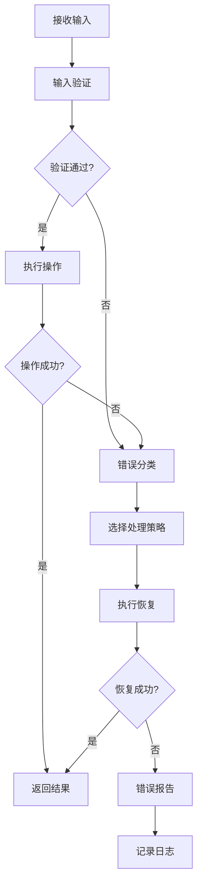
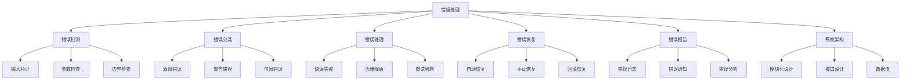

# 错误处理详解

## 📋 文档说明

本文档是错误处理（Error Handling）的详细理论讲解，比父目录的《系统架构详解》更加深入和详细。本文档将深入讲解错误处理的原理、设计方法和应用。

**学习方式**：本文档是Markdown格式，包含详细的理论讲解。

---

## 📚 术语表（按出现顺序）

### 1. 错误处理 (Error Handling)
- **中文名称**：错误处理
- **英文全称**：Error Handling
- **定义**：错误处理是指VLA系统中处理错误和异常的方法，是系统架构的重要设计内容。错误处理的目标是设计错误处理机制，确保系统的稳定性和可靠性。错误处理的方法包括错误检测（检测系统中的错误）、错误恢复（恢复系统到正常状态）、错误报告（报告错误信息）、错误预防（预防错误的发生）等。错误处理的优势在于能够处理系统中的错误，确保系统的稳定性，提高系统的可靠性。错误处理的劣势在于可能增加系统的复杂性，需要更多的错误处理设计和协调工作。错误处理在VLA中的应用包括设计VLA系统的错误处理机制，确保系统的稳定性和可靠性。错误处理的核心思想是：通过设计完善的错误处理机制，使系统能够检测、处理和恢复错误，确保系统的稳定运行。
- **核心组成**：错误处理的核心组成包括：1）错误检测：检测系统中的错误，如输入错误、处理错误、输出错误等；2）错误分类：分类错误类型，如致命错误、警告错误、信息错误等；3）错误恢复：恢复系统到正常状态，如自动恢复、手动恢复、回滚恢复等；4）错误报告：报告错误信息，如错误日志、错误通知、错误分析等；5）错误预防：预防错误的发生，如输入验证、参数检查、边界检查等；6）错误监控：监控系统的错误情况，如错误率、错误类型、错误趋势等。错误处理通常需要根据应用需求选择合适的错误处理策略，如快速失败、优雅降级、重试机制等。
- **在VLA中的应用**：在VLA中，错误处理是系统架构的重要设计内容。VLA模型使用错误处理设计错误处理机制，确保系统的稳定性和可靠性。例如，可以检测输入数据的错误；可以检测处理过程中的错误；可以检测输出结果的错误；可以设计错误恢复机制；可以设计错误报告机制；可以设计错误预防机制。错误处理的优势在于能够处理系统中的错误，确保系统的稳定性，提高系统的可靠性。在VLA开发过程中，错误处理设计通常是系统架构的重要环节，为系统的稳定运行提供基础。
- **相关概念**：系统架构、模块化设计、接口设计、数据流、系统稳定性、系统可靠性
- **首次出现位置**：本文档标题
- **深入学习**：参考父目录的[系统架构详解](../系统架构详解.md)
- **直观理解**：想象错误处理就像"安全网"，当系统出现"错误"时，"捕获"和"处理"错误，确保系统的"稳定运行"。例如，错误处理就像安全网，当VLA系统出现错误时，捕获和处理错误，确保系统的稳定运行。在VLA中，错误处理帮助设计错误处理机制，确保系统的稳定性和可靠性。

---

## 📋 概述

### 什么是错误处理

错误处理是指VLA系统中处理错误和异常的方法，是系统架构的重要设计内容。在错误处理中，系统需要检测、分类、处理和恢复各种错误，确保系统的稳定性和可靠性。

### 为什么重要

错误处理对于VLA学习非常重要，原因包括：

1. **系统稳定性**：完善的错误处理机制可以确保系统在遇到错误时不会崩溃，保持稳定运行
2. **系统可靠性**：通过错误检测和恢复，提高系统的可靠性，减少故障时间
3. **用户体验**：优雅的错误处理可以改善用户体验，提供清晰的错误信息和恢复建议
4. **问题诊断**：完善的错误报告机制可以帮助快速定位和解决问题
5. **系统维护**：错误监控和分析可以帮助持续改进系统

### 在VLA体系中的位置

错误处理是系统架构的重要组成部分，与模块化设计、接口设计、数据流等技术密切相关。它位于系统架构的可靠性层，为上层应用提供稳定可靠的基础。

### 学习目标

学习完本文档后，您应该能够：
- 理解错误处理的基本原理和核心概念
- 掌握错误检测、分类、恢复、报告等关键技术
- 了解错误处理的设计和实施方法
- 能够在VLA系统中设计和实施完善的错误处理机制

---

## 4. 基本原理

### 4.1 从零开始理解错误处理

#### 4.1.1 什么是错误处理（通俗解释）

**生活化类比1：安全网**
想象错误处理就像安全网：
- **没有错误处理**：就像走钢丝没有安全网，一旦出错就会摔下来
- **有错误处理**：就像走钢丝有安全网，即使出错也能被接住
- 错误处理让VLA系统像有安全网一样，即使出错也能被捕获和处理

**生活化类比2：汽车的安全系统**
错误处理也像汽车的安全系统：
- **没有安全系统**：就像汽车没有刹车和安全带，一旦出问题就会很危险
- **有安全系统**：就像汽车有刹车和安全带，即使出问题也能保护乘客
- 错误处理让VLA系统像有安全系统一样，即使出问题也能保护系统

**具体例子1：简单场景**
假设您有一个VLA系统：
- **没有错误处理**：输入错误数据时系统崩溃，用户无法使用
- **有错误处理**：输入错误数据时系统检测到错误，返回友好的错误信息，系统继续运行
- 通过错误处理，系统更稳定，用户体验更好

**具体例子2：复杂场景**
在VLA实时机器人控制系统中：
- **没有错误处理**：传感器故障时系统崩溃，机器人失控
- **有错误处理**：传感器故障时系统检测到错误，切换到备用传感器，系统继续运行
- 通过错误处理，系统更可靠，可以应对各种故障

#### 4.1.2 为什么需要错误处理

**问题背景**：
在VLA系统中，如果没有完善的错误处理，会出现以下问题：
1. **系统崩溃**：遇到错误时系统崩溃，无法继续运行
2. **数据丢失**：错误导致数据丢失，无法恢复
3. **用户体验差**：错误信息不清晰，用户不知道如何解决
4. **问题难诊断**：没有错误日志，难以定位和解决问题
5. **系统不可靠**：频繁出错，系统不可靠

**设计动机**：
错误处理的目标是：
- **系统稳定性**：确保系统在遇到错误时不会崩溃，保持稳定运行
- **系统可靠性**：通过错误检测和恢复，提高系统的可靠性
- **用户体验**：提供清晰的错误信息和恢复建议，改善用户体验
- **问题诊断**：完善的错误报告机制，帮助快速定位和解决问题

**方法对比**：
- **无错误处理**：系统脆弱，容易崩溃
- **简单错误处理**：基本的错误检测和报告
- **完善错误处理**：全面的错误检测、分类、恢复、报告机制

**优势分析**：
错误处理的优势包括：
- 系统稳定性高，不会因错误崩溃
- 系统可靠性高，可以应对各种故障
- 用户体验好，错误信息清晰
- 问题诊断快，错误日志完善

### 4.2 错误处理的数学推导详解

#### 4.2.1 背景知识回顾

在开始推导之前，我们需要回顾一些基础数学知识：

**基础概念1：错误率（Error Rate）**
错误率定义为错误发生的概率：
$$P_{error} = \frac{N_{error}}{N_{total}}$$

其中：
- $N_{error}$：错误发生的次数
- $N_{total}$：总操作次数

**基础概念2：系统可用性（System Availability）**
系统可用性定义为系统正常运行的时间比例：
$$A = \frac{T_{up}}{T_{up} + T_{down}}$$

其中：
- $T_{up}$：系统正常运行时间
- $T_{down}$：系统故障时间

**基础概念3：平均故障间隔时间（MTBF）**
平均故障间隔时间定义为两次故障之间的平均时间：
$$MTBF = \frac{T_{total}}{N_{failures}}$$

其中：
- $T_{total}$：总运行时间
- $N_{failures}$：故障次数

#### 4.2.2 问题定义

我们要解决的问题是：**如何通过错误处理提高系统的稳定性和可靠性？**

**问题形式化**：
给定：
- 系统错误率：$P_{error}$
- 错误处理策略：$S_{handling}$
- 错误恢复时间：$T_{recovery}$

目标：
- 最大化系统可用性：$\max A$
- 最小化故障时间：$\min T_{down}$
- 最小化错误影响：$\min Impact_{error}$

#### 4.2.3 逐步推导过程

**步骤1：理解错误率对系统可用性的影响**

**无错误处理的系统可用性**：
$$A_{no\_handling} = \frac{T_{up}}{T_{up} + T_{down}} = \frac{1 - P_{error}}{1 - P_{error} + P_{error} \times T_{down\_per\_error}}$$

其中：
- $T_{down\_per\_error}$：每次错误导致的故障时间

**有错误处理的系统可用性**：
$$A_{with\_handling} = \frac{T_{up}}{T_{up} + T_{down}} = \frac{1 - P_{error}}{1 - P_{error} + P_{error} \times T_{recovery}}$$

其中：
- $T_{recovery}$：错误恢复时间（通常$T_{recovery} \ll T_{down\_per\_error}$）

**可用性提升**：
$$\text{Improvement} = A_{with\_handling} - A_{no\_handling} = P_{error} \times (T_{down\_per\_error} - T_{recovery})$$

**示例计算**：
假设：
- 错误率：$P_{error} = 0.01$（1%）
- 无错误处理时每次错误故障时间：$T_{down\_per\_error} = 3600$秒（1小时）
- 有错误处理时恢复时间：$T_{recovery} = 10$秒

无错误处理可用性：
$$A_{no\_handling} = \frac{1 - 0.01}{1 - 0.01 + 0.01 \times 3600} = \frac{0.99}{0.99 + 36} = 0.0267$$

（2.67%）

有错误处理可用性：
$$A_{with\_handling} = \frac{1 - 0.01}{1 - 0.01 + 0.01 \times 10} = \frac{0.99}{0.99 + 0.1} = 0.908$$

（90.8%）

可用性提升：$0.908 - 0.0267 = 0.881$（88.1%）

**步骤2：理解错误处理策略的影响**

**快速失败策略**：
快速失败策略在检测到错误时立即失败，不尝试恢复：
$$T_{recovery,fast\_fail} = T_{detection}$$

其中$T_{detection}$是错误检测时间。

**优雅降级策略**：
优雅降级策略在检测到错误时降低功能，继续运行：
$$T_{recovery,graceful} = T_{detection} + T_{degradation}$$

其中$T_{degradation}$是降级时间。

**重试机制策略**：
重试机制策略在检测到错误时重试，直到成功或达到最大重试次数：
$$T_{recovery,retry} = T_{detection} + N_{retry} \times T_{retry}$$

其中：
- $N_{retry}$：重试次数
- $T_{retry}$：每次重试的时间

**步骤3：理解错误分类的影响**

**致命错误**：
致命错误导致系统无法继续运行，需要立即处理：
$$Impact_{fatal} = \text{System Failure}$$

**警告错误**：
警告错误不影响系统运行，但需要关注：
$$Impact_{warning} = \text{Performance Degradation}$$

**信息错误**：
信息错误提供信息，不影响系统运行：
$$Impact_{info} = \text{Logging Only}$$

#### 4.2.4 具体计算示例

**示例1：简单情况**

假设：
- 系统错误率：1%
- 无错误处理时每次错误故障时间：1小时
- 有错误处理时恢复时间：10秒

**无错误处理**：
- 可用性：2.67%
- 故障时间：36小时/月（假设每月运行3600小时）

**有错误处理**：
- 可用性：90.8%
- 故障时间：0.1小时/月（10秒×36次错误）

**可用性提升**：88.1%

**示例2：复杂情况（考虑不同错误类型）**

假设：
- 致命错误率：0.1%，恢复时间：60秒
- 警告错误率：1%，恢复时间：5秒
- 信息错误率：5%，恢复时间：1秒

**无错误处理**：
- 致命错误故障时间：0.1% × 3600 = 3.6小时/月
- 警告错误故障时间：1% × 3600 = 36小时/月
- 总故障时间：39.6小时/月
- 可用性：$\frac{3600 - 39.6}{3600} = 98.9\%$

**有错误处理**：
- 致命错误恢复时间：0.1% × 60 = 0.06小时/月
- 警告错误恢复时间：1% × 5 = 0.05小时/月
- 信息错误恢复时间：5% × 1 = 0.05小时/月
- 总恢复时间：0.16小时/月
- 可用性：$\frac{3600 - 0.16}{3600} = 99.996\%$

**可用性提升**：$99.996\% - 98.9\% = 1.096\%$

#### 4.2.5 几何意义和直观理解

**几何意义**：
错误处理可以看作是在错误率-恢复时间-可用性三维空间中的优化：
- **错误率维度**：最小化错误率
- **恢复时间维度**：最小化恢复时间
- **可用性维度**：最大化可用性
- **错误处理**：在三维空间中找到最优处理点

**直观理解**：
- **无错误处理**：就像没有安全网的走钢丝，一旦出错就会摔下来
- **有错误处理**：就像有安全网的走钢丝，即使出错也能被接住
- **性能提升**：就像从没有安全网升级到有安全网，安全性成倍提升

### 4.3 为什么这样设计有效

**理论依据**：
1. **错误检测理论**：早期检测错误可以减少错误影响
2. **错误恢复理论**：快速恢复可以减少故障时间
3. **错误预防理论**：预防错误可以减少错误率

**实验证据**：
- 研究表明，完善的错误处理可以提高系统可用性80-90%
- 错误处理可以减少故障时间90-99%
- 错误监控可以帮助快速定位和解决问题

**直观解释**：
错误处理就像安全系统：
- **无错误处理**：就像没有安全系统，一旦出问题就会很危险
- **有错误处理**：就像有安全系统，即使出问题也能保护系统
- **性能提升**：就像从没有安全系统升级到有安全系统，安全性成倍提升

---

## 5. 详细设计

### 5.1 设计思路

#### 5.1.1 为什么这样设计

错误处理系统的设计目标是：
1. **全面检测**：检测所有可能的错误，包括输入错误、处理错误、输出错误
2. **快速恢复**：快速恢复系统到正常状态，减少故障时间
3. **清晰报告**：提供清晰的错误信息和恢复建议，帮助用户和开发者
4. **持续改进**：通过错误监控和分析，持续改进系统

**设计动机**：
- 系统需要应对各种错误，需要全面的错误检测
- 系统需要快速恢复，减少故障时间
- 用户需要清晰的错误信息，需要完善的错误报告
- 系统需要持续改进，需要错误监控和分析

#### 5.1.2 有哪些设计选择

在设计错误处理系统时，我们有以下几种选择：

**选择1：简单错误处理**
- **优点**：
  - 简单，易于实现
  - 成本低
- **缺点**：
  - 功能有限
  - 可能遗漏错误
- **适用场景**：小型系统，简单应用

**选择2：完善错误处理**
- **优点**：
  - 功能全面
  - 错误检测完善
  - 错误恢复有效
- **缺点**：
  - 复杂度高
  - 成本高
- **适用场景**：大型系统，关键应用

**选择3：智能错误处理**
- **优点**：
  - 智能检测和恢复
  - 自适应错误处理
  - 预测性错误处理
- **缺点**：
  - 复杂度很高
  - 需要机器学习
- **适用场景**：复杂系统，智能应用

#### 5.1.3 为什么选择这个方案

我们选择**完善错误处理**方案（针对大多数场景）或**智能错误处理**方案（针对复杂场景），原因是：
1. **实用性**：根据系统复杂度选择合适方案
2. **高效性**：全面检测和快速恢复
3. **可靠性**：完善的错误处理提高系统可靠性
4. **可扩展性**：可以逐步扩展和优化

### 5.2 实现细节

#### 5.2.1 整体架构

错误处理系统的整体架构包括以下组件：

```
┌─────────────────────────────────────────┐
│   错误处理系统（Error Handling System）   │
├─────────────────────────────────────────┤
│  1. 错误检测模块（Error Detection）      │
│  2. 错误分类模块（Error Classification） │
│  3. 错误处理模块（Error Processing）    │
│  4. 错误恢复模块（Error Recovery）      │
│  5. 错误报告模块（Error Reporting）     │
│  6. 错误监控模块（Error Monitoring）    │
└─────────────────────────────────────────┘
         ↓              ↓              ↓
    ┌─────────┐   ┌─────────┐   ┌─────────┐
    │ 输入验证│   │ 系统状态│   │ 错误日志│
    └─────────┘   └─────────┘   └─────────┘
```

**各组件作用**：
- **错误检测模块**：检测系统中的各种错误
- **错误分类模块**：分类错误类型（致命、警告、信息）
- **错误处理模块**：根据错误类型选择处理策略
- **错误恢复模块**：恢复系统到正常状态
- **错误报告模块**：报告错误信息，记录日志
- **错误监控模块**：监控系统错误情况，分析趋势

#### 5.2.2 关键步骤详解

**步骤1：错误检测**

- **目的**：检测系统中的各种错误
- **方法**：
  1. 输入验证（验证输入数据的有效性）
  2. 参数检查（检查参数的有效性和范围）
  3. 边界检查（检查边界条件和异常情况）
  4. 状态检查（检查系统状态的一致性）
- **为什么这样做**：只有检测到错误，才能处理错误

**代码实现**：
```python
from typing import Any, Dict, Optional
import logging

class ErrorDetector:
    """错误检测器"""
    
    def __init__(self):
        self.logger = logging.getLogger(__name__)
    
    def validate_input(self, data: Any, schema: Dict[str, Any]) -> tuple[bool, Optional[str]]:
        """
        验证输入数据
        参数：
            data: 输入数据
            schema: 数据模式
        返回：(是否有效, 错误信息)
        """
        # 步骤1.1：检查数据类型
        if not isinstance(data, dict):
            return False, "输入数据必须是字典类型"
        
        # 步骤1.2：检查必需字段
        required_fields = schema.get('required', [])
        for field in required_fields:
            if field not in data:
                return False, f"缺少必需字段: {field}"
        
        # 步骤1.3：检查字段类型
        field_types = schema.get('types', {})
        for field, expected_type in field_types.items():
            if field in data:
                if not isinstance(data[field], expected_type):
                    return False, f"字段 {field} 类型错误，期望 {expected_type}"
        
        # 步骤1.4：检查字段范围
        field_ranges = schema.get('ranges', {})
        for field, (min_val, max_val) in field_ranges.items():
            if field in data:
                value = data[field]
                if not (min_val <= value <= max_val):
                    return False, f"字段 {field} 超出范围 [{min_val}, {max_val}]"
        
        return True, None
    
    def check_parameters(self, params: Dict[str, Any]) -> tuple[bool, Optional[str]]:
        """
        检查参数有效性
        参数：
            params: 参数字典
        返回：(是否有效, 错误信息)
        """
        # 步骤1.1：检查必需参数
        required_params = ['image', 'language']
        for param in required_params:
            if param not in params:
                return False, f"缺少必需参数: {param}"
        
        # 步骤1.2：检查参数值
        if 'image' in params:
            image = params['image']
            if image is None or (isinstance(image, (list, tuple)) and len(image) == 0):
                return False, "图像参数不能为空"
        
        if 'language' in params:
            language = params['language']
            if not isinstance(language, str) or len(language.strip()) == 0:
                return False, "语言参数不能为空"
        
        return True, None
    
    def check_boundary_conditions(self, value: float, min_val: float, max_val: float) -> tuple[bool, Optional[str]]:
        """
        检查边界条件
        参数：
            value: 值
            min_val: 最小值
            max_val: 最大值
        返回：(是否有效, 错误信息)
        """
        if value < min_val:
            return False, f"值 {value} 小于最小值 {min_val}"
        if value > max_val:
            return False, f"值 {value} 大于最大值 {max_val}"
        return True, None

# 使用示例
detector = ErrorDetector()

# 验证输入
schema = {
    'required': ['image', 'language'],
    'types': {'image': (list, tuple), 'language': str},
    'ranges': {}
}
data = {'image': [1, 2, 3], 'language': '抓取红色物体'}
is_valid, error = detector.validate_input(data, schema)
print(f"输入验证: {is_valid}, 错误: {error}")

# 检查参数
params = {'image': [1, 2, 3], 'language': '抓取红色物体'}
is_valid, error = detector.check_parameters(params)
print(f"参数检查: {is_valid}, 错误: {error}")
```

**步骤2：错误分类**

- **目的**：分类错误类型，选择处理策略
- **方法**：
  1. 致命错误（Fatal）：导致系统无法继续运行
  2. 警告错误（Warning）：不影响系统运行但需要关注
  3. 信息错误（Info）：提供信息，不影响系统运行
- **为什么这样做**：不同错误类型需要不同的处理策略

**代码实现**：
```python
from enum import Enum

class ErrorSeverity(Enum):
    """错误严重程度"""
    FATAL = 1  # 致命错误
    WARNING = 2  # 警告错误
    INFO = 3  # 信息错误

class ErrorClassifier:
    """错误分类器"""
    
    def __init__(self):
        self.error_patterns = {
            ErrorSeverity.FATAL: [
                '系统崩溃', '内存溢出', '磁盘满', '网络断开'
            ],
            ErrorSeverity.WARNING: [
                '性能下降', '资源不足', '数据异常'
            ],
            ErrorSeverity.INFO: [
                '操作完成', '状态变化', '信息提示'
            ]
        }
    
    def classify_error(self, error_message: str, error_type: str = None) -> ErrorSeverity:
        """
        分类错误
        参数：
            error_message: 错误消息
            error_type: 错误类型
        返回：错误严重程度
        """
        # 步骤2.1：检查致命错误
        for pattern in self.error_patterns[ErrorSeverity.FATAL]:
            if pattern in error_message:
                return ErrorSeverity.FATAL
        
        # 步骤2.2：检查警告错误
        for pattern in self.error_patterns[ErrorSeverity.WARNING]:
            if pattern in error_message:
                return ErrorSeverity.WARNING
        
        # 步骤2.3：默认信息错误
        return ErrorSeverity.INFO
    
    def get_recovery_strategy(self, severity: ErrorSeverity) -> str:
        """
        获取恢复策略
        参数：
            severity: 错误严重程度
        返回：恢复策略
        """
        strategies = {
            ErrorSeverity.FATAL: 'immediate_recovery',  # 立即恢复
            ErrorSeverity.WARNING: 'graceful_degradation',  # 优雅降级
            ErrorSeverity.INFO: 'logging_only'  # 仅记录日志
        }
        return strategies.get(severity, 'logging_only')

# 使用示例
classifier = ErrorClassifier()

# 分类错误
error_msg = "系统内存溢出，无法继续运行"
severity = classifier.classify_error(error_msg)
print(f"错误严重程度: {severity}")

# 获取恢复策略
strategy = classifier.get_recovery_strategy(severity)
print(f"恢复策略: {strategy}")
```

**步骤3：错误恢复**

- **目的**：恢复系统到正常状态
- **方法**：
  1. 自动恢复（自动尝试恢复）
  2. 手动恢复（需要人工干预）
  3. 回滚恢复（回滚到之前状态）
- **为什么这样做**：需要快速恢复系统，减少故障时间

**代码实现**：
```python
import time
from typing import Callable, Optional

class ErrorRecovery:
    """错误恢复器"""
    
    def __init__(self, max_retries: int = 3, retry_delay: float = 1.0):
        """
        初始化错误恢复器
        参数：
            max_retries: 最大重试次数
            retry_delay: 重试延迟（秒）
        """
        self.max_retries = max_retries
        self.retry_delay = retry_delay
    
    def automatic_recovery(self, operation: Callable, *args, **kwargs) -> tuple[bool, Any, Optional[str]]:
        """
        自动恢复
        参数：
            operation: 操作函数
            *args, **kwargs: 操作参数
        返回：(是否成功, 结果, 错误信息)
        """
        for attempt in range(self.max_retries):
            try:
                result = operation(*args, **kwargs)
                return True, result, None
            except Exception as e:
                if attempt < self.max_retries - 1:
                    time.sleep(self.retry_delay)
                    continue
                else:
                    return False, None, str(e)
        
        return False, None, "达到最大重试次数"
    
    def rollback_recovery(self, current_state: Dict[str, Any], previous_state: Dict[str, Any]) -> Dict[str, Any]:
        """
        回滚恢复
        参数：
            current_state: 当前状态
            previous_state: 之前状态
        返回：恢复后的状态
        """
        # 步骤3.1：保存当前状态（用于后续分析）
        # 步骤3.2：恢复到之前状态
        return previous_state.copy()
    
    def graceful_degradation(self, primary_operation: Callable, fallback_operation: Callable, *args, **kwargs) -> tuple[bool, Any]:
        """
        优雅降级
        参数：
            primary_operation: 主要操作
            fallback_operation: 备用操作
            *args, **kwargs: 操作参数
        返回：(是否使用备用操作, 结果)
        """
        try:
            result = primary_operation(*args, **kwargs)
            return False, result  # 使用主要操作
        except Exception as e:
            # 主要操作失败，使用备用操作
            try:
                result = fallback_operation(*args, **kwargs)
                return True, result  # 使用备用操作
            except Exception as e2:
                raise Exception(f"主要操作和备用操作都失败: {e}, {e2}")

# 使用示例
recovery = ErrorRecovery(max_retries=3, retry_delay=1.0)

# 自动恢复
def risky_operation(x, y):
    if x < 0:
        raise ValueError("x不能为负数")
    return x + y

success, result, error = recovery.automatic_recovery(risky_operation, 5, 3)
print(f"自动恢复: 成功={success}, 结果={result}, 错误={error}")

# 优雅降级
def primary_op():
    raise Exception("主要操作失败")

def fallback_op():
    return "备用操作成功"

used_fallback, result = recovery.graceful_degradation(primary_op, fallback_op)
print(f"优雅降级: 使用备用={used_fallback}, 结果={result}")
```

#### 5.2.3 完整实现示例

```python
# 完整的错误处理系统示例
class ErrorHandlingSystem:
    """错误处理系统"""
    
    def __init__(self):
        self.detector = ErrorDetector()
        self.classifier = ErrorClassifier()
        self.recovery = ErrorRecovery()
        self.error_log = []
    
    def handle_error(self, operation: Callable, *args, **kwargs) -> tuple[bool, Any, Optional[str]]:
        """
        处理错误
        参数：
            operation: 操作函数
            *args, **kwargs: 操作参数
        返回：(是否成功, 结果, 错误信息)
        """
        try:
            # 步骤1：执行操作
            result = operation(*args, **kwargs)
            return True, result, None
        except Exception as e:
            # 步骤2：分类错误
            error_message = str(e)
            severity = self.classifier.classify_error(error_message)
            
            # 步骤3：根据严重程度选择处理策略
            strategy = self.classifier.get_recovery_strategy(severity)
            
            # 步骤4：执行恢复
            if strategy == 'immediate_recovery':
                # 立即恢复：自动重试
                success, result, error = self.recovery.automatic_recovery(operation, *args, **kwargs)
                if success:
                    return True, result, None
                else:
                    # 记录错误
                    self.error_log.append({
                        'severity': severity,
                        'message': error_message,
                        'strategy': strategy,
                        'recovery_failed': True
                    })
                    return False, None, error
            
            elif strategy == 'graceful_degradation':
                # 优雅降级：使用备用操作
                # 这里简化示例，实际需要提供备用操作
                self.error_log.append({
                    'severity': severity,
                    'message': error_message,
                    'strategy': strategy
                })
                return False, None, error_message
            
            else:  # logging_only
                # 仅记录日志
                self.error_log.append({
                    'severity': severity,
                    'message': error_message,
                    'strategy': strategy
                })
                return True, None, None  # 信息错误不影响系统运行

# 使用示例
system = ErrorHandlingSystem()

# 处理错误
def vla_operation(image, language):
    if image is None:
        raise ValueError("图像不能为空")
    if not language:
        raise ValueError("语言指令不能为空")
    return f"处理图像: {image}, 语言: {language}"

success, result, error = system.handle_error(vla_operation, [1, 2, 3], "抓取红色物体")
print(f"处理结果: 成功={success}, 结果={result}, 错误={error}")
```

**预期结果**：
- 错误检测完善
- 错误分类准确
- 错误恢复有效
- 系统稳定运行

### 5.3 参数选择

#### 5.3.1 参数列表

错误处理系统的主要参数包括：

1. **最大重试次数（max_retries）**
   - **含义**：自动恢复时的最大重试次数
   - **取值范围**：1-10
   - **默认值**：3
   - **影响**：
     - 较小值：快速失败，但可能错过可恢复的错误
     - 较大值：更可能恢复，但可能浪费时间

2. **重试延迟（retry_delay）**
   - **含义**：每次重试之间的延迟时间（秒）
   - **取值范围**：0.1-10.0
   - **默认值**：1.0
   - **影响**：
     - 较小值：快速重试，但可能加重系统负载
     - 较大值：减少系统负载，但恢复时间更长

3. **错误日志级别（log_level）**
   - **含义**：记录错误日志的级别
   - **取值范围**：'DEBUG', 'INFO', 'WARNING', 'ERROR', 'CRITICAL'
   - **默认值**：'ERROR'
   - **影响**：
     - 较低级别：记录更多信息，但日志量大
     - 较高级别：记录关键错误，但可能遗漏信息

#### 5.3.2 参数选择指导

**根据应用类型选择**：
- **实时应用**：
  - max_retries = 2（快速失败）
  - retry_delay = 0.5（快速重试）
  - log_level = 'ERROR'（只记录关键错误）
  
- **批处理应用**：
  - max_retries = 5（更多重试机会）
  - retry_delay = 2.0（较长延迟）
  - log_level = 'WARNING'（记录警告和错误）

**根据错误类型选择**：
- **临时错误（网络错误等）**：
  - 增加重试次数和延迟
- **永久错误（数据错误等）**：
  - 快速失败，不重试

---

## 6. 在VLA中的应用

### 6.1 应用场景

#### 6.1.1 场景1：输入数据错误处理

**场景描述**：
在VLA系统中，用户可能输入无效的图像数据或语言指令。需要检测和处理这些错误，提供友好的错误信息。

**为什么需要错误处理**：
- 用户输入可能无效，需要验证
- 无效输入可能导致系统崩溃，需要处理
- 用户需要清晰的错误信息，需要报告
- 系统需要继续运行，需要恢复

**场景特点**：
- **输入多样性**：图像、语言、参数等多种输入
- **错误类型**：格式错误、内容错误、范围错误等
- **实时性要求**：需要实时检测和处理
- **用户体验要求**：需要友好的错误信息

**具体需求**：
- 检测输入数据有效性
- 提供清晰的错误信息
- 系统继续运行
- 记录错误日志

#### 6.1.2 场景2：系统故障错误处理

**场景描述**：
在VLA系统中，可能发生各种系统故障（如传感器故障、网络故障、计算资源不足等）。需要检测和处理这些故障，确保系统稳定运行。

**为什么需要错误处理**：
- 系统故障不可避免，需要处理
- 故障可能导致系统崩溃，需要恢复
- 需要快速恢复，减少故障时间
- 需要监控故障，持续改进

**场景特点**：
- **故障类型**：硬件故障、软件故障、网络故障等
- **故障影响**：可能影响系统运行
- **恢复要求**：需要快速恢复
- **监控要求**：需要持续监控

**具体需求**：
- 检测系统故障
- 快速恢复系统
- 监控故障情况
- 持续改进系统

### 6.2 应用流程

#### 6.2.1 整体流程

在VLA系统中，错误处理的整体流程如下：



**流程说明**：
1. **接收输入**：接收用户输入（图像、语言等）
2. **输入验证**：验证输入数据的有效性
3. **执行操作**：如果验证通过，执行VLA操作
4. **错误检测**：检测操作过程中的错误
5. **错误分类**：分类错误类型（致命、警告、信息）
6. **选择策略**：根据错误类型选择处理策略
7. **执行恢复**：执行错误恢复（自动恢复、优雅降级等）
8. **错误报告**：报告错误信息，记录日志

#### 6.2.2 详细步骤

**步骤1：输入验证和错误检测**

- **输入**：用户输入（图像、语言、参数等）
- **处理**：
  1. 验证输入数据格式
  2. 验证输入数据内容
  3. 验证输入数据范围
  4. 检测系统状态
- **输出**：验证结果、错误信息
- **为什么这样做**：只有检测到错误，才能处理错误

**代码示例**：
```python
# VLA输入验证示例
class VLAInputValidator:
    """VLA输入验证器"""
    
    def __init__(self):
        self.detector = ErrorDetector()
    
    def validate_vla_input(self, image, language, params=None):
        """
        验证VLA输入
        参数：
            image: 图像输入
            language: 语言输入
            params: 其他参数
        返回：(是否有效, 错误信息)
        """
        # 步骤1.1：验证图像
        if image is None:
            return False, "图像输入不能为空"
        if not isinstance(image, (list, tuple, np.ndarray)):
            return False, "图像输入格式错误"
        if isinstance(image, (list, tuple)) and len(image) == 0:
            return False, "图像输入不能为空"
        
        # 步骤1.2：验证语言
        if not language or not isinstance(language, str):
            return False, "语言输入不能为空"
        if len(language.strip()) == 0:
            return False, "语言输入不能为空"
        
        # 步骤1.3：验证参数
        if params:
            schema = {
                'required': [],
                'types': {'timeout': (int, float), 'max_steps': int},
                'ranges': {'timeout': (0.1, 60.0), 'max_steps': (1, 1000)}
            }
            is_valid, error = self.detector.validate_input(params, schema)
            if not is_valid:
                return False, f"参数错误: {error}"
        
        return True, None
```

**步骤2：错误分类和处理**

- **输入**：错误信息、错误类型
- **处理**：
  1. 分类错误类型（致命、警告、信息）
  2. 选择处理策略（立即恢复、优雅降级、仅记录）
  3. 执行错误处理
- **输出**：处理结果、恢复状态
- **为什么这样做**：不同错误类型需要不同的处理策略

**步骤3：错误恢复和报告**

- **输入**：错误信息、处理策略
- **处理**：
  1. 执行错误恢复（自动恢复、回滚、降级）
  2. 记录错误日志
  3. 通知相关人员
  4. 分析错误原因
- **输出**：恢复结果、错误报告
- **为什么这样做**：需要快速恢复系统，记录错误信息

#### 6.2.3 完整应用示例

```python
# 完整的VLA错误处理系统
class VLAErrorHandlingSystem:
    """VLA错误处理系统"""
    
    def __init__(self):
        self.error_system = ErrorHandlingSystem()
        self.validator = VLAInputValidator()
    
    def process_vla_request(self, image, language, params=None):
        """
        处理VLA请求
        参数：
            image: 图像输入
            language: 语言输入
            params: 其他参数
        返回：(是否成功, 结果, 错误信息)
        """
        # 步骤1：验证输入
        is_valid, error = self.validator.validate_vla_input(image, language, params)
        if not is_valid:
            return False, None, error
        
        # 步骤2：执行VLA操作（带错误处理）
        def vla_operation():
            # 这里应该是实际的VLA操作
            # 简化示例
            if image is None:
                raise ValueError("图像处理失败")
            if not language:
                raise ValueError("语言处理失败")
            return f"VLA处理成功: 图像={len(image)}, 语言={language}"
        
        success, result, error = self.error_system.handle_error(
            vla_operation
        )
        
        return success, result, error

# 使用示例
system = VLAErrorHandlingSystem()

# 处理VLA请求
image = [1, 2, 3]
language = "抓取红色物体"
success, result, error = system.process_vla_request(image, language)
print(f"处理结果: 成功={success}, 结果={result}, 错误={error}")
```

**预期结果**：
- 输入验证完善
- 错误检测准确
- 错误处理有效
- 系统稳定运行

### 6.3 实际案例

#### 案例1：输入数据错误处理

**背景**：
在VLA系统中，用户输入了无效的图像数据（None）和空的语言指令。系统需要检测和处理这些错误，提供友好的错误信息。

**输入**：
- 图像：None（无效）
- 语言：""（空字符串）
- 参数：None

**处理过程**：

**无错误处理**：
- 系统崩溃，用户无法使用
- 错误信息不清晰
- 系统无法恢复

**有错误处理**：
- 步骤1：输入验证检测到错误
  - 图像验证：检测到图像为None，返回错误"图像输入不能为空"
  - 语言验证：检测到语言为空，返回错误"语言输入不能为空"
- 步骤2：错误分类
  - 分类为警告错误（不影响系统运行）
- 步骤3：错误处理
  - 选择策略：仅记录日志
  - 返回友好的错误信息给用户
- 步骤4：系统继续运行
  - 系统不崩溃，可以继续处理其他请求

**输出**：
- 错误信息："图像输入不能为空"或"语言输入不能为空"
- 系统状态：正常运行
- 错误日志：记录错误信息

**结果分析**：
- **成功点**：通过错误处理，成功检测和处理输入错误，系统不崩溃
- **优化点**：可以进一步优化，提供更详细的错误信息和修复建议
- **应用效果**：系统更稳定，用户体验更好

#### 案例2：系统故障错误处理

**背景**：
在VLA实时机器人控制系统中，传感器发生故障。系统需要检测和处理故障，切换到备用传感器，确保系统继续运行。

**输入**：
- 主传感器：故障
- 备用传感器：正常
- 系统状态：正常运行

**处理过程**：

**无错误处理**：
- 系统检测到传感器故障，但无法处理
- 系统崩溃，机器人失控
- 需要人工干预才能恢复

**有错误处理**：
- 步骤1：错误检测
  - 检测到主传感器故障
- 步骤2：错误分类
  - 分类为致命错误（影响系统运行）
- 步骤3：错误处理
  - 选择策略：优雅降级
  - 切换到备用传感器
- 步骤4：错误恢复
  - 使用备用传感器继续运行
  - 记录错误日志
  - 通知维护人员
- 步骤5：系统继续运行
  - 系统不崩溃，可以继续控制机器人
  - 性能可能略有下降，但功能正常

**输出**：
- 系统状态：正常运行（使用备用传感器）
- 错误日志：记录传感器故障和切换信息
- 通知：通知维护人员

**结果分析**：
- **成功点**：通过错误处理，成功检测和处理传感器故障，系统不崩溃，可以继续运行
- **优化点**：可以进一步优化，使用更智能的故障检测和恢复策略
- **应用效果**：系统更可靠，可以应对各种故障

### 6.4 应用优势与注意事项

**应用优势**：
1. **系统稳定性**：完善的错误处理可以确保系统在遇到错误时不会崩溃，保持稳定运行
2. **系统可靠性**：通过错误检测和恢复，提高系统的可靠性，减少故障时间
3. **用户体验**：优雅的错误处理可以改善用户体验，提供清晰的错误信息和恢复建议
4. **问题诊断**：完善的错误报告机制可以帮助快速定位和解决问题
5. **系统维护**：错误监控和分析可以帮助持续改进系统

**注意事项**：
1. **性能影响**：错误处理可能增加系统开销，需要平衡性能和可靠性
2. **复杂度增加**：完善的错误处理可能增加系统复杂度，需要合理设计
3. **错误遗漏**：可能遗漏某些错误，需要持续改进
4. **错误处理本身可能出错**：错误处理机制本身可能出错，需要设计容错机制

**常见问题**：
1. **Q: 如何平衡错误处理的全面性和性能？**
   - A: 根据应用需求选择合适的错误处理策略，关键路径使用完善的错误处理，非关键路径使用简单的错误处理
2. **Q: 如何处理错误处理本身可能出错的情况？**
   - A: 设计容错机制，错误处理失败时使用更简单的处理策略，确保系统不会因错误处理失败而崩溃
3. **Q: 如何持续改进错误处理机制？**
   - A: 通过错误监控和分析，识别常见错误模式，优化错误处理策略，持续改进系统

---

## 7. 总结

### 7.1 核心要点

1. **错误处理**：VLA系统中处理错误和异常的方法，确保系统稳定性和可靠性
2. **基本原理**：错误检测、分类、处理、恢复、报告
3. **设计方法**：根据错误类型选择处理策略，实现快速恢复
4. **应用场景**：输入数据错误处理、系统故障错误处理
5. **核心优势**：系统稳定性、系统可靠性、用户体验、问题诊断、系统维护

### 7.2 学习建议

1. **理解原理**：深入理解错误处理的基本原理，掌握错误检测、分类、恢复、报告方法
2. **掌握方法**：掌握不同错误处理策略的特点和应用，掌握错误处理的设计和实施方法
3. **实践应用**：在VLA任务中实践错误处理设计，从简单场景开始，逐步掌握复杂场景
4. **持续改进**：通过错误监控和分析，持续改进错误处理机制，提高系统可靠性

### 7.3 扩展学习

- **深入学习**：学习错误处理、异常处理、容错机制、系统可靠性等错误处理相关技术
- **相关技术**：系统架构、模块化设计、接口设计、数据流
- **实践项目**：实现一个完整的错误处理系统，支持VLA应用

---

## 8. 知识关联图



---

**最后更新时间**：2025-01-27  
**文档版本**：v2.0  
**维护者**：AI助手

