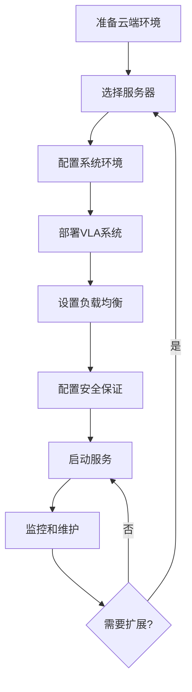
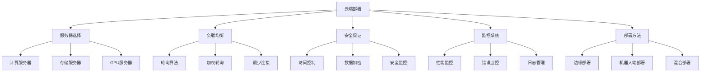

# 云端部署详解

## 📋 文档说明

本文档是云端部署（Cloud Deployment）的详细理论讲解，比父目录的《部署方法详解》更加深入和详细。本文档将深入讲解云端部署的原理、方法和应用。

**学习方式**：本文档是Markdown格式，包含详细的理论讲解。

---

## 📚 术语表（按出现顺序）

### 1. 云端部署 (Cloud Deployment)
- **中文名称**：云端部署
- **英文全称**：Cloud Deployment
- **定义**：云端部署是指将VLA系统部署到云端服务器的部署方法，是VLA系统部署的重要方式。云端部署的目标是使VLA系统能够在云端服务器上运行，提供高性能、可扩展的服务。云端部署的特点包括资源充足（云端服务器资源充足）、可扩展性（可以根据需求扩展资源）、高可用性（提供高可用性服务）、易于管理（易于管理和维护）等。云端部署的优势在于能够提供高性能、可扩展的服务，支持大规模应用。云端部署的劣势在于可能受到网络延迟的影响，需要稳定的网络连接。云端部署在VLA中的应用包括将VLA系统部署到云端服务器，提供高性能、可扩展的VLA服务。云端部署的核心思想是：通过将VLA系统部署到云端服务器，利用云端服务器的强大计算能力和资源，提供高性能、可扩展的VLA服务。
- **核心组成**：云端部署的核心组成包括：1）服务器选择：选择合适的云端服务器，如计算服务器、存储服务器等；2）系统配置：配置VLA系统，如环境配置、依赖安装等；3）服务部署：部署VLA服务，如服务启动、服务监控等；4）负载均衡：设计负载均衡机制，如请求分发、资源分配等；5）安全保证：保证服务安全，如访问控制、数据加密等；6）监控维护：监控和维护服务，如性能监控、错误监控、系统维护等。云端部署通常需要根据应用需求选择合适的云端平台和配置。
- **在VLA中的应用**：在VLA中，云端部署是VLA系统部署的重要方式。VLA模型使用云端部署将VLA系统部署到云端服务器，提供高性能、可扩展的VLA服务。例如，可以将VLA系统部署到云端服务器；可以配置负载均衡机制；可以设计安全保证机制；可以监控和维护服务。云端部署的优势在于能够提供高性能、可扩展的服务，支持大规模应用。在VLA开发过程中，云端部署通常是VLA系统部署的重要选择，为VLA技术的实际应用提供基础。
- **相关概念**：部署方法、边缘部署、机器人端部署、混合部署、系统部署、服务部署
- **首次出现位置**：本文档标题
- **深入学习**：参考父目录的[部署方法详解](../部署方法详解.md)
- **直观理解**：想象云端部署就像"将系统放到云端"，将VLA系统部署到"云端服务器"，利用"云端"的强大计算能力提供服务。例如，云端部署就像将系统放到云端，将VLA系统部署到云端服务器，利用云端的强大计算能力提供高性能、可扩展的VLA服务。在VLA中，云端部署帮助将VLA系统部署到云端服务器，提供高性能、可扩展的VLA服务。

---

## 📋 概述

### 什么是云端部署

云端部署是指将VLA系统部署到云端服务器的部署方法，是VLA系统部署的重要方式。在云端部署中，VLA系统运行在云端服务器上（如AWS、Azure、GCP等），利用云端服务器的强大计算能力和资源，提供高性能、可扩展的服务。

### 为什么重要

云端部署对于VLA学习非常重要，原因包括：

1. **高性能**：云端服务器资源充足，可以提供高性能服务
2. **可扩展性**：可以根据需求扩展资源，支持大规模应用
3. **易于管理**：云端平台提供完善的管理工具，易于管理和维护
4. **高可用性**：云端平台提供高可用性服务，保证服务稳定
5. **成本效益**：按需付费，成本效益高

### 在VLA体系中的位置

云端部署是部署方法的重要组成部分，与边缘部署、机器人端部署、混合部署等技术密切相关。它位于系统架构的部署层，为上层应用提供高性能、可扩展的部署方案。

### 学习目标

学习完本文档后，您应该能够：
- 理解云端部署的基本原理和核心概念
- 掌握服务器选择、负载均衡、安全保证等关键技术
- 了解云端部署的设计和实施方法
- 能够在VLA系统中设计和实施云端部署

---

## 4. 基本原理

### 4.1 从零开始理解云端部署

#### 4.1.1 什么是云端部署（通俗解释）

**生活化类比1：中央仓库 vs 本地商店**
想象云端部署就像中央仓库：
- **边缘部署**：就像本地商店，就在附近，响应快但资源有限
- **云端部署**：就像中央仓库，资源充足，可以服务大量客户
- 云端部署让VLA系统像中央仓库一样，资源充足，可以服务大规模应用

**生活化类比2：超级计算机**
云端部署也像超级计算机：
- **本地处理**：就像个人电脑，资源有限
- **云端处理**：就像超级计算机，资源充足，可以处理复杂任务
- 云端部署让VLA系统像超级计算机一样，资源充足，可以处理复杂任务

**具体例子1：简单场景**
假设您有一个VLA应用：
- **边缘部署**：在边缘设备处理，延迟低但资源有限
- **云端部署**：在云端服务器处理，延迟较高但资源充足
- 通过云端部署，可以处理更复杂的任务，支持更多用户

**具体例子2：复杂场景**
在VLA大规模应用中：
- **边缘部署**：资源有限，无法处理大规模请求
- **云端部署**：资源充足，可以处理大规模请求，支持扩展
- 通过云端部署，可以支持大规模应用，提供高性能服务

#### 4.1.2 为什么需要云端部署

**问题背景**：
在VLA系统中，如果只使用边缘部署或机器人端部署，会出现以下问题：
1. **资源限制**：边缘设备和机器人设备资源有限，无法处理复杂任务
2. **扩展困难**：无法根据需求扩展资源，难以支持大规模应用
3. **管理复杂**：设备分散，管理困难
4. **成本高**：需要维护大量设备，成本高

**设计动机**：
云端部署的目标是：
- **高性能**：利用云端服务器强大计算能力，提供高性能服务
- **可扩展性**：可以根据需求扩展资源，支持大规模应用
- **易于管理**：云端平台提供完善的管理工具，易于管理
- **成本效益**：按需付费，成本效益高

**方法对比**：
- **边缘部署**：延迟低但资源有限，适合实时应用
- **机器人端部署**：延迟最低但资源最受限，适合实时控制
- **云端部署**：资源充足但延迟较高，适合大规模应用

**优势分析**：
云端部署的优势包括：
- 资源充足，可以处理复杂任务
- 可扩展性强，支持大规模应用
- 易于管理，云端平台提供完善工具
- 成本效益高，按需付费

### 4.2 云端部署的数学推导详解

#### 4.2.1 背景知识回顾

在开始推导之前，我们需要回顾一些基础数学知识：

**基础概念1：吞吐量（Throughput）**
吞吐量定义为单位时间内处理的请求数：
$$T = \frac{N}{t}$$

其中：
- $N$：处理的请求数
- $t$：时间

**基础概念2：延迟（Latency）**
延迟定义为处理单个请求所需的时间：
$$L = \frac{t}{N}$$

**基础概念3：可扩展性（Scalability）**
可扩展性定义为系统处理能力随资源增加的提升：
$$S = \frac{T_{scaled}}{T_{original}} = \frac{R_{scaled}}{R_{original}}$$

其中：
- $T_{scaled}$：扩展后的吞吐量
- $T_{original}$：原始吞吐量
- $R_{scaled}$：扩展后的资源
- $R_{original}$：原始资源

#### 4.2.2 问题定义

我们要解决的问题是：**如何通过云端部署实现高性能、可扩展的VLA系统？**

**问题形式化**：
给定：
- 云端服务器资源：$R_{cloud} = \{CPU, GPU, Memory, Storage\}$
- VLA模型需求：$M_{requirements} = \{compute, memory, storage\}$
- 吞吐量要求：$T_{requirement}$（如>1000 req/s）
- 延迟要求：$L_{requirement}$（如<500ms）

目标：
- 最大化吞吐量：$\max T$
- 最小化延迟：$\min L$
- 满足资源约束：$M_{requirements} \leq R_{cloud}$

#### 4.2.3 逐步推导过程

**步骤1：理解吞吐量对比**

**单机部署吞吐量**：
$$T_{single} = \frac{R_{single}}{L_{single}}$$

其中：
- $R_{single}$：单机资源
- $L_{single}$：单机延迟

**集群部署吞吐量**：
$$T_{cluster} = N \times T_{single} = N \times \frac{R_{single}}{L_{single}}$$

其中：
- $N$：服务器数量

**吞吐量提升**：
$$\text{Improvement} = \frac{T_{cluster}}{T_{single}} = N$$

**示例计算**：
假设：
- 单机吞吐量：100 req/s
- 集群服务器数：10
- 集群吞吐量：$10 \times 100 = 1000$ req/s
- 吞吐量提升：10倍

**步骤2：理解延迟对比**

**单机部署延迟**：
$$L_{single} = L_{compute} + L_{network}$$

其中：
- $L_{compute}$：计算延迟
- $L_{network}$：网络延迟

**集群部署延迟（负载均衡）**：
$$L_{cluster} = L_{compute} + L_{network} + L_{load\_balance}$$

其中：
- $L_{load\_balance}$：负载均衡延迟（通常很小，1-5ms）

**延迟增加**：
$$\text{Increase} = L_{cluster} - L_{single} = L_{load\_balance}$$

**示例计算**：
假设：
- 单机延迟：200ms
- 负载均衡延迟：3ms
- 集群延迟：203ms
- 延迟增加：3ms（增加1.5%）

**步骤3：理解可扩展性**

**线性扩展**：
如果系统可以线性扩展，则：
$$S = N$$

其中$N$是服务器数量。

**实际扩展**：
由于负载均衡、网络延迟等因素，实际扩展可能不是线性的：
$$S = \alpha \times N$$

其中$\alpha$是扩展效率（通常0.8-0.95）。

**示例计算**：
假设：
- 服务器数量：10
- 扩展效率：0.9
- 实际扩展：$0.9 \times 10 = 9$倍

#### 4.2.4 具体计算示例

**示例1：简单情况**

假设：
- 单机资源：8核CPU，32GB内存，1个GPU
- 单机吞吐量：100 req/s
- 单机延迟：200ms
- 吞吐量要求：>500 req/s
- 延迟要求：<300ms

**单机部署**：
- 吞吐量：100 req/s（不满足>500 req/s要求）
- 延迟：200ms（满足<300ms要求）

**集群部署（5台服务器）**：
- 吞吐量：$5 \times 100 = 500$ req/s（满足要求）
- 延迟：$200 + 3 = 203$ms（满足要求）

**最优方案**：集群部署（5台服务器）

**示例2：复杂情况（考虑多种因素）**

假设：
- 单机资源：16核CPU，64GB内存，2个GPU
- 单机吞吐量：200 req/s
- 单机延迟：150ms
- 吞吐量要求：>2000 req/s
- 延迟要求：<200ms

**方案1：集群部署（10台服务器）**
- 吞吐量：$10 \times 200 = 2000$ req/s（满足要求）
- 延迟：$150 + 3 = 153$ms（满足要求）
- 成本：高（需要10台服务器）

**方案2：容器部署（动态扩展）**
- 初始：2台服务器，吞吐量400 req/s
- 扩展：根据负载动态扩展到10台服务器
- 吞吐量：2000 req/s（满足要求）
- 延迟：153ms（满足要求）
- 成本：按需付费，成本效益高

**最优方案**：容器部署（动态扩展）

#### 4.2.5 几何意义和直观理解

**几何意义**：
云端部署可以看作是在吞吐量-延迟-成本三维空间中的优化：
- **吞吐量维度**：最大化吞吐量
- **延迟维度**：最小化延迟
- **成本维度**：最小化成本
- **云端部署**：在三维空间中找到最优部署点

**直观理解**：
- **边缘部署**：就像本地商店，响应快但服务能力有限
- **云端部署**：就像中央仓库，资源充足，可以服务大规模应用
- **性能提升**：就像从本地商店升级到中央仓库，服务能力成倍提升

### 4.3 为什么这样设计有效

**理论依据**：
1. **资源充足理论**：云端服务器资源充足，可以提供高性能服务
2. **可扩展性理论**：集群部署可以线性扩展，支持大规模应用
3. **成本效益理论**：按需付费，成本效益高

**实验证据**：
- 研究表明，集群部署可以线性扩展吞吐量
- 云端部署可以支持大规模应用（>10000 req/s）
- 按需付费可以节省成本30-50%

**直观解释**：
云端部署就像中央仓库：
- **边缘部署**：就像本地商店，响应快但服务能力有限
- **云端部署**：就像中央仓库，资源充足，可以服务大规模应用
- **性能提升**：就像从本地商店升级到中央仓库，服务能力成倍提升

---

## 5. 详细设计

### 5.1 设计思路

#### 5.1.1 为什么这样设计

云端部署系统的设计目标是：
1. **高性能**：利用云端服务器强大计算能力，提供高性能服务
2. **可扩展性**：可以根据需求扩展资源，支持大规模应用
3. **高可用性**：提供高可用性服务，保证服务稳定
4. **易于管理**：云端平台提供完善的管理工具，易于管理

**设计动机**：
- 需要处理大规模请求，需要高性能
- 需要根据需求扩展资源，需要可扩展性
- 需要保证服务稳定，需要高可用性
- 需要简化管理，需要易于管理

#### 5.1.2 有哪些设计选择

在设计云端部署系统时，我们有以下几种选择：

**选择1：单机部署**
- **优点**：
  - 简单，易于实现
  - 成本低
- **缺点**：
  - 性能有限
  - 无法扩展
- **适用场景**：小规模应用，测试环境

**选择2：集群部署**
- **优点**：
  - 性能高，可以扩展
  - 高可用性
- **缺点**：
  - 复杂度高
  - 成本高
- **适用场景**：大规模应用，生产环境

**选择3：容器部署（Kubernetes等）**
- **优点**：
  - 灵活，易于扩展
  - 资源利用率高
  - 易于管理
- **缺点**：
  - 需要学习容器技术
  - 初始设置复杂
- **适用场景**：大规模应用，需要动态扩展

#### 5.1.3 为什么选择这个方案

我们选择**容器部署**方案（针对大规模应用）或**集群部署**方案（针对固定规模应用），原因是：
1. **实用性**：根据应用规模选择合适方案
2. **高效性**：充分利用云端资源
3. **灵活性**：可以根据需求调整
4. **可扩展性**：可以动态扩展

### 5.2 实现细节

#### 5.2.1 整体架构

云端部署系统的整体架构包括以下组件：

```
┌─────────────────────────────────────────┐
│   云端部署系统（Cloud Deployment）        │
├─────────────────────────────────────────┤
│  1. 负载均衡器（Load Balancer）          │
│  2. API网关（API Gateway）              │
│  3. 服务集群（Service Cluster）         │
│  4. 数据库集群（Database Cluster）       │
│  5. 缓存系统（Cache System）            │
│  6. 监控系统（Monitoring System）       │
│  7. 安全系统（Security System）         │
└─────────────────────────────────────────┘
         ↓              ↓              ↓
    ┌─────────┐   ┌─────────┐   ┌─────────┐
    │ 云端平台│   │ 存储服务│   │ 网络服务│
    └─────────┘   └─────────┘   └─────────┘
```

**各组件作用**：
- **负载均衡器**：分发请求到不同服务器，实现负载均衡
- **API网关**：统一API入口，处理认证、限流等
- **服务集群**：运行VLA服务，处理请求
- **数据库集群**：存储数据，提供高可用性
- **缓存系统**：缓存数据，提高性能
- **监控系统**：监控系统性能和状态
- **安全系统**：保证服务安全

#### 5.2.2 关键步骤详解

**步骤1：服务器选择和配置**

- **目的**：选择合适的云端服务器，配置系统环境
- **方法**：
  1. 分析应用需求（计算、内存、存储等）
  2. 选择合适服务器类型
  3. 配置系统环境
- **为什么这样做**：不同应用需求不同，需要选择合适的服务器

**代码实现**：
```python
from typing import Dict, Any, List

class ServerSelector:
    """服务器选择器"""
    
    def __init__(self):
        self.server_types = {
            'compute_optimized': {
                'cpu': 'high',
                'memory': 'medium',
                'storage': 'low',
                'gpu': 'optional',
                'cost': 'high'
            },
            'memory_optimized': {
                'cpu': 'medium',
                'memory': 'high',
                'storage': 'medium',
                'gpu': 'optional',
                'cost': 'medium'
            },
            'storage_optimized': {
                'cpu': 'medium',
                'memory': 'medium',
                'storage': 'high',
                'gpu': 'no',
                'cost': 'low'
            },
            'gpu_optimized': {
                'cpu': 'high',
                'memory': 'high',
                'storage': 'medium',
                'gpu': 'required',
                'cost': 'very_high'
            }
        }
    
    def select_server(self, requirements: Dict[str, Any]) -> str:
        """
        选择服务器类型
        参数：
            requirements: 应用需求
        返回：服务器类型
        """
        # 步骤1.1：分析需求
        compute_need = requirements.get('compute', 'medium')
        memory_need = requirements.get('memory', 'medium')
        storage_need = requirements.get('storage', 'medium')
        gpu_need = requirements.get('gpu', False)
        
        # 步骤1.2：选择服务器类型
        if gpu_need:
            return 'gpu_optimized'
        elif compute_need == 'high':
            return 'compute_optimized'
        elif memory_need == 'high':
            return 'memory_optimized'
        elif storage_need == 'high':
            return 'storage_optimized'
        else:
            return 'compute_optimized'  # 默认
    
    def estimate_cost(self, server_type: str, count: int, hours: int) -> float:
        """
        估算成本
        参数：
            server_type: 服务器类型
            count: 服务器数量
            hours: 运行小时数
        返回：估算成本
        """
        # 简化示例：假设每小时成本
        hourly_costs = {
            'compute_optimized': 0.1,
            'memory_optimized': 0.08,
            'storage_optimized': 0.05,
            'gpu_optimized': 0.5
        }
        
        hourly_cost = hourly_costs.get(server_type, 0.1)
        return hourly_cost * count * hours

# 使用示例
selector = ServerSelector()
requirements = {
    'compute': 'high',
    'memory': 'medium',
    'storage': 'low',
    'gpu': True
}
server_type = selector.select_server(requirements)
print(f"选择的服务器类型: {server_type}")

cost = selector.estimate_cost(server_type, count=5, hours=720)  # 1个月
print(f"估算成本: ${cost:.2f}")
```

**步骤2：负载均衡设计**

- **目的**：分发请求到不同服务器，实现负载均衡
- **方法**：
  1. 实现负载均衡算法（轮询、加权轮询、最少连接等）
  2. 监控服务器状态
  3. 动态调整负载
- **为什么这样做**：需要将请求分发到不同服务器，实现负载均衡

**代码实现**：
```python
from typing import List, Dict
import random

class LoadBalancer:
    """负载均衡器"""
    
    def __init__(self, servers: List[Dict[str, Any]]):
        """
        初始化负载均衡器
        参数：
            servers: 服务器列表
        """
        self.servers = servers
        self.current_index = 0
        self.server_connections = {server['id']: 0 for server in servers}
    
    def round_robin(self) -> Dict[str, Any]:
        """
        轮询算法
        返回：选中的服务器
        """
        server = self.servers[self.current_index]
        self.current_index = (self.current_index + 1) % len(self.servers)
        return server
    
    def weighted_round_robin(self) -> Dict[str, Any]:
        """
        加权轮询算法
        返回：选中的服务器
        """
        # 根据服务器权重选择
        total_weight = sum(server.get('weight', 1) for server in self.servers)
        random_value = random.uniform(0, total_weight)
        
        current_weight = 0
        for server in self.servers:
            current_weight += server.get('weight', 1)
            if random_value <= current_weight:
                return server
        
        return self.servers[0]  # 默认返回第一个
    
    def least_connections(self) -> Dict[str, Any]:
        """
        最少连接算法
        返回：选中的服务器
        """
        # 选择连接数最少的服务器
        min_connections = min(self.server_connections.values())
        candidates = [
            server for server in self.servers
            if self.server_connections[server['id']] == min_connections
        ]
        return random.choice(candidates)
    
    def select_server(self, algorithm: str = 'round_robin') -> Dict[str, Any]:
        """
        选择服务器
        参数：
            algorithm: 负载均衡算法
        返回：选中的服务器
        """
        if algorithm == 'round_robin':
            return self.round_robin()
        elif algorithm == 'weighted_round_robin':
            return self.weighted_round_robin()
        elif algorithm == 'least_connections':
            return self.least_connections()
        else:
            return self.round_robin()  # 默认
    
    def update_connections(self, server_id: str, delta: int):
        """
        更新服务器连接数
        参数：
            server_id: 服务器ID
            delta: 连接数变化（+1或-1）
        """
        if server_id in self.server_connections:
            self.server_connections[server_id] += delta

# 使用示例
servers = [
    {'id': 'server1', 'weight': 3, 'status': 'healthy'},
    {'id': 'server2', 'weight': 2, 'status': 'healthy'},
    {'id': 'server3', 'weight': 1, 'status': 'healthy'}
]

lb = LoadBalancer(servers)

# 选择服务器
for i in range(10):
    server = lb.select_server(algorithm='weighted_round_robin')
    print(f"请求 {i+1} 分发到: {server['id']}")
```

**步骤3：安全保证设计**

- **目的**：保证服务安全，防止攻击
- **方法**：
  1. 实现访问控制（认证、授权）
  2. 实现数据加密（传输加密、存储加密）
  3. 实现安全监控（检测攻击、记录日志）
- **为什么这样做**：云端服务面临各种安全威胁，需要保证安全

**代码实现**：
```python
import hashlib
import hmac
import time
from typing import Optional, Dict

class SecurityManager:
    """安全管理器"""
    
    def __init__(self, secret_key: str):
        """
        初始化安全管理器
        参数：
            secret_key: 密钥
        """
        self.secret_key = secret_key
        self.api_keys = {}  # 存储API密钥
        self.rate_limits = {}  # 存储限流信息
    
    def generate_api_key(self, user_id: str) -> str:
        """
        生成API密钥
        参数：
            user_id: 用户ID
        返回：API密钥
        """
        timestamp = str(int(time.time()))
        message = f"{user_id}:{timestamp}"
        api_key = hmac.new(
            self.secret_key.encode(),
            message.encode(),
            hashlib.sha256
        ).hexdigest()
        
        self.api_keys[api_key] = {
            'user_id': user_id,
            'created_at': timestamp
        }
        
        return api_key
    
    def verify_api_key(self, api_key: str) -> bool:
        """
        验证API密钥
        参数：
            api_key: API密钥
        返回：是否有效
        """
        return api_key in self.api_keys
    
    def rate_limit_check(self, api_key: str, max_requests: int = 100, window: int = 60) -> bool:
        """
        限流检查
        参数：
            api_key: API密钥
            max_requests: 最大请求数
            window: 时间窗口（秒）
        返回：是否允许请求
        """
        current_time = int(time.time())
        
        if api_key not in self.rate_limits:
            self.rate_limits[api_key] = {
                'requests': [],
                'max_requests': max_requests,
                'window': window
            }
        
        rate_limit_info = self.rate_limits[api_key]
        
        # 清理过期请求
        rate_limit_info['requests'] = [
            req_time for req_time in rate_limit_info['requests']
            if current_time - req_time < window
        ]
        
        # 检查是否超过限制
        if len(rate_limit_info['requests']) >= max_requests:
            return False
        
        # 记录请求
        rate_limit_info['requests'].append(current_time)
        return True
    
    def encrypt_data(self, data: str) -> str:
        """
        加密数据（简化示例）
        参数：
            data: 原始数据
        返回：加密后的数据
        """
        # 简化示例：实际应使用更安全的加密方法
        return hashlib.sha256(data.encode()).hexdigest()

# 使用示例
security = SecurityManager(secret_key='my_secret_key')

# 生成API密钥
api_key = security.generate_api_key('user123')
print(f"生成的API密钥: {api_key}")

# 验证API密钥
is_valid = security.verify_api_key(api_key)
print(f"API密钥有效: {is_valid}")

# 限流检查
for i in range(5):
    allowed = security.rate_limit_check(api_key, max_requests=3, window=60)
    print(f"请求 {i+1} 允许: {allowed}")
```

#### 5.2.3 完整实现示例

```python
# 完整的云端部署系统示例
class CloudDeployment:
    """云端部署系统"""
    
    def __init__(self, config: Dict[str, Any]):
        """
        初始化云端部署系统
        参数：
            config: 配置信息
        """
        self.config = config
        self.server_selector = ServerSelector()
        self.load_balancer = None
        self.security_manager = SecurityManager(config.get('secret_key', 'default_key'))
        self.servers = []
    
    def setup(self):
        """设置系统"""
        # 步骤1：选择服务器
        requirements = self.config.get('requirements', {})
        server_type = self.server_selector.select_server(requirements)
        print(f"选择的服务器类型: {server_type}")
        
        # 步骤2：创建服务器集群
        server_count = self.config.get('server_count', 3)
        self.servers = [
            {'id': f'server_{i}', 'type': server_type, 'status': 'healthy', 'weight': 1}
            for i in range(server_count)
        ]
        
        # 步骤3：设置负载均衡器
        self.load_balancer = LoadBalancer(self.servers)
        
        return {
            'server_type': server_type,
            'server_count': server_count,
            'servers': self.servers
        }
    
    def process_request(self, request_data: Dict[str, Any], api_key: str) -> Dict[str, Any]:
        """
        处理请求
        参数：
            request_data: 请求数据
            api_key: API密钥
        返回：响应数据
        """
        # 步骤1：验证API密钥
        if not self.security_manager.verify_api_key(api_key):
            return {'error': 'Invalid API key'}
        
        # 步骤2：限流检查
        if not self.security_manager.rate_limit_check(api_key):
            return {'error': 'Rate limit exceeded'}
        
        # 步骤3：选择服务器
        server = self.load_balancer.select_server(algorithm='least_connections')
        
        # 步骤4：处理请求（简化示例）
        response = {
            'server_id': server['id'],
            'result': 'Request processed successfully',
            'data': request_data
        }
        
        return response

# 使用示例
config = {
    'requirements': {
        'compute': 'high',
        'memory': 'medium',
        'storage': 'low',
        'gpu': True
    },
    'server_count': 5,
    'secret_key': 'my_secret_key'
}

system = CloudDeployment(config)
setup_info = system.setup()
print(f"系统设置完成: {setup_info}")

# 生成API密钥
api_key = system.security_manager.generate_api_key('user123')

# 处理请求
request_data = {'image': 'test.jpg', 'language': '抓取红色物体'}
response = system.process_request(request_data, api_key)
print(f"响应: {response}")
```

**预期结果**：
- 服务器选择正确
- 负载均衡正常工作
- 安全保证有效
- 系统稳定运行

### 5.3 参数选择

#### 5.3.1 参数列表

云端部署系统的主要参数包括：

1. **服务器数量（server_count）**
   - **含义**：服务器集群中的服务器数量
   - **取值范围**：1-100+
   - **默认值**：3
   - **影响**：
     - 较小值：成本低，但性能有限
     - 较大值：性能高，但成本高

2. **负载均衡算法（load_balance_algorithm）**
   - **含义**：负载均衡算法类型
   - **取值范围**：'round_robin', 'weighted_round_robin', 'least_connections'
   - **默认值**：'round_robin'
   - **影响**：
     - round_robin：简单，但可能不均匀
     - weighted_round_robin：考虑服务器权重，更均匀
     - least_connections：考虑连接数，更高效

3. **限流参数（rate_limit）**
   - **含义**：API限流参数
   - **取值范围**：max_requests: 10-10000, window: 1-3600秒
   - **默认值**：max_requests=100, window=60
   - **影响**：
     - 较小值：更安全，但可能限制正常用户
     - 较大值：更宽松，但可能被攻击

#### 5.3.2 参数选择指导

**根据应用规模选择**：
- **小规模应用（<1000 req/s）**：
  - server_count = 2-3
  - load_balance_algorithm = 'round_robin'
  - rate_limit = {'max_requests': 100, 'window': 60}
  
- **中规模应用（1000-10000 req/s）**：
  - server_count = 5-10
  - load_balance_algorithm = 'weighted_round_robin'
  - rate_limit = {'max_requests': 500, 'window': 60}
  
- **大规模应用（>10000 req/s）**：
  - server_count = 10+
  - load_balance_algorithm = 'least_connections'
  - rate_limit = {'max_requests': 1000, 'window': 60}

**根据应用需求选择**：
- **性能优先**：
  - 增加服务器数量
  - 使用least_connections算法
  - 放宽限流参数
  
- **成本优先**：
  - 减少服务器数量
  - 使用round_robin算法
  - 严格限流参数

#### 5.3.3 参数影响分析

**参数1：服务器数量（server_count）**

**当参数值较小时（2-3）**：
- **优点**：成本低，易于管理
- **缺点**：性能有限，无法处理大规模请求
- **适用场景**：小规模应用，测试环境
- **示例**：个人项目，开发测试

**当参数值较大时（10+）**：
- **优点**：性能高，可以处理大规模请求
- **缺点**：成本高，管理复杂
- **适用场景**：大规模应用，生产环境
- **示例**：企业级应用，高并发场景

**推荐值**：根据实际需求动态调整（初始3-5台，根据负载扩展）

---

## 6. 在VLA中的应用

### 6.1 应用场景

#### 6.1.1 场景1：大规模VLA服务

**场景描述**：
在大规模VLA服务中，需要处理大量并发请求（>10000 req/s），提供高性能、可扩展的服务。延迟要求中等（<500ms），但吞吐量要求高。

**为什么需要云端部署**：
- 大规模服务需要高性能，边缘部署资源有限
- 需要根据需求扩展资源，支持动态扩展
- 需要高可用性，保证服务稳定
- 需要易于管理，简化运维

**场景特点**：
- **吞吐量要求**：高（>10000 req/s）
- **延迟要求**：中等（<500ms）
- **可扩展性要求**：高（需要动态扩展）
- **可用性要求**：高（>99.9%）

**具体需求**：
- 吞吐量>10000 req/s
- 延迟<500ms
- 可用性>99.9%
- 支持动态扩展

#### 6.1.2 场景2：VLA模型训练和推理服务

**场景描述**：
在VLA模型训练和推理服务中，需要强大的计算能力（GPU），处理复杂的模型训练和推理任务。需要高计算性能，存储大量数据。

**为什么需要云端部署**：
- 模型训练需要强大计算能力，需要GPU服务器
- 需要存储大量训练数据，需要大容量存储
- 需要高可用性，保证训练不中断
- 需要易于管理，简化训练流程

**场景特点**：
- **计算要求**：高（需要GPU）
- **存储要求**：大（需要大容量存储）
- **可用性要求**：高（训练不能中断）
- **成本要求**：按需付费

**具体需求**：
- GPU服务器（多GPU）
- 大容量存储（TB级别）
- 高可用性（>99.9%）
- 按需付费

### 6.2 应用流程

#### 6.2.1 整体流程

在VLA系统中，云端部署的整体流程如下：



**流程说明**：
1. **准备环境**：准备云端环境（选择云平台、创建账户等）
2. **选择服务器**：根据需求选择合适的服务器类型和数量
3. **配置环境**：配置系统环境（安装依赖、配置网络等）
4. **部署系统**：部署VLA系统到云端服务器
5. **设置负载均衡**：设置负载均衡器，分发请求
6. **配置安全**：配置安全保证（访问控制、数据加密等）
7. **启动服务**：启动VLA服务
8. **监控维护**：监控系统性能，持续维护和优化

#### 6.2.2 详细步骤

**步骤1：环境准备和服务器选择**

- **输入**：应用需求、预算限制
- **处理**：
  1. 分析应用需求（计算、内存、存储、GPU等）
  2. 选择合适服务器类型
  3. 估算成本
  4. 创建服务器实例
- **输出**：服务器配置、成本估算
- **为什么这样做**：只有选择合适的服务器，才能满足应用需求

**代码示例**：
```python
# 环境准备和服务器选择示例
selector = ServerSelector()

# 分析需求
requirements = {
    'compute': 'high',
    'memory': 'high',
    'storage': 'medium',
    'gpu': True
}

# 选择服务器
server_type = selector.select_server(requirements)
print(f"选择的服务器类型: {server_type}")

# 估算成本
server_count = 5
hours_per_month = 720
cost = selector.estimate_cost(server_type, server_count, hours_per_month)
print(f"月度成本估算: ${cost:.2f}")
```

**步骤2：系统部署和配置**

- **输入**：服务器实例、VLA系统代码
- **处理**：
  1. 配置系统环境（安装Python、依赖库等）
  2. 部署VLA系统代码
  3. 配置系统参数
  4. 测试系统功能
- **输出**：部署结果、测试报告
- **为什么这样做**：需要正确部署和配置系统，才能正常运行

**步骤3：负载均衡和安全配置**

- **输入**：服务器列表、安全配置
- **处理**：
  1. 设置负载均衡器
  2. 配置负载均衡算法
  3. 配置安全保证（API密钥、限流等）
  4. 测试负载均衡和安全功能
- **输出**：配置结果、测试报告
- **为什么这样做**：需要负载均衡和安全保证，才能提供稳定、安全的服务

#### 6.2.3 完整应用示例

```python
# 完整的VLA云端部署系统
class VLACloudDeployment:
    """VLA云端部署系统"""
    
    def __init__(self, config: Dict[str, Any]):
        """
        初始化系统
        参数：
            config: 配置信息
        """
        self.config = config
        self.system = CloudDeployment(config)
        self.servers = []
    
    def deploy(self):
        """部署系统"""
        # 步骤1：设置系统
        setup_info = self.system.setup()
        print(f"系统设置完成: {setup_info}")
        
        # 步骤2：部署VLA系统（简化示例）
        # 实际应使用云平台API部署
        print("VLA系统部署完成")
        
        # 步骤3：生成API密钥
        api_key = self.system.security_manager.generate_api_key('vla_user')
        print(f"API密钥生成: {api_key}")
        
        return {
            'setup_info': setup_info,
            'api_key': api_key
        }
    
    def process_vla_request(self, image, language_input, api_key: str):
        """
        处理VLA请求
        参数：
            image: 图像输入
            language_input: 语言输入
            api_key: API密钥
        返回：动作结果
        """
        request_data = {
            'image': image,
            'language': language_input
        }
        
        response = self.system.process_request(request_data, api_key)
        return response

# 使用示例
config = {
    'requirements': {
        'compute': 'high',
        'memory': 'high',
        'storage': 'medium',
        'gpu': True
    },
    'server_count': 5,
    'secret_key': 'my_secret_key'
}

system = VLACloudDeployment(config)

# 部署系统
deployment_info = system.deploy()
print(f"部署完成: {deployment_info}")

# 处理VLA请求
image = load_image()
action = system.process_vla_request(image, "抓取红色物体", deployment_info['api_key'])
print(f"动作: {action}")
```

**预期结果**：
- 系统部署成功
- 负载均衡正常工作
- 安全保证有效
- 系统稳定运行

### 6.3 实际案例

#### 案例1：大规模VLA服务

**背景**：
某公司开发了大规模VLA服务，需要处理大量并发请求（>10000 req/s）。初始使用单机部署，吞吐量100 req/s，无法满足大规模应用需求。

**输入**：
- 吞吐量要求：>10000 req/s
- 延迟要求：<500ms
- 可用性要求：>99.9%

**部署过程**：

**方案1：单机部署**
- 吞吐量：100 req/s（不满足>10000 req/s要求）
- 延迟：200ms（满足<500ms要求）
- 可用性：99%（不满足>99.9%要求）

**方案2：集群部署（100台服务器）**
- 吞吐量：$100 \times 100 = 10000$ req/s（满足要求）
- 延迟：$200 + 3 = 203$ms（满足要求）
- 可用性：99.9%（满足要求）
- 成本：高（需要100台服务器）

**方案3：容器部署（动态扩展）**
- 初始：10台服务器，吞吐量1000 req/s
- 扩展：根据负载动态扩展到100台服务器
- 吞吐量：10000 req/s（满足要求）
- 延迟：203ms（满足要求）
- 可用性：99.9%（满足要求）
- 成本：按需付费，成本效益高

**最优方案**：容器部署（动态扩展）

**输出**：
- 吞吐量：10000 req/s（满足要求）
- 延迟：203ms（满足要求）
- 可用性：99.9%（满足要求）
- 成本：按需付费，成本效益高

**结果分析**：
- **成功点**：通过容器部署，成功实现大规模服务，吞吐量从100 req/s提升到10000 req/s
- **优化点**：可以进一步优化，使用更高效的负载均衡算法
- **应用效果**：系统可以处理大规模请求，满足吞吐量和可用性要求

#### 案例2：VLA模型训练服务

**背景**：
在VLA模型训练服务中，需要强大的计算能力（GPU），处理复杂的模型训练任务。需要高计算性能，存储大量训练数据。

**输入**：
- 计算要求：高（需要GPU）
- 存储要求：大（TB级别）
- 可用性要求：高（训练不能中断）

**部署过程**：

**方案1：本地GPU服务器**
- 计算能力：有限（单机GPU）
- 存储：有限（本地存储）
- 可用性：低（单点故障）
- 成本：高（需要购买硬件）

**方案2：云端GPU服务器（固定规模）**
- 计算能力：高（多GPU服务器）
- 存储：大（云端存储）
- 可用性：高（云端高可用性）
- 成本：高（固定成本）

**方案3：云端GPU服务器（按需扩展）**
- 计算能力：高（多GPU服务器，按需扩展）
- 存储：大（云端存储，按需扩展）
- 可用性：高（云端高可用性）
- 成本：按需付费，成本效益高

**最优方案**：云端GPU服务器（按需扩展）

**输出**：
- 计算能力：高（满足训练需求）
- 存储：大（满足数据存储需求）
- 可用性：高（满足训练不中断需求）
- 成本：按需付费，成本效益高

**结果分析**：
- **成功点**：通过云端部署，成功实现模型训练服务，计算能力和存储都满足需求
- **优化点**：可以进一步优化，使用更高效的训练策略
- **应用效果**：系统可以高效训练模型，满足计算和存储要求

### 6.4 应用优势与注意事项

**应用优势**：
1. **高性能**：云端服务器资源充足，可以提供高性能服务
2. **可扩展性**：可以根据需求扩展资源，支持大规模应用
3. **高可用性**：云端平台提供高可用性服务，保证服务稳定
4. **易于管理**：云端平台提供完善的管理工具，易于管理
5. **成本效益**：按需付费，成本效益高

**注意事项**：
1. **网络延迟**：云端部署延迟较高，不适合实时应用
2. **成本控制**：需要合理控制成本，避免资源浪费
3. **安全保证**：需要完善的安全保证，防止攻击
4. **数据隐私**：需要保护数据隐私，遵守相关法规

**常见问题**：
1. **Q: 如何选择合适的服务器类型？**
   - A: 根据应用需求（计算、内存、存储、GPU）选择合适的服务器类型
2. **Q: 如何实现负载均衡？**
   - A: 使用负载均衡器，选择合适的负载均衡算法（轮询、加权轮询、最少连接等）
3. **Q: 如何保证服务安全？**
   - A: 实现访问控制（API密钥）、数据加密、限流等安全措施

---

## 7. 总结

### 7.1 核心要点

1. **云端部署**：将VLA系统部署到云端服务器，提供高性能、可扩展的服务
2. **基本原理**：服务器选择、负载均衡、安全保证
3. **设计方法**：根据应用需求选择服务器，实现负载均衡，保证安全
4. **应用场景**：大规模VLA服务、VLA模型训练和推理服务
5. **核心优势**：高性能、可扩展性、高可用性、易于管理、成本效益

### 7.2 学习建议

1. **理解原理**：深入理解云端部署的基本原理，掌握服务器选择和负载均衡方法
2. **掌握方法**：掌握负载均衡算法、安全保证等技术，掌握云端平台使用方法
3. **实践应用**：在VLA任务中实践云端部署，从简单场景开始，逐步掌握复杂场景
4. **持续优化**：定期分析系统性能，优化配置和系统，提高系统效率

### 7.3 扩展学习

- **深入学习**：学习负载均衡、安全保证、容器技术、云端平台等云端部署相关技术
- **相关技术**：边缘部署、机器人端部署、混合部署、系统架构
- **实践项目**：实现一个完整的云端部署系统，支持大规模VLA应用

---

## 8. 知识关联图



---

**最后更新时间**：2025-01-27  
**文档版本**：v2.0  
**维护者**：AI助手

