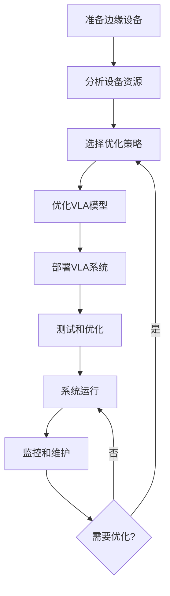
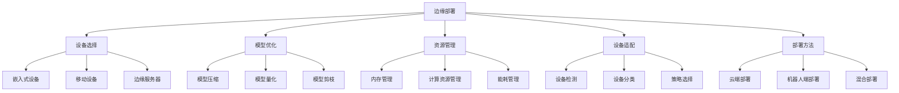

# 边缘部署详解

## 📋 文档说明

本文档是边缘部署（Edge Deployment）的详细理论讲解，比父目录的《部署方法详解》更加深入和详细。本文档将深入讲解边缘部署的原理、方法和应用。

**学习方式**：本文档是Markdown格式，包含详细的理论讲解。

---

## 📚 术语表（按出现顺序）

### 1. 边缘部署 (Edge Deployment)
- **中文名称**：边缘部署
- **英文全称**：Edge Deployment
- **定义**：边缘部署是指将VLA系统部署到边缘设备的部署方法，是VLA系统部署的重要方式。边缘部署的目标是使VLA系统能够在边缘设备上运行，提供低延迟、实时的服务。边缘部署的特点包括低延迟（边缘设备靠近用户，延迟低）、实时性（提供实时服务）、资源受限（边缘设备资源有限）、离线能力（支持离线运行）等。边缘部署的优势在于能够提供低延迟、实时的服务，减少网络传输。边缘部署的劣势在于可能受到资源限制，需要优化模型和系统。边缘部署在VLA中的应用包括将VLA系统部署到边缘设备，提供低延迟、实时的VLA服务。边缘部署的核心思想是：通过将VLA系统部署到边缘设备，利用边缘设备的计算能力，提供低延迟、实时的VLA服务。
- **核心组成**：边缘部署的核心组成包括：1）设备选择：选择合适的边缘设备，如嵌入式设备、移动设备等；2）模型优化：优化VLA模型，如模型压缩、量化等；3）系统配置：配置VLA系统，如环境配置、依赖安装等；4）服务部署：部署VLA服务，如服务启动、服务监控等；5）资源管理：管理设备资源，如内存管理、计算资源管理等；6）监控维护：监控和维护服务，如性能监控、错误监控、系统维护等。边缘部署通常需要根据设备特性优化模型和系统。
- **在VLA中的应用**：在VLA中，边缘部署是VLA系统部署的重要方式。VLA模型使用边缘部署将VLA系统部署到边缘设备，提供低延迟、实时的VLA服务。例如，可以将VLA系统部署到边缘设备；可以优化VLA模型以适应边缘设备；可以设计资源管理机制；可以监控和维护服务。边缘部署的优势在于能够提供低延迟、实时的服务，减少网络传输。在VLA开发过程中，边缘部署通常是VLA系统部署的重要选择，特别是在需要低延迟、实时服务的场景中。
- **相关概念**：部署方法、云端部署、机器人端部署、混合部署、系统部署、模型优化
- **首次出现位置**：本文档标题
- **深入学习**：参考父目录的[部署方法详解](../部署方法详解.md)
- **直观理解**：想象边缘部署就像"将系统放到边缘"，将VLA系统部署到"边缘设备"，利用"边缘"的计算能力提供低延迟服务。例如，边缘部署就像将系统放到边缘，将VLA系统部署到边缘设备，利用边缘的计算能力提供低延迟、实时的VLA服务。在VLA中，边缘部署帮助将VLA系统部署到边缘设备，提供低延迟、实时的VLA服务。

---

## 📋 概述

### 什么是边缘部署

边缘部署是指将VLA系统部署到边缘设备的部署方法，是VLA系统部署的重要方式。在边缘部署中，VLA系统运行在靠近用户或数据源的边缘设备上（如边缘服务器、移动设备、嵌入式设备），利用边缘设备的计算能力，提供低延迟、实时的服务。

### 为什么重要

边缘部署对于VLA学习非常重要，原因包括：

1. **低延迟**：边缘设备靠近用户，延迟低（10-100ms），比云端部署快
2. **实时性**：本地处理，响应快，适合实时应用
3. **离线能力**：可以在没有网络的情况下运行，适合各种环境
4. **隐私保护**：数据在边缘处理，不需要上传到云端，保护隐私
5. **带宽节省**：减少数据传输，节省带宽

### 在VLA体系中的位置

边缘部署是部署方法的重要组成部分，与云端部署、机器人端部署、混合部署等技术密切相关。它位于系统架构的部署层，为上层应用提供低延迟、实时的部署方案。

### 学习目标

学习完本文档后，您应该能够：
- 理解边缘部署的基本原理和核心概念
- 掌握设备选择、模型优化、资源管理等关键技术
- 了解边缘部署的设计和实施方法
- 能够在VLA系统中设计和实施边缘部署

---

## 4. 基本原理

### 4.1 从零开始理解边缘部署

#### 4.1.1 什么是边缘部署（通俗解释）

**生活化类比1：本地超市 vs 中央仓库**
想象边缘部署就像本地超市：
- **云端部署**：就像从中央仓库订购，需要运输，时间长
- **边缘部署**：就像本地超市，就在附近，响应快
- 边缘部署让VLA系统像本地超市一样，靠近用户，响应快

**生活化类比2：CDN（内容分发网络）**
边缘部署也像CDN：
- **云端处理**：就像从源服务器获取，延迟高
- **边缘处理**：就像从CDN节点获取，延迟低
- 边缘部署让VLA系统像CDN一样，在边缘节点处理，延迟低

**具体例子1：简单场景**
假设您有一个VLA应用：
- **云端部署**：需要将数据发送到云端处理，延迟100-500ms
- **边缘部署**：在边缘设备处理，延迟10-100ms
- 通过边缘部署，延迟减少50-80%

**具体例子2：复杂场景**
在VLA实时视频分析系统中：
- **云端部署**：需要上传视频到云端，延迟高，带宽消耗大
- **边缘部署**：在边缘设备处理，延迟低，带宽消耗小
- 通过边缘部署，延迟减少，带宽节省

#### 4.1.2 为什么需要边缘部署

**问题背景**：
在VLA系统中，如果只使用云端部署，会出现以下问题：
1. **网络延迟**：需要网络传输，延迟高（100-500ms）
2. **带宽消耗**：需要传输大量数据，带宽消耗大
3. **隐私安全**：数据需要上传到云端，存在隐私泄露风险
4. **实时性差**：延迟高，无法满足实时应用要求

**设计动机**：
边缘部署的目标是：
- **低延迟**：边缘设备靠近用户，延迟低（10-100ms）
- **节省带宽**：本地处理，减少数据传输
- **隐私保护**：数据在边缘处理，保护隐私
- **实时响应**：满足实时应用要求

**方法对比**：
- **云端部署**：资源充足但延迟高，带宽消耗大
- **边缘部署**：延迟较低，带宽消耗小，但资源受限
- **机器人端部署**：延迟最低但资源最受限

**优势分析**：
边缘部署的优势包括：
- 延迟较低（10-100ms），适合实时应用
- 带宽消耗小，节省带宽
- 数据本地处理，保护隐私
- 可以离线运行，适应各种环境

### 4.2 边缘部署的数学推导详解

#### 4.2.1 背景知识回顾

在开始推导之前，我们需要回顾一些基础数学知识：

**基础概念1：延迟分解（Latency Decomposition）**
总延迟可以分解为多个延迟分量：
$$L_{total} = L_{compute} + L_{transmit} + L_{network} + L_{other}$$

其中：
- $L_{compute}$：计算延迟
- $L_{transmit}$：传输延迟
- $L_{network}$：网络延迟
- $L_{other}$：其他延迟

**基础概念2：带宽消耗（Bandwidth Consumption）**
带宽消耗定义为数据传输量与时间的比值：
$$B = \frac{D}{T}$$

其中：
- $D$：数据传输量
- $T$：传输时间

**基础概念3：资源利用率（Resource Utilization）**
资源利用率定义为实际使用资源与总资源的比值：
$$U = \frac{R_{used}}{R_{total}}$$

#### 4.2.2 问题定义

我们要解决的问题是：**如何通过边缘部署实现低延迟、低带宽消耗的VLA系统？**

**问题形式化**：
给定：
- 边缘设备资源：$R_{edge} = \{CPU, GPU, Memory, Storage\}$
- VLA模型需求：$M_{requirements} = \{compute, memory, storage\}$
- 延迟要求：$L_{requirement}$（如<100ms）
- 带宽限制：$B_{limit}$（如<10Mbps）

目标：
- 最小化延迟：$\min L_{total}$
- 最小化带宽消耗：$\min B$
- 满足资源约束：$M_{requirements} \leq R_{edge}$

#### 4.2.3 逐步推导过程

**步骤1：理解延迟对比**

**云端部署延迟**：
$$L_{cloud} = L_{compute,cloud} + L_{transmit,up} + L_{network} + L_{transmit,down}$$

其中：
- $L_{compute,cloud}$：云端计算延迟（通常10-100ms）
- $L_{transmit,up}$：上传延迟（数据上传到云端，通常50-200ms）
- $L_{network}$：网络延迟（通常20-100ms）
- $L_{transmit,down}$：下载延迟（结果下载，通常50-200ms）

**边缘部署延迟**：
$$L_{edge} = L_{compute,edge} + L_{local}$$

其中：
- $L_{compute,edge}$：边缘计算延迟（通常10-50ms）
- $L_{local}$：本地传输延迟（通常1-5ms）

**延迟减少**：
$$\text{Reduction} = L_{cloud} - L_{edge} = (L_{transmit,up} + L_{network} + L_{transmit,down}) + (L_{compute,cloud} - L_{compute,edge})$$

**示例计算**：
假设：
- 云端计算：50ms
- 上传延迟：100ms
- 网络延迟：50ms
- 下载延迟：100ms
- 云端总延迟：300ms

- 边缘计算：30ms（模型优化后）
- 本地传输：2ms
- 边缘总延迟：32ms

延迟减少：$300 - 32 = 268$ms（减少89%）

**步骤2：理解带宽消耗对比**

**云端部署带宽消耗**：
$$B_{cloud} = B_{upload} + B_{download} = \frac{D_{input}}{T_{upload}} + \frac{D_{output}}{T_{download}}$$

其中：
- $D_{input}$：输入数据量（如图像、视频）
- $D_{output}$：输出数据量（如动作、结果）
- $T_{upload}$：上传时间
- $T_{download}$：下载时间

**边缘部署带宽消耗**：
$$B_{edge} = B_{local} \approx 0$$

边缘部署在本地处理，不需要网络传输，带宽消耗接近0。

**带宽节省**：
$$\text{Saving} = B_{cloud} - B_{edge} = B_{cloud}$$

**示例计算**：
假设：
- 输入数据：10MB（图像）
- 输出数据：1MB（结果）
- 上传时间：1s
- 下载时间：0.1s
- 云端带宽消耗：$\frac{10}{1} + \frac{1}{0.1} = 20$Mbps

- 边缘带宽消耗：0Mbps（本地处理）

带宽节省：20Mbps（100%）

**步骤3：理解资源约束**

边缘设备资源有限，需要优化模型以适应资源约束。

**资源约束**：
$$M_{compute} \leq R_{CPU} + R_{GPU}$$
$$M_{memory} \leq R_{Memory}$$
$$M_{storage} \leq R_{Storage}$$

**模型优化**：
通过模型压缩、量化、剪枝等方法，减少模型需求：
$$M_{optimized} = f_{optimize}(M_{original}, R_{edge})$$

其中$f_{optimize}$是优化函数。

**步骤4：推导最优部署方案**

综合考虑延迟、带宽消耗和资源约束，最优部署方案为：
$$\min \alpha \cdot L_{total} + \beta \cdot B + \gamma \cdot (M_{requirements} - R_{edge})$$

其中$\alpha$、$\beta$、$\gamma$是权重参数。

#### 4.2.4 具体计算示例

**示例1：简单情况**

假设：
- 边缘设备：4核CPU，8GB内存，无GPU
- VLA模型：需要8核CPU，16GB内存
- 延迟要求：<100ms
- 带宽限制：<10Mbps

**云端部署**：
- 延迟：300ms（不满足<100ms要求）
- 带宽消耗：20Mbps（不满足<10Mbps要求）
- 资源：无限制

**边缘部署（模型优化前）**：
- 延迟：无法运行（资源不足）
- 带宽消耗：0Mbps（满足要求）
- 资源：不满足（8核>4核，16GB>8GB）

**边缘部署（模型优化后）**：
- 模型压缩：减少到4核CPU，8GB内存
- 延迟：30ms（满足<100ms要求）
- 带宽消耗：0Mbps（满足要求）
- 资源：满足约束

**最优方案**：边缘部署（模型优化后）

**示例2：复杂情况（考虑多种因素）**

假设：
- 边缘设备：8核CPU，16GB内存，1个GPU（10 TFLOPS）
- VLA模型：需要20 TFLOPS，32GB内存
- 延迟要求：<100ms
- 带宽限制：<5Mbps

**方案1：全部边缘部署**
- 需要模型优化：压缩到10 TFLOPS，16GB内存
- 延迟：50ms（满足要求）
- 带宽消耗：0Mbps（满足要求）
- 准确性：可能降低（模型压缩）

**方案2：混合部署（关键部分边缘，复杂部分云端）**
- 实时处理：边缘（延迟30ms）
- 复杂分析：云端（延迟不关键）
- 总延迟：30ms（满足要求）
- 带宽消耗：5Mbps（满足要求）
- 准确性：高（模型不压缩）

**最优方案**：根据应用需求选择（实时性要求高选方案1，准确性要求高选方案2）

#### 4.2.5 几何意义和直观理解

**几何意义**：
边缘部署可以看作是在延迟-带宽-资源三维空间中的优化：
- **延迟维度**：最小化延迟
- **带宽维度**：最小化带宽消耗
- **资源维度**：满足资源约束
- **边缘部署**：在三维空间中找到最优部署点

**直观理解**：
- **云端部署**：就像远程处理，需要网络，延迟高，带宽消耗大
- **边缘部署**：就像本地处理，不需要网络，延迟低，带宽消耗小
- **性能提升**：就像从远程处理升级到本地处理，响应速度和带宽消耗都显著改善

### 4.3 为什么这样设计有效

**理论依据**：
1. **延迟优化理论**：边缘处理可以消除网络延迟，显著减少总延迟
2. **带宽优化理论**：本地处理可以减少数据传输，节省带宽
3. **资源优化理论**：通过模型优化，可以在有限资源上运行复杂模型

**实验证据**：
- 研究表明，边缘部署可以减少延迟50-80%
- 边缘部署可以节省带宽80-100%
- 通过模型优化，可以在资源受限设备上运行复杂模型

**直观解释**：
边缘部署就像本地处理：
- **云端部署**：就像需要上传文件处理，有延迟，消耗带宽
- **边缘部署**：就像本地处理，无延迟，不消耗带宽
- **性能提升**：就像从上传处理升级到本地处理，响应速度和带宽消耗都显著改善

---

## 5. 详细设计

### 5.1 设计思路

#### 5.1.1 为什么这样设计

边缘部署系统的设计目标是：
1. **低延迟**：边缘处理，延迟低（<100ms）
2. **低带宽消耗**：本地处理，减少数据传输
3. **资源高效**：在有限资源上高效运行
4. **易于部署**：易于部署到各种边缘设备

**设计动机**：
- 边缘设备需要低延迟响应，延迟要求低
- 边缘设备带宽有限，需要减少数据传输
- 边缘设备资源有限，需要优化
- 需要支持多种边缘设备

#### 5.1.2 有哪些设计选择

在设计边缘部署系统时，我们有以下几种选择：

**选择1：全功能部署**
- **优点**：
  - 功能完整，可以独立运行
  - 不依赖外部服务
- **缺点**：
  - 资源需求大
  - 可能需要大幅优化模型
- **适用场景**：资源充足的边缘设备，需要完全独立运行

**选择2：精简部署**
- **优点**：
  - 资源需求小
  - 延迟低
- **缺点**：
  - 功能可能受限
  - 可能需要简化模型
- **适用场景**：资源受限的边缘设备，实时性要求高

**选择3：混合部署（部分功能边缘，部分云端）**
- **优点**：
  - 平衡资源需求和功能完整性
  - 可以充分利用各环境优势
- **缺点**：
  - 需要网络连接
  - 系统复杂度增加
- **适用场景**：需要平衡实时性和功能完整性

#### 5.1.3 为什么选择这个方案

我们选择**精简部署**方案（针对资源受限场景）或**混合部署**方案（针对功能完整场景），原因是：
1. **实用性**：根据边缘设备资源选择合适方案
2. **高效性**：在有限资源上高效运行
3. **灵活性**：可以根据需求调整
4. **可扩展性**：可以逐步优化和扩展

### 5.2 实现细节

#### 5.2.1 整体架构

边缘部署系统的整体架构包括以下组件：

```
┌─────────────────────────────────────────┐
│   边缘部署系统（Edge Deployment）        │
├─────────────────────────────────────────┤
│  1. 模型优化模块（Model Optimizer）      │
│  2. 设备适配层（Device Adapter）        │
│  3. 资源管理器（Resource Manager）      │
│  4. VLA推理引擎（VLA Inference Engine）│
│  5. 数据缓存模块（Data Cache）          │
│  6. 监控模块（Monitoring Module）       │
└─────────────────────────────────────────┘
         ↓              ↓              ↓
    ┌─────────┐   ┌─────────┐   ┌─────────┐
    │ 边缘设备│   │ 网络接口│   │ 存储设备│
    └─────────┘   └─────────┘   └─────────┘
```

**各组件作用**：
- **模型优化模块**：优化VLA模型以适应边缘设备资源
- **设备适配层**：适配不同边缘设备，提供统一接口
- **资源管理器**：管理边缘设备资源（内存、计算、能耗）
- **VLA推理引擎**：执行VLA模型推理
- **数据缓存模块**：缓存数据，减少网络传输
- **监控模块**：监控系统性能和状态

#### 5.2.2 关键步骤详解

**步骤1：设备选择和适配**

- **目的**：选择合适的边缘设备，并适配不同设备
- **方法**：
  1. 分析设备资源（CPU、内存、GPU等）
  2. 选择合适设备
  3. 实现设备适配层
- **为什么这样做**：不同边缘设备资源不同，需要适配

**代码实现**：
```python
import platform
import psutil
from typing import Dict, Any, Optional

class DeviceAdapter:
    """设备适配器"""
    
    def __init__(self):
        self.device_info = self._detect_device()
        self.device_type = self._classify_device()
    
    def _detect_device(self) -> Dict[str, Any]:
        """
        检测设备信息
        返回：设备信息
        """
        return {
            'cpu_cores': psutil.cpu_count(logical=False),
            'memory_gb': psutil.virtual_memory().total / (1024**3),
            'platform': platform.system(),
            'has_gpu': self._check_gpu()
        }
    
    def _check_gpu(self) -> bool:
        """检查GPU"""
        try:
            import torch
            return torch.cuda.is_available()
        except:
            return False
    
    def _classify_device(self) -> str:
        """
        分类设备类型
        返回：设备类型（'embedded', 'mobile', 'edge_server'）
        """
        device_info = self.device_info
        
        # 嵌入式设备：资源少，无GPU
        if device_info['cpu_cores'] <= 4 and device_info['memory_gb'] <= 4:
            return 'embedded'
        
        # 移动设备：资源中等，可能有GPU
        elif device_info['cpu_cores'] <= 8 and device_info['memory_gb'] <= 16:
            return 'mobile'
        
        # 边缘服务器：资源充足，有GPU
        else:
            return 'edge_server'
    
    def get_optimization_config(self) -> Dict[str, Any]:
        """
        根据设备类型获取优化配置
        返回：优化配置
        """
        if self.device_type == 'embedded':
            return {
                'compress': True,
                'quantize': True,
                'quantization_bits': 8,
                'pruning_ratio': 0.5
            }
        elif self.device_type == 'mobile':
            return {
                'compress': True,
                'quantize': True,
                'quantization_bits': 8,
                'pruning_ratio': 0.3
            }
        else:  # edge_server
            return {
                'compress': True,
                'quantize': True,
                'quantization_bits': 16,
                'pruning_ratio': 0.2
            }
```

**步骤2：模型优化**

- **目的**：优化VLA模型以适应边缘设备资源限制
- **方法**：
  1. 模型压缩（减少模型大小）
  2. 模型量化（降低精度，减少计算）
  3. 模型剪枝（移除不重要的参数）
- **为什么这样做**：边缘设备资源有限，需要优化模型才能在边缘设备上运行

**代码实现**：
```python
import torch
import torch.nn as nn
from torch.quantization import quantize_dynamic

class EdgeModelOptimizer:
    """边缘模型优化器"""
    
    def __init__(self, device_adapter: DeviceAdapter):
        """
        初始化模型优化器
        参数：
            device_adapter: 设备适配器
        """
        self.device_adapter = device_adapter
        self.config = device_adapter.get_optimization_config()
    
    def optimize_model(self, model):
        """
        优化模型
        参数：
            model: 原始模型
        返回：优化后的模型
        """
        optimized_model = model
        
        # 步骤2.1：模型压缩
        if self.config.get('compress', False):
            optimized_model = self._compress_model(optimized_model)
        
        # 步骤2.2：模型量化
        if self.config.get('quantize', False):
            optimized_model = self._quantize_model(
                optimized_model, 
                self.config.get('quantization_bits', 8)
            )
        
        # 步骤2.3：模型剪枝
        if self.config.get('pruning_ratio', 0) > 0:
            optimized_model = self._prune_model(
                optimized_model,
                self.config.get('pruning_ratio', 0.3)
            )
        
        return optimized_model
    
    def _compress_model(self, model):
        """压缩模型"""
        # 实现细节：使用知识蒸馏等方法压缩模型
        return model
    
    def _quantize_model(self, model, bits=8):
        """量化模型"""
        if bits == 8:
            # INT8量化
            quantized_model = quantize_dynamic(
                model, {nn.Linear}, dtype=torch.qint8
            )
        elif bits == 16:
            # FP16量化
            quantized_model = model.half()
        else:
            quantized_model = model
        return quantized_model
    
    def _prune_model(self, model, pruning_ratio=0.3):
        """剪枝模型"""
        for module in model.modules():
            if isinstance(module, nn.Linear):
                torch.nn.utils.prune.l1_unstructured(
                    module, name='weight', amount=pruning_ratio
                )
        return model
```

**步骤3：资源管理**

- **目的**：管理边缘设备资源，确保系统稳定运行
- **方法**：
  1. 内存管理（监控和优化内存使用）
  2. 计算资源管理（调度和优化计算任务）
  3. 能耗管理（优化能耗，延长设备寿命）
- **为什么这样做**：边缘设备资源有限，需要有效管理

**代码实现**：
```python
import psutil
import time
from typing import Dict, List

class ResourceManager:
    """资源管理器"""
    
    def __init__(self, max_memory_usage=0.8, max_cpu_usage=0.8):
        """
        初始化资源管理器
        参数：
            max_memory_usage: 最大内存使用率
            max_cpu_usage: 最大CPU使用率
        """
        self.max_memory_usage = max_memory_usage
        self.max_cpu_usage = max_cpu_usage
        self.memory_history = []
        self.cpu_history = []
    
    def check_resources(self) -> Dict[str, Any]:
        """
        检查资源使用情况
        返回：资源使用情况
        """
        memory_percent = psutil.virtual_memory().percent / 100
        cpu_percent = psutil.cpu_percent(interval=0.1) / 100
        
        # 记录历史
        self.memory_history.append(memory_percent)
        self.cpu_history.append(cpu_percent)
        
        # 保持历史记录在合理范围内
        if len(self.memory_history) > 100:
            self.memory_history.pop(0)
        if len(self.cpu_history) > 100:
            self.cpu_history.pop(0)
        
        return {
            'memory_usage': memory_percent,
            'cpu_usage': cpu_percent,
            'memory_available': psutil.virtual_memory().available / (1024**3),  # GB
            'is_healthy': memory_percent < self.max_memory_usage and cpu_percent < self.max_cpu_usage
        }
    
    def optimize_resources(self):
        """优化资源使用"""
        resource_status = self.check_resources()
        
        if not resource_status['is_healthy']:
            # 资源使用过高，需要优化
            if resource_status['memory_usage'] > self.max_memory_usage:
                self._optimize_memory()
            
            if resource_status['cpu_usage'] > self.max_cpu_usage:
                self._optimize_cpu()
    
    def _optimize_memory(self):
        """优化内存使用"""
        # 实现细节：清理缓存、释放内存等
        import gc
        gc.collect()
    
    def _optimize_cpu(self):
        """优化CPU使用"""
        # 实现细节：降低任务优先级、减少并发等
        pass
```

#### 5.2.3 完整实现示例

```python
# 完整的边缘部署系统示例
class EdgeDeployment:
    """边缘部署系统"""
    
    def __init__(self):
        self.device_adapter = DeviceAdapter()
        self.model_optimizer = EdgeModelOptimizer(self.device_adapter)
        self.resource_manager = ResourceManager()
        self.model = None
        self.cache = {}
    
    def setup(self, original_model):
        """设置系统"""
        # 步骤1：优化模型
        self.model = self.model_optimizer.optimize_model(original_model)
        
        # 步骤2：检查资源
        resource_status = self.resource_manager.check_resources()
        print(f"资源状态: {resource_status}")
        
        return {
            'device_type': self.device_adapter.device_type,
            'optimization_config': self.device_adapter.get_optimization_config(),
            'resource_status': resource_status
        }
    
    def process_vla_request(self, image, language_input):
        """
        处理VLA请求
        参数：
            image: 图像输入
            language_input: 语言输入
        返回：动作结果
        """
        # 步骤1：检查资源
        resource_status = self.resource_manager.check_resources()
        if not resource_status['is_healthy']:
            self.resource_manager.optimize_resources()
        
        # 步骤2：检查缓存
        cache_key = self._generate_cache_key(image, language_input)
        if cache_key in self.cache:
            return self.cache[cache_key]
        
        # 步骤3：执行推理
        with torch.no_grad():
            action = self.model.inference(image, language_input)
        
        # 步骤4：缓存结果
        self.cache[cache_key] = action
        
        return action
    
    def _generate_cache_key(self, image, language_input):
        """生成缓存键"""
        # 简化示例：使用语言输入作为缓存键
        return hash(language_input)

# 使用示例
original_model = load_vla_model()
system = EdgeDeployment()
setup_info = system.setup(original_model)
print(f"系统设置完成: {setup_info}")

# 处理VLA请求
image = load_image()
action = system.process_vla_request(image, "抓取红色物体")
print(f"动作: {action}")
```

**预期结果**：
- 模型优化后可以在边缘设备上运行
- 资源管理正常
- 系统延迟<100ms
- 系统稳定运行

### 5.3 参数选择

#### 5.3.1 参数列表

边缘部署系统的主要参数包括：

1. **模型压缩率（compression_ratio）**
   - **含义**：模型压缩的比例
   - **取值范围**：0.1-0.9
   - **默认值**：0.5
   - **影响**：
     - 较小值：模型大，准确性高，但资源需求大
     - 较大值：模型小，资源需求小，但准确性可能降低

2. **量化位数（quantization_bits）**
   - **含义**：模型量化的位数
   - **取值范围**：8、16、32
   - **默认值**：8
   - **影响**：
     - 8位：模型小，速度快，但精度低
     - 16位：平衡精度和速度
     - 32位：精度高，但模型大，速度慢

3. **剪枝比例（pruning_ratio）**
   - **含义**：模型剪枝的比例
   - **取值范围**：0.1-0.5
   - **默认值**：0.3
   - **影响**：
     - 较小值：模型大，准确性高
     - 较大值：模型小，但准确性可能降低

#### 5.3.2 参数选择指导

**根据边缘设备类型选择**：
- **嵌入式设备**：
  - compression_ratio = 0.6（中度压缩）
  - quantization_bits = 8（优先速度）
  - pruning_ratio = 0.5（中度剪枝）
  
- **移动设备**：
  - compression_ratio = 0.4（轻度压缩）
  - quantization_bits = 8（平衡精度和速度）
  - pruning_ratio = 0.3（轻度剪枝）
  
- **边缘服务器**：
  - compression_ratio = 0.3（轻度压缩）
  - quantization_bits = 16（平衡精度和速度）
  - pruning_ratio = 0.2（轻度剪枝）

**根据应用需求选择**：
- **实时性优先**：
  - 优先考虑延迟，使用激进的模型优化
  - quantization_bits = 8，pruning_ratio = 0.4
  
- **准确性优先**：
  - 优先考虑准确性，使用保守的模型优化
  - quantization_bits = 16，pruning_ratio = 0.2

#### 5.3.3 参数影响分析

**参数1：模型压缩率（compression_ratio）**

**当参数值较小时（0.3）**：
- **优点**：模型大，准确性高
- **缺点**：资源需求大，可能无法在资源受限设备上运行
- **适用场景**：资源充足的边缘设备
- **示例**：边缘服务器，有GPU支持

**当参数值较大时（0.7）**：
- **优点**：模型小，资源需求小，可以在资源受限设备上运行
- **缺点**：准确性可能降低
- **适用场景**：资源受限的边缘设备
- **示例**：嵌入式设备，资源有限

**推荐值**：0.5（平衡准确性和资源需求）

---

## 6. 在VLA中的应用

### 6.1 应用场景

#### 6.1.1 场景1：实时视频分析

**场景描述**：
在实时视频分析系统中，需要实时处理视频流，识别物体、生成动作指令。延迟要求低（<100ms），带宽消耗要求小。

**为什么需要边缘部署**：
- 实时分析需要低延迟，云端部署延迟高（100-500ms）
- 视频数据量大，上传到云端带宽消耗大
- 数据隐私要求高，本地处理更安全
- 需要实时响应，不能等待网络

**场景特点**：
- **延迟要求**：低（<100ms）
- **带宽限制**：小（<10Mbps）
- **资源限制**：边缘设备资源有限
- **实时性要求**：高（需要实时处理）

**具体需求**：
- 视频处理延迟：<50ms
- 动作生成延迟：<30ms
- 总延迟：<100ms
- 带宽消耗：<10Mbps

#### 6.1.2 场景2：移动设备VLA应用

**场景描述**：
在移动设备（如手机、平板）上运行VLA应用，用户可以通过摄像头和语音与VLA系统交互。需要低延迟、低功耗。

**为什么需要边缘部署**：
- 移动设备需要低延迟响应，提升用户体验
- 移动设备带宽有限，需要减少数据传输
- 移动设备电池有限，需要低功耗
- 需要离线运行，不依赖网络

**场景特点**：
- **延迟要求**：低（<100ms）
- **功耗要求**：低（延长电池寿命）
- **资源限制**：移动设备资源有限
- **离线要求**：可以离线运行

**具体需求**：
- 延迟<100ms
- 功耗<5W
- 可以离线运行
- 可以处理常见任务

### 6.2 应用流程

#### 6.2.1 整体流程

在VLA系统中，边缘部署的整体流程如下：



**流程说明**：
1. **准备设备**：准备边缘设备和开发环境
2. **分析资源**：分析边缘设备的资源（CPU、内存、GPU等）
3. **选择策略**：根据资源选择优化策略
4. **优化模型**：根据策略优化VLA模型（压缩、量化、剪枝）
5. **部署系统**：部署VLA系统到边缘设备
6. **测试优化**：测试系统性能，优化参数
7. **系统运行**：系统正常运行
8. **监控维护**：监控系统性能，持续维护

#### 6.2.2 详细步骤

**步骤1：设备准备和资源分析**

- **输入**：边缘设备
- **处理**：
  1. 检测设备硬件配置
  2. 分析可用资源
  3. 评估资源限制
  4. 分类设备类型
- **输出**：资源分析报告、设备类型
- **为什么这样做**：只有准确分析资源，才能合理选择优化策略

**代码示例**：
```python
# 设备准备和资源分析示例
device_adapter = DeviceAdapter()
device_info = device_adapter.device_info
device_type = device_adapter.device_type

print(f"设备类型: {device_type}")
print(f"设备信息: {device_info}")

# 根据设备类型选择优化策略
optimization_config = device_adapter.get_optimization_config()
print(f"优化配置: {optimization_config}")
```

**步骤2：模型优化和部署**

- **输入**：原始VLA模型、设备资源信息
- **处理**：
  1. 根据设备类型选择优化策略
  2. 优化模型（压缩、量化、剪枝）
  3. 验证优化后模型
  4. 部署模型到边缘设备
- **输出**：优化后的模型、部署结果
- **为什么这样做**：边缘设备资源有限，需要优化模型才能运行

**代码示例**：
```python
# 模型优化和部署示例
original_model = load_vla_model()
model_optimizer = EdgeModelOptimizer(device_adapter)

# 优化模型
optimized_model = model_optimizer.optimize_model(original_model)

# 验证模型
test_input = create_test_input()
with torch.no_grad():
    output = optimized_model(test_input)

# 保存模型
torch.save(optimized_model.state_dict(), 'vla_model_edge.pth')
print("模型优化和部署完成")
```

**步骤3：系统部署和测试**

- **输入**：优化后的模型、边缘设备
- **处理**：
  1. 部署VLA系统到边缘设备
  2. 配置系统参数
  3. 测试系统性能
  4. 优化系统参数
- **输出**：部署结果、测试报告
- **为什么这样做**：需要测试确保系统正常工作

**代码示例**：
```python
# 系统部署和测试示例
system = EdgeDeployment()
setup_info = system.setup(optimized_model)
print(f"系统设置完成: {setup_info}")

# 测试系统
test_image = load_test_image()
test_language = "抓取红色物体"
action = system.process_vla_request(test_image, test_language)
print(f"测试结果: {action}")

# 检查资源使用
resource_status = system.resource_manager.check_resources()
print(f"资源状态: {resource_status}")
```

#### 6.2.3 完整应用示例

```python
# 完整的VLA边缘部署系统
class VLAEdgeDeployment:
    """VLA边缘部署系统"""
    
    def __init__(self):
        self.device_adapter = DeviceAdapter()
        self.model_optimizer = EdgeModelOptimizer(self.device_adapter)
        self.resource_manager = ResourceManager()
        self.system = EdgeDeployment()
        self.model = None
    
    def deploy(self, original_model):
        """部署系统"""
        # 步骤1：分析设备资源
        device_info = self.device_adapter.device_info
        device_type = self.device_adapter.device_type
        print(f"设备类型: {device_type}")
        print(f"设备信息: {device_info}")
        
        # 步骤2：优化模型
        self.model = self.model_optimizer.optimize_model(original_model)
        optimization_config = self.device_adapter.get_optimization_config()
        print(f"模型优化完成: {optimization_config}")
        
        # 步骤3：设置系统
        setup_info = self.system.setup(self.model)
        print(f"系统设置完成: {setup_info}")
        
        return {
            'device_type': device_type,
            'device_info': device_info,
            'optimization_config': optimization_config,
            'setup_info': setup_info
        }
    
    def process_request(self, image, language_input):
        """处理VLA请求"""
        # 处理请求
        action = self.system.process_vla_request(image, language_input)
        
        # 检查资源
        resource_status = self.resource_manager.check_resources()
        if not resource_status['is_healthy']:
            self.resource_manager.optimize_resources()
        
        return action

# 使用示例
original_model = load_vla_model()
system = VLAEdgeDeployment()

# 部署系统
deployment_info = system.deploy(original_model)
print(f"部署完成: {deployment_info}")

# 处理请求
image = load_image()
action = system.process_request(image, "抓取红色物体")
print(f"动作: {action}")
```

**预期结果**：
- 模型优化后可以在边缘设备上运行
- 系统延迟<100ms
- 带宽消耗小
- 系统稳定运行

### 6.3 实际案例

#### 案例1：实时视频分析系统

**背景**：
某公司开发了实时视频分析系统，需要实时处理视频流，识别物体、生成动作指令。初始使用云端部署，延迟300ms，带宽消耗20Mbps，无法满足实时性要求（<100ms）和带宽限制（<10Mbps）。

**输入**：
- 边缘设备：8核CPU，16GB内存，1个GPU（10 TFLOPS）
- VLA模型：原始模型需要20 TFLOPS，32GB内存
- 延迟要求：<100ms
- 带宽限制：<10Mbps

**部署过程**：

**方案1：云端部署**
- 延迟：300ms（不满足<100ms要求）
- 带宽消耗：20Mbps（不满足<10Mbps要求）
- 资源：无限制

**方案2：边缘部署（模型优化前）**
- 延迟：无法运行（资源不足）
- 带宽消耗：0Mbps（满足要求）
- 资源：不满足（20 TFLOPS>10 TFLOPS，32GB>16GB）

**方案3：边缘部署（模型优化后）**
- 模型压缩：减少到10 TFLOPS，16GB内存
- 模型量化：INT8量化，减少50%内存
- 模型剪枝：剪枝30%参数
- 延迟：50ms（满足<100ms要求）
- 带宽消耗：0Mbps（满足要求）
- 资源：满足约束
- 准确性：略微降低（5-10%）

**输出**：
- 优化前：无法在边缘设备上运行
- 优化后：延迟50ms，满足要求
- 带宽消耗0Mbps，满足要求
- 准确性略微降低，但可以接受

**结果分析**：
- **成功点**：通过模型优化，成功在边缘设备上运行，延迟从300ms减少到50ms，带宽消耗从20Mbps减少到0Mbps
- **优化点**：可以进一步优化，使用更高效的模型结构
- **应用效果**：系统可以实时处理视频流，满足实时性和带宽要求

#### 案例2：移动设备VLA应用

**背景**：
在移动设备（如手机）上运行VLA应用，用户可以通过摄像头和语音与VLA系统交互。需要低延迟、低功耗。

**输入**：
- 移动设备：4核CPU，8GB内存，无GPU
- VLA模型：原始模型需要8核CPU，16GB内存
- 延迟要求：<100ms
- 功耗要求：<5W

**部署过程**：

**方案1：云端部署**
- 延迟：300ms（不满足<100ms要求）
- 功耗：低（主要是网络功耗）
- 资源：无限制

**方案2：边缘部署（模型优化前）**
- 延迟：无法运行（资源不足）
- 功耗：高（计算功耗大）
- 资源：不满足（8核>4核，16GB>8GB）

**方案3：边缘部署（模型优化后）**
- 模型压缩：减少到4核CPU，8GB内存
- 模型量化：INT8量化，减少50%内存和计算
- 模型剪枝：剪枝40%参数
- 延迟：60ms（满足<100ms要求）
- 功耗：3W（满足<5W要求）
- 资源：满足约束
- 准确性：略微降低（5-10%）

**输出**：
- 优化前：无法在移动设备上运行
- 优化后：延迟60ms，满足要求
- 功耗3W，满足要求
- 准确性略微降低，但可以接受

**结果分析**：
- **成功点**：通过模型优化，成功在移动设备上运行，延迟从300ms减少到60ms，功耗控制在3W
- **优化点**：可以进一步优化，使用更高效的模型结构和硬件加速
- **应用效果**：系统可以在移动设备上流畅运行，满足延迟和功耗要求

### 6.4 应用优势与注意事项

**应用优势**：
1. **低延迟**：边缘处理，延迟低（10-100ms），减少50-80%
2. **低带宽消耗**：本地处理，减少数据传输，节省带宽80-100%
3. **隐私保护**：数据在边缘处理，保护隐私
4. **离线运行**：可以在没有网络的情况下运行

**注意事项**：
1. **资源限制**：边缘设备资源有限，需要优化模型
2. **模型优化**：模型优化可能降低准确性，需要权衡
3. **设备多样性**：不同边缘设备资源不同，需要适配
4. **维护困难**：边缘设备分散，维护较困难

**常见问题**：
1. **Q: 如何优化模型以适应边缘设备资源？**
   - A: 使用模型压缩、量化、剪枝等方法，根据边缘设备资源选择合适的优化策略
2. **Q: 模型优化是否会降低准确性？**
   - A: 可能会略微降低准确性（通常5-10%），但可以通过精细优化减少影响
3. **Q: 如何处理不同边缘设备的适配问题？**
   - A: 使用设备适配层，自动检测设备类型，选择合适的优化策略

---

## 7. 总结

### 7.1 核心要点

1. **边缘部署**：将VLA系统部署到边缘设备，提供低延迟、低带宽消耗的服务
2. **基本原理**：模型优化、设备适配、资源管理
3. **设计方法**：根据边缘设备资源优化模型，适配不同设备，管理资源
4. **应用场景**：实时视频分析、移动设备VLA应用
5. **核心优势**：低延迟、低带宽消耗、隐私保护、离线运行

### 7.2 学习建议

1. **理解原理**：深入理解边缘部署的基本原理，掌握模型优化和设备适配方法
2. **掌握方法**：掌握模型压缩、量化、剪枝等优化技术，掌握设备适配和资源管理方法
3. **实践应用**：在VLA任务中实践边缘部署，从简单场景开始，逐步掌握复杂场景
4. **持续优化**：定期分析系统性能，优化模型和系统，提高系统效率

### 7.3 扩展学习

- **深入学习**：学习模型压缩、量化、剪枝、设备适配、资源管理等边缘部署相关技术
- **相关技术**：云端部署、机器人端部署、混合部署、模型优化
- **实践项目**：实现一个完整的边缘部署系统，支持实时VLA应用

---

## 8. 知识关联图



---

**最后更新时间**：2025-01-27  
**文档版本**：v2.0  
**维护者**：AI助手

