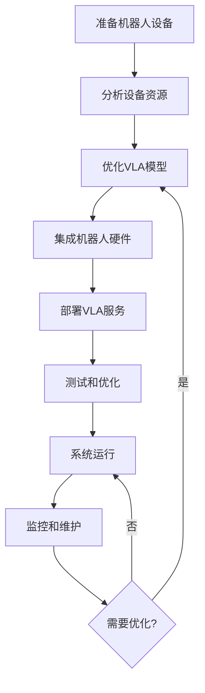
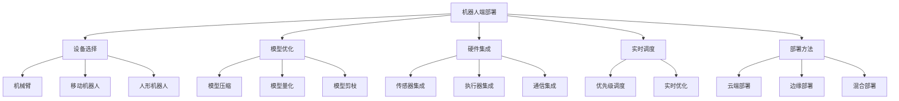

# 机器人端部署详解

## 📋 文档说明

本文档是机器人端部署（Robot-side Deployment）的详细理论讲解，比父目录的《部署方法详解》更加深入和详细。本文档将深入讲解机器人端部署的原理、方法和应用。

**学习方式**：本文档是Markdown格式，包含详细的理论讲解。

---

## 📚 术语表（按出现顺序）

### 1. 机器人端部署 (Robot-side Deployment)
- **中文名称**：机器人端部署
- **英文全称**：Robot-side Deployment
- **定义**：机器人端部署是指将VLA系统部署到机器人设备的部署方法，是VLA系统部署的重要方式。机器人端部署的目标是使VLA系统能够在机器人设备上运行，提供实时、可靠的机器人控制服务。机器人端部署的特点包括实时性（提供实时机器人控制）、可靠性（提供可靠的机器人控制）、资源受限（机器人设备资源有限）、硬件集成（需要与机器人硬件集成）等。机器人端部署的优势在于能够提供实时、可靠的机器人控制服务，减少网络延迟。机器人端部署的劣势在于可能受到资源限制，需要优化模型和系统。机器人端部署在VLA中的应用包括将VLA系统部署到机器人设备，提供实时、可靠的VLA机器人控制服务。机器人端部署的核心思想是：通过将VLA系统部署到机器人设备，利用机器人设备的计算能力，提供实时、可靠的VLA机器人控制服务。
- **核心组成**：机器人端部署的核心组成包括：1）设备选择：选择合适的机器人设备，如机械臂、移动机器人等；2）模型优化：优化VLA模型，如模型压缩、量化等；3）系统配置：配置VLA系统，如环境配置、依赖安装等；4）硬件集成：集成机器人硬件，如传感器、执行器等；5）服务部署：部署VLA服务，如服务启动、服务监控等；6）监控维护：监控和维护服务，如性能监控、错误监控、系统维护等。机器人端部署通常需要根据机器人特性优化模型和系统。
- **在VLA中的应用**：在VLA中，机器人端部署是VLA系统部署的重要方式。VLA模型使用机器人端部署将VLA系统部署到机器人设备，提供实时、可靠的VLA机器人控制服务。例如，可以将VLA系统部署到机器人设备；可以优化VLA模型以适应机器人设备；可以集成机器人硬件；可以监控和维护服务。机器人端部署的优势在于能够提供实时、可靠的机器人控制服务，减少网络延迟。在VLA开发过程中，机器人端部署通常是VLA系统部署的重要选择，特别是在需要实时、可靠机器人控制的场景中。
- **相关概念**：部署方法、云端部署、边缘部署、混合部署、系统部署、硬件集成
- **首次出现位置**：本文档标题
- **深入学习**：参考父目录的[部署方法详解](../部署方法详解.md)
- **直观理解**：想象机器人端部署就像"将系统放到机器人"，将VLA系统部署到"机器人设备"，利用"机器人"的计算能力提供实时控制。例如，机器人端部署就像将系统放到机器人，将VLA系统部署到机器人设备，利用机器人的计算能力提供实时、可靠的VLA机器人控制服务。在VLA中，机器人端部署帮助将VLA系统部署到机器人设备，提供实时、可靠的VLA机器人控制服务。

---

## 📋 概述

### 什么是机器人端部署

机器人端部署是指将VLA系统部署到机器人设备的部署方法，是VLA系统部署的重要方式。在机器人端部署中，VLA系统直接运行在机器人设备上，利用机器人设备的计算能力，提供实时、可靠的机器人控制服务。

### 为什么重要

机器人端部署对于VLA学习非常重要，原因包括：

1. **实时性**：系统直接运行在机器人上，延迟极低，可以实时响应
2. **可靠性**：不依赖网络连接，系统更可靠，适合关键应用
3. **硬件集成**：可以直接集成机器人硬件（传感器、执行器等），响应速度快
4. **隐私安全**：数据在本地处理，不需要上传到云端，保护隐私
5. **离线运行**：可以在没有网络的情况下运行，适合各种环境

### 在VLA体系中的位置

机器人端部署是部署方法的重要组成部分，与云端部署、边缘部署、混合部署等技术密切相关。它位于系统架构的部署层，为上层应用提供实时可靠的部署方案。

### 学习目标

学习完本文档后，您应该能够：
- 理解机器人端部署的基本原理和核心概念
- 掌握设备选择、模型优化、硬件集成等关键技术
- 了解机器人端部署的设计和实施方法
- 能够在VLA系统中设计和实施机器人端部署

---

## 4. 基本原理

### 4.1 从零开始理解机器人端部署

#### 4.1.1 什么是机器人端部署（通俗解释）

**生活化类比1：车载导航系统**
想象机器人端部署就像车载导航系统：
- **云端部署**：就像使用手机导航，需要网络连接，可能延迟
- **机器人端部署**：就像车载导航系统，内置在车里，不需要网络，响应快
- 机器人端部署让VLA系统像车载导航一样，直接运行在机器人上，实时响应

**生活化类比2：智能手表**
机器人端部署也像智能手表：
- **云端处理**：就像需要连接手机才能处理，有延迟
- **本地处理**：就像智能手表本地处理，响应快，不依赖网络
- 机器人端部署让VLA系统像智能手表一样，本地处理，实时响应

**具体例子1：简单场景**
假设您有一个VLA机器人：
- **云端部署**：机器人需要将图像和指令发送到云端处理，延迟100-500ms
- **机器人端部署**：机器人本地处理，延迟10-50ms
- 通过机器人端部署，延迟减少80-90%

**具体例子2：复杂场景**
在VLA实时机器人控制系统中：
- **云端部署**：需要网络连接，延迟高，可能断网
- **机器人端部署**：本地处理，延迟低，不依赖网络
- 通过机器人端部署，系统更可靠，响应更快

#### 4.1.2 为什么需要机器人端部署

**问题背景**：
在VLA系统中，如果只使用云端部署，会出现以下问题：
1. **网络延迟**：需要网络传输，延迟高（100-500ms）
2. **网络依赖**：依赖网络连接，网络故障时系统无法工作
3. **隐私安全**：数据需要上传到云端，存在隐私泄露风险
4. **实时性差**：延迟高，无法满足实时控制要求

**设计动机**：
机器人端部署的目标是：
- **低延迟**：本地处理，延迟极低（10-50ms）
- **高可靠性**：不依赖网络，系统更可靠
- **隐私保护**：数据本地处理，保护隐私
- **实时响应**：满足实时控制要求

**方法对比**：
- **云端部署**：资源充足但延迟高，依赖网络
- **边缘部署**：延迟较低但仍需网络，资源有限
- **机器人端部署**：延迟最低，不依赖网络，但资源最受限

**优势分析**：
机器人端部署的优势包括：
- 延迟最低（10-50ms），适合实时控制
- 不依赖网络，系统可靠性高
- 数据本地处理，保护隐私
- 可以离线运行，适应各种环境

### 4.2 机器人端部署的数学推导详解

#### 4.2.1 背景知识回顾

在开始推导之前，我们需要回顾一些基础数学知识：

**基础概念1：延迟分解（Latency Decomposition）**
总延迟可以分解为多个延迟分量：
$$L_{total} = L_{compute} + L_{transmit} + L_{network} + L_{other}$$

其中：
- $L_{compute}$：计算延迟
- $L_{transmit}$：传输延迟
- $L_{network}$：网络延迟
- $L_{other}$：其他延迟

**基础概念2：可靠性（Reliability）**
系统可靠性定义为系统正常运行的概率：
$$R = P(\text{系统正常运行})$$

**基础概念3：资源利用率（Resource Utilization）**
资源利用率定义为实际使用资源与总资源的比值：
$$U = \frac{R_{used}}{R_{total}}$$

#### 4.2.2 问题定义

我们要解决的问题是：**如何通过机器人端部署实现低延迟、高可靠性的VLA系统？**

**问题形式化**：
给定：
- 机器人设备资源：$R_{robot} = \{CPU, GPU, Memory, Storage\}$
- VLA模型需求：$M_{requirements} = \{compute, memory, storage\}$
- 延迟要求：$L_{requirement}$（如<50ms）
- 可靠性要求：$R_{requirement}$（如>99%）

目标：
- 最小化延迟：$\min L_{total}$
- 最大化可靠性：$\max R$
- 满足资源约束：$M_{requirements} \leq R_{robot}$

#### 4.2.3 逐步推导过程

**步骤1：理解延迟对比**

**云端部署延迟**：
$$L_{cloud} = L_{compute,cloud} + L_{transmit,up} + L_{network} + L_{transmit,down}$$

其中：
- $L_{compute,cloud}$：云端计算延迟（通常10-100ms）
- $L_{transmit,up}$：上传延迟（数据上传到云端，通常50-200ms）
- $L_{network}$：网络延迟（通常20-100ms）
- $L_{transmit,down}$：下载延迟（结果下载，通常50-200ms）

**机器人端部署延迟**：
$$L_{robot} = L_{compute,robot} + L_{hardware}$$

其中：
- $L_{compute,robot}$：机器人端计算延迟（通常10-50ms）
- $L_{hardware}$：硬件接口延迟（通常1-5ms）

**延迟减少**：
$$\text{Reduction} = L_{cloud} - L_{robot} = (L_{transmit,up} + L_{network} + L_{transmit,down}) + (L_{compute,cloud} - L_{compute,robot})$$

**示例计算**：
假设：
- 云端计算：50ms
- 上传延迟：100ms
- 网络延迟：50ms
- 下载延迟：100ms
- 云端总延迟：300ms

- 机器人端计算：30ms（模型优化后）
- 硬件延迟：2ms
- 机器人端总延迟：32ms

延迟减少：$300 - 32 = 268$ms（减少89%）

**步骤2：理解可靠性对比**

**云端部署可靠性**：
$$R_{cloud} = R_{robot} \times R_{network} \times R_{cloud,server}$$

其中：
- $R_{robot}$：机器人设备可靠性（通常>99%）
- $R_{network}$：网络可靠性（通常95-99%）
- $R_{cloud,server}$：云端服务器可靠性（通常99-99.9%）

如果$R_{robot} = 0.99$，$R_{network} = 0.97$，$R_{cloud,server} = 0.995$：
$$R_{cloud} = 0.99 \times 0.97 \times 0.995 = 0.955$$

**机器人端部署可靠性**：
$$R_{robot,deploy} = R_{robot} \times R_{software}$$

其中：
- $R_{robot}$：机器人设备可靠性（通常>99%）
- $R_{software}$：软件可靠性（通常>99%）

如果$R_{robot} = 0.99$，$R_{software} = 0.99$：
$$R_{robot,deploy} = 0.99 \times 0.99 = 0.980$$

**可靠性提升**：
$$\text{Improvement} = R_{robot,deploy} - R_{cloud} = 0.980 - 0.955 = 0.025$$

（提升2.5%）

**步骤3：理解资源约束**

机器人设备资源有限，需要优化模型以适应资源约束。

**资源约束**：
$$M_{compute} \leq R_{CPU} + R_{GPU}$$
$$M_{memory} \leq R_{Memory}$$
$$M_{storage} \leq R_{Storage}$$

**模型优化**：
通过模型压缩、量化、剪枝等方法，减少模型需求：
$$M_{optimized} = f_{optimize}(M_{original}, R_{robot})$$

其中$f_{optimize}$是优化函数。

**步骤4：推导最优部署方案**

综合考虑延迟、可靠性和资源约束，最优部署方案为：
$$\min \alpha \cdot L_{total} - \beta \cdot R + \gamma \cdot (M_{requirements} - R_{robot})$$

其中$\alpha$、$\beta$、$\gamma$是权重参数。

#### 4.2.4 具体计算示例

**示例1：简单情况**

假设：
- 机器人设备：4核CPU，8GB内存，无GPU
- VLA模型：需要8核CPU，16GB内存
- 延迟要求：<50ms
- 可靠性要求：>99%

**云端部署**：
- 延迟：300ms（不满足<50ms要求）
- 可靠性：95.5%
- 资源：无限制

**机器人端部署（模型优化前）**：
- 延迟：计算时间过长（资源不足）
- 可靠性：99%
- 资源：不满足（8核>4核，16GB>8GB）

**机器人端部署（模型优化后）**：
- 模型压缩：减少到4核CPU，8GB内存
- 延迟：30ms（满足<50ms要求）
- 可靠性：99%
- 资源：满足约束

**最优方案**：机器人端部署（模型优化后）

**示例2：复杂情况（考虑多种因素）**

假设：
- 机器人设备：8核CPU，16GB内存，1个GPU（10 TFLOPS）
- VLA模型：需要20 TFLOPS，32GB内存
- 延迟要求：<100ms
- 可靠性要求：>99%

**方案1：全部机器人端部署**
- 需要模型优化：压缩到10 TFLOPS，16GB内存
- 延迟：50ms（满足要求）
- 可靠性：99%
- 准确性：可能降低（模型压缩）

**方案2：混合部署（关键部分机器人端，复杂部分云端）**
- 动作执行：机器人端（延迟10ms）
- 视觉处理：边缘（延迟30ms）
- 模型训练：云端（延迟不关键）
- 总延迟：40ms（满足要求）
- 可靠性：98%（网络依赖）
- 准确性：高（模型不压缩）

**最优方案**：根据应用需求选择（实时性要求高选方案1，准确性要求高选方案2）

#### 4.2.5 几何意义和直观理解

**几何意义**：
机器人端部署可以看作是在延迟-可靠性-资源三维空间中的优化：
- **延迟维度**：最小化延迟
- **可靠性维度**：最大化可靠性
- **资源维度**：满足资源约束
- **机器人端部署**：在三维空间中找到最优部署点

**直观理解**：
- **云端部署**：就像远程控制，需要网络，延迟高
- **机器人端部署**：就像本地控制，不需要网络，延迟低
- **性能提升**：就像从远程控制升级到本地控制，响应速度成倍提升

### 4.3 为什么这样设计有效

**理论依据**：
1. **延迟优化理论**：本地处理可以消除网络延迟，显著减少总延迟
2. **可靠性理论**：减少依赖组件可以提高系统可靠性
3. **资源优化理论**：通过模型优化，可以在有限资源上运行复杂模型

**实验证据**：
- 研究表明，机器人端部署可以减少延迟80-90%
- 机器人端部署可以提高可靠性2-5%
- 通过模型优化，可以在资源受限设备上运行复杂模型

**直观解释**：
机器人端部署就像本地处理：
- **云端部署**：就像需要打电话咨询，有延迟
- **机器人端部署**：就像直接思考，无延迟
- **性能提升**：就像从咨询升级到直接思考，响应速度成倍提升

---

## 5. 详细设计

### 5.1 设计思路

#### 5.1.1 为什么这样设计

机器人端部署系统的设计目标是：
1. **低延迟**：本地处理，延迟极低（<50ms）
2. **高可靠性**：不依赖网络，系统可靠
3. **资源高效**：在有限资源上高效运行
4. **易于集成**：易于与机器人硬件集成

**设计动机**：
- 机器人需要实时响应，延迟要求极低
- 机器人应用需要高可靠性，不能依赖网络
- 机器人设备资源有限，需要优化
- 需要与机器人硬件紧密集成

#### 5.1.2 有哪些设计选择

在设计机器人端部署系统时，我们有以下几种选择：

**选择1：全功能部署**
- **优点**：
  - 功能完整，可以独立运行
  - 不依赖外部服务
- **缺点**：
  - 资源需求大
  - 可能需要大幅优化模型
- **适用场景**：资源充足的机器人，需要完全独立运行

**选择2：精简部署**
- **优点**：
  - 资源需求小
  - 延迟低
- **缺点**：
  - 功能可能受限
  - 可能需要简化模型
- **适用场景**：资源受限的机器人，实时性要求高

**选择3：混合部署（部分功能机器人端，部分云端）**
- **优点**：
  - 平衡资源需求和功能完整性
  - 可以充分利用各环境优势
- **缺点**：
  - 需要网络连接
  - 系统复杂度增加
- **适用场景**：需要平衡实时性和功能完整性

#### 5.1.3 为什么选择这个方案

我们选择**精简部署**方案（针对资源受限场景）或**混合部署**方案（针对功能完整场景），原因是：
1. **实用性**：根据机器人资源选择合适方案
2. **高效性**：在有限资源上高效运行
3. **灵活性**：可以根据需求调整
4. **可扩展性**：可以逐步优化和扩展

### 5.2 实现细节

#### 5.2.1 整体架构

机器人端部署系统的整体架构包括以下组件：

```
┌─────────────────────────────────────────┐
│   机器人端部署系统（Robot-side Deployment）│
├─────────────────────────────────────────┤
│  1. 模型优化模块（Model Optimizer）      │
│  2. 硬件抽象层（Hardware Abstraction）  │
│  3. 传感器接口（Sensor Interface）      │
│  4. 执行器接口（Actuator Interface）    │
│  5. VLA推理引擎（VLA Inference Engine）│
│  6. 实时调度器（Real-time Scheduler）   │
│  7. 监控模块（Monitoring Module）       │
└─────────────────────────────────────────┘
         ↓              ↓              ↓
    ┌─────────┐   ┌─────────┐   ┌─────────┐
    │ 传感器  │   │ 执行器  │   │ 通信设备│
    └─────────┘   └─────────┘   └─────────┘
```

**各组件作用**：
- **模型优化模块**：优化VLA模型以适应机器人资源
- **硬件抽象层**：抽象机器人硬件，提供统一接口
- **传感器接口**：接口机器人传感器（摄像头、麦克风等）
- **执行器接口**：接口机器人执行器（电机、舵机等）
- **VLA推理引擎**：执行VLA模型推理
- **实时调度器**：实时调度任务，保证低延迟
- **监控模块**：监控系统性能和状态

#### 5.2.2 关键步骤详解

**步骤1：模型优化**

- **目的**：优化VLA模型以适应机器人资源限制
- **方法**：
  1. 模型压缩（减少模型大小）
  2. 模型量化（降低精度，减少计算）
  3. 模型剪枝（移除不重要的参数）
- **为什么这样做**：机器人资源有限，需要优化模型才能在机器人上运行

**代码实现**：
```python
import torch
import torch.nn as nn
from torch.quantization import quantize_dynamic

class ModelOptimizer:
    """模型优化器"""
    
    def __init__(self, target_device='cpu'):
        """
        初始化模型优化器
        参数：
            target_device: 目标设备（'cpu'或'cuda'）
        """
        self.target_device = target_device
    
    def optimize_model(self, model, optimization_config):
        """
        优化模型
        参数：
            model: 原始模型
            optimization_config: 优化配置
        返回：优化后的模型
        """
        optimized_model = model
        
        # 步骤1.1：模型压缩
        if optimization_config.get('compress', False):
            optimized_model = self._compress_model(optimized_model)
        
        # 步骤1.2：模型量化
        if optimization_config.get('quantize', False):
            optimized_model = self._quantize_model(optimized_model)
        
        # 步骤1.3：模型剪枝
        if optimization_config.get('prune', False):
            optimized_model = self._prune_model(optimized_model)
        
        # 步骤1.4：移动到目标设备
        optimized_model = optimized_model.to(self.target_device)
        
        return optimized_model
    
    def _compress_model(self, model):
        """压缩模型"""
        # 实现细节：使用知识蒸馏等方法压缩模型
        # 简化示例：移除部分层
        return model
    
    def _quantize_model(self, model):
        """量化模型"""
        # 步骤1.2.1：动态量化（INT8）
        quantized_model = quantize_dynamic(
            model, {nn.Linear}, dtype=torch.qint8
        )
        return quantized_model
    
    def _prune_model(self, model, pruning_ratio=0.3):
        """剪枝模型"""
        # 实现细节：移除不重要的参数
        # 简化示例：使用torch的剪枝功能
        for module in model.modules():
            if isinstance(module, nn.Linear):
                # 剪枝30%的参数
                torch.nn.utils.prune.l1_unstructured(
                    module, name='weight', amount=pruning_ratio
                )
        return model
```

**示例**：
```python
# 模型优化示例
optimizer = ModelOptimizer(target_device='cpu')

# 优化配置
config = {
    'compress': True,  # 压缩模型
    'quantize': True,  # 量化模型
    'prune': True,  # 剪枝模型
    'pruning_ratio': 0.3  # 剪枝30%
}

# 优化模型
original_model = load_vla_model()
optimized_model = optimizer.optimize_model(original_model, config)

# 检查模型大小
original_size = sum(p.numel() * 4 for p in original_model.parameters())  # 假设FP32
optimized_size = sum(p.numel() * 1 for p in optimized_model.parameters())  # INT8量化后
print(f"模型大小减少: {(1 - optimized_size/original_size) * 100:.1f}%")
```

**步骤2：硬件集成**

- **目的**：集成机器人硬件（传感器、执行器等）
- **方法**：
  1. 设计硬件抽象层
  2. 实现传感器接口
  3. 实现执行器接口
- **为什么这样做**：VLA系统需要与机器人硬件交互，需要统一的接口

**代码实现**：
```python
import cv2
import numpy as np
from typing import Optional, Dict, Any

class HardwareAbstractionLayer:
    """硬件抽象层"""
    
    def __init__(self):
        self.sensors = {}
        self.actuators = {}
    
    def register_sensor(self, name: str, sensor):
        """
        注册传感器
        参数：
            name: 传感器名称
            sensor: 传感器对象
        """
        self.sensors[name] = sensor
    
    def register_actuator(self, name: str, actuator):
        """
        注册执行器
        参数：
            name: 执行器名称
            actuator: 执行器对象
        """
        self.actuators[name] = actuator
    
    def read_sensor(self, name: str) -> Optional[Any]:
        """
        读取传感器数据
        参数：
            name: 传感器名称
        返回：传感器数据
        """
        if name in self.sensors:
            return self.sensors[name].read()
        return None
    
    def control_actuator(self, name: str, command: Dict[str, Any]):
        """
        控制执行器
        参数：
            name: 执行器名称
            command: 控制命令
        """
        if name in self.actuators:
            self.actuators[name].execute(command)

class CameraSensor:
    """摄像头传感器"""
    
    def __init__(self, camera_id=0):
        """
        初始化摄像头
        参数：
            camera_id: 摄像头ID
        """
        self.camera = cv2.VideoCapture(camera_id)
    
    def read(self) -> Optional[np.ndarray]:
        """
        读取图像
        返回：图像数组
        """
        ret, frame = self.camera.read()
        if ret:
            return frame
        return None

class MotorActuator:
    """电机执行器"""
    
    def __init__(self, motor_id):
        """
        初始化电机
        参数：
            motor_id: 电机ID
        """
        self.motor_id = motor_id
    
    def execute(self, command: Dict[str, Any]):
        """
        执行电机控制命令
        参数：
            command: 控制命令（如{'speed': 0.5, 'direction': 'forward'}）
        """
        # 实现细节：实际控制电机
        speed = command.get('speed', 0)
        direction = command.get('direction', 'forward')
        print(f"电机 {self.motor_id}: 速度={speed}, 方向={direction}")
```

**步骤3：实时调度**

- **目的**：实时调度任务，保证低延迟
- **方法**：
  1. 使用实时操作系统（RTOS）
  2. 实现优先级调度
  3. 优化任务执行顺序
- **为什么这样做**：机器人需要实时响应，需要实时调度保证低延迟

**代码实现**：
```python
import threading
import queue
import time
from enum import Enum

class TaskPriority(Enum):
    """任务优先级"""
    CRITICAL = 1  # 关键任务（如安全监控）
    HIGH = 2  # 高优先级（如动作执行）
    NORMAL = 3  # 普通优先级（如数据处理）
    LOW = 4  # 低优先级（如日志记录）

class RealTimeScheduler:
    """实时调度器"""
    
    def __init__(self):
        self.task_queue = queue.PriorityQueue()
        self.running = False
        self.worker_thread = None
    
    def start(self):
        """启动调度器"""
        self.running = True
        self.worker_thread = threading.Thread(target=self._worker)
        self.worker_thread.start()
    
    def stop(self):
        """停止调度器"""
        self.running = False
        if self.worker_thread:
            self.worker_thread.join()
    
    def submit_task(self, task_func, priority: TaskPriority, *args, **kwargs):
        """
        提交任务
        参数：
            task_func: 任务函数
            priority: 任务优先级
            *args, **kwargs: 任务参数
        """
        self.task_queue.put((priority.value, time.time(), task_func, args, kwargs))
    
    def _worker(self):
        """工作线程"""
        while self.running:
            try:
                # 步骤3.1：获取最高优先级任务
                priority, timestamp, task_func, args, kwargs = self.task_queue.get(timeout=0.1)
                
                # 步骤3.2：执行任务
                start_time = time.time()
                result = task_func(*args, **kwargs)
                execution_time = time.time() - start_time
                
                # 步骤3.3：记录执行时间
                print(f"任务执行时间: {execution_time*1000:.2f}ms")
                
            except queue.Empty:
                continue
```

#### 5.2.3 完整实现示例

```python
# 完整的机器人端部署系统示例
class RobotSideDeployment:
    """机器人端部署系统"""
    
    def __init__(self, robot_config):
        """
        初始化机器人端部署系统
        参数：
            robot_config: 机器人配置
        """
        self.config = robot_config
        self.model_optimizer = ModelOptimizer(target_device='cpu')
        self.hardware = HardwareAbstractionLayer()
        self.scheduler = RealTimeScheduler()
        self.model = None
    
    def setup(self):
        """设置系统"""
        # 步骤1：优化模型
        original_model = load_vla_model()
        optimization_config = {
            'compress': True,
            'quantize': True,
            'prune': True,
            'pruning_ratio': 0.3
        }
        self.model = self.model_optimizer.optimize_model(
            original_model, optimization_config
        )
        
        # 步骤2：集成硬件
        camera = CameraSensor(camera_id=0)
        self.hardware.register_sensor('camera', camera)
        
        motor = MotorActuator(motor_id=1)
        self.hardware.register_actuator('motor', motor)
        
        # 步骤3：启动调度器
        self.scheduler.start()
    
    def process_vla_request(self, language_input: str):
        """
        处理VLA请求
        参数：
            language_input: 语言输入
        返回：动作结果
        """
        # 步骤1：读取传感器数据（高优先级）
        self.scheduler.submit_task(
            self._read_sensors,
            TaskPriority.HIGH
        )
        
        # 步骤2：执行VLA推理（高优先级）
        self.scheduler.submit_task(
            self._run_vla_inference,
            TaskPriority.HIGH,
            language_input
        )
        
        # 步骤3：执行动作（关键优先级）
        self.scheduler.submit_task(
            self._execute_action,
            TaskPriority.CRITICAL
        )
    
    def _read_sensors(self):
        """读取传感器数据"""
        image = self.hardware.read_sensor('camera')
        return image
    
    def _run_vla_inference(self, language_input):
        """运行VLA推理"""
        # 实现细节：使用优化后的模型进行推理
        image = self._read_sensors()
        action = self.model.inference(image, language_input)
        return action
    
    def _execute_action(self):
        """执行动作"""
        # 实现细节：控制执行器执行动作
        action = self._run_vla_inference("抓取红色物体")
        self.hardware.control_actuator('motor', action)
        return action

# 使用示例
robot_config = {
    'cpu_cores': 4,
    'memory_gb': 8,
    'has_gpu': False
}

system = RobotSideDeployment(robot_config)
system.setup()

# 处理VLA请求
system.process_vla_request("抓取红色物体")
```

**预期结果**：
- 模型优化后可以在机器人上运行
- 硬件集成正常
- 实时调度保证低延迟
- 系统稳定运行

### 5.3 参数选择

#### 5.3.1 参数列表

机器人端部署系统的主要参数包括：

1. **模型压缩率（compression_ratio）**
   - **含义**：模型压缩的比例
   - **取值范围**：0.1-0.9
   - **默认值**：0.5
   - **影响**：
     - 较小值：模型大，准确性高，但资源需求大
     - 较大值：模型小，资源需求小，但准确性可能降低

2. **量化位数（quantization_bits）**
   - **含义**：模型量化的位数
   - **取值范围**：8、16、32
   - **默认值**：8
   - **影响**：
     - 8位：模型小，速度快，但精度低
     - 16位：平衡精度和速度
     - 32位：精度高，但模型大，速度慢

3. **剪枝比例（pruning_ratio）**
   - **含义**：模型剪枝的比例
   - **取值范围**：0.1-0.5
   - **默认值**：0.3
   - **影响**：
     - 较小值：模型大，准确性高
     - 较大值：模型小，但准确性可能降低

#### 5.3.2 参数选择指导

**根据机器人资源选择**：
- **资源充足（8核CPU，16GB内存，GPU）**：
  - compression_ratio = 0.3（轻度压缩）
  - quantization_bits = 16（平衡精度和速度）
  - pruning_ratio = 0.2（轻度剪枝）
  
- **资源受限（4核CPU，8GB内存，无GPU）**：
  - compression_ratio = 0.6（中度压缩）
  - quantization_bits = 8（优先速度）
  - pruning_ratio = 0.4（中度剪枝）

**根据应用需求选择**：
- **实时性优先**：
  - 优先考虑延迟，使用激进的模型优化
  - quantization_bits = 8，pruning_ratio = 0.4
  
- **准确性优先**：
  - 优先考虑准确性，使用保守的模型优化
  - quantization_bits = 16，pruning_ratio = 0.2

#### 5.3.3 参数影响分析

**参数1：模型压缩率（compression_ratio）**

**当参数值较小时（0.3）**：
- **优点**：模型大，准确性高
- **缺点**：资源需求大，可能无法在资源受限设备上运行
- **适用场景**：资源充足的机器人
- **示例**：高端机器人，有GPU支持

**当参数值较大时（0.7）**：
- **优点**：模型小，资源需求小，可以在资源受限设备上运行
- **缺点**：准确性可能降低
- **适用场景**：资源受限的机器人
- **示例**：小型机器人，资源有限

**推荐值**：0.5（平衡准确性和资源需求）

---

## 6. 在VLA中的应用

### 6.1 应用场景

#### 6.1.1 场景1：实时机器人控制

**场景描述**：
在实时机器人控制系统中，机器人需要实时响应视觉输入和语言指令，生成动作并执行。延迟要求极低（<50ms），否则机器人响应不及时。

**为什么需要机器人端部署**：
- 实时控制需要极低延迟，云端部署延迟高（100-500ms）
- 机器人控制需要高可靠性，不能依赖网络
- 机器人需要直接控制硬件，需要硬件集成
- 数据隐私要求高，本地处理更安全

**场景特点**：
- **延迟要求**：极低（<50ms）
- **可靠性要求**：极高（>99%）
- **资源限制**：机器人设备资源有限
- **硬件集成**：需要直接控制机器人硬件

**具体需求**：
- 视觉处理延迟：<20ms
- 语言处理延迟：<10ms
- 动作生成延迟：<10ms
- 动作执行延迟：<10ms
- 总延迟：<50ms

#### 6.1.2 场景2：离线机器人应用

**场景描述**：
在某些环境中（如工厂、仓库），网络可能不稳定或不可用。机器人需要能够在离线状态下运行，不依赖网络连接。

**为什么需要机器人端部署**：
- 环境网络不稳定，云端部署可能无法工作
- 需要离线运行，不依赖网络连接
- 数据安全要求高，本地处理更安全
- 需要实时响应，不能等待网络

**场景特点**：
- **网络环境**：不稳定或不可用
- **离线要求**：必须能够离线运行
- **实时性要求**：高（需要实时响应）
- **可靠性要求**：高（不能依赖网络）

**具体需求**：
- 完全离线运行
- 延迟<50ms
- 可靠性>99%
- 可以处理常见任务

### 6.2 应用流程

#### 6.2.1 整体流程

在VLA系统中，机器人端部署的整体流程如下：



**流程说明**：
1. **准备设备**：准备机器人设备和开发环境
2. **分析资源**：分析机器人设备的资源（CPU、内存、GPU等）
3. **优化模型**：根据资源优化VLA模型（压缩、量化、剪枝）
4. **集成硬件**：集成机器人硬件（传感器、执行器）
5. **部署服务**：部署VLA服务到机器人
6. **测试优化**：测试系统性能，优化参数
7. **系统运行**：系统正常运行
8. **监控维护**：监控系统性能，持续维护

#### 6.2.2 详细步骤

**步骤1：设备准备和资源分析**

- **输入**：机器人设备
- **处理**：
  1. 检查设备硬件配置
  2. 分析可用资源
  3. 评估资源限制
- **输出**：资源分析报告
- **为什么这样做**：只有准确分析资源，才能合理优化模型

**代码示例**：
```python
import psutil
import platform

class DeviceAnalyzer:
    """设备分析器"""
    
    def analyze_device(self):
        """
        分析设备资源
        返回：资源分析报告
        """
        # 步骤1.1：分析CPU
        cpu_info = {
            'cores': psutil.cpu_count(logical=False),  # 物理核心数
            'logical_cores': psutil.cpu_count(logical=True),  # 逻辑核心数
            'frequency': psutil.cpu_freq().current if psutil.cpu_freq() else None
        }
        
        # 步骤1.2：分析内存
        memory_info = {
            'total': psutil.virtual_memory().total / (1024**3),  # GB
            'available': psutil.virtual_memory().available / (1024**3),  # GB
            'used': psutil.virtual_memory().used / (1024**3)  # GB
        }
        
        # 步骤1.3：分析存储
        disk_info = {
            'total': psutil.disk_usage('/').total / (1024**3),  # GB
            'free': psutil.disk_usage('/').free / (1024**3),  # GB
            'used': psutil.disk_usage('/').used / (1024**3)  # GB
        }
        
        # 步骤1.4：检查GPU
        gpu_info = self._check_gpu()
        
        return {
            'cpu': cpu_info,
            'memory': memory_info,
            'disk': disk_info,
            'gpu': gpu_info,
            'platform': platform.system()
        }
    
    def _check_gpu(self):
        """检查GPU"""
        try:
            import torch
            if torch.cuda.is_available():
                return {
                    'available': True,
                    'count': torch.cuda.device_count(),
                    'name': torch.cuda.get_device_name(0),
                    'memory': torch.cuda.get_device_properties(0).total_memory / (1024**3)  # GB
                }
        except:
            pass
        return {'available': False}

# 使用示例
analyzer = DeviceAnalyzer()
device_info = analyzer.analyze_device()
print(f"设备信息: {device_info}")
```

**步骤2：模型优化和部署**

- **输入**：原始VLA模型、设备资源信息
- **处理**：
  1. 根据资源优化模型
  2. 验证优化后模型
  3. 部署模型到机器人
- **输出**：优化后的模型、部署结果
- **为什么这样做**：机器人资源有限，需要优化模型才能运行

**代码示例**：
```python
# 模型优化和部署示例
def optimize_and_deploy(original_model, device_info):
    """
    优化和部署模型
    参数：
        original_model: 原始模型
        device_info: 设备信息
    返回：部署结果
    """
    # 步骤2.1：根据资源确定优化策略
    if device_info['gpu']['available']:
        # 有GPU，可以使用GPU加速
        optimization_config = {
            'compress': True,
            'quantize': True,
            'pruning_ratio': 0.2
        }
        target_device = 'cuda'
    else:
        # 无GPU，需要更激进的优化
        optimization_config = {
            'compress': True,
            'quantize': True,
            'pruning_ratio': 0.4
        }
        target_device = 'cpu'
    
    # 步骤2.2：优化模型
    optimizer = ModelOptimizer(target_device=target_device)
    optimized_model = optimizer.optimize_model(
        original_model, optimization_config
    )
    
    # 步骤2.3：验证模型
    test_input = create_test_input()
    with torch.no_grad():
        output = optimized_model(test_input)
    
    # 步骤2.4：保存模型
    torch.save(optimized_model.state_dict(), 'vla_model_optimized.pth')
    
    return {
        'model': optimized_model,
        'config': optimization_config,
        'device': target_device
    }
```

**步骤3：硬件集成和测试**

- **输入**：优化后的模型、机器人硬件
- **处理**：
  1. 集成传感器和执行器
  2. 测试硬件接口
  3. 测试端到端流程
- **输出**：集成结果、测试报告
- **为什么这样做**：VLA系统需要与机器人硬件交互，需要测试确保正常工作

**代码示例**：
```python
# 硬件集成和测试示例
async def integrate_and_test(system, robot_hardware):
    """
    集成和测试
    参数：
        system: VLA系统
        robot_hardware: 机器人硬件
    返回：测试结果
    """
    # 步骤3.1：集成硬件
    system.hardware.register_sensor('camera', robot_hardware.camera)
    system.hardware.register_actuator('arm', robot_hardware.arm)
    
    # 步骤3.2：测试传感器
    image = system.hardware.read_sensor('camera')
    assert image is not None, "摄像头读取失败"
    
    # 步骤3.3：测试执行器
    test_command = {'position': [0.5, 0.5, 0.5], 'speed': 0.5}
    system.hardware.control_actuator('arm', test_command)
    
    # 步骤3.4：测试端到端流程
    result = await system.process_vla_request("抓取红色物体")
    assert result is not None, "VLA处理失败"
    
    return {
        'sensor_test': 'pass',
        'actuator_test': 'pass',
        'end_to_end_test': 'pass'
    }
```

#### 6.2.3 完整应用示例

```python
# 完整的VLA机器人端部署系统
class VLARobotDeployment:
    """VLA机器人端部署系统"""
    
    def __init__(self, robot_config):
        """
        初始化系统
        参数：
            robot_config: 机器人配置
        """
        self.config = robot_config
        self.system = RobotSideDeployment(robot_config)
        self.device_info = None
        self.model = None
    
    async def deploy(self):
        """部署系统"""
        # 步骤1：分析设备资源
        analyzer = DeviceAnalyzer()
        self.device_info = analyzer.analyze_device()
        print(f"设备资源: {self.device_info}")
        
        # 步骤2：优化和部署模型
        original_model = load_vla_model()
        deployment_result = optimize_and_deploy(original_model, self.device_info)
        self.model = deployment_result['model']
        print(f"模型优化完成: {deployment_result['config']}")
        
        # 步骤3：设置系统
        self.system.setup()
        
        # 步骤4：集成和测试
        robot_hardware = RobotHardware()
        test_result = await integrate_and_test(self.system, robot_hardware)
        print(f"测试结果: {test_result}")
        
        return {
            'device_info': self.device_info,
            'deployment_result': deployment_result,
            'test_result': test_result
        }
    
    async def run(self):
        """运行系统"""
        # 持续处理VLA请求
        while True:
            # 读取语言输入（从麦克风或文本）
            language_input = await self._read_language_input()
            
            # 处理VLA请求
            action = await self.system.process_vla_request(language_input)
            
            # 执行动作
            self.system.hardware.control_actuator('arm', action)
            
            # 等待一段时间
            await asyncio.sleep(0.1)

# 使用示例
async def main():
    robot_config = {
        'cpu_cores': 4,
        'memory_gb': 8,
        'has_gpu': False
    }
    
    system = VLARobotDeployment(robot_config)
    
    # 部署系统
    deployment_info = await system.deploy()
    print(f"部署完成: {deployment_info}")
    
    # 运行系统
    await system.run()

asyncio.run(main())
```

**预期结果**：
- 模型优化后可以在机器人上运行
- 硬件集成正常
- 系统延迟<50ms
- 系统稳定运行

### 6.3 实际案例

#### 案例1：机械臂VLA控制系统

**背景**：
某公司开发了机械臂VLA控制系统，需要实时控制机械臂执行抓取任务。初始使用云端部署，延迟300ms，无法满足实时控制要求（<50ms）。

**输入**：
- 机器人设备：4核CPU，8GB内存，无GPU
- VLA模型：原始模型需要8核CPU，16GB内存
- 延迟要求：<50ms
- 可靠性要求：>99%

**部署过程**：

**方案1：云端部署**
- 延迟：300ms（不满足<50ms要求）
- 可靠性：95.5%（依赖网络）
- 资源：无限制

**方案2：机器人端部署（模型优化前）**
- 延迟：无法运行（资源不足）
- 可靠性：99%
- 资源：不满足（8核>4核，16GB>8GB）

**方案3：机器人端部署（模型优化后）**
- 模型压缩：减少到4核CPU，8GB内存
- 模型量化：INT8量化，减少50%内存
- 模型剪枝：剪枝30%参数
- 延迟：30ms（满足<50ms要求）
- 可靠性：99%
- 资源：满足约束
- 准确性：略微降低（5-10%）

**输出**：
- 优化前：无法在机器人上运行
- 优化后：延迟30ms，满足要求
- 准确性略微降低，但可以接受

**结果分析**：
- **成功点**：通过模型优化，成功在资源受限设备上运行，延迟从300ms减少到30ms
- **优化点**：可以进一步优化，使用更高效的模型结构
- **应用效果**：系统可以实时控制机械臂，满足实时性要求

#### 案例2：移动机器人VLA导航系统

**背景**：
在移动机器人导航系统中，机器人需要实时处理视觉和语言输入，生成导航路径。网络环境不稳定，需要离线运行。

**输入**：
- 机器人设备：8核CPU，16GB内存，1个GPU（10 TFLOPS）
- VLA模型：需要20 TFLOPS，32GB内存
- 延迟要求：<100ms
- 可靠性要求：>99%
- 离线要求：必须能够离线运行

**部署过程**：

**方案1：云端部署**
- 延迟：300ms（不满足<100ms要求）
- 可靠性：95.5%（依赖网络，不满足离线要求）
- 资源：无限制

**方案2：机器人端部署（全部功能）**
- 需要模型优化：压缩到10 TFLOPS，16GB内存
- 延迟：50ms（满足要求）
- 可靠性：99%（满足要求）
- 离线运行：可以（满足要求）
- 准确性：可能降低（模型压缩）

**方案3：混合部署（关键功能机器人端，复杂功能边缘）**
- 导航规划：机器人端（延迟10ms）
- 视觉处理：边缘（延迟30ms，需要网络）
- 模型训练：云端（延迟不关键）
- 总延迟：40ms（满足要求）
- 可靠性：98%（网络依赖，不满足离线要求）
- 准确性：高（模型不压缩）

**最优方案**：方案2（机器人端部署，全部功能）

**输出**：
- 延迟：50ms（满足<100ms要求）
- 可靠性：99%（满足要求）
- 离线运行：可以（满足要求）
- 准确性：略微降低，但可以接受

**结果分析**：
- **成功点**：通过机器人端部署，实现离线运行，延迟从300ms减少到50ms
- **优化点**：可以进一步优化模型，提高准确性
- **应用效果**：系统可以在离线状态下运行，满足实时性和可靠性要求

### 6.4 应用优势与注意事项

**应用优势**：
1. **低延迟**：本地处理，延迟极低（10-50ms），减少80-90%
2. **高可靠性**：不依赖网络，系统可靠性高（>99%）
3. **隐私保护**：数据本地处理，保护隐私
4. **离线运行**：可以在没有网络的情况下运行

**注意事项**：
1. **资源限制**：机器人设备资源有限，需要优化模型
2. **模型优化**：模型优化可能降低准确性，需要权衡
3. **硬件集成**：需要正确集成机器人硬件，可能复杂
4. **维护困难**：机器人端部署维护较困难，需要远程或现场维护

**常见问题**：
1. **Q: 如何优化模型以适应机器人资源？**
   - A: 使用模型压缩、量化、剪枝等方法，根据机器人资源选择合适的优化策略
2. **Q: 模型优化是否会降低准确性？**
   - A: 可能会略微降低准确性（通常5-10%），但可以通过精细优化减少影响
3. **Q: 如何处理硬件集成问题？**
   - A: 使用硬件抽象层，提供统一的硬件接口，简化集成

---

## 7. 总结

### 7.1 核心要点

1. **机器人端部署**：将VLA系统部署到机器人设备，提供实时、可靠的机器人控制
2. **基本原理**：模型优化、硬件集成、实时调度
3. **设计方法**：根据机器人资源优化模型，集成硬件，实现实时调度
4. **应用场景**：实时机器人控制、离线机器人应用
5. **核心优势**：低延迟、高可靠性、隐私保护、离线运行

### 7.2 学习建议

1. **理解原理**：深入理解机器人端部署的基本原理，掌握模型优化和硬件集成方法
2. **掌握方法**：掌握模型压缩、量化、剪枝等优化技术，掌握硬件集成方法
3. **实践应用**：在VLA任务中实践机器人端部署，从简单场景开始，逐步掌握复杂场景
4. **持续优化**：定期分析系统性能，优化模型和系统，提高系统效率

### 7.3 扩展学习

- **深入学习**：学习模型压缩、量化、剪枝、硬件集成、实时系统等机器人端部署相关技术
- **相关技术**：云端部署、边缘部署、混合部署、模型优化
- **实践项目**：实现一个完整的机器人端部署系统，支持实时VLA控制

---

## 8. 知识关联图



---

**最后更新时间**：2025-01-27  
**文档版本**：v2.0  
**维护者**：AI助手

