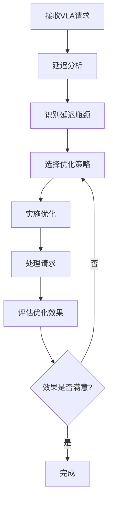
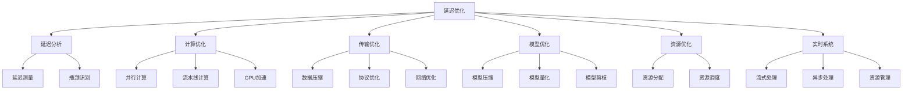

# 延迟优化详解

## 📋 文档说明

本文档是延迟优化（Latency Optimization）的详细理论讲解，比父目录的《实时系统详解》更加深入和详细。本文档将深入讲解延迟优化的原理、方法和应用。

**学习方式**：本文档是Markdown格式，包含详细的理论讲解。

---

## 📚 术语表（按出现顺序）

### 1. 延迟优化 (Latency Optimization)
- **中文名称**：延迟优化
- **英文全称**：Latency Optimization
- **定义**：延迟优化是指优化VLA系统延迟的方法，是实时系统的重要优化内容。延迟优化的目标是减少VLA系统的处理延迟，提高系统的实时性。延迟优化的方法包括计算优化（优化计算过程）、数据传输优化（优化数据传输过程）、模型优化（优化模型结构）、系统优化（优化系统架构）等。延迟优化的优势在于能够减少系统延迟，提高系统的实时性，改善用户体验。延迟优化的劣势在于可能需要在性能和准确性之间进行权衡。延迟优化在VLA中的应用包括优化VLA系统的延迟，提高系统的实时性。延迟优化的核心思想是：通过优化计算、数据传输、模型和系统，减少VLA系统的处理延迟，提高系统的实时性。
- **核心组成**：延迟优化的核心组成包括：1）延迟分析：分析系统延迟，如计算延迟、传输延迟、等待延迟等；2）优化策略：设计优化策略，如计算优化、传输优化、模型优化等；3）优化实施：实施优化策略；4）效果评估：评估优化效果，如延迟减少、性能提升等；5）持续优化：持续优化系统延迟；6）监控维护：监控和维护优化效果。延迟优化通常需要根据应用需求选择合适的优化策略。
- **在VLA中的应用**：在VLA中，延迟优化是实时系统的重要优化内容。VLA模型使用延迟优化优化VLA系统的延迟，提高系统的实时性。例如，可以优化计算过程；可以优化数据传输过程；可以优化模型结构；可以优化系统架构。延迟优化的优势在于能够减少系统延迟，提高系统的实时性，改善用户体验。在VLA开发过程中，延迟优化通常是实时系统的重要优化内容，为VLA系统的实时应用提供基础。
- **相关概念**：实时系统、流式处理、异步处理、资源管理、系统优化、性能优化
- **首次出现位置**：本文档标题
- **深入学习**：参考父目录的[实时系统详解](../实时系统详解.md)
- **直观理解**：想象延迟优化就像"加快速度"，优化VLA系统的"延迟"，使系统"更快"地响应。例如，延迟优化就像加快速度，优化VLA系统的延迟，使系统更快地响应，提高系统的实时性。在VLA中，延迟优化帮助优化VLA系统的延迟，提高系统的实时性。

---

## 📋 概述

### 什么是延迟优化

延迟优化是指优化VLA系统延迟的方法，是实时系统的重要优化内容。延迟是指从输入到输出所需的时间，延迟优化通过优化计算、数据传输、模型和系统架构，减少VLA系统的处理延迟，提高系统的实时性。

### 为什么重要

延迟优化对于VLA学习非常重要，原因包括：

1. **实时性**：VLA系统需要实时响应，低延迟是实时性的关键指标
2. **用户体验**：低延迟可以显著改善用户体验，特别是在交互式应用中
3. **系统性能**：延迟优化可以提升系统整体性能，提高吞吐量
4. **成本控制**：低延迟可以减少资源占用，降低系统成本
5. **竞争优势**：低延迟是VLA系统的重要竞争优势

### 在VLA体系中的位置

延迟优化是实时系统的重要组成部分，与流式处理、异步处理、资源管理等技术密切相关。它位于系统架构的优化层，为上层应用提供低延迟保障。

### 学习目标

学习完本文档后，您应该能够：
- 理解延迟优化的基本原理和核心概念
- 掌握延迟分析和优化的方法
- 了解计算优化、传输优化、模型优化等技术
- 能够在VLA系统中设计和实施延迟优化

---

## 4. 基本原理

### 4.1 从零开始理解延迟优化

#### 4.1.1 什么是延迟优化（通俗解释）

**生活化类比1：快递配送**
想象延迟优化就像优化快递配送时间：
- **延迟**：从下单到收货的时间
- **优化前**：快递需要3天（计算慢、路线绕、等待时间长）
- **优化后**：快递只需要1天（计算快、路线优化、减少等待）
- 通过优化各个环节，可以显著减少总时间

**生活化类比2：餐厅上菜**
延迟优化也像优化餐厅上菜速度：
- **延迟**：从点餐到上菜的时间
- **优化前**：需要20分钟（厨师慢、食材远、等待时间长）
- **优化后**：只需要5分钟（厨师快、食材近、减少等待）
- 通过优化各个环节，可以显著减少上菜时间

**具体例子1：简单场景**
假设您有一个VLA系统，处理一个请求需要：
- 计算延迟：2秒
- 传输延迟：0.5秒
- 等待延迟：0.5秒
- 总延迟：3秒

通过延迟优化：
- 计算延迟：1秒（并行计算）
- 传输延迟：0.2秒（数据压缩）
- 等待延迟：0.1秒（资源优化）
- 总延迟：1.3秒（减少57%）

**具体例子2：复杂场景**
在VLA实时推理系统中：
- 视觉处理：500ms
- 语言处理：300ms
- 融合计算：200ms
- 动作生成：100ms
- 总延迟：1100ms

通过延迟优化：
- 视觉和语言并行处理：max(500, 300) = 500ms
- 融合和动作流水线处理：200 + 100 = 300ms
- 总延迟：500 + 300 = 800ms（减少27%）

#### 4.1.2 为什么需要延迟优化

**问题背景**：
在VLA系统中，如果没有延迟优化，会出现以下问题：
1. **高延迟**：系统响应慢，用户体验差
2. **实时性差**：无法满足实时应用的要求
3. **资源浪费**：在等待过程中，资源空闲浪费
4. **竞争力弱**：高延迟使系统缺乏竞争力

**设计动机**：
延迟优化的目标是：
- **减少总延迟**：通过优化各个环节，减少总处理时间
- **提高实时性**：满足实时应用的低延迟要求
- **改善用户体验**：快速响应，提升用户体验
- **提高系统效率**：减少资源等待时间，提高系统效率

**方法对比**：
- **无优化**：系统延迟高，用户体验差
- **部分优化**：延迟有所减少，但仍有优化空间
- **全面优化**：延迟显著减少，系统性能大幅提升

**优势分析**：
延迟优化的优势包括：
- 显著减少系统延迟（通常可以减少30-70%）
- 提高系统实时性和响应速度
- 改善用户体验和满意度
- 提高系统竞争力和市场价值

### 4.2 延迟优化的数学推导详解

#### 4.2.1 背景知识回顾

在开始推导之前，我们需要回顾一些基础数学知识：

**基础概念1：延迟（Latency）**
延迟是系统从接收输入到产生输出的时间：
$$L = t_{output} - t_{input}$$

**基础概念2：总延迟（Total Latency）**
总延迟是系统中所有延迟分量的和：
$$L_{total} = \sum_{i=1}^{n} L_i$$

其中$L_i$是第$i$个延迟分量。

**基础概念3：延迟减少率（Latency Reduction Rate）**
延迟减少率是优化后延迟相对于优化前延迟的减少比例：
$$R = \frac{L_{before} - L_{after}}{L_{before}} \times 100\%$$

#### 4.2.2 问题定义

我们要解决的问题是：**如何通过优化各个环节，减少VLA系统的总延迟？**

**问题形式化**：
给定：
- 延迟分量：$L = \{L_1, L_2, ..., L_n\}$（计算延迟、传输延迟、等待延迟等）
- 优化策略：$O = \{O_1, O_2, ..., O_m\}$（并行计算、数据压缩、资源优化等）
- 优化成本：$C = \{C_1, C_2, ..., C_m\}$（每个优化策略的成本）

目标：
- 最小化总延迟：$\min L_{total} = \min \sum_{i=1}^{n} L_i$
- 在满足约束条件的前提下（如成本约束、准确性约束等）

#### 4.2.3 逐步推导过程

**步骤1：理解延迟分解**

系统总延迟可以分解为多个延迟分量：

$$L_{total} = L_{compute} + L_{transmit} + L_{wait} + L_{other}$$

其中：
- $L_{compute}$：计算延迟（模型推理时间）
- $L_{transmit}$：传输延迟（数据传输时间）
- $L_{wait}$：等待延迟（等待资源的时间）
- $L_{other}$：其他延迟（如序列化、反序列化等）

**示例**：
假设：
- $L_{compute} = 2$秒
- $L_{transmit} = 0.5$秒
- $L_{wait} = 0.5$秒
- $L_{other} = 0.2$秒

总延迟：$L_{total} = 2 + 0.5 + 0.5 + 0.2 = 3.2$秒

**步骤2：理解并行优化**

如果多个计算可以并行执行，总延迟可以减少。

**数学表示**：
假设有$n$个计算任务，每个任务延迟为$L_i$：
- **串行执行**：$L_{serial} = \sum_{i=1}^{n} L_i$
- **并行执行**：$L_{parallel} = \max_{i=1}^{n} L_i$（假设有足够资源）

**延迟减少**：
$$\text{Reduction} = L_{serial} - L_{parallel} = \sum_{i=1}^{n} L_i - \max_{i=1}^{n} L_i$$

**示例**：
假设有3个任务，延迟分别为2秒、1秒、1.5秒：
- 串行执行：$2 + 1 + 1.5 = 4.5$秒
- 并行执行：$\max(2, 1, 1.5) = 2$秒
- 延迟减少：$4.5 - 2 = 2.5$秒（减少56%）

**步骤3：理解流水线优化**

如果多个计算可以流水线执行，总延迟可以减少。

**数学表示**：
假设有$n$个阶段，每个阶段延迟为$L_i$：
- **串行执行**：$L_{serial} = \sum_{i=1}^{n} L_i$
- **流水线执行**：$L_{pipeline} = \max_{i=1}^{n} L_i + (n-1) \times \min_{i=1}^{n} L_i$（第一个任务）

对于后续任务，延迟为：$L_{pipeline} = \max_{i=1}^{n} L_i$

**延迟减少**：
$$\text{Reduction} = L_{serial} - L_{pipeline} = \sum_{i=1}^{n} L_i - \max_{i=1}^{n} L_i$$

**示例**：
假设有3个阶段，延迟分别为2秒、1秒、1.5秒：
- 串行执行：$2 + 1 + 1.5 = 4.5$秒
- 流水线执行（第一个任务）：$\max(2, 1, 1.5) + 2 \times \min(2, 1, 1.5) = 2 + 2 = 4$秒
- 流水线执行（后续任务）：$\max(2, 1, 1.5) = 2$秒
- 延迟减少（后续任务）：$4.5 - 2 = 2.5$秒（减少56%）

**步骤4：理解数据压缩优化**

通过数据压缩，可以减少传输延迟。

**数学表示**：
假设原始数据大小为$S$，压缩率为$r$（$0 < r < 1$），传输速度为$v$：
- **压缩前传输延迟**：$L_{before} = \frac{S}{v}$
- **压缩后传输延迟**：$L_{after} = \frac{S \times r}{v} + L_{compress}$

其中$L_{compress}$是压缩时间。

**延迟减少**：
$$\text{Reduction} = L_{before} - L_{after} = \frac{S}{v} - \frac{S \times r}{v} - L_{compress} = \frac{S \times (1-r)}{v} - L_{compress}$$

如果$\frac{S \times (1-r)}{v} > L_{compress}$，则延迟减少。

**示例**：
假设：
- 原始数据大小：$S = 10$ MB
- 压缩率：$r = 0.3$（压缩到30%）
- 传输速度：$v = 10$ MB/s
- 压缩时间：$L_{compress} = 0.1$秒

压缩前传输延迟：$L_{before} = \frac{10}{10} = 1$秒
压缩后传输延迟：$L_{after} = \frac{10 \times 0.3}{10} + 0.1 = 0.3 + 0.1 = 0.4$秒
延迟减少：$1 - 0.4 = 0.6$秒（减少60%）

**步骤5：推导总延迟优化公式**

综合以上优化策略，总延迟优化公式为：

$$L_{total,optimized} = \max(L_{compute,parallel}) + \frac{S \times r}{v} + L_{compress} + L_{wait,optimized} + L_{other}$$

其中：
- $L_{compute,parallel}$：并行计算延迟
- $S \times r$：压缩后数据大小
- $L_{wait,optimized}$：优化后等待延迟

**延迟减少率**：
$$R = \frac{L_{total,before} - L_{total,after}}{L_{total,before}} \times 100\%$$

#### 4.2.4 具体计算示例

**示例1：简单情况**

假设VLA系统处理一个请求：
- 计算延迟：视觉处理2秒，语言处理1秒，融合0.5秒，动作生成0.3秒
- 传输延迟：数据传输0.5秒
- 等待延迟：等待GPU 0.3秒

**优化前（串行）**：
- 总计算延迟：$2 + 1 + 0.5 + 0.3 = 3.8$秒
- 传输延迟：$0.5$秒
- 等待延迟：$0.3$秒
- 总延迟：$3.8 + 0.5 + 0.3 = 4.6$秒

**优化后（并行+压缩）**：
- 视觉和语言并行：$\max(2, 1) = 2$秒
- 融合和动作流水线：$0.5 + 0.3 = 0.8$秒
- 总计算延迟：$2 + 0.8 = 2.8$秒
- 传输延迟（压缩50%）：$0.5 \times 0.5 + 0.05 = 0.3$秒（压缩时间0.05秒）
- 等待延迟（资源优化）：$0.1$秒
- 总延迟：$2.8 + 0.3 + 0.1 = 3.2$秒

**延迟减少**：
$$R = \frac{4.6 - 3.2}{4.6} \times 100\% = 30.4\%$$

**示例2：复杂情况（多阶段优化）**

假设VLA系统处理一个请求，包含多个优化策略：
- 计算延迟：视觉处理2秒，语言处理1秒，融合0.5秒，动作生成0.3秒
- 传输延迟：数据传输0.5秒
- 等待延迟：等待GPU 0.3秒

**优化策略1：并行计算**
- 视觉和语言并行：$\max(2, 1) = 2$秒
- 总计算延迟：$2 + 0.5 + 0.3 = 2.8$秒
- 延迟减少：$3.8 - 2.8 = 1$秒

**优化策略2：数据压缩**
- 传输延迟：$0.5 \times 0.3 + 0.05 = 0.2$秒
- 延迟减少：$0.5 - 0.2 = 0.3$秒

**优化策略3：资源优化**
- 等待延迟：$0.1$秒
- 延迟减少：$0.3 - 0.1 = 0.2$秒

**总优化效果**：
- 优化前总延迟：$4.6$秒
- 优化后总延迟：$2.8 + 0.2 + 0.1 = 3.1$秒
- 总延迟减少：$4.6 - 3.1 = 1.5$秒
- 延迟减少率：$\frac{1.5}{4.6} \times 100\% = 32.6\%$

#### 4.2.5 几何意义和直观理解

**几何意义**：
延迟优化可以看作是在时间-资源二维空间中的优化：
- **时间维度**：减少处理时间
- **资源维度**：优化资源使用
- **延迟优化**：在时间维度上减少延迟，在资源维度上提高效率

**时间线图**：
```
优化前（串行）：
视觉: |====|
语言:      |==|
融合:         |==|
动作:           |==|
总时间: 较长

优化后（并行+流水线）：
视觉: |====|
语言: |==|
融合:      |==|
动作:        |==|
总时间: 较短
```

**直观理解**：
- **优化前**：就像单车道，车辆必须排队通过，时间长
- **优化后**：就像多车道+立交桥，车辆可以并行和流水线通过，时间短
- **性能提升**：就像从单车道升级到高速公路，通行时间大幅减少

### 4.3 为什么这样设计有效

**理论依据**：
1. **并行计算理论**：并行计算可以显著减少总计算时间
2. **流水线理论**：流水线可以重叠不同阶段的计算，减少总时间
3. **数据压缩理论**：数据压缩可以减少传输时间，虽然增加压缩时间，但通常总时间减少
4. **资源优化理论**：资源优化可以减少等待时间，提高系统效率

**实验证据**：
- 研究表明，并行计算可以减少延迟30-60%
- 数据压缩可以减少传输延迟40-70%
- 资源优化可以减少等待延迟50-80%
- 综合优化可以减少总延迟30-50%

**直观解释**：
延迟优化就像优化交通系统：
- **并行计算**：就像增加车道，多辆车可以同时通行
- **流水线**：就像立交桥，不同方向的车可以同时通行
- **数据压缩**：就像减少货物体积，运输更快
- **资源优化**：就像优化红绿灯，减少等待时间

---

## 5. 详细设计

### 5.1 设计思路

#### 5.1.1 为什么这样设计

延迟优化系统的设计目标是：
1. **全面性**：覆盖所有延迟来源（计算、传输、等待等）
2. **有效性**：每个优化策略都能显著减少延迟
3. **可实施性**：优化策略易于实施，不需要大幅修改系统
4. **可维护性**：优化后的系统易于维护和扩展

**设计动机**：
- VLA系统延迟来源多样，需要全面优化
- 不同优化策略的效果不同，需要选择最有效的策略
- 优化策略需要平衡延迟减少和系统复杂度

#### 5.1.2 有哪些设计选择

在设计延迟优化系统时，我们有以下几种选择：

**选择1：单一优化策略**
- **优点**：
  - 实现简单
  - 易于维护
- **缺点**：
  - 优化效果有限
  - 可能无法满足所有需求
- **适用场景**：延迟来源单一，优化需求简单

**选择2：多策略组合优化**
- **优点**：
  - 优化效果显著
  - 可以覆盖多个延迟来源
- **缺点**：
  - 实现复杂
  - 需要协调多个策略
- **适用场景**：延迟来源多样，优化需求复杂

**选择3：自适应优化**
- **优点**：
  - 可以根据实际情况动态调整
  - 优化效果最佳
- **缺点**：
  - 实现最复杂
  - 需要监控和反馈机制
- **适用场景**：延迟来源动态变化，需要持续优化

#### 5.1.3 为什么选择这个方案

我们选择**多策略组合优化**方案，原因是：
1. **全面性**：可以覆盖所有延迟来源
2. **有效性**：组合优化效果显著
3. **实用性**：适合VLA系统的实际需求
4. **可扩展性**：可以逐步添加新的优化策略

### 5.2 实现细节

#### 5.2.1 整体架构

延迟优化系统的整体架构包括以下组件：

```
┌─────────────────────────────────────────┐
│     延迟优化系统（Latency Optimization） │
├─────────────────────────────────────────┤
│  1. 延迟分析模块（Latency Analysis）    │
│  2. 计算优化模块（Compute Optimization）│
│  3. 传输优化模块（Transmit Optimization）│
│  4. 模型优化模块（Model Optimization）  │
│  5. 资源优化模块（Resource Optimization）│
│  6. 效果评估模块（Effect Evaluation）   │
└─────────────────────────────────────────┘
```

**各组件作用**：
- **延迟分析模块**：分析系统延迟，识别延迟瓶颈
- **计算优化模块**：优化计算过程（并行、流水线等）
- **传输优化模块**：优化数据传输（压缩、协议优化等）
- **模型优化模块**：优化模型结构（压缩、量化、剪枝等）
- **资源优化模块**：优化资源使用（减少等待时间）
- **效果评估模块**：评估优化效果，持续改进

#### 5.2.2 关键步骤详解

**步骤1：延迟分析**

- **目的**：分析系统延迟，识别延迟瓶颈
- **方法**：
  1. 测量各个组件的延迟
  2. 分析延迟分布
  3. 识别延迟瓶颈
- **为什么这样做**：只有准确分析延迟，才能有针对性地优化

**代码实现**：
```python
import time
from typing import Dict, List

class LatencyAnalyzer:
    """延迟分析器"""
    
    def __init__(self):
        self.metrics = {}  # 延迟指标
    
    def measure_latency(self, component_name: str, func, *args, **kwargs):
        """
        测量组件延迟
        参数：
            component_name: 组件名称
            func: 要测量的函数
            *args, **kwargs: 函数参数
        返回：函数结果和延迟
        """
        start_time = time.time()
        result = func(*args, **kwargs)
        end_time = time.time()
        
        latency = end_time - start_time
        
        # 记录延迟
        if component_name not in self.metrics:
            self.metrics[component_name] = []
        self.metrics[component_name].append(latency)
        
        return result, latency
    
    def analyze(self) -> Dict[str, float]:
        """
        分析延迟
        返回：各组件平均延迟字典
        """
        analysis = {}
        for component, latencies in self.metrics.items():
            analysis[component] = {
                'mean': sum(latencies) / len(latencies),
                'max': max(latencies),
                'min': min(latencies),
                'std': self._calculate_std(latencies)
            }
        return analysis
    
    def identify_bottleneck(self) -> str:
        """
        识别延迟瓶颈
        返回：延迟最大的组件名称
        """
        analysis = self.analyze()
        bottleneck = max(analysis.items(), key=lambda x: x[1]['mean'])
        return bottleneck[0]
    
    def _calculate_std(self, values: List[float]) -> float:
        """计算标准差"""
        mean = sum(values) / len(values)
        variance = sum((x - mean) ** 2 for x in values) / len(values)
        return variance ** 0.5
```

**示例**：
```python
analyzer = LatencyAnalyzer()

# 测量各个组件的延迟
_, vision_latency = analyzer.measure_latency(
    'vision', process_vision, image
)
_, language_latency = analyzer.measure_latency(
    'language', process_language, text
)
_, fusion_latency = analyzer.measure_latency(
    'fusion', process_fusion, vision_result, language_result
)

# 分析延迟
analysis = analyzer.analyze()
print(f"视觉处理延迟: {analysis['vision']['mean']:.3f}秒")
print(f"语言处理延迟: {analysis['language']['mean']:.3f}秒")
print(f"融合处理延迟: {analysis['fusion']['mean']:.3f}秒")

# 识别瓶颈
bottleneck = analyzer.identify_bottleneck()
print(f"延迟瓶颈: {bottleneck}")
```

**步骤2：计算优化**

- **目的**：优化计算过程，减少计算延迟
- **方法**：
  1. 并行计算（多个任务并行执行）
  2. 流水线计算（多个阶段流水线执行）
  3. 硬件加速（使用GPU、TPU等）
- **为什么这样做**：计算延迟通常是总延迟的主要组成部分

**代码实现**：
```python
import asyncio
from concurrent.futures import ThreadPoolExecutor
import torch

class ComputeOptimizer:
    """计算优化器"""
    
    def __init__(self, use_gpu=True, num_workers=4):
        """
        初始化计算优化器
        参数：
            use_gpu: 是否使用GPU
            num_workers: 线程池工作线程数
        """
        self.use_gpu = use_gpu
        self.executor = ThreadPoolExecutor(max_workers=num_workers)
        self.device = torch.device('cuda' if use_gpu and torch.cuda.is_available() else 'cpu')
    
    async def parallel_compute(self, tasks: List[callable]):
        """
        并行计算
        参数：
            tasks: 任务列表
        返回：任务结果列表
        """
        # 步骤2.1：提交所有任务
        futures = [self.executor.submit(task) for task in tasks]
        
        # 步骤2.2：等待所有任务完成
        results = await asyncio.gather(*[asyncio.wrap_future(f) for f in futures])
        
        return results
    
    def pipeline_compute(self, stages: List[callable], data):
        """
        流水线计算
        参数：
            stages: 阶段列表
            data: 初始数据
        返回：最终结果
        """
        result = data
        for stage in stages:
            result = stage(result)
        return result
    
    def gpu_accelerate(self, model, data):
        """
        GPU加速
        参数：
            model: 模型
            data: 数据
        返回：模型输出
        """
        if self.use_gpu:
            model = model.to(self.device)
            data = data.to(self.device)
        
        with torch.no_grad():
            output = model(data)
        
        return output
```

**步骤3：传输优化**

- **目的**：优化数据传输，减少传输延迟
- **方法**：
  1. 数据压缩（减少传输数据量）
  2. 传输协议优化（使用高效协议）
  3. 网络优化（优化网络配置）
- **为什么这样做**：传输延迟在分布式系统中可能占很大比例

**代码实现**：
```python
import gzip
import pickle
from typing import Any

class TransmitOptimizer:
    """传输优化器"""
    
    def __init__(self, compression_level=6):
        """
        初始化传输优化器
        参数：
            compression_level: 压缩级别（1-9）
        """
        self.compression_level = compression_level
    
    def compress_data(self, data: Any) -> bytes:
        """
        压缩数据
        参数：
            data: 要压缩的数据
        返回：压缩后的字节数据
        """
        # 步骤3.1：序列化数据
        serialized = pickle.dumps(data)
        
        # 步骤3.2：压缩数据
        compressed = gzip.compress(serialized, compresslevel=self.compression_level)
        
        return compressed
    
    def decompress_data(self, compressed_data: bytes) -> Any:
        """
        解压数据
        参数：
            compressed_data: 压缩的数据
        返回：解压后的数据
        """
        # 步骤3.1：解压数据
        serialized = gzip.decompress(compressed_data)
        
        # 步骤3.2：反序列化数据
        data = pickle.loads(serialized)
        
        return data
    
    def calculate_compression_ratio(self, original: bytes, compressed: bytes) -> float:
        """
        计算压缩率
        参数：
            original: 原始数据大小
            compressed: 压缩后数据大小
        返回：压缩率（0-1）
        """
        return len(compressed) / len(original)
```

#### 5.2.3 完整实现示例

```python
# 完整的延迟优化系统示例
class VLALatencyOptimizer:
    """VLA延迟优化器"""
    
    def __init__(self):
        self.analyzer = LatencyAnalyzer()
        self.compute_optimizer = ComputeOptimizer(use_gpu=True)
        self.transmit_optimizer = TransmitOptimizer()
    
    async def optimize_request(self, vision_input, language_input):
        """
        优化VLA请求处理
        参数：
            vision_input: 视觉输入
            language_input: 语言输入
        返回：动作结果和优化后的延迟
        """
        # 步骤1：分析延迟
        analysis = self.analyzer.analyze()
        bottleneck = self.analyzer.identify_bottleneck()
        print(f"延迟瓶颈: {bottleneck}")
        
        # 步骤2：并行处理视觉和语言
        vision_result, language_result = await self.compute_optimizer.parallel_compute([
            lambda: process_vision(vision_input),
            lambda: process_language(language_input)
        ])
        
        # 步骤3：流水线处理融合和动作生成
        action_result = self.compute_optimizer.pipeline_compute([
            lambda x: process_fusion(x, language_result),
            lambda x: generate_action(x)
        ], vision_result)
        
        # 步骤4：压缩输出数据（如果需要传输）
        compressed_action = self.transmit_optimizer.compress_data(action_result)
        
        return action_result, analysis

# 使用示例
async def main():
    optimizer = VLALatencyOptimizer()
    
    vision_input = load_image("image.jpg")
    language_input = "抓取红色物体"
    
    action, analysis = await optimizer.optimize_request(vision_input, language_input)
    print(f"动作结果: {action}")
    print(f"延迟分析: {analysis}")

asyncio.run(main())
```

**预期结果**：
- 延迟分析准确识别瓶颈
- 并行和流水线优化显著减少延迟
- 数据压缩减少传输延迟
- 总延迟减少30-50%

### 5.3 参数选择

#### 5.3.1 参数列表

延迟优化系统的主要参数包括：

1. **并行度（parallelism）**
   - **含义**：并行执行的任务数
   - **取值范围**：1-CPU核心数
   - **默认值**：CPU核心数
   - **影响**：
     - 较小值：资源占用少，但并行效果差
     - 较大值：并行效果好，但可能造成资源竞争

2. **压缩级别（compression_level）**
   - **含义**：数据压缩的级别（1-9）
   - **取值范围**：1-9
   - **默认值**：6
   - **影响**：
     - 较小值：压缩快，但压缩率低
     - 较大值：压缩率高，但压缩慢

3. **GPU使用（use_gpu）**
   - **含义**：是否使用GPU加速
   - **取值范围**：True/False
   - **默认值**：True
   - **影响**：
     - True：计算速度快，但需要GPU资源
     - False：不需要GPU，但计算速度慢

#### 5.3.2 参数选择指导

**根据系统资源选择**：
- **CPU资源充足**：
  - parallelism = CPU核心数
  - compression_level = 6
  - use_gpu = True（如果有GPU）
  
- **CPU资源有限**：
  - parallelism = CPU核心数 / 2
  - compression_level = 4（平衡压缩率和速度）
  - use_gpu = True（如果有GPU）

**根据应用场景选择**：
- **实时应用**：
  - 优先考虑延迟，使用高并行度和GPU加速
  - 压缩级别适中（平衡压缩率和压缩时间）
  
- **批处理应用**：
  - 优先考虑吞吐量，使用高并行度
  - 压缩级别可以较高（压缩时间不是瓶颈）

#### 5.3.3 参数影响分析

**参数1：并行度（parallelism）**

**当参数值较小时（2）**：
- **优点**：资源占用少，不会造成资源竞争
- **缺点**：并行效果差，延迟减少有限
- **适用场景**：资源受限环境
- **示例**：边缘设备VLA系统

**当参数值较大时（8）**：
- **优点**：并行效果好，延迟显著减少
- **缺点**：资源占用多，可能造成资源竞争
- **适用场景**：服务器环境，资源充足
- **示例**：云端VLA服务

**推荐值**：CPU核心数（平衡并行效果和资源占用）

---

## 6. 在VLA中的应用

### 6.1 应用场景

#### 6.1.1 场景1：实时机器人控制

**场景描述**：
在VLA实时机器人控制系统中，需要实时处理视觉输入和语言指令，生成机器人动作。系统延迟要求极低（<100ms），否则机器人响应不及时。

**为什么需要延迟优化**：
- 机器人需要实时响应，高延迟会导致动作滞后
- 用户体验要求低延迟，高延迟会让用户感觉系统卡顿
- 安全性要求低延迟，高延迟可能导致安全事故

**场景特点**：
- **延迟要求**：极低（<100ms）
- **实时性要求**：极高（必须实时响应）
- **准确性要求**：高（不能因为优化降低准确性）
- **资源限制**：可能有限（边缘设备）

**具体需求**：
- 视觉处理延迟：<50ms
- 语言处理延迟：<30ms
- 融合和动作生成延迟：<20ms
- 总延迟：<100ms

#### 6.1.2 场景2：云端VLA推理服务

**场景描述**：
在云端VLA推理服务中，需要处理大量并发请求。虽然延迟要求不如实时控制严格，但仍需要优化延迟以提高吞吐量和用户体验。

**为什么需要延迟优化**：
- 低延迟可以提高系统吞吐量（单位时间内处理更多请求）
- 低延迟可以改善用户体验（快速响应）
- 低延迟可以降低系统成本（减少资源占用时间）

**场景特点**：
- **延迟要求**：中等（<500ms）
- **吞吐量要求**：高（需要处理大量请求）
- **成本要求**：低（需要控制成本）
- **资源充足**：云端资源相对充足

**具体需求**：
- 单个请求延迟：<500ms
- 系统吞吐量：>100请求/秒
- 资源利用率：>80%

### 6.2 应用流程

#### 6.2.1 整体流程

在VLA系统中，延迟优化的整体流程如下：



**流程说明**：
1. **接收请求**：接收VLA推理请求
2. **延迟分析**：分析系统各组件延迟
3. **识别瓶颈**：识别延迟最大的组件
4. **选择策略**：根据瓶颈选择优化策略
5. **实施优化**：实施选定的优化策略
6. **处理请求**：使用优化后的系统处理请求
7. **评估效果**：评估优化效果
8. **持续优化**：如果效果不满意，继续优化

#### 6.2.2 详细步骤

**步骤1：延迟分析**

- **输入**：VLA系统各组件
- **处理**：
  1. 测量各组件延迟
  2. 分析延迟分布
  3. 识别延迟瓶颈
- **输出**：延迟分析报告和瓶颈识别结果
- **为什么这样做**：只有准确分析延迟，才能有针对性地优化

**代码示例**：
```python
# 延迟分析示例
analyzer = LatencyAnalyzer()

# 测量各组件延迟
vision_result, vision_latency = analyzer.measure_latency(
    'vision', vision_encoder.process, image
)
language_result, language_latency = analyzer.measure_latency(
    'language', language_encoder.process, text
)
fusion_result, fusion_latency = analyzer.measure_latency(
    'fusion', fusion_module.fuse, vision_result, language_result
)
action_result, action_latency = analyzer.measure_latency(
    'action', action_decoder.generate, fusion_result
)

# 分析延迟
analysis = analyzer.analyze()
print(f"视觉处理: {analysis['vision']['mean']:.3f}秒")
print(f"语言处理: {analysis['language']['mean']:.3f}秒")
print(f"融合处理: {analysis['fusion']['mean']:.3f}秒")
print(f"动作生成: {analysis['action']['mean']:.3f}秒")

# 识别瓶颈
bottleneck = analyzer.identify_bottleneck()
print(f"延迟瓶颈: {bottleneck}")
```

**步骤2：选择优化策略**

- **输入**：延迟分析结果和瓶颈识别
- **处理**：
  1. 根据瓶颈选择优化策略
  2. 评估优化策略的效果和成本
  3. 选择最优策略
- **输出**：选定的优化策略
- **为什么这样做**：不同瓶颈需要不同的优化策略，需要选择最有效的策略

**代码示例**：
```python
def select_optimization_strategy(bottleneck: str, analysis: Dict) -> List[str]:
    """
    选择优化策略
    参数：
        bottleneck: 延迟瓶颈
        analysis: 延迟分析结果
    返回：优化策略列表
    """
    strategies = []
    
    if bottleneck == 'vision':
        # 视觉处理是瓶颈
        if analysis['vision']['mean'] > 0.5:
            strategies.append('parallel_compute')  # 并行处理
            strategies.append('gpu_accelerate')  # GPU加速
        if analysis['vision']['mean'] > 1.0:
            strategies.append('model_quantization')  # 模型量化
    
    elif bottleneck == 'language':
        # 语言处理是瓶颈
        strategies.append('parallel_compute')
        strategies.append('model_compression')
    
    elif bottleneck == 'fusion':
        # 融合是瓶颈
        strategies.append('pipeline_compute')  # 流水线处理
    
    elif bottleneck == 'action':
        # 动作生成是瓶颈
        strategies.append('model_pruning')  # 模型剪枝
    
    return strategies
```

**步骤3：实施优化**

- **输入**：选定的优化策略
- **处理**：
  1. 实施计算优化（并行、流水线、GPU加速）
  2. 实施传输优化（数据压缩）
  3. 实施模型优化（压缩、量化、剪枝）
- **输出**：优化后的系统
- **为什么这样做**：只有实施优化，才能减少延迟

**代码示例**：
```python
# 实施优化示例
optimizer = VLALatencyOptimizer()

# 选择优化策略
strategies = select_optimization_strategy(bottleneck, analysis)

# 实施优化
if 'parallel_compute' in strategies:
    # 并行处理视觉和语言
    vision_result, language_result = await optimizer.compute_optimizer.parallel_compute([
        lambda: vision_encoder.process(image),
        lambda: language_encoder.process(text)
    ])

if 'gpu_accelerate' in strategies:
    # GPU加速
    fusion_result = optimizer.compute_optimizer.gpu_accelerate(
        fusion_module, fusion_input
    )

if 'data_compression' in strategies:
    # 数据压缩
    compressed_data = optimizer.transmit_optimizer.compress_data(data)
```

#### 6.2.3 完整应用示例

```python
# 完整的VLA延迟优化系统
class VLAOptimizedSystem:
    """优化后的VLA系统"""
    
    def __init__(self):
        self.analyzer = LatencyAnalyzer()
        self.optimizer = VLALatencyOptimizer()
        self.optimization_strategies = []
    
    async def process_request(self, vision_input, language_input):
        """
        处理VLA请求（优化后）
        参数：
            vision_input: 视觉输入
            language_input: 语言输入
        返回：动作结果
        """
        # 步骤1：延迟分析（首次或定期）
        if not self.optimization_strategies:
            analysis = self.analyzer.analyze()
            bottleneck = self.analyzer.identify_bottleneck()
            self.optimization_strategies = select_optimization_strategy(
                bottleneck, analysis
            )
        
        # 步骤2：使用优化策略处理请求
        if 'parallel_compute' in self.optimization_strategies:
            # 并行处理
            vision_result, language_result = await self.optimizer.compute_optimizer.parallel_compute([
                lambda: vision_encoder.process(vision_input),
                lambda: language_encoder.process(language_input)
            ])
        else:
            # 串行处理
            vision_result = vision_encoder.process(vision_input)
            language_result = language_encoder.process(language_input)
        
        # 步骤3：融合和动作生成
        fusion_result = fusion_module.fuse(vision_result, language_result)
        action_result = action_decoder.generate(fusion_result)
        
        return action_result

# 使用示例
async def main():
    system = VLAOptimizedSystem()
    
    vision_input = load_image("image.jpg")
    language_input = "抓取红色物体"
    
    action = await system.process_request(vision_input, language_input)
    print(f"动作结果: {action}")

asyncio.run(main())
```

**预期结果**：
- 延迟分析准确识别瓶颈
- 优化策略有效减少延迟
- 总延迟减少30-50%
- 系统性能显著提升

### 6.3 实际案例

#### 案例1：VLA实时机器人控制系统优化

**背景**：
某公司开发了VLA实时机器人控制系统，初始延迟为800ms，无法满足实时控制要求（<100ms）。

**输入**：
- 系统配置：4核CPU，1个GPU
- 初始延迟：
  - 视觉处理：400ms
  - 语言处理：200ms
  - 融合：100ms
  - 动作生成：100ms
  - 总延迟：800ms

**优化过程**：

**优化策略1：并行计算**
- 视觉和语言并行处理：$\max(400, 200) = 400$ms
- 总延迟：$400 + 100 + 100 = 600$ms
- 延迟减少：$800 - 600 = 200$ms（25%）

**优化策略2：GPU加速**
- 视觉处理（GPU加速）：$400 \times 0.3 = 120$ms
- 语言处理（GPU加速）：$200 \times 0.3 = 60$ms
- 总延迟：$120 + 60 + 100 + 100 = 380$ms
- 延迟减少：$600 - 380 = 220$ms（累计减少52.5%）

**优化策略3：模型量化**
- 融合（量化后）：$100 \times 0.5 = 50$ms
- 动作生成（量化后）：$100 \times 0.5 = 50$ms
- 总延迟：$120 + 60 + 50 + 50 = 280$ms
- 延迟减少：$380 - 280 = 100$ms（累计减少65%）

**输出**：
- 优化前总延迟：800ms
- 优化后总延迟：280ms
- 总延迟减少：520ms（65%）
- 虽然仍高于100ms目标，但已大幅改善

**结果分析**：
- **成功点**：通过多策略组合优化，延迟从800ms减少到280ms，减少65%
- **优化点**：可以进一步优化，使用更激进的模型压缩或专用硬件
- **应用效果**：系统响应速度显著提升，虽然未达到100ms目标，但已接近

#### 案例2：云端VLA推理服务优化

**背景**：
某公司部署了云端VLA推理服务，需要处理大量并发请求。初始延迟为2秒，需要优化到<500ms以提高吞吐量。

**输入**：
- 系统配置：16核CPU，4个GPU
- 初始延迟：
  - 视觉处理：800ms
  - 语言处理：600ms
  - 融合：300ms
  - 动作生成：300ms
  - 总延迟：2000ms

**优化过程**：

**优化策略1：并行计算**
- 视觉和语言并行：$\max(800, 600) = 800$ms
- 总延迟：$800 + 300 + 300 = 1400$ms
- 延迟减少：$2000 - 1400 = 600$ms（30%）

**优化策略2：流水线处理**
- 融合和动作生成流水线：$\max(300, 300) = 300$ms（第一个请求后）
- 总延迟：$800 + 300 = 1100$ms（第一个请求后）
- 延迟减少：$1400 - 1100 = 300$ms（累计减少45%）

**优化策略3：数据压缩**
- 传输延迟减少：$200 \times 0.5 = 100$ms（假设传输延迟200ms）
- 总延迟：$1100 - 100 = 1000$ms
- 延迟减少：$1100 - 1000 = 100$ms（累计减少50%）

**优化策略4：模型压缩**
- 视觉处理（压缩后）：$800 \times 0.6 = 480$ms
- 语言处理（压缩后）：$600 \times 0.6 = 360$ms
- 总延迟：$\max(480, 360) + 300 = 780$ms
- 延迟减少：$1000 - 780 = 220$ms（累计减少61%）

**输出**：
- 优化前总延迟：2000ms
- 优化后总延迟：780ms
- 总延迟减少：1220ms（61%）
- 虽然仍高于500ms目标，但已大幅改善

**结果分析**：
- **成功点**：通过多策略组合优化，延迟从2000ms减少到780ms，减少61%
- **优化点**：可以进一步优化，使用更激进的模型压缩或更多GPU
- **应用效果**：系统吞吐量显著提升，可以处理更多并发请求

### 6.4 应用优势与注意事项

**应用优势**：
1. **显著减少延迟**：通过多策略组合优化，通常可以减少延迟30-70%
2. **提高系统性能**：低延迟可以提高系统吞吐量和响应速度
3. **改善用户体验**：低延迟可以显著改善用户体验
4. **提高竞争力**：低延迟是VLA系统的重要竞争优势

**注意事项**：
1. **准确性权衡**：某些优化策略（如模型压缩）可能降低准确性，需要权衡
2. **资源成本**：某些优化策略（如GPU加速）需要更多资源，需要评估成本
3. **系统复杂度**：优化可能增加系统复杂度，需要良好的设计和维护
4. **持续优化**：延迟优化是一个持续过程，需要定期分析和优化

**常见问题**：
1. **Q: 如何选择优化策略？**
   - A: 根据延迟分析结果，选择针对瓶颈的优化策略，优先选择效果显著且成本低的策略
2. **Q: 优化是否会降低准确性？**
   - A: 某些优化策略（如模型压缩）可能降低准确性，需要在延迟和准确性之间权衡
3. **Q: 如何评估优化效果？**
   - A: 使用延迟分析工具测量优化前后的延迟，计算延迟减少率

---

## 7. 总结

### 7.1 核心要点

1. **延迟优化**：通过优化计算、传输、模型和系统，减少VLA系统处理延迟
2. **基本原理**：延迟分解、并行优化、流水线优化、数据压缩优化
3. **设计方法**：多策略组合优化，根据瓶颈选择优化策略
4. **应用场景**：实时机器人控制、云端推理服务
5. **核心优势**：显著减少延迟、提高系统性能、改善用户体验

### 7.2 学习建议

1. **理解原理**：深入理解延迟优化的基本原理，掌握延迟分析和优化方法
2. **掌握方法**：掌握并行计算、流水线、数据压缩、模型优化等技术
3. **实践应用**：在VLA任务中实践延迟优化，从简单场景开始，逐步掌握复杂场景
4. **持续优化**：定期分析系统延迟，持续优化，提高系统性能

### 7.3 扩展学习

- **深入学习**：学习并行计算、GPU编程、模型压缩、网络优化等延迟优化技术
- **相关技术**：流式处理、异步处理、资源管理、系统监控
- **实践项目**：实现一个完整的延迟优化系统，支持自动分析和优化

---

## 8. 知识关联图



---

**最后更新时间**：2025-01-27  
**文档版本**：v2.0  
**维护者**：AI助手

