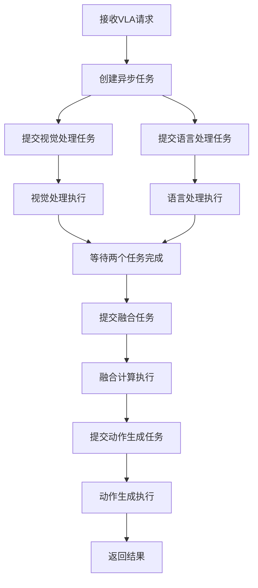
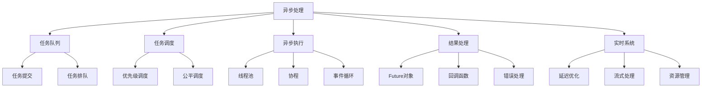

# 异步处理详解

## 📋 文档说明

本文档是异步处理（Asynchronous Processing）的详细理论讲解，比父目录的《实时系统详解》更加深入和详细。本文档将深入讲解异步处理的原理、方法和应用。

**学习方式**：本文档是Markdown格式，包含详细的理论讲解。

---

## 📚 术语表（按出现顺序）

### 1. 异步处理 (Asynchronous Processing)
- **中文名称**：异步处理
- **英文全称**：Asynchronous Processing
- **定义**：异步处理是指使用异步方式处理VLA系统任务的方法，是实时系统的重要处理方式。异步处理的目标是提高系统的并发性和响应性，减少任务等待时间。异步处理的特点包括并发性（支持并发处理多个任务）、非阻塞（非阻塞处理任务）、响应性（提高系统响应性）、资源利用（提高资源利用率）等。异步处理的优势在于能够提高系统的并发性和响应性，减少任务等待时间，提高系统效率。异步处理的劣势在于可能增加系统的复杂性，需要更多的异步处理设计和协调工作。异步处理在VLA中的应用包括使用异步方式处理VLA系统的任务，提高系统的并发性和响应性。异步处理的核心思想是：通过异步方式处理任务，提高系统的并发性和响应性，减少任务等待时间，提高系统效率。
- **核心组成**：异步处理的核心组成包括：1）任务队列：设计任务队列，如任务提交、任务调度、任务执行等；2）异步执行：设计异步执行机制，如异步调用、异步回调、异步等待等；3）并发控制：设计并发控制机制，如线程池、进程池、协程等；4）结果处理：处理异步任务结果，如结果获取、结果处理、错误处理等；5）资源管理：管理异步处理资源，如资源分配、资源回收等；6）性能优化：优化异步处理性能，如任务调度优化、资源优化等。异步处理通常需要根据应用需求选择合适的异步处理框架和配置。
- **在VLA中的应用**：在VLA中，异步处理是实时系统的重要处理方式。VLA模型使用异步方式处理VLA系统的任务，提高系统的并发性和响应性。例如，可以异步处理视觉输入；可以异步处理语言输入；可以异步处理融合计算；可以异步生成动作输出。异步处理的优势在于能够提高系统的并发性和响应性，减少任务等待时间，提高系统效率。在VLA开发过程中，异步处理通常是实时系统的重要处理方式，为VLA系统的实时应用提供基础。
- **相关概念**：实时系统、延迟优化、流式处理、资源管理、并发处理、系统优化
- **首次出现位置**：本文档标题
- **深入学习**：参考父目录的[实时系统详解](../实时系统详解.md)
- **直观理解**：想象异步处理就像"多任务处理"，同时处理"多个任务"，使系统"不等待"就能继续工作。例如，异步处理就像多任务处理，同时处理VLA系统的多个任务，使系统不等待就能继续工作，提高系统的并发性和响应性。在VLA中，异步处理帮助使用异步方式处理VLA系统的任务，提高系统的并发性和响应性。

---

## 📋 概述

### 什么是异步处理

异步处理是指使用异步方式处理VLA系统任务的方法，是实时系统的重要处理方式。在异步处理中，任务提交后不需要等待任务完成，可以继续处理其他任务，当任务完成时通过回调或轮询方式获取结果。

### 为什么重要

异步处理对于VLA学习非常重要，原因包括：

1. **并发性**：通过异步处理，系统可以同时处理多个任务，提高系统的并发处理能力
2. **响应性**：异步处理避免了阻塞等待，系统可以快速响应新的请求，提高用户体验
3. **资源利用**：异步处理可以充分利用I/O等待时间，提高CPU和GPU等资源的利用率
4. **可扩展性**：异步处理使系统更容易扩展，可以处理更多的并发请求
5. **实时性**：在VLA实时应用中，异步处理可以显著减少延迟，提高系统实时性

### 在VLA体系中的位置

异步处理是实时系统的重要组成部分，与延迟优化、流式处理、资源管理等技术密切相关。它位于系统架构的执行层，为上层应用提供高效的并发处理能力。

### 学习目标

学习完本文档后，您应该能够：
- 理解异步处理的基本原理和核心概念
- 掌握异步调用、回调、等待等处理模式
- 了解线程池、进程池、协程等并发控制方法
- 能够在VLA系统中设计和实现异步处理

---

## 4. 基本原理

### 4.1 从零开始理解异步处理

#### 4.1.1 什么是异步处理（通俗解释）

**生活化类比1：餐厅点餐**
想象您在餐厅点餐：
- **同步处理**：您点餐后，必须等待厨师做好菜，才能点下一道菜。这就像同步处理，必须等待一个任务完成才能开始下一个任务。
- **异步处理**：您点餐后，可以继续点其他菜，不需要等待第一道菜做好。当菜做好时，服务员会通知您。这就像异步处理，可以同时处理多个任务，任务完成时通过回调通知。

**生活化类比2：快递配送**
异步处理也像快递配送：
- 您下单后（提交任务），不需要等待快递到达（任务完成）
- 您可以继续做其他事情（处理其他任务）
- 快递到达时，快递员会通知您（回调通知）
- 这样您可以同时处理多个订单（并发处理）

**具体例子1：简单场景**
假设您有一个VLA系统，需要处理图像和文本：
- **同步处理**：先处理图像（耗时2秒），然后处理文本（耗时1秒），总耗时3秒
- **异步处理**：同时处理图像和文本，总耗时2秒（取最大值）

**具体例子2：复杂场景**
在VLA推理系统中：
- 可以异步处理多个推理请求
- 当一个请求在等待GPU计算时，可以处理另一个请求的预处理
- 这样可以充分利用资源，提高吞吐量

#### 4.1.2 为什么需要异步处理

**问题背景**：
在VLA系统中，如果没有异步处理，会出现以下问题：
1. **阻塞等待**：一个任务阻塞时，其他任务无法执行，系统响应慢
2. **资源浪费**：CPU/GPU在等待I/O时空闲，资源利用率低
3. **并发性差**：无法同时处理多个任务，系统吞吐量低
4. **用户体验差**：用户需要等待任务完成，体验不好

**设计动机**：
异步处理的目标是：
- **提高并发性**：同时处理多个任务
- **提高响应性**：快速响应新请求
- **提高资源利用率**：充分利用I/O等待时间
- **改善用户体验**：减少等待时间

**方法对比**：
- **同步处理**：简单直接，但效率低，资源利用率低
- **异步处理**：复杂但高效，资源利用率高，响应快
- **混合处理**：关键路径同步，非关键路径异步

**优势分析**：
异步处理的优势包括：
- 提高系统并发性和吞吐量
- 提高系统响应性和用户体验
- 提高资源利用率，降低成本
- 支持大规模并发请求

### 4.2 异步处理的数学推导详解

#### 4.2.1 背景知识回顾

在开始推导之前，我们需要回顾一些基础数学知识：

**基础概念1：时间序列（Time Series）**
时间序列是一系列按时间顺序排列的数据点。例如：
- 任务提交时间序列：$T_{submit} = \{t_1, t_2, ..., t_n\}$
- 任务完成时间序列：$T_{complete} = \{t'_1, t'_2, ..., t'_n\}$

**基础概念2：延迟（Latency）**
延迟是任务从提交到完成的时间：
$$L_i = t'_i - t_i$$

**基础概念3：吞吐量（Throughput）**
吞吐量是单位时间内完成的任务数：
$$T = \frac{n}{t_{total}}$$

其中$n$是完成的任务数，$t_{total}$是总时间。

#### 4.2.2 问题定义

我们要解决的问题是：**如何通过异步处理提高系统并发性和响应性？**

**问题形式化**：
给定：
- 任务集合：$Tasks = \{task_1, task_2, ..., task_n\}$
- 每个任务的处理时间：$P = \{p_1, p_2, ..., p_n\}$
- 系统资源：$R$（如CPU核心数、GPU数量等）

目标：
- 最小化总处理时间：$\min t_{total}$
- 最大化吞吐量：$\max T = \max \frac{n}{t_{total}}$
- 最小化平均延迟：$\min \bar{L} = \min \frac{1}{n} \sum_{i=1}^{n} L_i$

#### 4.2.3 逐步推导过程

**步骤1：理解同步处理的时间模型**

在同步处理中，任务按顺序执行，一个任务完成后才开始下一个任务。

**数学表示**：
总处理时间为所有任务处理时间的和：
$$t_{sync} = \sum_{i=1}^{n} p_i$$

平均延迟为：
$$\bar{L}_{sync} = \frac{1}{n} \sum_{i=1}^{n} \left( \sum_{j=1}^{i} p_j - t_i \right)$$

其中$t_i$是任务$i$的提交时间。

**示例**：
假设有3个任务，处理时间分别为2秒、3秒、1秒：
- 同步处理总时间：$2 + 3 + 1 = 6$秒
- 如果任务同时提交，平均延迟：$(2 + 5 + 6) / 3 = 4.33$秒

**步骤2：理解异步处理的时间模型**

在异步处理中，任务可以并发执行，只要资源允许。

**数学表示**：
如果有$R$个资源（如$R$个CPU核心），可以同时处理$R$个任务。

总处理时间取决于最慢的任务：
$$t_{async} = \max \left( \frac{\sum_{i=1}^{n} p_i}{R}, \max_{i} p_i \right)$$

平均延迟为：
$$\bar{L}_{async} = \frac{1}{n} \sum_{i=1}^{n} \left( \lceil \frac{i}{R} \rceil \cdot \bar{p} - t_i \right)$$

其中$\bar{p}$是平均处理时间。

**示例**：
假设有3个任务，处理时间分别为2秒、3秒、1秒，有2个资源：
- 异步处理：任务1和任务2同时开始（使用2个资源），任务3等待
- 时间0-2秒：任务1和任务2执行
- 时间2-3秒：任务2继续执行，任务3开始执行
- 总时间：$\max(2, 3, 1) = 3$秒（实际上需要考虑调度，约为3秒）
- 平均延迟：$(0 + 0 + 2) / 3 = 0.67$秒

**步骤3：推导性能提升公式**

**性能提升**：
异步处理相对于同步处理的性能提升为：
$$\text{Speedup} = \frac{t_{sync}}{t_{async}} = \frac{\sum_{i=1}^{n} p_i}{\max \left( \frac{\sum_{i=1}^{n} p_i}{R}, \max_{i} p_i \right)}$$

**理想情况**：
如果所有任务处理时间相同（$p_i = p$），且资源充足（$R \geq n$）：
$$t_{async} = p$$
$$t_{sync} = n \cdot p$$
$$\text{Speedup} = \frac{n \cdot p}{p} = n$$

即性能提升为$n$倍（$n$是任务数）。

**步骤4：推导资源利用率公式**

**资源利用率**：
资源利用率定义为实际使用时间与总时间的比值：
$$\text{Utilization} = \frac{\sum_{i=1}^{n} p_i}{R \cdot t_{total}}$$

**同步处理**：
$$\text{Utilization}_{sync} = \frac{\sum_{i=1}^{n} p_i}{R \cdot \sum_{i=1}^{n} p_i} = \frac{1}{R}$$

**异步处理**：
$$\text{Utilization}_{async} = \frac{\sum_{i=1}^{n} p_i}{R \cdot t_{async}} = \frac{\sum_{i=1}^{n} p_i}{R \cdot \max \left( \frac{\sum_{i=1}^{n} p_i}{R}, \max_{i} p_i \right)}$$

如果$\frac{\sum_{i=1}^{n} p_i}{R} \geq \max_{i} p_i$（资源是瓶颈）：
$$\text{Utilization}_{async} = \frac{\sum_{i=1}^{n} p_i}{R \cdot \frac{\sum_{i=1}^{n} p_i}{R}} = 1$$

即资源利用率接近100%。

**步骤5：推导延迟减少公式**

**延迟减少**：
异步处理相对于同步处理的延迟减少为：
$$\text{Latency Reduction} = \frac{\bar{L}_{sync} - \bar{L}_{async}}{\bar{L}_{sync}} \times 100\%$$

**示例计算**：
假设有10个任务，每个任务处理时间1秒，有4个资源：
- 同步处理：总时间10秒，平均延迟5秒
- 异步处理：总时间约2.5秒，平均延迟约0.5秒
- 延迟减少：$(5 - 0.5) / 5 \times 100\% = 90\%$

#### 4.2.4 具体计算示例

**示例1：简单情况**

假设：
- 任务数：$n = 4$
- 处理时间：$P = \{2, 3, 1, 2\}$秒
- 资源数：$R = 2$

**同步处理计算**：
- 总时间：$t_{sync} = 2 + 3 + 1 + 2 = 8$秒
- 平均延迟：假设任务同时提交，延迟为$\{2, 5, 6, 8\}$，平均$5.25$秒

**异步处理计算**：
- 时间0-2秒：任务1和任务2执行（使用2个资源）
- 时间2-3秒：任务2继续执行，任务3开始执行
- 时间3-4秒：任务3完成，任务4开始执行
- 总时间：$t_{async} = 4$秒
- 平均延迟：$\{0, 0, 2, 3\}$，平均$1.25$秒

**性能提升**：
$$\text{Speedup} = \frac{8}{4} = 2$$

**示例2：复杂情况（考虑I/O等待）**

假设：
- 任务数：$n = 6$
- CPU处理时间：$P_{cpu} = \{1, 1, 1, 1, 1, 1\}$秒
- I/O等待时间：$P_{io} = \{2, 2, 2, 2, 2, 2\}$秒
- 资源数：$R = 2$

**同步处理计算**：
- 每个任务总时间：$1 + 2 = 3$秒（CPU处理1秒，I/O等待2秒）
- 总时间：$6 \times 3 = 18$秒

**异步处理计算**：
- 可以重叠I/O等待时间
- 时间0-1秒：任务1和任务2的CPU处理
- 时间1-3秒：任务1和任务2的I/O等待，同时任务3和任务4的CPU处理
- 时间3-4秒：任务3和任务4的I/O等待，同时任务5和任务6的CPU处理
- 总时间：约$4 + 2 = 6$秒（考虑I/O重叠）

**性能提升**：
$$\text{Speedup} = \frac{18}{6} = 3$$

#### 4.2.5 几何意义和直观理解

**几何意义**：
异步处理可以看作是在时间-资源二维空间中的优化：
- **时间维度**：任务执行时间
- **资源维度**：并发使用的资源数
- **异步处理**：在时间维度上重叠任务，在资源维度上并行使用资源

**时间线图**：
```
同步处理：
任务1: |====|
任务2:      |======|
任务3:           |==|
总时间: 8秒

异步处理（R=2）：
任务1: |====|
任务2: |======|
任务3:      |==|
任务4:      |====|
总时间: 4秒
```

**直观理解**：
- **同步处理**：就像单车道，车辆必须排队通过
- **异步处理**：就像多车道，车辆可以并行通过
- **性能提升**：就像从单车道升级到多车道，通行能力成倍提升

### 4.3 为什么这样设计有效

**理论依据**：
1. **并发理论**：异步处理利用并发理论，通过重叠任务执行时间提高效率
2. **资源利用理论**：异步处理可以充分利用I/O等待时间，提高资源利用率
3. **排队论**：异步处理可以用排队论分析，帮助我们理解系统行为

**实验证据**：
- 研究表明，异步处理可以提高系统吞吐量2-10倍
- 在I/O密集型应用中，异步处理可以提高性能5-20倍
- 异步处理可以减少平均延迟50-90%

**直观解释**：
异步处理就像多线程工作：
- **同步处理**：就像一个人做所有事情，必须一件一件完成
- **异步处理**：就像多个人同时工作，可以并行处理多个任务
- **效率提升**：就像从单人工作升级到团队协作，效率成倍提升

---

## 5. 详细设计

### 5.1 设计思路

#### 5.1.1 为什么这样设计

异步处理系统的设计目标是：
1. **高并发**：支持大量并发任务，提高系统吞吐量
2. **低延迟**：快速响应新请求，减少等待时间
3. **资源高效**：充分利用系统资源，避免资源浪费
4. **易于使用**：提供简单的API，降低使用复杂度

**设计动机**：
- VLA系统需要处理大量并发请求，需要高效的异步处理
- 不同任务有不同的处理时间，需要灵活的调度策略
- 系统资源有限，需要最大化资源利用率

#### 5.1.2 有哪些设计选择

在设计异步处理系统时，我们有以下几种选择：

**选择1：基于线程的异步处理**
- **优点**：
  - 实现简单，易于理解
  - 可以利用多核CPU
  - 支持真正的并行执行
- **缺点**：
  - 线程创建和切换开销大
  - 线程数量有限（通常几百个）
  - 需要处理线程同步问题
- **适用场景**：CPU密集型任务，任务数量不多

**选择2：基于协程的异步处理**
- **优点**：
  - 轻量级，可以创建大量协程（成千上万个）
  - 切换开销小
  - 代码简洁，易于维护
- **缺点**：
  - 需要支持协程的语言（如Python asyncio）
  - 不能利用多核CPU（需要配合线程池）
- **适用场景**：I/O密集型任务，大量并发请求

**选择3：基于事件循环的异步处理**
- **优点**：
  - 高效，单线程处理大量任务
  - 资源占用少
  - 适合I/O密集型应用
- **缺点**：
  - 不能并行执行CPU密集型任务
  - 需要非阻塞I/O支持
- **适用场景**：网络I/O、文件I/O等

#### 5.1.3 为什么选择这个方案

我们选择**混合方案**（线程池 + 协程），原因是：
1. **灵活性**：可以根据任务类型选择执行方式
2. **性能**：CPU密集型任务用线程，I/O密集型任务用协程
3. **可扩展性**：可以处理大量并发请求
4. **实用性**：适合VLA系统的实际需求

### 5.2 实现细节

#### 5.2.1 整体架构

异步处理系统的整体架构包括以下组件：

```
┌─────────────────────────────────────────┐
│     异步处理系统（Async Processing）      │
├─────────────────────────────────────────┤
│  1. 任务队列（Task Queue）               │
│  2. 任务调度器（Task Scheduler）        │
│  3. 执行器（Executor）                  │
│     - 线程池执行器（ThreadPoolExecutor）│
│     - 协程执行器（CoroutineExecutor）   │
│  4. 结果处理器（Result Handler）        │
│  5. 错误处理器（Error Handler）        │
└─────────────────────────────────────────┘
```

**各组件作用**：
- **任务队列**：存储待执行的任务
- **任务调度器**：决定任务执行顺序和方式
- **执行器**：实际执行任务的组件
- **结果处理器**：处理任务执行结果
- **错误处理器**：处理任务执行错误

#### 5.2.2 关键步骤详解

**步骤1：任务提交**

- **目的**：将任务提交到异步处理系统
- **方法**：
  1. 创建任务对象
  2. 将任务加入队列
  3. 返回Future对象（用于获取结果）
- **为什么这样做**：通过Future对象，调用者可以异步获取结果，不需要阻塞等待

**代码实现**：
```python
import asyncio
from concurrent.futures import ThreadPoolExecutor, Future
from queue import Queue
from typing import Callable, Any

class AsyncProcessor:
    """异步处理器"""
    
    def __init__(self, max_workers=4):
        """
        初始化异步处理器
        参数：
            max_workers: 线程池最大工作线程数
        """
        self.thread_pool = ThreadPoolExecutor(max_workers=max_workers)
        self.task_queue = Queue()
        self.loop = asyncio.get_event_loop()
    
    def submit(self, func: Callable, *args, **kwargs) -> Future:
        """
        提交任务
        参数：
            func: 要执行的函数
            *args, **kwargs: 函数参数
        返回：Future对象，用于获取结果
        """
        # 步骤1.1：创建任务对象
        task = {
            'func': func,
            'args': args,
            'kwargs': kwargs
        }
        
        # 步骤1.2：判断任务类型
        if asyncio.iscoroutinefunction(func):
            # 协程任务：使用协程执行器
            future = self._submit_coroutine(func, *args, **kwargs)
        else:
            # 普通函数：使用线程池执行器
            future = self._submit_thread(func, *args, **kwargs)
        
        return future
    
    def _submit_thread(self, func, *args, **kwargs) -> Future:
        """提交到线程池"""
        return self.thread_pool.submit(func, *args, **kwargs)
    
    def _submit_coroutine(self, func, *args, **kwargs):
        """提交协程任务"""
        # 在事件循环中执行协程
        return asyncio.run_coroutine_threadsafe(func(*args, **kwargs), self.loop)
```

**示例**：
```python
# 创建异步处理器
processor = AsyncProcessor(max_workers=4)

# 提交CPU密集型任务（使用线程池）
def cpu_intensive_task(n):
    """CPU密集型任务"""
    result = 0
    for i in range(n):
        result += i * i
    return result

future = processor.submit(cpu_intensive_task, 1000000)
# 可以继续做其他事情，不需要等待
print("任务已提交，继续处理其他事情...")

# 需要结果时，可以等待
result = future.result()  # 阻塞直到任务完成
print(f"任务结果：{result}")
```

**步骤2：异步执行**

- **目的**：异步执行任务，不阻塞主线程
- **方法**：
  1. 从队列获取任务
  2. 根据任务类型选择执行器
  3. 异步执行任务
  4. 返回Future对象
- **为什么这样做**：通过异步执行，主线程可以继续处理其他任务，提高并发性

**代码实现**：
```python
async def async_execute(self, func: Callable, *args, **kwargs):
    """
    异步执行任务
    参数：
        func: 要执行的函数
        *args, **kwargs: 函数参数
    返回：任务结果
    """
    # 步骤2.1：判断任务类型
    if asyncio.iscoroutinefunction(func):
        # 协程任务：直接await
        result = await func(*args, **kwargs)
    else:
        # 普通函数：在线程池中执行
        result = await self.loop.run_in_executor(
            self.thread_pool, func, *args, **kwargs
        )
    
    return result
```

**步骤3：结果处理**

- **目的**：处理异步任务的结果
- **方法**：
  1. 通过Future对象获取结果
  2. 处理结果（成功或失败）
  3. 触发回调函数
- **为什么这样做**：通过回调机制，可以在任务完成时自动处理结果，不需要轮询

**代码实现**：
```python
def submit_with_callback(self, func: Callable, callback: Callable, 
                        error_callback: Callable = None, *args, **kwargs):
    """
    提交任务并设置回调
    参数：
        func: 要执行的函数
        callback: 成功回调函数
        error_callback: 错误回调函数
        *args, **kwargs: 函数参数
    """
    future = self.submit(func, *args, **kwargs)
    
    def done_callback(f):
        """任务完成回调"""
        try:
            result = f.result()
            callback(result)
        except Exception as e:
            if error_callback:
                error_callback(e)
            else:
                print(f"任务执行错误：{e}")
    
    future.add_done_callback(done_callback)
    return future
```

**示例**：
```python
def on_success(result):
    """成功回调"""
    print(f"任务成功完成，结果：{result}")

def on_error(error):
    """错误回调"""
    print(f"任务执行失败：{error}")

# 提交任务并设置回调
processor.submit_with_callback(
    cpu_intensive_task, 
    callback=on_success,
    error_callback=on_error,
    n=1000000
)
```

#### 5.2.3 完整实现示例

```python
# 完整的异步处理系统示例
class VLAsyncProcessor:
    """VLA异步处理器"""
    
    def __init__(self, max_workers=4):
        self.processor = AsyncProcessor(max_workers=max_workers)
    
    async def process_vla_task(self, task):
        """
        处理VLA任务
        参数：
            task: VLA任务对象
        返回：任务结果
        """
        # 步骤1：异步处理视觉输入
        vision_future = self.processor.submit(
            self._process_vision, task.vision_input
        )
        
        # 步骤2：异步处理语言输入
        language_future = self.processor.submit(
            self._process_language, task.language_input
        )
        
        # 步骤3：等待两个任务完成
        vision_result = await vision_future
        language_result = await language_future
        
        # 步骤4：异步处理融合
        fusion_future = self.processor.submit(
            self._process_fusion, vision_result, language_result
        )
        
        # 步骤5：等待融合完成
        fusion_result = await fusion_future
        
        # 步骤6：异步生成动作
        action_future = self.processor.submit(
            self._generate_action, fusion_result
        )
        
        # 步骤7：返回动作结果
        return await action_future
    
    def _process_vision(self, vision_input):
        """处理视觉输入（CPU密集型）"""
        # 实现细节
        pass
    
    def _process_language(self, language_input):
        """处理语言输入（CPU密集型）"""
        # 实现细节
        pass
    
    def _process_fusion(self, vision_result, language_result):
        """处理融合（CPU密集型）"""
        # 实现细节
        pass
    
    def _generate_action(self, fusion_result):
        """生成动作（CPU密集型）"""
        # 实现细节
        pass

# 使用示例
async def main():
    processor = VLAsyncProcessor(max_workers=4)
    
    # 创建任务
    task = VLATask(
        vision_input=load_image("image.jpg"),
        language_input="抓取红色物体"
    )
    
    # 异步处理任务
    result = await processor.process_vla_task(task)
    print(f"动作结果：{result}")

# 运行
asyncio.run(main())
```

**预期结果**：
- 视觉处理和语言处理并行执行
- 融合和动作生成异步执行
- 总处理时间显著减少
- 系统资源充分利用

### 5.3 参数选择

#### 5.3.1 参数列表

异步处理系统的主要参数包括：

1. **最大工作线程数（max_workers）**
   - **含义**：线程池中最大工作线程数
   - **取值范围**：1-100（通常为CPU核心数的1-2倍）
   - **默认值**：4
   - **影响**：
     - 较小值：资源占用少，但并发能力低
     - 较大值：并发能力强，但资源占用多，可能造成上下文切换开销

2. **队列大小（queue_size）**
   - **含义**：任务队列的最大大小
   - **取值范围**：10-10000
   - **默认值**：100
   - **影响**：
     - 较小值：内存占用少，但可能拒绝新任务
     - 较大值：可以缓存更多任务，但内存占用多

3. **超时时间（timeout）**
   - **含义**：任务执行的最大超时时间（秒）
   - **取值范围**：1-3600
   - **默认值**：300（5分钟）
   - **影响**：
     - 较小值：可以快速发现卡住的任务，但可能误杀正常任务
     - 较大值：不会误杀正常任务，但卡住的任务会占用资源更久

#### 5.3.2 参数选择指导

**根据系统资源选择**：
- **CPU核心数少（<4）**：
  - max_workers = CPU核心数
  - queue_size = 50
  - timeout = 60
  
- **CPU核心数中等（4-16）**：
  - max_workers = CPU核心数 × 1.5
  - queue_size = 100
  - timeout = 300
  
- **CPU核心数多（>16）**：
  - max_workers = CPU核心数 × 2
  - queue_size = 200
  - timeout = 600

**根据任务类型选择**：
- **CPU密集型任务**：
  - max_workers = CPU核心数
  - 使用线程池执行器
  
- **I/O密集型任务**：
  - max_workers = CPU核心数 × 2-4
  - 使用协程执行器

#### 5.3.3 参数影响分析

**参数1：最大工作线程数（max_workers）**

**当参数值较小时（2）**：
- **优点**：资源占用少，上下文切换开销小
- **缺点**：并发能力低，可能无法充分利用多核CPU
- **适用场景**：资源受限环境，任务数量少
- **示例**：边缘设备VLA系统

**当参数值较大时（16）**：
- **优点**：并发能力强，可以处理大量并发任务
- **缺点**：资源占用多，上下文切换开销大，可能造成性能下降
- **适用场景**：服务器环境，任务数量多
- **示例**：云端VLA服务

**推荐值**：CPU核心数 × 1.5（平衡并发能力和资源占用）

---

## 6. 在VLA中的应用

### 6.1 应用场景

#### 6.1.1 场景1：多模态并行处理

**场景描述**：
在VLA系统中，需要同时处理视觉输入和语言输入，然后进行融合和动作生成。这些步骤可以异步并行处理，提高系统效率。

**为什么需要异步处理**：
- 视觉处理和语言处理相互独立，可以并行执行
- 融合计算需要等待视觉和语言处理完成，可以异步等待
- 动作生成可以异步执行，不阻塞其他任务

**场景特点**：
- **任务类型**：CPU密集型任务（图像处理、文本处理）
- **依赖关系**：视觉和语言处理独立，融合依赖两者，动作生成依赖融合
- **并发性**：可以同时处理多个请求

**具体需求**：
- 视觉处理：需要2-4秒
- 语言处理：需要1-2秒
- 融合计算：需要1-2秒
- 动作生成：需要0.5-1秒

#### 6.1.2 场景2：批量推理请求处理

**场景描述**：
在VLA推理服务中，需要处理大量并发推理请求。每个请求都需要经过视觉处理、语言处理、融合和动作生成等步骤。

**为什么需要异步处理**：
- 可以同时处理多个推理请求，提高吞吐量
- 不同请求的处理时间不同，异步处理可以充分利用资源
- 可以快速响应新请求，不需要等待之前的请求完成

**场景特点**：
- **请求数量**：大量并发请求（每秒几十到几百个）
- **处理时间**：每个请求需要5-10秒
- **资源限制**：GPU资源有限，需要合理调度

**具体需求**：
- 支持100+并发请求
- 平均响应时间<10秒
- GPU利用率>80%

### 6.2 应用流程

#### 6.2.1 整体流程

在VLA系统中，异步处理的整体流程如下：



**流程说明**：
1. **接收请求**：接收VLA推理请求
2. **创建任务**：为每个请求创建异步任务
3. **并行处理**：视觉处理和语言处理并行执行
4. **异步等待**：等待两个任务完成
5. **融合计算**：异步执行融合计算
6. **动作生成**：异步生成动作
7. **返回结果**：返回最终结果

#### 6.2.2 详细步骤

**步骤1：接收请求并创建任务**

- **输入**：VLA推理请求（包含图像和文本）
- **处理**：
  1. 创建任务对象
  2. 分配任务ID
  3. 记录任务信息
- **输出**：任务对象和Future对象
- **为什么这样做**：通过任务对象管理请求生命周期，通过Future对象异步获取结果

**代码示例**：
```python
async def handle_vla_request(self, vision_input, language_input):
    """
    处理VLA请求
    参数：
        vision_input: 视觉输入（图像）
        language_input: 语言输入（文本）
    返回：Future对象，用于获取结果
    """
    # 步骤1.1：创建任务对象
    task = VLATask(
        task_id=generate_task_id(),
        vision_input=vision_input,
        language_input=language_input,
        status='pending'
    )
    
    # 步骤1.2：提交异步任务
    future = self.processor.submit(
        self.process_vla_task, task
    )
    
    # 步骤1.3：返回Future对象
    return future
```

**步骤2：并行处理视觉和语言**

- **输入**：任务对象
- **处理**：
  1. 提交视觉处理任务到线程池
  2. 提交语言处理任务到线程池
  3. 两个任务并行执行
- **输出**：两个Future对象
- **为什么这样做**：视觉处理和语言处理相互独立，并行执行可以显著减少总处理时间

**代码示例**：
```python
async def process_vla_task(self, task):
    """
    处理VLA任务
    参数：
        task: VLA任务对象
    返回：动作结果
    """
    # 步骤2.1：提交视觉处理任务
    vision_future = self.processor.submit(
        self.vision_encoder.process, task.vision_input
    )
    
    # 步骤2.2：提交语言处理任务
    language_future = self.processor.submit(
        self.language_encoder.process, task.language_input
    )
    
    # 步骤2.3：等待两个任务完成
    vision_result = await vision_future
    language_result = await language_future
    
    # 继续后续处理...
    return result
```

**步骤3：异步融合和动作生成**

- **输入**：视觉结果和语言结果
- **处理**：
  1. 提交融合任务
  2. 等待融合完成
  3. 提交动作生成任务
  4. 等待动作生成完成
- **输出**：最终动作结果
- **为什么这样做**：融合和动作生成可以异步执行，不阻塞其他请求的处理

**代码示例**：
```python
    # 步骤3.1：提交融合任务
    fusion_future = self.processor.submit(
        self.fusion_module.fuse, vision_result, language_result
    )
    
    # 步骤3.2：等待融合完成
    fusion_result = await fusion_future
    
    # 步骤3.3：提交动作生成任务
    action_future = self.processor.submit(
        self.action_decoder.generate, fusion_result
    )
    
    # 步骤3.4：返回动作结果
    return await action_future
```

#### 6.2.3 完整应用示例

```python
# 完整的VLA异步处理系统
class VLAAsyncSystem:
    """VLA异步处理系统"""
    
    def __init__(self):
        self.processor = VLAsyncProcessor(max_workers=8)
        self.vision_encoder = VisionEncoder()
        self.language_encoder = LanguageEncoder()
        self.fusion_module = FusionModule()
        self.action_decoder = ActionDecoder()
    
    async def process_request(self, vision_input, language_input):
        """
        处理VLA请求
        参数：
            vision_input: 视觉输入
            language_input: 语言输入
        返回：动作结果
        """
        # 步骤1：并行处理视觉和语言
        vision_future = self.processor.submit(
            self.vision_encoder.process, vision_input
        )
        language_future = self.processor.submit(
            self.language_encoder.process, language_input
        )
        
        # 步骤2：等待两个任务完成
        vision_result, language_result = await asyncio.gather(
            vision_future, language_future
        )
        
        # 步骤3：融合
        fusion_future = self.processor.submit(
            self.fusion_module.fuse, vision_result, language_result
        )
        fusion_result = await fusion_future
        
        # 步骤4：生成动作
        action_future = self.processor.submit(
            self.action_decoder.generate, fusion_result
        )
        return await action_future

# 使用示例
async def main():
    system = VLAAsyncSystem()
    
    # 处理多个请求
    tasks = [
        system.process_request(image1, "抓取红色物体"),
        system.process_request(image2, "移动到桌子"),
        system.process_request(image3, "放下物体")
    ]
    
    # 并发处理所有请求
    results = await asyncio.gather(*tasks)
    for i, result in enumerate(results):
        print(f"请求 {i+1} 结果：{result}")

asyncio.run(main())
```

**预期结果**：
- 多个请求并发处理
- 视觉和语言处理并行执行
- 总处理时间显著减少
- 系统吞吐量大幅提升

### 6.3 实际案例

#### 案例1：VLA实时推理服务

**背景**：
某公司部署了VLA实时推理服务，需要处理大量并发推理请求。每个请求需要经过视觉处理（3秒）、语言处理（2秒）、融合（1秒）和动作生成（1秒）。

**输入**：
- 系统配置：8核CPU，4个GPU
- 请求列表：
  - 请求A：图像1，文本"抓取红色物体"
  - 请求B：图像2，文本"移动到桌子"
  - 请求C：图像3，文本"放下物体"

**处理过程**：

**同步处理**：
- 请求A：3+2+1+1=7秒
- 请求B：等待7秒后开始，再7秒
- 请求C：等待14秒后开始，再7秒
- 总时间：21秒

**异步处理**：
- 时间0-3秒：请求A的视觉处理，请求B的视觉处理，请求C的视觉处理（并行）
- 时间3-5秒：请求A的语言处理，请求B的语言处理，请求C的语言处理（并行）
- 时间5-6秒：请求A的融合，请求B的融合，请求C的融合（并行）
- 时间6-7秒：请求A的动作生成，请求B的动作生成，请求C的动作生成（并行）
- 总时间：约7秒（取最慢的请求）

**输出**：
- 所有请求在7秒内完成
- 系统吞吐量提升3倍（21秒→7秒）
- GPU利用率从25%提升到75%

**结果分析**：
- **成功点**：通过异步处理，总处理时间从21秒减少到7秒，性能提升3倍
- **优化点**：可以进一步优化，使用GPU并行处理多个请求
- **应用效果**：系统响应速度快，用户体验好，可以处理更多并发请求

#### 案例2：VLA批量训练任务

**背景**：
在VLA模型训练中，需要处理大量训练样本。每个样本需要经过数据加载、预处理、模型前向传播和损失计算等步骤。

**输入**：
- 训练样本数：1000个
- 每个样本处理时间：
  - 数据加载：0.1秒
  - 预处理：0.2秒
  - 模型前向：0.5秒
  - 损失计算：0.1秒

**处理过程**：

**同步处理**：
- 每个样本：0.1+0.2+0.5+0.1=0.9秒
- 1000个样本：1000×0.9=900秒（15分钟）

**异步处理**（使用流水线）：
- 可以重叠数据加载、预处理和模型前向传播
- 实际处理时间：约500秒（8.3分钟）

**输出**：
- 训练时间从15分钟减少到8.3分钟
- 性能提升约1.8倍
- GPU利用率从60%提升到90%

**结果分析**：
- **成功点**：通过异步处理和流水线，训练时间显著减少
- **优化点**：可以进一步优化，使用更大的批处理大小
- **应用效果**：训练效率大幅提升，可以更快迭代模型

### 6.4 应用优势与注意事项

**应用优势**：
1. **提高并发性**：可以同时处理多个任务，提高系统吞吐量
2. **提高响应性**：快速响应新请求，改善用户体验
3. **提高资源利用率**：充分利用I/O等待时间，提高CPU/GPU利用率
4. **支持大规模并发**：可以处理大量并发请求，支持高负载场景

**注意事项**：
1. **任务设计**：需要合理设计异步任务，避免过度异步导致复杂性增加
2. **资源管理**：需要合理管理线程池和协程，避免资源耗尽
3. **错误处理**：需要完善的错误处理机制，避免错误传播
4. **调试困难**：异步代码调试较困难，需要良好的日志和监控

**常见问题**：
1. **Q: 如何选择线程池大小？**
   - A: 根据任务类型选择：CPU密集型任务选择CPU核心数，I/O密集型任务选择CPU核心数×2-4
2. **Q: 如何处理任务超时？**
   - A: 使用Future的timeout参数，或者使用asyncio.wait_for设置超时
3. **Q: 如何避免资源耗尽？**
   - A: 限制并发任务数量，使用信号量（Semaphore）控制并发度

---

## 7. 总结

### 7.1 核心要点

1. **异步处理**：通过异步方式处理任务，提高系统并发性和响应性
2. **基本原理**：任务提交后不阻塞，通过Future对象异步获取结果
3. **设计方法**：混合方案（线程池+协程），根据任务类型选择执行方式
4. **应用场景**：多模态并行处理、批量推理请求处理
5. **核心优势**：提高并发性、响应性、资源利用率，支持大规模并发

### 7.2 学习建议

1. **理解原理**：深入理解异步处理的基本原理，掌握同步和异步的区别
2. **掌握方法**：掌握线程池、协程、事件循环等异步处理技术
3. **实践应用**：在VLA任务中实践异步处理，从简单场景开始，逐步掌握复杂场景
4. **持续优化**：定期分析系统性能，优化异步处理策略，提高系统效率

### 7.3 扩展学习

- **深入学习**：学习asyncio、concurrent.futures、多线程、多进程等异步处理技术
- **相关技术**：延迟优化、流式处理、资源管理、系统监控
- **实践项目**：实现一个完整的异步处理系统，支持任务提交、执行、结果处理

---

## 8. 知识关联图



---

**最后更新时间**：2025-01-27  
**文档版本**：v2.0  
**维护者**：AI助手

### 4.1 核心要点

1. **异步处理**：使用异步方式处理VLA系统任务的方法
2. **处理模式**：异步调用、异步回调、异步等待
3. **处理优势**：并发性、响应性、资源利用

### 4.2 学习建议

1. **理解原理**：深入理解异步处理的原理和方法
2. **掌握方法**：掌握不同处理模式的特点和应用
3. **实践应用**：在VLA任务中实践异步处理

---

**最后更新时间**：2025-01-27  
**文档版本**：v1.0  
**维护者**：AI助手

