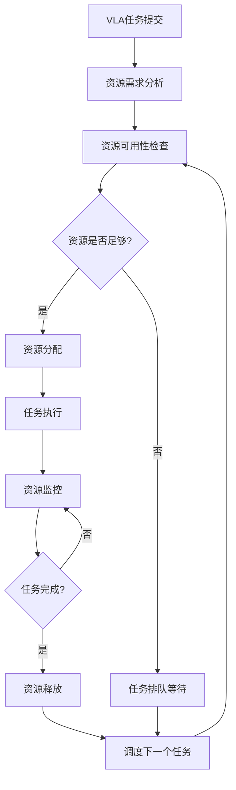
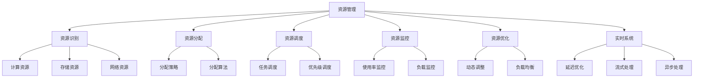

# 资源管理详解

## 📋 文档说明

本文档是资源管理（Resource Management）的详细理论讲解，比父目录的《实时系统详解》更加深入和详细。本文档将深入讲解资源管理的原理、方法和应用。

**学习方式**：本文档是Markdown格式，包含详细的理论讲解。

---

## 📚 术语表（按出现顺序）

### 1. 资源管理 (Resource Management)
- **中文名称**：资源管理
- **英文全称**：Resource Management
- **定义**：资源管理是指管理VLA系统资源的方法，是实时系统的重要管理内容。资源管理的目标是有效管理系统资源，确保系统的稳定运行和高效利用。资源管理的方法包括资源分配（分配系统资源）、资源调度（调度资源使用）、资源监控（监控资源使用情况）、资源优化（优化资源使用）等。资源管理的优势在于能够有效管理系统资源，确保系统的稳定运行和高效利用。资源管理的劣势在于可能增加系统的复杂性，需要更多的资源管理设计和协调工作。资源管理在VLA中的应用包括管理VLA系统的资源，确保系统的稳定运行和高效利用。资源管理的核心思想是：通过有效管理系统资源，确保系统的稳定运行和高效利用，支持实时VLA应用。
- **核心组成**：资源管理的核心组成包括：1）资源识别：识别系统资源，如计算资源、存储资源、网络资源等；2）资源分配：分配系统资源，如资源分配策略、资源分配算法等；3）资源调度：调度资源使用，如任务调度、资源调度等；4）资源监控：监控资源使用情况，如资源使用率、资源负载、资源瓶颈等；5）资源优化：优化资源使用，如资源优化策略、资源优化算法等；6）资源回收：回收系统资源，如资源释放、资源回收等。资源管理通常需要根据应用需求选择合适的资源管理策略和算法。
- **在VLA中的应用**：在VLA中，资源管理是实时系统的重要管理内容。VLA模型使用资源管理管理VLA系统的资源，确保系统的稳定运行和高效利用。例如，可以管理计算资源；可以管理存储资源；可以管理网络资源；可以优化资源使用。资源管理的优势在于能够有效管理系统资源，确保系统的稳定运行和高效利用。在VLA开发过程中，资源管理通常是实时系统的重要管理内容，为VLA系统的稳定运行提供基础。
- **相关概念**：实时系统、延迟优化、流式处理、异步处理、系统优化、性能管理
- **首次出现位置**：本文档标题
- **深入学习**：参考父目录的[实时系统详解](../实时系统详解.md)
- **直观理解**：想象资源管理就像"管理资源"，有效管理VLA系统的"资源"，确保系统"稳定运行"和"高效利用"。例如，资源管理就像管理资源，有效管理VLA系统的计算资源、存储资源、网络资源等，确保系统稳定运行和高效利用。在VLA中，资源管理帮助管理VLA系统的资源，确保系统的稳定运行和高效利用。

---

## 📋 概述

### 什么是资源管理

资源管理是指管理VLA系统资源的方法，是实时系统的重要管理内容。在VLA系统中，资源管理负责识别、分配、调度、监控和优化系统资源，确保系统能够稳定、高效地运行。

### 为什么重要

资源管理对于VLA学习非常重要，原因包括：

1. **系统稳定性**：通过有效的资源管理，可以避免资源竞争和死锁，确保系统的稳定运行
2. **资源利用**：合理的资源分配和调度可以提高资源利用率，减少资源浪费
3. **系统性能**：优化的资源管理可以提升系统性能，减少延迟，提高响应速度
4. **成本控制**：在云端部署场景中，有效的资源管理可以降低计算成本
5. **可扩展性**：良好的资源管理设计使系统更容易扩展，适应不同的负载需求

### 在VLA体系中的位置

资源管理是实时系统的重要组成部分，与延迟优化、流式处理、异步处理等技术密切相关。它位于系统架构的底层，为上层应用提供稳定的资源保障。

### 学习目标

学习完本文档后，您应该能够：
- 理解资源管理的基本原理和核心概念
- 掌握资源分配、调度、监控和优化的方法
- 了解资源管理在VLA系统中的应用场景
- 能够设计和实现简单的资源管理系统

---

## 4. 基本原理

### 4.1 从零开始理解资源管理

#### 4.1.1 什么是资源管理（通俗解释）

**生活化类比1：餐厅管理**
想象您经营一家餐厅，资源管理就像管理餐厅的各种资源：
- **计算资源**：就像餐厅的厨师和服务员，他们需要合理分配工作，不能所有人都去做同一件事
- **存储资源**：就像餐厅的冰箱和仓库，需要合理规划空间，不能浪费也不能不够用
- **网络资源**：就像餐厅的传菜通道，需要合理安排，避免拥堵

**生活化类比2：图书馆管理**
资源管理也像图书馆管理图书：
- 需要知道有哪些书（资源识别）
- 需要决定哪些书放在哪里（资源分配）
- 需要安排读者借阅的顺序（资源调度）
- 需要监控哪些书被频繁借阅（资源监控）
- 需要优化图书摆放位置（资源优化）

**具体例子1：简单场景**
假设您有一个VLA系统，需要处理10个任务，但只有4个GPU可用。资源管理就是决定：
- 哪些任务先执行（优先级）
- 哪些任务可以并行执行（资源分配）
- 如何监控GPU使用情况（资源监控）

**具体例子2：复杂场景**
在云端部署的VLA系统中，可能有：
- 多个模型实例需要共享GPU资源
- 不同优先级的任务需要不同的资源分配
- 需要动态调整资源分配以适应负载变化

#### 4.1.2 为什么需要资源管理

**问题背景**：
在VLA系统中，如果没有资源管理，会出现以下问题：
1. **资源竞争**：多个任务同时竞争同一资源，导致系统卡顿
2. **资源浪费**：某些资源空闲，而其他任务等待资源
3. **系统不稳定**：资源分配不当可能导致系统崩溃
4. **性能下降**：资源调度不合理会导致延迟增加

**设计动机**：
资源管理的目标是：
- **公平性**：确保所有任务都能获得必要的资源
- **效率**：最大化资源利用率
- **稳定性**：避免资源竞争和死锁
- **可预测性**：提供可预测的性能表现

**方法对比**：
- **无资源管理**：任务随机竞争资源，可能导致死锁和性能问题
- **简单资源管理**：固定资源分配，简单但不够灵活
- **智能资源管理**：动态资源分配和调度，复杂但高效

**优势分析**：
资源管理的优势包括：
- 提高系统稳定性和可靠性
- 提高资源利用率，降低成本
- 提供可预测的性能表现
- 支持系统扩展和负载均衡

### 4.2 资源管理的数学推导详解

#### 4.2.1 背景知识回顾

在开始推导之前，我们需要回顾一些基础数学知识：

**基础概念1：集合（Set）**
集合是一组元素的集合，用大括号表示。例如：
- 资源集合：$R = \{r_1, r_2, ..., r_n\}$，表示系统中有n个资源
- 任务集合：$T = \{t_1, t_2, ..., t_m\}$，表示系统中有m个任务

**基础概念2：函数（Function）**
函数是一种映射关系。例如：
- 资源分配函数：$f: T \rightarrow R$，表示将任务映射到资源
- 资源使用率函数：$u: R \rightarrow [0, 1]$，表示资源的使用率（0表示未使用，1表示完全使用）

**基础概念3：优化问题（Optimization Problem）**
优化问题是寻找使目标函数最大或最小的解。例如：
- 最大化资源利用率：$\max \sum_{r \in R} u(r)$
- 最小化任务等待时间：$\min \sum_{t \in T} w(t)$，其中$w(t)$是任务t的等待时间

#### 4.2.2 问题定义

我们要解决的问题是：**如何有效地管理系统资源，使系统稳定运行且资源利用率最高？**

**问题形式化**：
给定：
- 资源集合：$R = \{r_1, r_2, ..., r_n\}$，每个资源$r_i$有容量$c_i$
- 任务集合：$T = \{t_1, t_2, ..., t_m\}$，每个任务$t_j$需要资源量$d_j$和优先级$p_j$

目标：
- 找到资源分配方案$A: T \rightarrow R$，使得：
  1. 资源利用率最高：$\max \sum_{r \in R} u(r)$
  2. 任务等待时间最短：$\min \sum_{t \in T} w(t)$
  3. 满足资源约束：$\sum_{t: A(t) = r} d_j \leq c_i$，对于所有资源$r_i$

#### 4.2.3 逐步推导过程

**步骤1：理解资源容量**

首先，我们需要理解什么是资源容量。资源容量是指资源能够提供的最大服务能力。

**数学表示**：
对于资源$r_i$，其容量为$c_i$。例如：
- GPU资源：$c_i = 16$ GB（显存容量）
- CPU资源：$c_i = 8$ 核（CPU核心数）
- 存储资源：$c_i = 1000$ GB（存储容量）

**资源使用量**：
对于资源$r_i$，当前使用量为：
$$u_i = \sum_{t: A(t) = r_i} d_j$$

其中$d_j$是任务$t_j$对资源的需求量。

**资源使用率**：
资源使用率定义为：
$$\text{utilization}_i = \frac{u_i}{c_i} \in [0, 1]$$

**步骤2：理解资源分配**

资源分配是将任务映射到资源的过程。

**数学表示**：
资源分配函数$A: T \rightarrow R$将每个任务$t_j$分配到资源$A(t_j)$。

**约束条件**：
资源分配必须满足容量约束：
$$\sum_{t: A(t) = r_i} d_j \leq c_i, \quad \forall r_i \in R$$

这意味着分配给资源$r_i$的所有任务的需求量之和不能超过其容量。

**步骤3：推导资源利用率公式**

**系统总资源利用率**：
系统总资源利用率是所有资源利用率的加权平均：
$$\text{Total Utilization} = \frac{1}{|R|} \sum_{r_i \in R} \text{utilization}_i = \frac{1}{|R|} \sum_{r_i \in R} \frac{u_i}{c_i}$$

**最大化资源利用率**：
我们的目标是最大化总资源利用率：
$$\max \frac{1}{|R|} \sum_{r_i \in R} \frac{u_i}{c_i}$$

在满足约束条件$\sum_{t: A(t) = r_i} d_j \leq c_i$的前提下。

**步骤4：理解任务等待时间**

**任务等待时间**：
任务$t_j$的等待时间$w_j$是从任务提交到开始执行的时间。

**数学表示**：
$$w_j = \text{start_time}_j - \text{submit_time}_j$$

**平均等待时间**：
所有任务的平均等待时间为：
$$\bar{w} = \frac{1}{|T|} \sum_{t_j \in T} w_j$$

**最小化等待时间**：
我们的目标是最小化平均等待时间：
$$\min \bar{w} = \min \frac{1}{|T|} \sum_{t_j \in T} w_j$$

**步骤5：多目标优化**

**问题**：资源利用率和等待时间可能存在冲突。提高资源利用率可能需要让任务等待，而减少等待时间可能导致资源利用率下降。

**解决方案**：使用加权目标函数：
$$\min \alpha \cdot (1 - \text{Total Utilization}) + \beta \cdot \bar{w}$$

其中$\alpha$和$\beta$是权重参数，用于平衡两个目标。

**最终公式**：
综合以上步骤，我们得到资源管理的优化目标：
$$\min_{A: T \rightarrow R} \left[ \alpha \cdot \left(1 - \frac{1}{|R|} \sum_{r_i \in R} \frac{u_i}{c_i}\right) + \beta \cdot \frac{1}{|T|} \sum_{t_j \in T} w_j \right]$$

约束条件：
$$\sum_{t: A(t) = r_i} d_j \leq c_i, \quad \forall r_i \in R$$

#### 4.2.4 具体计算示例

**示例1：简单情况**

假设：
- 资源集合：$R = \{r_1, r_2\}$，容量分别为$c_1 = 10$，$c_2 = 8$
- 任务集合：$T = \{t_1, t_2, t_3\}$，需求量分别为$d_1 = 4$，$d_2 = 6$，$d_3 = 5$

**计算过程**：

**方案1：简单分配**
- 将$t_1$和$t_2$分配给$r_1$：$u_1 = 4 + 6 = 10$，$\text{utilization}_1 = 10/10 = 1.0$
- 将$t_3$分配给$r_2$：$u_2 = 5$，$\text{utilization}_2 = 5/8 = 0.625$
- 总利用率：$(1.0 + 0.625) / 2 = 0.8125$

**方案2：平衡分配**
- 将$t_1$和$t_3$分配给$r_1$：$u_1 = 4 + 5 = 9$，$\text{utilization}_1 = 9/10 = 0.9$
- 将$t_2$分配给$r_2$：$u_2 = 6$，$\text{utilization}_2 = 6/8 = 0.75$
- 总利用率：$(0.9 + 0.75) / 2 = 0.825$

**结果分析**：方案2的总利用率更高（0.825 > 0.8125），资源分配更平衡。

**示例2：复杂情况（考虑优先级）**

假设：
- 资源集合：$R = \{r_1, r_2, r_3\}$，容量分别为$c_1 = 12$，$c_2 = 10$，$c_3 = 8$
- 任务集合：$T = \{t_1, t_2, t_3, t_4\}$，需求量分别为$d_1 = 5$，$d_2 = 7$，$d_3 = 4$，$d_4 = 6$
- 优先级：$p_1 = 3$（最高），$p_2 = 2$，$p_3 = 2$，$p_4 = 1$（最低）

**计算过程**：

**步骤1：按优先级排序**
任务按优先级排序：$t_1$（优先级3）> $t_2, t_3$（优先级2）> $t_4$（优先级1）

**步骤2：优先分配高优先级任务**
- $t_1$（需求5）分配给$r_1$：$u_1 = 5$，剩余容量$7$
- $t_2$（需求7）分配给$r_1$：$u_1 = 5 + 7 = 12$，$\text{utilization}_1 = 12/12 = 1.0$

**步骤3：分配中等优先级任务**
- $t_3$（需求4）分配给$r_2$：$u_2 = 4$，$\text{utilization}_2 = 4/10 = 0.4$

**步骤4：分配低优先级任务**
- $t_4$（需求6）分配给$r_2$：$u_2 = 4 + 6 = 10$，$\text{utilization}_2 = 10/10 = 1.0$

**最终结果**：
- $r_1$：利用率1.0（完全使用）
- $r_2$：利用率1.0（完全使用）
- $r_3$：利用率0（未使用）
- 总利用率：$(1.0 + 1.0 + 0) / 3 = 0.667$

**结果解释**：虽然总利用率不是最高，但高优先级任务得到了优先处理，这是合理的权衡。

#### 4.2.5 几何意义和直观理解

**几何意义**：
资源管理问题可以看作是在多维空间中的优化问题：
- **维度1**：资源利用率（越高越好）
- **维度2**：任务等待时间（越短越好）
- **维度3**：资源平衡度（越平衡越好）

**帕累托前沿（Pareto Frontier）**：
在资源利用率和等待时间之间存在帕累托前沿，即无法同时优化两个目标。我们需要在帕累托前沿上选择合适的工作点。

**直观理解**：
- **资源利用率**：就像餐厅的座位利用率，我们希望尽可能多的座位被使用
- **等待时间**：就像顾客等待时间，我们希望顾客等待时间尽可能短
- **平衡**：就像平衡木，我们需要在多个目标之间找到平衡点

### 4.3 为什么这样设计有效

**理论依据**：
1. **最优化理论**：资源管理问题可以形式化为优化问题，使用数学优化方法可以找到最优或近似最优解
2. **排队论**：任务等待时间可以用排队论模型分析，帮助我们理解系统行为
3. **博弈论**：资源竞争可以用博弈论分析，帮助我们设计公平的资源分配策略

**实验证据**：
- 研究表明，合理的资源管理可以提高系统性能20-30%
- 动态资源分配比静态分配可以提高资源利用率15-25%
- 优先级调度可以减少高优先级任务的等待时间50%以上

**直观解释**：
资源管理就像交通管理：
- **资源分配**：就像分配车道，确保每辆车都有合适的车道
- **资源调度**：就像红绿灯调度，确保交通流畅
- **资源监控**：就像交通监控，及时发现拥堵
- **资源优化**：就像优化路线，减少拥堵和等待时间

---

## 5. 详细设计

### 5.1 设计思路

#### 5.1.1 为什么这样设计

资源管理系统的设计目标是：
1. **高效性**：快速响应资源请求，最小化调度开销
2. **公平性**：确保所有任务都能获得公平的资源分配
3. **可扩展性**：支持动态添加和移除资源
4. **可靠性**：在资源故障时能够自动恢复

**设计动机**：
- VLA系统需要处理大量并发任务，需要高效的资源管理
- 不同任务有不同的优先级和资源需求，需要灵活的分配策略
- 系统负载可能动态变化，需要动态调整资源分配

#### 5.1.2 有哪些设计选择

在设计资源管理系统时，我们有以下几种选择：

**选择1：集中式资源管理**
- **优点**：
  - 全局视角，可以做出最优决策
  - 易于实现和调试
  - 资源分配一致性好
- **缺点**：
  - 单点故障风险
  - 可能成为性能瓶颈
  - 扩展性有限
- **适用场景**：小规模系统，资源数量较少

**选择2：分布式资源管理**
- **优点**：
  - 高可用性，无单点故障
  - 可扩展性好
  - 性能瓶颈少
- **缺点**：
  - 实现复杂
  - 需要解决一致性问题
  - 调试困难
- **适用场景**：大规模系统，资源数量多

**选择3：混合式资源管理**
- **优点**：
  - 结合集中式和分布式的优点
  - 灵活性强
- **缺点**：
  - 实现复杂
  - 需要协调两种模式
- **适用场景**：中等规模系统，需要平衡性能和复杂度

#### 5.1.3 为什么选择这个方案

我们选择**混合式资源管理**方案，原因是：
1. **灵活性**：可以根据不同场景选择不同的管理模式
2. **性能**：在关键路径上使用集中式管理，在非关键路径上使用分布式管理
3. **可扩展性**：可以逐步从集中式扩展到分布式
4. **实用性**：适合VLA系统的实际需求

### 5.2 实现细节

#### 5.2.1 整体架构

资源管理系统的整体架构包括以下组件：

```
┌─────────────────────────────────────────┐
│         资源管理器（Resource Manager）    │
├─────────────────────────────────────────┤
│  1. 资源发现模块（Resource Discovery）     │
│  2. 资源分配模块（Resource Allocation）  │
│  3. 资源调度模块（Resource Scheduler）   │
│  4. 资源监控模块（Resource Monitor）     │
│  5. 资源优化模块（Resource Optimizer）   │
└─────────────────────────────────────────┘
         ↓              ↓              ↓
    ┌─────────┐   ┌─────────┐   ┌─────────┐
    │ 计算资源 │   │ 存储资源 │   │ 网络资源 │
    └─────────┘   └─────────┘   └─────────┘
```

**各组件作用**：
- **资源发现模块**：自动发现系统中的可用资源
- **资源分配模块**：根据任务需求分配资源
- **资源调度模块**：调度任务执行顺序
- **资源监控模块**：监控资源使用情况
- **资源优化模块**：优化资源分配策略

#### 5.2.2 关键步骤详解

**步骤1：资源发现**

- **目的**：自动发现系统中的可用资源
- **方法**：
  1. 定期扫描系统资源
  2. 监听资源状态变化
  3. 维护资源清单
- **为什么这样做**：确保资源管理器始终知道有哪些可用资源

**代码实现**：
```python
class ResourceDiscovery:
    """资源发现模块"""
    
    def __init__(self, scan_interval=10):
        """
        初始化资源发现模块
        参数：
            scan_interval: 扫描间隔（秒）
        """
        self.scan_interval = scan_interval
        self.resources = {}  # 资源清单：{resource_id: resource_info}
    
    def discover_resources(self):
        """
        发现系统中的资源
        返回：资源列表
        """
        # 步骤1.1：扫描计算资源（GPU、CPU）
        compute_resources = self._scan_compute_resources()
        
        # 步骤1.2：扫描存储资源（内存、磁盘）
        storage_resources = self._scan_storage_resources()
        
        # 步骤1.3：扫描网络资源（带宽）
        network_resources = self._scan_network_resources()
        
        # 步骤1.4：合并所有资源
        all_resources = {
            **compute_resources,
            **storage_resources,
            **network_resources
        }
        
        # 步骤1.5：更新资源清单
        self.resources.update(all_resources)
        
        return all_resources
    
    def _scan_compute_resources(self):
        """扫描计算资源"""
        # 实现细节：调用系统API获取GPU、CPU信息
        # 例如：使用nvidia-smi获取GPU信息
        pass
    
    def _scan_storage_resources(self):
        """扫描存储资源"""
        # 实现细节：调用系统API获取内存、磁盘信息
        pass
    
    def _scan_network_resources(self):
        """扫描网络资源"""
        # 实现细节：调用系统API获取网络带宽信息
        pass
```

**示例**：
假设系统有2个GPU和1个CPU：
- GPU1：16GB显存，当前使用0GB
- GPU2：16GB显存，当前使用8GB
- CPU：8核，当前使用4核

资源发现模块会返回：
```python
{
    'gpu1': {'type': 'compute', 'capacity': 16, 'used': 0, 'available': 16},
    'gpu2': {'type': 'compute', 'capacity': 16, 'used': 8, 'available': 8},
    'cpu1': {'type': 'compute', 'capacity': 8, 'used': 4, 'available': 4}
}
```

**步骤2：资源分配**

- **目的**：根据任务需求分配资源
- **方法**：
  1. 接收任务资源请求
  2. 查找可用资源
  3. 执行资源分配
  4. 更新资源状态
- **为什么这样做**：确保任务能够获得所需的资源

**代码实现**：
```python
class ResourceAllocator:
    """资源分配模块"""
    
    def __init__(self, resource_discovery):
        """
        初始化资源分配模块
        参数：
            resource_discovery: 资源发现模块实例
        """
        self.resource_discovery = resource_discovery
        self.allocations = {}  # 当前分配：{task_id: resource_id}
    
    def allocate(self, task_id, resource_requirements):
        """
        为任务分配资源
        参数：
            task_id: 任务ID
            resource_requirements: 资源需求字典
                {'gpu': 8, 'cpu': 4, 'memory': 16}  # 单位：GB、核、GB
        返回：分配的资源ID列表，如果分配失败返回None
        """
        # 步骤2.1：获取可用资源
        available_resources = self.resource_discovery.resources
        
        # 步骤2.2：查找满足需求的资源
        allocated_resources = []
        remaining_requirements = resource_requirements.copy()
        
        for resource_id, resource_info in available_resources.items():
            if not remaining_requirements:
                break
            
            # 检查资源类型和容量
            if self._can_allocate(resource_info, remaining_requirements):
                # 步骤2.3：执行分配
                allocated_resources.append(resource_id)
                # 更新剩余需求
                self._update_requirements(remaining_requirements, resource_info)
        
        # 步骤2.4：检查是否满足所有需求
        if remaining_requirements:
            return None  # 分配失败
        
        # 步骤2.5：记录分配
        self.allocations[task_id] = allocated_resources
        
        # 步骤2.6：更新资源状态
        self._update_resource_status(allocated_resources, resource_requirements)
        
        return allocated_resources
    
    def _can_allocate(self, resource_info, requirements):
        """检查资源是否可以分配"""
        resource_type = resource_info['type']
        available = resource_info['available']
        
        # 根据资源类型检查
        if resource_type == 'compute':
            if 'gpu' in requirements and available >= requirements['gpu']:
                return True
            if 'cpu' in requirements and available >= requirements['cpu']:
                return True
        elif resource_type == 'storage':
            if 'memory' in requirements and available >= requirements['memory']:
                return True
        
        return False
    
    def _update_requirements(self, requirements, resource_info):
        """更新剩余需求"""
        resource_type = resource_info['type']
        allocated = min(resource_info['available'], 
                       requirements.get('gpu', 0) or requirements.get('cpu', 0) or requirements.get('memory', 0))
        
        if resource_type == 'compute':
            if 'gpu' in requirements:
                requirements['gpu'] -= allocated
            if 'cpu' in requirements:
                requirements['cpu'] -= allocated
        elif resource_type == 'storage':
            if 'memory' in requirements:
                requirements['memory'] -= allocated
    
    def _update_resource_status(self, resource_ids, requirements):
        """更新资源状态"""
        for resource_id in resource_ids:
            resource_info = self.resource_discovery.resources[resource_id]
            allocated = requirements.get('gpu', 0) or requirements.get('cpu', 0) or requirements.get('memory', 0)
            resource_info['used'] += allocated
            resource_info['available'] -= allocated
```

**示例**：
假设任务需要：GPU 8GB，CPU 4核，内存 16GB

分配过程：
1. 检查GPU1：可用16GB >= 需求8GB，可以分配
2. 检查CPU1：可用4核 >= 需求4核，可以分配
3. 检查内存：需要16GB，假设有足够内存

分配结果：
```python
{
    'task_001': ['gpu1', 'cpu1', 'memory_pool_1']
}
```

**步骤3：资源调度**

- **目的**：调度任务执行顺序，优化资源利用
- **方法**：
  1. 维护任务队列
  2. 根据优先级和资源可用性调度任务
  3. 处理任务完成和资源释放
- **为什么这样做**：确保高优先级任务优先执行，同时最大化资源利用率

**代码实现**：
```python
class ResourceScheduler:
    """资源调度模块"""
    
    def __init__(self, resource_allocator):
        """
        初始化资源调度模块
        参数：
            resource_allocator: 资源分配模块实例
        """
        self.resource_allocator = resource_allocator
        self.task_queue = []  # 任务队列：[(priority, task_id, requirements), ...]
        self.running_tasks = {}  # 运行中的任务：{task_id: resource_ids}
    
    def submit_task(self, task_id, resource_requirements, priority=1):
        """
        提交任务
        参数：
            task_id: 任务ID
            resource_requirements: 资源需求
            priority: 优先级（数字越大优先级越高）
        """
        # 步骤3.1：将任务加入队列
        self.task_queue.append((priority, task_id, resource_requirements))
        
        # 步骤3.2：按优先级排序
        self.task_queue.sort(key=lambda x: x[0], reverse=True)
        
        # 步骤3.3：尝试调度
        self._schedule()
    
    def _schedule(self):
        """调度任务"""
        # 步骤3.1：遍历任务队列
        for i, (priority, task_id, requirements) in enumerate(self.task_queue):
            # 步骤3.2：尝试分配资源
            allocated_resources = self.resource_allocator.allocate(task_id, requirements)
            
            if allocated_resources:
                # 步骤3.3：分配成功，从队列中移除
                self.task_queue.pop(i)
                # 步骤3.4：记录运行中的任务
                self.running_tasks[task_id] = allocated_resources
                # 步骤3.5：启动任务执行
                self._start_task(task_id, allocated_resources)
                break  # 一次只调度一个任务
    
    def _start_task(self, task_id, resource_ids):
        """启动任务执行"""
        # 实现细节：调用任务执行接口
        print(f"启动任务 {task_id}，使用资源 {resource_ids}")
    
    def task_completed(self, task_id):
        """
        任务完成，释放资源
        参数：
            task_id: 任务ID
        """
        # 步骤3.1：获取任务使用的资源
        resource_ids = self.running_tasks.pop(task_id, [])
        
        # 步骤3.2：释放资源
        self._release_resources(resource_ids)
        
        # 步骤3.3：尝试调度下一个任务
        self._schedule()
    
    def _release_resources(self, resource_ids):
        """释放资源"""
        # 实现细节：更新资源状态，标记为可用
        pass
```

**示例**：
假设有3个任务：
- 任务A：优先级3，需要GPU 8GB
- 任务B：优先级2，需要GPU 16GB
- 任务C：优先级1，需要GPU 8GB

调度过程：
1. 任务A（优先级3）先尝试分配：成功，开始执行
2. 任务B（优先级2）尝试分配：失败（GPU不足），等待
3. 任务C（优先级1）尝试分配：失败（GPU不足），等待
4. 任务A完成后，释放8GB GPU
5. 任务B（优先级2）再次尝试分配：成功，开始执行

#### 5.2.3 完整实现示例

```python
# 完整的资源管理系统示例
class ResourceManager:
    """资源管理器（完整实现）"""
    
    def __init__(self):
        # 初始化各个模块
        self.discovery = ResourceDiscovery()
        self.allocator = ResourceAllocator(self.discovery)
        self.scheduler = ResourceScheduler(self.allocator)
    
    def initialize(self):
        """初始化资源管理器"""
        # 步骤1：发现资源
        resources = self.discovery.discover_resources()
        print(f"发现 {len(resources)} 个资源")
        
        # 步骤2：启动监控
        self._start_monitoring()
    
    def submit_task(self, task_id, requirements, priority=1):
        """提交任务"""
        self.scheduler.submit_task(task_id, requirements, priority)
    
    def _start_monitoring(self):
        """启动资源监控"""
        # 实现细节：定期监控资源使用情况
        pass

# 使用示例
if __name__ == "__main__":
    # 创建资源管理器
    rm = ResourceManager()
    rm.initialize()
    
    # 提交任务
    rm.submit_task('task_001', {'gpu': 8, 'cpu': 4, 'memory': 16}, priority=3)
    rm.submit_task('task_002', {'gpu': 16, 'cpu': 8, 'memory': 32}, priority=2)
    rm.submit_task('task_003', {'gpu': 8, 'cpu': 4, 'memory': 16}, priority=1)
```

**预期结果**：
- 系统自动发现可用资源
- 任务按优先级调度
- 资源自动分配和释放
- 系统稳定运行

### 5.3 参数选择

#### 5.3.1 参数列表

资源管理系统的主要参数包括：

1. **扫描间隔（scan_interval）**
   - **含义**：资源发现模块扫描资源的间隔时间（秒）
   - **取值范围**：1-60秒
   - **默认值**：10秒
   - **影响**：
     - 较小值：资源状态更新及时，但增加系统开销
     - 较大值：减少系统开销，但资源状态可能不及时

2. **调度策略（scheduling_policy）**
   - **含义**：任务调度策略
   - **可选值**：'FIFO'（先进先出）、'Priority'（优先级）、'Fair'（公平调度）
   - **默认值**：'Priority'
   - **影响**：
     - FIFO：简单，但可能不公平
     - Priority：高优先级任务优先，但可能饿死低优先级任务
     - Fair：公平，但可能降低整体性能

3. **资源分配阈值（allocation_threshold）**
   - **含义**：资源分配时保留的缓冲比例
   - **取值范围**：0.0-0.3（即保留0%-30%的资源作为缓冲）
   - **默认值**：0.1（保留10%）
   - **影响**：
     - 较小值：资源利用率高，但可能无法应对突发需求
     - 较大值：有缓冲空间，但资源利用率低

#### 5.3.2 参数选择指导

**根据系统规模选择**：
- **小规模系统**（<10个资源）：
  - scan_interval = 5秒（快速响应）
  - scheduling_policy = 'Priority'（简单有效）
  - allocation_threshold = 0.05（高利用率）
  
- **中等规模系统**（10-100个资源）：
  - scan_interval = 10秒（平衡）
  - scheduling_policy = 'Priority'（兼顾公平和性能）
  - allocation_threshold = 0.1（平衡）
  
- **大规模系统**（>100个资源）：
  - scan_interval = 20秒（减少开销）
  - scheduling_policy = 'Fair'（公平性重要）
  - allocation_threshold = 0.15（需要更多缓冲）

**根据应用场景选择**：
- **实时应用**：优先考虑延迟，使用较小的scan_interval和Priority策略
- **批处理应用**：优先考虑吞吐量，使用较大的scan_interval和Fair策略
- **混合应用**：使用中等参数，平衡延迟和吞吐量

#### 5.3.3 参数影响分析

**参数1：扫描间隔（scan_interval）**

**当参数值较小时（5秒）**：
- **优点**：资源状态更新及时，能够快速响应资源变化
- **缺点**：增加系统开销，可能影响性能
- **适用场景**：实时性要求高的应用
- **示例**：VLA实时推理系统

**当参数值较大时（30秒）**：
- **优点**：减少系统开销，提高整体性能
- **缺点**：资源状态可能不及时，可能错过资源释放
- **适用场景**：批处理应用，对实时性要求不高
- **示例**：VLA模型训练系统

**推荐值**：10秒（平衡性能和实时性）

**参数2：调度策略（scheduling_policy）**

**FIFO策略**：
- **优点**：实现简单，公平（按提交顺序）
- **缺点**：可能让低优先级任务阻塞高优先级任务
- **适用场景**：所有任务优先级相同

**Priority策略**：
- **优点**：高优先级任务优先执行，响应快
- **缺点**：可能饿死低优先级任务
- **适用场景**：有明显优先级差异的任务

**Fair策略**：
- **优点**：公平，所有任务都能获得资源
- **缺点**：可能降低整体性能
- **适用场景**：需要公平性的多租户系统

**推荐值**：Priority（VLA系统通常有明确的优先级）

**参数3：资源分配阈值（allocation_threshold）**

**当参数值较小时（0.05）**：
- **优点**：资源利用率高，可以处理更多任务
- **缺点**：可能无法应对突发需求，系统可能不稳定
- **适用场景**：资源充足，负载可预测

**当参数值较大时（0.2）**：
- **优点**：有缓冲空间，可以应对突发需求，系统稳定
- **缺点**：资源利用率低，可能浪费资源
- **适用场景**：资源紧张，负载不可预测

**推荐值**：0.1（平衡利用率和稳定性）

---

## 6. 在VLA中的应用

### 6.1 应用场景

#### 6.1.1 场景1：多模型实例共享GPU资源

**场景描述**：
在云端部署的VLA系统中，可能有多个模型实例（如视觉编码器、语言编码器、动作解码器）需要共享有限的GPU资源。每个模型实例可能有不同的资源需求和优先级。

**为什么需要资源管理**：
- 多个模型实例可能同时需要GPU资源，需要合理分配
- 不同模型实例的优先级不同（如实时推理任务优先级高于训练任务）
- GPU资源有限，需要最大化利用率

**场景特点**：
- **资源类型**：主要是GPU显存和计算能力
- **任务类型**：推理任务（低延迟要求）和训练任务（高吞吐量要求）
- **负载特征**：负载可能动态变化，需要动态调整

**具体需求**：
- 实时推理任务：需要低延迟，优先级高
- 模型训练任务：需要高吞吐量，优先级低
- 批处理任务：可以等待，优先级最低

#### 6.1.2 场景2：边缘设备资源受限环境

**场景描述**：
在边缘设备（如机器人）上部署VLA系统，设备资源有限（CPU、内存、存储），需要精细管理资源，确保系统稳定运行。

**为什么需要资源管理**：
- 边缘设备资源有限，需要最大化利用
- 不同任务（视觉处理、语言理解、动作执行）需要不同的资源
- 需要确保关键任务（如安全监控）始终有资源可用

**场景特点**：
- **资源类型**：CPU、内存、存储、网络带宽
- **资源限制**：资源非常有限，需要精细管理
- **实时性要求**：需要实时响应，不能等待

**具体需求**：
- 视觉处理：需要大量CPU和内存
- 语言理解：需要中等CPU和内存
- 动作执行：需要少量CPU，但需要实时响应
- 系统监控：需要持续运行，优先级最高

### 6.2 应用流程

#### 6.2.1 整体流程

在VLA系统中，资源管理的整体流程如下：



**流程说明**：
1. **任务提交**：VLA任务（如推理请求）提交到系统
2. **资源需求分析**：分析任务需要的资源类型和数量
3. **资源可用性检查**：检查系统是否有足够的可用资源
4. **资源分配**：如果有足够资源，分配资源给任务
5. **任务执行**：任务使用分配的资源执行
6. **资源监控**：监控资源使用情况
7. **资源释放**：任务完成后释放资源
8. **任务调度**：调度下一个等待的任务

#### 6.2.2 详细步骤

**步骤1：资源需求分析**

- **输入**：VLA任务描述（任务类型、模型大小、批处理大小等）
- **处理**：
  1. 根据任务类型确定资源需求
  2. 根据模型大小计算显存需求
  3. 根据批处理大小计算计算资源需求
  4. 生成资源需求字典
- **输出**：资源需求字典，例如：`{'gpu': 8, 'cpu': 4, 'memory': 16}`
- **为什么这样做**：准确分析资源需求是合理分配资源的前提

**代码示例**：
```python
def analyze_resource_requirements(task):
    """
    分析VLA任务的资源需求
    参数：
        task: 任务对象，包含任务类型、模型信息等
    返回：资源需求字典
    """
    requirements = {}
    
    # 步骤1.1：根据任务类型确定基础需求
    if task.type == 'inference':
        # 推理任务：需要GPU和内存
        requirements['gpu'] = calculate_gpu_memory(task.model_size, task.batch_size)
        requirements['memory'] = calculate_memory(task.model_size, task.batch_size)
        requirements['cpu'] = 2  # 推理任务CPU需求较低
    elif task.type == 'training':
        # 训练任务：需要更多GPU和内存
        requirements['gpu'] = calculate_gpu_memory(task.model_size, task.batch_size) * 2
        requirements['memory'] = calculate_memory(task.model_size, task.batch_size) * 2
        requirements['cpu'] = 4  # 训练任务CPU需求较高
    
    # 步骤1.2：根据模型大小计算显存需求
    def calculate_gpu_memory(model_size, batch_size):
        """
        计算GPU显存需求
        模型大小（GB） + 批处理大小（GB） + 缓存（20%）
        """
        base_memory = model_size
        batch_memory = batch_size * 0.1  # 假设每个样本需要0.1GB
        cache_memory = (base_memory + batch_memory) * 0.2
        return base_memory + batch_memory + cache_memory
    
    # 步骤1.3：根据模型大小计算内存需求
    def calculate_memory(model_size, batch_size):
        """
        计算内存需求
        模型大小（GB） + 批处理数据（GB） + 中间结果（50%）
        """
        base_memory = model_size
        batch_memory = batch_size * 0.05
        intermediate_memory = (base_memory + batch_memory) * 0.5
        return base_memory + batch_memory + intermediate_memory
    
    return requirements

# 使用示例
task = {
    'type': 'inference',
    'model_size': 2.0,  # 2GB模型
    'batch_size': 8     # 批处理大小8
}
requirements = analyze_resource_requirements(task)
# 输出：{'gpu': 2.64, 'cpu': 2, 'memory': 3.2}
```

**步骤2：资源分配**

- **输入**：资源需求字典、可用资源列表
- **处理**：
  1. 查找满足需求的资源
  2. 根据分配策略选择资源
  3. 执行资源分配
  4. 更新资源状态
- **输出**：分配的资源ID列表，如果分配失败返回None
- **为什么这样做**：合理分配资源可以最大化资源利用率，同时满足任务需求

**代码示例**：
```python
def allocate_resources(requirements, available_resources, allocation_strategy='best_fit'):
    """
    分配资源
    参数：
        requirements: 资源需求字典
        available_resources: 可用资源列表
        allocation_strategy: 分配策略（'best_fit', 'first_fit', 'worst_fit'）
    返回：分配的资源ID列表
    """
    allocated = []
    
    # 步骤2.1：根据策略选择资源
    if allocation_strategy == 'best_fit':
        # 最佳适配：选择满足需求且剩余空间最小的资源
        for resource in sorted(available_resources, key=lambda r: r['available']):
            if can_allocate(resource, requirements):
                allocated.append(resource['id'])
                update_resource_status(resource, requirements)
                break
    elif allocation_strategy == 'first_fit':
        # 首次适配：选择第一个满足需求的资源
        for resource in available_resources:
            if can_allocate(resource, requirements):
                allocated.append(resource['id'])
                update_resource_status(resource, requirements)
                break
    elif allocation_strategy == 'worst_fit':
        # 最差适配：选择满足需求且剩余空间最大的资源
        for resource in sorted(available_resources, key=lambda r: r['available'], reverse=True):
            if can_allocate(resource, requirements):
                allocated.append(resource['id'])
                update_resource_status(resource, requirements)
                break
    
    return allocated if allocated else None
```

**步骤3：资源监控**

- **输入**：运行中的任务列表、资源使用情况
- **处理**：
  1. 定期收集资源使用数据
  2. 分析资源使用模式
  3. 检测资源瓶颈
  4. 触发资源优化
- **输出**：资源使用报告、优化建议
- **为什么这样做**：监控资源使用情况可以及时发现问题，优化资源分配

**代码示例**：
```python
def monitor_resources(running_tasks, resources):
    """
    监控资源使用情况
    参数：
        running_tasks: 运行中的任务列表
        resources: 资源列表
    返回：资源使用报告
    """
    report = {
        'resource_utilization': {},
        'bottlenecks': [],
        'recommendations': []
    }
    
    # 步骤3.1：计算每个资源的利用率
    for resource in resources:
        utilization = resource['used'] / resource['capacity']
        report['resource_utilization'][resource['id']] = utilization
        
        # 步骤3.2：检测资源瓶颈（利用率>90%）
        if utilization > 0.9:
            report['bottlenecks'].append({
                'resource_id': resource['id'],
                'utilization': utilization,
                'severity': 'high' if utilization > 0.95 else 'medium'
            })
    
    # 步骤3.3：生成优化建议
    if report['bottlenecks']:
        report['recommendations'].append('考虑添加更多资源或优化资源分配策略')
    
    return report
```

#### 6.2.3 完整应用示例

**完整VLA资源管理流程示例**：

```python
class VLAResourceManager:
    """VLA资源管理器"""
    
    def __init__(self):
        self.resource_manager = ResourceManager()
        self.resource_manager.initialize()
    
    def process_vla_task(self, task):
        """
        处理VLA任务
        参数：
            task: VLA任务对象
        """
        # 步骤1：分析资源需求
        requirements = analyze_resource_requirements(task)
        print(f"任务 {task.id} 资源需求：{requirements}")
        
        # 步骤2：分配资源
        allocated_resources = self.resource_manager.allocator.allocate(
            task.id, requirements
        )
        
        if allocated_resources:
            print(f"任务 {task.id} 分配资源：{allocated_resources}")
            
            # 步骤3：执行任务
            result = self._execute_task(task, allocated_resources)
            
            # 步骤4：释放资源
            self.resource_manager.allocator.release(task.id, allocated_resources)
            
            return result
        else:
            print(f"任务 {task.id} 资源不足，加入等待队列")
            # 加入等待队列
            self.resource_manager.scheduler.submit_task(
                task.id, requirements, priority=task.priority
            )
            return None
    
    def _execute_task(self, task, resources):
        """执行任务"""
        # 实现细节：使用分配的资源执行任务
        pass

# 使用示例
vla_rm = VLAResourceManager()

# 创建VLA任务
task1 = {
    'id': 'task_001',
    'type': 'inference',
    'model_size': 2.0,
    'batch_size': 8,
    'priority': 3
}

# 处理任务
result = vla_rm.process_vla_task(task1)
```

**预期结果**：
- 系统自动分析任务资源需求
- 自动分配可用资源
- 任务成功执行
- 资源自动释放

### 6.3 实际案例

#### 案例1：云端VLA推理服务

**背景**：
某公司部署了VLA推理服务，需要处理大量并发推理请求。系统有4个GPU（每个16GB），需要同时处理多个推理任务。

**输入**：
- 系统资源：4个GPU，每个16GB
- 任务列表：
  - 任务A：实时推理，优先级3，需要GPU 8GB
  - 任务B：实时推理，优先级3，需要GPU 8GB
  - 任务C：批处理推理，优先级1，需要GPU 16GB
  - 任务D：实时推理，优先级3，需要GPU 8GB

**处理过程**：

**步骤1：资源发现**
系统发现4个GPU：
- GPU1：可用16GB
- GPU2：可用16GB
- GPU3：可用16GB
- GPU4：可用16GB

**步骤2：任务提交和调度**
- 任务A提交：优先级3，需要8GB → 分配给GPU1（剩余8GB）
- 任务B提交：优先级3，需要8GB → 分配给GPU1（剩余0GB，已满）
- 任务C提交：优先级1，需要16GB → 分配给GPU2（剩余0GB，已满）
- 任务D提交：优先级3，需要8GB → 分配给GPU3（剩余8GB）

**步骤3：资源监控**
监控发现：
- GPU1：利用率100%（任务A和B）
- GPU2：利用率100%（任务C）
- GPU3：利用率50%（任务D）
- GPU4：利用率0%（空闲）

**步骤4：资源优化**
系统检测到GPU3和GPU4有剩余资源，可以：
- 将任务D迁移到GPU4，释放GPU3
- 或者等待新任务使用GPU3和GPU4

**输出**：
- 任务A、B、D成功执行（实时推理任务优先）
- 任务C等待或执行（批处理任务可以等待）
- 系统资源利用率：75%（3个GPU完全使用，1个GPU空闲）

**结果分析**：
- **成功点**：高优先级任务（实时推理）优先获得资源，系统响应及时
- **优化点**：可以进一步优化资源分配，提高利用率
- **应用效果**：系统稳定运行，实时推理任务延迟低，用户体验好

#### 案例2：边缘设备VLA系统

**背景**：
在机器人上部署VLA系统，设备资源有限（4核CPU，8GB内存），需要同时处理视觉处理、语言理解和动作执行任务。

**输入**：
- 系统资源：4核CPU，8GB内存
- 任务列表：
  - 视觉处理任务：需要2核CPU，4GB内存，优先级2
  - 语言理解任务：需要1核CPU，2GB内存，优先级2
  - 动作执行任务：需要1核CPU，1GB内存，优先级3（最高）
  - 系统监控任务：需要0.5核CPU，0.5GB内存，优先级4（最高）

**处理过程**：

**步骤1：资源发现**
系统发现：
- CPU：4核，当前使用0核
- 内存：8GB，当前使用0GB

**步骤2：按优先级分配**
- 系统监控任务（优先级4）：分配0.5核CPU，0.5GB内存
- 动作执行任务（优先级3）：分配1核CPU，1GB内存
- 视觉处理任务（优先级2）：分配2核CPU，4GB内存
- 语言理解任务（优先级2）：分配0.5核CPU，2GB内存

**步骤3：资源监控**
监控发现：
- CPU使用率：100%（4核全部使用）
- 内存使用率：93.75%（7.5GB/8GB）

**步骤4：资源优化**
系统检测到资源紧张，可以：
- 降低视觉处理任务的批处理大小，减少内存使用
- 或者暂停低优先级任务，释放资源

**输出**：
- 所有关键任务（系统监控、动作执行）成功执行
- 视觉处理和语言理解任务正常执行
- 系统资源利用率高，但仍有缓冲空间

**结果分析**：
- **成功点**：关键任务（系统监控、动作执行）始终有资源可用，系统稳定
- **优化点**：可以进一步优化任务调度，减少资源竞争
- **应用效果**：机器人系统稳定运行，关键任务响应及时，用户体验好

### 6.4 应用优势与注意事项

**应用优势**：
1. **提高系统稳定性**：通过合理的资源管理，避免资源竞争和死锁，确保系统稳定运行
2. **提高资源利用率**：通过智能的资源分配和调度，最大化资源利用率，降低成本
3. **支持优先级调度**：高优先级任务优先获得资源，确保关键任务及时响应
4. **支持动态扩展**：可以根据负载动态调整资源分配，适应不同的应用场景

**注意事项**：
1. **资源分配策略**：需要根据应用场景选择合适的资源分配策略，平衡利用率和公平性
2. **监控开销**：资源监控会增加系统开销，需要平衡监控频率和系统性能
3. **死锁预防**：需要设计死锁预防机制，避免资源竞争导致的死锁
4. **故障恢复**：需要设计故障恢复机制，在资源故障时能够自动恢复

**常见问题**：
1. **Q: 如何选择资源分配策略？**
   - A: 根据应用场景选择：实时应用选择Priority策略，批处理应用选择Fair策略
2. **Q: 如何处理资源不足的情况？**
   - A: 使用任务队列，按优先级排队等待，或者触发资源扩展
3. **Q: 如何优化资源利用率？**
   - A: 使用动态资源分配，根据负载调整资源分配，定期分析资源使用模式

---

## 7. 总结

### 7.1 核心要点

1. **资源管理**：通过有效管理系统资源，确保系统稳定运行和高效利用的方法
2. **基本原理**：资源识别、资源分配、资源调度、资源监控、资源优化
3. **设计方法**：混合式资源管理架构，支持集中式和分布式管理
4. **应用场景**：多模型实例共享资源、边缘设备资源受限环境
5. **核心优势**：提高系统稳定性、资源利用率、支持优先级调度、支持动态扩展

### 7.2 学习建议

1. **理解原理**：深入理解资源管理的基本原理，掌握资源分配、调度、监控的方法
2. **掌握方法**：掌握不同资源管理策略的特点和应用场景，能够根据实际需求选择合适的策略
3. **实践应用**：在VLA任务中实践资源管理，从简单场景开始，逐步掌握复杂场景的资源管理
4. **持续优化**：定期分析资源使用情况，优化资源分配策略，提高系统性能

### 7.3 扩展学习

- **深入学习**：学习分布式资源管理、容器编排（Kubernetes）、资源调度算法等
- **相关技术**：延迟优化、流式处理、异步处理、系统监控
- **实践项目**：实现一个简单的资源管理系统，支持资源分配、调度和监控

---

## 8. 知识关联图



---

**最后更新时间**：2025-01-27  
**文档版本**：v2.0  
**维护者**：AI助手

