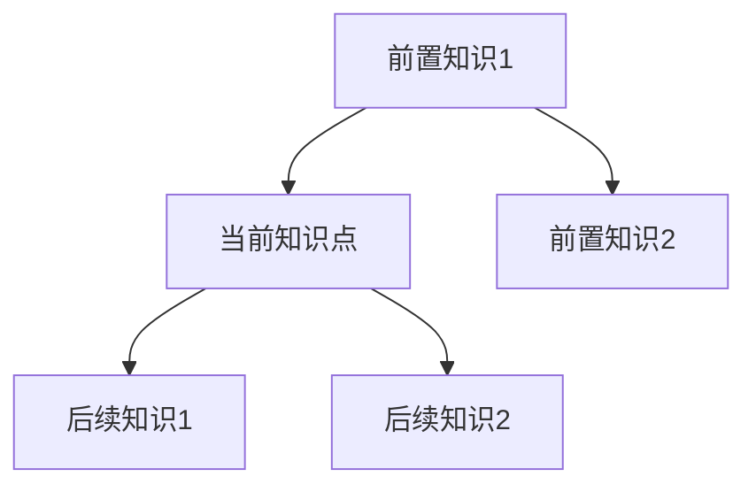
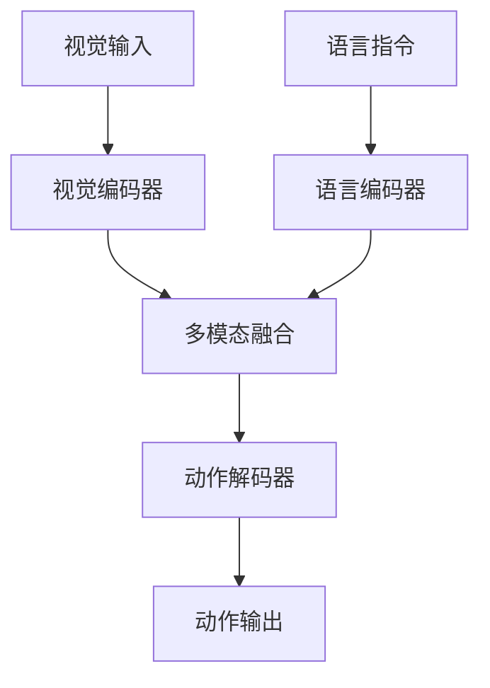

# VLA理论文档编写标准

> **文档说明**：本文档提供VLA学习项目中理论文档的详细编写标准，包括文档结构、术语表格式、数学推导要求等。所有理论文档必须严格按照此标准编写。

---

## 📋 核心原则

1. **理论详细程度**：比炒股板块的理论更详细
2. **文件格式**：使用`.ipynb`格式（理论+代码一体化）
3. **术语表**：每个文档开头必须有完整的术语表
4. **数学推导**：假设读者没有数学基础，从最基础的数学知识开始
5. **文件组织**：扁平化原则，能用单个文件解决的不用文件夹
6. **重点板块**：**4. 基本原理、5. 详细设计、6. 在VLA中的应用**是详细化的核心重点，必须确保小白也能学会，同时保持科研的严谨性和生动的直观理解

---

## 📚 文档结构要求

每个理论文档（`.ipynb`格式）必须包含以下部分，按顺序排列：

### 1. 术语表（必须，文档最开头）

**位置**：文档最开头，在概述之前

**内容**：本文档中出现的所有新名词的详细注释

**格式要求**：

```markdown
## 📚 术语表（按出现顺序）

### 1. [术语名称] ([英文全称])
- **中文名称**：[中文全称]
- **英文全称**：[英文全称]
- **定义**：[详细定义，至少50字]
- **核心组成/工作原理**：[详细说明，至少100字]
- **在VLA中的应用**：[说明在VLA中的具体作用]
- **相关概念**：[列出相关概念，便于理解]
- **首次出现位置**：本文档第X节
- **深入学习**：参考[相关文档链接]
- **直观理解**：[用类比、图示等方式帮助理解]
- **数学表示**：[如果有数学公式，给出数学表示]
```

**详细程度要求**：
- 每个术语至少200字的详细说明
- 必须包含：定义、工作原理、在VLA中的应用、相关概念
- 提供直观理解（类比、图示说明）
- 提供数学表示（如果有）

**组织方式**：
- 按术语在文档中出现的顺序排列
- 每个文档都要有完整的术语表（即使在其他文档中出现过）
- 全局术语表将在所有理论文档完成后补充

### 2. 概述部分

**要求**：
- 不仅说明"是什么"，还要说明"为什么重要"
- 在VLA体系中的位置和作用
- 与其他知识点的关系图（可用Mermaid）
- 学习本知识点的前置要求
- 学习目标和预期收获

**示例结构**：
```markdown
## 📋 概述

### 什么是[概念名称]
[详细定义和说明]

### 为什么重要
[在VLA体系中的重要性]

### 在VLA体系中的位置
[说明与其他知识点的关系]

### 学习目标
[明确学习后能掌握什么]
```

### 3. 概述部分（可适度增强，非重点）

**要求**：
- 不仅说明"是什么"，还要说明"为什么重要"
- 在VLA体系中的位置和作用
- 与其他知识点的关系图（可用Mermaid）
- 学习本知识点的前置要求
- 学习目标和预期收获

**注意**：概述部分可以适度增强，但不是重点完善对象。

**示例结构**：
```markdown
## 📋 概述

### 什么是[概念名称]
[详细定义和说明]

### 为什么重要
[在VLA体系中的重要性]

### 在VLA体系中的位置
[说明与其他知识点的关系]

### 学习目标
[明确学习后能掌握什么]
```

---

## 🎯 核心内容详细化要求（重点）

> **重要说明**：以下4、5、6三个板块是文档详细化的**核心重点**，必须严格按照要求编写，确保小白也能学会，同时保持科研的严谨性和生动的直观理解。

### 4. 基本原理（详细化的重点）

**核心要求**：
- **详细化的重点**：这是文档最需要详细化的部分
- **小白友好**：假设读者完全没有相关背景知识，从零开始解释
- **科研严谨**：所有数学推导必须完整、准确，不跳步
- **生动直观**：每个抽象概念必须有生活化类比和具体例子

**必须包含的内容**：

#### 4.1 从零开始理解
- **不假设任何前置知识**：从最基础的概念开始解释
- **逐步深入**：从简单到复杂，循序渐进
- **多角度解释**：用文字、数学、图示、类比等多种方式解释同一概念

#### 4.2 为什么这样设计
- **设计动机**：详细说明为什么需要这个概念/方法
- **问题背景**：说明要解决什么问题
- **方法对比**：对比其他可能的解决方案，说明为什么选择这个方法
- **优势分析**：详细分析这个方法的优势和局限性

#### 4.3 数学推导详解（必须完整、不跳步）
- **从基础数学开始**：
  - 不能假设读者知道任何数学概念
  - 每个数学符号都要详细说明
  - 每个数学操作都要解释为什么这样做
  
- **逐步推导**：
  - 每一步推导都要有详细说明
  - 不能直接给出公式，要说明为什么
  - 展示每个步骤的中间结果
  
- **具体计算示例**：
  - 不能只给公式，要有具体的数值计算
  - 至少提供2-3个不同参数的示例
  - 展示每个步骤的中间结果
  
- **几何意义和直观理解**：
  - 每个公式都要有几何意义或物理意义的解释
  - 用图示说明数学含义
  - 用生活化类比帮助理解

**结构模板**：
```markdown
## 4. 基本原理

### 4.1 从零开始理解[概念名称]

#### 4.1.1 什么是[概念名称]（通俗解释）
[用最通俗的语言解释，至少200字]
[提供至少2个生活化类比]
[提供至少2个具体例子]

#### 4.1.2 为什么需要[概念名称]
[详细说明设计动机，至少200字]
[说明要解决什么问题]
[对比其他可能的解决方案]

### 4.2 [概念名称]的数学推导详解

#### 4.2.1 背景知识回顾
在开始推导之前，我们需要回顾一些基础数学知识：
- [基础概念1]：[详细解释，假设读者完全不懂]
- [基础概念2]：[详细解释，假设读者完全不懂]

#### 4.2.2 问题定义
我们要解决的问题是：[问题描述]
[详细解释问题，至少100字]

#### 4.2.3 逐步推导过程

**步骤1：建立基础**
首先，我们需要理解[基础概念]：
[从最基础开始解释，至少150字]

**步骤2：理解[中间概念]**
[中间概念]的定义是：
[详细解释，至少150字]
[提供具体例子]

**步骤3：推导[关键步骤]**
从[步骤2]出发，我们可以得到：
[详细推导过程，每一步都要有说明，至少200字]
[展示中间结果]

**步骤4：最终公式**
综合以上步骤，我们得到：
[最终公式]
[详细解释公式的含义，至少150字]

#### 4.2.4 具体计算示例

**示例1：简单情况**
假设：[给出具体数值]
计算过程：
- 步骤1：[详细计算，展示中间结果]
- 步骤2：[详细计算，展示中间结果]
- 步骤3：[详细计算，展示中间结果]
最终结果：[结果]
结果解释：[解释结果的含义]

**示例2：复杂情况**
[类似示例1，但使用更复杂的参数]

#### 4.2.5 几何意义和直观理解
这个公式的几何意义是：[详细解释，至少150字]
[用图示说明]
[用生活化类比帮助理解]

### 4.3 为什么这样设计有效
[详细分析为什么这个方法有效，至少200字]
[提供理论依据]
[提供实验证据或直观解释]
```

### 5. 详细设计（需要详细化）

**核心要求**：
- **需要详细化**：这是文档详细化的重点之一
- **小白友好**：每个设计细节都要详细说明
- **科研严谨**：设计思路、实现细节、参数选择都要有理论依据
- **生动直观**：用代码、图示、例子说明设计过程

**必须包含的内容**：

#### 5.1 设计思路
- **为什么这样设计**：详细说明设计动机
- **有哪些选择**：列出所有可能的设计选择
- **为什么选这个**：详细分析为什么选择这个设计方案
- **设计权衡**：说明设计中的权衡和取舍

#### 5.2 实现细节
- **每个步骤详细说明**：不能只说"怎么做"，要说"为什么这样做"
- **用伪代码或Python代码说明**：代码要有详细注释
- **用例子演示每一步**：至少2个完整例子，从输入到输出

#### 5.3 参数选择
- **每个参数的含义**：详细说明每个参数的作用
- **如何选择参数值**：提供参数选择的指导原则
- **参数对结果的影响**：用例子说明不同参数值的影响

**结构模板**：
```markdown
## 5. 详细设计

### 5.1 设计思路

#### 5.1.1 为什么这样设计
[详细说明设计动机，至少200字]
[说明要解决什么问题]
[说明设计目标]

#### 5.1.2 有哪些设计选择
在设计[概念名称]时，我们有以下几种选择：
1. **选择1**：[详细说明]
   - 优点：[列出优点]
   - 缺点：[列出缺点]
   - 适用场景：[说明适用场景]

2. **选择2**：[详细说明]
   - 优点：[列出优点]
   - 缺点：[列出缺点]
   - 适用场景：[说明适用场景]

#### 5.1.3 为什么选择这个方案
我们选择[方案名称]的原因是：
[详细分析，至少200字]
[说明权衡和取舍]

### 5.2 实现细节

#### 5.2.1 整体架构
[用图示或文字说明整体架构]
[说明各个组件的作用]

#### 5.2.2 关键步骤详解

**步骤1：[步骤名称]**
- **目的**：[说明这一步的目的]
- **方法**：[详细说明怎么做]
- **为什么这样做**：[说明为什么]
- **代码实现**：
```python
# 详细注释说明每一步
def step1():
    # 步骤1.1：[详细说明]
    ...
    # 步骤1.2：[详细说明]
    ...
```
- **示例**：[用具体例子演示]

**步骤2：[步骤名称]**
[类似步骤1的详细说明]

#### 5.2.3 完整实现示例
[提供一个完整的实现示例，从输入到输出]
[详细注释每一步]
[说明预期结果]

### 5.3 参数选择

#### 5.3.1 参数列表
[列出所有参数，每个参数都要详细说明]

#### 5.3.2 参数选择指导
[提供参数选择的指导原则]
[说明如何根据应用场景选择参数]

#### 5.3.3 参数影响分析
**参数1：[参数名称]**
- **含义**：[详细说明]
- **取值范围**：[说明取值范围]
- **影响分析**：
  - 当参数值较小时：[说明影响，提供例子]
  - 当参数值较大时：[说明影响，提供例子]
  - 推荐值：[说明推荐值及原因]
```

### 6. 在VLA中的应用（需要详细化）

**核心要求**：
- **需要详细化**：这是文档详细化的重点之一
- **小白友好**：用完整例子说明应用过程
- **科研严谨**：说明应用的理论依据和实际效果
- **生动直观**：用流程图、代码、例子说明应用过程

**必须包含的内容**：

#### 6.1 应用场景
- **具体在什么情况下使用**：详细说明应用场景
- **用完整的例子说明**：至少2个完整例子，从输入到输出
- **场景特点分析**：说明每个场景的特点和需求

#### 6.2 应用流程
- **详细的步骤说明**：不能只说"怎么做"，要说"为什么这样做"
- **每一步的输入输出**：明确说明每一步的输入和输出
- **用图示或代码演示**：用流程图或代码演示应用过程

#### 6.3 实际案例
- **至少2个完整的实际案例**：每个案例都要完整
- **每个案例要有输入、处理过程、输出**：详细说明每个环节
- **说明为什么这样应用**：说明应用的理论依据

**结构模板**：
```markdown
## 6. 在VLA中的应用

### 6.1 应用场景

#### 6.1.1 场景1：[场景名称]
**场景描述**：[详细描述场景，至少150字]
**为什么需要[概念名称]**：[说明为什么在这个场景中需要这个概念]
**场景特点**：[说明场景的特点和需求]

#### 6.1.2 场景2：[场景名称]
[类似场景1的详细说明]

### 6.2 应用流程

#### 6.2.1 整体流程
[用流程图或文字说明整体流程]
[说明各个步骤的作用]

#### 6.2.2 详细步骤

**步骤1：[步骤名称]**
- **输入**：[明确说明输入是什么]
- **处理**：[详细说明处理过程]
- **输出**：[明确说明输出是什么]
- **为什么这样做**：[说明为什么]
- **代码示例**：
```python
# 详细注释说明
def step1(input):
    # 处理过程
    ...
    return output
```

**步骤2：[步骤名称]**
[类似步骤1的详细说明]

#### 6.2.3 完整应用示例
[提供一个完整的应用示例，从输入到输出]
[详细注释每一步]
[说明预期结果]

### 6.3 实际案例

#### 案例1：[案例名称]
**背景**：[说明案例背景]
**输入**：[详细说明输入]
**处理过程**：
- 步骤1：[详细说明]
- 步骤2：[详细说明]
- 步骤3：[详细说明]
**输出**：[详细说明输出]
**结果分析**：[分析结果，说明为什么得到这个结果]
**应用效果**：[说明应用效果]

#### 案例2：[案例名称]
[类似案例1的详细说明]

### 6.4 应用优势与注意事项
**应用优势**：[列出应用优势，至少3点]
**注意事项**：[列出注意事项，至少3点]
**常见问题**：[列出常见问题和解决方案]
```

### 7. 总结（可适量增加，不做重点填充）

**要求**：
- 可适量增加内容，但不做重点填充
- 总结核心要点
- 提供学习建议

**结构**：
```markdown
## 7. 总结

### 7.1 核心要点
[用3-5句话总结核心内容]

### 7.2 学习建议
[提供学习建议]
```

### 8. 其他部分（可适量增加，不做重点填充）

**要求**：
- 可适量增加内容，但不做重点填充
- 如知识关联图、扩展阅读等

### 4. 数学推导（必须详细）

**假设**：读者没有数学基础，是"蠢蛋"

**要求**：
- 从最基础的数学知识开始推导
- 每一步推导都要有详细说明
- 不能直接给出公式，要说明为什么
- 提供直观的几何/物理意义
- 复杂公式给出思路和关键步骤

**详细度标准（参考CNN特征提取详解）**：
- **必须包含具体计算示例**：不能只给公式，要有具体的数值计算过程
  - 例如：5x5图像、3x3卷积核的具体计算步骤
  - 展示局部区域提取、逐元素相乘、求和等每个步骤
- **必须从基础数学概念开始**：
  - 解释矩阵、向量、加权和等基础概念
  - 解释局部区域、滑动窗口等图像处理基础概念
- **必须包含几何意义和直观理解**：
  - 每个公式都要有几何意义或物理意义的解释
  - 用类比、图示等方式帮助理解
- **必须包含参数说明和示例**：
  - 每个参数都要有详细说明
  - 提供多个不同参数的示例（如不同步长、不同填充的效果）

**推导步骤格式**：
```markdown
### 数学推导：[公式名称]

#### 步骤1：理解基础概念
首先，我们需要理解什么是[基础概念]...
[详细解释，假设读者完全不懂]

#### 步骤2：理解[中间概念]
[中间概念]的定义是...
[详细解释]

#### 步骤3：为什么这样定义
这样定义的原因是为了...
[详细解释]

#### 步骤4：推导过程
从[步骤2]到[步骤3]的推导过程：
[每一步都要有详细说明]

#### 步骤5：在VLA中的应用
在VLA中，这个公式用于...
[详细解释和应用示例]
```

**示例**：
- 解释矩阵乘法时，要先解释什么是矩阵、什么是乘法
- 解释梯度下降时，要先解释什么是导数、什么是梯度
- 每一步推导都要有说明，不能跳跃

### 5. 实际应用

**要求**：
- 在VLA中的具体应用场景
- 代码示例（整合在`.ipynb`中）
- 常见问题和注意事项
- 与其他技术的对比

**结构**：
```markdown
### 实际应用

#### 应用场景1：[场景名称]
[详细说明]

#### 代码示例
[可运行的代码，带详细注释]

#### 常见问题
[列出常见问题和解决方案]

#### 注意事项
[需要注意的要点]
```

### 6. 知识关联图

**要求**：
- 与前置知识的关系
- 与后续知识的关系
- 在整个VLA体系中的位置

**格式**：可以使用Mermaid图表

```markdown
### 知识关联图


```

---

## 📝 术语表编写规范

### 术语表格式模板

```markdown
## 📚 术语表（按出现顺序）

### 1. Vision-Language-Action (VLA) 模型
- **中文名称**：视觉-语言-动作模型
- **英文全称**：Vision-Language-Action Model
- **定义**：一种能够同时理解视觉信息、语言指令并生成动作序列的多模态AI模型。它结合了计算机视觉、自然语言处理和机器人控制三个领域的技术，能够根据视觉输入和语言指令，生成相应的动作序列来控制机器人执行任务。
- **核心组成**：
  - Vision（视觉）：图像/视频理解模块，负责从视觉输入中提取特征
  - Language（语言）：自然语言理解模块，负责理解语言指令的语义
  - Action（动作）：动作生成/执行模块，负责根据视觉和语言信息生成动作序列
- **工作原理**：[详细说明工作原理，至少100字]
- **在VLA中的应用**：VLA模型是本文档的核心主题，是整个VLA学习体系的基础。它能够将视觉、语言和动作三个模态统一在一个模型中，实现端到端的学习和推理。
- **相关概念**：多模态学习、端到端学习、强化学习、具身智能
- **首次出现位置**：本文档第1节
- **深入学习**：参考[多模态学习基础](../00A_前置知识补充/05_多模态学习基础补充/)
- **直观理解**：想象一个机器人助手，它能够"看到"周围的环境（视觉），"听懂"你的指令（语言），然后"做出"相应的动作（动作）。VLA模型就是让机器人具备这种能力的技术。
- **数学表示**：[如果有，给出数学表示]
```

### 术语表详细程度要求

每个术语必须包含以下内容：

1. **基本信息**（必须）
   - 中文名称
   - 英文全称
   - 定义（至少50字）

2. **详细说明**（必须）
   - 核心组成/工作原理（至少100字）
   - 在VLA中的应用（至少50字）
   - 相关概念（列出3-5个）

3. **辅助理解**（推荐）
   - 直观理解（类比、图示说明）
   - 数学表示（如果有）
   - 深入学习链接

4. **总字数要求**：每个术语至少200字

---

## 🔢 数学推导编写规范

### 数学推导详细程度要求

**核心原则**：假设读者没有数学基础，是"蠢蛋"

**要求**：
1. **从最基础开始**：不能假设读者知道任何数学概念
2. **逐步推导**：每一步都要有详细说明
3. **直观理解**：提供几何意义、物理意义
4. **实际应用**：说明在VLA中的具体应用

### 数学推导步骤模板

```markdown
### 数学推导：[公式名称]

#### 背景知识回顾
在开始推导之前，我们需要回顾一些基础数学知识：
- [基础概念1]：[详细解释]
- [基础概念2]：[详细解释]

#### 步骤1：理解问题
我们要解决的问题是：[问题描述]
[详细解释问题]

#### 步骤2：建立基础
首先，我们需要理解[基础概念]：
[从最基础开始解释，假设读者完全不懂]

#### 步骤3：逐步推导
从[步骤2]出发，我们可以得到：
[详细推导过程，每一步都要有说明]

#### 步骤4：验证和理解
这个公式的含义是：[解释公式的直观意义]
[提供几何意义、物理意义等直观理解]

#### 步骤5：在VLA中的应用
在VLA中，这个公式用于：
[具体应用场景和代码示例]
```

### 数学推导示例

**示例1：矩阵乘法**

```markdown
### 数学推导：矩阵乘法

#### 背景知识回顾
在开始推导之前，我们需要回顾一些基础数学知识：
- **标量**：一个单独的数字，如 3、-5、2.7
- **向量**：一列数字，如 [1, 2, 3]
- **矩阵**：一个二维数组，由行和列组成

#### 步骤1：理解矩阵
首先，我们需要理解什么是矩阵：
矩阵是一个由数字排列成的矩形阵列。例如：
```
A = [1  2]
    [3  4]
```
这是一个2×2的矩阵（2行2列）。

#### 步骤2：理解矩阵乘法
矩阵乘法的定义是：
[详细解释矩阵乘法的定义和规则]

#### 步骤3：为什么这样定义
这样定义的原因是为了：
[解释矩阵乘法的几何意义和实际应用]

#### 步骤4：在VLA中的应用
在VLA中，矩阵乘法用于：
[具体应用场景和代码示例]
```

---

## 📁 文件组织规范

### 文件格式选择

**理论文档**：
- **需要可视化**：使用`.ipynb`格式（理论+代码一体化）
- **纯理论**：如果不需要可视化，可以用`.md`文件

**实战案例**：
- **简单/中等项目**：使用单个`.ipynb`文件
- **进阶/综合项目**：使用文件夹结构（包含README.md、代码、数据等）

### 文件命名规范

```
理论文档：
- 纯理论：`概念名称.md`（如：`VLA基本概念详解.md`）
- 需要可视化：`概念名称.ipynb`（如：`视觉编码器原理.ipynb`）

实战案例：
- 简单/中等：`项目名称.ipynb`
- 进阶/综合：`项目名称/`（文件夹，包含README.md、代码、数据等）
```

### 扁平化原则

**原则**：能用单个文件解决的，不用文件夹

**判断标准**：
- 单个知识点：使用单个文件
- 需要多个文件（代码+数据+文档）：使用文件夹
- 简单项目：单个`.ipynb`文件
- 复杂项目：文件夹结构

---

## 📓 Jupyter Notebook编写规范

### Markdown单元格要求

**每个代码块前必须有详细的Markdown说明**：

```markdown
## 1. 理解[概念名称]

### 1.1 什么是[概念名称]
[详细的理论讲解，至少200字]

### 1.2 为什么重要
[说明在VLA中的重要性]

### 1.3 工作原理
[详细的工作原理说明]

### 1.4 代码示例说明
下面的代码将演示[功能]，我们将：
1. [步骤1说明]
2. [步骤2说明]
3. [步骤3说明]

预期结果：[说明预期看到什么]
```

**代码后要有结果解释**：

```markdown
### 结果分析
从上面的结果可以看出：
1. [分析点1]
2. [分析点2]
3. [分析点3]

这个结果说明了：[总结]
```

### 代码单元格要求

**详细的中文注释**：

```python
# ============================================
# 步骤1：导入必要的库
# ============================================
# 这里我们导入numpy用于数值计算
import numpy as np

# ============================================
# 步骤2：定义[功能名称]
# ============================================
# 这个函数的作用是：[详细说明]
# 参数说明：
#   - param1: [参数1的说明]
#   - param2: [参数2的说明]
# 返回值：[返回值的说明]
def function_name(param1, param2):
    # 步骤2.1：[详细说明这一步做什么]
    result = param1 + param2
    
    # 步骤2.2：[详细说明这一步做什么]
    return result
```

**可视化代码要解释图表含义**：

```python
# 绘制图表
import matplotlib.pyplot as plt

# 创建图形
fig, ax = plt.subplots(figsize=(10, 6))

# 绘制数据
# 这个图表展示了[什么]，横轴表示[什么]，纵轴表示[什么]
ax.plot(x, y, label='数据标签')

# 设置标题和标签
# 标题说明了[什么]
ax.set_title('图表标题：说明这个图表展示什么')
ax.set_xlabel('横轴标签：说明横轴的含义')
ax.set_ylabel('纵轴标签：说明纵轴的含义')

plt.show()
# 从图表可以看出：[解释图表的含义和结论]
```

---

## 🎨 可视化判断标准

### 使用Mermaid（在Markdown中）

**适用场景**：
- 架构图
- 流程图
- 关系图
- 概念图

**示例**：
```markdown

```

### 使用Python绘图（在Jupyter中）

**适用场景**：
- 数学公式的几何意义
- 数据分布
- 训练过程
- 性能对比
- 复杂图表

**判断标准**：
- 能用Mermaid解决的：在Markdown中使用Mermaid
- 需要动态/复杂可视化的：使用Python绘图
- 纯文字说明：使用Markdown文件

---

## ✅ 质量检查清单

在完成理论文档后，请检查以下项目：

### 内容完整性
- [ ] 文档开头有完整的术语表
- [ ] 每个术语至少200字详细说明
- [ ] 概述部分说明了"是什么"和"为什么重要"
- [ ] 核心内容有定义、原理、直观理解、实际应用
- [ ] 数学推导从最基础开始，每一步都有说明
- [ ] 有知识关联图

### 详细程度
- [ ] 理论讲解比炒股板块更详细
- [ ] 数学推导假设读者没有数学基础
- [ ] 每个概念都有多个角度的解释
- [ ] 代码有详细的中文注释
- [ ] **核心概念必须有详细的分步骤讲解**（如1.1、1.2、1.3等子章节）
- [ ] **每个数学公式必须有完整的推导过程**（从基础概念开始，不能直接给出公式）
- [ ] **每个操作必须有具体计算示例**（如5x5图像、3x3卷积核的具体计算过程）
- [ ] **每个概念必须有可视化代码**（展示计算过程、结果对比等）
- [ ] **每个章节至少包含3-5个子章节**（如定义、原理、数学推导、可视化、应用等）

### 重点板块详细化（4、5、6板块）
- [ ] **4. 基本原理**：
  - [ ] 从零开始解释，不假设任何前置知识
  - [ ] 每个抽象概念至少有2个生活化类比
  - [ ] 每个概念至少有2个具体例子（从简单到复杂）
  - [ ] 数学推导完整、不跳步，每一步都有详细说明
  - [ ] 每个公式都有几何意义或物理意义的解释
  - [ ] 至少2-3个具体计算示例（不同参数）
- [ ] **5. 详细设计**：
  - [ ] 设计思路详细说明（为什么这样设计，有哪些选择，为什么选这个）
  - [ ] 实现细节详细说明（每个步骤都要说明为什么这样做）
  - [ ] 用伪代码或Python代码说明（代码要有详细注释）
  - [ ] 至少2个完整例子演示每一步（从输入到输出）
  - [ ] 参数选择详细说明（每个参数的含义、如何选择、对结果的影响）
- [ ] **6. 在VLA中的应用**：
  - [ ] 至少2个应用场景详细说明
  - [ ] 应用流程详细说明（每一步的输入输出）
  - [ ] 至少2个完整的实际案例（输入→处理→输出）
  - [ ] 说明为什么这样应用（理论依据）
  - [ ] 用流程图或代码演示应用过程

### 文件格式
- [ ] 使用`.ipynb`格式（理论+代码一体化）
- [ ] Markdown单元格有详细的理论讲解
- [ ] 代码单元格有详细的中文注释
- [ ] 可视化代码解释了图表含义

### 文件组织
- [ ] 遵循扁平化原则
- [ ] 文件命名符合规范
- [ ] 简单/中等项目使用单个`.ipynb`文件
- [ ] 进阶/综合项目使用文件夹结构

---

## 📚 参考示例

### 好的理论文档示例（参考CNN特征提取详解）

**详细度标准**：

1. **术语表完整**：
   - 所有新名词都有详细解释（每个至少200字）
   - 包含定义、核心组成、在VLA中的应用、相关概念、直观理解等

2. **数学推导详细**：
   - 从最基础的数学概念开始（如矩阵、向量、加权和）
   - 每一步推导都有详细说明
   - **包含具体计算示例**（如5x5图像、3x3卷积核的具体计算过程）
   - 展示每个步骤的中间结果
   - 提供多个不同参数的示例

3. **理论讲解深入**：
   - 不仅说"是什么"，还说"为什么"和"怎么用"
   - **每个核心概念包含至少5个子章节**（定义、为什么需要、数学推导、直观理解、可视化、应用）
   - 每个子章节都有详细的内容（至少100字）

4. **代码注释详细**：
   - 每个重要步骤都有说明
   - 代码要展示计算过程，不仅仅是结果
   - 包含详细的步骤说明和预期结果解释

5. **可视化恰当**：
   - 每个核心操作都有可视化代码
   - 可视化要展示计算过程和结果对比
   - 用图表帮助理解，但不过度使用

**参考文档**：
- `01_图像特征提取/02_CNN特征提取/理论笔记/CNN特征提取详解.ipynb`
  - 卷积操作详解：包含从基础数学开始的详细推导、具体计算示例、可视化代码
  - 激活函数详解：包含数学定义、导数、优势、问题、可视化
  - 池化操作详解：包含定义、数学推导、优势、可视化
  - 层次化特征详解：包含数学表示、可视化代码
  - ResNet详解：包含核心思想、数学证明、为什么有效

### 需要改进的文档

1. **术语表缺失或不完整**
2. **数学推导跳跃**：直接给出公式，没有推导过程
3. **理论讲解浅显**：只说"是什么"，不说"为什么"
4. **代码注释不足**：代码没有详细注释
5. **可视化过度或不足**：该用图表的地方没用，不该用的地方用了

---

## 🔄 更新记录

- **2025-01-27**：创建文档，制定理论文档编写标准
- **2025-01-27**：更新详细度要求，参考CNN特征提取详解文档的标准
  - 添加核心概念分步骤讲解要求
  - 添加数学推导必须包含具体计算示例的要求
  - 添加可视化代码必须展示计算过程的要求
  - 添加每个章节至少包含3-5个子章节的要求
- **2025-01-27**：添加重点板块详细化要求（v1.2）
  - **明确4、5、6板块是详细化的核心重点**
  - 添加"4. 基本原理"详细化要求（从零开始、生活化类比、具体例子、完整数学推导）
  - 添加"5. 详细设计"详细化要求（设计思路、实现细节、参数选择）
  - 添加"6. 在VLA中的应用"详细化要求（应用场景、应用流程、实际案例）
  - 明确要求：小白也能学会 + 科研严谨性 + 生动直观理解
  - 明确1、2板块不需要改动，3板块可适度增强，7、8板块可适量增加但不做重点
- **版本**：v1.2

---

**最后更新时间**：2025-01-27  
**文档版本**：v1.2  
**维护者**：AI助手

